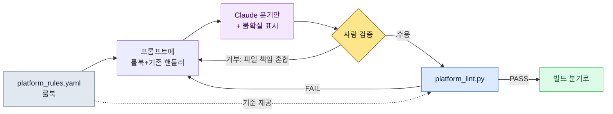

# 14.2 플랫폼별 차이 (iOS / Android / PC)

알파 빌드를 처음 PC에 올린 날, 기획팀 메신저 채널에 스크린샷 한 장이 올라왔다. 모바일에서 화면 하단을 꽉 채우던 가상 조이스틱이 27인치 모니터 한가운데 손바닥만 하게 떠 있었다. 누군가 한 줄 달았다. "이거 마우스로 어떻게 잡아요?" 코어 로직은 멀쩡했다. 전투도, 인벤토리도, 퀘스트도 그대로 돌았다. 무너진 건 단 하나, 입력과 화면을 모바일 전제로 고정해 둔 자리였다.

같은 게임을 iOS·Android·PC 세 곳에 내보내면 운영 단위가 ×3이 될 것 같지만 실제로는 그렇지 않다. 코어 로직은 1개고, 거기에 플랫폼 적응 레이어가 ×3으로 붙는다. 문제는 "어디까지가 코어고 어디부터가 적응 레이어냐"를 사람이 일일이 판단하기 어렵다는 점이다. iOS는 되고 Android만 깨지는 분기, PC에서만 의미 있는 키 매핑 — 이런 차이는 머릿속에 다 들어오지 않는다. 그래서 이 챕터의 핵심은 플랫폼 제약을 **룰북(rulebook)으로 명문화**하고, 그 룰북을 근거로 AI가 분기안을 생성하게 하고, 마지막에 **lint가 룰 위반을 잡아내는** 워크플로다.

---

## 14.2.1 세 플랫폼은 무엇이 다른가

먼저 차이의 지형을 본다. 아래는 프로젝트 A(저자가 디자인 디렉터로 참여 중인 모바일 우선 MMORPG)에서 PC 보조 출시를 검토하며 정리한 플랫폼 제약표다. 수치 중 공개 표준에 근거한 것은 출처를 함께 적었고, 그 외는 프로젝트 내부 합의값이다.

| 영역 | iOS | Android | PC |
|---|---|---|---|
| 입력 | 터치 | 터치(+일부 키보드) | 키보드·마우스·게임패드 |
| 최소 터치 타깃 | 44pt (Apple HIG) | 48dp (Material) | 클릭 — 해당 없음 |
| 화면 | 4.7\~6.7인치 | 4.5\~7인치 (편차 큼) | 21\~32인치 |
| 결제 | App Store | Google Play | 자체·Steam |
| 알림 | APNs | FCM | OS·자체 |
| 저장 | iCloud | Google Drive·자체 | Steam Cloud·자체 |
| OS 교체 주기 | 1\~2년 | 1년 (단편화 큼) | 5\~10년 |

iOS와 Android는 결제·저장·알림의 *API*가 다르지만 사용자가 보는 화면과 조작은 거의 같다. PC는 입력·화면·시각 효과가 통째로 다르다. 그래서 운영 부담은 직관과 달리 ×3이 아니라 ×2에 가깝다 — iOS와 Android 사이의 거리가 짧기 때문이다.

여기서 중요한 건 표 자체가 아니라, 이 표를 **사람이 읽는 문서가 아니라 기계가 읽는 룰북**으로 바꾸는 일이다. 그래야 AI가 분기안을 만들 때 근거로 삼고, lint가 위반을 잡을 수 있다.

---

## 14.2.2 코어와 플랫폼 레이어를 가르는 선

프로젝트 A의 폴더 구조는 코어 1개에 플랫폼 적응 레이어 3개를 붙이는 형태다.

```
game/
├── core/                  — 게임 로직 (플랫폼 무관)
│   ├── combat/  inventory/  narrative/  ...
├── platform/              — 플랫폼 적응 레이어
│   ├── ios/      → input/  payment/  notification/
│   ├── android/  → input/  payment/  notification/
│   └── pc/       → input/  payment/  ui/
└── shared/                — 양쪽 사용 (유틸·렌더링)
```

규칙은 하나다. **core는 platform을 이름으로 부르지 않는다.** core가 `if platform == "ios"` 같은 문장을 갖는 순간 레이어 분리가 무너진다. 입력을 예로 들면, core는 "스킬1을 쓴다"는 의도(`InputIntent.SKILL_1`)만 알고, 그 의도를 터치 좌표에서 뽑을지 키보드 `1`에서 뽑을지는 각 platform 레이어가 책임진다.

이 선을 그어 두면 다음 단계가 가능해진다. 새 플랫폼을 추가할 때 core를 건드리지 않고 `platform/` 아래 폴더 하나만 채우면 된다. 아래는 이 선이 실제로 어떻게 갈라지는지를 한 장으로 본 그림이다.

<svg viewBox="0 0 720 360" xmlns="http://www.w3.org/2000/svg" font-family="sans-serif" font-size="13">
  <rect x="0" y="0" width="720" height="360" fill="#fbfbfd"/>
  <!-- core -->
  <rect x="270" y="20" width="180" height="70" rx="8" fill="#1d3557" />
  <text x="360" y="50" fill="#fff" text-anchor="middle" font-weight="bold">core/</text>
  <text x="360" y="70" fill="#cdd9e8" text-anchor="middle" font-size="11">게임 로직 · 플랫폼 무관</text>
  <text x="360" y="84" fill="#cdd9e8" text-anchor="middle" font-size="11">InputIntent · PaymentInterface</text>
  <!-- arrows down -->
  <line x1="360" y1="90" x2="130" y2="150" stroke="#888" stroke-width="1.5" marker-end="url(#a)"/>
  <line x1="360" y1="90" x2="360" y2="150" stroke="#888" stroke-width="1.5" marker-end="url(#a)"/>
  <line x1="360" y1="90" x2="590" y2="150" stroke="#888" stroke-width="1.5" marker-end="url(#a)"/>
  <defs>
    <marker id="a" markerWidth="8" markerHeight="8" refX="6" refY="3" orient="auto">
      <path d="M0,0 L6,3 L0,6 Z" fill="#888"/>
    </marker>
  </defs>
  <!-- platform boxes -->
  <g>
    <rect x="40" y="150" width="180" height="120" rx="8" fill="#e8f0f8" stroke="#1d3557"/>
    <text x="130" y="173" text-anchor="middle" font-weight="bold" fill="#1d3557">platform/ios</text>
    <text x="130" y="196" text-anchor="middle" font-size="11">touch → intent</text>
    <text x="130" y="214" text-anchor="middle" font-size="11">StoreKit · APNs</text>
    <text x="130" y="232" text-anchor="middle" font-size="11">타깃 ≥ 44pt</text>
    <text x="130" y="256" text-anchor="middle" font-size="10" fill="#777">iCloud 저장</text>
  </g>
  <g>
    <rect x="270" y="150" width="180" height="120" rx="8" fill="#e8f0f8" stroke="#1d3557"/>
    <text x="360" y="173" text-anchor="middle" font-weight="bold" fill="#1d3557">platform/android</text>
    <text x="360" y="196" text-anchor="middle" font-size="11">touch → intent</text>
    <text x="360" y="214" text-anchor="middle" font-size="11">Play Billing · FCM</text>
    <text x="360" y="232" text-anchor="middle" font-size="11">타깃 ≥ 48dp</text>
    <text x="360" y="256" text-anchor="middle" font-size="10" fill="#777">단편화 대응</text>
  </g>
  <g>
    <rect x="500" y="150" width="180" height="120" rx="8" fill="#f8efe8" stroke="#9a4f1d"/>
    <text x="590" y="173" text-anchor="middle" font-weight="bold" fill="#9a4f1d">platform/pc</text>
    <text x="590" y="196" text-anchor="middle" font-size="11">key/mouse → intent</text>
    <text x="590" y="214" text-anchor="middle" font-size="11">Steam · OS 알림</text>
    <text x="590" y="232" text-anchor="middle" font-size="11">게임패드 · 키매핑 UI</text>
    <text x="590" y="256" text-anchor="middle" font-size="10" fill="#777">해상도 다양</text>
  </g>
  <!-- shared -->
  <rect x="270" y="300" width="180" height="44" rx="8" fill="#ddd" />
  <text x="360" y="327" text-anchor="middle" fill="#333">shared/ — 유틸·렌더링</text>
  <text x="360" y="290" text-anchor="middle" font-size="10" fill="#9a4f1d">PC는 입력·화면·시각이 통째로 다름 (주황)</text>
</svg>

iOS와 Android 박스는 같은 파란 계열이고 PC만 주황이다 — 차이의 크기를 색으로 표시했다. 운영 부담의 비대칭이 여기서 한눈에 보인다.

---

## 14.2.3 룰북: 차이를 기계가 읽게 만들기

핵심 전환점은 여기다. 플랫폼 제약을 산문 문서에 적어 두면 사람이 잊는다. 대신 **선언적 룰북 파일** 하나에 모은다. 프로젝트 A에서 쓰는 `platform_rules.yaml`의 발췌다(실제 파일에서 본 챕터용으로 핵심 규칙만 추렸다).

```yaml
# platform/platform_rules.yaml
targets:
  ios:
    min_touch_pt: 44          # Apple HIG
    contrast_ratio: 4.5       # WCAG SC1.4.3
    gamepad: optional         # iOS 17+ 표준
    forbidden_in_core: ["import platform.ios", "StoreKit", "APNs"]
  android:
    min_touch_dp: 48          # Material
    contrast_ratio: 4.5
    forbidden_in_core: ["import platform.android", "BillingClient", "FCM"]
  pc:
    min_target_px: 24         # WCAG SC2.5.8 (포인터)
    input: ["keyboard", "mouse", "gamepad"]
    forbidden_in_core: ["import platform.pc", "SteamAPI"]
required_intents: ["MOVE_FORWARD", "ATTACK", "SKILL_1", "SKILL_2"]
```

이 파일이 세 가지를 동시에 한다. (1) AI가 분기안을 만들 때 읽는 **사양**, (2) lint가 검증하는 **기준**, (3) 사람이 합의를 기록하는 **단일 출처**다. `forbidden_in_core`가 특히 중요하다 — core 폴더 안에서 절대 등장하면 안 되는 토큰 목록이라, 레이어 침범을 기계적으로 잡는 근거가 된다.

---

## 14.2.4 워크드 트랜스크립트: 룰북 → AI 분기안 → 검증

이제 실제 작업을 처음부터 끝까지 따라간다. 상황은 이렇다. PC 보조 출시를 준비하면서, 모바일에만 있던 입력 핸들러를 PC용으로 분기해야 한다. 룰북을 근거로 Claude에게 PC 입력 어댑터 초안을 받고, lint로 검증하고, 거부·재요청까지 한 사이클을 돈다.

### 1) 프롬프트 (전문)

> 아래는 우리 프로젝트의 플랫폼 룰북 발췌와 기존 iOS 입력 핸들러야.
>
> [platform_rules.yaml 위 발췌 붙여넣음]
>
> ```python
> # platform/ios/input/touch_handler.py
> from core.input.input_intent import InputIntent
>
> def map_touch_to_intent(touch_event):
>     if touch_event.location in skill_button_1_area:
>         return InputIntent.SKILL_1
>     if touch_event.is_drag_up:
>         return InputIntent.MOVE_FORWARD
>     return None
> ```
>
> 이걸 참고해서 `platform/pc/input/keyboard_handler.py` 초안을 만들어 줘. 제약: (1) core를 import하되 platform.ios/android를 절대 import하지 말 것, (2) `required_intents` 4개를 모두 매핑할 것, (3) 키 매핑은 사용자가 바꿀 수 있게 dict로 분리할 것. 확신 없는 부분은 표시해 줘.

### 2) Claude의 날것 출력 (요약·정리 없이)

> 초안입니다. 키 매핑을 모듈 상단 dict로 빼서 사용자 커스터마이즈가 가능하게 했습니다.
>
> ```python
> # platform/pc/input/keyboard_handler.py
> from core.input.input_intent import InputIntent
>
> DEFAULT_KEYMAP = {
>     "w": InputIntent.MOVE_FORWARD,
>     "1": InputIntent.SKILL_1,
>     "2": InputIntent.SKILL_2,
>     # ATTACK은 마우스 좌클릭으로 가정 — 키보드 기본 미지정
> }
>
> def map_keyboard_to_intent(key_event, keymap=DEFAULT_KEYMAP):
>     return keymap.get(key_event.key.lower())
>
> def map_mouse_to_intent(mouse_event):
>     if mouse_event.button == "left":
>         return InputIntent.ATTACK
>     return None
> ```
>
> ⚠️ 확신 없는 부분: `required_intents`에 ATTACK이 들어 있는데, 저는 이걸 키보드가 아니라 **마우스**로 매핑했습니다. 룰북의 `required_intents`가 "입력 장치 무관하게 매핑되면 OK"인지, "단일 핸들러 안에서 다 처리"인지 명세가 없어 전자로 가정했습니다. 후자라면 lint가 ATTACK 누락으로 잡을 수 있습니다.

### 3) 사람 검증 / 거부

여기서 Claude가 짚은 ⚠️ 지점이 정확히 함정이었다. 우리 lint(`platform_lint.py`)는 핸들러 **파일 단위**가 아니라 **플랫폼 단위**로 `required_intents` 충족을 검사한다. ATTACK이 `keyboard_handler.py`에 없어도 `mouse_handler` 쪽에 있으면 통과다. 그런데 Claude가 만든 출력은 마우스 매핑을 `keyboard_handler.py` 파일 안에 같이 넣어 버렸다 — 파일 책임이 섞였다. 구조는 통과하겠지만 우리 폴더 규칙(입력 장치별 파일 분리)을 어긴다. **거부.**

거부 사유는 두 줄로 명확하다. (1) 마우스 매핑은 별도 `mouse_handler.py`로 분리할 것. (2) ATTACK을 키보드에서도 쓸 수 있게 `Space`를 fallback으로 둘 것.

### 4) 재요청 → lint 통과

재요청 후 받은 분리본을 `platform_lint.py`에 걸었다. lint는 룰북을 읽어 다음을 검사한다.

```
$ python platform_lint.py platform/pc/
[core-leak]    PASS  — core/ 안에 forbidden 토큰 0건
[intent-cover] PASS  — pc: MOVE_FORWARD, ATTACK, SKILL_1, SKILL_2 (4/4)
[touch-target] SKIP  — pc는 min_target_px=24 (UI 레이어에서 별도 검사)
[no-cross-import] PASS — platform.pc가 platform.ios/android 미참조
```

`intent-cover`가 4/4로 떨어지는 게 핵심이다. AI가 만든 초안이 룰북 기준을 충족하는지를 사람의 눈이 아니라 스크립트가 확정했다. 이 한 줄이 멀티 플랫폼 운영에서 사람이 매번 머릿속으로 검산하던 일을 대체한다.

이 사이클을 그림으로 압축하면 다음과 같다.



룰북이 프롬프트와 lint **양쪽**에 기준을 공급하는 점이 이 구조의 중심이다. AI가 생성하고, 사람이 판단하고, lint가 확정한다 — 세 역할이 같은 룰북을 본다.

---

## 14.2.5 빌드 분기: 같은 코어, 다른 조립

핸들러가 갖춰지면 빌드는 단순한 조립이다. core와 shared는 고정이고, platform 폴더 하나만 갈아 끼운다.

```
[core/ + shared/ + platform/ios/]      → iOS 빌드
[core/ + shared/ + platform/android/]  → Android 빌드
[core/ + shared/ + platform/pc/]       → PC 빌드
```

CI에서는 이 셋을 **순차가 아니라 병렬**로 돌리고, 각 빌드 직후 `platform_lint.py`를 자동 실행한다. 순차로 돌리면 빌드 시간이 3배가 되고, lint를 빼면 룰 위반이 배포 단계까지 살아남는다. 병렬 빌드 + 자동 lint, 이 두 가지가 멀티 플랫폼 CI의 최소 요건이다.

출시 사이클은 플랫폼마다 다르므로 빌드가 통과했다고 동시 배포하지 않는다. iOS 심사는 보통 1\~3일이라 잦은 출시에 보수적이고, Android는 수 시간 안에 반영되어 더 자주 낼 수 있으며, Steam은 1\~2일 선이다. 같은 변경이라도 iOS가 가장 늦게 나가는 셈이라, 핫픽스 일정은 항상 iOS 기준으로 역산한다.

---

## 14.2.6 UI 변종: 공통 80 · 변종 15 · 전용 5

코드 아래에서 화면도 갈라진다. 경험상 권장 분포는 공통 컴포넌트 80%, 플랫폼 변종(크기·위치만 다름) 15%, 플랫폼 전용 5%다. 다만 이 비율은 장르에 따라 흔들린다 — 캐주얼 퍼즐이면 공통이 90%까지 올라가고, MMORPG는 입력 차이 때문에 변종이 더 늘어난다.

전용 컴포넌트는 플랫폼의 매력을 살리는 자리라 무조건 공통화하는 게 답은 아니다. 모바일의 가상 조이스틱·진동, PC의 키 매핑 UI·게임패드 설정처럼 그 플랫폼에서만 의미 있는 것들이 여기 들어간다. 다만 전용이 30%를 넘어가면 그건 매력이 아니라 운영 부담의 신호다 — lint에 `platform-specific-ratio` 경고를 걸어 두면 사람이 잊어도 빌드가 짚어 준다.

여기까지가 AI 보조의 한계선이기도 하다. 플랫폼 차이는 대부분 결정론적 룰 영역이라, AI가 자유롭게 후보를 탐색하기보다 룰북을 충족하는 분기안을 **생성**하는 데 쓰인다. 입력 매핑 추천, Figma 시안의 플랫폼 변종 변환, 다국어×다플랫폼 텍스트 적응 정도가 AI가 실질적으로 보태는 지점이고, 그 출력은 항상 lint를 통과해야 한다. 진보적 자동화 이전에 어댑터 표준화가 먼저다.

---

## 14.2.7 분리의 값어치 — 그리고 흔한 함정

레이어 분리의 가장 큰 효과는 **신규 플랫폼 추가 속도**다. 단일 코드 베이스에 if문을 쌓아 PC를 붙이면 사실상 새 게임을 만드는 비용에 가깝지만, core를 건드리지 않고 `platform/pc/`만 채우면 그 시간이 크게 줄어든다. 신규 플랫폼 추가가 빨라지는 비율은 프로젝트마다 다르므로 구체적 배수를 단정하지 않는다 — 다만 우리 내부 검토에서는 PC 보조 추가 일정이 단일 코드 가정 대비 절반 이하로 줄어드는 것으로 추산했다(저자 추정, 미검증). 부수 효과로 플랫폼별 사고가 격리되고, core 변경의 신뢰도가 올라간다(한 곳만 고치면 세 빌드에 일관 반영).

자주 밟는 함정과 처방은 다음과 같다.

| 함정 | 처방 |
|---|---|
| core에 `if platform == ...` 분기 폭증 | `forbidden_in_core` lint로 차단, 어댑터로 분리 |
| AI 분기안을 사람 눈으로만 검수 | `platform_lint.py`로 intent-cover 확정 |
| 입력 장치 매핑을 한 파일에 몰아넣음 | 장치별 핸들러 분리 (keyboard/mouse) |
| 전용 컴포넌트 30%+ | `platform-specific-ratio` 경고, 공통화 검토 |
| 빌드 통과 즉시 3플랫폼 동시 배포 | 출시 사이클 차이대로 iOS 기준 역산 |

함정의 공통점은 "사람이 기억으로 막으려 했다"는 점이다. 룰북에 적고 lint에 걸면, 사람이 잊어도 빌드가 기억한다.

---

### 이 챕터의 핵심 메시지
- 플랫폼 제약은 산문이 아니라 룰북 파일로 명문화해야 AI와 lint가 같은 기준을 본다
- AI는 룰북 기반으로 분기안을 생성하고, 사람은 판단하고, lint가 충족을 확정한다
- 운영 부담은 ×3이 아니라 ×2다 — iOS·Android의 거리가 짧고 PC만 멀기 때문

### 다음 챕터 미리보기
- 14.3 터치 / 마우스 인풋 디자인 — 두 입력의 본질 차이

---

## 따라하기

**setup.** 프로젝트에 `platform/platform_rules.yaml`을 만들고 위 발췌처럼 플랫폼별 `min_touch`, `contrast_ratio`, `forbidden_in_core`, `required_intents`를 적으세요. 수치는 지어내지 말고 공개 표준에서 가져옵니다(터치 44pt·48dp·대비 4.5:1 등 공개표준은 §9.1 룰북을 따릅니다; PC 포인터 타깃 24px은 WCAG SC2.5.8).

**prompt.** 룰북 발췌 + 기존 한 플랫폼의 핸들러를 함께 붙이고 이렇게 요청하세요. "이 룰북을 지켜서 `platform/<새플랫폼>/input/` 핸들러 초안을 만들어 줘. `forbidden_in_core` 토큰을 절대 넣지 말고, `required_intents`를 모두 매핑하고, 확신 없는 부분을 ⚠️로 표시해 줘."

**verify.** 룰북을 읽어 다음을 검사하는 `platform_lint.py`(40줄짜리 스크립트면 충분)를 돌리세요. (1) core 폴더 안 `forbidden_in_core` 토큰 0건, (2) 플랫폼별 `required_intents` 전부 매핑, (3) platform 폴더 간 cross-import 없음. 하나라도 FAIL이면 프롬프트로 돌아가 거부 사유를 적어 재요청합니다.

### 1인 축소판
혼자 작업하고 빌드 CI도 없다면 룰북을 YAML 대신 마크다운 체크리스트 한 장으로 줄이세요. "타깃 ≥44pt, core에 플랫폼 import 금지, 의도 4개 매핑" 세 줄이면 됩니다. lint 스크립트 대신, AI에게 결과물을 주고 "이 체크리스트 3항목을 하나씩 통과/실패로 판정해 줘"라고 시키면 사람의 검산을 대신합니다. 핵심은 도구 규모가 아니라 — 기준을 머리 밖에 적어 두고, 생성과 검증을 분리하는 것입니다.
