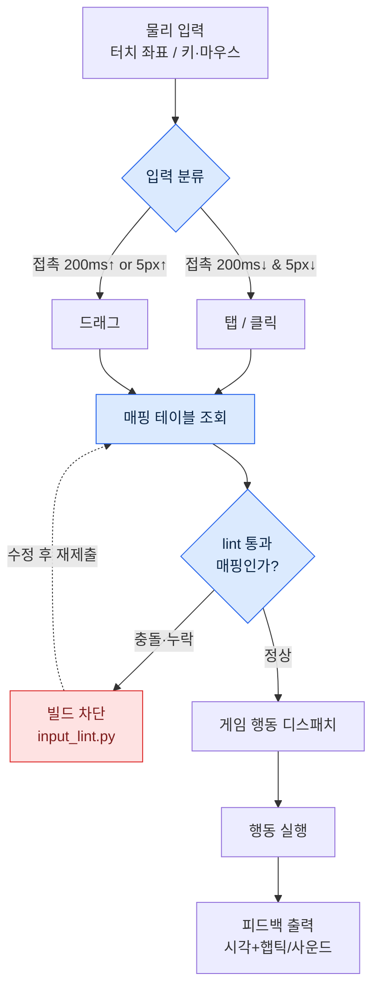

# 14.3 터치 / 마우스 인풋 디자인

QA 빌드를 받아 든 팀원 B가 한 손으로 폰을 쥔 채 미간을 찌푸렸다. "스킬 세 번 눌렀는데 두 번만 나갔어요." 화면을 들여다보니 엄지가 스킬 버튼을 누르는 그 순간, 같은 손가락이 버튼 옆 1/3을 덮고 있었다. 마우스로 테스트할 때는 한 번도 안 났던 문제다. 마우스에는 손가락이 없으니까.

이 장면이 터치와 마우스의 본질을 한 줄로 요약한다. 둘 다 "한 점을 가리키는" 입력이지만, 하나는 가리키는 도구가 화면을 가리고 다른 하나는 가리지 않는다. 같은 행동을 두 입력에서 다르게 풀어야 하는 이유가 여기서 시작된다. 이 장에서는 두 입력의 차이를 먼저 정리하고, 입력 매핑을 AI에게 제안받은 뒤 충돌·도달성을 직접 검증하는 워크드 트랜스크립트 한 척추를 끝까지 따라간다.

---

## 14.3.1 두 입력의 본질 차이

손가락의 두께, 시야 가림, 멀티터치 한도, 정밀도가 모두 다르다. 표로 박제하기 전에 한 장면으로 감각을 잡아 두자. 마우스 커서는 1픽셀짜리 펜촉이고, 손가락은 지름 1센티 가까운 도장이다. 펜촉은 글씨를 쓰지만 한 번에 한 글자다. 도장은 빨리 찍지만 글씨를 못 쓰고, 찍는 순간 종이가 안 보인다.

| 속성 | 터치 | 마우스 |
|---|---|---|
| 정밀도 | 약 7\~10mm (손가락 접촉면) | 1px 단위 |
| 시야 가림 | 손가락이 접촉점 주변을 가림 | 없음 |
| 호버 가능 | 거의 불가 (접촉 = 입력) | 자유 (이동 ≠ 입력) |
| 동시 입력 | 2\~10점 멀티터치 | 좌·우·중·휠 |
| 드래그/탭 구분 | 시간·거리로 추론해야 함 | 클릭/드래그 명확 |
| 햅틱 피드백 | 가능 | 거의 없음 |

여기서 가장 디자인에 영향이 큰 두 줄이 "시야 가림"과 "호버"다. 시야 가림은 결과를 어디에 표시할지를 강제하고, 호버 부재는 모바일에서 툴팁이라는 정보 채널 하나가 통째로 사라진다는 뜻이다. 나머지 네 줄은 이 두 줄에서 파생되는 세부에 가깝다.

공개 표준이 이 차이를 수치로 못 박아 둔다 — 터치 44pt(HIG)·48dp(Material)·대비 4.5:1·터치 타깃 24CSS픽셀(WCAG SC2.5.8) 같은 공개표준은 §9.1 룰북을 따른다. 이 숫자들은 취향이 아니라 인체와 측정의 산물이라, 매핑을 검증할 때 들이댈 잣대도 결국 이 표준이다.

## 14.3.2 게임 행동별 매핑

이동·공격·스킬, 세 행동을 두 입력으로 풀면 다음과 같이 갈린다. 한 행동에 방식이 셋씩 있다는 건 정답이 없다는 뜻이 아니라, 게임 정체성이 선택을 강제한다는 뜻이다.

- 이동 — 터치: ⓐ가상 조이스틱(좌측) ⓑ화면 탭→자동 이동 ⓒ드래그→카메라 회전 / 마우스: ⓐWASD ⓑ클릭→자동 이동 ⓒ마우스 이동→시점
- 공격 — 터치: ⓐ공격 버튼 탭 ⓑ적 탭→자동 공격 ⓒ스와이프→콤보 / 마우스: ⓐ좌클릭 ⓑ적 클릭→자동 공격 ⓒ연타→콤보
- 스킬 — 터치: ⓐ슬롯 탭 ⓑ슬롯 길게 눌러 조준 ⓒ제스처 / 마우스: ⓐ키 1\~8 ⓑ키+마우스 조준 ⓒ매크로

저자가 작업하는 프로젝트 A(모바일 우선 MMORPG)는 이동에서 모바일은 ⓐ+ⓑ 하이브리드(조이스틱과 자동 이동 병행), PC는 WASD+자동 이동을 채택했다. 공격은 모바일이 ⓑ+ⓐ(적 탭 후 버튼), PC는 ⓐ·ⓑ 자유 선택. 스킬은 모바일이 ⓐ 또는 타겟팅 시 ⓑ, PC는 키 1\~8에 마우스 조준을 얹는다. 같은 게임, 같은 행동인데 매핑 표가 두 장 나온다는 점이 이 장의 전부다.

문제는 매핑 표가 길어질수록 충돌이 숨는다는 데 있다. 슬롯 길게 누르기(스킬 조준)와 화면 드래그(카메라 회전)가 같은 영역에서 겹치면 어떻게 되는가. 1\~8 키가 스킬에 잡혀 있는데 누군가 인벤토리 단축키도 1로 제안하면? 사람 눈으로 표를 훑어서는 놓친다. 그래서 매핑을 AI에게 제안받되, 검증은 도구에 맡기는 워크플로가 필요하다.

## 14.3.3 워크드 트랜스크립트 — AI 매핑 제안과 lint 검증

여기서부터가 이 장의 척추다. PC 키보드/마우스 매핑 초안을 Claude에게 제안받고, 그 출력을 사람이 검증하고, 충돌·도달성 lint를 돌려 거부하고, 다시 요청하는 한 사이클을 통째로 옮긴다. 요약하지 않는다. 날것의 출력에는 실수도 들어 있고, 우리는 그 실수를 잡는 과정을 보려는 것이다.

### 프롬프트 (전문)

> 너는 PC MMORPG의 입력 매핑을 설계한다. 아래 행동 목록을 키보드/마우스에 매핑한 JSON을 제안하라.
>
> 행동: 이동(전후좌우), 달리기, 점프, 기본공격, 스킬1\~8, 인벤토리, 맵, 캐릭터창, 메뉴, 시점잠금토글, 줌인/줌아웃, 컨텍스트메뉴(보조행동), 자동이동토글.
>
> 제약:
> - 업계 관습을 따른다(WASD 이동, ESC 메뉴 등).
> - 하나의 물리 키/버튼에 두 행동을 겹치지 마라.
> - 각 항목에 `action`, `input`, `note` 필드.
> 출력은 JSON 배열만.

### Claude 날것 출력 (그대로, 손대지 않음)

```json
[
  {"action": "move_forward",  "input": "W",      "note": "표준 이동"},
  {"action": "move_back",     "input": "S",      "note": "표준 이동"},
  {"action": "move_left",     "input": "A",      "note": "표준 이동"},
  {"action": "move_right",    "input": "D",      "note": "표준 이동"},
  {"action": "run",           "input": "Shift",  "note": "누르는 동안 달리기"},
  {"action": "jump",          "input": "Space",  "note": "표준"},
  {"action": "attack_basic",  "input": "Mouse1", "note": "좌클릭 주 행동"},
  {"action": "skill_1",       "input": "1",      "note": ""},
  {"action": "skill_2",       "input": "2",      "note": ""},
  {"action": "skill_3",       "input": "3",      "note": ""},
  {"action": "skill_4",       "input": "4",      "note": ""},
  {"action": "skill_5",       "input": "5",      "note": ""},
  {"action": "skill_6",       "input": "6",      "note": ""},
  {"action": "skill_7",       "input": "7",      "note": ""},
  {"action": "skill_8",       "input": "8",      "note": ""},
  {"action": "inventory",     "input": "I",      "note": "Tab은 타겟 전환에 양보"},
  {"action": "map",           "input": "M",      "note": ""},
  {"action": "character",     "input": "C",      "note": ""},
  {"action": "menu",          "input": "Escape", "note": "표준"},
  {"action": "cam_lock",      "input": "Mouse3", "note": "휠 클릭으로 시점 잠금 토글"},
  {"action": "zoom_in",       "input": "WheelUp",   "note": ""},
  {"action": "zoom_out",      "input": "WheelDown", "note": ""},
  {"action": "context_menu",  "input": "Mouse2", "note": "우클릭 보조 행동"},
  {"action": "auto_move",     "input": "Mouse2", "note": "우클릭 더블로 자동 이동"}
]
```

출력은 깔끔해 보인다. 그래서 위험하다. 맨 아래 두 줄을 보라. `context_menu`와 `auto_move`가 둘 다 `Mouse2`(우클릭)에 잡혀 있다. 제약에 "하나의 키에 두 행동을 겹치지 마라"고 분명히 적었는데도 모델은 "더블 클릭으로 구분된다"는 변명을 `note`에 달아 겹쳤다. 이것이 AI 출력을 그대로 빌드에 넣으면 안 되는 이유다. 사람이 표를 훑으면 23줄 중 22번째와 23번째 충돌을 놓치기 쉽고, 모델은 자기 충돌을 합리화한다.

그래서 검증을 눈이 아니라 코드에 맡긴다. 충돌(같은 입력 중복)과 도달성(필수 행동 누락, 양손 엄지 코너 밖)을 검사하는 작은 lint를 돌린다.

```python
# input_lint.py — 입력 매핑 충돌·도달성 검사
import json, sys
from collections import defaultdict

REQUIRED = {"move_forward","move_back","move_left","move_right",
            "attack_basic","menu","inventory","map"}

def lint(mapping):
    errors, warns = [], []
    seen = defaultdict(list)
    for m in mapping:
        seen[m["input"]].append(m["action"])
    # 1) 충돌: 같은 입력에 2개 이상 행동
    for inp, acts in seen.items():
        if len(acts) > 1:
            errors.append(f"CONFLICT  {inp} <- {', '.join(acts)}")
    # 2) 도달성: 필수 행동 누락
    actions = {m["action"] for m in mapping}
    for r in sorted(REQUIRED - actions):
        errors.append(f"MISSING   required action '{r}'")
    # 3) 빈 note 경고(설계 의도 미기재)
    for m in mapping:
        if not m["note"].strip():
            warns.append(f"NO_NOTE   {m['action']} ({m['input']})")
    return errors, warns

data = json.load(open(sys.argv[1], encoding="utf-8"))
errs, warns = lint(data)
for e in errs:  print("[ERROR]", e)
for w in warns: print("[WARN] ", w)
print(f"\n=> {len(errs)} error(s), {len(warns)} warning(s)")
sys.exit(1 if errs else 0)
```

위 JSON을 `claude_map.json`으로 저장해 lint를 돌린 실제 출력은 이렇다.

```
[ERROR] CONFLICT  Mouse2 <- context_menu, auto_move
[WARN]  NO_NOTE   skill_1 (1)
[WARN]  NO_NOTE   skill_2 (2)
[WARN]  NO_NOTE   skill_3 (3)
... (skill_4~8 동일)

=> 1 error(s), 8 warning(s)
```

lint가 사람 눈이 놓친 단 하나의 충돌을 정확히 집어냈다. 도달성 검사는 통과했다(필수 8행동 모두 존재). 빈 `note` 8건은 경고일 뿐 빌드를 막지 않지만, 설계 의도 미기재라는 부채를 드러낸다. 이제 거부 사유를 들고 모델에게 되돌려 보낸다.

### 사람의 거부 + 재요청

> lint 결과 `Mouse2`에 context_menu와 auto_move가 겹쳐서 거부한다. 더블클릭 구분은 우클릭 지연이 생겨 전투 중 오작동한다. auto_move는 별도 입력으로 분리하라. 또 skill_1\~8의 note가 비어 있다 — 각 슬롯이 어떤 계열 스킬인지 한 줄씩 채워라.

### Claude 재출력 (충돌 해소분만 발췌)

```json
  {"action": "context_menu", "input": "Mouse2",      "note": "우클릭 = 보조/컨텍스트 행동 단독"},
  {"action": "auto_move",    "input": "Numpad0",     "note": "자동 이동 토글, 전투 키와 물리적으로 분리"},
  ...
  {"action": "skill_1", "input": "1", "note": "근접 주력기"},
  {"action": "skill_8", "input": "8", "note": "긴급 회피/생존기 — 새끼손가락 도달 한계라 Q로 재배치 검토"}
```

재출력의 마지막 줄이 흥미롭다. 모델 스스로 "8번 키는 새끼손가락 도달 한계"라며 도달성 문제를 자진 신고했다. 이건 우리가 다음 절에서 다룰 도달성 검증과 정확히 같은 주제다. lint를 다시 돌리면 `0 error(s)`로 통과한다. 핵심은 이것이다. AI는 빠르게 23줄짜리 초안을 만들지만, 그 초안의 합법성은 사람이 정의한 규칙(REQUIRED 집합, 충돌 정의)과 코드가 보증한다. 제안은 모델, 판정은 도구, 결정은 사람.

## 14.3.4 입력 흐름 — 매핑이 화면에 닿기까지

한 번의 물리 입력이 게임 행동으로 변환되는 경로를 그려 두면, 위 lint가 어느 지점에 끼는지가 보인다.



왼쪽 위에서 들어온 물리 입력은 먼저 탭이냐 드래그냐로 분류된다(다음 절의 200ms/5px 기준). 분류된 입력은 매핑 테이블을 조회하는데, 그 테이블이 빌드에 들어가기 전 `input_lint.py`를 통과해야 한다는 점이 그림의 핵심이다. 충돌이나 누락이 있으면 디스패치 단계로 가지 못하고 차단된다. 매핑 검증은 런타임 이전, 빌드 게이트에서 끝나야 한다.

## 14.3.5 터치 디자인의 5원칙

이제 매핑이 통과했다 치고, 그 매핑이 손가락과 만나는 표면을 설계한다.

**원칙 1 — 최소 터치 면적.** Apple HIG 44pt, Material 48dp가 하한이다. HD 화면에서 대략 100px(레티나 2배 환경 200px) 안팎으로 잡으면 두 표준을 동시에 만족한다. 이 아래로 내려가면 위 도입부의 "세 번 눌러 두 번"이 통계로 나타난다.

**원칙 2 — 엄지 도달 영역.** MMORPG 모바일은 가로 양손 그립이 표준이고, 누르는 요소는 양 하단 코너·소비/슬롯은 중앙 하단에 둔다(세 영역 모델의 근거는 §9.1). P0 행동(좌=이동, 우=공격·스킬)은 좌·우 하단 두 코너 안에, 잘 안 보는 정보는 도달 한계 밖 상단에 둔다. 두 코너를 합쳐도 화면 절반이 안 된다는 점이 입력 설계에서 핵심이다. 다음 SVG가 가로 모드에서 양손 엄지 도달 영역과 중앙 하단 슬롯대를 보여 준다.

<svg viewBox="0 0 420 240" xmlns="http://www.w3.org/2000/svg" role="img" aria-label="가로 모드 양손 엄지 도달 영역">
  <rect x="10" y="10" width="400" height="220" rx="14" fill="#f7f7fa" stroke="#333" stroke-width="2"/>
  <!-- 좌측 엄지 부채꼴 -->
  <path d="M 30 230 A 150 150 0 0 1 180 80 L 30 80 Z" fill="#3a7bd5" opacity="0.20"/>
  <path d="M 30 230 A 95 95 0 0 1 125 135 L 30 135 Z" fill="#3a7bd5" opacity="0.40"/>
  <!-- 우측 엄지 부채꼴 -->
  <path d="M 390 230 A 150 150 0 0 0 240 80 L 390 80 Z" fill="#d5533a" opacity="0.20"/>
  <path d="M 390 230 A 95 95 0 0 0 295 135 L 390 135 Z" fill="#d5533a" opacity="0.40"/>
  <!-- 중앙 상단 사각 영역 -->
  <rect x="150" y="22" width="120" height="50" rx="6" fill="#999" opacity="0.18"/>
  <text x="210" y="52" font-size="12" text-anchor="middle" fill="#444">상단 = 도달 밖(정보 표시)</text>
  <!-- 중앙 하단 슬롯대 (앰버 — 소비·퀵슬롯) -->
  <rect x="160" y="178" width="100" height="36" rx="6" fill="#f59e0b" opacity="0.35" stroke="#f59e0b" stroke-width="1.5" stroke-dasharray="4 3"/>
  <text x="210" y="200" font-size="10" text-anchor="middle" fill="#92400e">중앙 하단 = 소비·퀵슬롯</text>
  <text x="78" y="205" font-size="12" text-anchor="middle" fill="#1c4a8a">좌 엄지</text>
  <text x="342" y="205" font-size="12" text-anchor="middle" fill="#8a2a1c">우 엄지</text>
  <text x="78" y="160" font-size="10" text-anchor="middle" fill="#1c4a8a">편안</text>
  <text x="342" y="160" font-size="10" text-anchor="middle" fill="#8a2a1c">편안</text>
  <text x="210" y="225" font-size="11" text-anchor="middle" fill="#555">진한 영역 = P0 버튼 배치 / 옅은 영역 = 도달 한계</text>
</svg>

진한 부채꼴이 엄지가 무리 없이 닿는 곳, 옅은 부채꼴이 손을 뻗어야 닿는 한계다. 14.3.3 재출력에서 모델이 신고한 "8번 키 새끼손가락 한계"가 PC판이라면, 모바일판이 바로 이 옅은 영역에 P0 버튼을 두는 실수다.

**원칙 3 — 시야 가림 회피.** 손가락은 접촉점만 가리는 게 아니라 그 위로 손 전체가 화면을 덮는다. 우측 하단 스킬을 탭하면 우측 하단 약 1/4이 안 보인다. 그래서 행동의 결과(데미지 숫자, 상태 변화)는 손가락이 닿지 않는 영역에 띄운다. 좌측 조이스틱을 쥔 손은 캐릭터와 미니맵 자리를 침범하므로, 미니맵을 우상단으로 보낸다.

**원칙 4 — 드래그/탭 구분.** 마우스와 달리 터치는 사용자의 의도를 시간과 거리로 추론해야 한다. 게임 전체에서 한 기준으로 통일한다 — 예컨대 접촉 200ms 이내이면서 5px 이내 이동이면 탭, 그 이상이면 드래그. 이 두 숫자가 들쭉날쭉하면 "탭하려다 캐릭터가 굴렀다" 같은 의도 실패가 쌓인다. 위 mermaid의 분기 지점이 정확히 이 판정이다.

**원칙 5 — 햅틱.** 진동은 화면을 안 봐도 전달되는 유일한 채널이다. 다만 모든 입력에 진동을 주면 노이즈가 된다. 일반 탭은 무진동, 스킬 사용은 짧게, 결제 확인 같은 위험 행동은 강하게, 적 처치는 미세하게 — 4\~5종 안쪽으로 운영한다.

## 14.3.6 마우스 디자인의 5원칙

마우스는 터치에 없는 세 가지 사치를 누린다. 호버, 다중 버튼, 커서 정밀도다.

**원칙 1 — 호버.** 마우스는 누르지 않고도 가리킬 수 있다. 스킬 슬롯에 마우스를 얹으면 이름·쿨다운·설명 툴팁이 뜨고, 클릭하면 사용된다. 터치에는 이 중간 상태가 없으니, 호버는 PC가 정보를 더 얹을 수 있는 통로다. 단, 호버에만 의존하는 정보가 모바일판에선 갈 곳을 잃는다는 점을 14.3.3 매핑 단계에서 미리 의식해야 한다.

**원칙 2 — 다중 버튼.** 좌클릭은 주 행동, 우클릭은 보조/컨텍스트, 휠 클릭은 시점 리셋, 휠은 줌. 위 lint가 잡아낸 충돌이 바로 이 우클릭에 두 행동을 겹친 사례였다. 버튼이 많다고 다 채우려다 충돌을 만든다.

**원칙 3 — 키보드 표준.** ESC=메뉴, M=맵, 1\~8=스킬, WASD=이동, Shift=달리기, Space=점프. 사용자가 배우지 않고도 추측할 수 있어야 한다. 표준에서 벗어나는 키는 그만한 이유를 `note`에 적어 두는데, 14.3.3에서 Tab을 인벤토리 대신 타겟 전환에 양보한 결정이 그 예다.

**원칙 4 — 시점 제어.** 마우스 드래그로 시점을 돌리되, 커서를 화면에 잠그는 게임 모드와 푸는 UI 모드를 명확히 토글한다. 이 토글이 모호하면 메뉴를 닫았는데 커서가 사라지는 혼란이 생긴다.

**원칙 5 — 매크로·자동 허용 범위.** 자동 공격·자동 이동을 어디까지 허용할지는 게임 정체성의 문제다. 너무 풀면 PC가 매크로 화면이 되고, 무조건 막으면 모바일에서 넘어온 사용자의 진입 장벽이 높아진다. 정답은 스펙트럼의 어느 점을 게임 색깔에 맞춰 고르는 일이지, 양 극단이 아니다.

## 14.3.7 양쪽 공통 — 입력 피드백 통일

원칙은 플랫폼마다 다르지만, 사용자가 같은 행동에 받는 "느낌"은 플랫폼이 바뀌어도 같아야 한다. 모바일에서 PC로 넘어온 사용자가 버튼 빛남의 의미를 새로 배우게 하면 안 된다.

| 상황 | 터치 | 마우스 |
|---|---|---|
| 입력 인식 | 버튼 빛남 + 짧은 햅틱 | 버튼 빛남 + 클릭음 |
| 입력 실패 | 버튼 흔들림 + 햅틱 | 버튼 흔들림 + 경고음 |
| 쿨다운 진행 | 원형 게이지 | 원형 게이지 |
| 사용 가능 회복 | 빛남 + 햅틱 | 빛남 + 사운드 |

시각 채널(빛남·흔들림·게이지)은 양쪽이 동일하고, 보조 채널만 플랫폼에 맞게 햅틱↔사운드로 갈린다. 이 일관성이 멀티 플랫폼 사용자의 학습 비용을 절반으로 줄인다.

## 14.3.8 흔한 실패와 처방

| 패턴 | 처방 |
|---|---|
| 버튼이 표준 하한(44pt/48dp) 미만 | 100px 안팎으로 강제 |
| 손가락 가림 영역에 결과 표시 | 비가림 영역으로 이동 |
| 햅틱 남발 | 4\~5종 이내 |
| 우클릭에 두 행동 겹침 | lint로 충돌 차단 후 분리 |
| 호버 전용 정보를 모바일에 그대로 | 모바일은 탭/롱탭 대체 채널 |
| 키 매핑 고정 | 사용자 커스터마이즈 허용 |
| 양 플랫폼 동일 매핑 강제 | 플랫폼별 자연스러운 매핑 |

이 표의 네 번째 줄이 14.3.3 워크드 트랜스크립트의 결론이다. 우클릭 충돌은 사람 눈으로 표를 훑어선 거의 매번 놓치고, lint를 빌드 게이트에 걸어 두면 거의 매번 잡힌다.

---

### 이 챕터의 핵심 메시지
- 터치는 손가락이 화면을 가리는 도장, 마우스는 가리지 않는 펜촉 — 한쪽 UX를 그대로 옮기면 손과 어긋난다.
- 입력 매핑은 AI가 제안하되 충돌·도달성은 lint가 판정한다 — 사람 눈은 23줄 중 충돌 한 줄을 놓친다.
- 피드백의 시각 채널은 양 플랫폼 통일, 보조 채널만 햅틱↔사운드로 가른다.

### 다음 챕터 미리보기
- 15.1 라이브 운영 — 출시 후 게임이 살아가는 사이클

---

### 따라하기 (setup → prompt → verify)

1. **setup** — 행동 목록과 제약을 한 파일에 정리하세요(이동·공격·스킬·UI·시점). 위 `input_lint.py`를 프로젝트에 둡니다. `REQUIRED` 집합을 본인 게임의 필수 행동으로 바꿉니다.
2. **prompt** — 14.3.3의 프롬프트 전문을 그대로 쓰되 행동 목록만 교체하세요. 출력은 JSON 배열만 받도록 고정합니다.
3. **verify** — 받은 JSON을 `python input_lint.py claude_map.json`으로 돌리세요. ERROR가 0이 될 때까지 거부 사유(충돌 입력·누락 행동)를 명시해 재요청합니다. WARN(빈 note)은 설계 의도 미기재 부채로 따로 기록합니다.

### 1인 축소판
혼자 만드는 작은 게임이라면 도구를 줄이세요. 행동이 10개 안쪽이면 `REQUIRED` 집합과 "같은 입력 중복" 검사 두 가지만 남긴 20줄짜리 lint로 충분합니다. AI에게 매핑을 받고, 이 미니 lint로 충돌만 거른 뒤, 실기에서 엄지(또는 새끼손가락)가 닿는지 한 번 눌러 보세요. 제안은 모델, 충돌 판정은 코드, 도달 판정은 본인 손 — 이 셋만 지키면 규모와 무관하게 통합니다.
