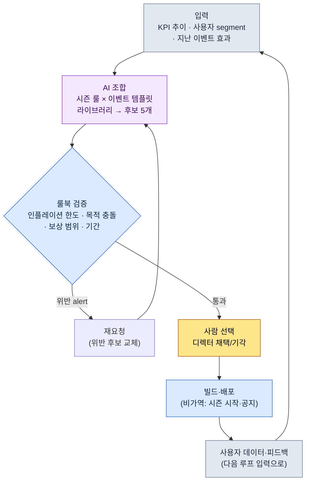

# 15.1 라이브 운영 개관 — 이벤트 후보를 AI가 조합하고, 룰북이 거르고, 사람이 고른다

> 1차 독자: 출시 후 라이브 운영을 처음 책임지는 기획자 (중규모(10\~50인) 팀)
> 1인/취미 독자용 축소 버전: §15.1.7 「혼자라면 이만큼만」
>
> **전제**: 저자는 글로벌로 출시된 모바일 MMORPG의 라이브 운영을 P2E(Play To Earn) 경제까지 포함해 겪었고, 여기에 현재 프로젝트의 출시 전 AI 워크플로를 합쳐 이 장을 쓴다. 워크드 트랜스크립트는 "입력→AI 조합→룰북 검증→사람 선택" 패턴을 라이브 운영 양식으로 실제 한 번 돌린 결과다. 추정과 관찰은 추정·관찰이라고 명시했고, 지어낸 KPI 표는 넣지 않았다.

출시 다음 날 아침의 사무실은 출시 전과 다르다. 마일스톤이 끝났는데 일이 줄지 않고, 오히려 단위만 더 작아진다. 분기 단위로 잡혀 있던 일정이 주·일·시간 단위로 쪼개진다. 그리고 매주 같은 질문이 회의실로 돌아온다. "이번 주말 이벤트 뭐 돌리죠?"

이 질문이 매주 백지에서 다시 시작되면, 라이브 운영팀은 곧 지친다. 이 장은 그 질문을 백지에서 빼내는 방법을 다룬다. 핵심은 두 가지다. 첫째, 이벤트와 시즌을 매번 새로 짜내는 대신 **검증된 양식의 라이브러리**로 쌓아 둔다. 둘째, "그 양식들을 조합해 다음 주 후보를 5개 만드는" 지루한 초안 작업을 AI에게 시키고, 사람은 **룰북 검증을 통과한 후보 중 무엇을 채택할지**만 정한다. 0에서 만들기와 5개 중 고르기는 작업 부담이 다르다.

---

## 15.1.1 라이브 운영은 '느낌'이 아니라 '루프'다

라이브 운영의 표준 사이클을 표로 외우는 책은 많다. 월요일에 보고하고, 화수에 준비하고, 금요일에 배포한다는 이야기다. 다 맞지만, 표만 외워서는 "이번 주 이벤트"라는 매주 돌아오는 결정이 어떻게 내려지는지가 안 보인다. 라이브 운영의 본질은 일정표가 아니라 **닫힌 루프**다 — 후보가 생기고, 검증을 통과하고, 사람이 고르고, 빌드로 나가고, 사용자 데이터가 다시 다음 후보의 입력이 되는 한 바퀴.

이 루프 위에 라이브 운영의 4축(콘텐츠·이벤트·밸런스·CS)이 각자의 속도로 돈다. 콘텐츠는 월\~분기, 이벤트는 주\~월, 밸런스는 주\~격주, CS는 일·시간 단위다. 4축이 따로 돌면 같은 사용자 데이터를 보고도 매주 다른 결정이 나온다. 그래서 4축을 하나의 루프로 묶고, 그 루프의 한 칸(이벤트 후보 생성)을 AI가 돌릴 수 있는 형태로 만드는 것이 이 장의 목표다.



사람의 손이 닿는 곳은 두 군데뿐이다. 맨 위에서 입력(KPI·segment·과거 효과)을 깨끗하게 넣는 자리, 그리고 검증을 통과한 후보 중 무엇을 띄울지 정하는 자리. 그 사이의 지루한 "조합 5개 짜내기"와 "룰 위반 거르기"는 AI와 룰북이 돌린다. 그리고 맨 아래 한 줄 — 빌드로 나간 이벤트가 만든 사용자 데이터가 다시 입력으로 돌아온다는 점 — 이 루프를 라이브 운영답게 만든다. 출시 전 설계는 한 번 나가면 끝이지만, 라이브 운영은 결과가 다음 입력이 된다.

이 루프에 들어가는 두 라이브러리(시즌 룰·이벤트 템플릿)의 구체는 §15.2에서, 마지막 칸(사용자 피드백 자동 분류)은 §15.3에서 본다. 이 장은 루프를 한 바퀴 끝까지 도는 데 집중한다.

---

## 15.1.2 [워크드 트랜스크립트] 이벤트 후보 5개 조합 → 룰북 검증 → 사람 선택

실제로 어떻게 돌리는지 한 사이클을 끝까지 보여준다. 아래는 저자가 출시 전 콘텐츠 도구에서 검증한 "라이브러리 조합 → 룰북 검증 → 사람 선택" 패턴을 라이브 운영 양식(시즌 룰 + 이벤트 템플릿)에 옮겨 실제로 한 번 돌린 세션을 재현한 것이다. 입력 프롬프트는 그대로 복사해 쓸 수 있고, 출력은 그 세션을 재구성했다.

### 1단계 — 입력: 라이브러리와 현재 상황을 그대로 던진다

먼저 조합의 재료 두 가지를 기계가 읽을 수 있는 형태로 둔다. 이벤트 템플릿 라이브러리(검증된 양식)와 시즌 룰 라이브러리, 그리고 이번 주의 현재 상황(KPI·segment)이다. 라이브러리는 한 번 만들어 두면 매주 재사용한다.

```yaml
# event_templates.yaml — 검증된 이벤트 템플릿 라이브러리 (발췌, 9종 중 4종)
- id: tpl_attendance      # 출석 보상
  목적: [신규유입, 휴면복귀]
  기간_권장: 7~14일
  보상등급: 저~중
- id: tpl_coop_raid       # 협력 레이드
  목적: [기존활성화, 커뮤니티]
  기간_권장: 3~7일
  보상등급: 중~고
- id: tpl_pvp_season      # 경쟁 시즌
  목적: [커뮤니티, 기존활성화]
  기간_권장: 14~28일
  보상등급: 고
- id: tpl_limited_package # 한정 패키지
  목적: [매출]
  기간_권장: 3~7일
  보상등급: 고 (결제연동)

# season_rules.yaml — 시즌 룰 조각 (발췌)
season_inflation_cap: 분기당 '고' 등급 보상 이벤트 ≤ 3회
purpose_conflict_rule: 한 주에 [매출] 목적 이벤트 2개 동시 금지
overlap_rule: '고' 보상 이벤트는 동시 2개 금지 (피로·인플레이션)

# current_state.yaml — 이번 주 상황
주차: 2026-W23
직전2주_매출이벤트: 1회 (분기 누적 '고'등급 2회)
DAU_추이: 완만한 하락 (직전 4주 -6%, 업계 관찰상 '경계' 구간)
주요_segment: 복귀_가능_휴면층 비중 상승
다가오는_외부일정: 없음
```

### 2단계 — 프롬프트: 조합을 시키되, 형식과 룰을 강제한다

```
첨부한 템플릿·시즌룰·이번주 상황 yaml로 다음 주 이벤트 후보 5개만 조합해 줘.
새 메커니즘 만들지 말고 첨부 템플릿 조합으로만, 시즌룰 위반 여부는 스스로 표시하고,
각 후보가 지금 신호(DAU 하락·휴면 복귀)에 왜 맞는지 한 줄씩 붙여 줘.
목적이 매출로만 쏠리지 않게 분산하고, 애매한 건 표시해서 나한테 넘겨.
표로만, 칸은 후보·템플릿조합·주목적·기간·룰위반·근거·애매.
```

규칙 다섯 줄 중 어느 하나도 "무엇을 만들지"를 말하지 않는다는 점을 보라. 전부 "어떤 틀 안에서, 무엇을 근거로 답하라"는 제약이다. AI에게 자유를 주면 일반 RPG 평균 이벤트를 토해내기 때문이다. **재료를 라이브러리로 제한(규칙 1), 시즌 룰 자가 점검 의무(규칙 2), 현재 신호 대응 근거 의무(규칙 3), 목적 분산(규칙 4), 그리고 "애매하면 사람에게 넘겨라"는 탈출구(규칙 5)** — 다섯 줄이 모여 후보의 모양이 아니라 후보의 자격을 정한다.

### 3단계 — Claude의 출력 (재구성, 발췌)

아래는 요약하지 않은 날것의 출력이다. 룰 위반과 애매 신고가 섞여 있다.

```
| 후보 | 템플릿조합              | 주목적     | 기간  | 룰위반 | 근거                                       | 애매 |
|-----|------------------------|-----------|-------|--------|--------------------------------------------|------|
| C1  | tpl_attendance         | 휴면복귀   | 10일  | 없음   | 복귀 휴면층 비중 상승에 직접 대응, 보상 '중' | -    |
| C2  | tpl_coop_raid          | 기존활성화 | 5일   | 없음   | DAU 하락기 접속 동기 부여, 커뮤니티 자극     | -    |
| C3  | tpl_attendance+tpl_coop_raid | 휴면복귀+활성화 | 7일 | 없음 | 출석으로 복귀 유인 + 레이드로 잔존, 결합 시너지 | -  |
| C4  | tpl_pvp_season         | 커뮤니티   | 21일  | 없음   | 장기 시즌으로 잔존 곡선 자체를 끌어올림       | ★    |
| C5  | tpl_limited_package    | 매출       | 5일   | ★위반  | 분기 '고'등급 누적 2회 → 추가 시 한도 근접/초과 | -    |

룰 점검 결과:
- C5: season_inflation_cap 위반 위험. 이번 분기 '고'등급 보상 이벤트가
  이미 2회. C5를 더하면 3회로 한도 경계. DAU 하락기에 매출 푸시는
  사용자 피로를 더할 수 있어 신호와도 역방향.
- C4: 룰 위반은 없으나 21일 PvP 시즌은 이번 한 주가 아니라 3주를
  점유한다. '이번 주 후보'로 적절한지 운영 정책 판단 필요 → 애매 표시.
- C1·C2·C3은 룰 통과, 현재 신호(휴면·DAU)와 정합.
```

출력에서 가장 가치 있는 부분은 표가 아니라 **맨 아래 룰 점검 세 줄**이다. AI가 C5의 인플레이션 위반을 스스로 잡아 표시했고, C4는 "위반은 아니지만 판단이 갈린다"며 사람에게 넘겼다. 좋은 프롬프트는 AI가 자기 한계를 신고하고 사람에게 공을 넘길 수 있게 만든다.

### 4단계 — 검증과 선택 (사람의 자리)

이 출력을 그대로 받으면 안 된다. 룰북으로 한 번 더 치고, 그 다음에 사람이 고른다. 이 세션에서 실제로 두 가지가 갈렸다.

먼저 **C5는 거부**다. AI가 이미 인플레이션 위반을 표시했고, 룰북 코드(§15.1.3)도 같은 판정을 냈다. 분기 '고'등급 한도에 걸리고, DAU 하락기에 매출 푸시는 현재 신호와 역방향이다. 토론할 게 없다. 뺀다.

다음은 **C4(21일 PvP 시즌)** 다. AI가 "애매"로 넘긴 자리다. 룰 위반은 없지만, 이건 "이번 주 이벤트"가 아니라 "이번 시즌 결정"이다. 한 주짜리 루프에서 즉결할 사안이 아니라 시즌 통합 회의로 올려야 한다. 그래서 이번 주 후보에서는 보류하고, 시즌 캘린더 안건으로 따로 뺀다.

남은 C1·C2·C3 중에서 디렉터가 고른다. 현재 신호(휴면 복귀층 상승 + DAU 완만한 하락)에 가장 잘 맞는 건 **C3(출석+협력 레이드 결합)** 였다. 출석으로 휴면층을 끌어들이고, 레이드로 끌어들인 사용자를 잡아 두는 결합 시너지가 이번 주 신호와 정합했다. C1·C2는 다음 주 후보 풀에 남겨 둔다.

여기서 끝나지 않은 후보 하나가 더 있었다. C3 채택을 정하고 나니, 7일 기간이 다가오는 정기 점검일과 하루 겹쳤다. 그래서 재요청이 한 번 돈다.

```
C3를 채택한다. 다만 7일 기간 중 마지막 날이 정기 점검일과 겹친다.
점검으로 이벤트 막판 참여가 끊기지 않도록 기간을 조정해 다시 제안하라.
보상 총량은 유지하고 일정만 당겨라.
```

AI는 시작일을 하루 당겨 점검 전에 종료되도록 다시 답했고, 그 조정은 룰북을 통과했다. 입력 → AI 조합 → 룰북 검증 → 사람 선택 → 일정 재조정의 한 사이클이 여기서 닫힌다.

이 한 바퀴가 이 책 전체의 Show 기준이다. AI가 무엇을 조합하고, 룰북이 무엇을 거르고, 사람이 무엇을 고르고 무엇을 거부하는지를 한 번이라도 끝까지 보지 않으면, "AI로 이벤트 후보를 뽑는다"는 문장은 공허하다.

---

## 15.1.3 룰북을 코드로 — 후보 자동 검증

후보가 시즌 룰을 지켰는지 매주 눈으로 보면 또 놓친다. §15.1.2의 세 룰 중 숫자로 판정 가능한 것은 코드가 검수하게 만든다. 사람은 코드가 못 잡는 "애매"와 "선택"에만 시간을 쓴다.

```python
# event_lint.py — 다음 주 이벤트 후보 검증 (골격)
# 입력: AI가 조합한 후보 목록 + 시즌 룰 + 분기 누적 상태
# 출력: 룰 위반 목록 (자동 거부가 아니라 alert)

def lint(candidates, season, quarter_state):
    issues = []
    high_used = quarter_state["high_reward_count"]  # 분기 누적 '고'등급 횟수
    for c in candidates:
        # 규칙 A: 인플레이션 한도 (분기당 '고'등급 ≤ 3)
        if c["보상등급"] == "고" and high_used + 1 > season["inflation_cap"]:
            issues.append(f"[A] {c['id']}: '고'등급 추가 시 분기 한도 "
                          f"{season['inflation_cap']}회 초과 (현재 {high_used})")
        # 규칙 B: 동일 주 [매출] 목적 2개 금지
    sales = [c for c in candidates if "매출" in c["목적"]]
    if len(sales) > 1:
        issues.append(f"[B] [매출] 목적 후보 {len(sales)}개 동시 → 1개로 제한")
        # 규칙 C: 목적 쏠림 (5개 중 한 목적이 과반이면 분산 부족)
    from collections import Counter
    top = Counter(c["주목적"] for c in candidates).most_common(1)[0]
    if top[1] > len(candidates) // 2:
        issues.append(f"[C] 목적 '{top[0]}' {top[1]}개 쏠림 (분산 부족)")
    return issues
```

이 코드가 회의에서 "이거 보상 너무 센 거 아니에요?"라는 옥신각신을 숫자 한 줄로 정리한다. `[A] tpl_limited_package: '고'등급 추가 시 분기 한도 3회 초과 (현재 2)`라고 코드가 출력하면, 토론할 게 없다. 빼면 된다. §14.1(모바일 HUD)에서 다룬 lint 게이트를 라이브 운영 차원으로 옮긴 것이다 — 결정론으로 잡을 수 있는 건 코드가, 판단이 필요한 건 사람이 맡는 분담이 운영에서도 그대로 성립한다.

다만 한 가지가 다르다. 이 lint는 위반을 발견해도 **자동으로 후보를 폐기하지 않는다.** alert만 올린다. §6.2(도시 생성기)에서 본 것과 같은 설계다. 자동 거부형 검증을 달면, 의도된 변형(예: 분기 한도를 알고도 의도적으로 매출 이벤트를 넣는 캠페인 결정)까지 기계가 죽여 버린다. 의심 후보는 기계가 뽑되, 죽일지 살릴지는 디렉터가 정한다. §15.1.2에서 C5를 거부한 것도 lint가 죽인 게 아니라, lint의 alert를 보고 사람이 정한 결정이었다.

---

## 15.1.4 출시 전과 출시 후 — 무엇이 달라지는가

위 루프가 출시 전 설계 루프와 결정적으로 다른 지점은 두 가지다. 표로 나열하기보다, 이 두 가지만 정확히 짚는다.

첫째, **결과가 다음 입력이 된다.** 출시 전에는 기획서를 쓰면 빌드까지 단방향으로 흐른다. 라이브 운영에서는 이번 주 이벤트가 만든 사용자 데이터(참여율·이탈·매출·피드백)가 다음 주 후보 조합의 입력(`current_state.yaml`)으로 돌아온다. §15.1.1 루프의 맨 아래 화살표가 그 회귀다. 그래서 라이브 운영의 KPI는 "한 번 잘 맞히기"가 아니라 "매주 신호에 맞춰 조정하기"다.

둘째, **실험 비용이 작아지지만 비가역 지점은 더 날카롭다.** 출시 전 한 번의 결정이 분기를 좌우했다면, 라이브에서는 한 주짜리 이벤트를 돌려 보고 안 맞으면 다음 주에 바꾼다. 롤백 가능한 실험이 늘어난다. 그러나 **시즌 시작과 이벤트 공지는 비가역**이다. §5.4.5에서 다룬 "녹음·캐스팅 = 비가역 단계" 원칙이 그대로 작동한다. 사용자가 이미 본 시즌 룰·보상은 "취소"해도 커뮤니티 인식에 흔적을 남긴다. 그래서 §15.1.1 루프의 모든 검증(AI 조합·룰북·사람 선택)은 빌드·공지라는 비가역 칸에 들어가기 **전** 가역 단계에서 끝나야 한다. C4(21일 시즌)를 이번 주 즉결에서 빼 시즌 회의로 올린 것도 이 원칙이다 — 비가역 지점이 큰 결정일수록 더 긴 가역 검토를 거친다.

이 두 가지가 라이브 운영을 출시 전 설계와 다른 일로 만든다. 나머지(시간 단위가 분기→주, 피드백이 베타→실시간)는 이 두 축의 파생이다.

---

## 15.1.5 보수적 적용에서 진보적 적용으로

§15.1.2의 워크드 트랜스크립트는 진보적 적용의 한 장면이다. AI가 후보를 조합하고, 사람은 채택을 정했다. 그러나 모든 팀이 처음부터 여기까지 오는 건 아니다. 단계가 있다.

**보수적 적용**에서는 사람이 후보를 발의한다. 운영팀이 월요일 회의에서 이벤트를 직접 기획하고, 시즌 룰을 손으로 작성하고, 사용자 피드백을 수동 분류한다. 자동은 측정(KPI 대시보드)과 회귀 검사(빌드 검수)만 맡는다. 업계 관찰상 현재 대부분의 라이브 MMORPG 운영이 이 단계에 가깝다.

**진보적 적용**에서는 "이벤트 후보 발의"와 "피드백 분류"까지 AI가 초안을 댄다. §15.1.2가 전자의 장면이고, 후자(피드백 자동 클러스터링)는 §15.3에서 본다. 사람의 결정은 "어떤 후보를 채택할지", "AI가 분류한 피드백을 어떻게 받아들일지" 같은 메타 결정으로 좁혀진다.

진보적 적용이 자리잡으려면 세 가지가 갖춰져야 한다. 이벤트 템플릿·시즌 룰이 재조합 가능한 단위로 분리·축적된 **라이브러리**(§15.1.2의 `event_templates.yaml`이 그 씨앗), 현재 신호를 입력받아 후보를 초안 형태로 내는 **후보 생성기**(§15.1.2의 프롬프트), 그리고 들어오는 피드백을 자동 분류하는 **클러스터링**(§15.3)이다. 이 세 가지가 §5.3.12(월드 BT(BehaviorTree, 행동 트리)·퀘스트 클라우드)·§8.1.8(진보적 밸런싱)과 같은 골격이라는 점이 이 책의 일관된 메시지다 — 분야는 다르지만, "검증된 조각을 라이브러리로 쌓고, AI가 조합 후보를 내고, 사람이 채택한다"는 구조는 같다.

여기서 한 가지를 분명히 해 둔다. 라이브러리·후보 생성기·클러스터링 같은 발상은 2010년대에도 이론적으론 가능했다. 막혔던 건 AI가 이벤트 공지문·룰 설명 같은 **사용자가 읽을 자연어**를 쓸 수 없었고, 일 수백\~수천 건의 피드백을 자연어로 요약·분류할 수 없었기 때문이다. LLM 발전(2023\~) 이후 그 두 벽이 낮아지면서, 종이에만 있던 진보적 운영의 상당 부분이 실현 영역에 들어왔다.

---

## 15.1.6 흔한 실패

| 패턴 | 왜 실패하나 | 처방 |
|---|---|---|
| 매주 백지에서 이벤트 기획 | 운영팀이 곧 소진, 후보 질이 컨디션 따라 출렁임 | 이벤트 템플릿 라이브러리로 축적 (§15.1.2) |
| "AI야 이벤트 만들어 줘" 통째 위임 | 라이브러리·룰 없이는 일반 RPG 평균이 나옴 | 재료 제한 + 시즌 룰 자가점검 강제 (§15.1.2) |
| 후보를 눈으로만 검수 | 인플레이션·목적 쏠림을 매주 놓침 | `event_lint.py`로 자동 검증 (§15.1.3) |
| lint를 자동 거부형으로 | 의도된 캠페인 결정까지 기계가 죽임 | alert만, 채택은 디렉터 (§15.1.3) |
| 비가역 결정을 주간 루프에서 즉결 | 시즌 공지 후 롤백이 커뮤니티 흔적을 남김 | 큰 결정은 시즌 회의로 분리 (§15.1.4) |
| 단일 KPI(DAU·매출)만 추구 | 사용자 피로 누적, 신호와 역방향 후보 채택 | current_state에 다축 신호 입력 (§15.1.2) |

---

## 15.1.7 따라하기 — 오늘 할 수 있는 한 단계

**setup → prompt → verify** 순으로 한 단계만 해 보세요.

- **setup**: 본인 게임(또는 운영해 본 게임)의 검증된 이벤트 양식 4\~5개를 `event_templates.yaml` 형식으로 손으로 적습니다(목적·기간·보상등급만). 시즌 룰은 한 줄짜리 세 개면 충분합니다 — 인플레이션 한도, 목적 충돌 금지, 중복 금지.
- **prompt**: §15.1.2의 프롬프트를 그대로 붙여 넣고, 이번 주 상황(KPI 방향·주요 segment)을 `current_state.yaml`에 채워 한 번 돌립니다.
- **verify**: 나온 후보 5개 중 룰을 위반한 것 1개를 직접 골라 "이건 인플레이션 한도에 걸린다, 빼고 다시"라고 반박해 보세요. AI가 어떻게 교체하는지 보면, 이벤트 조합이 어떤 판단의 묶음인지 몸으로 들어옵니다.

> **혼자라면 이만큼만**: 라이브러리 yaml도, lint 코드도 필요 없습니다. 좋아하는 게임의 지난 분기 이벤트를 5\~6개만 떠올려 "목적·기간·보상" 세 칸으로 적어 보세요. 그것만으로도 그 게임이 매주 백지에서 짜낸 게 아니라 양식을 돌려쓰고 있었다는 게 보입니다. 그 표가 곧 당신의 첫 템플릿 라이브러리입니다.

팀이라면 다음 한 단계로 시작하세요. 지난 1\~2분기의 이벤트를 모아 `event_templates.yaml`로 정규화하고(검증된 양식만), 시즌 룰 세 줄을 `event_lint.py`로 먼저 코드에 넣어 둡니다. 라이브러리와 룰이 있으면, AI 조합 후보든 사람 시안이든 같은 선으로 잴 수 있습니다.

---

### 이 챕터의 핵심 메시지
- 라이브 운영은 일정표가 아니라 닫힌 루프 — 결과가 다음 입력이 된다.
- 이벤트 후보 조합은 AI에게, 룰 위반은 lint에게, 채택은 디렉터에게.
- 시즌 시작·공지는 비가역 — 모든 검증은 그 전 가역 단계에서 끝낸다.

### 다음 챕터 미리보기
- 15.2 이벤트·시즌 운영 — 템플릿 라이브러리와 시즌 룰을 어떻게 쌓는가
