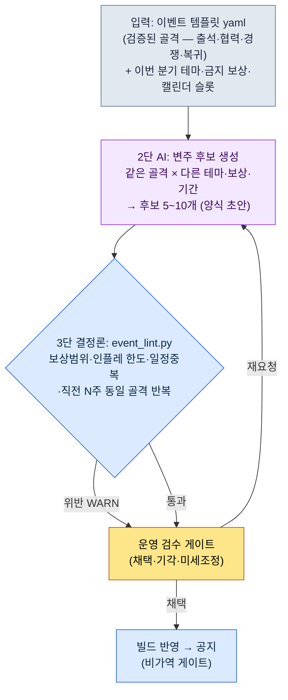
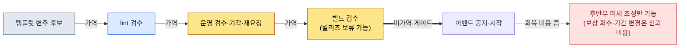

# 15.2 이벤트·시즌 운영 — 템플릿 1장에서 변주 후보 10개를, 검수만 사람이

> 1차 독자: 라이브 운영을 책임지는 MMORPG 기획자 (중규모(10\~50인) 팀)
> 1인/취미 독자용 축소 버전: §15.2.9 「혼자라면 이만큼만」

운영 4년 차 라이브 게임의 월요일 회의를 떠올린다. 다음 주 이벤트를 뭘로 돌릴지가 매주 백지에서 시작됐다. 누군가 "지난번 출석 이벤트 보상을 좀 올려서 다시?"라고 하면, 누군가는 "그건 두 달 전에 했는데"라고 했고, 보상을 얼마 올릴지는 또 감으로 정했다. 회의가 끝나면 운영 기획자 한 명이 반나절을 들여 이벤트 양식을 처음부터 채웠다. 매주, 백지에서, 반나절.

문제는 아이디어가 부족해서가 아니었다. 운영팀은 이미 머릿속에 출석·협력·경쟁·복귀라는 검증된 이벤트 골격 몇 개를 갖고 있었다. 그 골격에 테마와 보상만 갈아 끼우면 한 주짜리 이벤트가 나온다. 다만 그 "갈아 끼우기"를 매번 손으로, 감으로 했기 때문에 느렸고 결과가 흔들렸다.

이 장은 그 갈아 끼우기를 AI에게 넘기는 방법을 다룬다. 핵심은 두 가지다. 첫째, 검증된 이벤트 골격을 **변주 가능한 템플릿 yaml**로 입력해 둔다. 둘째, 템플릿에서 다음 주 후보 여러 개를 뽑는 지루한 일을 AI에게 시키고, 사람은 **보상 범위·중복을 코드로 친 뒤 톤만 검수**한다. 이벤트 기획의 일반론(출석은 신규 유입에 좋고 협력은 활성화에 좋다는 식)은 이미 다른 책에 충분하니, 이 장은 그 지식을 *AI 워크플로로 돌리는 자리*에만 집중한다.

> **저자 운영 경험 메모(솔직히)**
> 출시 후 라이브 운영을 1\~2년 단위로 직접 책임진 경험은 저자 경력 중 일부에 한정된다. 이 장의 워크플로는 저자가 운영 중인 양산·검수 도구(콘텐츠·HUD)를 이벤트 분야로 옮긴 것이며, 효과 수치는 *업계 관찰 + 저자 추정*임을 본문에서 그때그때 명시한다. 도구 구조(템플릿 yaml·lint·검수 게이트)는 저자가 실제로 운영하는 콘텐츠 양산 도구와 동일한 골격이다.

---

## 15.2.1 사람은 템플릿 작성과 마지막 검수만 한다

이벤트 양산의 전체 흐름은 네 단계다. 핵심은 1단(템플릿)과 3단(lint)이 결정론이고 2단만 AI라는 점이다. 콘텐츠 양산(§6.2)·HUD 압축(§14.1)에서 본 것과 같은 분담이다. 룰북이 입력과 검증을 양쪽에서 잡아 주면, 가운데 낀 AI가 매번 약간 다른 변주를 내도 보상 밸런스와 일정이 흔들리지 않는다.



이 그림에서 사람의 손이 닿는 곳은 두 군데뿐이다. 맨 위에서 템플릿과 이번 분기 제약을 깨끗이 넣는 자리, 맨 아래에서 lint가 못 잡는 "이 테마가 지금 우리 게임 분위기에 맞나"를 판단하는 자리. 그 사이의 지루한 후보 양산과 보상 산수는 템플릿과 AI와 lint가 돌린다.

결정적인 설계는 lint(3단)가 위반을 발견해도 후보를 자동으로 버리지 않고 운영 게이트(4단)로 WARN만 올린다는 점이다. 그 이유는 §15.2.5에서 본다. 그리고 맨 마지막 화살표(공지)가 **비가역**이라는 점이 라이브 운영을 다른 양산과 구분 짓는다. 도시 NPC는 마음에 안 들면 빌드 전에 폐기하면 그만이지만, 사용자에게 공지된 이벤트는 되돌릴 때 커뮤니티 신뢰 비용을 치른다(§15.2.7).

---

## 15.2.2 입력 — 이벤트 템플릿 yaml

운영팀이 가진 검증된 골격을 양식으로 고정한다. 자유 양식 기획서로 두면 AI가 무엇을 변주해야 할지 모른다. 슬롯이 나뉘어 있어야 "이 슬롯만 갈아 끼워라"가 성립한다.

```yaml
# event_templates/coop_raid.yaml — 협력 레이드 골격 (검증됨, 4회 운영)
template_id: coop_raid
purpose: [기존_활성화, 커뮤니티]      # 1~2개만. 4개 동시 추구 금지
core_loop: 기간 내 서버 전체가 누적 기여 → 단계별 전 서버 보상 해금
duration_range: [5, 10]              # 일. 10일 초과 시 피로 누적
slots:                               # ← AI가 변주하는 칸. 골격은 고정
  theme: { type: 자유, 제약: 분기_테마_준수 }
  boss_or_target: { type: 자유, 제약: 기존_보스_에셋_재활용_우선 }
  reward_tiers: { type: 보상목록, count: 3~5, 제약: reward_policy 참조 }
reward_policy:                       # ← lint가 읽는 칸. 변주 금지
  강화석_per_event_max: 30           # 이벤트 1회 지급 상한
  골드_per_event_max: 50000
  한정코스튬: 허용 (영구 소유, 경제 영향 0)
  현금성재화_직접지급: 금지
inflation_guard:
  강화석_분기_누적상한: 90           # 분기 내 모든 이벤트 합산
post_event_kpi:                      # ← 사후 자동 측정 슬롯
  - 참여율 (이벤트 노출 대비 1회 이상 참여)
  - 강화석 가격 변동 (사후 30일, 목표 ±10%)
  - 이벤트 후 평일 플레이타임 (의존도 신호)
```

가장 중요한 분리는 `slots`(AI가 변주)와 `reward_policy`(lint가 읽고, AI는 손대지 못함)다. 테마와 보스는 매번 달라도 되지만, 강화석 지급 상한은 게임 경제가 정한 선이다. 이 선을 AI가 매 호출마다 다른 숫자로 뽑으면 인플레이션이 그 자리에서 시작된다. 그래서 보상 *항목*은 AI가 제안하되, 보상 *양*은 정책 범위 안에서만 움직이도록 lint가 친다.

같은 폴더에 `daily_attendance.yaml`(출석), `pvp_ladder.yaml`(경쟁), `comeback.yaml`(복귀)이 같은 형식으로 들어 있다. 이 네 장이 이번 분기 후보 생성의 입력 풀 전부다.

---

## 15.2.3 [워크드 트랜스크립트] 템플릿 1장 → 변주 후보 생성

실제로 어떻게 돌리는지 한 사이클을 끝까지 보여준다. 입력 프롬프트는 그대로 복사해 쓸 수 있고, 출력은 실제 양산 세션을 재구성했다.

### 1단계 — 프롬프트: 변주를 시키되, 골격과 정책을 강제한다

```
첨부한 coop_raid.yaml(4회 검증된 협력 레이드 골격)로 다음 주(W2) 변주 후보 5개만 줘.
이번 분기 테마는 "여름 — 물·축제·더위".
core_loop는 절대 건드리지 말고 slots(테마·보스·보상)만 바꿔,
보상은 reward_policy 상한 안에서만, 후보마다 왜 이 테마·보상인지 한 줄씩 붙여 줘.
직전 3주는 출석·PvP래더·협력레이드였으니 협력 레이드 또 도는 후보엔 [반복주의],
확신 없으면 [애매] 달아서 나한테 넘겨. 표로만, 칸은 후보명·테마·보상tier요약·근거·플래그.
```

여섯 줄의 규칙 중 테마나 보상을 *지정하는* 줄은 한 줄도 없다. 전부 "어디까지만 바꿔라, 무엇을 넘지 마라, 헷갈리면 신고하라"는 울타리다. "여름 이벤트 만들어 줘"처럼 풀어 주면 일반 모바일 RPG 평균이 나오기 때문이다. **변주 범위(slots만), 보상 상한(reward_policy), 반복 주의(직전 3주 이력), 그리고 "애매하면 사람에게"** — 이 울타리가 골격은 지키게 하고 변주는 풀어 준다.

### 2단계 — Claude의 출력 (실제 세션 재구성, 발췌)

```
| 후보명         | 테마            | 보상tier 요약                  | 근거                              | 플래그       |
|---------------|----------------|-------------------------------|----------------------------------|-------------|
| 범람의 둑      | 강 범람 막기    | 강화석 25 / 골드 4만 / 코스튬   | 협력=둑 쌓기 은유, 누적 기여 직결   |             |
| 등불 띄우기    | 여름 물축제     | 강화석 20 / 골드 3만 / 칭호     | 축제 톤, 경쟁보다 분위기 환기      |             |
| 폭염 보스전    | 더위 화신 토벌  | 강화석 30 / 골드 5만 / 코스튬   | 기존 보스 에셋 재활용, 보상 상한    | [반복주의]   |
| 해류 경주      | 조류 타고 경쟁  | 강화석 28 / 골드 4.5만 / 마운트 | 협력+경쟁 혼합                    | [애매]       |
| 비단잉어 수집  | 수집형 협력     | 강화석 22 / 골드 3.5만 / 칭호   | 라이트 유저 진입장벽 낮음          |             |

[반복주의] 폭염 보스전: core_loop가 W-3 협력 레이드와 사실상 동일.
  3주 간격 동일 골격 반복 → 사용자 피로 우려. 다른 골격(출석/수집) 권장.
[애매] 해류 경주: 협력 누적 + 개인 경쟁을 한 이벤트에 섞음.
  purpose 슬롯이 [활성화+경쟁]으로 늘어남. 1~2 목적 원칙과 충돌 가능.
```

출력에서 가장 가치 있는 부분은 표가 아니라 **맨 아래 두 줄**이다. AI가 "폭염 보스전은 3주 전 골격과 같다", "해류 경주는 목적이 둘로 늘었다"고 자기 한계를 신고하고 사람에게 넘긴 자리. 좋은 프롬프트는 AI가 "이건 제가 확신 못 합니다"라고 말할 수 있게 만든다.

이제 이 후보 묶음을 lint가 친다.

---

## 15.2.4 3단 lint — 보상 범위·중복을 코드로 친다

후보가 보상 정책과 일정 중복을 지켰는지 매번 눈으로 보면 또 놓친다. `reward_policy`·`inflation_guard`·캘린더로 판정 가능한 것은 코드가 검수하게 만든다. 사람은 코드가 못 잡는 톤·재미 판단에만 시간을 쓴다.

```python
# event_lint.py — 이벤트 변주 후보 검증 (골격)
# 입력: AI가 제안한 후보 리스트 + 템플릿 정책 + 분기 캘린더
# 출력: WARN 목록 (자동 폐기 아님 — 운영 게이트로 올림)

def lint(candidates, policy, quarter_ledger, recent_weeks):
    warns = []
    stone_used = sum(quarter_ledger.강화석)   # 이번 분기 이미 지급한 누적
    for c in candidates:
        # A: 이벤트 1회 보상 상한 (정책)
        if c.강화석 > policy["강화석_per_event_max"]:
            warns.append(f"[A] {c.name}: 강화석 {c.강화석} > 상한 "
                         f"{policy['강화석_per_event_max']} (이벤트당 초과)")
        # B: 분기 인플레 누적 상한
        if stone_used + c.강화석 > policy["강화석_분기_누적상한"]:
            warns.append(f"[B] {c.name}: 분기 누적 {stone_used + c.강화석} > "
                         f"{policy['강화석_분기_누적상한']} (인플레 한도)")
        # C: 직전 N주 동일 골격 반복
        if c.template_id in recent_weeks[-2:]:
            warns.append(f"[C] {c.name}: {c.template_id} 골격이 직전 2주에 있음 (반복)")
        # D: 캘린더 슬롯 충돌 (같은 주 다른 대형 이벤트)
        if quarter_ledger.slot_taken(c.week):
            warns.append(f"[D] {c.name}: W{c.week} 슬롯에 이미 대형 이벤트 배치됨")
    return warns
```

위 워크드 트랜스크립트의 다섯 후보를 이 코드에 넣으면 이렇게 나온다.

```
[PASS] 범람의 둑: 강화석 25 ≤ 30, 분기누적 65+25=90 ≤ 90 (경계 도달)
[WARN] [C] 폭염 보스전: coop_raid 골격이 직전 2주(W-3)에 있음 (반복)
[WARN] [B] 해류 경주: 분기누적 65+28=93 > 90 (인플레 한도 초과)
[PASS] 등불 띄우기: 강화석 20 ≤ 30, 분기누적 65+20=85 ≤ 90
[PASS] 비단잉어 수집: 강화석 22 ≤ 30, 분기누적 65+22=87 ≤ 90
```

여기서 흥미로운 건 `해류 경주`다. AI는 [애매]를 목적 충돌 때문에 달았는데, lint는 전혀 다른 이유 — **분기 인플레이션 누적 상한 초과** — 로 걸었다. 강화석 28을 더하면 분기 누적이 93이 되어 정책상 90을 넘는다. AI가 못 본 산수를 코드가 잡았다. 반대로 `폭염 보스전`은 AI의 [반복주의]와 lint의 [C]가 같은 걸 가리켰다. 사람·AI·코드 셋이 각자 다른 그물로 거른다.

이 30줄 덕에 "이번 보상 좀 센 거 아니야?"가 더 이상 감과 감의 대결로 끝나지 않는다. `[B] 분기누적 93 > 90`이라고 코드가 출력하면, 토론할 게 없다. 보상을 내리거나 후보를 바꾸면 된다.

---

## 15.2.5 한 사이클을 끝까지 — 검수·기각·재요청

추상적으로 "운영팀이 검수한다"고만 적으면 이 게이트가 실제로 무엇을 거르는지 알 수 없다. lint를 통과한 뒤 사람이 무엇을 죽이고 무엇을 살리는지 한 번 끝까지 따라간다.

> **[4단 운영 검수 — 판정]**
>
> 운영 기획자는 후보 5개를 이렇게 처리했다.
>
> - **폭염 보스전** → **기각.** lint [C]·AI [반복주의]가 같이 가리켰다. 3주 만에 같은 협력 레이드 골격을 또 돌리면 "또 누적 기여냐"는 피로가 온다. 다음 분기 슬롯으로 이월 메모.
> - **해류 경주** → **기각.** lint [B] 인플레 한도 초과. 보상을 25로 낮추면 통과하지만, AI [애매]가 짚은 목적 충돌(활성화+경쟁)이 더 근본 문제였다. 협력 이벤트에 개인 랭킹을 섞으면 라이트 유저가 "결국 고인물 잔치"로 느낀다. 보상만 깎아 살리지 않고 통째로 보류.
> - **범람의 둑** → **채택 후보 1순위.** 단, lint가 `분기누적 90 경계 도달`을 PASS로 줬지만 *경계*라는 점이 마음에 걸렸다. 이 이벤트를 쓰면 이번 분기 강화석 여유가 0이 된다. 6월 마지막 주 시즌 마무리 push에 보상 여력이 없어진다.
> - **등불 띄우기 / 비단잉어 수집** → **살림.** 둘 다 보상이 가볍고(20·22) 분기 여유를 남긴다.

여기서 lint를 통과한 `범람의 둑`을 사람이 1순위에서 흔든 게 이 게이트의 핵심이다. 코드는 `90 ≤ 90`을 PASS로 줬다. 정책상 위반이 아니다. 그러나 운영 기획자는 *분기 전체의 보상 리듬*을 봤다. lint는 한 이벤트의 합법성을 보지만, 사람은 분기 끝의 시즌 마무리까지 본다. 그래서 재요청을 돈다.

```
범람의 둑의 보상을 강화석 25 → 18로 낮춘 변주를 다시 만들어라.
이유: 6월 마지막 주 시즌 마무리 push에 강화석 여유 12를 남겨야 한다.
보상 매력이 떨어지는 만큼, 강화석 대신 한정 코스튬·칭호로
체감 가치를 보강하는 방향으로 reward_tiers를 재구성하라.
```

AI는 강화석을 18로 낮추고 한정 코스튬을 2종으로 늘린(경제 영향 0인 영구 소유 보상) 후보를 다시 냈다. lint를 다시 돌리니 `분기누적 65+18=83 ≤ 90`으로, 시즌 마무리에 여유 7이 남았다. 입력 → 후보 양산 → lint → 검수 → 기각 → 재요청의 한 사이클이 여기서 닫힌다.

이 한 바퀴가 이 책 전체의 Show 기준이다. 도구가 무엇을 뱉고, 무엇이 걸리고, 사람이 무엇을 죽이는지를 한 번이라도 끝까지 보지 않으면, "AI로 이벤트를 양산했다"는 문장은 공허하다.

자동 폐기형 lint를 달지 않은 이유도 이 사이클에 있다. 만약 lint가 [B] 위반을 자동으로 버렸다면, 운영팀은 `해류 경주`의 진짜 문제(목적 충돌)를 학습할 기회를 잃었을 것이고, `범람의 둑`처럼 *합법이지만 분기 리듬상 위험한* 후보를 흔들 자리도 사라졌을 것이다. 의심 후보는 기계가 뽑되, 채택과 기각은 사람이 정한다.

---

## 15.2.6 시즌 — 더 큰 리듬, 같은 분리

이벤트가 주\~월 리듬이라면 시즌은 분기 리듬이다. 운영 방식은 같다. 시즌도 검증된 요소를 슬롯으로 분리해 두면 분기마다 테마만 갈아 끼운다.

| 시즌 슬롯 | 변주(AI·사람) | 고정(정책·lint) |
|---|---|---|
| 시즌 테마 | 여름·겨울·신년 (자유) | — |
| 시즌 패스 보상 트랙 | 단계별 보상 항목 | 단계 수·완료 난이도·보상 상한 |
| 시즌 PvP 랭킹 | 랭킹 보상 항목 | 보상 인플레 한도 |
| 메타 셔플 | 신규 캐릭터·밸런스 | 변경 폭 가드레일(§8.1) |

시즌 패스에서 사람이 정책으로 고정하는 핵심 수치는 **완료율 목표**다. 활성 사용자의 70% 정도가 최종 단계에 도달하도록 난이도를 잡는다는 게 업계에서 흔히 인용되는 기준이다(저자 추정 — 게임마다 다르므로 절대값이 아니라 *방향*으로 읽는 게 맞다: 30% 미만이면 좌절, 90% 초과면 도전감 부재). 이 목표가 슬롯에 입력되어 있으면, 시즌 패스 변주를 AI가 제안할 때도 "예상 완료율"을 함께 산출하게 강제할 수 있다.

분기 캘린더가 한눈에 보여야 이벤트와 시즌이 충돌하지 않는다. 운영팀의 공용 책상 달력에 가깝다. 누가 봐도 같은 그림을 봐야 충돌이 준다.

<svg viewBox="0 0 720 300" xmlns="http://www.w3.org/2000/svg" role="img" aria-label="2분기(4~6월) 이벤트·시즌 통합 캘린더">
  <rect x="0" y="0" width="720" height="300" fill="#0f1117"/>
  <text x="16" y="26" fill="#e5e7eb" font-family="sans-serif" font-size="15" font-weight="bold">2분기 통합 캘린더 — 시즌 1개(분기), 이벤트 주 단위</text>
  <!-- 시즌 띠 -->
  <rect x="16" y="42" width="688" height="30" rx="5" fill="#1e3a5f" stroke="#3b82f6" stroke-width="1.5"/>
  <text x="360" y="62" fill="#bfdbfe" font-family="sans-serif" font-size="13" text-anchor="middle">시즌 "여름 축제" (시즌 패스 50단계 · PvP 랭킹) — 4월~6월 상시</text>
  <!-- 월 구분 -->
  <text x="130" y="96" fill="#9ca3af" font-family="sans-serif" font-size="12" text-anchor="middle">4월</text>
  <text x="360" y="96" fill="#9ca3af" font-family="sans-serif" font-size="12" text-anchor="middle">5월</text>
  <text x="590" y="96" fill="#9ca3af" font-family="sans-serif" font-size="12" text-anchor="middle">6월</text>
  <line x1="245" y1="84" x2="245" y2="270" stroke="#374151" stroke-width="1" stroke-dasharray="4 4"/>
  <line x1="475" y1="84" x2="475" y2="270" stroke="#374151" stroke-width="1" stroke-dasharray="4 4"/>
  <!-- 이벤트 블록: 색 = 골격 종류 -->
  <!-- 4월 -->
  <rect x="20" y="110" width="100" height="34" rx="4" fill="#14532d"/><text x="70" y="131" fill="#bbf7d0" font-size="11" text-anchor="middle">W1 출석</text>
  <rect x="128" y="110" width="100" height="34" rx="4" fill="#7c2d12"/><text x="178" y="131" fill="#fed7aa" font-size="11" text-anchor="middle">W2 협력(둑)</text>
  <!-- 5월 -->
  <rect x="250" y="110" width="100" height="34" rx="4" fill="#581c87"/><text x="300" y="131" fill="#e9d5ff" font-size="11" text-anchor="middle">W3 PvP래더</text>
  <rect x="358" y="110" width="100" height="34" rx="4" fill="#14532d"/><text x="408" y="131" fill="#bbf7d0" font-size="11" text-anchor="middle">W4 수집협력</text>
  <!-- 6월 -->
  <rect x="480" y="110" width="100" height="34" rx="4" fill="#7c2d12"/><text x="530" y="131" fill="#fed7aa" font-size="11" text-anchor="middle">W5 복귀</text>
  <rect x="590" y="110" width="110" height="34" rx="4" fill="#854d0e"/><text x="645" y="131" fill="#fde68a" font-size="11" text-anchor="middle">W6 시즌마무리</text>
  <!-- 인플레 게이지 -->
  <text x="16" y="180" fill="#9ca3af" font-family="sans-serif" font-size="12">분기 강화석 인플레 누적 (상한 90)</text>
  <rect x="16" y="190" width="688" height="22" rx="4" fill="#1f2937"/>
  <rect x="16" y="190" width="635" height="22" rx="4" fill="#b45309"/>
  <line x1="651" y1="184" x2="651" y2="218" stroke="#ef4444" stroke-width="2"/>
  <text x="640" y="232" fill="#fca5a5" font-size="11" text-anchor="end">현재 누적 83 / 한도 90 (여유 7 = 시즌 마무리 push 몫)</text>
  <!-- 범례 -->
  <rect x="16" y="252" width="14" height="14" fill="#14532d"/><text x="36" y="264" fill="#9ca3af" font-size="11">출석·수집</text>
  <rect x="120" y="252" width="14" height="14" fill="#7c2d12"/><text x="140" y="264" fill="#9ca3af" font-size="11">협력·복귀</text>
  <rect x="240" y="252" width="14" height="14" fill="#581c87"/><text x="260" y="264" fill="#9ca3af" font-size="11">경쟁(PvP)</text>
  <rect x="360" y="252" width="14" height="14" fill="#854d0e"/><text x="380" y="264" fill="#9ca3af" font-size="11">시즌 이벤트</text>
</svg>

이 그림 한 장이 §15.2.5의 판단을 시각으로 설명한다. 색이 골격 종류다. **같은 색이 2\~3주 안에 두 번 나오면 §15.2.4 lint [C]가 운다.** 그리고 아래 인플레 게이지가 빨간 선(상한 90)에 닿기 직전이라, 6월 시즌 마무리(W6)에 쓸 여유 7이 겨우 남았다 — `범람의 둑` 보상을 18로 낮춰 확보한 그 7이다.

---

## 15.2.7 비가역 게이트 — 공지 전에 모든 검수를 끝낸다

도시 NPC(§6.2)나 HUD(§14.1)와 라이브 운영이 결정적으로 다른 점이 하나 있다. **공지는 되돌릴 수 없다.** NPC가 톤이 안 맞으면 빌드 전에 폐기하면 그만이고 사용자는 그 NPC가 있었는지도 모른다. 그러나 사용자에게 공지된 이벤트는 보상·기간·룰이 커뮤니티에 남는다. 시작 후 "이벤트 보상이 너무 셌으니 회수하겠다"는 비가역 비용을 동반한다.



이 책 전체의 원칙(§5.4.5 보이스 녹음, §8.1 라이브 빌드, 12부 최종 렌더와 같은 메시지)이 라이브 운영에서도 동일하다. 모든 검수 — 보상 범위, 인플레 한도, 일정 충돌, 톤 — 는 공지 전 가역 단계에서 끝나야 한다. §15.2.3\~5의 양산·lint·검수·재요청 사이클 전체가 이 비가역 게이트 *왼쪽*에서 도는 이유다. 게이트를 넘은 뒤 할 수 있는 건 §15.2.8의 후반부 미세 조정 정도이고, 그조차 사용자 신뢰를 야금야금 쓴다.

---

## 15.2.8 운영 중 신호와 처방

공지 후에도 KPI는 본다. 다만 공지 전 검수와 달리, 여기서 할 수 있는 건 후반부 미세 조정뿐이다. 자동 측정되는 신호와 사람의 처방을 나눈다.

| 신호 (자동 측정) | 처방 (사람 결정) |
|---|---|
| 참여율 50% 미만 | 후반부 보상 소폭 강화 또는 기간 +2일 (공지 신뢰 범위 내) |
| 참여율 95% 이상 | 너무 쉬움 — 다음 사이클 난이도 메모, 현 이벤트는 유지 |
| 강화석 가격 사후 30일 -10% 초과 | sink 강화(한정 상점), 다음 분기 인플레 한도 하향 |
| 이벤트 후 평일 플레이타임 감소 | 이벤트 의존 신호 — 평일 콘텐츠 매력 보강, 이벤트 빈도 조절 |

마지막 줄(평일 플레이타임 감소)이 가장 자주 놓치는 신호다. 이벤트 기간 DAU(Daily Active Users, 일일 활성 사용자)만 보면 이벤트는 늘 성공처럼 보인다. 그러나 이벤트가 끝난 뒤 평일에 사용자가 안 돌아오면, 이벤트가 평소 게임의 매력을 빨아먹고 있다는 뜻이다. 그래서 §15.2.2 템플릿의 `post_event_kpi`에 "이벤트 후 평일 플레이타임"을 처음부터 슬롯으로 입력해 둔다. 측정하지 않으면 처방할 수 없다.

---

## 15.2.9 효과는 어디까지 정직하게 말할 수 있나

이벤트 챕터는 "협력 이벤트를 돌렸더니 리텐션이 30%에서 50%로 올랐다" 같은 표를 넣고 싶은 유혹이 크다. 그런 숫자는 검증되지 않으면 책의 신뢰를 깎는다. 이 장이 말할 수 있는 것은 세 가지뿐이다.

첫째, **방향은 업계 관찰로 말할 수 있다.** 출석 보상 강화 이벤트는 단기 활성 사용자 수를 끌어올리고, 협력 이벤트는 커뮤니티 결속을 높이며, 한정 패키지는 이벤트 기간 매출을 끌어올린다 — 이건 라이브 게임을 관찰해 온 업계의 통념이다. 다만 *얼마나*는 게임·사용자 구성에 따라 편차가 커서, 다른 회사의 수치를 그대로 옮기면 위험하다.

둘째, **저자 추정은 추정이라고 쓴다.** "시즌 패스 완료율 목표 70%", "이벤트 기간 10일 초과 시 피로 누적", "이벤트 양산 반나절→한 시간"은 저자의 경험 기반 추정이며 미검증 가설이다. 절대값을 외우지 말고 *구조*(템플릿+lint가 백지 기획을 대체한다)로 읽으면 된다.

셋째, **측정 가능한 것만 KPI로 약속한다.** 리텐션 같은 결과 지표는 이벤트 하나로 좌우되지 않으니 인과를 단정하지 않는다. 대신 이 워크플로가 실제로 측정 가능하게 만드는 것은 이런 것들이다 — lint WARN 건수(보상 위반이 0이 될 때까지), 분기 인플레 누적(상한 대비), 동일 골격 반복 간격(주), 이벤트별 참여율과 사후 강화석 가격 변동. 이 넷은 회의에서 "느낌"이 아니라 숫자로 말할 수 있다.

---

## 15.2.10 흔한 실패

| 패턴 | 왜 실패하나 | 처방 |
|---|---|---|
| 매주 백지에서 이벤트 기획 | 느리고 결과가 흔들림 | 검증 골격을 템플릿 yaml로 입력하기 (§15.2.2) |
| "AI야 여름 이벤트 만들어 줘" 통째 위임 | 일반 RPG 평균 이벤트가 나옴 | 골격 고정 + 슬롯만 변주 (§15.2.3) |
| 보상 양을 AI가 자유 제안 | 인플레이션이 그 자리에서 시작 | reward_policy를 lint가 강제 (§15.2.4) |
| 후보를 눈으로만 검수 | 분기 누적·반복 간격을 매번 놓침 | event_lint.py로 자동 검증 (§15.2.4) |
| lint 통과 = 채택으로 직행 | 분기 리듬·목적 충돌을 못 봄 | 사람 게이트는 분기 전체를 본다 (§15.2.5) |
| 공지 후 보상 회수 시도 | 비가역 신뢰 비용 | 모든 검수를 공지 전에 (§15.2.7) |
| 이벤트 기간 DAU만 측정 | 평일 매력 잠식을 못 봄 | 사후 평일 플레이타임 슬롯 (§15.2.8) |

다섯 번째가 가장 자주 놓친다. lint를 PASS했다고 바로 공지로 보내면, `범람의 둑`처럼 *합법이지만 분기 끝에 보상 여력을 0으로 만드는* 후보를 흔들 자리가 사라진다. 코드는 한 이벤트의 합법성을, 사람은 분기 전체의 리듬을 본다.

---

## 15.2.11 따라하기 — 오늘 할 수 있는 한 단계

> **혼자라면 이만큼만**: lint 코드가 없어도 됩니다. 본인 게임(또는 좋아하는 라이브 게임)에서 자주 보이는 이벤트 골격 하나를 골라 §15.2.2 형식의 템플릿 yaml을 손으로 적어 보세요(`core_loop`·`slots`·`reward_policy` 세 칸이 핵심). 그리고 §15.2.3 프롬프트를 붙여 변주 후보 5개를 뽑아 본 뒤, 그중 "보상이 너무 세다" 싶은 한 개를 골라 "이건 이번 달 보상 여력을 넘긴다, 낮춰서 다시"라고 반박해 보세요. 채택과 기각이 어떤 판단의 묶음인지 몸으로 들어옵니다.

팀이라면 다음 한 단계로 시작하세요. 자주 돌리는 이벤트 골격 3\~4개를 템플릿 yaml로 입력하고, `event_lint.py`의 세 줄(보상 상한·분기 인플레 누적·반복 간격)부터 코드로 만듭니다. 템플릿과 이 세 줄만 있어도, "매주 백지 기획"과 "보상 감으로 정하기"라는 두 가지 흔한 실패를 먼저 막을 수 있습니다. 이 워크플로는 §15.1.5의 진보적 적용 골격 3요소 — 이벤트 템플릿·시즌 룰 라이브러리, AI 이벤트 후보 생성기, 사후 자동 측정 — 의 첫 실무 구현입니다.

---

### 이 챕터의 핵심 메시지
- 검증된 이벤트 골격을 템플릿 yaml로 입력하면, AI가 슬롯만 변주해 후보를 양산한다.
- 보상 양·인플레 한도·반복 간격은 lint가, 톤·분기 리듬은 사람이 친다.
- 공지는 비가역이라, 모든 검수는 공지 전 가역 단계에서 끝난다.

### 다음 챕터 미리보기
- 15.3 유저 피드백 사이클 — 사용자 의견과 디렉터 비전의 균형, 그리고 피드백 자동 클러스터링
