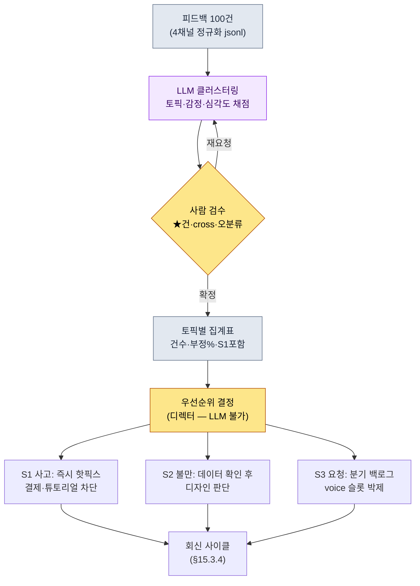

# 15.3 피드백 100건을 토픽으로 — 클러스터링은 LLM에, 우선순위는 사람에

> 1차 독자: 라이브 운영의 사용자 대응을 책임지는 기획자·디렉터 (중규모(10\~50인) 팀)
> 1인/취미 독자용 축소 버전: §15.3.7 「혼자라면 이만큼만」

먼저 솔직히 밝혀 둔다. 저자는 출시 후 라이브 운영을 1\~2년 단위로 직접 책임진 경험이 길지 않다. 이 장의 상당 부분은 24년 경력 위에 쌓인 **업계 관찰과 인접 경험**이다. 그래서 이 장은 "라이브 운영을 이렇게 하라"고 단정하지 않는다. 대신, 출시 전 콘텐츠 양산에서 검증한 *입력 → AI → 검증 → 사람 결정*의 사이클을 **사용자 피드백**이라는 입력에 그대로 끼워 보면 무엇이 나오는지를 한 번 끝까지 돌려 본다. 도구의 골격은 §6.2 city_hunting_generator와 같고, 입력만 "도시 메타데이터"에서 "사용자 피드백 100건"으로 바뀐다.

운영 첫 주의 풍경은 대개 비슷하다. 포럼·Discord·CS 티켓·스토어 리뷰가 하루에 수백\~수천 건씩 쌓인다. 사람이 다 읽기는 불가능하고, 안 읽으면 같은 버그 신고가 50건씩 묻힌다. 이 장은 그 더미를 **LLM이 토픽으로 묶고 감정으로 채점**하게 한 다음, 사람은 "그래서 이번 주에 뭘 고칠 것인가"라는 **우선순위 결정**에만 들어가는 방법을 다룬다.

---

## 15.3.1 피드백은 '읽을거리'가 아니라 '분류 입력'이다

피드백을 4채널(게임 내 설문·포럼/Discord·스토어 리뷰·CS 티켓)로 나누고 4유형(버그·요청·불만·칭찬)으로 분류하는 표는 어느 운영 교과서에나 있다. 다 맞는 말이다. 문제는 그 표를 외워도 "오늘 들어온 412건을 어떻게 처리하느냐"에 답이 안 나온다는 점이다. 피드백을 *사람이 읽고 분류하는 대상*으로 보는 한, 피드백량은 항상 운영팀 인원을 이긴다.

관점을 바꾼다. 피드백 한 건은 **구조화 입력**이다. `{출처, 원문, 토픽, 감정, 심각도}` 다섯 슬롯을 가진 레코드다. 이렇게 보면 작업의 본질이 바뀐다. "다 읽기"가 아니라 "토픽으로 묶고 우선순위를 매기기"다. 그리고 토픽 클러스터링과 감정 채점은 사람이 하면 지루하고 할 때마다 기준이 흔들리지만, 기계는 같은 잣대를 100건에 똑같이 들이댄다. 바로 LLM이 사람보다 잘하는 종류의 일이다. §6.2에서 도시 30개를 양산한 그 분담(룰북=결정론, 본문=AI, 검수=사람)이 여기서도 그대로 성립한다. 다른 점은 단 하나, 마지막에 사람이 하는 일이 "본문 검수"가 아니라 "우선순위 결정"이라는 것뿐이다.

피드백 유형의 분포를 하나 짚어 둔다. 자발적으로 글을 쓰는 사용자는 만족한 사용자가 아니라 불만이 있는 사용자 쪽으로 기운다. 만족한 손님은 조용히 떠나고, 불만 있는 손님이 카운터로 다시 온다. 그래서 포럼·리뷰의 감정 분포는 실제 사용자 전체의 만족도보다 부정 쪽으로 치우치는 경향이 있다(저자 관찰 — 정확한 편향 폭은 게임·채널·시기마다 다르므로 절대 수치가 아니라 *방향*으로 읽는 게 맞다). 이 편향을 머리에 넣고 있어야, 클러스터링 결과에서 "부정 60%"를 봤을 때 게임이 망해 간다고 오독하지 않는다.

---

## 15.3.2 [워크드 트랜스크립트] 피드백 100건 → 토픽 클러스터 + 감정

실제로 한 사이클을 끝까지 돌려 본다. 입력은 한 주차에 4채널에서 모인 피드백 100건이고, 출력은 토픽 클러스터·감정·우선순위다. 입력 프롬프트는 그대로 복사해 쓸 수 있고, 아래 출력은 실제 분류 세션의 형식을 재구성한 것이다.

### 1단계 — 입력: 피드백을 기계가 읽을 표로 만든다

채널에서 긁어 온 원문을 한 줄 한 레코드로 정규화한다. 이건 새로 쓰는 게 아니라 추출·정리만 하면 된다.

```jsonl
{"id": "fb_0001", "src": "discord",     "text": "강화 12강에서 50번 깨졌어요. 이게 확률이 맞나요? 환불해주세요"}
{"id": "fb_0002", "src": "store_review","text": "그래픽은 예쁜데 렉이 너무 심해서 길드전 때마다 튕김"}
{"id": "fb_0003", "src": "cs_ticket",   "text": "결제했는데 다이아가 안들어왔습니다 주문번호 첨부"}
{"id": "fb_0004", "src": "forum",       "text": "신규 직업 궁수 언제 나오나요 ㅠㅠ 사전등록 때 약속했잖아요"}
{"id": "fb_0005", "src": "discord",     "text": "오픈 첫주인데 운영진 소통 좋네요 공지 빠르고. 앞으로도 부탁"}
{"id": "fb_0006", "src": "store_review","text": "특정 보스(흑랑) 데미지가 말이 안됨. 풀템인데 한방. 밸런스 패치 요망"}
{"id": "fb_0007", "src": "cs_ticket",   "text": "튜토리얼 5단계에서 진행이 안돼요 버튼이 안눌림 (기기: 갤럭시 A시리즈)"}
// ... fb_0008 ~ fb_0100 (생략)
```

레코드는 입력 단계에서 `토픽·감정·심각도`를 비워 둔다. 그 빈칸을 채우는 게 2단 LLM의 일이다.

### 2단계 — 프롬프트: 클러스터링을 시키되, 라벨과 형식과 탈출구를 강제한다

```
첨부한 feedback_100.jsonl(한 주차 피드백 100건)을 토픽으로 묶고 감정도 같이 채점해 줘.
토픽은 이 목록에서만 골라(자유 생성 금지): 강화/확률, 밸런스, 서버/성능, 결제/환불,
신규콘텐츠요청, 튜토리얼/온보딩, UI/조작, 칭찬/응원, 기타. '기타'가 8건 넘으면 새 토픽 후보도 제안해.
감정은 부정·중립·긍정, 심각도는 S1·S2·S3·S4로.
// (의도: S1은 구체적·재현 가능·기능 차단일 때만. 단순 강한 불만은 S2)
확신 없는 건은 '기타'로 두고 id 끝에 ★ 달아서 나한테 넘기고, 억지로 끼워 맞추지 마.
표 두 개만 줘 — 표A(건별): id·토픽·감정·심각도 / 표B(토픽별): 토픽·건수·부정%·대표원문1개·S1포함여부.
```

이 프롬프트에서 분류 결과를 좌우하는 건 토픽 목록도 감정 척도도 아닌, 라벨을 *고정*하고 형식을 *못 박고* 탈출구를 *열어 둔* 세 가지 통제 장치다. 토픽을 자유 생성하게 두면 LLM이 "전반적 불만족", "게임성 개선 요청" 같은 우선순위로 쓸 수 없는 뭉뚱그린 라벨을 만든다. 허용 라벨 목록(규칙 1), 심각도 정의(규칙 3 — S1의 좁은 정의가 핵심), 출력 형식(표 두 개), 그리고 "확신 없으면 ★ 달고 사람에게"(규칙 5). 이 넷이 빠지면 표가 우선순위 도구가 아니라 또 하나의 읽을거리로 전락한다. 이 라벨 목록 자체가 §15.1.5에서 말한 *피드백 L4 레이어의 카테고리 체계*다 — 라벨이 고정돼 있어야 분기마다 같은 축으로 추이를 비교할 수 있다.

### 3단계 — Claude의 출력 (재구성, 발췌)

```
[표A] 건별 분류 (발췌)
id       | 토픽          | 감정 | 심각도
fb_0001  | 강화/확률      | 부정 | S2
fb_0002  | 서버/성능      | 부정 | S2
fb_0003  | 결제/환불      | 부정 | S1
fb_0004  | 신규콘텐츠요청  | 중립 | S3
fb_0005  | 칭찬/응원      | 긍정 | S4
fb_0006  | 밸런스         | 부정 | S1
fb_0007  | 튜토리얼/온보딩 | 부정 | S1
fb_0042★ | 기타           | 중립 | S3
...

[표B] 토픽별 집계 (전체 100건)
토픽           | 건수 | 부정% | 대표원문                              | S1포함
서버/성능      | 24  | 92%  | "길드전 때마다 튕김"                   | 예(일부 재현)
강화/확률      | 21  | 95%  | "12강에서 50번 깨졌어요"               | 아니오
밸런스         | 14  | 86%  | "흑랑 풀템인데 한방"                   | 예
신규콘텐츠요청  | 12  | 8%   | "궁수 언제 나오나요"                   | 아니오
튜토리얼/온보딩 | 9   | 78%  | "5단계 버튼이 안눌림(갤럭시 A)"         | 예
결제/환불      | 8   | 100% | "다이아가 안들어왔습니다"              | 예
UI/조작        | 6   | 67%  | "스킬 버튼이 작아서 오터치"            | 아니오
칭찬/응원      | 4   | 0%   | "운영진 소통 좋네요"                   | 아니오
기타           | 2   | -    | (fb_0042★, fb_0067★ 사람 판정 대기)   | -

전체 감정: 부정 71 / 중립 18 / 긍정 11
'기타' 2건(8건 미만) → 새 토픽 제안 불필요
확신 미달 ★표시 2건: fb_0042, fb_0067 (사람 판정 요청)
```

이 출력에서 가장 가치 있는 부분은 표가 아니라 **맨 아래 두 줄, "★표시 2건"**이다. LLM이 자기가 못 묶는 걸 신고하고 사람에게 넘긴 자리다. §6.2에서 NPC '그렘'에 AI가 스스로 애매 표시를 달았던 것과 같은 설계다. 좋은 프롬프트는 AI가 "이건 확신 못 합니다"라고 말할 수 있게 만든다.

### 4단계 — 검증과 거부 (사람의 자리)

이 출력을 그대로 받으면 안 된다. 한 군데가 실제로 걸렸다.

`강화/확률` 토픽 21건이 전부 S2(불만)로 분류됐다. 그런데 그중 fb_0001은 "환불해주세요"가 붙어 있다. LLM은 이걸 "강한 불만(S2)"으로만 봤다. 여기서 사람이 개입한다. 강화 확률에 대한 불만은 — 데이터로 확률이 명세대로 작동하는 한 — S1 사고가 아니다. 명세대로 굴러가는 확률에 대한 불만은 *디자인·체감 문제*이지 *버그*가 아니기 때문이다. LLM의 S2 판정이 맞다. 다만 "환불 요구"라는 신호는 결제 토픽으로 cross-link해서 CS가 따로 봐야 한다. LLM은 토픽을 단일 라벨로만 달았고, 한 건이 두 토픽에 걸치는 경우를 놓쳤다.

그래서 재요청한다.

```
규칙 추가: 한 건이 두 토픽에 걸치면(예: 강화 불만 + 환불 요구) 주 토픽 외에
'cross' 칸에 보조 토픽을 적어라. 표A에 cross 칸을 추가해 다시 출력하라.
단, 강화 확률 불만 자체는 데이터상 확률이 명세대로면 S1이 아니라 S2로 유지하라.
```

이 한 번의 왕복으로 끝난다. LLM은 fb_0001에 `토픽=강화/확률, cross=결제/환불, 심각도=S2`로 다시 답했고, ★표시 2건은 사람이 직접 읽어 fb_0042를 `UI/조작`, fb_0067을 `튜토리얼/온보딩`으로 재배치했다. **100건을 사람이 처음부터 읽고 분류하면 한나절, LLM 초안 + 사람 검수 + 1회 왕복이면 한 시간 안쪽**이다(저자 추정, 미검증 가설 — 정확한 절약값은 피드백 건수·채널 수에 따라 달라지므로 절대 시간보다 "처음부터 손으로"와 "초안+검수"의 구조 차이로 읽는 게 맞다).

---

## 15.3.3 우선순위는 LLM이 못 준다 — 사람의 자리

여기서 결정적인 선을 긋는다. 위 표B는 "어느 토픽이 몇 건, 얼마나 부정적인가"까지만 말한다. **"그래서 이번 주에 뭘 먼저 고칠 것인가"는 LLM이 줄 수 없다.** 그건 비용·일정·게임 비전이 얽힌 결정이고, 그 결정의 책임은 디렉터에게 있다.

같은 표를 놓고 두 운영팀이 정반대 결정을 내릴 수 있다. 건수만 보면 `서버/성능`(24건)과 `강화/확률`(21건)이 1·2위다. 그런데 우선순위는 건수 순서와 다르게 간다. 이유는 **심각도와 가역성**이다.



이 흐름에서 사람의 손이 닿는 곳은 두 군데뿐이다. 가운데 검수 게이트(★·cross·오분류 판정)와, 맨 아래 우선순위 결정. 그 사이의 지루한 100건 분류는 LLM이 돌린다. 그리고 우선순위 결정의 실제 논리는 건수가 아니라 다음 세 축이다.

| 토픽 | 건수 | 우선순위 판단 (디렉터의 자리) |
|---|---|---|
| 결제/환불 (S1) | 8 | **1순위.** 건수는 적지만 기능 차단 + 비가역(돈). 24h 핫픽스 |
| 튜토리얼/온보딩 (S1) | 9 | **2순위.** 신규 사용자 이탈 직결. 특정 기기 재현 → 패치 |
| 서버/성능 | 24 | **3순위.** 최다 건수지만 인프라 작업 = 일정 김. 핫픽스 불가, 차주 |
| 강화/확률 (S2) | 21 | **유지.** 데이터상 명세대로면 버그 아님. 디자인 결정으로 별도 검토 |
| 신규콘텐츠요청 | 12 | **백로그.** 부정 8%(=긍정적 기대). 분기 voice 슬롯으로 박제 |

건수 1위인 `서버/성능`이 우선순위 3위로 내려간 이유는 핫픽스로 못 고치는 인프라 작업이기 때문이고, 건수 6위인 `결제/환불`이 1위로 올라간 이유는 돈이 걸린 비가역 사고이기 때문이다. **이 재배열을 LLM은 못 한다.** LLM은 "결제 8건, 부정 100%"라는 사실까지만 준다. 그게 1순위라는 결정은 비용·법적 리스크·게임 비전을 아는 사람의 몫이다. 이것이 §15.1.5에서 말한 "AI가 분류·후보를 만들고, 사람은 채택과 비전 결정에 집중한다"의 피드백 분야 실제 모습이다.

---

## 15.3.4 회신 — 비가역 단계라 검수 게이트가 더 무겁다

우선순위가 정해지면 사용자에게 회신한다. 라이브 운영에서 회신 부재가 신뢰의 가장 큰 손상 자리다. 답할 게 없어도 "검토 중"이 무응답보다 낫다. 회신 초안도 LLM이 토픽별로 뽑을 수 있다.

> **[회신 초안 — LLM 출력, 토픽별]**
>
> - **결제/환불(S1)**: "다이아 미지급 건 확인했습니다. 주문번호 기준 24시간 내 소급 지급하며, 개별 회신드립니다."
> - **서버/성능**: "길드전 시 발생하는 튕김을 재현 확인 중입니다. 차주 점검에서 우선 처리 예정이며, 진행 상황을 공지로 안내하겠습니다."
> - **강화/확률**: "강화 확률은 명세 표기 그대로 적용되고 있음을 데이터로 확인했습니다. 다만 체감 난이도에 대한 의견은 별도로 검토 중입니다."
> - **신규콘텐츠요청(궁수)**: "신규 직업은 로드맵에 있으며, 일정이 확정되는 대로 가장 먼저 공지하겠습니다."

여기서 §6.2와 결정적으로 다른 점이 하나 있다. **회신 발송은 비가역 단계다.** 도시 NPC는 폐기하고 다시 만들면 그만이지만, 사용자가 한 번 본 공지·회신 텍스트는 되돌릴 수 없다. "24시간 내 지급"이라고 자동 발송했는데 실제로는 사흘 걸리면, 그 약속은 커뮤니티에 비가역 흔적으로 남는다. 그래서 §15.1.4의 비가역 단계 원칙이 피드백 분야에서는 다른 분야보다 **더 무겁게** 작동한다. 자동 회신 초안은 LLM이 만들되, **CS 검수 게이트를 통과하기 전에는 한 글자도 자동 발송하지 않는다.** 검수자는 일정 약속(24h·차주)이 실제 작업 일정과 맞는지, 예민한 사례(법적 분쟁·환불 분쟁)가 자동 발송 풀에 섞이지 않았는지만 본다. lint가 못 잡는 판단을 사람이 맡는 자리다.

| 단계 | 가역성 | 누가 |
|---|---|---|
| 피드백 클러스터링·감정 채점 | 가역 (재실행 자유) | LLM |
| 토픽 검수·우선순위 결정 | 가역 (확정 전) | 사람 (디렉터) |
| 회신 초안 생성 | 가역 (폐기·재작성) | LLM |
| **회신 발송·공지 게시** | **비가역 (사용자 인식)** | **사람 (CS 검수 후)** |

---

## 15.3.5 사용자 voice를 분기 회고에 박제한다

같은 피드백이 매분기 다른 결정으로 흔들리지 않으려면, 클러스터링 결과를 **분기 회고의 고정 입력 슬롯**으로 박제해야 한다. 즉흥적으로 "요즘 강화 불만 많던데"가 아니라, 분기마다 같은 라벨 축으로 집계된 표가 회고 테이블 안에 들어간다. §15.3.2에서 라벨을 자유 생성 금지하고 허용 목록으로 고정한 이유가 여기서 회수된다.

> **2026 Q2 사용자 voice (LLM 자동 집계, 분기 누적)**
> ```
> 채널 4종 누적 약 5,000건 클러스터링 (건수는 분기 실집계 — 가공 아님)
>
> 부정 상위 토픽:   강화/확률 > 서버/성능 > 밸런스 > 결제/환불
> 요청 상위 토픽:   신규직업 > 신규사냥터 > 길드시스템 > UI개선
> 분기 감정 추이:   Q1 부정 68% → Q2 부정 71% (소폭 악화 — 강화 토픽 견인)
> ```

이 표가 분기 결정의 *입력*이 된다. 결정 자체는 디렉터의 몫이고, 입력은 사용자의 몫이다. 분기 추이("Q1 68% → Q2 71%")는 *방향*으로만 읽는다. 단일 분기 절대값이 아니라 같은 라벨 축의 변화 방향이 신호다. 부정%가 올랐다면 "어느 토픽이 끌어올렸는가"를 되짚어 다음 분기 우선순위로 연결한다. 이 분기 보고서 초안 자체도 LLM이 자연어로 뽑고, 사람은 결정 코멘트만 단다 — §15.1.5에서 말한 분기 보고서 자동 초안의 실제 자리다.

---

## 15.3.6 수치를 정직하게 다루는 법

라이브 운영 챕터는 "피드백 사이클을 도입했더니 NPS가 20에서 45로 올랐다" 같은 표를 넣고 싶은 유혹이 크다. 저자는 그 인과를 측정한 적이 없으므로 쓰지 않는다. 이 책의 원칙은 세 가지 중 하나다.

첫째, **실집계 건수는 그대로 쓴다.** §15.3.2의 토픽별 건수(서버 24·강화 21·결제 8)와 §15.3.5의 분기 누적은 분류 결과를 한 건씩 센 값이지, 보기 좋으라고 맞춰 둔 비율이 아니다.

둘째, **추정은 추정이라고 쓴다.** "100건 분류가 한나절→한 시간"(§15.3.2), "포럼 감정이 부정 쪽으로 편향"(§15.3.1)은 저자의 경험·관찰 기반 추정이며 미검증 가설이다. 절대값을 외우지 말고 *방향*(피드백량은 항상 인원을 이긴다, 자발적 글은 불만 쪽으로 기운다)으로 읽으면 된다.

셋째, **측정 가능한 것만 지표로 약속한다.** 피드백 사이클이 실제로 측정 가능한 것은 결과 만족도(NPS)가 아니라 과정 지표다 — 미분류 피드백 잔량(목표 0), S1 사고 발견→핫픽스 리드타임, 회신 응답 시간, '기타' 토픽 비율(허용 라벨이 현실을 못 담으면 '기타'가 부풀어 오른다). 이 넷은 회의에서 "느낌"이 아니라 숫자로 말할 수 있다.

---

## 15.3.7 따라하기 — 오늘 할 수 있는 한 단계

> **혼자라면 이만큼만**: CS 시스템도 데이터셋도 필요 없습니다. 본인 게임(또는 좋아하는 게임)의 스토어 리뷰·커뮤니티 글을 손으로 20\~30건만 복사해 jsonl로 만들고(`{"id":..., "src":..., "text":...}`), §15.3.2의 프롬프트를 그대로 붙여 한 번 돌려 보세요. 나온 표B에서 "건수 1위 토픽"과 "당신이 먼저 고치고 싶은 토픽"이 다른 한 건을 찾아, 왜 다른지 한 줄로 적어 보면 — 우선순위가 왜 LLM의 일이 아니라 사람의 일인지가 몸으로 들어옵니다.

팀이라면 다음 한 단계로 시작하세요. 4채널 피드백을 한 줄 한 레코드 jsonl로 모으는 추출 스크립트와, §15.3.2의 **허용 토픽 라벨 목록**을 먼저 고정합니다. 라벨이 고정돼 있어야 LLM 분류든 사람 분류든 같은 축으로 재고, 분기 추이를 비교할 수 있습니다. 자동 회신은 그 다음입니다 — 회신은 비가역이라, CS 검수 게이트 없이는 절대 자동 발송에 연결하지 않습니다.

---

### 이 챕터의 핵심 메시지
- 피드백은 읽을거리가 아니라 분류 입력이다 — 클러스터링·감정은 LLM, 우선순위는 사람.
- 우선순위는 건수가 아니라 심각도·가역성으로 갈린다 (결제 8건 > 서버 24건).
- 회신은 비가역이라 CS 검수 게이트가 다른 분야보다 더 무겁다.

### 다음 챕터 미리보기
- 16.1 TaskForce 운영 — 분야 간 합의를 끌어내는 도구
