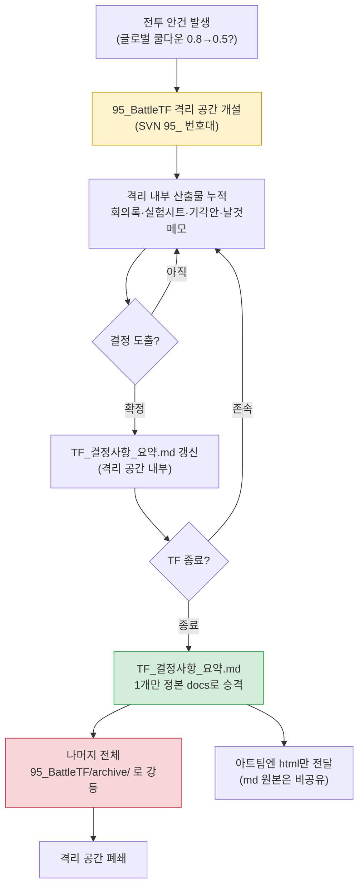

# 16.1 전투 TF 운영 — 격리된 작업공간에서 결정만 정본으로

목요일 오후 4시. 전투 TF 회의가 끝나고 7명이 각자 자리로 흩어졌다. 화이트보드에는 글로벌 쿨다운을 0.8초에서 0.5초로 내릴지 말지에 대한 흔적이 남아 있다. 밸런스 시니어는 "내 시뮬에선 0.5가 맞다"고 했고, 코드 리드는 "0.5면 서버 틱이 못 따라간다"고 했다. UI 디자이너는 "둘 다 모르겠고 쿨다운 게이지 폭이 너무 좁아진다"고 했다.

세 사람 다 맞는 말이다. 그리고 세 사람 다 자기 분야의 문서에 자기 결론을 적기 시작하면, 다음 주에 이 세 문서는 서로 충돌한다. 밸런스 시트는 0.5로, 코드 스펙은 0.8로, UI 가이드는 0.6으로 적혀 있는 상태. 누가 봐도 어느 게 정본인지 모른다.

전투 TF의 존재 이유는 바로 이 충돌을 한 자리에서 흡수하는 것이다. 그리고 그 흡수의 결과물 — 단 하나의 결정 — 만 정본 문서로 올라가야 한다. 나머지 토론의 잔해는 격리된 작업공간 안에서 끝나야 한다. 이 챕터는 그 격리와 흡수의 메커니즘을 다룬다.

---

## 16.1.1 TF는 영구 부서가 아니라 격리된 작업공간이다

전투 시스템 대개편은 한 직군으로 끝나지 않는다. 글로벌 쿨다운 하나를 건드리면 밸런스(수치), 코드(서버 틱), UI(게이지 표현), 애니메이션(모션 길이), 사운드(타격감)가 동시에 흔들린다. 이런 안건을 분야별로 따로 돌리면 결정이 2\~4주씩 늘어지고, 결정이 나도 분야 간에 어긋난다.

TF(TaskForce)는 이 어긋남을 막기 위해 여러 직군을 한 작업공간에 잠시 모으는 단위다. 핵심은 "잠시"와 "격리"다. 회사의 정본 문서 체계 안에 TF의 토론을 그대로 흘려보내면, 미검증 토론·기각된 안·실험 중인 수치가 정본을 오염시킨다. 그래서 우리는 SVN 안에 `95_` 번호로 시작하는 격리 작업공간을 만든다.

`95_BattleTF`. 95번대 번호는 단기 TF 작업공간을 뜻하는 약속이다. 일반 정본 docs는 10번대·20번대 번호를 쓰고, 90번대는 "임시·격리·종료 예정"의 신호다. 폴더 번호만 보고도 "여긴 정본이 아니다, 여기서 본 수치를 인용하지 마라"가 즉시 전달된다.

격리의 규칙은 단순하다.

- TF 안에서 생산되는 모든 문서(회의록·실험 시트·기각된 안·날것 메모)는 `95_BattleTF` 안에서만 산다.
- TF가 종료될 때 `TF_결정사항_요약.md` **단 하나만** 정본 docs로 승격한다.
- 나머지는 전부 `95_BattleTF/archive/`로 내려 보관만 한다.

영구 부서로 굳어진 TF가 위험한 이유가 여기 있다. 격리가 풀리면 TF 작업공간의 미검증 수치가 정본처럼 인용되기 시작하고, 매 분기 같은 결정이 다른 자리에서 다시 깨진다.

---

## 16.1.2 격리에서 흡수로: 전체 흐름

전투 TF의 한 사이클은 격리된 공간을 열고, 그 안에서 토론·실험·결정을 쌓고, 종료 시 결정만 정본으로 흡수시키는 구조다.



왼쪽 위에서 안건이 들어오고, 노란색 격리 공간 안에서 모든 잡음이 처리되며, 초록색 한 칸 — 결정 요약 — 만 정본으로 빠져나간다. 붉은색은 강등이다. 이 그림 한 장이 95번대 작업공간 운영의 전부다.

---

## 16.1.3 워크드 트랜스크립트 — 결정 요약을 흡수 가능한 형태로

TF 종료 시점에 가장 손이 많이 가는 일은 한 분기치 회의록·실험 시트에서 "정본으로 올릴 결정만" 추려 내는 것이다. 토론은 길고, 기각된 안과 확정된 안이 섞여 있고, 같은 수치가 회의마다 조금씩 다르게 적혀 있다. 이걸 사람이 손으로 정리하면 종료 작업에만 하루가 간다.

아래는 실제로 돌린 프롬프트와 Claude의 날것 출력, 그리고 내가 그걸 어떻게 검증·거부·재요청했는지의 전 과정이다. 요약 없이 그대로 싣는다.

### 1차 프롬프트 (전문)

```
아래 95_BattleTF 회의록 6건에서 정본으로 올릴 확정 결정만 뽑아
TF_결정사항_요약.md 초안 만들어 줘. TF 곧 종료돼.
확정된 것만 (기각·실험중·"다음에 보자"는 빼고), 각 결정은
결정ID·주제·확정값·근거(데이터 출처)·결정자·확정일 형식으로.
같은 주제가 회의마다 값이 바뀌었으면 최종값만 남기고 이전 건 버려.
확정인지 애매하면 버리지 말고 [검토 필요]로 따로 빼고, 근거 출처가 없으면 [근거 미기재]로 표시해.

회의록:
--- 회의록 2026-W14-mon ---
안건1: 글로벌 쿨다운 0.8→0.5 검토. 밸런스 시뮬(sim_gcd_0407.xlsx)상
0.5가 DPS 분산 -12%. 코드 리드: 0.5는 서버틱(33ms) 한계로 보류 요청.
결정: 0.6으로 1차 합의(잠정). 다음 회의까지 코드측 0.6 부하 테스트.
안건2: 회피 i-frame 12f→10f. 애니 디렉터 모션 8f라 10f면 시각 단절.
결정: 12f 유지 확정. 결정자 기획리드.
... (중략된 것 없음, 실제로는 6개 회의록 전문이 들어감) ...
--- 회의록 2026-W16-thu ---
안건1: 글로벌 쿨다운. 0.6 부하 테스트 통과(서버틱 여유 18%).
결정: 0.6 확정. 결정자 기획리드. 근거 sim_gcd_0407.xlsx + load_0415.log.
안건3: 처치 보상 코인 1.2배. 밸런스 제안, 근거 없음. 보류.
```

### Claude의 날것 출력 (그대로)

```markdown
# TF_결정사항_요약.md (초안)

## 확정 결정

### D-GCD-01 | 글로벌 쿨다운
- 확정값: 0.6초 (기존 0.8초)
- 근거: sim_gcd_0407.xlsx (DPS 분산 영향), load_0415.log (서버틱 부하 18% 여유)
- 결정자: 기획 리드
- 확정일: 2026-W16-thu
- 비고: W14에서 0.5 제안 있었으나 서버틱 한계로 0.6으로 수렴. 0.5 안은 폐기.

### D-IFRAME-01 | 회피 i-frame
- 확정값: 12프레임 유지
- 근거: [근거 미기재] — 애니 모션 8f 시각 단절이라는 정성 판단만 기록됨
- 결정자: 기획 리드
- 확정일: 2026-W14-mon

## [검토 필요]

### R-COIN-01 | 처치 보상 코인 1.2배
- 상태: 보류 (밸런스 제안, 근거 데이터 없음)
- 판단: 근거 미제출로 확정 불가. TF 종료 후 밸런스팀 단독 안건으로 이관 권고.
```

### 내 검증 — 무엇을 받아들이고 무엇을 거부했나

세 항목을 하나씩 봤다.

**D-GCD-01은 그대로 통과.** W14의 0.5/0.6 잠정안을 버리고 W16의 0.6 확정만 남긴 게 정확하다. 규칙 3을 제대로 지켰다. 근거 두 출처를 묶은 것도 맞다.

**D-IFRAME-01은 거부했다.** Claude는 이걸 "확정"으로 분류했는데, 근거가 `[근거 미기재]`다. 정성 판단(시각 단절)만으로 확정 결정에 올리면, 정본을 본 다른 사람이 "왜 12f인지" 근거를 못 찾는다. 이건 규칙 1·5의 충돌 케이스다 — Claude는 결정자가 확정했으니 "확정"으로 봤지만, 나는 "근거 없는 확정은 정본에 못 올린다"는 우리 docs 정책을 적용해야 했다. 이 정책은 회의록에 안 적혀 있으니 Claude가 알 리 없다.

**R-COIN-01은 분류는 맞는데 처방이 과했다.** "밸런스팀 단독 안건으로 이관 권고"는 Claude가 지어낸 절차다. 우리 회사엔 그런 이관 트랙이 없다. 분류(검토 필요)는 받고, 처방 문장은 버렸다.

### 2차 재요청 프롬프트

```
검증 반영해서 다시 만들어 줘. D-GCD-01은 그대로 두고,
D-IFRAME-01은 근거가 정성 판단뿐이니 확정에서 빼서 [근거 보강 후 승격]으로 옮겨.
R-COIN-01은 분류는 두되 "이관 권고" 같은 처방 문장은 빼 — 우리 회사 절차 너는 모르니 상태랑 사실만 적어.
그리고 회의록에 없는 절차·트랙·팀 이름 지어내지 말고, 모르면 [기획 리드 판단 필요]로 비워 둬.
// (의도: D-IFRAME-01 정본 승격 조건 = 애니 디렉터 모션 프레임 측정 데이터 회의록 첨부)
```

### 2차 출력 (확정본)

```markdown
# TF_결정사항_요약.md

## 확정 결정 (정본 승격 대상)

### D-GCD-01 | 글로벌 쿨다운
- 확정값: 0.6초 (기존 0.8초)
- 근거: sim_gcd_0407.xlsx, load_0415.log (서버틱 부하 18% 여유)
- 결정자: 기획 리드 / 확정일: 2026-W16-thu
- 비고: 0.5 안은 서버틱 한계로 폐기.

## [근거 보강 후 승격]

### D-IFRAME-01 | 회피 i-frame 12f 유지
- 정성 판단(애니 모션 8f 대비 시각 단절)만 기록됨.
- 승격 조건: 모션 프레임 측정 데이터 회의록 첨부.

## [기획 리드 판단 필요]

### R-COIN-01 | 처치 보상 코인 1.2배
- 상태: 보류. 밸런스 제안, 근거 데이터 없음. 확정값 없음.
```

이 확정본에서 "확정 결정" 섹션 — D-GCD-01 한 건 — 만 정본 docs로 승격됐다. 나머지 두 섹션은 `archive/`로 내려갔다. 한 분기치 6개 회의록이 정본 한 줄로 흡수된 것이다.

여기서 AI가 한 일과 못 한 일이 갈린다. AI는 6개 회의록을 가로질러 같은 주제의 값 변화를 추적하고, 기각안을 분리하고, 근거 누락을 표시했다 — 회의록 여섯 건을 한 줄 한 줄 대조하는 이 단순 반복이야말로 사람 손에서 빠지기 쉬운 대목이다. 하지만 "근거 없는 확정은 정본에 못 올린다"는 정책 적용, "이관 트랙이 없다"는 회사 사실, "확정/보류"의 최종 판단은 전부 사람이 했다. AI 문단을 지우면 추출·정렬 노동이 사라지지만, 정본에 무엇이 올라갈지의 결정은 사람 손에 남는다.

---

## 16.1.4 외부 요청은 3-track으로 분류하고 들어온다

TF로 들어오는 안건이 다 내부에서 생기는 건 아니다. 퍼블리셔·아트 외주·사업팀에서 "전투 관련으로 이거 해 달라"는 요청이 들어온다. 이걸 무분별하게 TF 안건으로 받으면 TF가 외부 민원 창구가 된다.

그래서 외부 요청은 받는 즉시 세 갈래로 분류한다. 전투 결정이 필요한 것만 95_BattleTF로 투입하고, 한 분야로 끝날 일은 담당자가 단독 처리하며, 범위 밖·근거 부족은 사유를 적어 회신·보류한다. TF로 들어오는 건 첫 갈래뿐 — 이게 TF가 민원 창구로 변질되는 걸 막는 첫 방어선이다. 분류 자체는 사람의 판단이지만, 들어온 요청 텍스트를 읽고 "이건 몇 분야가 걸리나"를 1차로 태깅해 두는 정도는 AI가 먼저 훑어 줘도 된다.

이 삼각 분류(`request-triangulate`)의 판정 순서·워크드·트랙별 후속 처리는 다음 챕터 16.2가 전담한다. 여기서는 "TF는 첫 갈래만 받는다"는 입구 규칙만 짚어 둔다.

---

## 16.1.5 아트팀엔 html만 전달한다 — md는 학습 0

TF 결정이 정본으로 승격되면 그걸 관련 팀에 공유한다. 여기서 한 가지 비대칭이 있다. 아트팀에는 마크다운 원본(.md)을 주지 않고, 렌더링된 html만 전달한다.

이유는 단순하다. 아트팀은 결정의 **결과**만 알면 된다. "쿨다운 게이지는 0.6초 기준으로 폭을 다시 잡아 달라" — 이 한 줄이 그들에게 필요한 전부다. md 원본에는 결정ID 체계, atom 참조, 기각된 0.5 안의 흔적, 근거 데이터 파일명이 들어 있다. 이건 기획·코드가 공유하는 작업 언어이지, 아트가 학습해야 할 것이 아니다.

md를 그대로 주면 아트팀은 두 가지 비용을 치른다. 첫째, 자기와 무관한 표기 체계를 해석하느라 시간을 쓴다. 둘째, 미검증·기각 정보를 결정으로 오해할 수 있다. html은 이 둘을 막는다 — 깔끔하게 렌더된 결정 결과만 보이고, 내부 표기는 빌드 과정에서 걸러진다.

원칙으로 적으면: **작업 언어(md)는 그 언어를 쓰는 직군 안에서만 돌고, 그 바깥으로는 결과물(html)만 나간다.** TF 작업공간 격리(95번대)와 같은 철학이다. 안에서 쓰는 날것은 안에 두고, 밖으로는 흡수된 결과만 내보낸다.

---

## 16.1.6 TF 운영의 토대 — 다섯 원칙

격리·흡수 메커니즘이 돌아가려면 그 아래 다섯 가지 운영 원칙이 깔려 있어야 한다. 하나라도 빠지면 TF는 토론장으로 무너진다.

- **결정권 명확** — 회의 자리에서 누가 최종 결정자인지가 안건 종류별로 정해져 있어야 한다. 전투 룰은 기획 리드, 수치는 밸런스 시니어, 구현 방식은 코드 리드, 분야 간 충돌은 게임 디렉터로 에스컬레이션. 결정권이 모호하면 회의가 토론으로 늘어진다.
- **회의록 의무** — 회의록 없는 결정은 결정이 아니다. 격리 공간 안에 반드시 기록으로 남는다. 종료 시 흡수할 원재료가 바로 이 회의록이다.
- **데이터 우선** — 입력은 의견이 아니라 데이터다. "내 생각엔"이 늘면 TF가 무력화된다. 앞의 트랜스크립트에서 `[근거 미기재]`를 자동 표시하게 한 것도 이 원칙의 연장이다.
- **시한** — 각 안건에 결정·실험·구현·검증 시한을 붙인다. 시한 없는 안건은 1\~2주씩 표류한다.
- **정기 재평가** — TF는 영구가 아니다. 분기마다 존속을 재검토한다. 분기 결정이 일정 수 이하로 떨어지면 해체·축소한다. 다만 다음 분기에 안건 폭증이 예고됐다면 1분기 연장을 합의해 둔다.

다섯 원칙이 묶여 작동할 때, 격리된 95번대 공간이 토론장이 아니라 결정 공장이 된다.

---

## 16.1.7 흔한 함정

TF 운영 중기 이후 반복되는 함정과 처방을 정리한다.

| 함정 | 증상 | 처방 |
|---|---|---|
| 회의장으로 변질 | 의견 교환만, 결정 없음 | 매 회의 결정 슬롯 N개 강제 |
| 권한 침범 | TF가 타 분야 결정에 개입 | 결정권 표 명확화 |
| 멤버 부담 과다 | TF 5\~6개 중복 참여로 본업 침식 | TF 참여 총 주 8시간 한도 |
| 영구화 | 해체 없이 같은 회의 반복 | 분기 재평가 |
| 격리 누수 | 95번대 미검증 수치가 정본처럼 인용됨 | 정본 승격은 결정 요약 1건만 |
| 외부 단절 | 결정을 외부에 미공유 | 정본 승격 + html 전달 |

격리 누수가 가장 조용하고 위험하다. 폴더 번호 약속이 무너지면 모든 게 무너진다.

---

## 16.1.8 측정 — TF가 흡수하는 것

저자의 프로젝트 A 운영 기록에서 방향과 비율만 옮긴다. 아래 수치는 절대값이 아니라 TF 부재 대비 운영 시의 변화 방향이다 — 절대 주기는 팀 규모·빌드 주기에 따라 다르다(저자 환경 기준의 관찰).

| 항목 | TF 부재 | TF 운영 | 방향 |
|---|---|---|---|
| 전투 결정 1건 사이클 | 분야별 따로, 수 주 | 며칠 단위 | 단축 |
| 결정 후 분야 간 충돌 | 분기 다수 | 분기 소수 | 감소 |
| 게임 디렉터 에스컬레이션 | 주 다건 | 주 1\~2건 | 감소 |
| 분야 간 정보 공유 | 산발적 | 회의록·정본 승격으로 고정 | 체계화 |

가장 크게 회수되는 건 게임 디렉터의 시간이다. 분야 간 결정을 TF가 격리 공간 안에서 흡수해 버리니, 디렉터 자리까지 올라오는 충돌이 줄어든다. TF는 결국 "디렉터가 일일이 중재하던 분야 간 합의"를 한 작업공간으로 내려받아 처리하는 장치다.

---

## 핵심 메시지

- TF는 95번대로 격리된 임시 작업공간이고, 종료 시 결정 요약 1건만 정본으로 흡수된다.
- AI는 회의록을 가로질러 결정을 추출·정렬하지만, 정본 승격 여부는 사람이 정한다.
- 외부 요청은 3-track으로 분류하고, 아트팀엔 결과물 html만 내보낸다.

---

> **게임 밖 적용.** 격리된 작업공간에서 결정만 정본으로 흡수한다는 원리는 게임과 무관한 모든 부서 횡단 프로젝트에 그대로 적용된다. 예컨대 마케팅·법무·영업이 함께 신규 약관 개정을 논의하는 TF를 떠올려 보세요. 회의록·검토 의견·기각된 문구 초안은 공유 드라이브의 임시 폴더(`95_약관TF` 같은 격리 공간)에 두고, TF가 끝나면 `최종_확정문구.docx` 한 건만 사내 정본 문서함으로 올리고 나머지는 아카이브로 내립니다. 이렇게 하면 6개월 뒤 "이 조항 왜 이렇게 정했더라"를 물을 때 미확정 초안이 정본인 척 끼어드는 사고를 막을 수 있다.

---

## 따라하기 — 분기 종료 시 결정 흡수

**setup**
- SVN(또는 폴더)에 `95_BattleTF/` 격리 공간을 만들고, 한 분기치 회의록을 그 안에 모으세요.
- `95_BattleTF/archive/`를 미리 만들어 두세요 (강등 대상이 갈 곳).

**prompt**
- 이 챕터 1차 프롬프트를 회의록 전문과 함께 붙이세요. 핵심 규칙: ① 확정 결정만 ② 같은 주제는 최종값만 ③ 애매하면 버리지 말고 분리 표기 ④ 근거 없으면 명시 ⑤ 회사 절차·팀명을 지어내지 말 것.

**verify**
- 출력의 "확정" 분류를 한 건씩 보세요. 근거가 정성 판단뿐인 항목은 "확정"에서 끌어내립니다(정본 승격 정책 적용).
- AI가 만든 처방 문장(이관·트랙·권고)에 실재하지 않는 절차가 끼어 있는지 확인하고 지우세요.
- "확정 결정" 섹션만 정본 docs로 복사하고, 나머지는 `archive/`로 내립니다.

---

## 16.1.9 1인 축소판

혼자 작업하는 1인 개발자에게도 격리·흡수는 그대로 유효합니다. "TF"를 "내 머릿속 여러 역할"로 바꾸면 됩니다.

- 한 기능을 결정할 때 `95_temp_결정/` 같은 임시 폴더를 파고, 거기서 시뮬·메모·기각안을 다 쏟아내세요.
- 결정이 나면 `결정요약.md` 한 장만 본 작업 폴더로 옮기고, 임시 폴더는 통째로 `archive/`로 내리세요.
- 외부(아트 외주·번역가)에 줄 때는 결정요약을 html로 렌더해 결과만 전달하고, 내 작업 메모(md)는 주지 마세요.

격리 공간이 있으면 "이 수치가 확정인지 실험 중인지"를 폴더 위치만으로 구분할 수 있습니다. 혼자여도 미래의 나에게 같은 혼란을 물려주지 않는 가장 싼 방법입니다.
