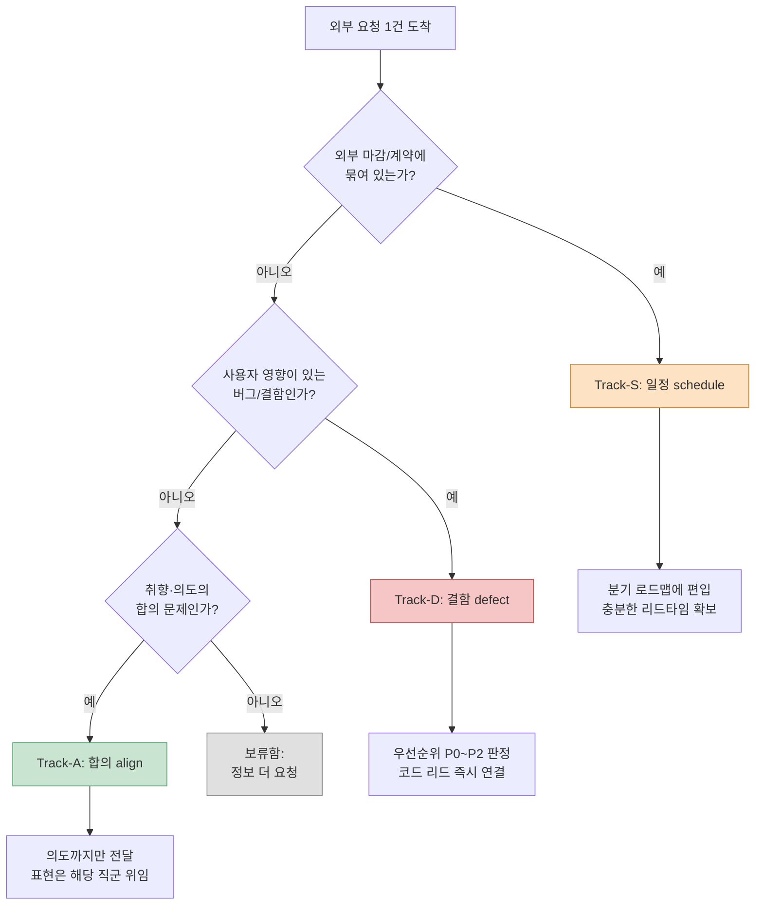

# 16.2 타 직군과의 협업 — 외부 요청을 3-track으로 분류하기

화요일 오전, 메신저가 거의 동시에 세 번 울렸다.

아트 리드: "전투 이펙트 컬러, 지금 톤이 너무 칙칙한데 더 화사하게 가도 될까요?"

QA 리드: "길드 출석 보상이 두 번 들어오는 케이스 있습니다. 재현 영상 첨부."

퍼블리셔 담당: "동남아 빌드에 이슬람 문화권 가이드라인 반영 부탁드립니다. 다음 분기 심사 전까지요."

세 메시지의 글자 수는 비슷했다. 그런데 하나는 30분이면 끝날 일이고, 하나는 당장 코드 리드를 붙잡아야 할 사고였고, 하나는 분기 단위 계획에 끼워 넣어야 할 외부 일정이었다. 같은 받은편지함에 떨어졌다는 이유로 같은 무게로 다루면, 30분짜리에 한나절을 쓰고 정작 사고는 저녁까지 방치된다.

기획자에게 들어오는 요청은 직군만큼이나 결이 다르다. 문제는 그것들이 전부 "한 줄짜리 메시지"라는 동일한 형태로 도착한다는 점이다. 이 챕터는 그 한 줄들을 받자마자 세 개의 트랙으로 갈라내는 작업을 다룬다. 트랙이 갈리는 순간, 무엇을 지금 멈추고 무엇을 나중으로 미룰지가 결정된다.

---

## 16.2.1 협업이 본업을 좌우한다

기획자는 코드도, 아트도, 사운드도 직접 만들지 않는다. 명세를 쓰고, 의도를 전달하고, 결과를 검증할 뿐이다. 모든 산출물은 다른 직군의 손을 거쳐 나온다. 그래서 협업의 질이 기획 결과물의 질을 그대로 결정한다.

저자가 디렉터로 일하는 프로젝트 A(모바일 우선 MMORPG, 중규모(10~50인) 팀)에서 기획자가 일상적으로 협업하는 직군을 펼쳐 보면 이렇다.

<svg viewBox="0 0 720 300" xmlns="http://www.w3.org/2000/svg" font-family="sans-serif" font-size="13">
  <rect x="300" y="120" width="120" height="60" rx="8" fill="#2b3a55" stroke="#1a2433"/>
  <text x="360" y="146" fill="#fff" text-anchor="middle" font-weight="bold">기획자</text>
  <text x="360" y="166" fill="#cdd6e5" text-anchor="middle" font-size="11">시간의 40~60%</text>

  <g fill="#e8edf5" stroke="#9fb0c9">
    <rect x="40" y="30" width="130" height="44" rx="6"/>
    <rect x="40" y="100" width="130" height="44" rx="6"/>
    <rect x="40" y="170" width="130" height="44" rx="6"/>
    <rect x="40" y="240" width="130" height="44" rx="6"/>
    <rect x="550" y="30" width="130" height="44" rx="6"/>
    <rect x="550" y="100" width="130" height="44" rx="6"/>
    <rect x="550" y="170" width="130" height="44" rx="6"/>
  </g>
  <g fill="#1a2433" text-anchor="middle">
    <text x="105" y="50">개발 (코드·툴)</text><text x="105" y="66" font-size="10" fill="#5a6a82">매일</text>
    <text x="105" y="120">아트</text><text x="105" y="136" font-size="10" fill="#5a6a82">주 2~3회</text>
    <text x="105" y="190">사운드</text><text x="105" y="206" font-size="10" fill="#5a6a82">주 1~2회</text>
    <text x="105" y="260">애니메이션</text><text x="105" y="276" font-size="10" fill="#5a6a82">주 1~2회</text>
    <text x="615" y="50">QA</text><text x="615" y="66" font-size="10" fill="#5a6a82">주 1회+MS</text>
    <text x="615" y="120">운영·CS</text><text x="615" y="136" font-size="10" fill="#5a6a82">주 1회</text>
    <text x="615" y="190">외부(퍼블·플랫폼)</text><text x="615" y="206" font-size="10" fill="#5a6a82">분기 1~2회</text>
  </g>

  <g stroke="#9fb0c9" stroke-width="1.2" fill="none">
    <path d="M170 52 C 240 90, 270 120, 300 135"/>
    <path d="M170 122 C 230 130, 260 140, 300 148"/>
    <path d="M170 192 C 230 175, 260 162, 300 158"/>
    <path d="M170 262 C 240 210, 270 180, 300 170"/>
    <path d="M550 52 C 480 90, 450 120, 420 135"/>
    <path d="M550 122 C 490 130, 460 142, 420 150"/>
    <path d="M550 192 C 490 175, 460 162, 420 160"/>
  </g>
</svg>

일곱 직군과 매일에서 분기 단위로 맞물린다. 기획자가 책상에서 보내는 시간의 40~60%가 이 협업에 들어간다. 본업(설계)에 쓰는 시간이 나머지 절반인 셈이다. 그렇다면 협업 시간을 줄이는 일이 곧 본업 시간을 늘리는 일이다. 그리고 협업 시간을 잡아먹는 가장 큰 원인은, 들어온 요청을 분류하지 못해 엉뚱한 곳에 에너지를 쏟는 데 있다.

---

## 16.2.2 한 줄 요청이 숨기는 세 가지 결

앞의 세 메시지로 돌아가 보자. 표면적으로는 모두 "~해주세요"다. 하지만 그 안에는 세 가지 다른 성격이 숨어 있다.

- 아트 리드의 컬러 요청은 **취향과 의도의 영역**이다. 옳고 그름이 아니라 합의의 문제다. 코드도, 일정 협의도 거의 필요 없다.
- QA의 중복 보상 버그는 **즉시 처리할 결함**이다. 사용자 자원에 직결되므로 우선순위가 높고, 코드 리드를 바로 붙여야 한다.
- 퍼블리셔의 가이드라인 반영은 **외부 일정에 묶인 변경**이다. 범위가 넓고, 분기 심사라는 외부 마감이 있으며, 여러 직군이 관여한다.

이 세 결을 저자는 각각 한 단어로 부른다. **합의(align)**, **결함(defect)**, **일정(schedule)**. 들어온 요청을 이 셋 중 하나로 먼저 밀어 넣는 작업, 이것을 프로젝트 A에서는 `request-triangulate`라는 이름의 워크플로로 굳혀 두었다. 삼각측량(triangulate)이라는 이름은, 한 점(요청)을 세 기준점(직군 성격·긴급도·외부 의존성)으로 둘러싸 위치를 특정한다는 뜻에서 붙였다.

분류 흐름은 다음과 같다.



질문의 **순서**가 핵심이다. 일정 의존성을 가장 먼저 묻는 이유는, 외부 마감이 걸린 일은 내부 판단보다 리드타임이 우선이기 때문이다. 분기 심사가 3주 남은 일을 "나중에 합의하면 되지"로 분류하면, 합의가 끝났을 땐 이미 마감이 코앞이다. 결함을 두 번째로 두는 이유는, 사용자에게 이미 영향을 주고 있는 일은 취향 논의보다 항상 앞서기 때문이다. 합의는 마지막이다. 급하지 않고, 외부에 묶이지 않고, 사용자를 해치지 않는 일이라야 비로소 "천천히 합의하자"가 성립한다.

세 질문 모두 "아니오"라면 그건 분류 실패가 아니라 **정보 부족**이다. 그럴 땐 트랙을 억지로 정하지 말고 보류함에 넣고 되묻는다. "이게 다음 빌드에 꼭 들어가야 하나요, 아니면 검토만 해두면 될까요?" 같은 한 문장이 대개 트랙을 결정해 준다.

---

## 16.2.3 워크드 트랜스크립트: 받은편지함을 트랙으로 가르기

이 분류를 머릿속에서만 하면 바쁜 날엔 무너진다. 그래서 저자는 들어온 요청 묶음을 통째로 AI에게 던져 1차 분류를 받고, 그 결과를 검증·수정하는 방식으로 운영한다. 아래는 실제로 돌렸던 한 회차를 거의 그대로 옮긴 것이다. 요약하지 않고, AI가 틀린 부분과 저자가 거부한 부분까지 남긴다.

### 프롬프트 전문

```text
아래 외부 요청들을 세 트랙으로 분류해 줘 — Track-S(일정: 외부 마감·계약·심사에 묶인 것),
Track-D(결함: 사용자 영향 버그, P0~P2 판정), Track-A(합의: 취향·의도, 합의로 종결).
외부 의존성 → 사용자 영향 → 취향/의도 순으로 보고 먼저 걸리는 트랙으로 확정,
셋 다 아니면 보류로 두고 되물을 질문 1개 줘.
출력은 요청별로 | 트랙 | 근거(1줄) | 다음 행동(1줄) |.

[요청 목록]
1. 아트 리드: 전투 이펙트 컬러가 칙칙함. 더 화사하게 가도 되는지?
2. QA 리드: 길드 출석 보상 중복 지급 버그. 재현 영상 있음.
3. 퍼블리셔: 동남아 빌드에 문화권 가이드라인 반영. 다음 분기 심사 전.
4. 사운드 디렉터: 보스 BGM 도입부가 전투 시작 타이밍보다 0.5초 늦음.
5. 운영팀: 유저들이 "길드 채팅 폰트가 너무 작다"고 다수 문의.
```

### Claude 날것 출력

```text
| # | 트랙 | 근거 | 다음 행동 |
|---|------|------|-----------|
| 1 | Track-A | 컬러 톤은 취향·의도 영역, 외부/버그 무관 | 의도(전투의 긴장감)만 전달, 채도 결정은 아트 위임 |
| 2 | Track-D | 보상 중복 = 사용자 자원 직접 영향, 재현 가능 | P0 판정, 코드 리드 즉시 연결, 핫픽스 검토 |
| 3 | Track-S | 분기 심사라는 외부 마감에 묶임 | 분기 로드맵 편입, 가이드라인 항목 분해 후 리드타임 산정 |
| 4 | Track-A | BGM 타이밍은 연출 취향 문제로 보임 | 사운드 디렉터와 합의 |
| 5 | Track-D | 폰트 가독성은 UI 결함 | P2 버그로 등록 |
```

### 사람 검증 / 거부

4번과 5번에서 저자는 멈췄다.

**4번 거부.** AI는 BGM 도입부 지연을 "연출 취향(Track-A)"으로 봤다. 하지만 "전투 시작 타이밍보다 0.5초 늦음"은 취향이 아니라 **동기화 결함**이다. 음원 자체를 바꾸는 게 아니라, BT(비헤이비어 트리) 상의 트리거 시점과 오디오 큐가 어긋난 문제일 가능성이 크다. 이건 합의로 끝나지 않고 애니메이션·코드 쪽 타이밍 데이터를 건드려야 한다. → **Track-D로 정정.** 단, 사용자 자원에 영향 없으므로 P2.

**5번 보류로 강등.** AI는 "폰트가 작다"를 곧장 UI 결함(Track-D)으로 단정했다. 그러나 이건 결함인지 취향인지가 메시지만으로는 안 갈린다. 폰트가 디자인 스펙대로 렌더되는데 "작게 느껴지는" 거라면 그건 합의(Track-A)에 가깝고, 스펙보다 작게 깨져 나오는 거라면 결함(Track-D)이다. → **보류. 운영팀에 되물음:** "스펙상 폰트 크기 대비 실제로 작게 보이는 건가요, 아니면 스펙 자체를 키워달라는 의견인가요?"

### 재요청

거부한 두 건을 반영해 다시 던진 프롬프트의 추가 지시는 짧았다.

```text
4번은 '전투 시작 대비 0.5초 지연'을 동기화 결함으로 재분류하라(Track-D, P2).
타이밍이 BT 트리거/오디오 큐 중 어디서 어긋났는지 확인할 질문 1개를 덧붙여라.
5번은 보류 처리하고, '스펙 대비 실제 렌더'인지 묻는 질문을 명시하라.
```

재출력은 4번을 `Track-D / P2 / "BT 전투개시 노드의 오디오 큐 오프셋이 0인지, 아니면 BGM 클립 자체에 무음 0.5초가 포함됐는지 확인"`으로, 5번을 `보류 / "스펙 대비 작게 렌더되는지 vs 스펙 상향 요청인지 운영팀 재확인"`으로 바로잡아 돌려줬다. 이 시점에서 분류가 완결됐다.

여기서 AI가 한 일과 사람이 한 일이 명확히 갈린다. AI는 다섯 건을 1차로 빠르게 분배해 **빈 칸 없는 표**를 만들어 줬다. 사람은 그중 **트랙 경계가 미묘한 두 건**(취향처럼 보이지만 동기화 결함인 BGM, 결함처럼 보이지만 취향일 수 있는 폰트)을 잡아냈다. 다섯 칸을 빠짐없이 채우는 일과 그중 두 칸이 잘못 채워졌음을 알아채는 일은 서로 다른 능력이고, 이 워크드 트랜스크립트는 그 둘을 각자 잘하는 쪽에 맡긴 것이다.

---

## 16.2.4 트랙별로 손이 달라진다

분류가 끝나면 각 트랙은 전혀 다른 후속 작업으로 들어간다. 같은 표에서 시작했지만 도착지가 다르다.

**Track-A(합의)** 로 분류된 요청은 "의도까지만 전달, 표현은 위임"의 원칙으로 처리한다. 아트의 컬러 요청에 저자가 돌려준 답은 채도 수치가 아니라 의도였다. "이 전투는 보스 1페이즈라 긴장감이 핵심입니다. 화사함보다 압박감이 우선이면 좋겠어요. 그 안에서 채도는 아트 판단에 맡깁니다." 기획자가 채도 값을 직접 지정하는 순간 아트의 자율성이 깎이고, 결과물의 책임 소재도 흐려진다. 의도와 표현의 경계를 지키는 일이 합의 트랙의 전부다.

**Track-D(결함)** 로 분류된 요청은 우선순위 판정과 코드 연결로 이어진다. 길드 보상 중복(P0)은 그 자리에서 코드 리드에게 넘겼고, BGM 동기화(P2)는 백로그에 등록하되 원인 추정 질문을 함께 달았다. 결함 트랙에서 기획자의 일은 "고치는 것"이 아니라 **우선순위를 매기고 정확한 입력을 주는 것**이다. P0인지 P2인지를 가르는 기준은 "지금 사용자 자원·진행에 영향을 주는가"다. 보상 중복은 자원에 직결되니 P0, BGM 0.5초 지연은 불쾌하지만 진행을 막지 않으니 P2다.

**Track-S(일정)** 로 분류된 요청은 분기 로드맵으로 들어간다. 퍼블리셔의 문화권 가이드라인은 한 줄 요청이지만 실제로는 여러 항목으로 분해된다 — 종교적 상징물 표현, 색상 금기, 텍스트 방향성, 캐릭터 복식. 이걸 받자마자 "검토하겠다"로 답하고 분기 계획에 통째로 얹는 것이 핵심이다. 외부 마감이 걸린 일은 작아 보여도 리드타임이 생명이라, 늦게 시작하면 무조건 사고가 난다.

이 세 갈래를 한눈에 비교하면 이렇다.

<svg viewBox="0 0 720 240" xmlns="http://www.w3.org/2000/svg" font-family="sans-serif" font-size="13">
  <g>
    <rect x="20" y="30" width="210" height="180" rx="10" fill="#c9e4d0" stroke="#4f9d6a"/>
    <rect x="255" y="30" width="210" height="180" rx="10" fill="#f6c6c6" stroke="#c25151"/>
    <rect x="490" y="30" width="210" height="180" rx="10" fill="#fde2c4" stroke="#c98a3a"/>
  </g>
  <g text-anchor="middle" font-weight="bold" fill="#1a2433">
    <text x="125" y="58">Track-A · 합의</text>
    <text x="360" y="58">Track-D · 결함</text>
    <text x="595" y="58">Track-S · 일정</text>
  </g>
  <g text-anchor="start" fill="#23303f" font-size="12">
    <text x="38" y="92">판정 질문</text>
    <text x="38" y="112" fill="#3c5a45">취향·의도인가?</text>
    <text x="38" y="142">기획자의 일</text>
    <text x="38" y="162" fill="#3c5a45">의도만 전달,</text>
    <text x="38" y="180" fill="#3c5a45">표현은 위임</text>

    <text x="273" y="92">판정 질문</text>
    <text x="273" y="112" fill="#7a2e2e">사용자 영향 버그?</text>
    <text x="273" y="142">기획자의 일</text>
    <text x="273" y="162" fill="#7a2e2e">P0~P2 판정,</text>
    <text x="273" y="180" fill="#7a2e2e">코드 리드 연결</text>

    <text x="508" y="92">판정 질문</text>
    <text x="508" y="112" fill="#7a5320">외부 마감에 묶임?</text>
    <text x="508" y="142">기획자의 일</text>
    <text x="508" y="162" fill="#7a5320">항목 분해,</text>
    <text x="508" y="180" fill="#7a5320">리드타임 확보</text>
  </g>
</svg>

분류가 정확하면 같은 받은편지함의 다섯 줄이 세 개의 서로 다른 처리 라인으로 깔끔하게 흩어진다. 분류가 틀리면, 결함이 합의 회의로 끌려가 시간을 잡아먹거나, 일정 건이 늦게 시작돼 마감 직전에 폭발한다.

---

## 16.2.5 TF로 격리해 협업하기

요청이 한두 건이 아니라 한 덩어리로 몰려올 때가 있다. 퍼블리셔 심사를 앞둔 몇 주, 혹은 전투 시스템 전면 개편 같은 국면이다. 이럴 때는 작업 자체를 `95_BattleTF` 같은 임시 작업공간으로 격리하고, 끝나면 결정만 정본으로 승격한다. 그 격리·흡수 메커니즘과 "아트팀엔 html만 전달(md 학습 0)"의 운영은 앞 챕터 16.1에서 전부 다뤘다.

분류(3-track) 관점에서 한 줄만 덧붙이면 이렇다. 한 덩어리로 커진 협업은 대개 Track-S(일정) 안건이 여러 직군에 걸쳐 분해되는 국면이라, 개별 트랙 처리로는 감당이 안 될 때 격리 작업공간이라는 한 단계 위의 그릇으로 옮겨 담는 것이다. 즉 3-track 분류가 입구라면, TF 격리는 그 입구를 통과한 큰 덩어리를 담는 방이다.

---

## 16.2.6 흔한 실패와 처방

| 실패 패턴 | 처방 |
|---|---|
| 모든 요청을 같은 무게로 처리 | 받자마자 3-track 분류, 외부 의존성부터 질문 |
| 일정 건을 합의로 오분류 | 판정 순서 1번에 외부 마감 질문을 고정 |
| 취향처럼 보이는 동기화 결함을 합의로 처리 | "타이밍/수치 어긋남"은 결함 의심부터 |
| 결함처럼 보이는 취향을 결함으로 단정 | "스펙 대비 실제 렌더인가"를 되물어 보류 |
| 합의 트랙에서 기획자가 표현까지 결정 | 의도까지만, 표현은 직군 위임 |
| 일정 건을 늦게 시작 | 분기 로드맵 즉시 편입, 리드타임 확보 |

이 표의 절반은 분류 단계의 실수이고, 절반은 분류 이후 처리의 실수다. 분류가 정확해도 트랙별 손이 틀리면 효과가 사라진다. (TF 격리·승격·매체 관련 함정은 16.1의 함정 표를 참조.)

---

### 이 챕터의 핵심 메시지

- 외부 요청은 합의·결함·일정 세 트랙으로 갈리며, 같은 무게로 다루면 30분짜리에 한나절을 쓴다.
- 판정 순서는 외부 마감→사용자 영향→취향이며, 순서가 틀리면 일정 건이 마감 직전 폭발한다.
- AI는 빈 칸 없는 1차 분배에 강하고, 트랙 경계 판정은 사람이 정확하다.

---

> **게임 밖 적용.** 한 줄짜리 요청이 같은 받은편지함에 떨어진다는 이유로 같은 무게로 다뤄진다는 문제는, 게임이 아니라 모든 서비스기획자·PM의 일상 그 자체다. 들어오는 요청을 "합의(취향·방향)·결함(사용자 영향 버그)·일정(외부 마감)" 세 트랙으로 가르는 분류는 도메인을 바꿔도 그대로 작동한다. 예컨대 웹 서비스 PM의 메신저에 동시에 "버튼 색을 좀 더 밝게(합의)", "결제 영수증이 중복 발송됨(결함)", "개인정보보호법 개정 반영 마감 3주 전(일정)"이 떨어졌다면, 외부 마감→사용자 영향→취향 순으로 먼저 걸리는 트랙에 넣어 결제 버그에 즉시 인력을 붙이고 법 개정은 리드타임부터 확보하면 됩니다.

---

### 따라하기

**웹 챗봇 최소 경로 (터미널 없이)** — 이 챕터의 핵심은 워크플로 스크립트가 아니라 "한 줄 요청을 합의·결함·일정 세 트랙으로 가른다"는 발상입니다. 그 발상은 CLI·hook·atom 인프라 없이 웹 챗봇(ChatGPT 또는 Claude 웹)만으로도 그대로 재현됩니다. 아래 두 단계가 본류입니다.
1. 그날 들어온 요청을 형식 없이 한 줄씩 모아 둡니다. 메신저·메일·메모 어디서 긁어와도 됩니다.
2. 웹 챗봇 입력창에 아래 프롬프트를 붙이고, 그 아래에 모은 요청 목록을 붙여 넣습니다. 이게 `request-triangulate`가 하던 1차 분류를 손으로 한 번 하는 것입니다.
   ```
   아래 요청들을 Track-A(합의)/Track-D(결함)/Track-S(일정)로 분류해 줘.
   외부 마감 → 사용자 영향 버그 → 취향·의도 순으로 보고 먼저 걸리는 트랙으로 확정,
   셋 다 아니면 보류로 두고 되물을 질문 1개 줘. 출력은 | 트랙 | 근거 1줄 | 다음 행동 1줄 |.
   [요청 목록 붙여넣기]
   ```
   그다음 출력 표에서 두 칸만 사람이 검증하면 됩니다 — "타이밍·수치 어긋남"이 합의로 분류됐다면 동기화 결함을 의심하고, "~가 작다/느리다" 같은 체감 불만이 결함으로 단정됐다면 "스펙 대비 실제 렌더인가"를 되물어 보류로 내립니다. 스크립트·워크플로는 이 분류가 손에 익어 매일 묶음이 버거워질 때 비로소 도입하면 됩니다.

**setup.** 들어오는 외부 요청을 한곳(채널·문서)에 모으세요. 세 트랙의 정의를 한 줄씩 적어 두세요 — 합의(취향·의도), 결함(사용자 영향 버그), 일정(외부 마감).

**prompt.** 모인 요청 묶음을 AI에게 던지며 판정 순서를 고정하세요.

```text
아래 요청들을 Track-A(합의)/Track-D(결함)/Track-S(일정)로 분류해 줘.
외부 마감 → 사용자 영향 버그 → 취향·의도 순으로 보고 먼저 걸리는 트랙으로 확정,
셋 다 아니면 보류로 두고 되물을 질문 1개 줘. 출력은 | 트랙 | 근거 1줄 | 다음 행동 1줄 |.
[요청 목록 붙여넣기]
```

**verify.** 출력 표에서 두 곳을 직접 검증하세요. (1) "타이밍·수치 어긋남"이 합의로 분류됐다면 동기화 결함이 아닌지 의심하세요. (2) "~가 작다/느리다" 같은 체감 불만이 결함으로 단정됐다면 "스펙 대비 실제 렌더인가"를 되물어 보류로 내리세요. 경계 두 건만 사람이 잡으면 나머지는 신뢰해도 됩니다.

### 1인 축소판

팀도 TF도 없는 1인 개발자라면 트랙은 그대로 두되 대상만 바꾸세요. 스토어 리뷰, 디스코드 제보, 베타테스터 메모를 한 문서에 모아 두고, 주 1회 위 프롬프트로 묶음 분류하세요. 합의(취향)는 "내 비전과 충돌하지 않으면 수용", 결함(버그)은 그 주에 처리, 일정(스토어 심사·이벤트 마감)은 캘린더에 리드타임과 함께 입력하세요. 집중 정비 기간의 격리 폴더 운영은 16.1의 1인 축소판을 따르면 됩니다.
