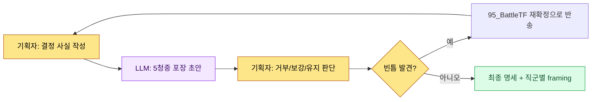

# 16.3 한 결정, 세 가지 포장 — 직군별 산출물 framing

95_BattleTF 회의실. 길드 출석 보상을 자원 +5로 확정한 그날 오후, 나는 같은 결정 하나를 세 군데로 흘려보냈다. 기획팀 채널에는 명세 markdown을, 프로그램팀에는 데이터 컬럼 한 줄을, 아트팀에는 화면 한 장짜리 html을. 세 곳에서 거의 동시에 답이 왔다. 프로그램 리드는 "트리거 시점이 어디냐"고 물었고, 아트 디렉터는 "출석 버튼 위치가 06_UI 가이드랑 맞냐"고 물었고, 애니메이터는 아무 말이 없었다. 같은 결정이었는데 세 사람이 본 것은 전부 달랐다.

이 장은 그 '다르게 봄'을 사고가 아니라 설계로 바꾼 기록이다. 한 결정을 직군별로 다르게 포장하는 일 — 그것이 framing이다.

---

## 16.3.1 같은 결정을 다섯 명이 다르게 읽는다

길드 출석 보상 결정 하나에 달라붙는 청중은 다섯이다. 이들은 같은 문장을 읽어도 자기 영역만 골라 읽고 나머지는 흘린다. 흘린 자리에서 사고가 난다.

| 청중 | 집중해서 읽는 것 | 본능적으로 건너뛰는 것 |
|---|---|---|
| 코드 리드 | 데이터 컬럼·인터페이스·트리거 시점 | 색감·서사·연출 |
| 아트 디렉터 | 화면 배치·컴포넌트·스타일 가이드 | 데이터 무결성·트리거 |
| 사운드 디렉터 | 행동 트리거·분위기·길이 | 데이터 디테일 |
| 애니메이터 | 동작·타이밍·상태 전이 | 시각 톤·수치 |
| QA | 수용 기준·위험·엣지 시나리오 | 구현 방식의 내부 |

문제는 정보의 양이 아니라 노출의 방식이다. 두툼한 명세 한 부를 다섯 명 책상에 똑같이 올려두면, 다섯 명은 각자 다른 페이지를 펼치고 다른 페이지를 덮는다. framing은 이 펼침을 우연에 맡기지 않고 의도적으로 배치한다.

아래는 같은 결정 하나가 직군 경계를 지나며 어떤 형태로 갈아입는지를 보여 주는 framing 매트릭스다.

<svg viewBox="0 0 720 360" xmlns="http://www.w3.org/2000/svg" role="img" aria-label="한 결정이 직군별 산출물로 갈라지는 framing 매트릭스">
  <rect x="0" y="0" width="720" height="360" fill="#fbfbfd"/>
  <!-- source decision -->
  <rect x="270" y="20" width="180" height="52" rx="8" fill="#1f2d3d"/>
  <text x="360" y="42" text-anchor="middle" fill="#ffffff" font-family="sans-serif" font-size="14" font-weight="bold">결정: 출석 보상 = 자원 +5</text>
  <text x="360" y="60" text-anchor="middle" fill="#aeb9c6" font-family="sans-serif" font-size="11">95_BattleTF / 단일 사실</text>
  <!-- arrows -->
  <line x1="360" y1="72" x2="120" y2="140" stroke="#9aa7b4" stroke-width="1.5"/>
  <line x1="360" y1="72" x2="360" y2="140" stroke="#9aa7b4" stroke-width="1.5"/>
  <line x1="360" y1="72" x2="600" y2="140" stroke="#9aa7b4" stroke-width="1.5"/>
  <!-- three framings -->
  <rect x="30" y="140" width="180" height="86" rx="8" fill="#e8f0fe" stroke="#4a73b8" stroke-width="1.5"/>
  <text x="120" y="162" text-anchor="middle" fill="#1f2d3d" font-family="sans-serif" font-size="13" font-weight="bold">기획 → markdown</text>
  <text x="120" y="182" text-anchor="middle" fill="#33414f" font-family="sans-serif" font-size="11">의도·룰·근거 전문</text>
  <text x="120" y="200" text-anchor="middle" fill="#33414f" font-family="sans-serif" font-size="11">학습용 컨텍스트 포함</text>
  <text x="120" y="218" text-anchor="middle" fill="#7a8794" font-family="sans-serif" font-size="10">spec_guild_attendance.md</text>

  <rect x="270" y="140" width="180" height="86" rx="8" fill="#fdeee8" stroke="#b8674a" stroke-width="1.5"/>
  <text x="360" y="162" text-anchor="middle" fill="#1f2d3d" font-family="sans-serif" font-size="13" font-weight="bold">아트 → html</text>
  <text x="360" y="182" text-anchor="middle" fill="#33414f" font-family="sans-serif" font-size="11">화면 1장·배치·컴포넌트</text>
  <text x="360" y="200" text-anchor="middle" fill="#33414f" font-family="sans-serif" font-size="11">md 학습 0 (전달만)</text>
  <text x="360" y="218" text-anchor="middle" fill="#7a8794" font-family="sans-serif" font-size="10">guild_screen_v3.html</text>

  <rect x="510" y="140" width="180" height="86" rx="8" fill="#e8f6ec" stroke="#4a9a5e" stroke-width="1.5"/>
  <text x="600" y="162" text-anchor="middle" fill="#1f2d3d" font-family="sans-serif" font-size="13" font-weight="bold">프로그램 → 데이터</text>
  <text x="600" y="182" text-anchor="middle" fill="#33414f" font-family="sans-serif" font-size="11">컬럼·인터페이스·트리거</text>
  <text x="600" y="200" text-anchor="middle" fill="#33414f" font-family="sans-serif" font-size="11">검증 lint 항목 명시</text>
  <text x="600" y="218" text-anchor="middle" fill="#7a8794" font-family="sans-serif" font-size="10">guild_table 1 row</text>
  <!-- invariant band -->
  <rect x="30" y="262" width="660" height="72" rx="8" fill="#ffffff" stroke="#c7ced6" stroke-width="1.2"/>
  <text x="360" y="286" text-anchor="middle" fill="#1f2d3d" font-family="sans-serif" font-size="12" font-weight="bold">불변 사실 (세 포장이 모두 보존해야 하는 것)</text>
  <text x="360" y="308" text-anchor="middle" fill="#33414f" font-family="sans-serif" font-size="11">수치 = +5 · 시점 = 일일 첫 로그인 · 범위 = 길드원 전원</text>
  <text x="360" y="326" text-anchor="middle" fill="#7a8794" font-family="sans-serif" font-size="10">포장은 달라도 이 세 값이 어긋나면 framing 실패</text>
</svg>

포장은 청중마다 다르되, 가운데 깔린 불변 사실(수치·시점·범위)은 어느 포장에서도 흔들리면 안 된다. framing의 기술은 '다르게 보여 주는 것'이 아니라 '다르게 보여 주면서 같은 것을 보존하는 것'이다.

---

## 16.3.2 워크드 트랜스크립트 — 한 결정을 세 포장으로

framing을 손으로 매번 다시 빚으면 부담이 커서 결국 안 하게 된다. 그래서 나는 결정 하나를 던지고 직군별 포장 초안을 한 번에 받는 방식을 쓴다. 아래는 길드 출석 보상 결정을 두고 실제로 주고받은 전사다. 다듬지 않고 그대로 옮긴다.

### 프롬프트 전문

```
[결정 사실 — 95_BattleTF에서 확정]
- 길드 출석 보상 = 길드 자원 +5
- 트리거: 길드원이 그날 첫 로그인할 때 1회
- 범위: 해당 길드의 전체 길드원 각각
- UI: 길드 화면 상단에 자원 총량 표시 + "출석" 버튼

이 결정 하나를 세 직군용으로 포장해 줘.
기획은 markdown으로 의도·룰·데이터 영향, 아트는 html에 들어갈 화면 명세를
배치·컴포넌트·스타일 가이드 참조 중심으로 (데이터·트리거 언급 금지),
프로그램은 데이터 한 줄·인터페이스·트리거·검증 항목으로.
세 포장 다 불변값(+5, 첫 로그인 1회, 길드원 전원)은 똑같이 박고,
모르는 값은 지어내지 말고 [확인필요]로 표시해.
```

### Claude 날것 출력 (요약·정리 없이)

```
1) 기획 → markdown

## 길드 출석 보상
- 의도: 매일 1회 접속을 길드 단위 협력 자원으로 환산해 잔존율을 끌어올린다.
- 룰: 길드원이 당일 첫 로그인 시 길드 자원 +5. 하루 1회. 길드 단위 누적.
- 데이터 영향: guild_resource_total 증가. 자원 인플레이션 모니터 필요 [확인필요: 상한선 미정].

2) 아트 → 화면 명세 (html 들어갈 내용)
- 길드 화면 상단 영역에 자원 총량 표시 (progress_bar + 숫자 badge).
- 우측에 "출석" 버튼. 눌렀을 때 상태 변화는 06_UI 가이드의 버튼 상태 규칙 따름.
- 스타일: 06_UI 가이드 부합. 색은 [확인필요: 길드 테마 컬러 토큰 미지정].
- (데이터 수치·트리거는 이 포장에서 의도적으로 제외)

3) 프로그램 → 데이터/인터페이스
- 데이터: guild_table 에 컬럼 추가 — guild_resource_total (int, default 0)
- 인터페이스: GuildResourceManager.add(guild_id, amount)
- 트리거: 일일 첫 로그인 이벤트 훅에서 add(guild_id, 5) 1회 호출
- 검증: integrity_check_guild_resource (음수 불가 / 1일 1회 초과 호출 차단)
- 동시성: 같은 길드원이 멀티 디바이스 동시 로그인 시 중복 가산 [확인필요]
```

### 사람 검증·거부

날것 출력을 그대로 쓰지 않았다. 세 곳을 잡았다.

- **거부**: 아트 포장의 "버튼 눌렀을 때 상태 변화는 06_UI 가이드 따름" 문장. 아트팀에는 md를 학습시키지 않고 html만 전달하는 게 95_BattleTF의 원칙이라, 가이드 참조 문구가 외부 문서로의 점프를 유발한다. 화면 한 장 안에서 닫히도록 상태 예시를 인라인으로 넣기로 했다.
- **보강 요구**: 프로그램 포장의 `[확인필요]` 두 건(자원 상한, 멀티 디바이스 중복 가산)은 결정 사실에 없던 빈틈이다. AI가 지어내지 않고 표시한 것은 맞는 판단이지만, 이건 framing 이전에 결정 자체의 구멍이라 95_BattleTF로 되돌려야 한다.
- **유지**: 불변값 세 개(+5, 첫 로그인 1회, 길드원 전원)는 세 포장에 모두 일관되게 입력되어 있었다. 이 부분만은 손대지 않았다.

### 재요청

```
아트 포장 수정해 줘:
- "06_UI 가이드 따름" 같은 외부 문서 참조 문구 전부 제거.
- 버튼 눌림/대기/완료 3상태의 시각 차이를 화면 명세 안에 직접 서술.
- 아트팀은 이 한 장만 보고 작업한다는 전제로, 다른 문서로 점프하지 않게 자족적으로.

프로그램 포장의 [확인필요] 2건은 산출물에서 빼고,
대신 맨 위에 "95_BattleTF 재확정 필요 항목" 블록으로 분리해.
```

이 한 번의 거부·재요청으로 산출물은 세 직군이 각자 자기 자리에서 바로 집어 쓸 형태가 됐다. AI는 포장 초안 세 벌을 빚어 내고 빈틈에 표시까지 달아 줬지만, 어느 포장에서 무엇을 덜어 낼지 — 아트 포장에서 외부 참조를 빼고 프로그램 포장에서 미확정 항목을 들어내는 — 그 가위질은 끝내 내 손에 남았다. framing의 핵심 판단은 포함이 아니라 배제 쪽에 있다.

---

## 16.3.3 세 가지 framing 방식과 회수 시점

포장을 어디에 둘 것이냐에 따라 방식이 갈린다. 셋 중 무엇을 쓸지는 명세의 크기와 운영 체력으로 정한다.

**(1) 한 문서 안의 청중별 요약.** 본문 뒤에 직군별 요약 섹션을 붙인다. 다섯 명이 한 파일을 공유하되 각자 자기 절만 읽는다.

```markdown
## 청중별 요약

### 코드 (구현)
- 데이터: guild_table.guild_resource_total (int)
- 인터페이스: GuildResourceManager.add(guild_id, amount)
- 트리거: 일일 첫 로그인 1회
- 검증: integrity_check_guild_resource

### 아트 (시각)
- 화면: 길드 상단 자원 총량 + 출석 버튼
- 컴포넌트: progress_bar, badge, button(3상태)
- 우선순위: 이번 마일스톤

### QA (검증)
- 수용 기준: 출석 후 길드 자원 +5 반영, 1일 1회 초과 차단
- 위험: 자원 인플레이션, 멀티 디바이스 중복 가산
```

**(2) 청중별 별도 산출물.** 본문 1개에 직군별 파일을 따로 떨어뜨린다. 95_BattleTF에서 아트팀에 html만 보내고 md를 안 보내는 운영이 이 방식의 실전 형태다 — 같은 결정이라도 직군마다 매체 자체가 다르다.

```
spec_guild_attendance.md     — 기획 본문(전체 컨텍스트)
guild_screen_v3.html         — 아트 (html만, md 학습 0)
guild_table 1 row + add()    — 프로그램 (데이터/인터페이스)
qa_guild_attendance.md       — QA (수용 기준·위험)
```

분량 큰 명세에 맞고, 매체가 직군 도구에 곧장 들어간다. 대신 한 결정이 바뀌면 여러 산출물을 함께 고쳐야 해 운영 부담이 크다.

**(3) Wikilink 그래프.** 본문에 직군별 시작점만 링크로 넣고, 각자 자기 가지를 따라 탐색한다.

```
[[spec_guild_attendance]]
   ├── [[code_guild_table]]
   ├── [[ui_guild_screen_v3]]
   └── [[qa_guild_attendance]]
```

세 방식의 비용과 회수는 다음과 같다. 아래 수치 중 '효과'는 저자 추정(미검증)이며 방향과 상대 비율만 신뢰할 것.

| 방식 | 비용 | 회수 시점 |
|---|---|---|
| (1) 청중별 요약 | 본문 분량 +30% 안팎 | 거의 모든 명세에서 바로 회수 |
| (2) 별도 산출물 | 산출물 N벌 운영 | 분량 크고 매체가 직군별로 다를 때만 회수 |
| (3) Wikilink 그래프 | 그래프 인프라 선투자 | 명세가 누적돼 그래프 자체가 자산일 때 회수 |

대부분의 명세에는 (1)이 맞는다. 비용이 가장 작고 회수가 가장 빠르다. (2)는 아트 html처럼 매체가 이미 갈라진 자리에서만 쓰고, (3)은 명세가 충분히 쌓여 링크 그래프가 탐색 가치를 낼 때 켠다.

---

## 16.3.4 청중을 다섯으로 고정한다

청중을 명세마다 새로 정의하면 framing이 매번 다시 빚어진다. 그래서 코드를 고정한다.

| 청중 코드 | 영역 |
|---|---|
| code | 코드·시스템·데이터 |
| art | 아트·시각·UI |
| sound | 사운드·음향 |
| anim | 애니메이션·모션 |
| qa | QA·검증 |

이 다섯이 내부 운영 표준이다. 외주·법무 같은 외부 청중은 이 표준 밖에서 별도로 다룬다. 다섯으로 고정하면 LLM에 framing을 맡길 때 청중 정의를 매번 새로 쓰지 않아도 되고, 빠진 청중을 체크리스트로 잡아낼 수 있다.

---

## 16.3.5 자동화와 그 함정

매 명세마다 다섯 직군 요약을 손으로 쓰면 결국 안 쓰게 된다. 그래서 흐름을 이렇게 묶었다.



기획자가 결정 사실만 쓰면 LLM이 다섯 포장 초안을 만들고, 기획자는 거부·보강·유지를 판단한다. 빈틈(`[확인필요]`)이 나오면 framing에서 처리하지 않고 결정 단계로 되돌린다 — framing은 결정의 구멍을 메우는 도구가 아니라 정해진 결정을 옮기는 도구이기 때문이다.

이 사이클에서 반복적으로 밟는 함정 네 가지를 처방과 함께 둔다.

| 함정 | 증상 | 처방 |
|---|---|---|
| 정보 중복 | 같은 내용이 본문·요약에 반복돼 운영 부담 | 본문 1회, 요약은 차이 항목만 |
| 정보 누락 | 한 직군에 중요한 값이 통째로 빠짐 | 5청중 고정 체크리스트로 누락 점검 |
| 본문 무시 | 요약만 보고 본문 컨텍스트를 흘림 | 요약 끝에 "근거는 본문" 명시 |
| 매체 혼선 | 아트에 md를 보내 학습 부담을 줌 | 직군 매체 원칙(아트=html) 고정 |

자동화는 작성 부담을 명세당 5분 안팎으로 낮추지만, 거부·보강·유지의 판단까지 자동화되지는 않는다. 그 판단이 사람의 자리다.

---

## 16.3.6 측정 — framing을 켰을 때

다음은 저자가 운영하는 프로젝트 A에서 framing 도입 전후를 비교한 값이다. 절대 수치는 저자 추정(미검증)이고, 신뢰할 것은 변화의 방향과 상대 비율이다.

| 항목 | framing 부재 | framing 운영 | 방향 |
|---|---|---|---|
| 직군별 해석 사고 | 분기당 15\~20건 | 분기당 3\~5건 | 큰 폭 감소 |
| 청중의 명세 읽는 시간 | 15\~30분 | 5\~10분(자기 절만) | 감소 |
| 결정 → 작업 시작 | 1\~2일 | 4\~8시간 | 단축 |
| 직군 간 해석 충돌 | 분기당 8\~12건 | 분기당 2\~3건 | 감소 |
| 명세 작성 시간 | 1\~2시간 | 1.5\~2.5시간(LLM 보조) | 소폭 증가 |

명세 작성 자체는 조금 길어진다. 직군별 포장을 얹기 때문이다. 그러나 그 뒤 직군 작업 사이클이 짧아져 결정에서 작업 시작까지의 전체 시간은 줄어든다. 이 트레이드오프가 framing 도입의 핵심 근거다. LLM 보조 검수가 부담스러운 팀이라면, 방식 (1)에 수기 5청중 요약을 먼저 정착시킨 뒤 자동화를 얹는 순서가 안전하다.

---

> **게임 밖 적용.** 하나의 결정을 청중마다 다르게 포장하되 불변 사실(수치·시점·범위)은 어디서나 보존한다는 framing은, 게임이 아니라 모든 조직의 공지·릴리스 커뮤니케이션에 그대로 쓰인다. 예컨대 "구독 요금을 9,900원으로 7월 1일부터 인상" 한 건을 결정했다면, 개발팀에는 결제 테이블 컬럼·적용 시점 같은 데이터로, 디자인팀에는 안내 배너 화면 한 장으로, 고객지원팀에는 예상 문의 응대 스크립트로 포장이 갈립니다. 포장은 셋 다 다르지만 "9,900원·7월 1일·신규 및 기존 가입자 전원"이라는 세 숫자가 어느 포장에서든 어긋나면 그 순간 고객 분쟁이 터진다.

---

## 16.3.7 따라하기

**setup**

- 직군 청중 5종(code·art·sound·anim·qa)을 팀 위키에 고정 정의로 입력하세요.
- 직군별 매체 원칙을 정하세요(예: 아트=html, 프로그램=데이터 row, 기획=md).
- 명세 한 건을 결정 사실 형태로 준비하세요(불변값 = 수치·시점·범위 명시).

**prompt**

```
[결정 사실]
(수치·시점·범위를 한 줄씩)

이 결정을 code·art·sound·anim·qa 중 해당 직군용으로 포장해 줘.
포장마다 그 직군이 무관심한 정보는 빼되 불변값(수치·시점·범위)은 어느 포장에서나 똑같이 박고,
아트 포장은 다른 문서 참조 없이 그 한 장만으로 자족적으로, 모르는 값은 지어내지 말고 [확인필요]로 표시해.
```

**verify**

- 세 포장에서 불변값(수치·시점·범위)이 모두 같은지 한 줄씩 대조하세요.
- `[확인필요]`가 있으면 framing이 아니라 결정 단계(95_BattleTF류 TF)로 반송하세요.
- 아트 포장에 외부 문서 참조 문구가 남아 있으면 제거하세요.

**1인 축소판**

혼자 작업한다면 청중을 둘로 줄이세요 — '나중의 나'(구현)와 '검수자'(QA). 결정 사실 한 줄을 쓰고 LLM에 "이걸 구현 메모와 검수 체크리스트 두 벌로 나눠 줘"라고 요청한 뒤, 두 벌에서 핵심 수치가 일치하는지만 대조하면 됩니다. 청중이 둘뿐이어도 '같은 결정을 다르게 포장하되 불변값은 보존한다'는 framing의 골격은 그대로 작동합니다.

---

### 이 챕터의 핵심 메시지
- 같은 결정을 직군별로 다르게 포장하되 불변값은 보존하는 것이 framing의 본질이다
- framing의 핵심 판단은 무엇을 넣느냐가 아니라 어느 포장에서 무엇을 빼느냐다
- LLM은 포장 초안과 빈틈 표시까지, 거부·보강·유지 판단은 사람의 몫이다
