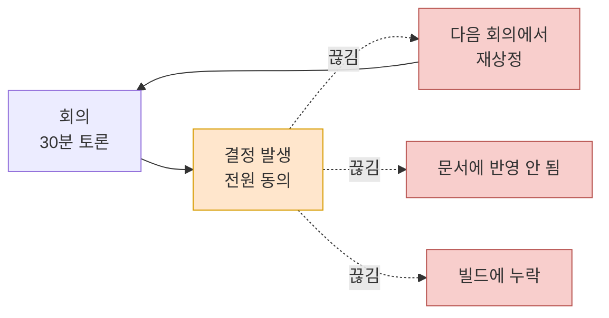
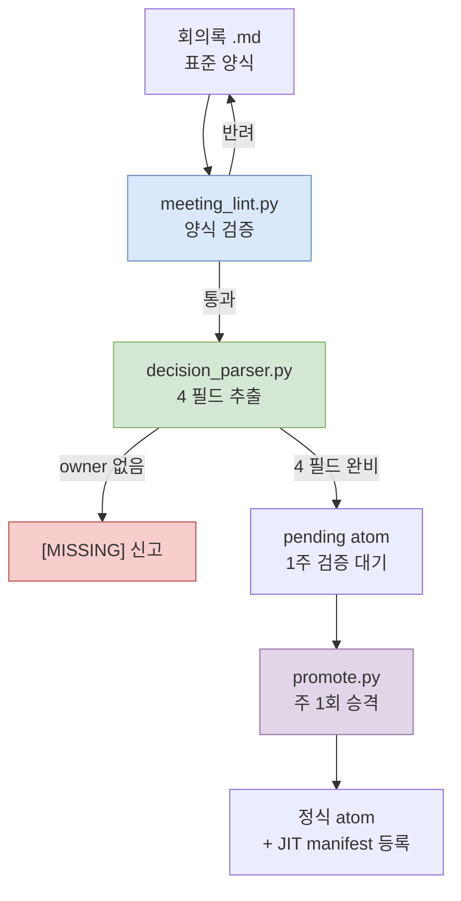

# 17.1 회의록은 왜 가장 큰 통증인가

회의가 끝나고 5분이 지났다. 회의실 화이트보드에는 아직 글씨가 남아 있다. "전투 피격 판정, 클라 선반영으로 간다. 단 서버 검증 우선순위는 다음 스프린트." 다섯 명이 30분을 써서 도달한 결론이다. 모두 고개를 끄덕였고, 누군가는 사진을 찍었다.

3주 뒤, 같은 다섯 명이 같은 회의실에 다시 모였다. 안건 목록 첫 줄에 적혀 있다. "전투 피격 판정 — 클라 선반영 vs 서버 검증, 결정 필요." 아무도 3주 전의 결론을 기억하지 못한다. 화이트보드 사진은 누군가의 카메라 롤 어딘가에 있고, 그 사람은 오늘 휴가다. 다시 30분을 쓴다. 이번엔 반대로 결론이 난다.

이게 회의록이 가장 큰 통증인 이유의 전부다. 회의에서는 결정이 난다. 그런데 그 결정이 다음 회의, 다음 문서, 다음 빌드로 **흘러가지(propagate) 못한다.** 결정은 났는데 전파가 안 된다. 이 챕터는 그 끊긴 고리를 데이터로 잇는 이야기다.

---

## 17.1.1 회의 → 결정 → 실행, 어디서 끊기는가

저자가 운영하는 개인 RnD 시스템은 17개 문서로 갈라져 있다. atom 명명 표준, 관계도 자동화, Layer 매핑 가이드, JIT 주입 인프라 등. 그중에서 가장 많은 시간을 빨아들인 단일 문서가 회의록 개선 계획이다. 다른 16개를 합친 것에 비견될 만큼 비중이 크다.

처음에는 의아했다. 회의록이라니, 그냥 받아 적으면 되는 것 아닌가. 그런데 측정해 보니 통증의 위치가 회의록 *작성*이 아니라 회의록 *이후*에 있었다. 회의에서 결정은 분명히 났다. 문제는 그 결정이 누구의 책임으로, 어떤 근거로, 언제까지, 무엇으로 이어지는지가 회의실 문을 나서는 순간 증발한다는 것이었다.

이 끊김을 한 장면으로 그리면 이렇다.



점선이 끊긴 전파다. 결정(주황)은 났는데, 세 갈래(빨강) 어디로도 흘러가지 않는다. 흘러가지 못한 결정은 3주 뒤 회의로 되돌아온다. 화살표가 위로 휘어 다시 회의로 돌아오는 저 순환이 통증의 본체다.

전파가 끊기면 네 가지가 동시에 일어난다.

결정의 이력을 잃는다. "왜 그렇게 정했지?"에 "기억이 안 나니 다시 회의를 잡자"로 답하게 된다. 반복 회의가 늘어난다. 같은 안건이 분기마다 재상정된다. 신규 합류자가 컨텍스트를 못 잡는다. 의사결정의 누적이 보이지 않으니 매번 1:1로 설명해야 한다. 그리고 AI 보조가 무력해진다. 컨텍스트가 없으니 답이 일반론에 머문다. 회의록이 흩어져 있으면 "우리 팀이 이 안건을 전에 어떻게 결정했나"를 AI에게 줄 수 없고, AI는 인터넷 평균값을 돌려준다.

네 가지 모두 같은 뿌리에서 나온다. **결정이 데이터가 아니라 메모로 다뤄지기 때문이다.** 메모는 휘발하고 데이터는 흐른다.

---

## 17.1.2 회의록을 산출물이 아니라 의사결정 DB로 본다

여기서 시각을 한 번 뒤집어야 한다. 회의록을 "회의의 산출물"로 보면, 받아 적고 보관하면 임무 끝이다. 보관된 회의록은 책상 위 메모지와 같다. 그날은 보이지만 다음 주에는 어디 갔는지 모른다.

회의록을 "의사결정 데이터베이스"로 보면 완전히 다른 작업이 된다. 회의록 자체가 아니라 회의록에서 추출한 **결정**이 자산이고, 그 결정이 검색 가능하고 참조 가능하고 전파 가능해야 한다. 회의록은 결정을 길어 올리는 광맥일 뿐이다.

이 전환을 코드로 강제하는 게 17부 전체의 골자다. 저자의 시스템에는 이 전환을 떠받치는 atom이 하나 들어 있다. 이름은 `decision_summary_not_clickup_mirror`다. 풀어 쓰면 "회의록 결정 요약은 ClickUp(태스크 트래커)의 거울이 아니다"라는 원칙이다.

이 atom이 왜 필요했는지가 통증의 정곡을 찌른다. 회의록의 결정 슬롯을 그냥 태스크 보드에 옮겨 적는 팀이 많다. 그러면 "할 일"은 남는데 "왜 그렇게 정했는가(근거)"가 사라진다. 태스크 트래커는 *무엇을 할지*를 담지 *왜 그렇게 정했는지*는 담지 않는다. 3주 뒤 회의가 반복되는 이유가 정확히 이것이다. 할 일은 닫혔는데 근거가 없으니, 누군가 "근데 이거 왜 이렇게 하기로 했더라"를 물으면 답할 사람이 없다. 그래서 결정 요약은 트래커의 미러가 되어선 안 되고, 근거(rationale)를 품은 독립 자산이어야 한다. atom 이름 자체가 이 금지선이다.

---

## 17.1.3 결정을 네 개의 필드로 쪼갠다

전파되는 결정과 휘발하는 결정의 차이는 구조에 있다. 휘발하는 결정은 "클라 선반영으로 간다"는 한 문장이다. 전파되는 결정은 네 개의 필드로 분해된다.

<svg viewBox="0 0 720 300" xmlns="http://www.w3.org/2000/svg" font-family="sans-serif">
  <rect x="0" y="0" width="720" height="300" fill="#fbfbfb" stroke="#ddd"/>
  <text x="360" y="32" font-size="17" font-weight="bold" text-anchor="middle" fill="#333">결정 1건 = 4 필드</text>
  <!-- decision -->
  <rect x="30" y="60" width="310" height="80" rx="6" fill="#dae8fc" stroke="#6c8ebf"/>
  <text x="46" y="86" font-size="14" font-weight="bold" fill="#1f3a5f">decision</text>
  <text x="46" y="108" font-size="12" fill="#333">무엇을 정했는가</text>
  <text x="46" y="128" font-size="11" fill="#666">"피격 판정 클라 선반영"</text>
  <!-- owner -->
  <rect x="380" y="60" width="310" height="80" rx="6" fill="#d5e8d4" stroke="#82b366"/>
  <text x="396" y="86" font-size="14" font-weight="bold" fill="#2d5016">owner</text>
  <text x="396" y="108" font-size="12" fill="#333">누가 책임지는가</text>
  <text x="396" y="128" font-size="11" fill="#666">팀원 A (없으면 [MISSING])</text>
  <!-- rationale -->
  <rect x="30" y="160" width="310" height="80" rx="6" fill="#ffe6cc" stroke="#d79b00"/>
  <text x="46" y="186" font-size="14" font-weight="bold" fill="#7a4f00">rationale</text>
  <text x="46" y="208" font-size="12" fill="#333">왜 그렇게 정했는가</text>
  <text x="46" y="228" font-size="11" fill="#666">"체감 반응속도 우선, 핵 위험 감수"</text>
  <!-- follow_up -->
  <rect x="380" y="160" width="310" height="80" rx="6" fill="#e1d5e7" stroke="#9673a6"/>
  <text x="396" y="186" font-size="14" font-weight="bold" fill="#4a2d5f">follow_up</text>
  <text x="396" y="208" font-size="12" fill="#333">무엇으로 이어지는가</text>
  <text x="396" y="228" font-size="11" fill="#666">"다음 스프린트 서버 검증 태스크"</text>
  <!-- caption -->
  <text x="360" y="278" font-size="12" text-anchor="middle" fill="#555">owner가 비면 파이프라인이 [MISSING]으로 신고 — 전파의 책임선을 강제</text>
</svg>

네 필드 중 가장 중요한 게 `owner`다. 결정에 책임자가 없으면 그 결정은 누구의 일도 아니고, 누구의 일도 아닌 결정은 실행으로 전파되지 않는다. 그래서 저자의 추출 파이프라인은 owner가 비어 있으면 그냥 넘어가지 않고 `[MISSING]`으로 명시적으로 신고한다. 책임선이 비었다는 사실 자체를 표면으로 끌어올린다.

`rationale`은 앞서 말한 `decision_summary_not_clickup_mirror` 원칙이 사는 자리다. 근거가 없으면 3주 뒤에 회의가 반복된다. `follow_up`은 결정이 실제 실행으로 이어지는 다리다. 이 필드가 비면 결정은 결정으로만 남고 빌드에 닿지 않는다.

---

## 17.1.4 추출 파이프라인 — 회의록에서 결정을 길어 올리기

이 네 필드를 사람이 매번 손으로 채우는 것도 가능하지만, 그러면 강제력이 약하다. 저자의 시스템은 회의록에서 결정을 자동으로 추출하고, 빠진 필드를 신고하는 파이프라인을 쓴다. 세 개의 스크립트가 직렬로 연결된다.



첫 단계 `meeting_lint.py`는 회의록이 표준 양식을 따르는지 검사한다. frontmatter가 있는지, 안건/결정/액션/다음 회의 4 슬롯이 채워졌는지. 양식이 깨진 회의록은 여기서 반려되어 작성자에게 돌아간다. 자동 파서는 양식이 강제된 입력만 처리할 수 있으므로, 이 lint가 파이프라인 전체의 입구 게이트 역할을 한다.

둘째 단계 `decision_parser.py`가 핵심이다. 결정 슬롯을 읽어 네 필드(decision/owner/rationale/follow_up)로 분해한다. 여기서 owner를 찾지 못하면 그 결정을 버리지 않고 `[MISSING]`으로 신고한다. 책임자 없는 결정을 조용히 통과시키는 게 가장 위험하기 때문이다.

셋째 단계는 추출된 결정이 곧장 정식 자산이 되지 않고 `pending` 상태로 1주간 대기하는 것이다. 이 검증 기간이 가역 게이트다. 1주 안에 "이건 결정이 아니라 토론이었다"거나 "근거가 틀렸다"가 드러나면 폐기한다. 그리고 `promote.py`가 주 1회 리뷰에서 살아남은 결정만 정식 atom 폴더로 옮기고 JIT manifest에 등록한다. 등록된 결정은 다음 세션부터 관련 작업에 자동으로 주입된다. 비로소 결정이 흐르기 시작한다.

가역과 비가역의 경계가 여기 있다. pending 폐기까지는 가역이다. 그런데 promote가 끝나 결정이 다른 문서·데이터 시트·빌드로 전파되면 그때부터는 비가역이다. 팀원의 인식이 바뀌고 종속 결정이 그 위에 쌓이기 때문이다. 그래서 모든 검수는 promote 직전, 즉 pending 가역 구간에서 끝내야 한다.

---

## 17.1.5 워크드 트랜스크립트 — 깨진 회의록 한 장을 통과시키다

추상으로만 말하면 와닿지 않으니, 실제로 깨진 회의록 한 장을 파이프라인에 넣어 본 기록을 그대로 옮긴다. 입력은 양식이 절반쯤 무너진 회의록이다.

**입력 — `2026-06-02-battle.md` (양식 불량)**

```markdown
---
type: meeting_note
date: 2026-06-02
category: battle
---

## 안건
1. 피격 판정 위치 (클라 vs 서버)

## 결정
- 피격 판정은 클라에서 선반영하기로 함. 체감 반응속도가
  서버 왕복보다 중요하다는 의견이 우세. 핵 위험은 감수.
- 서버 검증은 다음 스프린트에 별도 태스크로.

## 액션 아이템
- [ ] 서버 검증 설계
```

이 회의록은 결정을 적긴 했지만 owner가 어디에도 없다. 누가 서버 검증을 맡는지 비어 있다. 다음 회의 일정 슬롯도 통째로 빠졌다. 이걸 파서에 넣고 무엇이 나오는지 봤다.

**프롬프트 (decision_parser.py에 붙인 LLM 보조 프롬프트 전문)**

```
아래 회의록의 "## 결정" 슬롯을 읽고 결정마다 4개 필드를
추출하라: decision, owner, rationale, follow_up.
- owner를 본문에서 특정할 수 없으면 반드시 "[MISSING]"으로 표기.
  추측해서 채우지 말 것.
- rationale은 본문에 적힌 근거만 인용. 없으면 "[MISSING]".
- follow_up은 액션 아이템 또는 다음 스프린트 언급과 연결.
JSON 배열로만 출력.

[회의록 본문 붙여넣음]
```

**Claude 날것 출력 (요약하지 않고 그대로)**

```json
[
  {
    "decision": "피격 판정을 클라이언트에서 선반영한다",
    "owner": "[MISSING]",
    "rationale": "체감 반응속도가 서버 왕복보다 중요. 핵 위험은 감수",
    "follow_up": "서버 검증을 다음 스프린트 별도 태스크로 진행"
  },
  {
    "decision": "서버 검증을 다음 스프린트에 별도 태스크로 분리",
    "owner": "[MISSING]",
    "rationale": "[MISSING]",
    "follow_up": "액션 아이템 '서버 검증 설계'와 연결 (담당자 미지정)"
  }
]
```

여기서 멈추고 출력을 검토했다. 두 결정 모두 owner가 `[MISSING]`으로 잡혔다. 정확하다 — 회의록 어디에도 책임자가 없었으니 추측으로 채우지 않은 게 맞다. 둘째 결정의 rationale도 `[MISSING]`인데, 실제로 본문에 둘째 결정의 근거가 없었다. 파서가 지어내지 않았다는 뜻이라 신뢰가 간다.

다만 한 군데가 애매했다. 첫째 결정의 follow_up이 "서버 검증을 다음 스프린트로"인데, 이건 둘째 결정과 내용이 겹친다. 파서가 두 결정의 경계를 약간 흐리게 본 것이다. 사람이 개입할 지점이다.

**사람의 거부 + 재요청**

```
첫째 결정의 follow_up이 둘째 결정 본문과 중복된다.
첫째의 follow_up은 "서버 검증 태스크 생성"으로 좁히고,
서버 검증의 구체 내용은 둘째 결정으로 넘겨라.
그리고 두 결정 모두 owner가 [MISSING]이므로,
이 회의록을 pending에 올리기 전에 owner 확정이 필요하다는
경고 라인을 출력 맨 위에 붙여라.
```

**Claude 재출력 (날것)**

```
⚠️ 경고: 결정 2건 모두 owner [MISSING]. pending 승격 전
   회의 진행자에게 owner 확정 요청 필요.

[
  {
    "decision": "피격 판정을 클라이언트에서 선반영한다",
    "owner": "[MISSING]",
    "rationale": "체감 반응속도 우선, 핵 위험 감수",
    "follow_up": "서버 검증 태스크 생성 (상세는 결정 #2)"
  },
  {
    "decision": "서버 검증을 다음 스프린트 별도 태스크로 분리",
    "owner": "[MISSING]",
    "rationale": "[MISSING]",
    "follow_up": "'서버 검증 설계' 액션 아이템 연결"
  }
]
```

이 트랜스크립트가 보여주는 게 17부의 핵심이다. 파서는 결정을 길어 올렸지만 owner라는 책임선이 비었다는 사실을 숨기지 않았다. `[MISSING]`이 두 번 찍혔고, 그게 회의 진행자에게 "owner를 확정하라"는 신호로 돌아갔다. 결정이 실행으로 전파되려면 책임자가 있어야 하고, 책임자가 없으면 시스템이 그걸 표면으로 밀어 올린다. 깨진 회의록 한 장이 이 게이트를 통과하려면 사람이 owner를 채워 넣을 수밖에 없다. 전파의 첫 매듭이 여기서 묶인다.

참고로 위 출력의 `⚠️`는 콘솔 경고 라인일 뿐, 본문 양식의 일부가 아니다. 회의록 자체는 여전히 깔끔한 4 슬롯 마크다운으로 남는다.

---

## 17.1.6 곁가지를 쳐내고 척추를 세우다

17부는 원래 6개 챕터(동기·추출·카테고리·캡션·동기화·AI 보조)로 설계했다가 4개로 통폐합했다. 이미지 캡션과 동기화는 회의록의 곁가지였고, 가장 큰 통증인 "결정 전파"를 한 챕터로 묶어 앞에 세우는 게 맞았기 때문이다. 가장 큰 통증(회의 → 결정 → 실행 전파)을 §17.1로 끌어올리고, 그 통증을 푸는 파이프라인(meeting_lint → decision_parser → promote)을 뒤이어 배치했다.

회의록을 데이터베이스로 다루는 시각, 결정을 4 필드로 쪼개는 구조, owner가 비면 `[MISSING]`으로 신고하는 게이트, pending 1주의 가역 검증 — 이 네 가지가 끊긴 전파를 다시 잇는다. 결정은 났는데 흐르지 않는다는 통증은, 결정을 흐를 수 있는 형태로 만들어 두면 풀린다.

---

### 이 챕터의 핵심 메시지
- 통증의 본체는 회의록 작성이 아니라 회의 → 결정 → 실행 전파의 끊김이다.
- 결정을 4 필드(decision/owner/rationale/follow_up)로 쪼개야 흐른다. owner 없으면 [MISSING] 신고.
- 회의록은 산출물이 아니라 의사결정 DB다. 트래커의 거울이 되어선 안 된다.

---

> **게임 밖 적용.** "회의에서는 결정이 났는데 그 결정이 다음 회의로 흘러가지 못한다"는 통증은 게임 개발이 아니라 모든 직장의 회의실에서 매주 반복된다. 결정을 한 문장 메모가 아니라 네 필드(무엇을·누가·왜·다음 행동)로 쪼개 적고, 책임자가 비면 `[MISSING]`으로 표면에 끌어올리는 방식은 어떤 회의에도 그대로 옮겨진다. 예컨대 마케팅 주간 회의에서 "다음 캠페인은 인스타 중심으로 간다"고 합의했다면, 거기에 owner(누가 집행), rationale(왜 인스타인가 — 지난 분기 전환율 근거), follow_up(예산안 작성)을 붙여 적으세요. 3주 뒤 "그거 누가 하기로 했지"라는 질문이 영영 나오지 않는다.

---

## 따라하기

**웹 챗봇 최소 경로 (터미널 없이)** — 이 챕터의 핵심은 스크립트가 아니라 "결정을 4 필드로 쪼개 흐르게 한다"는 발상입니다. 그 발상은 CLI·hook·atom 인프라 없이 웹 챗봇(ChatGPT 또는 Claude 웹)만으로도 그대로 재현됩니다. 아래 세 단계가 본류입니다.
1. 회의가 끝나면 회의록(또는 회의 메모)을 그대로 복사합니다. 양식이 없어도 됩니다.
2. 웹 챗봇 입력창에 아래 프롬프트를 붙이고, 그 아래에 회의록을 붙여 넣습니다(`[회의록 본문]` 자리). 이게 `decision_parser.py`가 하던 일을 손으로 한 번 하는 것입니다.
   ```
   아래 회의록에서 결정마다 4개 필드를 표로 뽑아라:
   decision(무엇을), owner(누가 책임), rationale(왜), follow_up(다음 행동).
   - owner를 특정할 수 없으면 반드시 "[MISSING]". 추측 금지.
   - rationale은 본문에 적힌 근거만. 없으면 "[MISSING]".
   [회의록 본문]
   ```
3. 출력 표에서 `[MISSING]`이 찍힌 칸을 회의 진행자에게 확인해 채웁니다. 완성된 표를 `decisions.md` 같은 문서 한 장에 날짜순으로 붙여 쌓으면, 그 문서가 곧 의사결정 DB입니다. 검색은 문서 내 찾기(Ctrl+F)로 충분합니다. 스크립트·atom·JIT는 이 습관이 쌓여 검색이 버거워질 때 비로소 도입하면 됩니다.

**setup** (인프라 버전 — 위 최소 경로가 손에 익은 뒤)
- 회의록 표준 양식 1장을 정하세요. frontmatter(type/date/category) + 4 슬롯(안건/결정/액션/다음 회의).
- 양식 검증용 `meeting_lint.py`, 결정 추출용 `decision_parser.py`, 승격용 `promote.py` 3개 스크립트를 두세요(처음엔 lint와 parser만으로 충분합니다).
- 결정의 4 필드를 명시하세요: decision, owner, rationale, follow_up. owner가 비면 `[MISSING]`을 강제하는 규칙을 parser에 넣습니다.

**prompt** (decision_parser에 붙이는 LLM 보조 프롬프트)
```
아래 회의록의 "## 결정" 슬롯을 읽고 결정마다 4개 필드를 추출하라:
decision, owner, rationale, follow_up.
- owner를 특정할 수 없으면 반드시 "[MISSING]". 추측 금지.
- rationale은 본문에 적힌 근거만 인용. 없으면 "[MISSING]".
- follow_up은 액션 아이템·다음 스프린트 언급과 연결.
JSON 배열로만 출력.
[회의록 본문]
```

**verify**
- 출력의 모든 결정에 owner가 채워졌는지 확인하세요. `[MISSING]`이 하나라도 있으면 회의 진행자에게 owner 확정을 요청한 뒤에야 pending으로 올립니다.
- rationale이 본문에 없는 근거를 지어내지 않았는지 보세요(없으면 `[MISSING]`이어야 정상입니다).
- pending에 1주 둔 뒤 주 1회 리뷰에서 살아남은 결정만 `promote.py`로 정식 atom 승격하세요.

## 17.1.7 1인 축소판

스크립트 3개가 부담이라면 이렇게 줄이세요. 회의록 양식만 4 슬롯으로 통일하고, 회의가 끝나면 결정 슬롯만 떼어 LLM에 위 프롬프트로 한 번 돌립니다. owner가 `[MISSING]`으로 나온 결정만 그 자리에서 책임자를 적어 넣으세요. 자동화 없이 이것만 해도 "결정에 책임자 없음"이라는 가장 흔한 전파 끊김 하나는 막힙니다. lint·promote는 회의록이 쌓여 검색이 필요해질 때 추가하면 됩니다.
