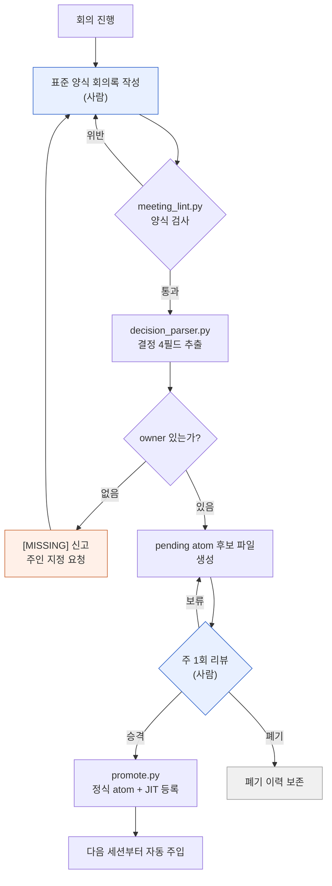

# 17.2 회의록에서 결정을 캐내는 추출 파이프라인

수요일 아침, 출근하자마자 팀 메신저에 알림이 떴다. "지난주 인벤토리 칸 수 30칸으로 늘리기로 한 거 맞죠? 누가 데이터 시트 고치기로 했었죠?" 스레드에 아무도 답을 못 단다. 회의록은 분명 있다. 어딘가의 폴더에. 열어 보면 안건과 토론이 빽빽한데, "그래서 뭘 결정했고 누가 책임지는가"는 문장 사이에 녹아 있다. 결국 다음 회의에서 같은 안건을 처음부터 다시 꺼낸다.

이 챕터는 그 사흘의 공백을 메우는 기계 이야기다. 회의록 한 건이 들어가면, 양식 검사를 통과하고, 결정 네 필드가 뽑혀 나오고, 주인 없는 결정은 [MISSING] 딱지가 붙고, 후보 파일이 만들어지고, 일주일 뒤 검수를 거쳐 자동 주입되는 자산이 된다. 사람 손은 양 끝 두 곳에만 닿는다. 회의록을 쓰는 입구와, 주 1회 검수하는 출구.

---

## 17.2.1 파이프라인 전체 흐름

먼저 전체를 한 장에 본다. 네모 칸 하나하나가 작은 스크립트이거나 사람의 판단이다. 손으로 옮기는 칸은 두 개뿐이고, 나머지는 자동으로 흐른다.



파란 칸 두 개(회의록 작성·주 1회 리뷰)만 사람이고, 나머지는 스크립트다. 주황 칸([MISSING] 신고)은 자동 검사가 사람을 다시 부르는 자리다. 결정에 주인이 없으면 파이프라인이 그냥 멈추는 게 아니라, 누가 책임지는지 정할 때까지 회의록 작성 단계로 결정을 되돌려 보낸다. 이게 이 파이프라인의 핵심 설계다. 빈칸을 조용히 넘기지 않고 시끄럽게 신고한다.

전체 자산 폴더 구조는 이렇게 잡혀 있다.

<svg xmlns="http://www.w3.org/2000/svg" viewBox="0 0 720 300" font-family="monospace" font-size="13">
  <rect x="10" y="10" width="700" height="280" fill="#fafafa" stroke="#cccccc"/>
  <text x="24" y="38" font-weight="bold">meeting_pipeline/</text>
  <line x1="40" y1="48" x2="40" y2="270" stroke="#bbbbbb"/>
  <text x="52" y="68">scripts/</text>
  <text x="80" y="92" fill="#3366cc">meeting_lint.py</text>
  <text x="300" y="92" fill="#777777">양식·필수 섹션 검사</text>
  <text x="80" y="116" fill="#3366cc">decision_parser.py</text>
  <text x="300" y="116" fill="#777777">결정 4필드 추출 + owner [MISSING] 신고</text>
  <text x="80" y="140" fill="#3366cc">promote.py</text>
  <text x="300" y="140" fill="#777777">pending → 정식 atom + JIT manifest 갱신</text>
  <text x="52" y="172">meetings/</text>
  <text x="80" y="196" fill="#999999">2026-05-18_battle_tf.md</text>
  <text x="300" y="196" fill="#777777">표준 양식 회의록 (입력)</text>
  <text x="52" y="228">atoms/pending/</text>
  <text x="80" y="252" fill="#cc6633">meeting_decision_2026-05-18_D1.md</text>
  <text x="300" y="252" fill="#777777">후보 (1주 검증 대기)</text>
</svg>

---

## 17.2.2 1단계 — 양식을 강제하는 lint

추출이 가능하려면 회의록이 기계가 읽을 수 있는 모양이어야 한다. "## 결정" 섹션이 없거나, 결정이 줄글 한 문단에 섞여 있으면 파서는 아무것도 못 뽑는다. 그래서 가장 먼저 양식 검사를 넣는다. `meeting_lint.py`가 하는 일은 단순하다. 필수 frontmatter가 있는가, 필수 섹션이 있는가, 결정 슬롯이 `D1`, `D2` 형식으로 채워져 있는가.

```python
# meeting_lint.py 골격
REQUIRED_FRONTMATTER = ["type", "date", "category", "attendees"]
REQUIRED_SECTIONS = ["## 안건", "## 결정", "## 액션 아이템", "## 다음 회의"]
ALLOWED_CATEGORIES = ["art", "battle", "daily", "issue", "review"]

def lint(meeting_note_path):
    fm, body = parse_markdown(meeting_note_path)
    errors = []
    for key in REQUIRED_FRONTMATTER:
        if key not in fm:
            errors.append(f"frontmatter 누락: {key}")
    if fm.get("category") not in ALLOWED_CATEGORIES:
        errors.append(f"category 값 부적합: {fm.get('category')}")
    for section in REQUIRED_SECTIONS:
        if section not in body:
            errors.append(f"섹션 누락: {section}")
    if "## 결정" in body:
        block = extract_section(body, "## 결정")
        if not any(l.strip().startswith("- D") for l in block.split("\n")):
            errors.append("결정 슬롯 비어 있음 (D1, D2... 형식 필요)")
    return errors
```

이 검사를 회의록 커밋 전 훅으로 건다. 양식을 어기면 커밋 자체가 막힌다. 권고로만 두면 바쁜 날 슬그머니 건너뛰고, 한 번 건너뛴 양식은 다음 주에 무너진다. 1~2주만 막혀 보면 양식이 손에 붙는다. 다만 너무 빡빡하면 회의록 작성 자체를 미루게 되니, 적응기 후 false positive를 한 번 정리해 주는 게 현실적인 운영이다.

---

## 17.2.3 2단계 — 결정 네 필드를 캐는 파서

양식을 통과한 회의록에서 `decision_parser.py`가 결정 슬롯을 읽는다. 결정 하나에서 뽑아야 할 것은 정확히 네 가지다. **무엇을 정했는가(decision), 누가 책임지는가(owner), 왜 그렇게 정했는가(rationale), 다음에 뭘 해야 하는가(follow_up).** 이 네 필드가 결정을 자산으로 만든다. 특히 owner. 주인 없는 결정은 결정이 아니라 희망 사항이다. 그래서 파서는 owner가 비면 조용히 빈칸으로 두지 않고 `[MISSING]`을 입력해 신고한다.

여기서부터 끝까지, 회의록 한 건이 자산이 되는 과정을 한 줄도 건너뛰지 않고 따라가 본다. 입력부터 atom 승격까지의 단일 연속 예시다.

```text
================ 입력: meetings/2026-05-18_battle_tf.md ================
---
type: meeting
date: 2026-05-18
category: battle
attendees: [이민수, teammate_a, teammate_b]
related_atoms: [combat_global_cooldown_constant]
---
## 안건
- 전투 글로벌 쿨다운(GCD) 값 통일
- 회복 스킬의 GCD 예외 여부

## 결정
- D1: 전투 글로벌 쿨다운을 0.5초로 통일한다. (소유자: teammate_a) [근거: refgame 대비 입력 반응 체감 테스트에서 0.5초가 가장 안정적]
- D2: 회복 스킬은 글로벌 쿨다운 적용에서 제외한다. [근거: 회복 사이클 끊김 우려]

## 액션 아이템
- @teammate_a: 전투 데이터 시트 cooldown 컬럼 일괄 0.5 적용 (~MM-DD)

## 다음 회의
- MM-DD 14:00, 회복 사이클 1주 테스트 결과 리뷰

================ $ python meeting_lint.py meetings/2026-05-18_battle_tf.md ================
[OK] frontmatter 4/4, 섹션 4/4, 결정 슬롯 2건 감지. 커밋 허용.

================ $ python decision_parser.py meetings/2026-05-18_battle_tf.md ================
[
  {
    "id": "D1",
    "decision": "전투 글로벌 쿨다운을 0.5초로 통일한다.",
    "owner": "teammate_a",
    "rationale": "refgame 대비 입력 반응 체감 테스트에서 0.5초가 가장 안정적",
    "follow_up": "전투 데이터 시트 cooldown 컬럼 일괄 0.5 적용 (~MM-DD)",
    "source_meeting": "2026-05-18_battle_tf.md",
    "category": "battle",
    "related_atoms": ["combat_global_cooldown_constant"]
  },
  {
    "id": "D2",
    "decision": "회복 스킬은 글로벌 쿨다운 적용에서 제외한다.",
    "owner": "[MISSING]",          # ← 소유자 미기재. 파서가 신고함
    "rationale": "회복 사이클 끊김 우려",
    "follow_up": null,             # ← 후속 액션도 없음
    "source_meeting": "2026-05-18_battle_tf.md",
    "category": "battle",
    "related_atoms": ["combat_global_cooldown_constant"]
  }
]
[WARN] D2: owner=[MISSING] — 주인 없는 결정. pending 생성 보류, 회의록 작성자에게 반려.

================ pending 생성: D1만 통과 ================
$ cat atoms/pending/meeting_decision_2026-05-18_D1.md
---
name: meeting_decision_2026-05-18_D1
description: 전투 글로벌 쿨다운 0.5초 통일 결정
status: pending
type: decision
source_meeting: 2026-05-18_battle_tf.md
owner: teammate_a
category: battle
related_atoms: [combat_global_cooldown_constant]
created: 2026-05-18
---
## 결정
전투 글로벌 쿨다운을 0.5초로 통일한다.
## 근거
refgame 대비 입력 반응 체감 테스트에서 0.5초가 가장 안정적.
## 후속 액션
- [ ] @teammate_a: cooldown 컬럼 일괄 0.5 적용 (~MM-DD)

================ 1주 뒤 주간 리뷰 ================
$ python promote.py atoms/pending/meeting_decision_2026-05-18_D1.md
[PROMOTE] → atoms/combat_global_cooldown_constant_decisions/meeting_decision_2026-05-18_D1.md
[JIT] manifest 등록: trigger=(전투|쿨다운|GCD|cooldown), atom 18개 → 19개
[OK] 다음 세션부터 "글로벌 쿨다운" 입력 시 이 결정 자동 주입.
```

이 한 박스가 파이프라인의 전부다. 주목할 곳은 D2다. 결정 내용도 멀쩡하고 근거도 있는데 owner가 비어 있다. 파서는 이걸 그냥 통과시키지 않는다. `[MISSING]`을 입력하고 pending 생성을 보류한 채 작성자에게 반려한다. D2는 며칠 뒤 "회복 사이클 1주 테스트 결과 리뷰" 회의에서 주인을 얻고 다시 들어온다. 빈칸을 막는 이 한 번의 반려가, 사흘 뒤 팀 메신저에서 "그거 누가 하기로 했죠?"가 영영 안 나오게 만든다.

owner 없으면 신고하는 규칙 자체는 atom 하나로 못 박아 두었다(`decision_summary_not_clickup_mirror`, §17.1.2). 태스크 도구에는 "데이터 시트 수정"이라는 할 일이 떠 있을 수 있지만, 그 할 일이 왜·무엇을 결정한 결과인지는 회의록 atom에만 남는다.

---

## 17.2.4 3단계 — pending에서 일주일을 묵힌다

파서가 통과시킨 결정은 곧장 정식 atom이 되지 않고 `pending/`에서 일주일을 기다린다. 회의에서 자신 있게 정한 것이 일주일 운영해 보면 뒤집히는 일이 흔하기 때문이다. 위 예시의 D2가 정확히 그 위험 지대에 있었다. "회복은 GCD(글로벌 쿨다운) 제외"라는 결정이 1주 테스트에서 회복 사이클이 깨지면 다시 뒤집힐 수 있다. pending은 잉크가 마를 시간을 강제로 확보하는 칸이다.

그리고 폐기도 자산으로 남긴다. 만약 D2 같은 결정이 1주 테스트에서 무너졌다면, 그냥 지우는 게 아니라 폐기 이력 atom을 만든다.

```markdown
---
name: meeting_decision_2026-05-18_D2_DISCARDED
status: discarded
discarded_reason: 1주 테스트 결과 회복 사이클 DPS 곡선 붕괴
---
## 원 결정
회복 스킬에도 글로벌 쿨다운 0.5초를 적용한다.
## 폐기 이유
1주 테스트에서 회복 사이클 DPS가 떨어져 전체 밸런스 붕괴. 제외 결정으로 환원.
## 교훈
"회복은 GCD 제외가 표준" → combat_healing_skill_cooldown_exception atom으로 승격.
```

폐기 이력이 다음 회의에서 "이 안건 전에 시도 안 했었나?"의 답이 된다. 같은 실수를 두 번 하지 않게 막는 가장 싼 도구다. 다만 폐기 기록이 쌓이면 검색 노이즈가 되니, 분기별로 중복을 정리하고 교훈만 남기는 손질이 필요하다.

---

## 17.2.5 4단계 — 주 1회 리뷰와 승격

매주 정해진 시간에 pending 후보를 일괄로 본다. 결과는 셋 중 하나다.

| 결과 | 처리 |
|---|---|
| 승격 | pending → 정식 atom 폴더 이동, JIT manifest 등록 |
| 폐기 | 결정이 뒤집힘 → pending에서 빼고 폐기 이력 atom 보존 |
| 보류 | 정보 부족 → pending 1주 연장 |

리뷰는 atom 10개당 15분 안팎. 승격이 결정되면 `promote.py`가 파일 이동과 manifest 갱신을 한 번에 처리한다.

```python
# promote.py 골격
def promote(pending_path):
    fm, body = parse_markdown(pending_path)
    target = ATOM_BASE / f"{fm['related_atoms'][0]}_decisions" / f"{fm['name']}.md"
    move(pending_path, target)
    manifest = json.load(open(JIT_MANIFEST))
    manifest['atoms'].append({
        "name": fm['name'],
        "path": str(target),
        "trigger_regex": build_trigger(fm),   # related_atoms + category 키워드
        "description": fm['description'],
        "added": today(),
    })
    json.dump(manifest, open(JIT_MANIFEST, "w"), indent=2)
    log_promotion(fm['name'])
```

`trigger_regex`가 다음 세션에서 사용자 입력과 맞으면 이 결정이 자동으로 주입된다. 위 예시에서 "글로벌 쿨다운"을 입력하면 D1 결정과 그 근거가 따라 들어온다. 손으로 옮기던 결정이, 필요한 순간에 알아서 떠오르는 자산이 되는 지점이다.

---

## 17.2.6 측정 — 손으로 옮길 때와 무엇이 달랐나

저자의 프로젝트 A 운영 경험에서, 표준 양식만 잡았던 단계와 파이프라인을 가동한 단계를 비교한 인상이다. 아래 수치는 정밀 계측이 아니라 운영 중 체감한 방향과 대략적 비율로, 저자 추정(미검증)이 섞여 있다.

| 항목 | 양식만 (수동 추출) | 파이프라인 가동 |
|---|---|---|
| 회의록 → 결정 추출 시간 | 회의당 20~30분 | 1분 미만 |
| 결정의 atom 승격 비율 | 5~10% (정리 시간 부족) | 60~80% (전수 검토) |
| "전에 결정 안 했었나?" 재회의 | 분기당 5~10건 | 분기당 0~2건 |
| 주인 불명 결정 발생 | 추적 안 됨 | [MISSING] 신고로 즉시 가시화 |

가장 크게 바뀐 건 승격 비율이다. 손으로 정리하던 때는 시간이 없어 결정의 90% 이상이 휘발됐다. 자동화하니 전수 검토가 가능해져, 가치 있는 결정이 빠짐없이 남는다. 방향은 분명하다. 비율의 정확한 값은 팀 규모와 회의 빈도에 따라 달라진다.

---

## 17.2.7 흔한 실패와 처방

| 패턴 | 처방 |
|---|---|
| lint를 권고로만 운영 | 커밋 훅으로 강제 |
| 결정 슬롯에 토론까지 적음 | 결정은 한 문장, 근거는 별도 필드 |
| owner 빈칸을 그냥 통과 | [MISSING] 신고 + pending 보류로 반려 |
| pending 리뷰가 미뤄짐 | 주간 회고에 고정 슬롯, 5분이라도 매주 |
| 폐기 이력을 안 남김 | 폐기도 별도 atom으로 보존 |

이 다섯 줄이 거의 전부다. 사람이 의지로 지켜야 하는 자리를 최대한 줄이고, 양식과 owner 검사를 기계에 맡기는 게 이 시스템의 안정점이다.

---

## 이 챕터의 핵심 메시지
- 회의록 한 건이 lint → 파서 → pending → 리뷰 → JIT 등록으로 자동으로 흘러 자산이 된다.
- 결정 네 필드 중 owner가 비면 파서가 [MISSING]을 입력해 반려한다.
- pending 1주 묵힘과 폐기 이력 보존이 결정의 잉크가 마를 시간을 강제한다.

---

> **게임 밖 적용.** 회의록 한 건을 양식 검사→결정 추출→1주 검증→정식 등록의 컨베이어로 흘려보내고 사람은 입구(작성)와 출구(주 1회 검수) 두 곳에만 손을 대는 이 구조는, 게임이 아니라 어떤 지식노동 팀의 문서 운영에도 이식된다. 예컨대 컨설팅 팀이 고객 미팅 노트를 다룰 때, 노트 양식만 통일해 두고 "결정·담당·근거·다음 행동" 슬롯을 LLM으로 1차 추출한 뒤, 담당이 비면 `[MISSING]`을 띄워 반려하고, 한 주 묵힌 결정만 정식 액션 트래커로 승격하면 됩니다. 손으로 정리할 때 90% 이상 휘발하던 미팅 결정이, 컨베이어에 올리면 전수 검토 대상이 되어 빠짐없이 남는다.

---

## 따라하기

**setup.** 회의록 폴더에 표준 양식 템플릿을 두고, `meeting_lint.py`를 커밋 전 훅에 거세요. frontmatter 4필드와 섹션 4개를 필수로 잡습니다.

**prompt.** 회의록 한 건을 파서에 넣고 다음처럼 지시하세요.

> 이 회의록의 `## 결정` 섹션에서 결정마다 decision / owner / rationale / follow_up 네 필드를 JSON으로 뽑아라. owner가 명시되지 않은 결정은 owner를 `[MISSING]`으로 표기하고 따로 경고 줄에 모아라. 추측해서 채우지 마라.

**verify.** 출력 JSON에서 `[MISSING]`이 입력된 결정이 있으면, 그 결정은 pending을 만들지 말고 회의록 작성자에게 반려하세요. owner가 다 채워진 결정만 pending 후보 파일로 생성하고, 일주일 뒤 주간 리뷰에서 승격·폐기·보류를 정합니다.

### 1인 축소판
혼자 작업한다면 스크립트 세 개와 커밋 훅까지는 과합니다. 회의록 `## 결정` 섹션만 표준화하고, 결정마다 한 줄로 `D1: 무엇 / 주인: 나 / 근거: 왜`를 적으세요. 주 1회, 그 주의 회의록에서 결정 줄만 긁어 한 파일(`decisions.md`)에 모으고, 주인이 빈 줄에는 직접 `[MISSING]` 표시를 남겨 다음 주에 채웁니다. 스크립트는 나중에 손이 아플 때 붙여도 늦지 않습니다. 핵심은 "결정 한 줄·주인 명시·주 1회 모으기" 세 습관입니다.
