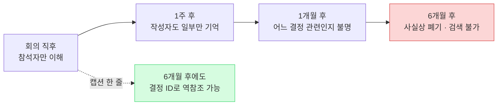
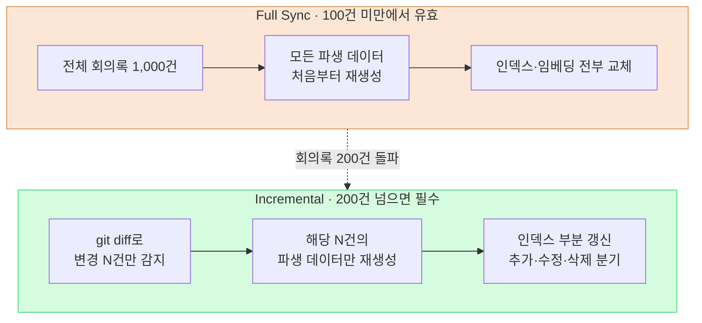

# 17.3 회의 분류·캡션·동기화 — 자산이 되는 회의록의 세 축

> 회의록은 쌓는 게 목적이 아니다. 6개월 뒤에도 검색되고, 결정으로 이어지고, 두 대의 PC에서 같은 상태로 보이는 것이 목적이다.

---

화요일 오후. 한 해 전 회의에서 분명히 캐릭터 의상 채도를 한 단계 낮추기로 합의했던 기억이 났다. 그런데 그 회의록을 찾을 수가 없었다. 폴더를 열어보니 `meeting_0413.md`, `회의_수정본_final.md`, `IMG_2034.png` 같은 파일 200개가 날짜순으로만 쌓여 있었다. 카테고리도, 캡션도, 일관된 이름도 없었다. 결정은 어딘가에 있는데, 그 결정에 도달할 길이 사라진 상태였다.

회의록이 자산이 되려면 세 가지가 동시에 작동해야 한다. **분류**가 검색의 1차 진입점을 만들고, **캡션**이 이미지 절반을 검색 가능하게 살려두며, **동기화**가 1,000건이 넘어도 처리 비용을 변경분에만 묶어둔다. 이 셋 중 하나라도 빠지면 회의록은 쌓일수록 무거워지기만 하는 죽은 더미가 된다.

§17.1·§17.2에서 회의록을 추출 파이프라인으로 변환하는 흐름 — `meeting_lint.py`로 양식을 검사하고, `decision_parser.py`가 결정 네 필드(`decision` / `owner` / `rationale` / `follow_up`)를 뽑고, owner가 없으면 `[MISSING]`으로 신고하고, pending atom으로 모았다가 `promote.py`로 승격하는 — 을 세웠다. 이 장은 그 파이프라인이 장기적으로 망가지지 않도록 받치는 세 개의 운영 표준을 다룬다.

---

## 17.3.1 카테고리 — 검색의 1차 진입점

회의록은 시간이 지나면 수백, 수천 건이 된다. 검색이 안 되는 자료는 자산이 아니다. 카테고리는 그 검색의 첫 번째 갈림길이다. 사무실 캐비닛에 라벨을 붙이는 일과 같다. 라벨 없는 캐비닛은 결국 아무도 열지 않는다.

저자가 운영하는 프로젝트 A(MMORPG 개발)는 카테고리를 다섯 개로 묶었다. 핵심은 **작고 직교하게** 유지하는 것이다.

<svg viewBox="0 0 720 220" xmlns="http://www.w3.org/2000/svg" font-family="sans-serif" font-size="13">
  <rect x="10" y="10" width="130" height="190" rx="8" fill="#fce7d6" stroke="#d98a4a"/>
  <text x="75" y="34" text-anchor="middle" font-weight="bold">art</text>
  <text x="75" y="58" text-anchor="middle" font-size="11">비주얼·아트 방향</text>
  <text x="75" y="78" text-anchor="middle" font-size="10" fill="#666">컨셉 리뷰</text>
  <text x="75" y="94" text-anchor="middle" font-size="10" fill="#666">환경 톤 합의</text>
  <text x="75" y="120" text-anchor="middle" font-size="10" fill="#a05a20">→ 캡션 비중↑</text>

  <rect x="150" y="10" width="130" height="190" rx="8" fill="#d6e7fc" stroke="#4a7ad9"/>
  <text x="215" y="34" text-anchor="middle" font-weight="bold">battle</text>
  <text x="215" y="58" text-anchor="middle" font-size="11">전투·밸런스</text>
  <text x="215" y="78" text-anchor="middle" font-size="10" fill="#666">쿨다운·DPS</text>
  <text x="215" y="94" text-anchor="middle" font-size="10" fill="#666">데미지 곡선</text>
  <text x="215" y="120" text-anchor="middle" font-size="10" fill="#2050a0">→ atom 추출↑</text>

  <rect x="290" y="10" width="130" height="190" rx="8" fill="#d6fce0" stroke="#4ad97a"/>
  <text x="355" y="34" text-anchor="middle" font-weight="bold">daily</text>
  <text x="355" y="58" text-anchor="middle" font-size="11">정기 진행 공유</text>
  <text x="355" y="78" text-anchor="middle" font-size="10" fill="#666">스탠드업</text>
  <text x="355" y="94" text-anchor="middle" font-size="10" fill="#666">오늘 할 일</text>
  <text x="355" y="120" text-anchor="middle" font-size="10" fill="#207040">→ 결정 거의 없음</text>

  <rect x="430" y="10" width="130" height="190" rx="8" fill="#fcd6d6" stroke="#d94a4a"/>
  <text x="495" y="34" text-anchor="middle" font-weight="bold">issue</text>
  <text x="495" y="58" text-anchor="middle" font-size="11">긴급 이슈 대응</text>
  <text x="495" y="78" text-anchor="middle" font-size="10" fill="#666">빌드 실패</text>
  <text x="495" y="94" text-anchor="middle" font-size="10" fill="#666">출시 직전 사고</text>
  <text x="495" y="120" text-anchor="middle" font-size="10" fill="#a02020">→ 사후 정비 필수</text>

  <rect x="570" y="10" width="130" height="190" rx="8" fill="#ece6fc" stroke="#7a4ad9"/>
  <text x="635" y="34" text-anchor="middle" font-weight="bold">review</text>
  <text x="635" y="58" text-anchor="middle" font-size="11">마일스톤·QA</text>
  <text x="635" y="78" text-anchor="middle" font-size="10" fill="#666">MS 검수</text>
  <text x="635" y="94" text-anchor="middle" font-size="10" fill="#666">분기 회고</text>
  <text x="635" y="120" text-anchor="middle" font-size="10" fill="#502090">→ 요약 atom</text>

  <text x="360" y="172" text-anchor="middle" font-size="11" fill="#444">다섯 칸은 서로 겹치지 않는다 — 한 회의는 정확히 한 칸</text>
  <text x="360" y="192" text-anchor="middle" font-size="11" fill="#444">여섯 칸으로 늘리는 순간 "이거 art야 battle이야?"가 매주 회의를 막는다</text>
</svg>

다섯 개가 모든 팀의 정답은 아니다. 비전투 시스템이 중심인 프로젝트라면 `battle`을 `system`으로 바꾸는 식의 조정이 필요하다. 핵심은 숫자가 아니라 **분류 결정이 회의 자체를 막지 않을 만큼 작게** 유지하는 원칙이다.

### 한 회의는 한 카테고리

회의가 두 칸에 걸치는 일은 자주 생긴다. 캐릭터 컨셉을 리뷰하다 전투 모션까지 합의했다면 art인가 battle인가. 원칙은 **주 산출물 기준 하나만**이다. 컨셉이 주 산출물이면 art로 분류하고, 전투 모션은 `sub_topic` 필드로 보조 기록한다.

```yaml
---
type: meeting_note
category: art
sub_topic: [character, battle_motion]
date: 2026-05-18
attendees: [teammate_a, teammate_b, teammate_c, 이민수]
related_atoms: [character_concept_kim, battle_motion_kim]
confidential: internal
---
```

`sub_topic`은 검색의 2차 필터일 뿐, 라우팅 결정에는 쓰지 않는다. 라우팅은 항상 `category` 단일 값으로만 작동한다. 이 단일 값 원칙이 무너지면 §17.2의 `promote.py`가 atom을 어느 폴더로 보낼지 분기할 수 없게 되고, 카테고리별 통계의 합도 어긋난다. 직교성은 미관 문제가 아니라 파이프라인 무결성의 전제다.

### 카테고리마다 운영이 다르다 — 그게 분리의 진짜 가치

다섯 칸을 나눈 진짜 이유는 검색 라벨이 아니다. 칸마다 운영 방식이 달라서, 분리해야 차등 운영이 자연스럽게 설계되기 때문이다.

`art`는 첨부 이미지가 다수라 다음 절의 캡션 표준이 필수다. 결정이 시각 중심이라 결정 슬롯에 `` 같은 이미지 참조가 들어간다. `battle`은 결정이 수치·룰이라 atom 자동 승격 비율이 가장 높고, 결정 한 줄이 데이터 시트 일괄 변경으로 이어지므로 영향 범위 가시화(11부 관계도)가 중요하다. `daily`는 결정이 거의 없는 게 정상이고, 누적이 빠르니 주 단위 자동 폴더(`daily/2026-W21/`)로 분리한다. `issue`는 회의록이 산만하므로 사후 24시간 내 정비를 의무로 두고 재발 방지 atom을 `issue_postmortem/`으로 추출한다. `review`는 분량이 길어 5\~10줄 요약 atom을 별도로 작성해 다음 분기 회고에서 자동 인용되게 한다.

신규 카테고리 추가는 매우 신중하게 한다. 분기당 5회 이상 발생하고, 운영 방식이 기존 다섯과 명확히 다르고, 별도 라우팅 폴더가 필요하고, 한 달 뒤에도 5회 이상 유지될 때 — 이 네 조건을 모두 통과해야 검토한다. 저자의 운영 경험상 다섯 개에서 1년 이상 유지됐고, `tech_review`나 `external` 같은 후보가 떠올랐을 때도 결국 `sub_topic`으로 흡수됐다.

### AI 분류기는 보조에 그쳐야 한다

카테고리는 사람이 작성 시 직접 입력하는 게 1차다. 외부에서 받은 자료처럼 누락된 회의록만 AI 분류기로 보조한다. 키워드 사전으로 90% 정도가 잡히고, 나머지 `uncertain`만 LLM이나 사람이 판정한다.

LLM에 위임할 때는 제약을 강하게 거는 프롬프트가 안정적이다. 다음은 실제 사용하는 프롬프트 전문이다.

```
다음은 회의록입니다. 5개 카테고리 중 하나로 분류하세요.

카테고리:
- art: 비주얼·아트 방향
- battle: 전투 시스템·밸런스
- daily: 정기 진행 공유
- issue: 긴급 이슈 대응
- review: 마일스톤·QA 리뷰

회의록:
[전문 또는 첫 500자]

응답 형식: 카테고리 단어 하나만. 설명·근거·불확실 일체 금지.
응답이 5개 카테고리 중 하나가 아니면 시스템 실패로 간주합니다.
```

같은 회의록(아래는 art 회의의 첫머리)을 넣었을 때 Claude의 날것 출력은 이랬다.

> 입력 회의록:
> `캐릭터 K_007(학자) 컨셉 v3 리뷰. 의상 색조의 채도가 너무 높다는 의견. 한 단계 낮추기로 합의. 다음 회의에서 전투 모션 톤도 같이 점검하기로 함.`

> Claude 출력:
> `art`

깔끔하게 한 단어만 나왔다. 그런데 같은 프롬프트에 daily 회의록을 넣자 이런 일도 있었다.

> 입력: `오늘 빌드가 새벽에 깨졌고, 원인은 데이터 시트 머지 충돌로 보임. 우선 핫픽스 후 정식 수정 예정.`

> Claude 출력:
> `issue`

표면상 daily 스탠드업에서 나온 발언이지만, Claude는 내용을 보고 `issue`로 분류했다. **이게 바로 분류기를 1차로 쓰면 안 되는 이유다.** 사람은 "이건 데일리 중 갑자기 나온 빌드 사고라 별도 issue 회의로 분리해야 한다"는 운영 판단을 한다. AI는 텍스트만 보고 라벨을 찍는다. 라벨은 맞을 수 있어도, 회의를 분리할지 말지는 결정하지 못한다. 그래서 사람이 1차, LLM은 누락분 보조에 그친다.

분기 회고에서는 카테고리별 회의 수를 집계해 "어디서 시간을 쓰는가"를 본다. 아래 분포는 저자 추정(미검증)으로, 절대 건수는 예시이고 비율의 대소 관계만 실제 운영 감각과 일치한다.

| 카테고리 | 비중(추정) | 비고 |
|---|---|---|
| `daily` | 약 1/3 | 매일 정기, 결정은 거의 없음 |
| `battle` | 약 1/5 | 전투 TF 주 2회 |
| `art` | 약 1/7 | 아트 리뷰 + 외부 회의 |
| `issue` | 낮음 | 빌드 사고 등 |
| `review` | 가장 낮음 | 마일스톤·분기 회고 |
| 기타 | 약 1/5 | 1:1, 외부 등 비-카테고리 |

`issue`가 한 분기에 도드라지게 잡히면, 빌드·CI 안정성 개선이 다음 우선순위로 떠오른다. 카테고리는 검색만이 아니라 조직의 시간 배분을 비추는 거울이기도 하다.

---

## 17.3.2 캡션 — 이미지 절반을 살려두는 한 줄

`art` 회의록은 본문의 절반이 이미지다. 그리고 캡션 없는 이미지는 책상 위에 쌓인 사진 더미와 같다. 그날은 다 기억나지만, 한 달 뒤에는 뒷면에 한 줄 메모를 적어둔 사진만 살아남는다.



이미지가 회의록의 절반인데 검색이 안 되면, 회의록 자산의 절반이 사라진 셈이다. 그 절반을 살려두는 게 캡션 한 줄이다.

### 캡션 3요소

프로젝트 A의 캡션 표준은 세 줄로 끝난다.

```markdown


**[그림 1]** 캐릭터 K_007 (학자) 컨셉 v3 — 의상 색조 한 단계 채도 낮춤
*결정: D2 (의상 채도 -10%) | 다음 액션: v4 작업 (~MM-DD)*
```

세 요소가 각각 다른 검색 경로를 연다. **번호 + 한 줄 설명**은 본문에서 "그림 1 참고"로 인용할 길을, **결정 ID 참조(D2)**는 "이 결정과 연결된 이미지" 역참조를, **다음 액션**은 후속 작업의 단서를 남긴다. 세 줄 모두 1분 안에 쓸 수 있다. "즉시 부착"이 "회의 중 작성"을 뜻하지는 않는다. 회의 중에는 결정 정리만 하고, 끝난 직후 10분 안에 캡션을 채우는 게 현실적이다.

### 파일명과 폴더가 1차 진입점

캡션만큼 중요한 게 파일명이다. 폴더와 파일명 자체가 검색의 첫 번째 진입점이기 때문이다.

```
회의록 폴더/
├── 2026-05-18_art_review.md
└── images/
    └── 2026-05-18_art_review/
        ├── character_kim_concept_v3.png
        ├── env_palette_comparison.png
        └── reference_external_game_a.png
```

규칙은 `<주제>_<항목>_<버전 or 비고>.<ext>`이고, 한국어·공백·특수문자는 금지한다(경로 인코딩 사고 방지). `IMG_2034.png`(의미 0), `김캐릭터 v3.png`(한국어·공백), `final_final_v3_real.png`(버전 무의미), `untitled.png`(폐기 후보)는 전부 안티패턴이다. 이런 이름은 사람 의지에 기대지 말고 `meeting_lint.py`에 검사 규칙을 추가해 강제하는 게 낫다 — §17.2에서 양식 검사를 자동화한 그 린트에 파일명 검사 한 줄을 얹는 것으로 충분하다.

### 외부 자료 출처와 confidential 등급

회의에서는 외부 게임·아트를 참고로 인용하는 일이 잦다. 출처가 없으면 저작권 사고로 직결된다.

```markdown


**[그림 3]** 참고 이미지 — refgame (Developer Y, 2024)
*인용 사유: 비슷한 컨셉의 채도 처리 비교. 직접 차용 없음.*
```

출처(게임명·개발사·연도)·인용 사유·직접 차용 여부를 모두 명시한다. 그리고 이미지는 텍스트보다 유출 위험이 크므로 등급을 frontmatter에 단다.

```yaml
confidential: internal   # internal / restricted / external_ok
images:
  - file: character_kim_concept_v3.png
    confidential: restricted
    reason: 미공개 캐릭터 디자인
```

`internal`은 회사 내부 공유, `restricted`는 해당 TF·담당자만, `external_ok`는 마케팅·외부 공유 승인을 뜻한다. 회의록 빌드 시 등급별로 출력을 분리하고, `external_ok`가 아닌 이미지는 외부 공유본에서 자동 블러 처리한다. 이 자동 분리가 외부 공유 마스킹 사고를 사실상 0으로 만드는 직접 효과를 낸다.

### 캡션도 AI가 초안을 댄다

이미지 50장에 캡션 50개를 손으로 쓰는 건 부담이다. AI에게 본문과 파일명을 주고 일괄 초안을 받는다.

```
다음은 회의록 본문 + 이미지 파일 목록입니다.

[회의록 본문]
[이미지 파일명 10개]

각 이미지에 대해 caption 초안을 작성하세요.

형식:
- [그림 N] <설명> — <핵심 결정 또는 변화>
- *결정: D? | 다음 액션: ?*

본문에서 근거를 찾지 못한 이미지는 "내용 불명 — 작성자 확인 필요"로 표시.
```

여기서 마지막 줄이 핵심이다. 같은 회의록을 넣었을 때 Claude는 본문에 근거가 있는 이미지엔 캡션을 달았지만, `reference_external_game_a.png`에는 이렇게 답했다.

> Claude 출력 (발췌):
> `[그림 3] reference_external_game_a.png — 내용 불명, 작성자 확인 필요. 본문에 이 외부 참고 이미지의 인용 사유가 명시되어 있지 않습니다.`

AI가 모르는 것을 모른다고 신고한 것이다. 이걸 받아 작성자가 인용 사유를 채운다. 본문 컨텍스트만으로 부족하면 핵심 5\~10장만 골라 Vision 모델에 보낸다(이미지 토큰 비용이 크므로 전부 돌리지 않는다).

```python
# 핵심 이미지 5~10장만 선택 적용 — 이미지 1장당 토큰 비용 큼
response = client.messages.create(
    model="claude-opus-4-8",
    messages=[{
        "role": "user",
        "content": [
            {"type": "image", "source": {"type": "base64", "data": img_b64}},
            {"type": "text", "text": "이 이미지를 한국어 한 줄로 설명. 추측 금지, 보이는 것만."},
        ],
    }],
)
```

작성자는 이 한 줄을 캡션 형식으로 정비한다. 모든 이미지에 Vision을 돌릴 필요는 없다. 핵심 5\~10장만으로도 검색 가능성은 충분히 올라간다.

캡션이 잘 작성된 1년치 회의록은 그 자체로 비주얼 디벨롭먼트 다큐멘트가 된다. `character_kim` v1 → v2 → v3의 시각적 변화를 결정 ID로 추적할 수 있고, `external_ok` 등급만 필터하면 외부 보고 자료가 자동 큐레이션되며, 분야별 핵심 이미지 + 캡션을 모으면 신규 팀원 온보딩 자료가 된다. 캡션 도입 전후의 변화를 저자 추정(미검증)으로 표현하면 **방향**은 이렇다 — 6개월 전 회의록 검색 성공률은 크게 오르고, "이 이미지 어디서 봤지?" 재질문은 크게 줄고, 외부 공유 마스킹 사고는 0에 수렴한다. 절대 수치는 팀마다 다르겠지만, 단계 1·2(파일명 표준 + 캡션 양식)만으로도 그 방향은 분명하게 나타났다.

---

## 17.3.3 동기화 — 전체가 아니라 변경분만

회의록 자체는 텍스트 파일이라 git으로 충분하다. 동기화의 진짜 대상은 회의록에서 **파생된 데이터**들이다 — §17.2의 pending atom 후보, JIT manifest, 카테고리 통계, 결정 인덱스(`decision_index.json`), 캡션 인덱스, confidential 등급별 빌드 출력, 그리고 벡터 검색용 LLM 임베딩. 이 데이터들이 회의록 변경에 모두 반응해야 한다.

문제는 회의록이 1,000건을 넘어가면 매번 전체를 다시 처리하는 비용이 운영의 절반을 차지한다는 점이다. 작업 라인 전체를 멈추고 모든 부품을 다시 만드는 것과 같다 — 부품 하나만 바뀌었는데도.



Full Sync는 구현이 단순하고 상태 불일치 위험이 0이라 도입 초기(100건 미만)에는 오히려 더 안전하다. Full이 나쁜 방식이라는 뜻이 아니다. 다만 회의록 수에 선형으로 비례하는 비용이 200건을 넘기는 자리부터 병목이 된다. 그때 Incremental로 전환한다.

### 변경 감지는 git diff 기준으로

Incremental의 첫 단계는 "어떤 파일이 바뀌었는가"를 정확히 판정하는 것이다. 파일 mtime은 빠르지만 `touch`만 해도 변경으로 잡혀 정확도가 낮다. 파일 해시는 내용 기준이라 정확하지만 추가·삭제 구분이 약하다. 저자의 권장은 **git diff** 기반이다. 마지막 sync 시점의 커밋 해시를 기록해두고, 그 이후 변경된 파일만 처리한다. 추가·수정·삭제를 모두 정확히 잡으면서 별도 상태 관리 부담이 가장 작다.

```python
# incremental_sync.py 골격
def get_changed_files(last_sync_commit):
    result = subprocess.run(
        ["git", "diff", "--name-only", last_sync_commit, "HEAD", "--", "meetings/"],
        capture_output=True, text=True
    )
    return result.stdout.strip().split("\n")

def sync():
    last_commit = read_state("last_sync_commit")
    for path in get_changed_files(last_commit):
        if not os.path.exists(path):
            handle_deletion(path)        # atom·인덱스·임베딩 일괄 삭제
        elif is_new(path, last_commit):
            handle_creation(path)        # lint → 결정 추출 → pending atom → 인덱스 → 임베딩
        else:
            handle_modification(path)    # 기존 파생 무효화 후 재처리
    write_state("last_sync_commit", get_current_commit())
```

여기서 비용을 가장 크게 가르는 분기가 하나 더 있다. 회의록이 **본문**까지 바뀐 건지, **frontmatter**만 바뀐 건지다.

```python
def detect_change_scope(file_path, last_commit):
    diff = subprocess.run(
        ["git", "diff", last_commit, "HEAD", "--", file_path],
        capture_output=True, text=True
    ).stdout
    fm_lines, body_lines = split_diff_by_section(diff)
    return {"frontmatter_changed": bool(fm_lines), "body_changed": bool(body_lines)}

scope = detect_change_scope(path, last_commit)
if scope["body_changed"]:
    full_reprocess(path)          # 임베딩 재생성 포함
elif scope["frontmatter_changed"]:
    metadata_only_update(path)    # 임베딩 재생성 0
```

`category`나 `confidential` 같은 메타만 바뀌었다면 LLM 임베딩을 다시 만들 필요가 없다. 임베딩은 보통 동기화 비용의 가장 큰 덩어리라, 이 한 번의 분기가 비용을 크게 줄인다. 임베딩은 `content_hash` 기준으로 캐싱한다 — 본문 해시가 같으면 캐시된 임베딩을 그대로 재사용하고, frontmatter만의 수정에서는 임베딩 호출이 0이 된다.

비용 차이의 **방향**은 분명하다(아래는 저자 추정, 절대값 아님). 주당 50건 정도 변경되는 운영에서 매주 Full re-embed 대비 Incremental의 임베딩 비용은 수십 분의 일 수준으로 떨어졌다. 회의록이 늘어날수록 Full의 비용은 누적에 비례해 커지는 반면, Incremental의 비용은 주당 변경 건수에만 묶여 누적과 무관하게 거의 평평했다. 이 "누적 무관" 성질이 Incremental의 본질적 가치다.

### 두 개의 안전망 — 정기 Full re-sync와 단일 PC sync

Incremental은 빠른 대신 누적 불일치 위험을 안고 간다. 작은 버그로 한 건의 atom이 누락되면, 그 누락은 다음 Incremental에서 스스로 고쳐지지 않는다. 그래서 가드레일을 끼운다 — 매일 Incremental, 매주 최근 1주분 Partial Full(검증), **매월 전체 Full re-sync**로 인덱스·임베딩 일관성을 점검한다. 매월 점검에서 불일치가 발견되면 변경 감지 로직을 보강한다. 이 매월 1회가 장기 운영의 마지막 안전망이다.

여기에 PC 분리 운영이 한 겹 더 얹힌다. 저자는 회사 PC와 집 PC 두 곳에서 회의록을 다룬다. 원칙은 **sync 작업은 한 PC에서만** 수행하는 것이다.

| 흐름 | 처리 |
|---|---|
| 회사 PC → git push | 회사 PC가 sync 작업(파생 데이터 재생성) 담당 |
| 집 PC → git pull | `last_sync_commit`만 갱신, 재처리 불필요 |
| 양쪽 모두 변경 후 merge | merge 결과를 기준으로 changed 파일 재산정 |

양쪽에서 동시에 sync하면 `last_sync_commit` 상태가 충돌하고, 그 충돌은 조용히 인덱스를 어긋나게 만든다. 한 PC를 sync 주체로 고정하는 단순한 규칙이 가장 확실한 방어다.

---

## 17.3.4 세 축이 한 파이프라인에서 만나는 곳

분류·캡션·동기화는 따로 노는 표준이 아니다. 셋은 §17.2의 추출 파이프라인 위에서 한 흐름으로 묶인다.

회의록이 작성되면 `category`가 `promote.py`의 라우팅을 결정하고, 캡션의 결정 ID가 `decision_parser.py`가 뽑은 결정 네 필드와 연결되며, 그렇게 만들어진 모든 파생 데이터를 Incremental sync가 변경분만 골라 갱신한다. 이 장 운영의 출발점은 `decision_summary_not_clickup_mirror`(§17.1.2)다. 분류가 결정을 찾을 길을 열고, 캡션이 결정의 시각 증거를 남기고, 동기화가 그 결정 자산을 두 PC에서 같은 상태로 보존한다.

화요일 오후의 그 막막함 — 분명히 합의했는데 도달할 길이 없던 그 상태 — 은 이 세 축이 작동하는 순간 사라진다. `category: art`로 폴더가 좁혀지고, 캡션의 `결정: D2`로 정확한 결정에 닿고, 동기화가 그 회의록을 집에서도 같은 모습으로 보여준다.

---

> **게임 밖 적용.** 자료가 검색·참조·동기화되어야 비로소 자산이 된다는 원칙은 게임 회의록만의 이야기가 아니라, 문서를 다루는 모든 직장인의 공통 과제다. 분류(작고 직교한 카테고리)·캡션(첨부 이미지 한 줄 설명)·동기화(전체가 아닌 변경분만)라는 세 축은 도메인을 갈아끼워도 그대로다. 예컨대 영업팀이 1년치 고객 미팅 자료를 쌓는다면, 카테고리를 "신규제안·계약협상·사후지원" 다섯 칸 이하로 고정하고, 첨부한 견적서 캡처마다 "[그림 1] A사 2차 견적 — 단가 5% 인하" 같은 한 줄을 달고, 클라우드 동기화는 바뀐 파일만 골라 처리하면 됩니다. 그래야 반년 뒤 "그때 단가 왜 깎아줬더라"를 캡션 한 줄로 즉시 찾을 수 있다.

---

## 17.3.5 따라하기

**setup**
1. 회의 카테고리를 5개 이하로 정의하세요(art / battle / daily / issue / review를 출발점으로, 팀에 맞게 1\~2개 치환).
2. `meeting_lint.py`에 두 검사를 추가하세요 — `category`가 정의된 값 중 하나인지, 이미지 파일명이 `<주제>_<항목>_<버전>` 패턴(한국어·공백 없음)인지.
3. frontmatter에 `confidential` 필드와 `last_sync_commit`을 기록할 상태 파일을 준비하세요.

**prompt** (누락된 회의록 분류 보조)
```
다음은 회의록입니다. 5개 카테고리 중 하나로 분류하세요.
[카테고리 정의 5줄] / [회의록 첫 500자]
응답 형식: 카테고리 단어 하나만. 설명·근거·불확실 일체 금지.
응답이 5개 카테고리 중 하나가 아니면 시스템 실패로 간주합니다.
```

**verify**
1. 임의의 6개월 전 회의록을 카테고리 + 캡션 결정 ID만으로 찾을 수 있는지 직접 검색해 보세요.
2. `git diff --name-only <last_sync_commit> HEAD`로 잡힌 변경 파일 수와 실제 수정한 회의록 수가 일치하는지 확인하세요.
3. AI 분류 결과를 무비판 수용하지 말고, `uncertain`과 "데일리 중 발생한 결정" 케이스를 사람이 한 번 더 보세요.

---

## 17.3.6 1인 축소판

혼자 일하는 기획자라면 이렇게 줄이세요.

- **분류**: 카테고리를 2개로만 시작하세요 — `decision`(결정이 있는 회의)과 `log`(진행 기록). 결정이 있는 회의만 캡션·atom을 챙기고, 나머지는 날짜 폴더에 쌓아둡니다.
- **캡션**: confidential 등급·Vision 보조는 전부 건너뛰고, **결정이 걸린 이미지에만** 캡션 3요소를 다세요. 이미지 한 장에 한 줄이면 충분합니다.
- **동기화**: 파생 데이터를 임베딩까지 만들 필요 없습니다. `decision_index.json`(결정 ID → 회의록 경로 매핑) 한 파일만 두고, 회의록 저장 시 그 줄만 갱신하세요. git이 곧 동기화이고, Full/Incremental을 구분할 만큼 양이 쌓이기 전까지는 매번 전체 재생성으로 충분합니다.

1인 규모에서도 변하지 않는 핵심은 하나입니다 — **결정에 도달할 길을 남기는 것**. 분류·캡션·동기화는 그 길을 떠받치는 세 개의 기둥일 뿐, 규모에 맞게 얼마든지 가늘게 세워도 됩니다.

---

### 이 챕터의 핵심 메시지
- 카테고리는 5개 이하로 작고 직교하게, 한 회의는 한 category로만 라우팅한다.
- 캡션 3요소(번호·결정 ID·다음 액션)가 이미지 절반을 6개월 뒤에도 살려둔다.
- 동기화는 전체가 아니라 git diff 변경분만, 매월 Full로 보정한다.

### 다음 챕터 미리보기
- 17.4 AI 보조 회의록·결정 추적 자동화 — 추출에서 승격까지의 완전 자동화
