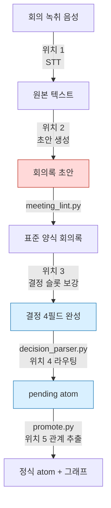
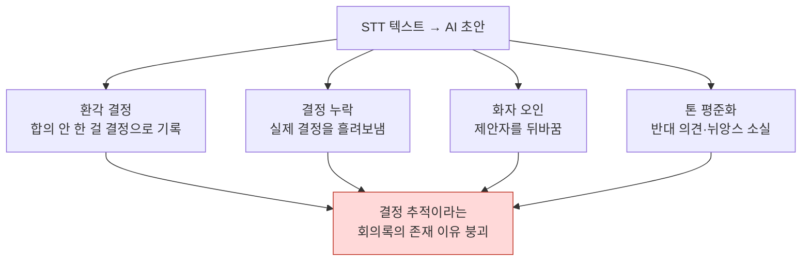

# 17.4 회의록을 결정 데이터베이스로 — AI 자동화 5지점

> 마일스톤 데모를 사흘 앞둔 점심, 기획자 한 명이 식판을 내려놓으며 묻는다. "퀘스트 보상 골드를 1.5배로 올리기로 한 거, 그거 회의에서 정한 거 맞죠? 데이터 시트에 넣어도 돼요?" 옆자리가 답한다. "그건 누가 그냥 해보면 어떻겠냐고 한 거 아니었나." 90분짜리 녹취 파일과 누군가 키보드로 받아친 두 페이지 메모는 분명히 있다. 그런데 그 기록은 "무엇을 이야기했는가"는 담았지만 "무엇을 결정했고, 누가 책임지며, 왜 그랬는가"는 담지 못했다.

회사의 R&D 문서 17건을 통증 순으로 줄 세웠을 때, 가장 큰 비중을 차지한 것은 회의록 개선 계획서였다. 의외였다. 전투 밸런스도, 콘텐츠 양산 파이프라인도 아니었다. 가장 아픈 곳은 회의에서 내린 결정이 실행으로 전파되지 않는다는 것, 그 단 하나였다.

그래서 회의록 시스템을 결정 추적 데이터베이스로 다시 설계했고, 그 흐름의 어디에 AI를 넣고 어디에 넣지 말아야 하는지를 6개월간 직접 운영하며 검증했다. 이 장은 그 5개 지점의 지도다.

---

## 17.4.1 AI 자동화가 들어갈 수 있는 5개 지점

녹취 파일에서 시작해 의사결정 그래프 갱신까지, 회의록 파이프라인 전체에 AI 보조원을 둘 수 있는 자리는 정확히 5개다. 5개 모두에 동시에 넣지는 않는다. 자리마다 성숙도와 사고 위험이 다르기 때문이다.



빨강(위치 2)이 가장 매력적이면서 가장 위험한 자리, 파랑(위치 3·4)이 가장 먼저 도입한 안전한 자리다. 파이프라인 중간의 `meeting_lint.py` → `decision_parser.py` → `promote.py`는 AI가 아니라 결정론적 스크립트다. AI는 이 결정론적 골격 사이의 "판단이 필요한 틈"에만 들어간다.

각 지점의 성격을 한 줄로 요약하면 이렇다.

- **위치 1 (STT, Speech-to-Text, 음성→텍스트)**: 음성 → 텍스트. 성숙도 최고, 위험 최저.
- **위치 2 (초안 생성)**: 텍스트 → 회의록 초안. 매력 최고, 위험 최고.
- **위치 3 (결정 슬롯 보강)**: 사람이 선언한 결정에 근거·영향을 채움. ROI(Return on Investment, 투자 대비 효과) 1위.
- **위치 4 (atom 라우팅)**: 결정을 어느 폴더로 보낼지 추천.
- **위치 5 (관계 추출)**: atom 간 의존 관계 자동 추론. 비결정론에 가장 취약.

---

## 17.4.2 결정론적 골격 — AI가 끼어들 틈을 먼저 만든다

AI 자동화를 이야기하기 전에, AI가 아닌 스크립트 골격을 먼저 봐야 한다. 회의록이 결정 데이터베이스가 되는 핵심은 LLM이 아니라 세 개의 작은 파이썬 스크립트에 있기 때문이다.

표준 양식 회의록은 마지막에 결정 블록을 갖는다. 블록의 각 결정은 네 개의 필드를 강제한다.

```markdown
## Decisions

D1:
  decision: 전투 글로벌 쿨다운을 0.5초로 통일한다
  owner: teammate_a
  rationale: 스킬 연계 테스트에서 0.3초는 입력 누락이 잦았음 (본문 14:22)
  follow_up: 콤보 설계 시트에 GCD 0.5 반영, 6/13까지
```

이 블록을 `decision_parser.py`가 읽는다. 핵심 동작은 단순하다 — 네 필드 중 하나라도 비어 있으면 `[MISSING]`을 찍어 신고한다. 특히 `owner`가 없으면 그 결정은 "아무도 책임지지 않는 결정", 즉 실행되지 않을 결정이므로 가장 강하게 막는다.

```
$ python decision_parser.py 2026-06-06_combat-sync.md

D1: OK   (owner=teammate_a)
D2: [MISSING owner]  "회복 스킬은 GCD 제외 검토" — owner 없음, 승격 차단
D3: [MISSING rationale]  근거 필드 비어 있음, 경고
```

`[MISSING owner]`가 찍힌 D2는 `pending` 폴더로조차 가지 못한다. 사람이 owner를 채워 넣기 전까지 결정으로 취급되지 않는다. 이것이 "회의는 했는데 아무것도 안 굴러갔다"를 구조적으로 막는 장치다.

통과한 결정은 `promote.py`가 `pending atom`으로 만들고, 주 1회 리뷰 게이트에서 사람이 승인하면 정식 atom으로 승격된다. 이때 적용되는 원칙이 `decision_summary_not_clickup_mirror` atom이다(§17.1.2). 태스크 보드는 "무엇을 할지"를, 결정 데이터베이스는 "왜 그렇게 정했는지"를 추적한다. 둘을 섞으면 둘 다 망가진다.

이 세 스크립트가 골격이고, AI는 이 골격의 빈칸을 채우는 보조원이다. 순서가 거꾸로 되면 — AI가 골격을 만들면 — 환각이 결정 데이터베이스의 신뢰 자체를 무너뜨린다.

---

## 17.4.3 가장 위험한 자리 — 위치 2를 왜 마지막에 두는가

위치 2(STT 텍스트 → 회의록 초안 자동 생성)는 모든 팀이 가장 먼저 하고 싶어 하는 자리다. "녹취만 던지면 회의록이 나온다"는 그림이 너무 매력적이기 때문이다. 그리고 바로 그 매력 때문에 가장 비싸게 실패한다.

실패 양상은 네 가지다.



이 중 가장 치명적인 것이 환각 결정이다. 회의에서 누군가 "글로벌 쿨다운은 0.5초가 낫지 않을까요?"라고 의견을 던졌을 뿐인데, AI 초안이 "글로벌 쿨다운 0.5초로 합의"라고 적어버린다. 3주 뒤 이 한 줄은 데이터 시트에 반영되고, 콤보 설계가 그 위에 쌓이고, QA 케이스가 작성된다. 합의된 적 없는 결정이 비가역적으로 전파된다.

그래서 위치 2에는 절대 원칙이 적용된다.

- AI 초안은 **항상** 진행자 검수를 거친다. 자동 커밋은 어떤 경우에도 없다.
- 결정 슬롯은 AI가 **채우지 않는다**. AI는 안건과 발언만 요약하고, 결정의 존재 여부는 사람이 선언한다.
- 원본 STT 텍스트는 요약과 **별도로 영구 보관**한다. 요약만 남기면, 근거가 흐려진 시점에 원본 검증이 불가능해진다.

위치 2를 "영영 안 한다"는 뜻이 아니다. 위치 3·4·1이 안정되고 진행자가 AI 출력의 한계를 몸으로 알게 된 후에는, 위치 2의 도입 가치가 충분히 크다. 다만 **순서가 마지막**이라는 것이다.

---

## 17.4.4 위치 3 — 결정 슬롯 보강이 ROI 1위인 이유

여기가 6개월 운영에서 가장 큰 효과를 낸 자리다. 사람이 결정의 존재를 선언하고, AI가 그 결정의 부속 필드를 채운다. 위치 2와 결정적으로 다른 점은 **결정이 있다는 사실 자체를 사람이 먼저 못 박는다**는 것이다.

사람이 직접 손으로 채우기엔 시간이 너무 드는 세 가지를 AI가 초안한다.

- **rationale**: 회의 본문에서 결정의 근거가 된 발언을 인용
- **affected_atoms**: 영향받는 시스템·데이터 시트 후보 추천
- **follow_up**: 결정에서 도출되는 후속 액션 후보

핵심은 프롬프트가 **근거 인용을 강제하고 환각을 명시적으로 금지**하는 데 있다. 다음은 실제로 운영한 보강 프롬프트의 전문이다.

### 워크드 트랜스크립트 — 결정 슬롯 보강

**프롬프트 (사람이 입력):**

```
아래 회의 본문 보고, 진행자가 선언한 결정 D1("전투 글로벌 쿨다운 0.5초로 통일")의
owner / rationale / affected_atoms / follow_up 네 칸만 채워줘.
결정을 새로 만들지는 말고. rationale은 본문 발언을 타임스탬프 그대로 인용하고,
근거 없는 칸은 추측하지 말고 "근거 없음"이라고 적어줘.
// (의도: affected_atoms는 본문에 언급된 시스템·시트만, 최대 3개)

[회의 본문]
(14:18) teammate_a: 지금 GCD가 0.3초인데 스킬 연타할 때 입력이 자꾸 씹혀요.
(14:22) teammate_b: 어제 콤보 테스트에서도 0.3초는 두 번째 스킬이 안 나가는
        케이스가 30프로쯤 됐어요. 로그 남겨놨습니다.
(14:25) teammate_a: 그럼 0.5초로 올리죠. 제가 콤보 시트에 반영하겠습니다.
(14:26) 진행자: 0.5초로 갑니다. 결정.
(14:31) teammate_c: 회복 스킬은 GCD 적용하면 위급할 때 못 쓰는데 그건 어떻게...
(14:33) 진행자: 그건 다음에 따로 봅시다.
```

**Claude 출력 (날것 그대로):**

```
1. owner: teammate_a
   근거: (14:25) "제가 콤보 시트에 반영하겠습니다." — teammate_a가
   본인 책임으로 명시.

2. rationale:
   - (14:18) teammate_a: "GCD 0.3초에서 스킬 연타 시 입력 씹힘"
   - (14:22) teammate_b: "콤보 테스트에서 0.3초는 두 번째 스킬 미발동
     케이스 약 30%, 로그 보유"
   → 0.3초의 입력 누락 문제가 0.5초 결정의 직접 근거.

3. affected_atoms (본문 언급 기반 후보):
   - atoms/combat/global_cooldown
   - 콤보 설계 시트 (본문 14:25 "콤보 시트" 언급)
   - atoms/combat/skill_recovery  ← 단, (14:31)에서 회복 스킬은
     GCD 예외 논의가 "다음으로 미뤄짐"(14:33). 이 결정의 영향 범위에
     포함할지 불확실. 근거 약함, 사람 확인 필요.

4. follow_up:
   - teammate_a: 콤보 설계 시트에 GCD 0.5초 반영
   - [별도 안건] 회복 스킬의 GCD 예외 여부는 본 결정 범위 밖,
     다음 회의 안건으로 분리 (14:33 진행자 발언)
```

**사람의 검증/거부:**

진행자가 출력을 검수했다. owner와 rationale은 인용이 정확해 그대로 채택했다. `affected_atoms`의 세 번째 후보 `skill_recovery`는 AI가 스스로 "근거 약함, 사람 확인 필요"라고 신고했고, 진행자 판단으로 이 결정의 영향 범위에서 **제외**했다 — 회복 스킬 예외는 별도 결정이 될 사안이지 이번 D1의 영향이 아니다. follow_up의 "별도 안건 분리" 제안은 채택해 다음 회의 안건으로 등록했다.

여기서 중요한 것은 AI가 불확실한 항목을 환각으로 밀어붙이지 않고 **스스로 불확실성을 신고했다**는 점이다. "추측·환각 금지, 근거 없으면 근거 없음이라고 명시"라는 프롬프트의 제약이 이 정직한 출력을 만들었다. 제약을 빼면 AI는 `skill_recovery`를 자신 있게 affected_atoms에 넣고, 그 환각이 그래프에 전파된다.

검수를 마친 결정 블록은 `decision_parser.py`를 통과하고 — 네 필드가 모두 채워졌으므로 `[MISSING]` 없이 — `pending atom`으로 넘어간다.

---

## 17.4.5 위치 4 — atom 라우팅과 위치 5 — 관계 추출

위치 3을 통과한 pending atom이 정식 폴더로 승격될 때, 어느 폴더로 보낼지를 AI가 추천한다(위치 4).

```
이 atom("전투 글로벌 쿨다운 0.5초 통일 / owner teammate_a")을 아래 폴더 중
어디에 넣으면 좋을지 우선순위로 최대 3개 골라줘. 새 폴더 만드는 제안은 하지 말고
이 목록 안에서만.
- atoms/combat/  atoms/character/  atoms/operations/  atoms/visual/
```

"새 폴더 생성 금지"가 핵심 제약이다. 이걸 빼면 AI는 `atoms/combat_timing/`, `atoms/gcd_rules/` 같은 폴더를 끝없이 제안하고, 카테고리가 무한 증식해 검색과 자동 주입이 무너진다. 카테고리는 작고 직교하게 유지하며 1년 이상 변동 없이 가는 것이 원칙이다. AI는 그 닫힌 목록 안에서만 고른다.

위치 5(atom 간 관계 추출)는 가장 늦게, 가장 신중하게 도입한다. 승격된 atom들 사이의 의존 관계를 추론하는 자리다.

```
신규 atom A: "회복 스킬은 글로벌 쿨다운 적용 제외"
기존 atom B: "글로벌 쿨다운 0.5초 통일"

추론된 관계:
  A.exception_of: [B]
  A.derives_from: [B]
  B.affects: [A]   ← 역방향 자동 부여
```

문제는 이 추론이 LLM의 비결정론에 정면으로 노출된다는 것이다. 같은 입력에 어제와 오늘 다른 관계가 나온다. 완화 장치는 세 가지다 — `temperature=0`과 가능한 모델에서 seed 고정, 후보를 제시하고 사람이 승인하는 검수 게이트, 그리고 단방향만 추출한 뒤 역방향은 스크립트가 결정론적으로 보정하는 방식이다. 양방향을 둘 다 LLM에 맡기면 한쪽이 누락되기 때문이다.

---

## 17.4.6 한 번에 1\~2개씩 — 도입 순서가 곧 안전 장치

5개 지점을 동시에 켜는 것이 가장 흔하고 비싼 실패다. 운영 부담이 효과보다 먼저 도달해 팀이 시스템을 통째로 버린다. 다음은 실제로 따라간 순서다.

<svg viewBox="0 0 720 240" xmlns="http://www.w3.org/2000/svg" font-family="sans-serif" font-size="13">
  <line x1="40" y1="40" x2="40" y2="210" stroke="#999" stroke-width="2"/>
  <!-- step 1 -->
  <circle cx="40" cy="50" r="7" fill="#2980b9"/>
  <text x="60" y="48" font-weight="bold">1단계 · 위치 3 결정 슬롯 보강</text>
  <text x="60" y="66" fill="#666">1~2개월 · ROI 1위, 위험 최저부터 시작</text>
  <!-- step 2 -->
  <circle cx="40" cy="95" r="7" fill="#2980b9"/>
  <text x="60" y="93" font-weight="bold">2단계 · 위치 4 atom 라우팅 추천</text>
  <text x="60" y="111" fill="#666">추가 1개월 · 폴더 후보 닫힌 목록 강제</text>
  <!-- step 3 -->
  <circle cx="40" cy="140" r="7" fill="#27ae60"/>
  <text x="60" y="138" font-weight="bold">3단계 · 위치 1 STT</text>
  <text x="60" y="156" fill="#666">자체 호스팅 인프라 정착 시 · 보안상 외부 API 회피</text>
  <!-- step 4 -->
  <circle cx="40" cy="185" r="7" fill="#c0392b"/>
  <text x="60" y="183" font-weight="bold">4단계 · 위치 2 회의록 초안</text>
  <text x="60" y="201" fill="#666">위 3개 안정 후, 가장 신중 · 자동 커밋 절대 금지</text>
  <!-- step 5 -->
  <circle cx="40" cy="225" r="7" fill="#8e44ad"/>
  <text x="60" y="223" font-weight="bold">5단계 · 위치 5 관계 추출</text>
</svg>

위치 2를 가장 늦게 두는 것이 이 순서의 핵심이다. 가장 하고 싶은 자리를 가장 나중에 한다 — 직관에 반하지만, 가장 위험한 검수대에 가장 숙련된 손이 갔을 때 배치하는 것이 작업장의 안전 원칙이다.

비용 측면에서도 이 순서가 합리적이다. 회의 100건/월 기준으로 위치 3은 약 $5\~10, 위치 4는 $1\~2 수준이라(저자 운영 환경 기준 추정, 미검증), **둘만 켜도 월 $10 미만**이다. 가장 큰 효과를 내는 두 자리가 가장 싸다.

---

## 17.4.7 before / after — 같은 회의, 두 개의 회의록

같은 회의를 두 방식으로 기록했을 때의 차이가 이 장 전체의 요약이다.

**Before — 자유 서술 회의록 (AI 없음, 또는 위치 2를 결정 슬롯까지 맡긴 경우):**

```markdown
## 2026-06-06 전투 동기화 회의

GCD 관련 논의함. 0.3초가 너무 짧다는 의견 나옴.
콤보 테스트에서 문제 있었다고 함. 0.5초 얘기 나옴.
회복 스킬 예외도 잠깐 언급됨.
대체로 0.5초 방향으로 정리되는 분위기였음.
```

3주 뒤 이 회의록을 다시 열면, "0.5초로 정리되는 분위기"가 결정인지 의견인지, 누가 시트에 반영하기로 했는지, 회복 스킬 예외는 결정됐는지 미뤄졌는지를 **아무도 복원할 수 없다**. 화자도 없고, owner도 없고, 근거도 본문 어디쯤이라 다시 녹취를 들어야 한다.

**After — 결정 슬롯 + 위치 3 보강 회의록:**

```markdown
## 2026-06-06 전투 동기화 회의

### 안건 요약 (AI 보조)
- 전투 글로벌 쿨다운(GCD) 0.3초의 입력 누락 문제
- 회복 스킬의 GCD 예외 여부 (별도 안건으로 분리)

### Decisions  (사람 선언 + AI 보강)
D1:
  decision: 전투 글로벌 쿨다운을 0.5초로 통일한다
  owner: teammate_a
  rationale: |
    - (14:18) teammate_a: 0.3초에서 스킬 연타 시 입력 씹힘
    - (14:22) teammate_b: 콤보 테스트 0.3초 두 번째 스킬 미발동 ~30%, 로그 보유
  follow_up: teammate_a — 콤보 설계 시트에 GCD 0.5초 반영 (6/13까지)
  affected_atoms: [atoms/combat/global_cooldown, 콤보 설계 시트]

### 분리된 안건
- 회복 스킬 GCD 예외 → 다음 회의 (14:33 진행자 결정)
```

3주 뒤 이 회의록은 `decision_parser.py`가 읽어 그래프에 연결되어 있고, "왜 0.5초인가"를 묻는 누구든 rationale의 두 줄 인용으로 즉답할 수 있다. owner가 명시되어 있어 follow_up이 실행됐는지 추적되고, 회복 스킬 예외가 **결정이 아니라 미뤄진 안건**이라는 사실까지 보존된다.

차이를 만든 것은 AI의 분량이 아니라, **사람이 결정을 선언하는 자리를 보존한 채 AI에게 근거 채우기만 맡긴 구조**다. 위 After 회의록에서 AI가 채운 문단(안건 요약, rationale 인용, affected_atoms 후보)을 모두 지우면, 남는 것은 결정 한 줄과 owner뿐이다 — 회의록의 정보량 절반 이상이 AI 보강에서 나왔지만, 그 절반이 모두 사람 검수를 통과한 근거 인용이라는 점이 핵심이다.

---

## 핵심 메시지

- 회의록의 결정론적 골격(meeting_lint → decision_parser → promote)을 먼저 세우고, AI는 그 틈의 빈칸만 채운다.
- 결정의 존재는 사람이 선언하고 AI는 근거·owner·영향만 보강한다 — 위치 2의 결정 자동 생성은 비가역 환각을 부른다.
- 5개 지점을 동시에 켜지 말고 위치 3·4부터 1\~2개씩, 가장 매력적인 위치 2를 가장 늦게 도입한다.

---

> **게임 밖 적용.** "결정의 존재는 사람이 선언하고, AI는 근거·책임자·영향만 채운다"는 원칙은 게임이 아니라 녹취를 AI로 정리하는 모든 직장인에게 그대로 적용되는 안전선이다. 가장 매력적인 자리(녹취를 통째로 회의록으로 자동 생성)가 가장 위험한 이유는, AI가 "0.5초가 낫지 않을까요"라는 의견을 "0.5초로 합의"라는 결정으로 둔갑시키는 환각 때문이다. 예컨대 인사팀이 평가 회의 녹취를 정리할 때, "B등급으로 확정한다"는 결정만 진행자가 직접 못 박고, AI에게는 "이 등급의 근거 발언을 녹취에서 인용해줘, 없으면 없다고 해"만 시키세요. 결정을 AI가 만들게 두면, 합의된 적 없는 평가가 인사 기록에 비가역적으로 남는다.

---

## 따라하기

**setup**
1. 회의록 표준 양식에 `## Decisions` 블록을 만들고 각 결정에 `decision / owner / rationale / follow_up` 4필드를 강제하세요.
2. `decision_parser.py`를 작성하세요 — 4필드 중 하나라도 비면 `[MISSING <필드>]`를 출력하고, 특히 `owner`가 비면 승격을 차단합니다.
3. 결정 요약이 태스크 보드의 거울이 아니라 "왜"를 담는 독립 자산이라는 규칙(`decision_summary_not_clickup_mirror`)을 명문화하세요.

**prompt**
4. 위치 3 보강 프롬프트를 쓰세요. 반드시 포함할 제약: "결정을 새로 만들지 말 것 / 본문 근거를 타임스탬프와 함께 인용 / 근거 없으면 '근거 없음' 명시 / 추측·환각 금지". rationale·owner·affected_atoms·follow_up 네 슬롯을 요구합니다.
5. 위치 4 라우팅 프롬프트에는 "목록에 없는 새 폴더 생성 금지 + 닫힌 폴더 목록"을 넣으세요.

**verify**
6. 보강된 결정 블록을 `decision_parser.py`로 돌려 `[MISSING]`이 없는지 확인하세요.
7. AI가 채운 affected_atoms 중 "근거 약함" 신고 항목을 사람이 직접 검수해 제외/채택하세요. 자동 커밋은 어떤 경우에도 하지 않습니다.

**1인 축소판**
혼자 작업하거나 도구를 깔 시간이 없다면, 스크립트 없이 회의록 끝에 손으로 결정 블록 네 줄(`결정 / 담당 / 근거 / 다음 액션`)만 적으세요. owner가 자기 자신이라도 이름을 씁니다. AI에게는 "이 결정의 근거를 회의 메모에서 인용해줘, 없으면 없다고 해"라고만 시키세요. 파이프라인이 없어도, **결정을 선언하는 자리와 근거 인용을 강제하는 프롬프트** 둘만으로 회의록은 결정 데이터베이스가 되기 시작합니다.
