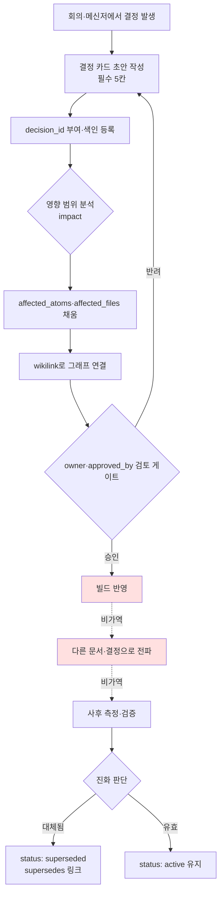

# 18.1 의사결정 추적 시스템

분기 회의 한복판이었다. 전투 디자이너가 "글로벌 쿨다운을 0.5초로 통일하자"고 제안했고, 모두 고개를 끄덕였다. 그런데 옆자리 시니어가 손을 들었다. "이거 작년 4분기에 0.3초로 결정했던 거랑 충돌하는 거 아닌가요? 그때 왜 0.3초로 갔었죠?" 회의실이 잠시 조용해졌다. 아무도 그 결정의 근거를 기억하지 못했다. 회의록을 뒤졌지만 "전투 TF에서 논의함" 한 줄만 있었다. 결국 30분을 작년 결정을 재구성하는 데 썼고, 그래도 "왜 0.3이었는지"는 끝내 못 찾았다.

결정은 만들기보다 추적이 어렵다. 1년에 수백 건이 쌓이면 어느 결정이 살아 있고 어느 것이 폐기됐는지, 어느 결정이 다른 결정을 전제로 깔고 있는지 사람 머리로는 따라잡지 못한다. 이 챕터는 결정을 atom으로 박제해 추적 가능한 자산으로 바꾸는 시스템을 다룬다. 핵심은 단순하다. 결정 한 건을 `decision_id`·`owner`·`rationale`을 갖춘 카드로 기록하고, 카드끼리 wikilink로 연결해 그래프를 만들고, 영향이 어디까지 번지는지를 grep으로 역추적한다.

## 18.1.1 결정 카드: atom으로의 박제

결정 추적의 최소 단위는 결정 카드다. 저자가 운영하는 프로젝트 A(MMORPG 개발)에서 실제로 쓰는 카드 한 장을 그대로 가져왔다. 앞서 회의에서 충돌한 바로 그 0.5초 통일 결정이다.

```yaml
---
decision_id: D2026_Q2_017
title: 전투 글로벌 쿨다운 0.5초 통일
type: system_change
status: active        # active / superseded / deprecated
created: 2026-04-18
owner: teammate_a      # 전투 디자이너, 결정 발의·소유자
approved_by: 이민수    # Design Director
approval_meeting: 95_BattleTF_2026-04-18

scope:
  - combat_system
  - all_active_skills

content: |
  모든 전투 액티브 스킬에 글로벌 쿨다운 0.5초 적용.
  회복 스킬은 예외 (별도 결정 D2026_Q2_018).

rationale:
  - 콤보 입력 가독성 문제 (사용자 피드백 누적)
  - 시뮬상 전투 평균 길이 증가 방향
  - 신규 사용자 학습 곡선 완만화

affected_atoms:
  - combat_global_cooldown_constant
  - combat_skill_cooldown_rule

affected_files:
  - CombatBalance.xlsx
  - CombatFormula_v3.md
  - UI/skill_cooldown_indicator

implementation:
  target_build: 2026-05-09
  impl_owner: teammate_b    # 코드 리드
  qa_owner: teammate_c      # QA 시니어

related_decisions:
  - supersedes: D2025_Q4_034   # 이전 0.3초 결정
  - relates_to: D2026_Q2_018   # 회복 예외
---
```

세 칸이 척추다. `decision_id`는 결정에 영구 주소를 준다. `owner`는 "누가 이 결정을 책임지는가"를 못박는다. `rationale`은 6개월 뒤 "왜 그랬지?"에 답한다. 회의에서 못 찾았던 그 "왜 0.3이었는가"가 바로 `D2025_Q4_034`의 `rationale` 칸에 있었어야 할 내용이다. 나머지 칸(`scope`·`affected_atoms`·`related_decisions`)은 영향 추적과 그래프 연결을 위한 배선이다.

여기서 한 가지 결정 설계가 들어간다. 12칸을 전부 강제하면 사람들이 카드 작성 자체를 회피한다. 그래서 필수 5칸(`decision_id`·`title`·`owner`·`status`·`rationale`)과 선택 7칸으로 나눈다. 회의에서 결정 직후 5칸만 채워도 카드는 살아 있고, 나머지는 구현 단계에서 채운다.

## 18.1.2 결정 추적의 전체 흐름

카드 한 장이 발생부터 폐기까지 어떤 경로를 도는지가 추적 시스템의 골격이다. 비가역 게이트가 어디 있는지에 주목하자.



초안 작성(B)부터 검토 게이트(G)까지는 전부 가역 단계다. 카드를 고치든 폐기하든 비용이 거의 없다. 그러나 빌드 반영(H) 이후는 실질 비가역이다. 사용자가 이미 체감한 변경은 핫픽스로 되돌려도 커뮤니티 인식에 흔적을 남기고, 후속 결정들이 이 결정을 전제로 누적되기 시작하면 되돌리기 비용이 기하급수로 커진다. 그래서 결정자의 모든 검토는 게이트 G에서 끝나야 한다. 이것은 5부에서 다룬 "녹음·캐스팅은 비가역 단계" 원칙과 정확히 같은 구조다.

## 18.1.3 결정 그래프: 카드를 잇다

카드를 atom으로 만들면 카드끼리 연결할 수 있다. `related_decisions`의 `supersedes`·`relates_to`가 그래프의 간선이 된다. 앞 회의의 충돌은 사실 이 그래프 한 조각이었다.

<svg viewBox="0 0 640 280" xmlns="http://www.w3.org/2000/svg" font-family="sans-serif" font-size="13">
  <defs>
    <marker id="arrow" markerWidth="10" markerHeight="10" refX="9" refY="3" orient="auto" markerUnits="strokeWidth">
      <path d="M0,0 L9,3 L0,6 Z" fill="#555"/>
    </marker>
  </defs>
  <!-- nodes -->
  <rect x="40" y="20" width="220" height="48" rx="6" fill="#eef2f8" stroke="#888"/>
  <text x="150" y="40" text-anchor="middle" fill="#333">D2025_Q4_034</text>
  <text x="150" y="58" text-anchor="middle" fill="#777" font-size="11">글로벌 쿨다운 0.3초 (deprecated)</text>

  <rect x="40" y="116" width="220" height="48" rx="6" fill="#dff0df" stroke="#5a5"/>
  <text x="150" y="136" text-anchor="middle" fill="#333">D2026_Q2_017</text>
  <text x="150" y="154" text-anchor="middle" fill="#777" font-size="11">글로벌 쿨다운 0.5초 (active)</text>

  <rect x="380" y="116" width="220" height="48" rx="6" fill="#dff0df" stroke="#5a5"/>
  <text x="490" y="136" text-anchor="middle" fill="#333">D2026_Q2_018</text>
  <text x="490" y="154" text-anchor="middle" fill="#777" font-size="11">회복 스킬 쿨다운 예외 (active)</text>

  <rect x="380" y="212" width="220" height="48" rx="6" fill="#fdf3df" stroke="#cb5"/>
  <text x="490" y="232" text-anchor="middle" fill="#333">D2026_Q2_025</text>
  <text x="490" y="250" text-anchor="middle" fill="#777" font-size="11">PvP 글로벌 쿨다운 변종 (active)</text>

  <!-- edges -->
  <line x1="150" y1="68" x2="150" y2="116" stroke="#555" marker-end="url(#arrow)"/>
  <text x="160" y="96" fill="#555" font-size="11">supersedes</text>

  <line x1="260" y1="140" x2="380" y2="140" stroke="#555" marker-end="url(#arrow)"/>
  <text x="285" y="132" fill="#555" font-size="11">relates_to</text>

  <line x1="490" y1="164" x2="490" y2="212" stroke="#555" marker-end="url(#arrow)"/>
  <text x="500" y="192" fill="#555" font-size="11">relates_to</text>
</svg>

이 그래프가 있었다면 회의는 30초로 끝났을 것이다. `D2026_Q2_017`을 열면 `supersedes: D2025_Q4_034`가 보이고, 그 카드의 `rationale`을 한 번 클릭하면 "왜 0.3이었는지"가 그대로 나온다. 그래프는 결정의 진화 이력이고, 결정의 진화 이력은 곧 게임의 역사다. PvP 변종(`D2026_Q2_025`)처럼 본 결정에서 파생된 분기까지 한눈에 추적된다.

## 18.1.4 영향 범위를 자동으로 추출하다 — impact

결정 카드의 `affected_atoms`·`affected_files`를 사람이 일일이 채우면 빠뜨린다. 프로젝트 A에는 `impact`라는 영향범위 추출 절차가 있다. 결정 atom을 받아 세 방향으로 그래프를 훑는다.

- **인바운드 엣지**: 이 atom을 참조하는 다른 atom들 (누가 나에게 의존하는가)
- **온톨로지 `affects` 링크**: 명시적으로 "영향을 준다"고 선언된 관계
- **wikilink 역참조**: `[[combat_global_cooldown_constant]]`를 본문에 인용한 모든 문서

세 경로의 합집합이 결정의 진짜 영향 범위다. 여기에 더해 `portal_layer_change_impact_check` atom이 "포털 레이어(외부 노출 문서·API 스펙)를 건드리는가"를 별도로 검사한다. 포털 레이어가 걸리면 등급이 한 단계 올라간다. 외부 전파는 되돌리기가 더 비싸기 때문이다.

## 18.1.5 워크드 트랜스크립트: 회의록에서 결정 카드까지

이론은 여기까지다. 실제로 LLM에게 회의록 한 덩어리를 던지고 결정 카드를 받는 전 과정을, 프롬프트 전문과 날것 출력까지 그대로 싣는다. 요약하지 않는다. Claude가 헷갈린 지점, 사람이 거부한 지점, 재요청까지 전부 보인다.

### 1차 프롬프트 (전문)

```
아래 회의록을 결정 카드 YAML로 바꿔줘. 스키마는
decision_id / title / type / status / owner / approved_by / scope /
content / rationale / affected_atoms / affected_files / related_decisions.
owner는 발의자, approved_by는 승인자. affected_atoms랑 related_decisions는
회의록에 실제로 나온 것만 쓰고 추측하지 마.
// (의도: decision_id는 D{YYYY}_Q{n}_{seq}, seq 모르면 XXX)

[회의록]
- 전투 글로벌 쿨다운을 0.5초로 통일하기로 함 (teammate_a 발의).
  현재 스킬마다 제각각인데 콤보 가독성이 나쁘다는 피드백 누적.
- 작년에 0.3초로 했던 건 너무 빨라서 콤보가 뭉개진다는 지적.
- 회복 스킬은 0.5초 적용하면 위기 대응이 안 됨. 예외 처리 필요.
- 디렉터(이민수) 승인. teammate_b가 구현, teammate_c가 QA.
- target build는 5월 9일.
```

### Claude 1차 출력 (날것 그대로)

```yaml
---
decision_id: D2026_Q2_XXX
title: 전투 글로벌 쿨다운 0.5초 통일
type: system_change
status: active
owner: teammate_a
approved_by: 이민수
approval_meeting: 95_BattleTF
scope:
  - combat_system
  - all_skills          # ← 회복 스킬 예외가 있는데 all_skills로 잡음
content: |
  모든 전투 스킬에 글로벌 쿨다운 0.5초 적용.
rationale:
  - 콤보 가독성 피드백 누적
  - 작년 0.3초가 너무 빨라 콤보 뭉개짐
affected_atoms:
  - combat_global_cooldown      # ← 실제 atom 이름과 다름. 추측한 것
affected_files: []              # ← 비워둠. 회의록에 명시 안 됨
implementation:
  target_build: 2026-05-09
  impl_owner: teammate_b
  qa_owner: teammate_c
related_decisions:
  - supersedes: D2025_Q4_XXX    # 작년 0.3초 결정. seq 모름
  - relates_to: 회복 스킬 예외 결정 (ID 미정)  # ← 링크 아닌 서술로 채움
---
```

거짓 없이 보면, 이 출력은 60점짜리다. 잘한 것과 틀린 것이 섞여 있다.

- **잘함**: `owner`/`approved_by` 구분 정확, `target_build`·구현자·QA 정확, `supersedes` 관계 포착.
- **틀림 ①**: `scope`에 `all_skills`를 넣었다. 회복 스킬 예외가 명시됐는데 전체로 잡았다.
- **틀림 ②**: `affected_atoms`에 `combat_global_cooldown`을 추측해 넣었다. 프로젝트 실제 atom명은 `combat_global_cooldown_constant`다. "추측하지 마라"는 지시를 어겼다.
- **틀림 ③**: `related_decisions`의 회복 예외를 링크가 아니라 자연어 서술로 채웠다.
- **애매함**: `affected_files: []`로 비웠다. 지시를 충실히 따른 것이지만, 영향 파일이 없을 리 없다.

### 사람의 검증·거부

저자는 이 카드를 그대로 받지 않았다. ①②③을 거부 사유로 적어 재요청했다. 거부의 핵심은 **atom명 추측**이다. atom ID가 한 글자라도 틀리면 뒤따르는 grep·역참조가 전부 빗나간다. 추적 시스템의 정확도는 atom ID의 정확도에 묶여 있다.

### 2차 프롬프트 (재요청, 전문)

```
세 군데 고쳐줘. scope는 회복 스킬이 예외니까 all_skills 말고
all_active_skills로 하고 회복 예외는 content에 적어. affected_atoms는
추측하지 말랬는데 추측했어 — atom 실명 모르면 [확인 필요]로 두고 뭘 확인할지
주석만 달아줘, 색인은 내가 볼게. related_decisions는 회복 예외를
D2026_Q2_018로 relates_to, supersedes는 D2025_Q4_034로. affected_files도
[확인 필요] 후보로만.
```

### Claude 2차 출력 (날것)

```yaml
affected_atoms:
  # [확인 필요] 아래는 후보. 색인에서 정확한 atom ID 확정 요망.
  - combat_global_cooldown_constant   # 글로벌 쿨다운 상수값
  - combat_skill_cooldown_rule        # 스킬별 쿨다운 규칙 (예외 처리 포함)
affected_files:
  # [확인 필요] 회의록에 없음. type=system_change 기준 통상 영향 후보:
  - CombatBalance.xlsx        # 쿨다운 수치 시트
  - CombatFormula_v3.md       # 전투 공식 문서
  - UI/skill_cooldown_indicator   # 쿨다운 UI 인디케이터
related_decisions:
  - supersedes: D2025_Q4_034
  - relates_to: D2026_Q2_018
scope:
  - combat_system
  - all_active_skills
content: |
  모든 전투 액티브 스킬에 글로벌 쿨다운 0.5초 적용.
  회복 스킬은 예외 (별도 결정 D2026_Q2_018).
```

2차는 정직해졌다. atom을 추측해 단정하는 대신 `[확인 필요]` 플래그를 달고 근거 주석을 붙였다. 저자는 atom 색인을 열어 `combat_global_cooldown_constant`·`combat_skill_cooldown_rule` 두 이름이 실재함을 확인하고 플래그를 떼었다. `affected_files` 후보 셋도 색인 대조 후 확정했다. 이 챕터 첫머리에 실린 최종 카드가 그 결과물이다.

이 트랜스크립트의 교훈은 하나다. **LLM은 결정 카드의 초안 작성자로 강력하지만, atom ID와 결정 ID의 최종 확정은 사람이 색인과 대조해야 한다.** AI는 후보를 탐색하고, 사람은 채택한다. 둘의 역할이 섞이면 틀린 atom명이 그래프 전체를 오염시킨다.

## 18.1.6 grep으로 영향을 역추적하다

카드와 그래프가 atom ID로 묶여 있으면, "이 결정이 어디에 영향을 주는가"는 grep 한 줄로 답이 나온다. 결정 `D2026_Q2_017`의 핵심 atom `combat_global_cooldown_constant`를 원고·시트·결정 카드 전체에서 역참조로 훑는다.

```
rg "combat_global_cooldown_constant" --type md --type yaml -l
# → D2026_Q2_017.yaml          (결정 카드 본인)
#   D2026_Q2_025.yaml          (PvP 변종 — 이 상수를 재인용)
#   CombatFormula_v3.md        (공식 문서)
#   95_BattleTF_2026-04-18.md  (회의록 원본)
```

이 결과가 곧 "이 상수를 바꾸면 네 곳이 흔들린다"는 영향 지도다. PvP 변종 카드가 같은 상수를 인용하고 있다는 사실은 사람 기억으로는 놓치기 쉽지만 grep은 놓치지 않는다. atom ID가 정확했기 때문에 가능한 일이다 — 1차 출력의 `combat_global_cooldown`으로 grep했다면 이 네 줄 중 하나도 안 잡혔을 것이다. 등급 분류(§18.2)와 전 사이클 워크플로(§18.3), grep 워크플로 정밀화(§18.4)는 모두 이 atom ID 정확성 위에 선다.

## 18.1.7 추적 시스템이 만드는 차이

저자의 프로젝트 A에서 추적 시스템 도입 전후를 비교한다. 아래 수치는 저자 추정(미검증)이며, 절대값보다 방향과 비율로 읽기를 권한다.

| 항목 | 시스템 부재 | 시스템 운영 | 방향 |
|---|---|---|---|
| "전에 결정했었나?" 재논의 | 분기당 8\~12건 | 분기당 0\~2건 | 대폭 감소 |
| 결정 영향 범위 파악 | 1\~2일 | grep으로 수 분 | 대폭 단축 |
| 결정 진화 이력 추적 | 시니어 기억 의존 | 그래프 자동 | 사람 의존 제거 |
| 신규 팀원 결정 이력 학습 | 1\~2개월 | 1\~2주 | 가장 큰 효과 |

가장 큰 효과는 마지막 줄이다. 신규 팀원이 "왜 이 게임이 지금 이 모양인가"를 시니어 붙잡고 묻는 대신 결정 그래프를 따라 스스로 읽어 내려간다. 결정 추적은 곧 회사의 의사결정 학습 자산이 된다. 다만 시스템이 처음 들어오는 분기는 카드 작성 부담이 분명히 있다. 필수 5칸부터 정착시키고 점진 확대하는 길이 안전하다.

## 18.1.8 보수에서 진보로 — 자동화는 atom 분해 위에 선다

지금까지의 운영은 보수적 적용이다. 사람이 회의에서 결정하고, 카드를 쓰고, 영향 atom을 식별하고, 자동은 색인·검색·grep·그래프 시각화만 맡는다. 사람이 핵심 판단을, 자동이 보관과 검색을 담당한다.

다음 단계는 위 트랜스크립트가 보여준 방향이다. 회의록 자연어를 입력으로 LLM이 결정 카드 12칸 초안을 채우고, 그래프를 따라 영향 atom 후보를 탐색하고, 등급까지 추천한다. 사람의 손에 남는 일은 "AI가 채운 카드와 atom명이 색인과 맞는지 검토"와 "최종 승인" 두 가지로 좁혀진다. 0에서 12칸을 채우는 부담과, LLM 초안의 atom명을 색인에서 확인하는 부담은 질이 다르다.

이 진보적 적용이 자리잡으려면 세 골격이 필요하다. 첫째, 모든 결정이 atom으로 등록되고 wikilink로 연결된 **결정 그래프**. 회의록 한 덩어리는 자동화의 입력이 못 된다 — 결정 단위로 분해돼야 한다. 둘째, 그래프 위에서 영향 분야 수·되돌리기 비용·사용자 영향 범위를 계산해 등급을 추천하는 **임팩트 등급 자동기**(§18.2). 셋째, atom ID와 wikilink로 정밀하게 작동하는 **grep·LLM 영향 추적**(§18.4).

여기서 책 전체를 관통하는 메시지가 한 번 더 드러난다. 결정을 atom·그래프·등급으로 분해하는 일은 "검색과 역참조의 편의"가 표면이고, 본질은 **분해되지 않은 회의록 한 덩어리에서는 자동 영향 분석이 무엇이 결정의 단위인지조차 알 수 없다**는 데 있다. 분해가 협업 언어 통일을 표면 목적으로, 절차적 자동화의 전제를 본질 목적으로 둔다는 일반 논제(§6.6)가 의사결정 영역에서 결정 그래프·atom·등급으로 나타난 것이다. 5부의 월드 BT(BehaviorTree, 행동 트리)·퀘스트 클라우드, 8부의 진보적 밸런싱과 같은 골격이다. 2010년대에도 이론은 가능했지만 회의록을 결정 atom으로 자동 분해하는 일이 막혀 있었고, 2023년 이후 LLM이 그 분해의 초안을 맡으면서 종이에만 있던 비전의 상당 부분이 실현 영역에 들어왔다.

## 핵심 메시지

- 결정을 `decision_id`·`owner`·`rationale`을 갖춘 카드로 박제해야 6개월 뒤 "왜 그랬지"에 답할 수 있다.
- atom ID 정확성이 추적의 생명선이다 — LLM은 카드 초안을, 사람은 atom명 확정을 맡는다.
- Layer 분해(결정 그래프)는 협업 언어 통일이 표면이고 자동 영향 분석의 전제가 본질이다.

> **게임 밖 적용.** 결정 카드는 게임이 아니라 모든 조직의 "왜 그때 그렇게 정했지"를 6개월 뒤에도 답하게 하는 장치입니다. 마케팅팀이 "지난 분기에 이 채널은 접기로 했었는데 왜였더라"를 회의록 한 줄에서 못 찾아 30분을 허비하는 일은, `decision_id`·`owner`·`rationale` 세 칸짜리 카드 한 장이면 사라집니다. 예를 들어 인사팀이 "재택 주 2일로 통일" 같은 정책을 정할 때, 그 한 장에 발의자·승인자·근거(생산성 데이터·직원 설문)와 대체된 이전 정책 ID를 적어 두면, 1년 뒤 정책 재검토 자리에서 과거의 판단 근거가 그대로 살아 있습니다.

## 따라하기

**웹 챗봇 최소 경로 (터미널 없이)** — 이 챕터의 핵심은 결정 카드 디렉터리나 grep이 아니라 "결정에 영구 주소(`decision_id`)·책임자(`owner`)·근거(`rationale`)를 박제하고, 새 결정 전에 과거 결정을 먼저 찾아본다"는 발상입니다. 그 발상은 CLI·atom 색인 없이 웹 챗봇(ChatGPT 또는 Claude 웹)만으로 재현됩니다. 아래 세 단계가 본류입니다.
1. 결정 한 건을 한 줄로 적습니다. `decisions.md`라는 일반 문서 한 장이면 됩니다. YAML도 스크립트도 필요 없습니다.
   ```
   - [D17] 글로벌 쿨다운 0.5초 통일 (owner: 나, 근거: 콤보 가독성, 대체: D08)
   ```
2. 회의록을 카드로 바꿀 때는 웹 챗봇에 아래를 붙입니다. 1차 프롬프트의 4개 제약을 그대로 옮긴 것입니다.
   ```
   아래 회의록의 결정을 표로 바꿔줘. 칸은
   decision_id / title / owner / rationale / 대체된 과거결정.
   owner를 특정 못 하면 [MISSING], atom·파일명 모르면 [확인 필요]로 두고
   추측은 하지 마.
   // (의도: decision_id는 D{연도}_{순번}, 순번 모르면 XXX)
   [회의록 본문]
   ```
3. 새 결정을 하기 전에 `decisions.md`를 문서 내 찾기(Ctrl+F)로 먼저 검색합니다 — "전에 결정했었나"라는 질문 하나는 이걸로 해결됩니다. 이것이 grep 역추적의 손버전입니다. atom 색인·YAML 카드·`rg` 워크플로는 결정이 수백 건 쌓여 한 문서로 검색이 버거워질 때 비로소 도입하면 됩니다.

**setup** (인프라 버전 — 위 최소 경로가 손에 익은 뒤) — 결정 카드 디렉터리와 색인 파일을 만드세요.

```
decisions/
  D2026_Q2_017.yaml
  _index.json        # by_status / by_scope / by_quarter 집계
```

**prompt** — 회의록 결정 안건을 LLM에 던질 때 위 1차 프롬프트의 4개 제약을 반드시 포함하세요. 특히 "atom명을 추측하지 말고 [확인 필요]로 두라"를 명시합니다.

**verify** — 산출된 카드의 `affected_atoms` 항목을 atom 색인과 대조해 실명 확인 후 플래그를 제거하세요. 그다음 핵심 atom으로 `rg "<atom_id>" -l`을 돌려 영향 파일이 카드의 `affected_files`와 일치하는지 교차 검증합니다.

### 1인 축소판

팀 인프라 없이 혼자 쓴다면, YAML 카드는 버리세요. 결정 한 건을 마크다운 한 줄로 씁니다.

```
- [D17] 글로벌 쿨다운 0.5초 통일 (owner: 나, 근거: 콤보 가독성, 대체: D08의 0.3초)
```

`decisions.md` 파일 하나에 이 한 줄들을 쌓고, 새 결정을 하기 전에 `rg "쿨다운" decisions.md`로 과거 결정을 먼저 검색하세요. 카드도 그래프도 도구도 없지만 "전에 결정했었나"라는 질문 하나는 해결됩니다. 추적 시스템의 90%는 이 한 줄 습관에서 시작합니다.
