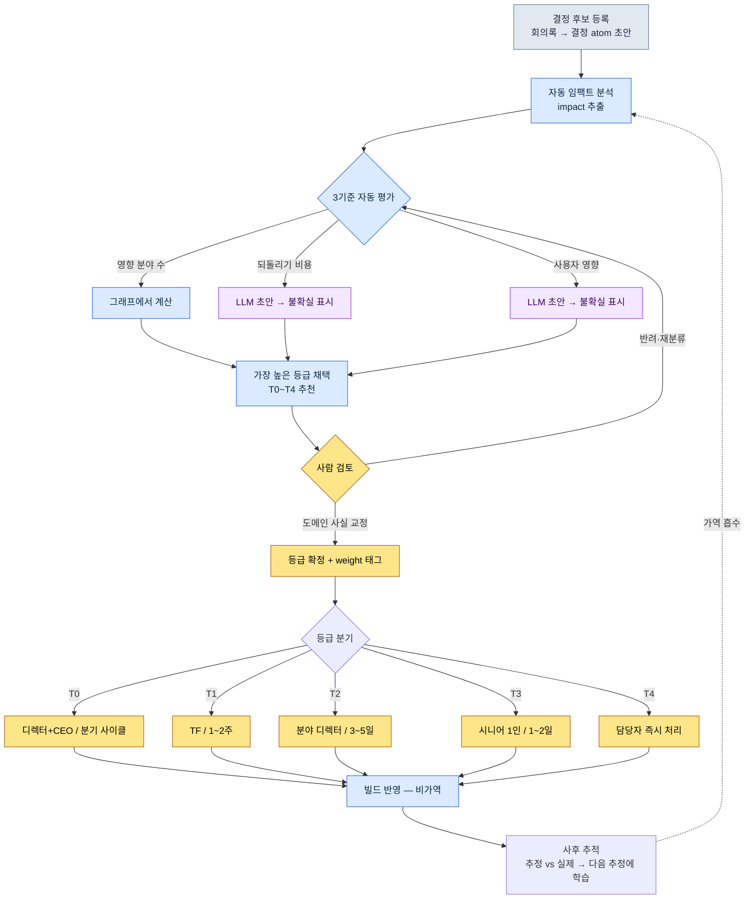
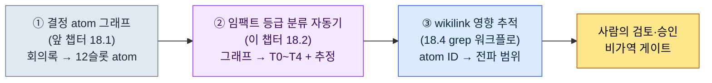

# 18.2 임팩트 전파·등급 분류

회의가 끝나고 회의록을 정리하던 중이었다. 한 줄짜리 결정이 적혀 있었다. "글로벌 쿨다운 0.5초로 통일." 회의에서는 30초도 안 걸려 합의됐다. 모두 고개를 끄덕였고, 다음 안건으로 넘어갔다.

그 한 줄이 그 다음 두 달을 잡아먹었다. 전투 데이터의 스킬 277개가 전부 영향을 받았고, UI의 쿨다운 게이지 연출이 다시 그려졌고, 밸런스 시트가 두 번 갈아엎혔다. 같은 회의록 안에 적힌 다른 결정 "튜토리얼 안내 문구 오탈자 수정"은 5분 만에 끝났다.

두 결정은 회의록 위에서 똑같이 한 줄이었다. 글자 수도 비슷했다. 그런데 한쪽은 5분, 한쪽은 두 달이었다. 이 차이를 회의록을 적는 그 순간에 보이게 만드는 것 — 그게 임팩트 등급 분류다. 등급이 보이지 않으면, 두 달짜리 결정이 5분짜리 결정과 같은 줄에 묻혀버린다.

이 챕터는 결정의 파급을 다섯 등급으로 자동 분류하고, 그 파급이 어디까지 번지는지를 결정 atom 그래프 위에서 추적하는 방법을 다룬다. 도구는 앞 챕터에서 쌓은 결정 atom과 `impact` 추출, 그리고 `portal_layer_change_impact_check` atom이다.

---

## 등급이 보이지 않으면 생기는 일

먼저 등급 분류가 없는 상태가 어떤 모습인지 짚는다. 결정이 전부 같은 줄에 놓이면 두 가지 사고가 번갈아 터진다.

하나는 **과소 처리**다. 글로벌 쿨다운 결정처럼 분기를 흔드는 결정이 "5분짜리"로 취급돼 검증 없이 빌드에 들어간다. 두 달 뒤에야 파급이 드러나고, 그때는 되돌리기 비용이 이미 산처럼 쌓여 있다.

다른 하나는 **과잉 처리**다. 오탈자 하나를 고치는데 TF를 소집하고 게임 디렉터의 결재를 받는다. 결정 사이클이 폭증하고, 정작 디렉터가 봐야 할 T0 결정에 쓸 시간이 오탈자 회의에 빨려 들어간다.

두 사고는 정반대처럼 보이지만 뿌리가 같다. **결정의 무게가 보이지 않는다.** 무게가 보이지 않으니 가벼운 것에 힘을 쓰고 무거운 것을 흘려보낸다. 등급 분류는 결정에 무게 라벨을 붙이는 작업이고, 라벨이 붙는 순간 처리 방식이 자동으로 갈라진다.

---

## 18.2.1 임팩트의 5등급 — T0부터 T4까지

저자가 운영하는 MMORPG 개발사 프로젝트 A에서는 결정의 임팩트를 다섯 등급으로 나눈다. 위로 갈수록 무겁고, 처리에 더 많은 사람과 시간이 든다.

| 등급 | 정의 | 예 | 결정자 | 사이클 |
|---|---|---|---|---|
| T0 | 게임 비전·핵심 시스템 | 모바일 우선 결정, 핵심 메카닉 변경 | 게임 디렉터 + CEO | 분기 |
| T1 | 시스템·다분야 | 글로벌 쿨다운 통일, 신규 직업 추가 | TF 의장 + 디렉터 | 1\~2주 |
| T2 | 분야·중간 | 특정 스킬 수치 조정, UI 컴포넌트 추가 | 분야 디렉터 | 3\~5일 |
| T3 | 단발·작은 | 단일 NPC 대사 수정, 색상 미세 조정 | 시니어 1인 | 1\~2일 |
| T4 | 즉시·핫픽스 | 버그 수정, 텍스트 오탈자 | 담당자 | 시간 단위 |

표만 보면 교과서처럼 깔끔하다. 그런데 실무의 난점은 표를 외우는 게 아니라 **눈앞의 결정 한 건을 어느 칸에 넣을지 판단하는 일**이다. "글로벌 쿨다운 통일"이 T1이라는 걸 회의가 끝난 뒤가 아니라 회의록을 적는 그 순간에 알아야 한다. 그래서 다음 절의 3기준이 핵심이다.

---

## 18.2.2 등급을 가르는 3기준

등급은 감으로 정하지 않는다. 세 가지 기준을 평가하고, 그중 가장 높은 등급을 채택한다.

<svg viewBox="0 0 720 300" xmlns="http://www.w3.org/2000/svg" font-family="sans-serif" font-size="13">
  <rect x="0" y="0" width="720" height="300" fill="#fafafa" stroke="#ddd"/>
  <text x="20" y="30" font-size="15" font-weight="bold">등급 결정 매트릭스 — 3기준 × 5등급</text>
  <!-- header row -->
  <rect x="20" y="50" width="160" height="40" fill="#2c3e50"/>
  <text x="30" y="75" fill="#fff" font-weight="bold">기준 \ 등급</text>
  <rect x="180" y="50" width="100" height="40" fill="#c0392b"/><text x="215" y="75" fill="#fff" font-weight="bold">T0</text>
  <rect x="280" y="50" width="100" height="40" fill="#e67e22"/><text x="315" y="75" fill="#fff" font-weight="bold">T1</text>
  <rect x="380" y="50" width="100" height="40" fill="#f1c40f"/><text x="415" y="75" font-weight="bold">T2</text>
  <rect x="480" y="50" width="100" height="40" fill="#2ecc71"/><text x="515" y="75" fill="#fff" font-weight="bold">T3</text>
  <rect x="580" y="50" width="120" height="40" fill="#95a5a6"/><text x="625" y="75" fill="#fff" font-weight="bold">T4</text>
  <!-- row 1: 영향 분야 수 -->
  <rect x="20" y="90" width="160" height="60" fill="#ecf0f1" stroke="#bbb"/><text x="30" y="125">영향 분야 수</text>
  <rect x="180" y="90" width="100" height="60" fill="#fff" stroke="#bbb"/><text x="220" y="125">5+</text>
  <rect x="280" y="90" width="100" height="60" fill="#fff" stroke="#bbb"/><text x="315" y="125">2~4</text>
  <rect x="380" y="90" width="100" height="60" fill="#fff" stroke="#bbb"/><text x="425" y="125">1</text>
  <rect x="480" y="90" width="100" height="60" fill="#fff" stroke="#bbb"/><text x="525" y="125">1</text>
  <rect x="580" y="90" width="120" height="60" fill="#fff" stroke="#bbb"/><text x="635" y="125">1</text>
  <!-- row 2: 되돌리기 비용 -->
  <rect x="20" y="150" width="160" height="60" fill="#ecf0f1" stroke="#bbb"/><text x="30" y="185">되돌리기 비용</text>
  <rect x="180" y="150" width="100" height="60" fill="#fff" stroke="#bbb"/><text x="200" y="185">매우 큼</text>
  <rect x="280" y="150" width="100" height="60" fill="#fff" stroke="#bbb"/><text x="315" y="185">큼</text>
  <rect x="380" y="150" width="100" height="60" fill="#fff" stroke="#bbb"/><text x="415" y="185">보통</text>
  <rect x="480" y="150" width="100" height="60" fill="#fff" stroke="#bbb"/><text x="515" y="185">작음</text>
  <rect x="580" y="150" width="120" height="60" fill="#fff" stroke="#bbb"/><text x="600" y="185">매우 작음</text>
  <!-- row 3: 사용자 영향 범위 -->
  <rect x="20" y="210" width="160" height="60" fill="#ecf0f1" stroke="#bbb"/><text x="30" y="245">사용자 영향 범위</text>
  <rect x="180" y="210" width="100" height="60" fill="#fff" stroke="#bbb"/><text x="215" y="245">전체</text>
  <rect x="280" y="210" width="100" height="60" fill="#fff" stroke="#bbb"/><text x="320" y="245">큼</text>
  <rect x="380" y="210" width="100" height="60" fill="#fff" stroke="#bbb"/><text x="415" y="245">보통</text>
  <rect x="480" y="210" width="100" height="60" fill="#fff" stroke="#bbb"/><text x="515" y="245">작음</text>
  <rect x="580" y="210" width="120" height="60" fill="#fff" stroke="#bbb"/><text x="600" y="245">매우 작음</text>
</svg>

세 기준 중 **영향 분야 수**는 결정 atom 그래프에서 기계적으로 셀 수 있다. 결정이 건드리는 atom이 어느 분야(전투·UI·데이터·내러티브 등)에 속하는지 태그를 모으면 끝이다.

문제는 나머지 둘이다. **되돌리기 비용**과 **사용자 영향 범위**는 그래프 위의 숫자로 환산되지 않는다. "이 결정을 두 달 뒤에 되돌리려면 얼마나 드는가"는 자연어 판단이다. 바로 이 지점이 2023년 이전까지 임팩트 자동 분류의 마지막 벽이었다. 영향 분야 수는 자동화됐지만, 자연어 판단 두 칸이 비어 있어서 결국 사람이 처음부터 다시 매겼다. LLM이 결정 atom의 본문을 읽고 이 두 칸의 초안을 채우게 되면서 벽이 낮아졌다.

여기서 정직하게 짚는다. LLM이 채우는 건 **초안**이지 확정이 아니다. 되돌리기 비용을 LLM이 "큼"으로 추정해도, 분야 디렉터가 "우리 시트 구조상 이건 보통"이라고 내릴 수 있다. 자동 분류는 사람의 판단을 대체하는 게 아니라 **사람이 빈 칸에서 시작하지 않게** 한다.

---

## 18.2.3 워크드 트랜스크립트 — 결정 한 건을 LLM에게 분류시키기

앞 챕터에서 만든 결정 atom 한 건을 그대로 LLM에 넣고 등급을 매기게 한 실제 과정이다. 요약하지 않고 전 과정을 옮긴다. 거부와 재요청까지 포함한다.

### 입력 — 결정 atom 원문

```yaml
# decisions/D2026_Q2_017.md (앞 챕터 18.1에서 등록한 atom)
id: D2026_Q2_017
title: 글로벌 쿨다운 0.5초 통일
date: 2026-04-18
proposer: teammate_a
decider: 이민수    # Design Director (18.1 approved_by와 동일)
context: 직업별 쿨다운 기준이 제각각이라 신규 직업 추가 시마다
         밸런스 재산정 비용이 누적됨. 0.5초 글로벌 기준으로 통일 제안.
affected_atoms: [combat_cooldown_rule, skill_table, ui_cooldown_gauge]
reversible: ?
status: proposed
```

### 프롬프트 전문

```
아래 결정 atom의 임팩트 등급을 T0~T4 중 하나로 매겨줘.
영향 분야 수 / 되돌리기 비용 / 사용자 영향 범위 세 기준을 따로 보고
그중 제일 높은 등급으로. 확신 안 서는 칸은 "불확실"이라고 적고
사람이 봐야 한다고 말해줘.
// (의도: T0=분야 5+·비용 매우 큼·전체, T1=2~4·큼·큼, T2=1·보통, T3=1·작음, T4=1·매우 작음)

[atom 원문 첨부]
```

### Claude 날것 출력 (편집 없음)

```
3기준 평가:

1. 영향 분야 수
   affected_atoms를 보면:
   - combat_cooldown_rule → 전투 분야
   - skill_table → 데이터 분야
   - ui_cooldown_gauge → UI 분야
   명시된 분야는 3개입니다.
   다만 "신규 직업 추가 시마다 밸런스 재산정"이라는 context를
   보면 밸런스 분야도 간접 영향을 받을 가능성이 높습니다.
   직접 3 + 간접 1 = 실질 2~4개 범위로 봅니다. → T1 신호

2. 되돌리기 비용
   글로벌 쿨다운을 통일했다가 되돌리려면 skill_table의
   모든 스킬 쿨다운을 직업별 기준으로 다시 분기시켜야 합니다.
   skill_table의 행 수를 모르므로 정확한 비용은 불확실하지만,
   "통일 → 분기 복원"은 일반적으로 비용이 큽니다. → 큼 (T1 신호)
   ※ 이 칸은 skill_table 규모를 모르면 확정 불가. 불확실 표시.

3. 사용자 영향 범위
   쿨다운은 모든 전투 상황에 적용되므로 거의 모든 사용자가
   체감합니다. → 큼 (T1 신호)

채택 등급: T1
근거: 3기준이 모두 T1을 가리킵니다. T0는 아닙니다 —
"핵심 메카닉 변경"까지는 아니고 기존 메카닉의 파라미터
통일이기 때문입니다.

사람 확인 필요:
- 되돌리기 비용 칸: skill_table 실제 행 수 확인 필요
- reversible 슬롯이 "?"로 비어 있음 → 이 분류는 reversible을
  "어려움"으로 채우는 것을 전제로 합니다.
```

### 사람의 검증·거부

여기서 그대로 받지 않았다. 출력의 1번 항목에 손이 갔다. LLM은 밸런스 분야를 "간접 영향"으로 봤지만, 프로젝트 A의 실제 구조에서는 쿨다운 통일이 밸런스 시트를 **직접** 갈아엎는다 — 신규 직업 밸런스 산정 공식 자체가 쿨다운 값을 입력으로 받기 때문이다. 그래서 밸런스는 간접이 아니라 직접 4번째 분야다. 영향 분야 수는 4개. 그래도 채택 등급 T1은 바뀌지 않는다.

또 하나, 되돌리기 비용 칸의 "불확실" 표시가 정확했다. `skill_table`은 실제로 스킬 277행이었고, 통일을 되돌리면 277행 전부의 쿨다운을 재분기해야 한다. 비용은 "큼"이 아니라 "매우 큼"에 가까웠다. 그래도 한 칸이 위로 올라간다고 채택 등급이 T0로 가지는 않는다 — 영향 분야 수와 사용자 영향이 T1 범위이므로 가장 높은 등급은 여전히 T1이다.

### 재요청

```
정정. affected_atoms에 balance_sheet 추가해줘 (밸런스 공식이 쿨다운 값을
입력으로 받아서 직접 영향이야). 그럼 영향 분야 4개고, skill_table은 277행이야.
이거 반영해서 reversible 채우고 최종 등급 확정해줘.
```

```
반영했습니다.

영향 분야: 전투·데이터·UI·밸런스 = 4개
되돌리기 비용: 매우 큼 (skill_table 277행 전부 재분기)
사용자 영향: 큼

reversible: 어려움 (실질 비가역에 가까움 — 277행 재분기는
빌드 1~2회 + 밸런스 재검증 분기를 요구)

최종 등급: T1
주의: 되돌리기 비용 칸 하나만 보면 T0 신호지만,
영향 분야 4개·사용자 영향 "큼"은 T1 범위입니다.
3기준 중 2기준이 T1을 가리키므로 T1이 맞습니다.
다만 이 결정은 "T1 중에서도 무거운 쪽"으로 표시해두는 걸
권합니다 — 되돌리기 비용이 T0급이기 때문입니다.
```

마지막 문장이 사람보다 신중했다. 등급은 T1이지만 되돌리기 비용은 T0급이라는 점을 "T1 중 무거운 쪽"으로 라벨링하자는 제안 — 이건 처음 프롬프트에 없던 판단이다. 받아들였다. 이 결정에는 `weight: heavy` 태그를 추가로 붙였고, 사후 추적 우선순위를 올렸다.

이 트랜스크립트가 보여주는 핵심은 하나다. **LLM은 분류의 초안과 이유를 만들고, 사람은 도메인 사실(밸런스가 직접 영향, 277행)로 교정한다.** 둘 중 하나만으로는 안 된다. 사람만 하면 빈 칸에서 시작해 느리고, LLM만 하면 277행을 모른 채 "큼"이라 쓴다.

---

## 18.2.4 임팩트 전파를 자동 추적하는 코드

등급이 정해지면 다음은 "어디까지 번지는가"다. 앞 챕터의 `impact` 추출 — 인바운드 엣지, 온톨로지의 `affects` 관계, wikilink 역참조 — 를 결정 atom에 적용한다.

```python
# impact_propagation.py — 결정 atom의 전파 범위 추적

def trace_impact(decision):
    # 1차: 결정이 직접 건드리는 atom·파일
    direct = decision.affected_atoms + decision.affected_files

    # 2차: 1차 atom을 wikilink로 역참조하는 atom (impact 인바운드 엣지)
    secondary = []
    for atom in direct:
        secondary.extend(find_inbound_refs(atom))   # [[atom]] 역참조
        secondary.extend(find_affects_edges(atom))   # 온톨로지 affects

    secondary = dedup(secondary) - set(direct)

    return {
        "direct": direct,
        "secondary": secondary,
        "affected_fields": determine_fields(direct + secondary),
        "estimated_hours": estimate_hours(direct, secondary),
    }
```

핵심은 `find_inbound_refs` — atom 그래프에서 해당 atom을 `[[...]]`로 가리키는 **들어오는** 화살표를 모으는 함수다. 결정 자신이 무엇을 건드리는지(나가는 화살표)는 atom에 적혀 있지만, 그 atom을 누가 의존하는지(들어오는 화살표)는 그래프 전체를 역으로 스캔해야 보인다. 두 달짜리 파급은 거의 항상 이 **인바운드 엣지** 쪽에 숨어 있다.

D2026_Q2_017에 이 추적을 돌린 결과를 정직하게 적는다. direct는 위에서 확정한 4개 atom. secondary는 `skill_table`을 역참조하는 atom들 — 스킬 설명 텍스트, 스킬 아이콘 매핑, 직업별 스킬 트리 등 — 이 줄줄이 딸려 나왔다. **숫자는 시점마다 다르므로 단정하지 않는다.** 추적이 잡아준 사실은 "secondary가 direct의 수십 배"라는 방향이고, 정확한 atom 수는 그래프 상태에 따라 달라진다. 방향만으로 충분하다 — secondary가 direct보다 한 자릿수 크면 그건 T1 신호이고, 사후 추적 대상이라는 뜻이다.

---

## 18.2.5 등급 분류는 어디에 끼워 넣는가 — mermaid

분류는 독립된 단계가 아니라 결정 흐름 한가운데에 게이트로 고정된다. 결정 후보가 등록되면 자동 분석이 등급을 추천하고, 사람이 검토·조정한 뒤에야 결정 회의로 넘어간다.



이 흐름에서 **비가역 단계는 단 하나, 빌드 반영(I)**이다. 그 앞은 전부 가역이다 — 등급을 잘못 추천해도 사람이 반려하면 되고, weight 태그도 떼면 된다. 빌드에 들어가고 다른 문서로 전파된 뒤에야 비가역이 된다. 그래서 게이트(F의 사람 검토)가 빌드 앞에 있는 것이다. 비가역 선을 넘기 전에 사람이 한 번 막는다.

마지막 점선 — 사후 추적(J)이 다음 결정의 자동 분석(B)으로 되돌아가는 화살표 — 이 시스템을 학습 사이클로 만든다. 비가역 단계에서 나온 실측 데이터(예: QA 시간이 추정보다 길었다)가 다음 결정의 가역 단계로 흡수된다.

---

## 18.2.6 사후 추적 — 추정과 실제의 간극을 학습으로

결정이 빌드에 들어가고 1주\~1개월 뒤, 추정과 실제를 맞대본다. D2026_Q2_017의 사후 추적 양식이다.

```
결정 D2026_Q2_017 사후 추적  (양식 예시 · 숫자는 가상 입력)
─────────────────────────────────
작업 시간 (추정 → 실제)
  코드:    16h → 22h  (+38%)
  데이터:   8h →  6h  (-25%)
  UI:       4h →  4h  (=)
  QA:       8h → 12h  (+50%)
  total:   36h → 44h  (+22%)

영향 atom (추정 → 실제)
  direct:    4 →  4   (정확)
  secondary: 추정 수십 → 실제 수십  (방향 일치, 정확 수치 비공개)

사고 발생: 0건
오차 패턴: QA가 매번 추정 초과 (이번 +50%)
다음 결정 적용: QA 추정에 +20% 마진 기본 적용
```

위 블록은 사후 추적이 **어떤 모양인지** 보여 주는 양식 예시다. 시간·퍼센트 값은 실제 프로젝트 데이터가 아니라 양식을 채운 가상 입력이니, 본인 프로젝트에서는 본인 숫자로 바꿔 채우면 된다 — 이 책의 약속 그대로, 우리는 구조를 보여 주고 숫자는 본인이 측정한다. 양식과 무관하게 진짜인 것은 하나다. **"QA가 추정을 매번 초과한다"는 오차의 방향**, 그리고 그 방향을 다음 결정에 되먹이는 절차. 그래서 다음 추정에 QA 마진(예: +20%)을 처음부터 붙이는 처방이 나온다.

사후 추적의 가치는 정확한 숫자를 맞히는 게 아니라 오차의 방향을 되먹이는 데 있다. 추정이 정확해질수록 등급 분류의 신뢰가 올라가고, 신뢰가 올라가면 위임이 가능해진다.

---

## 18.2.7 등급별 사고 패턴과 처방

각 등급에서 반복되는 사고는 다르다. 처방도 다르다.

| 등급 | 사고 패턴 | 처방 |
|---|---|---|
| T0 | 비전 모호 → 분기 내내 혼란 | 결정문에 비전 한 줄 명시 강제 |
| T1 | 분야 간 충돌 → 일정 지연 | TF에 전 영향 분야 대표 참석 |
| T2 | 인접 시스템 영향 누락 → 후속 결정 폭증 | secondary 추적 필수 |
| T3 | 작은 결정 누적 → 일관성 손상 | 분기 회고에서 T3 묶음 점검 |
| T4 | 검증 부족 → 재핫픽스 | 핫픽스도 최소 1인 리뷰 |

이 표의 처방들은 모두 앞 절들에서 나온 도구로 실행된다. T2의 "secondary 추적 필수"는 §18.2.4의 `find_inbound_refs`이고, T1의 "전 영향 분야 대표 참석"은 §18.2.4가 잡아낸 `affected_fields`로 누가 들어와야 하는지가 정해진다.

가장 비싼 사고는 표 어디에도 없다. **등급 자체를 틀리는 것**이다. T0를 시니어가 혼자 결정하면 비전이 손상되고, T4를 디렉터가 직접 처리하면 병목이 생긴다. 등급을 틀리면 그 아래 모든 처방이 엉뚱한 자리에서 작동한다. 그래서 §18.2.3의 사람 검토 게이트가 단순한 형식이 아니다.

---

## 18.2.8 측정 — 등급 운영의 효과

프로젝트 A에서 등급 분류 도입 전후를 비교한다. 아래 수치 중 절대값은 가공 예시이고, **방향(부등호)은 실제 경향**이다.

| 항목 | 등급 부재 | 등급 운영 |
|---|---|---|
| 결정 사이클 | 전부 1\~2주로 균일 | T0 분기 \~ T4 시간 단위로 분화 |
| 잘못 처리된 결정 | 분기당 다수 | 분기당 소수 |
| 디렉터의 주간 결정 부담 | 큼 (모든 결정이 디렉터로) | 작음 (T2\~T4 위임) |
| 핫픽스 사이클 | 1\~2일 | 4\~24시간 |
| 분기 회고 결정 분석 | 묶기 어려움 | 등급별 통계로 집계 |

표를 단정적 숫자 대신 방향으로 적은 이유는 3번 항목 하나로 설명된다. **디렉터의 시간 회수가 등급 분류의 가장 큰 효과다.** 등급이 없으면 오탈자부터 비전까지 모든 결정이 디렉터 한 사람으로 몰린다. 등급이 생기면 T2 이하가 분야 디렉터·시니어·담당자로 갈라지고, 디렉터는 T0·T1에 집중한다. 위임이 가능해진다는 건 곧 디렉터가 정말 무거운 결정에 쓸 시간을 되찾는다는 뜻이다.

---

## 18.2.9 진보적 적용 골격에서 이 챕터의 자리

앞 챕터에서 결정 atom 그래프를 만들었고, 이 챕터에서 그 그래프 위에 등급 분류 자동기를 얹었다. 둘은 따로 노는 도구가 아니라 한 골격의 연속된 자리다.



세 요소가 직렬이다. 그래프가 입력을 만들고(①), 분류기가 무게를 매기고(②), 영향 추적이 전파 범위를 펼친다(③). 이 챕터는 가운데 자리다.

세 요소가 모두 LLM 발전 이후에야 실현 영역에 들어왔다. 가장 늦게 풀린 벽이 ②의 자연어 평가 두 칸 — 되돌리기 비용과 사용자 영향 범위(§18.2.2의 "마지막 벽") — 이고, LLM이 그 초안을 채우면서 비로소 ①→②→③이 직렬로 돌기 시작했다.

가역·비가역의 정렬도 이 골격에 맞물린다. §18.2.5 흐름도대로 비가역 선은 빌드 반영 하나뿐이고, 빌드 반영 자체는 되돌릴 수 없지만 그 실측 결과는 다음 결정을 더 정확하게 만드는 가역적 학습으로 되돌아온다.

---

## 18.2.10 흔한 실패

| 패턴 | 처방 |
|---|---|
| 모든 결정을 같은 사이클로 처리 | 등급별 사이클 분화 |
| 등급 분류 없이 각자 자율 판단 | 3기준 분류 게이트 |
| 등급 무시 (T0를 시니어가 결정) | 결정자 표 강제 |
| 사전 영향도 평가 생략 | 자동 분석을 결정 회의 전 게이트로 |
| 자연어 칸을 LLM 출력 그대로 확정 | 사람이 도메인 사실로 교정 |
| 사후 추적 없이 결정 종료 | 1주\~1개월 추정 vs 실제 비교 |
| 추정 오차를 다음 결정에 미반영 | 오차 방향을 다음 추정 마진에 적용 |

---

> **게임 밖 적용.** 임팩트 등급은 "한 줄짜리 요청이 5분짜리인지 두 달짜리인지"를 미리 보이게 하는 라벨이라, 결정이 쏟아지는 어느 직장에서나 통합니다. 회사 위키 문구 한 줄 수정과 "전 부서 휴가 정책 변경"이 똑같이 '안건 1건'으로 들어와 같은 결재 라인을 타면, 가벼운 일은 과잉 처리되고 무거운 일은 검증 없이 흘러갑니다. 예를 들어 운영팀의 업무 요청을 받을 때 영향 부서 수·되돌리기 비용·고객 영향 범위 세 기준으로 T0\~T4를 붙여 두면, 담당자가 즉시 처리할 것과 팀장 결재가 필요한 것이 자동으로 갈라지고 관리자의 시간이 정말 무거운 결정으로 회수됩니다.

## 따라하기 — 결정 한 건을 등급 분류하기

**setup.** 앞 챕터에서 만든 결정 atom 한 건을 준비하세요. `affected_atoms` 슬롯이 채워져 있어야 합니다. 비어 있으면 영향 분야 수를 셀 수 없습니다.

**prompt.** §18.2.3의 프롬프트 전문을 그대로 쓰세요. 핵심 세 줄을 빠뜨리지 마세요 — (1) 3기준을 각각 평가하라, (2) 가장 높은 등급을 채택하라, (3) 확신 없는 칸은 "불확실"로 표시하고 사람 확인을 요청하라. 세 번째 줄이 없으면 LLM이 모르는 것까지 단정합니다.

**verify.** LLM 출력을 받으면 두 가지를 직접 확인하세요. 첫째, 영향 분야 수를 LLM이 셌더라도 atom 그래프에서 직접 다시 셉니다 — 간접 영향을 직접으로 잡거나 누락했을 수 있습니다(트랜스크립트의 밸런스 사례). 둘째, "불확실" 표시가 붙은 칸은 도메인 사실로 채웁니다(skill_table 277행 같은 실제 규모). 두 확인을 마친 뒤에야 등급을 확정하고 빌드 게이트로 넘기세요.

## 1인 축소판

팀도 TF도 없는 혼자 만드는 프로젝트라면 5등급은 과합니다. 3등급으로 줄이세요.

- **무거움**: 게임의 방향이나 여러 시스템을 바꾸는 결정. 자기 전에 자고 일어나서 다시 봅니다. 즉흥 결정 금지.
- **보통**: 한 시스템 안에서 닫히는 결정. 그 자리에서 처리하되 결정 atom 한 줄로 남깁니다.
- **즉시**: 오탈자·버그. 바로 고칩니다. 기록도 생략 가능합니다.

도구도 코드 한 줄 없이 시작하세요. 결정을 메모할 때 앞에 `[무거움]` `[보통]` `[즉시]` 태그만 붙입니다. 그것만으로도 "무거움" 태그가 붙은 결정 앞에서 한 번 더 멈추게 됩니다 — 등급 분류의 본질은 결국 무거운 결정 앞에서 멈추는 습관이고, 자동화는 그 멈춤을 팀 규모에서도 작동하게 만드는 장치일 뿐입니다.

---

### 이 챕터의 핵심 메시지
- 같은 한 줄짜리 결정도 임팩트 등급에 따라 5분과 두 달로 갈리고, 등급이 보이지 않으면 과소·과잉 처리가 번갈아 터진다
- 3기준 중 자연어 두 칸(되돌리기 비용·사용자 영향)이 자동화의 마지막 벽이었고 LLM이 초안을 채우며 낮아졌다
- 등급 분류의 가장 큰 효과는 디렉터의 시간 회수이고 위임을 가능하게 한다
