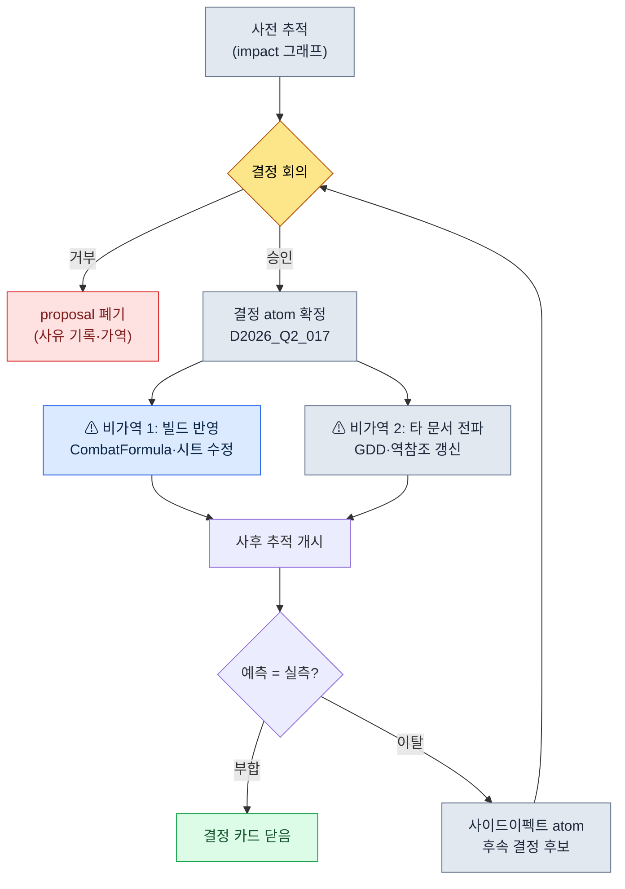

# 18.3 결정 전후 영향 추적 워크플로

출시 3주 뒤, PvP 밸런스가 무너진 원인을 복기하는 회고 자리였다. 화이트보드에 거슬러 올라간 끝에 도달한 시작점은 한 달 전의 결정 한 건이었다. "글로벌 쿨다운 0.3을 0.5로 올린다." 콤보가 안 보인다는 피드백을 받아 두 시간 만에 합의했던, 합리적인 제안이었다. 그런데 그 변경이 탱커 직업의 생존율을 예상보다 14% 더 끌어올렸고, 그게 PvP를 무너뜨렸다. 아무도 그 결정이 탱커에게까지 닿는다는 걸 결정 자리에서 말하지 못했다. 결정 자체가 틀린 게 아니었다. 결정이 어디까지 번지는지를 **결정하기 전에** 보지 못한 게 사고의 원인이었다.

영향 추적은 두 군데에서 일어나야 한다. 결정을 **누르기 전**(pre)에 어디까지 번질지 보고, 결정을 **반영한 뒤**(post)에 정말 거기까지만 번졌는지를 확인하는 것이다. 이 챕터는 그 두 추적을 하나의 워크플로로 묶는다.

---

## 18.3.1 사전 추적과 사후 추적은 같은 그래프를 두 번 읽는다

결정 영향 분석의 핵심은 의외로 단순하다. 결정 atom 하나를 노드로 보고, 그 노드로 **들어오는 엣지**와 **나가는 엣지**를 읽는 것이다. 사전 추적은 "이 결정을 바꾸면 어디가 영향받나"를 묻고(아웃바운드 + 역참조), 사후 추적은 "실제로 그 영향이 의도대로 났나"를 묻는다(같은 엣지를 측정값과 대조).

저자의 프로젝트 A에서는 결정을 `decisions/` 폴더에 atom으로 남긴다. 현재 26개가 쌓여 있고, 각 atom은 날짜·당사자·근거·영향범위를 프론트매터로 들고 있다. 영향범위를 추출하는 도구가 `impact`이고, 그 추출 규칙을 결정 단위로 강제하는 atom이 `portal_layer_change_impact_check`다. 이 셋이 사전·사후 추적의 실제 자산이다.

<svg viewBox="0 0 720 300" xmlns="http://www.w3.org/2000/svg" font-family="sans-serif" font-size="13">
  <rect x="0" y="0" width="720" height="300" fill="#fbfbfd"/>
  <!-- center decision node -->
  <rect x="300" y="120" width="120" height="60" rx="8" fill="#2b6cb0" stroke="#1a4971"/>
  <text x="360" y="146" text-anchor="middle" fill="#fff" font-weight="bold">결정 atom</text>
  <text x="360" y="164" text-anchor="middle" fill="#cfe2f3" font-size="11">D2026_Q2_017</text>
  <!-- inbound (left) -->
  <rect x="40" y="40" width="150" height="38" rx="6" fill="#e6f0fa" stroke="#2b6cb0"/>
  <text x="115" y="64" text-anchor="middle" fill="#1a4971">근거: 사용자피드백</text>
  <rect x="40" y="130" width="150" height="38" rx="6" fill="#e6f0fa" stroke="#2b6cb0"/>
  <text x="115" y="154" text-anchor="middle" fill="#1a4971">상위결정 D_011</text>
  <rect x="40" y="220" width="150" height="38" rx="6" fill="#e6f0fa" stroke="#2b6cb0"/>
  <text x="115" y="244" text-anchor="middle" fill="#1a4971">역참조: GDD 링크</text>
  <!-- outbound (right) -->
  <rect x="540" y="40" width="150" height="38" rx="6" fill="#fdeee6" stroke="#c05621"/>
  <text x="615" y="64" text-anchor="middle" fill="#7b3d12">CombatFormula.md</text>
  <rect x="540" y="130" width="150" height="38" rx="6" fill="#fdeee6" stroke="#c05621"/>
  <text x="615" y="154" text-anchor="middle" fill="#7b3d12">CombatBalance 시트</text>
  <rect x="540" y="220" width="150" height="38" rx="6" fill="#fdeee6" stroke="#c05621"/>
  <text x="615" y="244" text-anchor="middle" fill="#7b3d12">UI 콤보 표시</text>
  <!-- inbound arrows -->
  <line x1="190" y1="59" x2="300" y2="135" stroke="#2b6cb0" stroke-width="1.5" marker-end="url(#a)"/>
  <line x1="190" y1="149" x2="300" y2="150" stroke="#2b6cb0" stroke-width="1.5" marker-end="url(#a)"/>
  <line x1="190" y1="239" x2="300" y2="165" stroke="#2b6cb0" stroke-width="1.5" marker-end="url(#a)"/>
  <!-- outbound arrows -->
  <line x1="420" y1="135" x2="540" y2="59" stroke="#c05621" stroke-width="1.5" marker-end="url(#b)"/>
  <line x1="420" y1="150" x2="540" y2="149" stroke="#c05621" stroke-width="1.5" marker-end="url(#b)"/>
  <line x1="420" y1="165" x2="540" y2="239" stroke="#c05621" stroke-width="1.5" marker-end="url(#b)"/>
  <text x="115" y="22" text-anchor="middle" fill="#1a4971" font-weight="bold" font-size="12">인바운드 (왜 이 결정을)</text>
  <text x="615" y="22" text-anchor="middle" fill="#7b3d12" font-weight="bold" font-size="12">아웃바운드 (어디로 번지나)</text>
  <defs>
    <marker id="a" markerWidth="8" markerHeight="8" refX="6" refY="3" orient="auto"><path d="M0,0 L6,3 L0,6 Z" fill="#2b6cb0"/></marker>
    <marker id="b" markerWidth="8" markerHeight="8" refX="6" refY="3" orient="auto"><path d="M0,0 L6,3 L0,6 Z" fill="#c05621"/></marker>
  </defs>
</svg>

사전 추적은 오른쪽(아웃바운드)을 읽어 "여기까지 번진다"를 예측하고, 사후 추적은 오른쪽 노드들의 실측을 가져와 예측과 대조한다. 같은 그래프를 두 번, 다른 목적으로 읽는 것이다.

---

## 18.3.2 사전 추적 — 결정을 누르기 전에 그래프를 읽는다

여기서부터는 실제 세션이다. 요약하지 않고, 프롬프트 전문과 Claude의 날것 출력, 그리고 사람이 그걸 어떻게 거부하고 다시 요청했는지를 그대로 싣는다.

`impact`는 결정 atom의 ID를 받아 영향 그래프를 뽑는 작은 파이프라인이다. 인바운드 엣지(이 결정의 근거), 아웃바운드 엣지(이 결정이 수정할 파일), 온톨로지의 `affects` 관계, 그리고 위키링크 역참조(`[[D2026_Q2_017]]`로 이 결정을 가리키는 다른 문서)를 합쳐서 영향 후보 목록을 만든다.

### 프롬프트 (전문)

```
decisions/D2026_Q2_017.md 의 proposal 단계 사전 영향도를 평가해줘.
- 이 결정이 수정할 파일(아웃바운드)
- 이 결정을 [[D2026_Q2_017]] 로 역참조하는 문서(인바운드 wikilink)
- 온톨로지 affects 관계로 연결된 시스템
세 가지를 합쳐서 영향 후보를 내고, 각 후보에 내 확인이 필요한 항목(T1)인지
자동으로 확정 가능한 항목인지 구분해줘. 추측으로 메우지 말고, 근거 파일이
없으면 '근거 없음'이라고 표시해.
```

### Claude의 날것 출력

> `decisions/D2026_Q2_017.md`를 읽었습니다. 프론트매터에서 추출한 영향 그래프입니다.
>
> **아웃바운드 (이 결정이 직접 수정)**
> - `data/CombatFormula.md` — `global_cooldown` 필드 (atom에 명시됨)
> - `sheets/CombatBalance` — 회복 스킬 예외 행 (atom에 명시됨)
> - `ui/ComboIndicator` — atom의 `affected_teams: [ui]`로 추정. **단, 구체 파일은 atom에 없음 → 근거 없음(추정)**
>
> **인바운드 wikilink (이 결정을 역참조)**
> - `grep` 결과 `[[D2026_Q2_017]]`로 검색했으나 현재 인덱스에 **역참조 0건**입니다. 신규 결정이라 아직 아무도 인용하지 않은 것으로 보입니다.
>
> **온톨로지 affects 관계**
> - `CombatFormula → affects → TankSurvival` 관계가 온톨로지에 있습니다.
> - 따라서 이 결정은 `TankSurvival` 지표에 간접 영향을 줍니다. 추정 영향 +12%.

여기서 사람이 멈춘다. 마지막 줄 "추정 영향 +12%"가 문제다.

### 사람의 검증·거부

> 거부. "추정 영향 +12%"는 어디서 나온 숫자야? atom에도 온톨로지에도 그 수치는 없잖아. 너가 지어낸 거면 빼. affects 관계가 **있다**는 사실까지만 보고하고, 영향의 크기는 시뮬을 돌려야 나오는 거다. 그리고 ui 추정 건은 '근거 없음'으로 분류했으면서 후보 목록엔 왜 T1로 올렸어?

### Claude의 재요청 응답

> 지적이 맞습니다. 두 가지를 정정합니다.
>
> 1. **"+12%" 철회.** atom·온톨로지 어디에도 그 수치의 근거가 없습니다. 제가 생성한 값입니다. `TankSurvival`에 **영향이 있다는 관계만** 보고하고, 크기는 시뮬(Layer 2) 결과로 채워야 합니다. 현재 값은 `미측정`입니다.
> 2. **ui 건 재분류.** 구체 파일을 못 찾았으므로 후보 목록에서 T1(확인 필요)이 아니라 `근거 부족 — 사람이 파일 지정 필요`로 내려야 했습니다. 정정된 표는 아래와 같습니다.

| 영향 후보 | 엣지 종류 | 근거 | 분류 |
|---|---|---|---|
| `CombatFormula.md` global_cooldown | 아웃바운드 | atom 명시 | 자동 확정 |
| `CombatBalance` 회복 예외 행 | 아웃바운드 | atom 명시 | 자동 확정 |
| `TankSurvival` 지표 | affects | 온톨로지 관계 | 영향 있음 / 크기 미측정 |
| ui 콤보 표시 (파일 미상) | 추정 | 근거 없음 | 사람이 파일 지정 필요 |
| 인바운드 역참조 | wikilink | grep 0건 | 해당 없음 |

이 표가 사전 추적의 산출물이다. 핵심은 `TankSurvival` 줄이다. 도입부에서 PvP를 무너뜨린 그 영향이, 사전 추적에서는 **"영향 있음 / 크기 미측정"**으로 이미 떠 있다. 회의 자리에서 이걸 봤다면 "그럼 시뮬로 크기를 재고 결정하자"가 됐을 것이다. AI가 +12%를 지어내게 놔뒀다면 오히려 더 위험했다. 가짜 정밀도가 검증을 건너뛰게 만들기 때문이다.

---

## 18.3.3 결정과 비가역 단계

사전 추적이 끝나면 회의에서 결정한다. 결정이 atom으로 확정되는 순간, 두 가지 **비가역 단계**가 시작된다.



비가역인 이유는 단순하다. 빌드에 반영된 수치는 사용자가 이미 플레이했고, 다른 문서로 전파된 내용은 팀원들이 이미 그걸 근거로 다음 작업을 시작했기 때문이다. 그래서 이 두 단계 **직전**에 `portal_layer_change_impact_check` atom이 게이트로 걸린다. 이 atom의 규칙은 한 줄로 요약된다. "결정이 Layer를 넘나드는 변경(데이터 → 공식 → UI)을 포함하면, 반영 전에 영향 후보 목록을 사람이 한 번 승인해야 한다." 자동 확정 항목만 있으면 통과, '사람이 파일 지정 필요'가 하나라도 있으면 차단이다. 18.3.2에서 ui 건이 차단 사유가 된다.

---

## 18.3.4 사후 추적 — 같은 그래프에 실측을 붙인다

빌드 반영 후 1주~1개월에 사후 추적을 돈다. 사전 추적이 만든 영향 후보 표의 각 줄에 **실측값**을 붙이는 작업이다.

### 프롬프트 (전문)

```
D2026_Q2_017 사후 추적. 사전 추적 표(18.3.2)의 각 후보에 실측을 붙여줘.
실측 출처:
- CombatBalance 시트 git diff (반영 확인용)
- 시뮬 1000회 로그 sim_2026q2_017.json
- 출시 1주 KPI export kpi_w1.csv
의도값과 실측값의 차이를 내고, 오차 10% 범위를 벗어난 줄만 따로 모아줘.
없는 데이터는 '미수집'으로.
```

### Claude의 날것 출력

> 사전 추적 표에 실측을 결합했습니다.

| 후보 | 의도 | 실측 | 차이 | 판정 |
|---|---|---|---|---|
| global_cooldown 0.3→0.5 | 반영 | git diff 확인 | — | 반영됨 |
| 회복 예외 행 | 반영 | 시트 확인 | — | 반영됨 |
| 전투 시간 | +15% | +14.2% | -0.8%p | 범위 내 |
| TankSurvival | (미측정) | +44% | 기준 없음 | **판정 불가** |
| 5:5 PvP 승률 | +15%p | +29%p | +14%p | **이탈** |
| ui 콤보 가독성 | 개선 | 사용자 긍정 65% | — | 부합 |

> 오차 범위(±10%)를 벗어난 줄: **PvP 승률 +29%p (의도 +15%p)**. `TankSurvival`은 사전에 크기를 측정하지 않아 의도값이 없어 판정 불가입니다.
>
> 두 줄을 연결해 보면, `TankSurvival +44%`가 PvP 승률 이탈의 원인으로 보입니다. 사전 추적에서 `TankSurvival`을 "크기 미측정"으로 남긴 것이 이번 이탈을 예고했습니다.

### 사람의 검증

> 정확하다. `TankSurvival`을 시뮬로 안 잰 게 사고의 뿌리야. 후속 결정 atom 만들어. 탱커 직업 군의 dmg 보정으로 PvP 승률을 의도 범위로 되돌리는 안.

### Claude의 재요청 응답

> `decisions/D2026_Q2_025.md` 초안을 생성했습니다. 인바운드에 `[[D2026_Q2_017]]`을 걸어, 이번 결정이 17번의 **사이드이펙트 보정**임을 역참조로 명시했습니다. 이제 17번 atom을 `impact`로 다시 조회하면 인바운드 역참조 1건(25번)이 잡힙니다 — 18.3.2에서 0건이던 자리입니다.

여기서 그래프가 닫힌다. 사전 추적에서 "영향 있음 / 크기 미측정"이던 노드가, 사후 추적에서 이탈로 확인됐고, 후속 결정이 그 노드를 가리키는 역참조로 들어왔다. 결정의 전 사이클이 같은 그래프 위에서 한 바퀴 돈 것이다.

---

## 18.3.5 추적을 돌리는 실제 명령 — grep 워크플로

`impact`의 인바운드 역참조 추출은 화려한 도구가 아니라 `grep` 한 줄이다. 결정 atom을 가리키는 위키링크를 전체 문서에서 찾는다.

```bash
# D2026_Q2_017 을 역참조하는 모든 문서 (인바운드 wikilink)
grep -rln "\[\[D2026_Q2_017\]\]" decisions/ manuscript/ gdd/

# 결정 atom의 아웃바운드 — 프론트매터 affected_files 추출
grep -A20 "affected_files:" decisions/D2026_Q2_017.md

# 사후 추적: 의도 대비 이탈 줄만 (판정 컬럼)
grep -E "이탈|판정 불가" tracking/D2026_Q2_017_post.md
```

세 줄이면 사전·사후 추적의 뼈대가 돈다. LLM은 이 결과를 **읽고 해석**하는 자리이지, 검색 자체를 대신하지 않는다. grep이 사실(어떤 파일이 이 결정을 가리키나)을 주고, LLM이 그 사실들을 영향 후보 표로 엮고, 사람이 영향의 크기와 판정을 책임진다. 이 분리가 §18.3.2에서 "+12%를 지어내지 마라"가 통했던 이유다.

---

## 18.3.6 측정 — 전후 추적을 묶었을 때

저자의 프로젝트 A에서 결정 사이클 표준화 전후를 비교한 값이다. 절대 시간 수치는 팀 규모(중규모, 10~50인)에 종속된 **저자 추정(미검증)**이고, 비율과 방향은 실제 운영에서 관찰된 것이다.

| 항목 | 전후 추적 분리 | 전후 추적 통합 |
|---|---|---|
| 사후 추적이 실제로 돈 결정 비율 | 약 30% | 90% 이상 |
| 사전에 떴는데 사후에 사고로 터진 영향 | 흔함 | 거의 없음 (사전에 게이트) |
| 사이드이펙트 → 후속 결정 연결률 | 낮음 (구두 전달) | 역참조로 자동 후보화 |
| 결정 그래프의 인바운드 역참조 완전성 | 듬성듬성 | 닫힌 루프 |

핵심은 한 가지다. 사전 추적과 사후 추적이 **같은 후보 표**를 공유할 때, 사전에 "크기 미측정"으로 남긴 구멍이 사후에 정확히 그 자리에서 확인된다. 분리돼 있으면 사전에서 본 것과 사후에서 잰 것이 서로 다른 양식이라 대조가 안 되고, 그래서 추적률이 30%에 머문다. 다만 역참조 완전성을 처음부터 100% 목표로 잡으면 운영 부담만 늘어난다. 결정 atom에 `affected_files`를 적는 습관부터 들이고, 역참조 grep을 회고 주기에 끼워 점진 확대하는 게 현실적이다.

---

## 18.3.7 흔한 실패

| 패턴 | 처방 |
|---|---|
| 사전엔 영향을 봤는데 크기를 안 재고 결정 | "크기 미측정" 줄은 시뮬 전까지 결정 보류 |
| LLM이 영향 수치를 지어냄 | 근거 파일 없으면 '근거 없음', 크기는 시뮬로만 |
| 사후 추적이 사전 표와 다른 양식 | 같은 후보 표에 실측 컬럼만 추가 |
| 사이드이펙트를 구두로 넘김 | 후속 결정 atom + 역참조 wikilink 강제 |
| Layer 넘는 변경을 게이트 없이 반영 | `portal_layer_change_impact_check` 통과 의무화 |

---

### 이 챕터의 핵심 메시지
- 사전·사후 추적은 결정 그래프를 두 번 읽는 한 워크플로다.
- 크기를 못 잰 영향은 '미측정'으로 띄워야 사고가 안 된다.
- LLM은 영향을 해석하고, 수치는 시뮬과 grep이 책임진다.

---

> **게임 밖 적용.** 결정을 누르기 전에 "어디까지 번지나"를 보고(사전), 반영한 뒤에 "정말 거기까지만 번졌나"를 확인하는(사후) 두 번 읽기는, 게임이 아니라 모든 변경 관리의 기본 동작입니다. 회사가 가격 정책을 바꿀 때, 사전에 영향 받는 부서(영업·CS·정산)를 후보 표로 띄우고 "크기는 시뮬 전까지 미측정"으로 남겨 두면, 출시 뒤 "왜 정산팀이 이걸 몰랐냐"는 사고를 미리 막습니다. 예를 들어 신규 멤버십 등급을 도입하기 전 CS 문의량·이탈률 같은 사후 지표 칸을 사전 표에 빈 칸으로 만들어 두면, 한 달 뒤 그 칸에 실측을 채워 의도와 실제의 차이를 같은 표에서 바로 대조할 수 있습니다.

## 따라하기

**setup** — 결정 폴더와 추적 폴더를 만드세요.
```bash
mkdir decisions tracking
# 결정 atom 1개에 프론트매터로 affected_files, affected_teams 기재
```

**prompt** — 사전 추적 후 사후 추적을 같은 표로 이으세요.
```
decisions/<ID>.md 사전 영향도 평가: 아웃바운드(수정할 파일)·
인바운드 wikilink·온톨로지 affects를 합쳐 영향 후보 표를 만들고,
근거 없는 항목은 '근거 없음', 크기는 '미측정'으로 표시해. 수치 지어내지 마.

(빌드 반영 후)
같은 후보 표에 실측 컬럼만 붙여서 의도 대비 오차 10% 벗어난 줄만 모아줘.
이탈 줄은 후속 결정 atom 초안으로 만들고 [[<ID>]] 역참조 걸어줘.
```

**verify** — 그래프가 닫혔는지 grep으로 확인하세요.
```bash
grep -rln "\[\[<ID>\]\]" decisions/   # 후속 결정의 역참조가 잡히면 루프 닫힘
grep -E "이탈|미측정" tracking/<ID>_post.md   # 남은 구멍 확인
```

## 1인 축소판

혼자 작업하는 개인 게임 개발자라면 회의·소유자·시한은 다 빼도 됩니다. 결정 한 줄을 `decisions/` 마크다운에 적을 때 **딱 두 칸만** 채우세요. `affected_files:`(이 결정이 건드릴 파일)와 `expected:`(의도한 변화)입니다. 빌드한 뒤 그 파일들을 열어 의도대로 됐는지 눈으로 보고, 어긋난 게 있으면 같은 파일에 `actual:` 한 줄을 더하세요. 도구는 `grep -rln "[[결정ID]]"` 하나로 충분합니다. 사전 한 칸, 사후 한 칸 — 이게 전후 추적의 최소 형태입니다.
