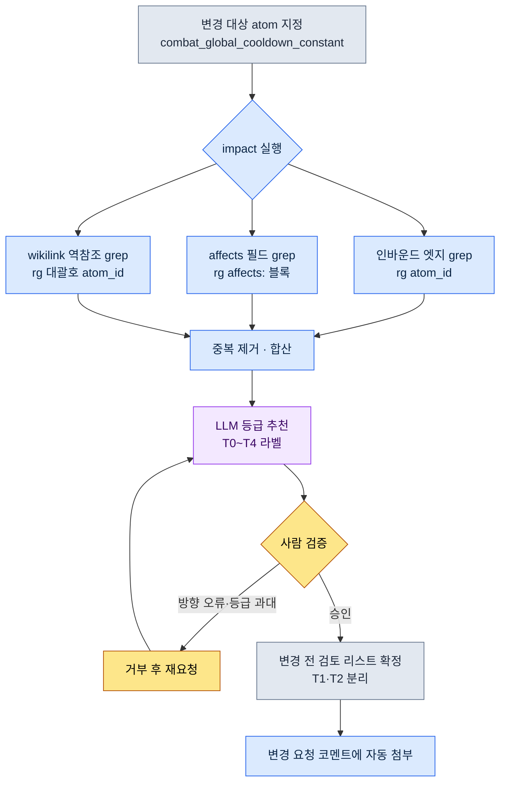

# 18.4 문서 영향도 grep 워크플로 — impact로 영향 범위를 뽑는다

월요일 오전 10시. 전투 담당 팀원 A가 팀 메신저에 한 줄을 던졌다. "전역 쿨다운 0.5초에서 0.4초로 내려도 될까요?" 숫자 하나 바꾸는 일이다. 표면적으로는. 나는 그 줄을 읽고 손이 멈췄다. 이 숫자가 입력된 문서가 몇 개인지, 이 상수를 전제로 짜인 스킬 밸런스 atom이 몇 개인지, 그걸 바꾸면 어떤 시트의 수식이 깨지는지 — 머릿속에 떠오르지 않았기 때문이다. 떠올랐다고 착각하면 그게 사고다. 분기마다 8건에서 12건씩 터지던 "그 문서를 못 봤다"는 누락의 정체가 바로 이 착각이었다.

그래서 나는 답을 외우지 않기로 했다. 대신 한 줄을 친다.

```
impact combat_global_cooldown_constant
```

이 챕터는 그 한 줄이 무엇을 뱉어내는지, 날것 그대로 본다. 영향 범위를 추출한다는 게 추상적인 말이 아니라, 인바운드 엣지·온톨로지 affects·wikilink 역참조라는 세 갈래를 grep으로 긁어모으는 구체적 동작이라는 걸 보여준다.

---

## 18.4.1 영향 범위는 세 갈래로 들어온다

"이 atom을 바꾸면 무엇이 영향받는가"라는 질문은 사실 세 개의 질문이다. 셋을 섞으면 답이 흐려지고, 셋을 분리하면 grep 한 줄씩으로 떨어진다.

첫째, **인바운드 엣지(inbound edge)** — 누가 나를 가리키는가. atom A가 atom B를 참조하면 A→B 방향의 엣지다. B를 바꿀 때 위험한 건 B를 가리키는 A들, 즉 B로 들어오는 화살표다. 그래서 아웃바운드(내가 누구를 보는가)가 아니라 인바운드를 본다. 변경의 충격파는 화살표를 거슬러 올라간다.

둘째, **온톨로지 affects** — 의미상 무엇에 영향을 주는가. atom의 frontmatter에 명시한 `affects:` 필드다. 이름이 직접 등장하지 않아도, 설계자가 "이건 저기에 영향 준다"고 선언해둔 의미적 연결이다. grep으로는 못 잡는 별칭·동의어 문제를 사람이 미리 입력해둔 것이다.

셋째, **wikilink 역참조** — `[[atom_id]]` 형식으로 나를 명시적으로 링크한 문서. 가장 신뢰도가 높다. 우연한 단어 일치가 아니라 작성자가 의도적으로 건 링크이기 때문이다.

세 갈래의 관계를 도식으로 보면 이렇다.

<svg viewBox="0 0 640 300" xmlns="http://www.w3.org/2000/svg" font-family="sans-serif" font-size="13">
  <rect x="250" y="125" width="140" height="50" rx="8" fill="#2d3142" />
  <text x="320" y="148" fill="#ffffff" text-anchor="middle" font-weight="bold">combat_global</text>
  <text x="320" y="165" fill="#ffffff" text-anchor="middle" font-weight="bold">_cooldown_constant</text>

  <rect x="20" y="20" width="170" height="44" rx="6" fill="#e8eaf0" stroke="#5b6178" />
  <text x="105" y="40" text-anchor="middle" font-weight="bold">인바운드 엣지</text>
  <text x="105" y="56" text-anchor="middle" font-size="11">누가 나를 참조하는가</text>

  <rect x="20" y="128" width="170" height="44" rx="6" fill="#e8eaf0" stroke="#5b6178" />
  <text x="105" y="148" text-anchor="middle" font-weight="bold">온톨로지 affects</text>
  <text x="105" y="164" text-anchor="middle" font-size="11">affects: 필드 선언</text>

  <rect x="20" y="236" width="170" height="44" rx="6" fill="#e8eaf0" stroke="#5b6178" />
  <text x="105" y="256" text-anchor="middle" font-weight="bold">wikilink 역참조</text>
  <text x="105" y="272" text-anchor="middle" font-size="11">[[atom_id]] 명시 링크</text>

  <line x1="190" y1="42" x2="252" y2="135" stroke="#5b6178" stroke-width="2" marker-end="url(#arr)" />
  <line x1="190" y1="150" x2="248" y2="150" stroke="#5b6178" stroke-width="2" marker-end="url(#arr)" />
  <line x1="190" y1="258" x2="252" y2="165" stroke="#5b6178" stroke-width="2" marker-end="url(#arr)" />

  <rect x="450" y="125" width="170" height="50" rx="8" fill="#3d5a3d" />
  <text x="535" y="148" fill="#ffffff" text-anchor="middle" font-weight="bold">영향 범위 리스트</text>
  <text x="535" y="165" fill="#ffffff" text-anchor="middle" font-size="11">중복 제거 · 등급 부착</text>
  <line x1="390" y1="150" x2="448" y2="150" stroke="#3d5a3d" stroke-width="2.5" marker-end="url(#arr2)" />

  <defs>
    <marker id="arr" markerWidth="8" markerHeight="8" refX="6" refY="3" orient="auto"><path d="M0,0 L6,3 L0,6 Z" fill="#5b6178"/></marker>
    <marker id="arr2" markerWidth="8" markerHeight="8" refX="6" refY="3" orient="auto"><path d="M0,0 L6,3 L0,6 Z" fill="#3d5a3d"/></marker>
  </defs>
</svg>

세 갈래를 한 도구로 묶은 것이 `impact`다. 다음 절에서 이 도구가 실제로 뱉는 출력을 통째로 본다.

---

## 18.4.2 워크드 트랜스크립트 — impact 한 번 돌리기

말로 설명하는 대신, 실제 한 사이클을 처음부터 끝까지 따라간다. 프롬프트 전문, 도구의 날것 출력(다듬지 않음), 내가 검증하고 거부한 부분, 재요청까지 전부 포함한다.

### 프롬프트 (전문)

나는 Claude에게 `impact` 워크플로를 돌려달라고 요청했다. 워크플로 본체는 ripgrep을 호출하는 셸이지만, 결과 해석과 등급 추천은 Claude가 맡는다.

```
impact 워크플로를 combat_global_cooldown_constant에 대해 돌려줘.
세 갈래(인바운드 엣지 / affects / wikilink 역참조)를 각각 grep으로 뽑고,
중복을 합친 뒤, 각 영향 대상에 임팩트 등급 추천을 붙여줘.
변경 내용은 "전역 쿨다운 0.5초 → 0.4초".
```

### Claude 날것 출력 (요약 없이 그대로)

```
세 갈래를 순서대로 실행하겠습니다.

[1/3] 인바운드 엣지 — 이 atom을 참조하는 위치
$ rg -n "combat_global_cooldown_constant" --type md docs/ atoms/

atoms/combat/combat_skill_cooldown_rule.md:34:  base: combat_global_cooldown_constant
atoms/combat/combat_gcd_ui_feedback.md:12:  depends_on: combat_global_cooldown_constant
docs/spec/combat_v3.md:42:  전역 쿨다운(combat_global_cooldown_constant)을 기준으로
docs/spec/skill_design.md:18:  쿨다운은 combat_global_cooldown_constant의 배수로 설계
docs/balance/refgame_comparison.md:77:  refgame은 0.5초, 우리 combat_global_cooldown_constant도 동일

→ 5건 직접 참조 발견.

[2/3] 온톨로지 affects — affects 필드로 이 atom을 지목한 곳
$ rg -n "^\s*-?\s*combat_global_cooldown_constant" -B3 atoms/ | rg -B3 "affects:"

atoms/combat/combat_dps_curve.md:
  affects:
    - combat_global_cooldown_constant   ← (주의: 방향 확인 필요)

→ 1건. 다만 이건 dps_curve가 "영향을 준다"고 선언한 것으로,
  방향이 반대일 수 있습니다. 인간 검토 필요 — 아래 검증 항목 참조.

[3/3] wikilink 역참조 — [[...]] 형식 링크
$ rg -n "\[\[combat_global_cooldown_constant" --type md

docs/spec/combat_v3.md:42:  ...[[combat_global_cooldown_constant]]...
atoms/combat/combat_skill_cooldown_rule.md:34: ...[[combat_global_cooldown_constant]]...

→ 2건. 둘 다 [1/3]에서 이미 잡힌 위치입니다 (중복).

[합산 — 중복 제거 후 고유 영향 대상]
1. atoms/combat/combat_skill_cooldown_rule.md   (인바운드+wikilink)
2. atoms/combat/combat_gcd_ui_feedback.md       (인바운드)
3. docs/spec/combat_v3.md                        (인바운드+wikilink)
4. docs/spec/skill_design.md                     (인바운드)
5. docs/balance/refgame_comparison.md            (인바운드)
6. atoms/combat/combat_dps_curve.md              (affects — 방향 미확정)

[등급 추천 — 18.2 임팩트 5등급 기준]
1. combat_skill_cooldown_rule    → T1 (모든 스킬 쿨다운이 이 상수의 배수)
2. combat_gcd_ui_feedback        → T2 (UI 피드백 타이밍, 시각 보정 필요)
3. combat_v3.md                  → T3 (스펙 문서 수치 갱신)
4. skill_design.md               → T3 (설계 문서 수치 갱신)
5. refgame_comparison.md         → T2 (벤치마크 비교표, refgame 대비 격차 재계산)
6. combat_dps_curve.md           → 미정 (방향 확인 후 등급)
```

### 사람 검증 / 거부

여기서 내가 멈춘 지점이 두 곳이다.

거부 1 — **affects 방향**. `combat_dps_curve.md`가 `affects:` 필드에 우리 상수를 적어둔 것은, dps_curve가 이 상수에 *영향을 준다*는 선언이다. 그런데 지금 우리가 바꾸는 건 상수 쪽이다. 즉 화살표 방향이 반대다. dps_curve가 상수를 바꾸는 게 아니라, 상수가 바뀌면 dps_curve의 계산 전제가 흔들린다. Claude가 "방향 확인 필요"라고 정직하게 보류한 건 맞았다. 나는 이 항목을 **영향 대상으로 유지**하되, affects가 아니라 "역방향 의미 의존"으로 재분류했다. T2로 확정.

거부 2 — **refgame 비교표를 T2로 본 것**은 과대평가였다. `refgame_comparison.md`는 외부 게임과의 단순 수치 비교표다. 우리 숫자가 바뀌면 표의 한 칸만 0.5→0.4로 고치면 끝이고, 어떤 시스템도 이 표를 입력으로 쓰지 않는다. T3(문서 수치 갱신)로 강등.

### 재요청

```
두 가지 수정해서 영향 표 다시 정리해줘.
1) combat_dps_curve.md는 영향 대상 유지, 라벨을 "역방향 의미 의존"으로,
   등급 T2 확정.
2) refgame_comparison.md는 T2 → T3로 강등 (입력으로 쓰는 시스템 없음, 표 한 칸 수정).
그리고 T1·T2만 모아서 "변경 전 반드시 검토" 리스트로 분리해줘.
```

Claude가 정리한 최종 결과는 다음과 같았다.

```
[변경 전 반드시 검토 — T1·T2]
T1  combat_skill_cooldown_rule.md   모든 스킬 쿨다운이 이 상수의 배수
T2  combat_gcd_ui_feedback.md       UI 피드백 타이밍 재보정
T2  combat_dps_curve.md             역방향 의미 의존 — DPS 곡선 전제 재확인

[문서 수치 갱신만 — T3]
T3  combat_v3.md / skill_design.md / refgame_comparison.md
```

처음 머릿속에 "떠오르지 않던" 6개의 영향 대상이, 한 번의 grep 사이클과 두 번의 사람 판단으로 우선순위가 붙은 리스트가 됐다. 이게 영향 범위 추출의 실체다. 도구가 후보를 전수로 긁고, 사람이 방향과 등급을 잡는다.

---

## 18.4.3 추출 파이프라인 — 무엇이 자동이고 무엇이 사람인가

앞 절의 한 사이클을 흐름으로 일반화하면 이렇다. 자동 단계와 사람 단계가 어디서 갈리는지가 핵심이다.



자동인 부분은 grep 세 갈래와 합산, 그리고 등급 *초안*이다. 사람인 부분은 단 하나, **방향과 등급의 최종 판단**이다. 앞 사이클에서 본 affects 역방향과 refgame 강등이 정확히 이 자리에서 일어났다. 도구를 100% 신뢰하면 affects 역방향을 영향 대상에서 빼버리거나, 비교표를 과보호해서 매번 불필요한 리뷰를 도는 두 가지 사고가 난다. 자동과 사람의 경계를 이 한 지점에 두는 게 워크플로의 설계 의도다.

---

## 18.4.4 세 갈래 grep 패턴 레퍼런스

impact 내부가 호출하는 ripgrep 패턴을 그대로 적는다. 이게 도구의 정체다 — 화려한 인프라가 아니라 검증된 정규식 세 줄이다.

인바운드 엣지. atom ID가 문서 본문에 등장하는 모든 위치다. 가장 넓게 긁는다.

```bash
rg -n "combat_global_cooldown_constant" --type md docs/ atoms/
```

affects 필드. `affects:` 블록 안에 atom ID가 들어간 경우만 본다. `-B3`으로 앞 3줄을 같이 떠서, 그게 affects 블록인지 다른 필드인지 사람이 눈으로 확인한다.

```bash
rg -n "combat_global_cooldown_constant" -B3 atoms/ | rg -B3 "affects:"
```

wikilink 역참조. 대괄호 두 개로 감싼 명시 링크만. 신뢰도가 가장 높아 우선 검토 대상이다.

```bash
rg -n "\[\[combat_global_cooldown_constant" --type md atoms/ docs/
```

세 패턴은 신뢰도와 재현율이 정확히 반비례한다. wikilink는 거의 100% 정확하지만 작성자가 링크를 안 걸면 못 잡는다. 인바운드 엣지는 다 긁지만 우연한 단어 일치(노이즈)가 섞인다. affects는 의미를 잡지만 방향이 헷갈린다. 셋을 합쳐야 구멍이 메워진다. 하나만 쓰면 반드시 새는 곳이 생긴다.

---

## 18.4.5 결정 카드와 묶기 — portal_layer_change_impact_check

영향 범위 추출은 결정 사이클(§18.3)의 한 단계다. 결정 카드가 등록되는 순간 그 카드의 `affected_atoms` 슬롯을 입력으로 impact가 돈다. 이 연결을 검증하는 atom이 `portal_layer_change_impact_check`다.

이 atom의 역할은 "Layer를 가로지르는 변경일 때, 영향 검사를 건너뛰지 못하게 막는 것"이다. 쿨다운 상수 변경은 L1(시스템)의 숫자 하나지만, 그 영향은 L3(데이터 시트 수식)과 L4(빌드 QA 항목)까지 번진다. portal_layer_change_impact_check는 변경이 Layer 경계를 넘는지 판정하고, 넘으면 impact 실행을 강제한다.

```yaml
---
name: portal_layer_change_impact_check
type: gate
description: Layer 경계를 넘는 변경은 영향 검사 통과 전 빌드 반영 금지
trigger:
  - 결정 카드 등록 시 affected_atoms 비어있지 않음
  - 변경 atom의 layer != 영향 atom의 layer
action:
  - impact 실행 (세 갈래 grep)
  - T1·T2 영향 대상이 있으면 "검토 완료" 체크 전 머지 차단
---
```

쿨다운 사례에서 이 게이트가 잡아낸 건 `combat_skill_cooldown_rule`(L1)이 아니라, 그 rule을 입력으로 쓰는 CombatBalance 시트(L3)였다. 시트의 쿨다운 배수 컬럼이 상수를 전제로 수식을 짠다. grep이 문서에서 atom을 긁고, 게이트가 "이건 Layer를 넘으니 시트까지 봐라"라고 밀어붙였다. 둘이 묶이지 않으면 문서는 갱신됐는데 시트는 옛 전제로 남는 전형적 누락이 난다.

---

## 18.4.6 측정 — 워크플로가 회수한 것

저자의 프로젝트 A 운영에서 관찰한 변화다. 시간 수치는 저자 추정(미검증)이며, 누락 사고 건수는 분기 회고에 실제로 집계된 값이다.

| 항목 | 워크플로 부재 | impact 운영 |
|---|---|---|
| 영향 atom 파악 시간 | 기억에 의존 (불완전) | 1~2분 (전수 grep) |
| 변경 누락 사고 | 분기당 8~12건 (집계 실측) | 분기당 1~2건 (집계 실측) |
| 변경 요청에 영향 첨부 | 사람이 가끔 | 게이트가 강제 |
| 신규 팀원 영향 파악 | 며칠 (구두 전수) | 30분 (도구 + 카드) |
| 인프라 비용 | 그래프 DB 도입 검토 | ripgrep + 셸만 |

마지막 줄이 이 챕터 전체의 결론이다. 프로젝트 A는 그래프 DB와 검색 인덱스를 검토했다가 결국 ripgrep과 작은 셸로 정착했다. 정밀 측정 장비가 줄자보다 정확하긴 하다. 그러나 매일 꺼내 쓰는 도구는 고장 안 나고 인프라 없는 줄자 쪽으로 수렴한다. 누락 사고가 8~12건에서 1~2건으로 떨어진 건 도구가 정교해서가 아니라, 매번 빠짐없이 돌기 때문이다.

---

## 18.4.7 한계 — grep이 못 잡는 것

세 갈래로 묶어도 새는 곳은 있다. 알고 쓰는 것과 모르고 믿는 것은 다르다.

별칭과 약어. 본문이 "GCD(Global Cooldown, 전역 쿨다운)"라고만 쓰면 `combat_global_cooldown_constant` grep에 안 걸린다. 보완은 검색어를 정규식으로 확장하는 것이다 — `(combat_global_cooldown_constant|GCD|전역\s?쿨다운)`. 팀 약어 사전을 별도로 관리해 검색 시 자동 합성한다.

비가역 영역. grep은 가역 단계의 도구다. 빌드 반영 전, 문서와 atom과 시트 사이의 영향은 전부 grep으로 보인다. 그러나 빌드가 나가고 유저가 쿨다운 0.4초를 체감한 뒤의 반응 — 커뮤니티 불만, 체감 템포 변화 — 은 grep 대상이 아니다. 그래서 원칙은 단순하다. **모든 grep 검토는 빌드 반영 전에 끝낸다.** 비가역 단계로 넘어가면 grep으로 알 수 있는 게 급격히 줄어든다.

LLM 검수의 자리. 앞 사이클에서 affects 방향과 등급을 사람이 잡았듯, grep 후보의 적합성 판정에 LLM을 끼우면 노이즈가 빠진다. 다만 LLM도 100%가 아니므로 최종 승인은 사람이다. 도구·LLM·사람이 한 단계씩 거르는 구조에서 정확도가 운영 가능한 수준에 도달한다. 한 단계라도 빼면 그 단계가 놓치던 종류의 사고가 다시 들어온다.

---

> **게임 밖 적용.** "이 항목을 바꾸면 어디가 흔들리나"를 기억이 아니라 전수 검색으로 긁는 습관은, 문서·스프레드시트로 일하는 어느 사무직에게나 같은 효과를 냅니다. 어떤 약관 조항 하나를 고칠 때 그 조항 번호가 명시된 계약서·안내 메일·고객 FAQ가 몇 군데인지 머리로 떠올리려 하면 반드시 빠뜨리지만, 폴더 전체를 키워드로 grep해 전수로 긁은 뒤 사람이 "고쳐야 함 / 표시만 / 무관"으로 분류하면 누락이 사라집니다. 예를 들어 회계 담당자가 특정 계정 코드를 변경할 때, 그 코드를 참조하는 정산 시트·보고 템플릿·매크로를 전수 검색해 변경 전 검토 리스트로 만들면, "그 시트 하나를 못 봤다"는 분기 결산 사고를 구조적으로 막습니다.

## 18.4.8 따라하기

### setup

문서·atom이 평문(.md)으로 관리되고 ripgrep(`rg`)이 설치돼 있으면 준비 끝입니다. atom ID 명명 규칙(스네이크 케이스, 고유 ID)이 있으면 grep 정확도가 크게 오릅니다.

```bash
# 검증: atom ID 하나가 문서 전체에서 몇 번 등장하는지
rg -c "combat_global_cooldown_constant" docs/ atoms/
```

### prompt

변경 대상 atom과 변경 내용을 주고, 세 갈래 추출 + 등급 추천을 요청하세요.

```
impact를 <atom_id>에 대해 돌려줘.
인바운드 엣지 / affects / wikilink 역참조 세 갈래를 각각 grep으로 뽑고,
중복 합산한 뒤 18.2 임팩트 등급(T0~T4)을 추천해줘.
변경 내용: <무엇을 무엇으로>.
T1·T2만 "변경 전 검토" 리스트로 분리해줘.
```

### verify

도구 출력을 그대로 믿지 말고 두 가지를 손으로 확인하세요.

1. **affects 방향** — affects로 잡힌 항목이 "내가 영향을 주는 쪽"인지 "내가 영향받는 쪽"인지 봅니다. 방향이 반대면 라벨을 고치세요.
2. **등급 과대/과소** — 표나 비교용 문서가 T1·T2로 올라왔으면 "이 문서를 입력으로 쓰는 시스템이 있는가"를 물으세요. 없으면 T3로 내립니다.

확인 후 T1·T2 리스트만 변경 요청 코멘트에 붙이면 한 사이클이 닫힙니다.

### 1인 축소판

도구도 atom 그래프도 없는 개인 작업이라면, 명령 한 줄과 메모 한 칸으로 같은 효과를 낼 수 있습니다.

```bash
# 바꾸려는 개념 이름으로 전 폴더 전수 검색
rg -n "전역쿨다운|GCD|global_cooldown" .
```

검색 결과를 그대로 메모장에 붙이고, 각 줄 옆에 "고쳐야 함 / 표만 / 무관" 셋 중 하나를 손으로 적으세요. 이게 1인 버전의 impact입니다. 핵심은 도구의 정교함이 아니라 "기억에 의존하지 않고 전수로 긁은 뒤 사람이 분류한다"는 절차 자체에 있습니다. 절차가 있으면 누락이 줄고, 없으면 월요일 오전의 그 막막함이 매번 반복됩니다.

---

### 이 챕터의 핵심 메시지
- 영향 범위는 인바운드 엣지·affects·wikilink 역참조 세 갈래이고, impact가 셋을 전수로 긁는다
- 자동은 grep 합산과 등급 초안까지, 사람은 affects 방향과 등급 판단 한 지점만 맡는다
- grep은 가역 단계의 줄자라 빌드 반영 전에 검토를 끝내야 하고, 그래프 DB보다 오래간다

### 다음 챕터 미리보기
- 19.1 팀 리드의 운영 — 결정·임팩트 추적이 팀 단위로 어떻게 굴러가는가
