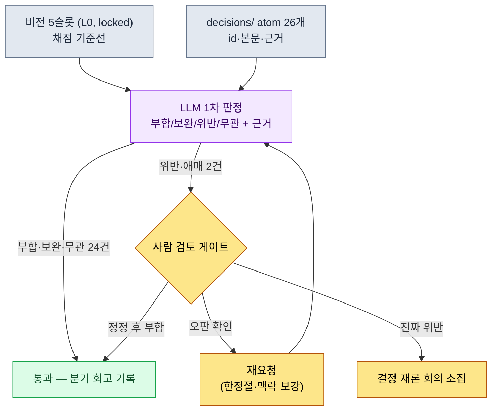

# 19.1 비전을 결정의 채점표로 — decisions/ 26개를 LLM에 걸어 보다

> 1차 독자: 중규모(10\~50인) 팀을 이끄는 디자인 디렉터·리드 기획자
> 1인/취미 독자용 축소 버전: §19.1.8 「혼자라면 이만큼만」

비전 문서를 한 페이지로 잘 써 둔 팀에서도 같은 사고가 반복된다. 비전은 벽에 걸려 있는데, 정작 매주 쌓이는 결정들이 그 비전과 맞는지를 아무도 확인하지 않는다. 분기 회고 때 한 번 들춰 보지만, 그때는 이미 어긋난 결정 위에 다음 결정이 세 개쯤 얹혀 있다. 비전이 "분쟁의 기준점"이 되려면 작성보다 **결정마다 비전에 걸어 보는 일**이 중요하다. 그리고 그 대조 작업은 사람이 손으로 하면 지루하고 빠뜨리기 쉬운 — AI에게 넘기기 딱 좋은 일이다.

이 장은 두 가지를 묶는다. 앞쪽은 이미 작성된 비전을 결정의 채점표로 돌리는 워크플로 — 저자 프로젝트의 실제 결정 atom 26개를 LLM에 걸어 "비전 슬롯 위반" 판정을 받고, 그중 한 건의 오판을 사람이 잡는 한 사이클. 뒤쪽은 그 채점표가 누구의 결정까지 커버하느냐는 질문, 즉 **권한 위임**이다. 리더십 일반론(비전이 왜 중요한가, 위임이 왜 성장의 도구인가)은 이미 다른 책에 충분하니, 이 장은 그 원칙을 *AI 워크플로로 돌리는 자리*에만 집중한다.

---

## 19.1.1 비전·로드맵·일정 — 세 층이 다른 이유만 짚고 넘어간다

비전이 결정을 거른다는 말부터 정리해야 한다. 비전·로드맵·일정은 같은 것이 아니다. 시간 단위와 변경 빈도가 다르고, 그 차이가 무너질 때 일정 압박이 비전을 흔든다.

| 층 | 기간 | 변경 빈도 | 비전 대조의 의미 |
|---|---|---|---|
| 비전 | 5\~10년 | 거의 없음 | 결정이 부합해야 할 기준선 |
| 로드맵 | 1\~3년 | 분기 | 비전을 일정으로 번역한 중간층 |
| 일정 | 1\~3개월 | 주 | 비전과 직접 대조하지 않음 |

핵심은 **결정을 거는 대상이 비전(가장 안 변하는 층)이라는 점**이다. 일정이 빠듯하다고 비전을 바꾸는 게 아니라, 일정이 비전과 어긋날 때 일정 쪽을 손본다. 이 위계가 분명해야 다음 절의 자동 점검이 의미를 갖는다. 점검의 기준선이 매주 흔들리면 점검 자체가 무의미하기 때문이다.

비전은 한 페이지, 5개 슬롯으로 끝낸다. 저자 프로젝트의 비전 문서는 다음 골격이다. 이 슬롯들이 §19.1.3 LLM 점검의 채점 기준이 되므로, 형태를 먼저 봐 둔다.

```markdown
---
title: 프로젝트 A 비전 v2
layer: L0
locked: true   # 변경 시 게임 디렉터 + CEO 합의 필요
---

## 슬롯 1. 우리가 만드는 것
한국 판타지 세계관의 모바일 우선 MMORPG.

## 슬롯 2. 누구를 위해
30~50대, 모바일 위주, 진중한 서사를 즐기는 사용자.

## 슬롯 3. 왜 (차별화)
- 다계층 내러티브로 깊은 서사 (양산이 아닌 깊이)
- 동남아 + 한국 동시 운영

## 슬롯 4. 어떻게 (가치)
- 사용자의 시간을 존중 (낭비 콘텐츠 최소)
- 데이터 + 사람 균형 결정
- 팀 합의가 결정 속도보다 우선

## 슬롯 5. 무엇이 아닌가
- F2P 폭주형 결제 모델 아님
- PvP 중심 아님
- 매일 N시간 강제 출석 아님
```

슬롯 5("무엇이 아닌가")가 점검에서 가장 일을 많이 한다. 위반은 대개 "하기로 한 것"이 아니라 "안 하기로 한 것"을 슬그머니 하는 자리에서 나오기 때문이다.

---

## 19.1.2 결정은 이미 atom으로 쌓여 있다

비전을 무엇에 걸 것인가. 저자 팀은 모든 주요 결정을 `decisions/` 폴더에 atom 한 장씩으로 박제한다. 날짜·당사자·근거가 명시된 사실 기록이고, 현재 26개가 쌓여 있다. 점검의 입력은 이 26개다 — 새로 만드는 게 아니라 이미 있는 것을 거는 것이다.

결정 atom 한 장의 실제 형태는 이렇다(익명화).

```markdown
---
type: decision
id: D0019
date: 2026-05-12
deciders: [게임 디렉터, 데이터 디렉터]
tier: T1
---
# refgame_selective_adoption_for_mobile
참조 MMORPG의 전투 데이터 일부를 모바일 빌드에 선택적으로 채택한다.
근거: 모바일 6인치에서 검증된 전투 페이스가 있고, 0부터
재설계하면 알파 일정이 한 분기 밀린다. 단, 결제·출석 유도
구조는 채택하지 않는다.
```

26개 중 점검 입력으로 쓸 대표 몇 개를 추린다(실제 atom명, §A.3.3).

| atom id | atom명 (익명화) | tier | 한 줄 요지 |
|---|---|---|---|
| D0007 | `claude_role_transition_phase2` | T1 | Claude를 수동 보조 → 능동 파트너로 격상 |
| D0014 | `dataset_scope_alpha_split` | T2 | 알파 데이터셋 분리 기준 확정 |
| D0019 | `refgame_selective_adoption_for_mobile` | T1 | 참조 게임 전투 데이터 선택 채택 |
| D0021 | `procedural_capability_frontier_5stage` | T1 | 절차적 생성 능력 5단계 정의 |
| D0023 | `class_keyword_world_only` | T2 | 클래스 키워드를 세계관 내로 제한 |

이 표가 다음 절 프롬프트의 입력 데이터다. 26개를 한 번에 거는 것이 핵심인데, 사람이 회고 때 손으로 26개를 하나씩 비전에 대조하면 한나절이 걸리고 중반부터 집중력이 떨어져 위반을 놓친다. 그 지루한 1차 대조를 LLM에 넘긴다.

---

## 19.1.3 [워크드 트랜스크립트] 결정 26개를 비전에 걸기

실제로 한 사이클을 끝까지 본다. 입력 프롬프트는 그대로 복사해 쓸 수 있고, 출력은 실제 세션을 재구성한 것이다.

### 1단계 — 프롬프트: 비전을 채점표로 주고, 판정 형식을 강제한다

```
아래 비전 5슬롯에 결정 atom 26개를 하나씩 걸어서, 각 결정이 비전에
부합/보완/위반/무관 중 뭔지 판정해줘. 위반이나 무관이면 어느 슬롯과
왜 그런지 한 줄로 근거 달고 (특히 슬롯 5 "무엇이 아닌가"를 잘 봐줘),
애매한 건 '애매'로 표시해서 나한테 넘겨. 부합은 근거 없어도 돼.
표로만 줘 (id | 판정 | 충돌 슬롯 | 근거 | 애매), 총평은 빼고.

[비전 5슬롯 — §19.1.1 전문 붙여넣기]
[결정 atom 26개 — id·본문·근거]
```

프롬프트의 절반이 "판정 형식 강제"다. 자유를 주면 LLM은 26개를 다 "대체로 부합합니다"로 뭉갠다. **4단계 판정 라벨, 위반·무관에만 근거 의무, 그리고 "애매하면 사람에게 넘겨라"는 탈출구**를 넣어 두는 것이 이 프롬프트의 핵심이다. 슬롯 5를 근거 문장에 명시적으로 호명한 것도 의도다 — 위반은 "안 하기로 한 것"에서 나오기 때문이다.

### 2단계 — Claude의 출력 (재구성, 발췌)

```
| id    | 판정 | 충돌 슬롯 | 근거                                      | 애매 |
|-------|------|----------|------------------------------------------|------|
| D0007 | 무관 | —        | Claude 운영 결정. 게임 비전과 평가축 다름   |      |
| D0014 | 무관 | —        | 데이터셋 분리. 내부 인프라 결정             |      |
| D0019 | 위반 | 슬롯 5   | 참조 게임 전투 데이터 채택 → "F2P 폭주형     | ★    |
|       |      |          | 결제 모델 아님"과 충돌 소지                 |      |
| D0021 | 부합 | 슬롯 3   |                                          |      |
| D0023 | 부합 | 슬롯 1   |                                          |      |
| ...   |      |          |                                          |      |

(26개 중 부합 18 · 보완 3 · 무관 3 · 위반 2)
위반/애매 판정 요청: D0019, D0026 — 사람 검토 필요
```

출력에서 가장 가치 있는 부분은 표가 아니라 **맨 아래, 위반 2건과 애매 표시**다. LLM이 26개 중 24개를 자동으로 거르고, 사람이 봐야 할 2건만 올려 줬다. 한나절 대조가 2건 검토로 줄었다. 그런데 그 2건 중 하나가 오판이다.

### 3단계 — 검증과 거부 (사람의 자리)

D0019(`refgame_selective_adoption_for_mobile`) 판정을 사람이 다시 읽는다. LLM은 "참조 게임 전투 데이터 채택"을 보고 슬롯 5의 "F2P 폭주형 결제 모델 아님"과 충돌한다고 판정했다. 표면 단어는 그럴듯하다 — 참조 게임이 공격적 결제로 유명하니까.

그러나 atom 본문을 끝까지 읽으면 마지막 문장이 있다. **"단, 결제·출석 유도 구조는 채택하지 않는다."** 결정은 전투 페이스 데이터만 가져오고 결제 구조는 명시적으로 배제했다. 슬롯 5를 오히려 지키는 결정이다. LLM은 atom 본문의 마지막 한정 문장을 판정 무게에 반영하지 못하고, "참조 게임"이라는 출처 단어에 끌려 위반으로 분류했다. 이건 슬롯 5 위반이 아니라 **부합**이다.

이런 오판이 나오는 이유는 분명하다. LLM은 결정의 *출처*(어떤 게임에서 가져왔나)와 결정의 *내용*(무엇을 가져오고 무엇을 버렸나)을 같은 무게로 본다. 사람은 "단, \~는 하지 않는다"는 한정절이 결정의 핵심임을 안다. 그래서 사람이 거부하고 재요청한다.

```
D0019 다시 봐줘. 본문 마지막 문장 "단, 결제·출석 유도 구조는 채택하지 않는다"가
핵심이야. 채택하는 것(전투 페이스 데이터)이랑 배제하는 것(결제·출석 구조)을
나눠서 각각 어느 슬롯에 걸리는지 다시 판정해줘.
```

LLM은 다시 답했다. "채택 대상(전투 데이터)은 슬롯 1·2에 부합, 배제 대상(결제 구조)은 슬롯 5를 적극 지지. 종합 판정: 부합. 직전 위반 판정은 출처 단어에 과반응한 오류." 이 한 번의 왕복으로 D0019는 위반에서 부합으로 정정됐다. 남은 진짜 검토 대상은 D0026 한 건이다.

이 사이클이 이 장의 핵심이다. **LLM은 26개를 2건으로 줄여 주지만, 그 2건 중 하나가 오판일 수 있다.** 자동 점검은 사람의 검토를 없애는 게 아니라, 사람이 26개 대신 2건에 집중하게 만드는 도구다. 그 2건을 사람이 끝까지 안 읽으면, 멀쩡한 결정이 "비전 위반"으로 회의에 올라가 엉뚱한 분쟁을 만든다.

---

## 19.1.4 점검 흐름을 한눈에

위 사이클을 그림으로 남겨 두면, 이후 분기마다 같은 흐름이 반복된다. 핵심은 LLM 판정이 자동으로 결정을 뒤집지 않는다는 점이다. 위반·애매만 사람 게이트로 올리고, 폐기·정정·승인은 사람이 한다.



사람의 손이 닿는 곳은 두 군데뿐이다. 비전과 결정을 깨끗이 입력하는 자리(맨 위)와, LLM이 위반·애매로 올린 소수 건을 끝까지 읽고 판정하는 자리(가운데 게이트). 그 사이의 지루한 26개 대조는 LLM이 돌린다. §6.2의 city 생성기에서 lint가 위반을 자동 폐기하지 않고 작가 게이트로 alert만 올렸던 것과 같은 설계다 — 기계는 의심 후보를 뽑고, 죽일지 살릴지는 사람이 정한다.

---

## 19.1.5 비전 점검은 누구의 결정까지 커버하는가 — 권한 위임

여기서 자연스러운 질문이 나온다. 26개 결정을 게임 디렉터가 다 내렸나? 그러면 안 된다. 리드가 모든 결정을 직접 하면 병목이 되고, 다 위임하면 비전이 약해진다. 비전 점검은 **위임된 결정까지 같은 채점표로 거르기 위한** 안전망이기도 하다.

결정에는 등급이 있고, 등급이 곧 권한이다. 저자 팀의 권한 매트릭스다.

| 등급 | 결정자 | 검토자 | 통보 | 비전 점검 대상? |
|---|---|---|---|---|
| T0 비전·핵심 | 게임 디렉터 + CEO | 전 팀장 | 전 팀 | 비전 자체 (점검 기준선) |
| T1 시스템·다분야 | TF 의장 + 게임 디렉터 | TF 멤버 | 분야 팀 | ✅ 필수 |
| T2 분야·중간 | 분야 디렉터 | 시니어 | 분야 팀 | ✅ 필수 |
| T3 단발·작은 | 시니어 | 담당자 | 직접 관련 | 표본 점검 |
| T4 즉시·핫픽스 | 담당자 | 시니어(사후) | 게임 디렉터(사후) | 점검 제외 |

`decisions/` 26개는 대부분 T1·T2다 — 위임된 결정들이다. 게임 디렉터가 모든 T2를 직접 보지 않는다. 대신 비전 점검(§19.1.3)이 위임된 T1·T2 결정을 분기마다 한 번 비전에 걸어 본다. **위임의 안전망이 곧 비전 점검**인 셈이다. T0는 점검 대상이 아니라 점검의 기준선이고, T4 핫픽스는 양이 많고 비전 영향이 거의 없어 제외한다.

위임 자체는 한 번에 풀로 가지 않고 4단계로 점진한다.

| 단계 | 권한 | LLM 점검과의 관계 |
|---|---|---|
| 1. 정보 전달 | "이렇게 하라" | 위임자가 결정, 점검 불필요 |
| 2. 조언 + 결정 보고 | "X를 고려해 결정하라" | 보고 시 비전 대조 같이 봄 |
| 3. 사후 보고 | "결정하고 결과 알려라" | atom 박제 → 분기 점검에 포함 |
| 4. 자율 결정 | 보고 의무 없음 (등급 한도 내) | atom만 남기면 점검이 사후 커버 |

4단계 자율 결정이 비전과 어긋날 위험이 가장 큰데, 바로 그 위험을 §19.1.3 점검이 사후에 잡는다. 자율로 내린 T2 결정도 atom으로 박제만 되면 분기 점검에 자동으로 걸린다. 위임의 자유와 비전의 일관성이 충돌하지 않는 이유가 여기 있다 — 자유롭게 결정하되, 결정은 atom으로 남고, atom은 분기마다 비전에 걸린다.

---

## 19.1.6 수치를 정직하게 다루는 법

비전·위임 챕터는 "비전 도입 후 회의 시간이 90분에서 45분으로 줄었다", "위임 후 디렉터 결정 부담이 주 30건에서 5건으로" 같은 표를 넣고 싶은 유혹이 크다. 그런 숫자는 검증되지 않으면 책의 신뢰를 깎는다. 이 장의 수치는 셋 중 하나로만 다룬다.

첫째, **세는 것은 실측으로 적는다.** `decisions/` atom은 현재 26개다(2026년 5월 실측 기준). LLM 1차 판정에서 사람 게이트로 올라온 건수, 그중 오판으로 정정된 건수는 세션 로그로 카운트되는 실측값이다. 위 워크드 트랜스크립트에서 위반 판정 2건 중 1건(D0019)이 오판이었다는 것도 실제 세션의 결과다.

둘째, **효과는 방향으로만 말한다.** "한나절 대조가 소수 건 검토로 줄었다"는 구조의 방향이지 절대 시간이 아니다. 정확한 절약 시간은 결정 수·팀 규모·atom 본문 길이에 따라 달라지므로, "26개를 손으로"와 "LLM 1차 + 사람 게이트"의 구조 차이로 읽는 게 맞다. 회의 시간·동기 점수 같은 결과 지표는 비전 하나로 좌우되지 않으니 인과를 단정하지 않는다.

셋째, **측정 가능한 것만 약속한다.** 이 워크플로가 실제로 측정 가능한 것은 — 분기당 비전 점검에 건 결정 수, 사람 게이트 통과 건수, 오판율(LLM 위반 판정 중 사람이 부합으로 정정한 비율), atom 박제 누락 건수(위임됐는데 atom이 없어 점검에서 빠진 결정)다. 이 넷은 회의에서 "느낌"이 아니라 숫자로 말할 수 있다. 특히 **오판율**은 LLM 판정을 그대로 믿으면 안 되는 이유를 매분기 숫자로 증명한다.

---

## 19.1.7 흔한 실패

| 패턴 | 왜 실패하나 | 처방 |
|---|---|---|
| 비전을 작성만 하고 결정에 안 건다 | 비전이 벽 장식으로 남고 결정은 제멋대로 | 분기마다 atom 26개를 비전에 거는 §19.1.3 |
| LLM 위반 판정을 그대로 회의에 올림 | 오판(D0019 같은)이 엉뚱한 분쟁을 만듦 | 위반·애매 건은 atom 본문 끝까지 사람이 읽기 |
| 결정을 atom으로 안 남김 | 위임된 결정이 점검에서 통째로 빠짐 | 사후 보고(위임 3단계)에 atom 박제 의무화 |
| T4 핫픽스까지 다 점검 | 양만 늘고 비전 영향은 거의 없음 | 점검 대상을 T1·T2로 한정 |
| 위임을 1→4단계 건너뛰기 | 자율 결정이 비전과 어긋난 채 누적 | 단계적 위임 + 분기 점검으로 사후 커버 |

세 번째가 가장 자주 놓친다. 자율로 잘 굴러가는 팀일수록 결정을 입으로만 합의하고 atom을 안 남긴다. 그러면 §19.1.3 점검은 박제된 결정만 보므로, 가장 자유롭게 내린 결정이 점검의 사각지대로 빠진다. 위임의 자유는 atom 박제를 전제로만 안전하다.

---

> **게임 밖 적용.** 비전을 결정마다 걸어 보는 일과 권한 위임은 게임 팀만의 숙제가 아니라 모든 관리자의 일입니다. 부서의 미션을 한 페이지 5슬롯("우리가 하는 것 / 누구를 위해 / 왜 / 어떻게 / 무엇이 아닌가")으로 못 박아 두면, 매주 쌓이는 실무 결정이 그 미션과 어긋나는지를 분기에 한 번 LLM으로 1차 대조할 수 있습니다 — 특히 "안 하기로 한 것"을 슬그머니 하는 위반이 잘 잡힙니다. 예를 들어 팀장이 위임한 결정들을 분기마다 부서 미션에 걸어 보면, 자율적으로 내려진 결정이 방향에서 벗어났는지를 사후에 잡는 안전망이 됩니다. 다만 LLM이 "위반"으로 올린 건은 그대로 회의에 올리지 말고, 그중 하나는 오판일 수 있으니 사람이 끝까지 읽어야 합니다.

## 19.1.8 따라하기 — 오늘 할 수 있는 한 단계

> **혼자라면 이만큼만**: 결정 atom 폴더가 없어도 됩니다. 본인 프로젝트(또는 취미 게임)의 비전을 §19.1.1의 5슬롯으로 한 페이지만 적어 보세요. 그다음 최근에 내린 결정 5\~10개를 한 줄씩 메모로 적고, §19.1.3의 프롬프트를 그대로 붙여 LLM에 한 번 걸어 보세요. '위반' 판정이 하나라도 나오면 그 결정의 메모를 끝까지 다시 읽고, LLM이 맞는지 본인이 직접 반박해 보세요. 그러면 비전 점검이 어떤 판단의 묶음인지, 왜 LLM 판정을 그대로 믿으면 안 되는지 몸으로 들어옵니다.

팀이라면 다음 한 단계로 시작하세요. 비전을 5슬롯 한 페이지로 고정(L0, locked)하고, 최근 분기에 내린 T1·T2 결정을 `decisions/` 폴더에 atom 한 장씩으로 박제하는 것부터 합니다. atom이 10개만 쌓여도 §19.1.3 프롬프트를 한 번 돌려 볼 수 있고, 그 첫 사이클에서 위임된 결정 중 비전과 어긋난 한 건을 잡으면 이 워크플로의 가치가 곧장 보입니다.

---

### 이 챕터의 핵심 메시지
- 비전은 작성보다 결정에 거는 일이 중요하다 — decisions/ 26개를 분기마다 비전 5슬롯에 건다.
- LLM은 26개를 소수 건으로 줄여 주지만, 그중 한 건은 오판일 수 있다(D0019).
- 위임된 T1·T2 결정을 atom으로 남기면 비전 점검이 위임의 사후 안전망이 된다.

### 다음 챕터 미리보기
- 19.2 갈등 관리·팀 문화 + 회의 리더십 — 권한이 나뉘면 충돌이 생긴다. 갈등 분류와 회의 운영을 AI로 받치는 법
