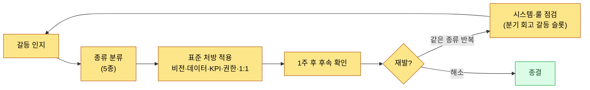
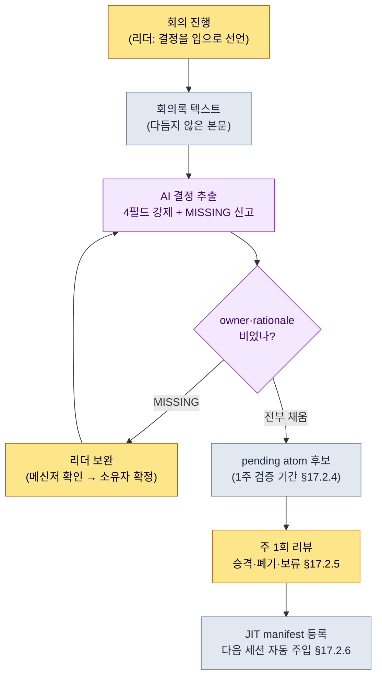

# 19.2 갈등을 분류하고 회의에서 결정을 흘리지 않는다 — 회의 리더십 AI 보조

> 1차 독자: 분기 50건 이상의 결정을 회의에서 내리는 디렉터·팀장 (중규모(10\~50인) 팀)
> 1인/취미 독자용 축소 버전: §19.2.8 「혼자라면 이만큼만」

회의를 90분 잘 끌고 와 놓고, 일주일 뒤 같은 안건이 회의 테이블에 다시 올라온 적이 있다. 분명히 결정했는데, 누가 무엇을 맡았는지가 아무 데도 안 적혀 있었다. 회의록에는 "글로벌 쿨다운 논의함"만 남았고, "0.5초로 정함, 담당 팀원 A"는 그 자리에 있던 사람 머릿속에서 일주일 만에 휘발했다. 리더의 회의가 무너지는 지점은 대부분 회의 중이 아니라 **회의가 끝난 직후, 결정이 기록으로 굳기 전 그 짧은 틈**이다.

이 장은 팀장 일의 두 덩어리를 다룬다. 앞쪽 절반은 **갈등을 매번 0부터 푸는 대신 종류별 표준 처방으로 보내는 법**이고, 뒤쪽 절반은 이 장의 척추 — **회의에서 나온 결정을 AI가 추출하되 소유자·근거가 비면 통과시키지 않게 강제하는 워크드 트랜스크립트**이다. 리더십 일반론(비전 제시·경청·공감)은 다른 책에 충분하니, 이 장은 그 일반론을 *AI 워크플로로 돌려 결정 누락을 막는 자리*에만 집중한다.

---

## 19.2.1 갈등은 0이 목표가 아니라 분류 대상이다

갈등 0인 팀이 건강한 팀이라는 건 오해다. 중규모(10\~50인) 팀이 분기 50건 넘는 결정을 내리는데 마찰이 한 번도 안 보인다면, 갈등이 없는 게 아니라 수면 아래로 가라앉은 것이고, 가라앉은 갈등이 더 위험하다.

리더가 할 일은 갈등을 없애는 게 아니라 **종류를 빨리 분류해 표준 처방으로 보내는 것**이다. 같은 갈등이 매번 다른 방식으로 풀리면, 풀리는 데 걸리는 시간이 매번 0부터 다시 쌓인다.

| 갈등 종류 | 충돌의 정체 | 표준 처방 |
|---|---|---|
| 가치 갈등 | 비전 해석 차이 (매출 vs 사용자 시간) | 비전 슬롯 인용 |
| 사실 갈등 | 같은 데이터의 다른 해석 | 데이터 확인 (메타게임 보고서) |
| 우선순위 갈등 | "내 분야가 더 중요" | 임팩트 등급·KPI 영향 비교 |
| 권한 갈등 | "이건 내 결정" | 권한 매트릭스 재확인 |
| 개인 갈등 | 인간관계·소통 스타일 | 1:1, 사실/감정 분리 (시스템 밖) |

앞의 네 종류는 처방이 **시스템 인용**이다. 비전·데이터·KPI·권한 매트릭스가 명문화돼 있으면, 결정의 무게가 사람의 입에서 시스템 쪽으로 옮겨가 토론이 짧아진다. 다섯 번째 개인 갈등만 시스템 밖이다 — 1:1과 사실·감정 분리, 시간과 진심 외의 도구는 거의 작동하지 않는다. 다만 "시스템으로 안 풀린다"가 리더가 손 놓을 명분은 아니다. 시스템이 못 푸는 영역도 결국 리더의 일이라는 점이 이 자리의 까다로움이다.

분류는 매번 처음부터 푸는 게 아니라 한 흐름으로 돈다.



핵심은 오른쪽 분기점이다. 같은 종류의 갈등이 반복되면 그건 사람 문제가 아니라 시스템 문제다. 그때는 사람을 중재하는 대신 비전·권한 매트릭스 같은 룰을 손본다. 이것이 §19.2.7에서 다룰 분기 회고 갈등 슬롯의 입력이 된다.

---

## 19.2.2 회의는 결정을 만드는 곳이고, 결정은 흘리면 안 된다

갈등 처방의 네 종류가 전부 "시스템 인용"인 것처럼, 회의도 결국 **결정을 만들고 그 결정을 기록으로 굳히는 장치**다. 리더가 회의에서 지켜야 할 다섯 원칙은 서로 묶여 있다. 어느 하나만 빠져도 나머지가 같이 흔들린다.

1. 안건은 회의 24시간 전에 공유한다. (준비 없이 모이면 회의가 토론장으로 흐른다)
2. 각 안건에 시한을 강제한다. (정보 공유 5분·결정 15\~20분·토론 30\~45분, 초과 시 이월)
3. 회의 끝에 "오늘 결정"을 명시한다. (결정 없이 끝나면 다음 회의가 같은 안건을 다시 연다)
4. 회의록은 종료 즉시 생성된다. (사람이 나중에 정리하기로 하면 휘발한다)
5. 결정마다 소유자·근거·후속 액션을 추적한다. (추적 없는 액션은 다음 주 전에 사라진다)

이 다섯 중 3·4·5가 무너지는 게 서두의 사고였다. 결정을 입으로는 했는데(원칙 3 부분 충족), 기록으로 굳지 않았고(원칙 4 실패), 소유자가 입력되지 않았다(원칙 5 실패). 그래서 일주일 뒤 같은 안건이 다시 올라왔다.

문제는 원칙 3·4·5를 사람의 의지에 맡기면 바쁜 주에 가장 먼저 무너진다는 것이다. 회의가 끝나면 리더는 이미 다음 회의로 달려간다. 그래서 이 세 원칙을 **AI 보조 파이프라인으로 옮긴다.** 회의록 텍스트에서 결정을 자동 추출하되, 소유자나 근거가 비어 있으면 통과시키지 않게 만드는 것이다. 이 파이프라인은 17부에서 만든 회의→회의록→atom 추출 흐름(§17.2)을 리더 관점에서 한 번 더 본다.

---

## 19.2.3 [워크드 트랜스크립트] 회의록에서 결정을 뽑되, 소유자 없으면 막는다

실제로 어떻게 돌리는지 한 사이클을 끝까지 보여준다. 무대는 저자 프로젝트(모바일 우선 MMORPG, 이하 "프로젝트 A")의 전투 TF 회의가 끝난 직후다. 입력 프롬프트는 그대로 복사해 쓸 수 있고, 출력은 실제 세션을 재구성했다.

### 1단계 — 입력: 다듬지 않은 회의록 본문을 그대로 던진다

회의록을 예쁘게 정리하지 않는다. 발언이 섞여 있고, 결정인지 아닌지 애매한 줄도 그대로 둔 거친 텍스트가 입력이다. 정리는 AI가 할 일이지 사람이 먼저 할 일이 아니다.

```text
[2026-06-05 전투TF 회의록 본문 — 발췌, 다듬지 않음]

팀원 A: 글로벌 쿨다운 0.5초로 가는 거 시뮬 결과 안정적이었어요.
팀원 B: 회복 스킬까지 0.5초 묶으면 회복 사이클이 깨질 것 같은데.
팀원 A: 그건 따로 빼죠. 회복은 글쿨 예외로.
이민수: 좋아요, 글쿨 0.5초 통일하고 회복은 예외. A님이 데이터 시트
        cooldown 컬럼 일괄로 봐주세요.
팀원 C: 타게팅 우선순위 룰은 다음 주에 더 보고 정하는 걸로...
팀원 B: 미니맵 축소 토글은 UI팀이랑 같이 봐야 할 듯요. 일단 보류.
이민수: 네 그건 다음 회의로.
```

여기에 결정 두 개(글쿨 0.5초, 회복 예외)와 보류 두 개(타게팅, 미니맵)가 섞여 있다. 사람이 눈으로 골라내면 한 건씩 놓친다. 그게 서두의 사고였다.

### 2단계 — 프롬프트: 추출을 시키되, 소유자·근거를 빈칸으로 두지 못하게 한다

```text
첨부한 회의록에서 "결정"만 뽑아줘. 토론·보류·정보 공유는 결정 아니야.
결정마다 decision(한 문장) / owner / rationale / follow_up 네 칸을 채우되,
owner나 rationale을 본문에서 못 찾으면 추측하지 말고
"[MISSING — 회의에서 미확정]"이라고 적어줘. 보류·다음 회의 이월은 deferred로,
결정인지 애매한 줄은 ambiguous로 빼서 나한테 넘겨. 출력은
decisions / deferred / ambiguous 세 블록으로만.
```

이 프롬프트의 절반이 "빈칸 강제"라는 점에 주목한다. AI에게 자유를 주면 owner를 그럴듯하게 지어내거나, 보류를 결정으로 승격시킨다. **"못 찾으면 추측 말고 [MISSING]이라고 신고하라"**는 탈출구를 넣어 두는 것이 이 워크플로의 핵심이다. 결정은 사람이 명시적으로 선언해야 가치가 있고(§17.6.3의 원칙), AI는 비어 있다는 사실을 *드러내는* 일까지만 한다.

### 3단계 — Claude의 출력 (실제 세션 재구성)

```text
decisions:
  - decision: 전투 글로벌 쿨다운을 0.5초로 통일한다.
    owner: 팀원 A ("A님이 데이터 시트 cooldown 컬럼 일괄로 봐주세요" — 이민수)
    rationale: "글로벌 쿨다운 0.5초로 가는 거 시뮬 결과 안정적이었어요" (팀원 A)
    follow_up: cooldown 컬럼 일괄 점검

  - decision: 회복 스킬은 글로벌 쿨다운 적용에서 제외한다.
    owner: [MISSING — 회의에서 미확정]
    rationale: "회복까지 0.5초 묶으면 회복 사이클이 깨질 것 같은데" (팀원 B)
    follow_up: 회복 스킬 cooldown 예외 처리 데이터 반영

deferred:
  - 타게팅 우선순위 룰 (팀원 C, 다음 주 추가 검토)
  - 미니맵 축소 토글 (UI팀 협의 필요, 보류)

ambiguous: (없음)
```

출력에서 가장 가치 있는 부분은 첫 번째 결정의 깔끔한 표가 아니라 **두 번째 결정의 `owner: [MISSING]`**이다. 회복 예외는 분명히 결정됐는데, 회의록 어디에도 "누가 데이터에 반영할지"가 안 적혀 있었다. AI가 그 구멍을 추측으로 메우지 않고 정직하게 신고했다. 좋은 프롬프트는 AI가 "이 자리는 비어 있습니다"라고 말할 수 있게 만든다.

### 4단계 — 검증과 거부 (리더의 자리)

이 출력을 그대로 받으면 안 된다. `[MISSING]`이 떴다는 건 **회의가 결정을 절반만 끝냈다**는 뜻이다. 여기서 리더가 할 일은 AI 출력을 고치는 게 아니라, 회의에서 빠진 결정을 마저 내리는 것이다.

저자는 이 자리에서 팀원 A에게 사내 메신저로 한 줄 물었다. "회복 예외 데이터 반영도 A님이 같이 보시는 거죠?" A가 "네"라고 답했다. 이 한 줄이 누락된 소유자를 확정한다. 그다음 재요청한다.

```text
두 번째 결정(회복 예외) owner는 팀원 A로 확정됐어 (사내 메신저로 본인 확인함).
이거 반영해서 decisions 다시 주고, 두 결정을 pending atom 후보 형식으로도
바꿔줘.
// (의도: status: pending, source_meeting, owner, related_atoms 포함 — §17.2.4 형식)
```

AI는 owner가 채워진 결정 두 건을 pending atom 후보 두 개로 변환해 다시 답했다. 이 후보는 곧장 정식 결정이 되지 않고 **pending 상태로 1주 검증 기간**을 거친다(§17.2.4). 회의에서 정한 게 일주일 운영 후 뒤집히기도 하기 때문이다. 잉크가 마를 시간을 주는 셈이다. 입력 → 추출 → MISSING 신고 → 사람이 결정 보완 → 재요청의 한 사이클이 여기서 닫힌다.

이 한 바퀴가 서두의 사고를 구조적으로 막는다. 결정이 절반만 났을 때, 그 사실이 회의 끝나고 일주일 뒤가 아니라 **회의 직후 그 자리에서** 드러난다.

---

## 19.2.4 전체 파이프라인 — 사람의 손은 두 군데뿐

위 워크드 트랜스크립트를 17부의 회의록 파이프라인 위에 얹으면 전체 그림이 이렇다. 리더의 손이 닿는 곳은 두 군데뿐이다. 회의에서 결정을 *선언*하는 자리(맨 앞)와, AI가 신고한 `[MISSING]`을 *보완*하는 자리(가운데). 그 사이의 추출·변환·등록은 자동이다.



이 파이프라인에서 AI가 **하지 않는** 일이 더 중요하다. AI는 결정을 만들지 않는다. 소유자를 지어내지 않는다. 보류를 결정으로 승격시키지 않는다. AI가 하는 건 회의록에서 결정 후보를 골라내고, 빈 칸을 *드러내는* 일까지다. 결정의 선언과 빈 칸의 보완은 사람이 한다. 이것이 §17.6.3에서 말한 "결정 슬롯은 AI 자동 생성 금지" 원칙의 리더 관점 적용이다 — 결정이 다른 문서·세션·빌드로 전파되면 비가역 흔적이 남기 때문에, 진입 게이트에서는 사람이 명시적으로 선언하는 자리를 보존한다.

---

## 19.2.5 [MISSING] 강제가 평등 결정 문화를 떠받친다

회사 PC의 팀 공유 atom 중 `team_equal_decision_culture`라는 개념 atom이 있다. 회고에서 반복 인용되는 어휘를 박제한 것으로, "결정은 직책이 아니라 근거로 한다"는 팀 문화를 한 단어로 가리킨다. 디렉터가 "내가 정했으니 끝"이라고 누르는 게 아니라, 결정마다 누가·왜를 남겨 **나중에 누구든 그 결정을 근거로 되짚을 수 있게** 만드는 문화다.

§19.2.3의 `[MISSING]` 강제가 바로 이 문화의 기술적 뒷받침이다. 소유자와 근거를 빈칸으로 통과시키지 않는다는 건, 결정의 권위가 "디렉터가 말했으니까"가 아니라 "본문 어느 발언에서 나왔으니까"에 놓인다는 뜻이다. 근거 인용이 비면 결정이 막히므로, 직책으로 누른 결정은 구조적으로 atom이 되지 못한다.

이 문화가 §19.2.1의 갈등 처방과도 한 줄로 이어진다. 가치 갈등을 비전 인용으로, 사실 갈등을 데이터로, 권한 갈등을 매트릭스로 푼다는 건 전부 **사람의 입 대신 기록된 근거로 푼다**는 같은 원리다. 평등 결정 문화는 갈등 처방의 토양이고, `[MISSING]` 강제는 그 토양이 회의 단위에서 굳지 않게 매번 다지는 도구다.

여기에 팀 문화의 또 다른 축, 공개와 폐쇄의 경계가 겹친다. 회의록·결정 카드·KPI 데이터·사고 보고는 공개 영역에 두고, 1:1 대화·인사 평가·급여·개인 사정은 폐쇄 영역에 둔다. 결정 추출 파이프라인이 다루는 건 전부 공개 영역이다. 개인 갈등(§19.2.1의 다섯 번째)이 시스템 밖에 있는 이유도 같다 — 그건 폐쇄 영역이라 atom으로 박제하지 않는다.

---

## 19.2.6 수치를 정직하게 다루는 법

리더십 챕터는 "회의 파이프라인을 도입했더니 회의 시간이 절반으로 줄었다" 같은 표를 넣고 싶은 유혹이 크다. 그런 숫자는 검증되지 않으면 책의 신뢰를 깎는다. 이 책의 원칙은 셋 중 하나다.

첫째, **측정 가능한 것만 지표로 약속한다.** 회의 파이프라인이 실제로 셀 수 있는 건 이런 것들이다 — 결정당 `owner`·`rationale` 누락 건수(목표 0), 회의록에서 추출된 결정 중 pending atom으로 승격된 비율, "이거 전에 결정 안 했나?" 재회의 건수. 이 셋은 회의에서 "느낌"이 아니라 숫자로 말할 수 있다.

둘째, **저자 추정은 추정이라고 쓴다.** 회의 직후 결정 추출에 드는 시간이 "손으로 회의록 정리 20\~30분 → AI 초안 + 보완 5분 안쪽"이라는 건 저자의 경험 기반 추정이며 미검증 가설이다. 절대값을 외우지 말고 *구조 차이*("사람이 처음부터 골라냄" vs "AI 추출 + 빈칸만 보완")로 읽으면 된다. 정확한 절약 시간은 회의 규모·결정 수에 따라 달라진다.

셋째, **인과를 단정하지 않는다.** "재회의가 줄었다"가 전적으로 이 파이프라인 덕이라고 못 박지 않는다. 팀 성숙도·프로젝트 단계도 함께 작용한다. 방향(결정 누락이 회의 직후 드러나면 재회의가 줄어드는 쪽으로 작동한다)만 말하고, 배수를 지어내지 않는다.

---

## 19.2.7 분기 회고의 갈등·결정 슬롯

갈등 처방과 결정 파이프라인은 분기 회고에서 한 번 점검 사이클을 돈다. 회고에 "갈등 슬롯"과 "결정 누락 슬롯"을 둔다.

```text
2026 Q2 분기 회고 — 갈등·결정 슬롯
─────────────────────────────────
[갈등] 이번 분기 주요 3건
1. 글로벌 쿨다운 (가치 갈등) → 비전 인용으로 종결.
   학습: 비전 5슬롯이 결정 기준으로 작동함을 재확인.
2. 신규 던전 우선순위 (우선순위 갈등) → KPI 영향 비교.
   학습: 우선순위 표가 없어 매번 즉석 비교 → 다음 분기 표 도입.
3. 캐릭터 디자인 권한 (권한 갈등) → 권한 매트릭스 재확인.
   학습: 매트릭스에 '시각 vs 기능' 분담 항목 추가 필요.

[결정 누락] 이번 분기 [MISSING] 발생 건
- 회복 예외 결정 owner 미기재 (2026-06-05) → 사내 메신저로 보완.
  학습: TF 회의 결정 선언 시 owner 즉시 호명을 진행 체크리스트에 추가.
```

갈등도 결정 누락도 회고의 입력이다. 같은 종류의 갈등이 반복되면 시스템(비전·권한 표)을 손보고, `[MISSING]`이 자주 같은 패턴으로 뜨면 회의 진행 방식을 손본다. §19.2.1의 흐름도에서 오른쪽으로 빠진 "시스템·룰 점검"이 여기서 구체화된다.

---

> **게임 밖 적용.** "분명히 결정했는데 일주일 뒤 같은 안건이 또 올라온다"는 회의의 사고는 업종을 가리지 않습니다. 회의록 본문을 다듬지 말고 그대로 LLM에 넣어 결정만 추출하되, 소유자나 근거가 비면 추측으로 채우지 말고 `[MISSING]`으로 신고하게 하면, 결정이 절반만 난 사실이 회의 직후 그 자리에서 드러납니다. 예를 들어 영업 주간회의에서 "이 계정은 A가 맡기로 함"이 입으로만 오가고 기록되지 않으면 다음 주에 공중에 뜨는데, AI 추출이 `owner: [MISSING]`을 띄우면 그 자리에서 메신저 한 줄로 소유자를 확정해 재회의 한 건을 없앱니다. 결정 선언과 빈칸 보완은 사람이, 추출은 AI가 맡는 분담이 핵심입니다.

## 19.2.8 따라하기 — 오늘 할 수 있는 한 단계

> **혼자라면 이만큼만**: 팀도 회의록 파이프라인도 없어도 됩니다. 본인이 최근 참여한 회의(스터디·동아리·1인 프로젝트 협의도 좋습니다)의 메모를 §19.2.3의 프롬프트에 그대로 붙여 한 번 돌려 보세요. AI가 `owner: [MISSING]`을 띄우는 결정이 하나라도 있다면, 그게 당신 팀(또는 당신 자신)이 일주일 뒤 다시 꺼낼 안건입니다. 그 빈칸을 지금 채우는 것만으로 재회의 한 건이 사라집니다.

팀이라면 다음 한 단계로 시작하세요. 다음 회의록을 다듬지 말고 그대로 §19.2.3의 추출 프롬프트에 넣고, 규칙 2(`[MISSING]` 강제)만 살립니다. pending atom·JIT 등록(§17.2)은 그다음입니다. 빈칸 강제 한 줄만 있어도, "결정했다고 생각했는데 안 적힌" 가장 비싼 누락을 회의 직후 잡을 수 있습니다.

---

## 19.2.9 흔한 실패

| 패턴 | 왜 실패하나 | 처방 |
|---|---|---|
| 모든 갈등을 같은 방법으로 푼다 | 어느 종류도 끝까지 안 풀림 | 5종 분류 → 종류별 처방 (§19.2.1) |
| 갈등 0인 팀에 만족 | 갈등이 수면 아래로 잠김 (더 위험) | 갈등은 건강 신호, 분기 회고 슬롯 |
| 결정을 입으로만 하고 안 적음 | 일주일 뒤 같은 안건 재회의 | AI 추출 + pending 박제 (§19.2.3) |
| AI가 소유자를 추측으로 채움 | 틀린 소유자가 atom으로 굳음 | `[MISSING]` 강제, 추측 금지 (§19.2.2) |
| AI가 결정을 자동 생성 | 결정의 권위가 근거에서 벗어남 | 결정 선언은 사람, AI는 보강만 (§17.6.3) |
| 보류를 결정으로 승격 | 미확정 안건이 비가역 전파됨 | deferred 블록으로 분리 (§19.2.3) |

세 번째와 네 번째가 가장 자주 묶여 터진다. 결정을 안 적는 팀은 AI에게 "알아서 정리해 줘"라고 통째로 넘기고, AI는 친절하게 소유자를 지어낸다. 그 지어낸 소유자가 atom으로 굳으면, 일주일 뒤 "내가 맡기로 한 적 없는데요"라는 더 비싼 갈등이 생긴다. `[MISSING]` 강제는 그 두 실패를 한 줄로 막는다.

---

### 이 챕터의 핵심 메시지

- 갈등은 0이 목표가 아니라 5종 분류 대상이고, 네 종류는 시스템 인용으로 푼다.
- 회의 결정을 AI가 추출하되, 소유자·근거가 비면 `[MISSING]`으로 막는다.
- 결정 선언과 빈칸 보완은 사람, 추출·변환·등록은 AI가 맡는다.

### 다음 챕터 미리보기

- 19.3 AI 도입 전략·상위 커뮤니케이션 — 팀에 AI를 들이는 순서와, 같은 결정 데이터를 상위 청중에 변환하는 법
