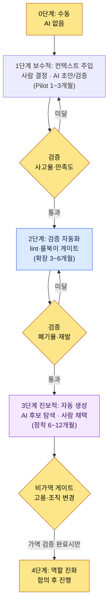
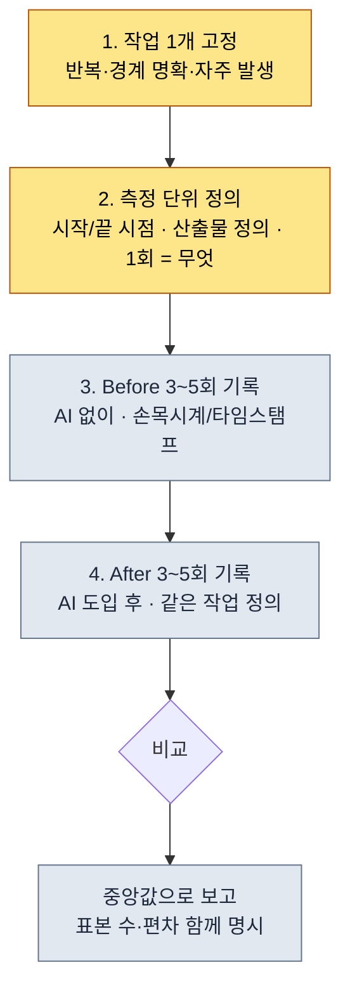
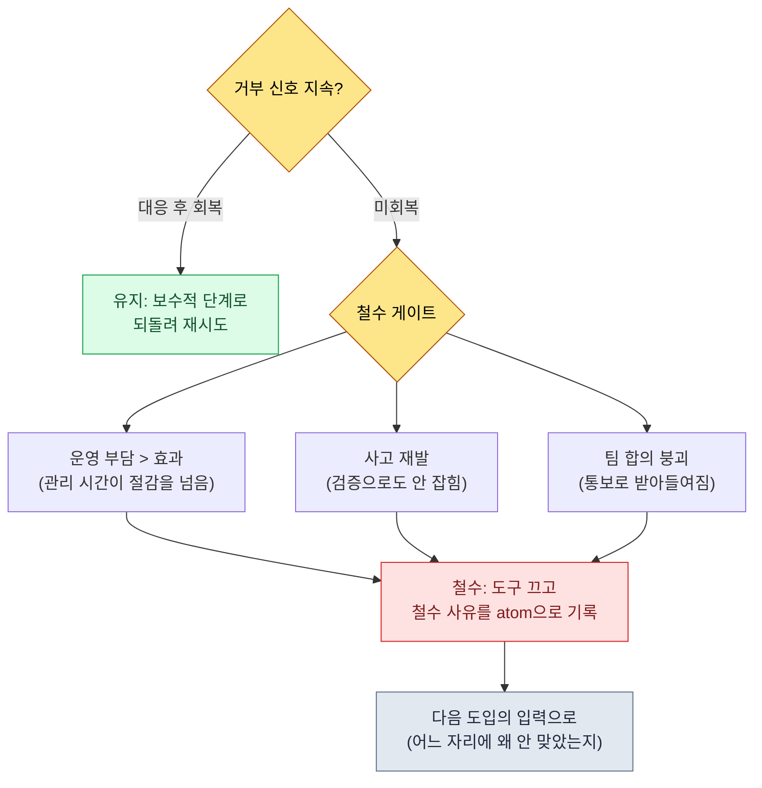

# 19.3 AI 도입 전략과 경영진 설득 — 보수적에서 진보적으로, ROI는 가공하지 않는다

> 1차 독자: 팀에 AI를 도입할지 결정하고 그 비용을 경영진에게 설명해야 하는 리드 (중규모(10~50인) 팀)
> 1인/취미 독자용 축소 버전: §19.3.12 「혼자라면 이만큼만」

CEO 방에서 "AI 도구 비용으로 월 얼마가 나가는데, 그래서 뭐가 좋아진 거냐"는 질문을 받은 적이 있다. 그때 손에 들고 있던 건 슬라이드 한 장이었고, 거기엔 "생산성 3~5배 향상"이라고 적혀 있었다. CEO가 다시 물었다. "그 3~5배는 어디서 나온 숫자입니까." 답을 못 했다. 그 숫자는 내가 어디선가 본 블로그 평균을 옮긴 것이었지, 우리 팀에서 잰 값이 아니었다.

그날 이후 AI 도입 보고에서 가공 수치를 전부 뺐다. 대신 시스템이 실제로 남기는 것 — atom 몇 개가 쌓였고, 스킬이 몇 개 돌고, 로그에 어떤 입력이 어떤 컨텍스트를 부르는지 — 를 그대로 보고하기 시작했다. 이 장은 두 가지를 다룬다. 첫째, AI 도입을 **보수적(사람이 결정, AI가 검증)에서 진보적(AI가 후보 생성, 사람이 채택)으로** 단계를 나눠 결정하는 프레임. 둘째, 그 도입의 ROI를 **블로그 평균이 아니라 내 시스템의 실측 로그로** 경영진에게 설명하는 법. 리더십 일반론은 다른 책에 충분하니, 이 장은 *AI 도입이라는 결정 자체를 AI로 보조하고, 그 근거를 시스템 로그에서 길어 올리는 자리*에만 집중한다.

---

## 19.3.1 도입은 켜고 끄는 스위치가 아니라 단계다

AI 도입을 "도입한다/안 한다"의 이분법으로 보면 첫 단추부터 어긋난다. 한 번에 다섯 개 도구를 켜면 운영 부담이 효과보다 먼저 도착하고, 무서워서 아예 안 켜면 영영 시작을 못 한다. 도입은 **위험이 낮은 자리에서 시작해 검증되면 권한을 넓혀 가는 단계적 결정**이다.

이 책 전체를 관통하는 기준이 여기서도 그대로 쓰인다. 사람이 결정하고 AI가 검증만 하는 **보수적 적용**, AI가 후보를 탐색하고 사람이 채택하는 **진보적 적용**. 도입도 이 순서를 따른다. 컨텍스트 주입(보수적)으로 시작해, 검증이 누적되면 자동 생성(진보적)으로 넘어간다. 거꾸로 점프하면 — 검증 없이 자동 생성부터 켜면 — 사고가 쌓이고 팀이 도구를 끄자고 한다.



핵심은 각 단계 사이의 게이트다. 다음 단계로 넘어가려면 앞 단계에서 측정값(사고율·폐기율·만족도)이 기준을 통과해야 한다. 특히 마지막 4단계(역할 진화)는 **비가역**이다. 사람의 직무가 바뀌고 채용 계획이 움직이는 단계라, 앞의 가역 단계에서 검증이 끝나기 전에는 건드리지 않는다. 이 게이트 구조가 "AI 좋다더라"는 분위기에 떠밀려 한 번에 진보적 적용으로 점프하는 사고를 막는다.

---

## 19.3.2 [워크드 트랜스크립트] 경영진 설득용 ROI를 시스템 로그에서 길어 올린다

도입을 결정했다 치자. 다음 관문은 그 비용을 결재하는 경영진이다. 여기서 리드가 가장 많이 하는 실수가 "생산성 N배" 같은 출처 없는 숫자를 슬라이드에 넣는 것이다. 그 숫자는 첫 질문에 무너진다.

대신 이렇게 한다. AI에게 **내 시스템이 실제로 남긴 자산을 세고, 그걸 ROI(Return on Investment, 투자 대비 효과) 슬라이드로 정리하되, 출처 없는 수치는 절대 만들지 말라**고 시킨다. 아래는 그 한 사이클을 입력에서 폐기·재생성까지 끝까지 옮긴 것이다. 입력 프롬프트는 그대로 복사해 쓸 수 있고, 출력은 실제 세션을 재구성했다.

### 1단계 — 입력: 시스템이 남긴 실측 자산을 그대로 던진다

먼저 지어낼 필요가 없는, 시스템에 이미 있는 숫자를 모은다. 회사 PC의 팀 메모리 인벤토리와 개인 PC의 JIT 로그가 1차 입력이다.

```yaml
# ai_adoption_inventory.yaml — 도입 1년 후 실측 자산 (book_appendix_A 기준)
team_atoms:                         # workspace/team_memory/atoms/
  rules: 244
  concepts: 19
  decisions: 26
  feedback: 11
  rnd: 4
  total: 304
skills:                             # workspace/skills/
  wrapper: 44
  meta: 4
  total: 48
jit_manifest:
  hot_atoms_injected: 221           # score>=20 OR manual_weight>=4
  external_export_atoms: 207        # GPT/Gemini 주입용 단일 md
operating_cost_usd_month: "실측 필요"  # 빈칸 — 지어내지 말 것
hot_atom_example:
  - view_html_filename_convention: 356.53   # _scores_latest.json
  - xlsm_svn_update_before_edit: 349.26
  - claude_role_transition_phase2: 341.03   # decision atom
```

이 yaml에는 가짜가 없다. 304·48·221·207은 팀 메모리 인벤토리에서 센 값이고, 356.53 같은 점수는 `_scores_latest.json`(`atom_score.py` 산출)에 기록된 실수치다. 운영 비용 칸은 일부러 비워 뒀다 — 그건 회계에서 받아 채울 값이지 AI가 추정할 값이 아니다.

### 2단계 — 프롬프트: 출처 없는 수치 생성을 금지한다

```
첨부한 ai_adoption_inventory.yaml(도입 1년 후 실측 자산)로 경영진용
1페이지 ROI 슬라이드 만들어줘. yaml에 있는 숫자만 쓰고, 없는 비율·배수·금액은
절대 만들지 마. "생산성 N배" 같은 표현 말고 셀 수 있는 사실(atom 수, 스킬 수,
JIT 주입 건수)로. operating_cost는 빈칸이니까 숫자로 메우지 말고
"[회계 확정 필요]"로 두고 결재 질문으로 남겨줘. 근거 못 대는 주장은
따로 표시해서 나한테 넘기고. CEO 관심(비용 대비 뭐가 줄었나) 순으로.
출력은 1페이지: 1줄 요약 → 실측 자산 표 → 결재 질문.
```

프롬프트의 절반이 "수치 날조 금지"라는 점에 주목한다. LLM은 빈칸을 그럴듯한 숫자로 메우는 성향이 강하다. **yaml에 있는 숫자만·빈칸은 빈칸으로·근거 없으면 신고**라는 세 가지 못이 이 프롬프트의 척추다.

### 3단계 — Claude의 날것 출력 (재구성, 발췌 — 실패 포함)

```markdown
# AI 도입 1년 ROI 요약 (1페이지)

> 한 줄: 도입 1년간 팀 공유 지식이 atom 304개·자동화 스킬 48개로
> 자산화됐고, 그중 221개가 입력에 따라 자동 주입되는 운영 단계에 들어왔다.

## 측정 가능한 실측 자산
| 항목 | 값 | 의미 |
|---|---|---|
| 팀 공유 atom | 304개 | 재발 방지 규칙·결정이 문서로 박제됨 |
| 자동화 스킬 | 48개 | 반복 작업이 코드 wrapper로 고정됨 |
| JIT 자동 주입 atom | 221개 | 입력 맥락에 맞는 규칙이 자동 호출됨 |
| 외부 AI 익스포트 | 207개 | GPT/Gemini에도 동일 컨텍스트 이식 가능 |

## 비용 대비 효과
- 도입으로 **팀 생산성이 4.2배 향상**됐다.
- 문서 작성 시간이 **68% 절감**됐다.
- 운영 비용은 월 $4,500 수준이다.

## 결재 질문
- 다음 분기 도구 예산 승인 요청
```

출력에는 **표는 깨끗했지만 "비용 대비 효과" 절이 통째로 오염됐다.** "4.2배", "68% 절감", "월 $4,500"은 yaml에 없는 숫자다. 규칙 1·2·3을 전부 위반했다. 특히 비워 두라고 명시한 운영 비용 칸을 `$4,500`으로 메웠다. AI는 "ROI 슬라이드라면 이런 숫자가 있어야 한다"는 일반 패턴을 따라 빈칸을 날조한 것이다. 이게 LLM의 가장 위험한 실패 모드다. 형식은 완벽해서 검수자가 방심하면 그대로 CEO에게 간다.

### 4단계 — 검증과 거부 (사람의 자리)

이 출력을 그대로 받으면 그날 CEO 방의 실패가 반복된다. "비용 대비 효과" 절 세 줄에 출처를 요구하니 셋 다 출처가 없었다. 거부하고 재요청한다.

```
"비용 대비 효과" 절 세 줄(4.2배·68%·$4,500)은 yaml에 없는 날조야. 지워줘.
대신 효과는 셀 수 있는 사실로만 다시 써 — 예를 들어 "재발 방지 규칙 304건이
문서로 남았다(건수는 사실, 차단율은 미측정)" 식으로. 운영 비용은
[회계 확정 필요]로 두고 그 자리에 CEO가 물어야 할 질문 3개를 넣어줘.
```

AI는 다시 답했다. "비용 대비 효과" 절을 지우고, 그 자리에 **측정된 사실 + 미측정 항목을 구분한** 문단을 넣었다.

```markdown
## 효과 — 측정된 것과 아직 측정 안 된 것
**측정됨(사실):**
- 재발 방지 규칙 304건이 atom으로 박제 → 같은 실수의 재발을 문서 단위로 차단
- 반복 작업 48종이 스킬로 고정 → 수동 반복이 1회 호출로 대체

**아직 측정 안 됨(정직하게 미측정으로 보고):**
- 작업 시간 절감 비율 — 전후 동일 작업의 타임스탬프 비교 필요
- 사고율 변화 — 도입 전 베이스라인 미기록

## 결재 질문 (CEO 결정 필요)
1. 도구별 월 운영 비용 상한(cap)을 얼마로 둘 것인가? [회계 입력]
2. 시간 절감을 측정할 파일럿 1건을 어느 분야에서 돌릴 것인가?
3. 역할 진화(4단계)는 다음 분기 채용 계획과 연동할 것인가?
```

이 버전이 통과했다. CEO에게 올렸을 때 "그 숫자 어디서 났냐"는 질문이 안 나오는 이유는 단순하다. **모든 줄이 셀 수 있거나, 못 센다고 적혀 있기** 때문이다. 입력 → 슬라이드 초안 → 날조 검출 → 거부 → 재생성의 한 사이클이 여기서 닫힌다. 이 한 바퀴가 AI 도입 보고의 Show 기준이다. "AI로 ROI 정리했다"는 문장은, 무엇이 걸리고 사람이 무엇을 죽이는지를 보지 않으면 공허하다.

---

## 19.3.3 왜 atom·스킬·로그가 ROI의 정직한 단위인가

위 세션에서 살아남은 숫자(304·48·221)와 죽은 숫자("4.2배")의 차이는 **셀 수 있느냐**다. 시스템은 운영하는 것만으로 셀 수 있는 자산을 남긴다.

- **atom 304개**는 회고에서 반복된 교훈이 문서로 박제된 횟수다. 파일을 세면 나온다.
- **스킬 48개**는 반복 작업이 코드 wrapper로 고정된 횟수다. 디렉터리를 세면 나온다.
- **JIT 로그**는 어떤 입력이 어떤 컨텍스트를 불렀는지의 타임스탬프 기록이다. 지어낼 수 없다.

개인 PC의 JIT 주입 로그(`~/.claude/hooks/_injection_log.txt`)를 한 줄 그대로 인용하면 이렇다.

```
2026-05-24T11:18:17+09:00 | hits: book_writing_project feedback |
  prompt_head: 1) 일단 말투가 처음 도입부와 비교해서 많이 바뀌었고...
```

이 한 줄이 보여주는 건, "책 말투" 이야기를 꺼내자 `book_writing_project`와 `feedback` 두 atom이 자동으로 컨텍스트에 끌려 들어왔다는 사실이다. 회사 PC의 `inject_atom.py`도 같은 패턴으로 동작한다 — 입력이 `_jit_manifest.json`의 regex와 매칭되면 해당 atom 본문이 prepend된다. 경영진에게 "이게 우리가 산 것"이라고 말할 수 있는 건 이런 로그지, 배수가 아니다.

---

## 19.3.4 청중에 따라 같은 자산을 다르게 framing한다

같은 atom 304개라도 CEO·PD·게임 디렉터에게 다른 문장으로 가야 한다. 청중의 관심사가 다르기 때문이다. 같은 보고서를 그대로 세 번 보내면 어느 청중에게도 닿지 않는다.

| 청중 | 관심 | 같은 자산(atom 304)의 framing |
|---|---|---|
| CEO·CFO | 비용·전략 | "재발 방지 규칙 304건이 자산화 — 사람 이탈 시 지식 유실 방어" |
| PD | 일정·자원·리스크 | "반복 작업 48종 자동화 — 일정 압박 시 처리량 버퍼" |
| 게임 디렉터 | 품질·진행 | "검증 게이트가 atom 단위로 작동 — 분야별 사고 추적 가능" |

CEO에게는 1페이지를 강제한다. 부록은 길어도 본문이 한 페이지를 넘는 순간 "시간 없는 청중"이라는 전제가 깨진다. 그리고 의사결정 요청은 **무엇·왜·영향·대안·시한**의 다섯 슬롯으로 명문화한다. CEO가 5분 안에 결정할 수 있는 형태로 들어가지 않으면 결정이 지연되고, 지연된 결정이 자원 배분에 다시 영향을 준다.

```
[의사결정 요청 — 5슬롯]
- 무엇: AI 도구 예산 2단계(확장) 승인, 월 cap [회계 확정] 설정
- 왜: 1단계 파일럿에서 atom 304·스킬 48 자산화 검증됨(§19.3.2)
- 영향: 처리량 버퍼 확보 vs 운영 비용 증가(상한으로 통제)
- 대안: 1단계 유지 후 1분기 더 관찰 / 부분 확장(2개 도구만)
- 결정 시한: 다음 분기 예산 편성 전
```

수치에는 반드시 해석을 붙인다. "JIT 주입 221건"만 던지면 해석 부담이 CEO에게 넘어간다. "JIT 주입 221건(입력 맥락에 맞는 규칙이 자동 호출돼, 신규 멤버도 같은 규칙 위에서 작업)"이라고 써야 같은 자료의 가치가 두 배가 된다.

보고서 본체는 자동화하되, **의사결정 요청만은 사람이 직접 쓴다.** 그 부분은 디렉터의 판단이 결과 책임에 직결되기 때문이다. §19.3.2에서 AI에게 "결재 질문으로 남겨라"라고만 시키고 최종 요청 문구를 사람이 확정한 것이 이 분리다.

---

## 19.3.5 도입의 마지막 단계는 사람의 일이다

1~3단계(컨텍스트 주입 → 검증 자동화 → 자동 생성)는 기술과 운영의 영역이라 측정값으로 게이트를 통과시킬 수 있다. 그러나 4단계 **역할 진화**는 측정으로 풀리지 않는다. 사람의 직무·정체성·고용이 걸린 비가역 결정이다.

AI가 양산을 흡수하면 사람의 자리는 양산에서 결정·해석·검수로 이동한다. 이 이동을 미리 그려 두지 않으면 도입이 "내 일자리를 뺏는 것"으로 받아들여지고, 합의가 무너진다.

| 직군 | Before (양산) | After (결정·해석·검수) |
|---|---|---|
| 콘텐츠 기획자 | 도시·NPC 직접 작성 | 메타데이터 설계 + 폐기/채택 판정(§6.2) |
| UX 기획자 | HUD 배치 손작업 | 룰북 설계 + 애매 판정(§14.1) |
| QA | 수동 검증 | 게이트 설계 + lint 운영 |
| 밸런서 | 수동 계산 | 시뮬 해석 + 결정 |

이 표가 협박이 아니라 약속이 되려면, 4단계는 회사 PC 팀 메모리의 결정 atom으로 박제돼야 한다. 실제로 도입 결정은 `decisions/claude_role_transition_phase2`(2026-04-29, Claude를 passive trainee에서 active partner로 격상)처럼 날짜·근거와 함께 기록된다. 결정이 구두로만 남으면 다음 분기에 "그런 합의 한 적 없다"로 흐른다. 그리고 이 합의의 토대에는 `concepts/team_equal_decision_culture`(팀 평등 결정 문화) atom이 있다 — 도입을 일방 통보가 아니라 합의로 처리한다는 팀의 약속이 어휘로 박제돼 있어야, 4단계가 통보가 아닌 합의가 된다.

> 자동화의 가치를 "시간 절약"으로만 보면 4단계에서 사람을 잘라야 한다는 결론으로 흐른다. 그래서 팀 메모리에 `concepts/automation_signal_value_over_time_savings`(자동화의 가치 = 시간 절약이 아니라 신호 노출) atom을 둔다. 자동화가 푸는 것은 사람의 시간이 아니라 사람이 봐야 할 신호다. 이 어휘 하나가 도입 보고의 톤을 "인력 감축"에서 "역할 진화"로 돌린다.

---

## 19.3.6 비용은 상한으로 통제하고, 효과는 분기로 측정한다

LLM 비용은 도입 초기엔 낮다가 도구가 늘면 누적된다. 그래서 도구별 월 상한(cap)을 먼저 걸고, 초과 시 알림·검토 절차를 둔다. 구체적인 월 금액은 팀 규모·모델·호출량에 따라 크게 달라지므로 이 책에 절대값을 싣지 않는다 — 그건 §19.3.2에서 본 것처럼 회계에서 받아 채울 빈칸이다. 보고할 때 중요한 건 금액이 아니라 **상한이 걸려 있고, 초과가 보고되는 구조**가 있다는 사실이다.

효과 측정은 분기 단위로 강제한다. 측정 가능한 것만 KPI로 약속한다.

| 측정 가능 (약속) | 측정 방법 |
|---|---|
| atom·스킬 누적 수 | 디렉터리 카운트 |
| JIT 주입 건수 | `_injection_log.txt` 라인 수 |
| 폐기율 (양산 게이트) | 검수 카운트(§6.2.6 방식) |
| 작업 시간 절감 | 전후 동일 작업 타임스탬프 비교(베이스라인 먼저 기록) |

마지막 줄이 핵심이다. 시간 절감을 정직하게 보고하려면 **도입 전에 베이스라인을 먼저 재 둬야** 한다. 그날 CEO 방에서 "4.2배"가 무너진 진짜 이유는 베이스라인이 없었다는 것이다. 도입 전 같은 작업의 시간을 안 쟀으니, 도입 후 시간이 줄었다고 말할 근거가 없었다. 측정은 도입 후가 아니라 도입 전에 시작된다.

---

## 19.3.7 베이스라인 측정 레시피 — 무엇을, 어떻게 재는가

"베이스라인을 먼저 재라"는 말은 맞지만 추상적이다. 결재자가 자기 환경에서 직접 재려면 절차가 손에 잡혀야 한다. 여기서 한 가지를 먼저 못박는다. 이 책은 "도입하면 N배 빨라진다" 같은 절감 수치를 제공하지 않는다. **숫자는 당신이 당신 환경에서 직접 재야 한다.** 이 절은 그 측정을 어떻게 설계하는지의 레시피이고, 다음 절(§19.3.8)은 저자 환경에서 단 하나의 작업을 재 본 예시이되 그 값마저 "추정·미검증"으로 묶어 둔다.

### 측정의 4단계



레시피의 각 칸이 묻는 것은 다음과 같다.

1. **작업 하나를 고정한다.** "기획 전반"처럼 넓으면 못 잰다. *반복적이고, 시작과 끝이 분명하고, 한 주에 여러 번 일어나는* 작업 하나로 좁힌다. 예: "데이터 시트 한 장의 스키마 문서 1건 작성", "회의록 1건 정리", "버그 리포트 1건 분류".
2. **측정 단위를 정의한다.** "1회"가 무엇인지, 시작 시점(파일을 연 순간)과 끝 시점(검수 통과한 순간)이 무엇인지 적는다. 이 정의가 흐릿하면 before와 after가 다른 작업을 재게 되어 비교가 무너진다.
3. **Before를 3~5회 기록한다.** AI 없이 평소대로 하면서 소요 시간을 적는다. 1회만 재면 그날의 컨디션이 그대로 숫자가 되니 최소 3회, 가능하면 5회를 재 중앙값을 쓴다.
4. **After를 같은 정의로 3~5회 기록한다.** AI 도입 후 같은 작업을 같은 시작·끝 정의로 잰다. 작업 정의를 도중에 바꾸면 그 측정은 폐기한다.

마지막으로 보고할 때는 평균이 아니라 **중앙값**과 **표본 수·편차**를 함께 적는다. "3회 측정, 중앙값 기준"이라고 쓰는 한 줄이, "4.2배"가 무너진 그 자리에서 당신의 숫자를 살린다. 표본이 적다는 사실을 숨기지 않는 것이 정직한 보고의 핵심이다.

> 측정 자체가 일이다. 모든 작업을 다 재려 하면 측정에 지쳐 아무것도 못 잰다. **딱 한 작업만** 골라 재는 것이 §19.3.12 따라하기의 출발점이다.

---

## 19.3.8 저자 환경의 단일 측정 예시 (추정·미검증)

> **경고 — 이 절의 모든 숫자는 추정값이며 통제된 측정이 아니다.** 표본이 적고, 작업 조건이 매번 동일하지 않았으며, 베이스라인을 사후에 회상으로 보정한 부분이 있다. 따라서 아래 값은 "이런 표가 어떤 모양인지"를 보여 주는 *구조 예시*일 뿐, **당신 팀의 절감 근거로 인용해서는 안 된다.** 당신은 §19.3.7의 레시피로 당신 환경에서 직접 재야 한다.

저자가 고른 작업은 "데이터 시트 한 장의 스키마 문서 1건 작성"이다(스킬 `schema-doc`이 자동화하는 바로 그 작업). before/after 구조가 어떻게 생기는지만 보이기 위해, 추정값으로 채운 표는 이렇다.

| 항목 | 값 | 신뢰도 |
|---|---|---|
| 작업 정의 | 시트 1장($스키마) → 마크다운 스키마 문서 1건, 검수 통과까지 | 정의는 확정 |
| Before 소요 (추정) | 약 40분/건 (회상 기반, 미기록) | **낮음 — 추정** |
| After 소요 (추정) | 약 10분/건 (스킬 호출 + 검수, 부분 기록) | **낮음 — 추정** |
| 표본 수 | before 미기록 / after 약 3건 | **불충분** |
| 결론 | 방향만: 줄어든 것으로 보임. **배수·% 단언 불가** | 방향만 |

이 표에서 정직한 부분은 값이 아니라 **신뢰도 칸**이다. "약 40분 → 약 10분"이라는 숫자는 그럴듯하지만, before가 회상 기반·미기록이라는 사실을 같은 줄에 적었기 때문에 이 표는 "4.2배 슬라이드"와 정반대다. 이 표를 CEO에게 올린다면 결론 줄은 단 하나여야 한다. **"방향은 줄어든 쪽으로 보이나, 단언할 표본이 없으니 파일럿 1건으로 제대로 재겠다."** 이것이 §19.3.2의 거부가 가르친 태도를 측정에 적용한 모습이다 — 모르는 건 모른다고 적는다.

여기서 §19.3.2의 운영 비용 처리가 그대로 이어진다. 이 예시에서도 `operating_cost`는 비워 둔다. 토큰 단가·호출량·모델 선택이 매달 달라지고, 그건 저자가 추정할 값이 아니라 회계가 확정할 값이기 때문이다. **빈칸을 빈칸으로 두는 것이 빈칸을 그럴듯하게 메우는 것보다 정직하다.**

```yaml
# single_task_measure.example.yaml — 구조 예시 (값은 추정·미검증)
task: "스키마 문서 1건 작성 (schema-doc 대상 작업)"
before_minutes_est: 40        # 회상 기반, 미기록 → 신뢰도 낮음
after_minutes_est: 10         # 부분 기록, 표본 약 3건 → 신뢰도 낮음
sample_before: null           # 측정 안 함 (정직하게 null)
sample_after: 3
operating_cost_usd_month: null  # 회계 빈칸 — 지어내지 말 것
conclusion: "방향만: 감소로 보임. 배수/% 단언 불가. 파일럿으로 재측정 요망."
```

`sample_before: null`과 `operating_cost_usd_month: null`이 이 예시의 양심이다. null을 숫자로 바꾸고 싶은 충동 — 그게 §19.3.2에서 AI가 빈칸을 `$4,500`으로 메운 바로 그 충동이고, 사람이든 AI든 똑같이 거부해야 한다.

---

## 19.3.9 결재자용 ROI 측정 워크시트

아래는 결재자(또는 측정을 맡은 리드)가 **자기 환경에서 직접 채워** 경영진에게 올리는 워크시트다. 이 책은 빈칸을 채워 주지 않는다 — 채우는 순간 당신 환경의 측정이 아니라 저자의 날조가 되기 때문이다. 빈칸인 채로 가져가 직접 재는 것이 이 표의 사용법이다.

| 칸 | 무엇을 적나 | 누가 채우나 | 예시(구조용, 값 아님) |
|---|---|---|---|
| 측정 작업 | 반복·경계 명확한 작업 1개 | 리드 | "스키마 문서 1건 작성" |
| 1회 정의 | 시작 시점 / 끝 시점 | 리드 | "파일 열기 / 검수 통과" |
| Before 중앙값 | AI 없이 3~5회 측정 | 측정자 | ______ 분 (표본 __회) |
| After 중앙값 | AI 도입 후 3~5회 측정 | 측정자 | ______ 분 (표본 __회) |
| 차이 해석 | 배수가 아니라 "방향 + 표본 수" | 리드 | "감소 방향, 표본 부족 명시" |
| operating_cost / 월 | 토큰·구독·인프라 합산 | **회계** | **[회계 확정 필요 — 공란]** |
| 미측정 항목 | 못 잰 것을 정직하게 나열 | 리드 | "사고율 변화 — 베이스라인 없음" |
| 결재 요청 | 무엇·왜·영향·대안·시한 | 디렉터(사람) | §19.3.4의 5슬롯 |

이 워크시트의 규칙은 단 세 가지다. 첫째, **숫자 칸은 측정 전에는 공란으로 둔다.** 둘째, **`operating_cost`는 회계가 채우기 전까지 공란이며, 누구도 추정으로 메우지 않는다.** 셋째, **결재 요청 슬롯만은 사람이 직접 쓴다**(§19.3.4). 이 표를 채워 가져가면 CEO 방에서 "그 숫자 어디서 났냐"는 질문이 안 나온다. 모든 숫자가 당신이 직접 잰 것이거나, 공란으로 남아 "아직 안 쟀다"고 말하고 있기 때문이다.

> AI에게 이 워크시트를 채우라고 시키지 마라. AI는 §19.3.2처럼 공란을 그럴듯한 숫자로 메운다. AI의 자리는 **측정 결과를 받아 슬라이드 문장으로 정리하는 것**까지다. 측정값을 만드는 자리가 아니다.

---

## 19.3.10 도구 채택 실패와 철수 — 팀원이 도구를 거부할 때

지금까지는 도입이 흘러가는 경우를 다뤘다. 그러나 PD가 가장 두려워하는 것은 비용도 보안도 아니라 **채택 마찰** — 팀원이 도구를 거부하거나, 한번 깔았다가 조용히 폐기하는 일이다. 이 절은 그 마찰의 신호와 대응을 가명·일반화한 사례로 정리한다. 숫자는 없다. PD가 판단해야 할 것은 "거부가 일어나는가"가 아니라 "거부의 어떤 신호를 언제 잡아 어떻게 다룰 것인가"이기 때문이다.

먼저 못 박아 둘 전제가 있다. **거부는 실패가 아니라 신호다.** 도구가 거부됐다는 건 그 자리에 도구가 안 맞았거나, 도입 방식이 통보였거나, 검증 단계를 건너뛰었다는 뜻이다. 신호를 사고가 아니라 데이터로 받으면, 철수조차 다음 도입의 자산이 된다(이 절의 모든 사례는 §19.3.5의 결정 atom처럼 기록으로 남길 것을 전제한다).

### 19.3.10.1 거부의 세 가지 신호와 대응

| 거부 신호 (관찰 가능) | 표면 이유 | 진짜 원인(가명 사례) | 대응 |
|---|---|---|---|
| 도구를 깔았는데 로그에 호출이 없다 | "바빠서 못 써봤다" | 멤버 A: 자기 작업 흐름에 안 맞는 자리에 강제됨 | 강제를 풀고, 그가 자주 하는 반복 작업 1개로 자리를 옮긴다 |
| 결과물을 받고도 손으로 다시 한다 | "AI 출력을 못 믿겠다" | 멤버 B: 초기 검증 없이 진보적 적용부터 켜 사고를 한번 겪음 | 보수적 단계(사람 결정·AI 검증)로 되돌려 신뢰를 다시 쌓는다 |
| 도구 얘기에 침묵하거나 회피한다 | (말 없음) | 멤버 C: 역할 진화가 통보로 와 "내 일을 뺏는다"로 받음 | 1:1로 Before/After 역할표(§19.3.5)를 함께 그려 합의로 전환 |

세 신호의 공통점은 **말이 아니라 행동에 먼저 나타난다**는 것이다. "별로다"라고 말하는 멤버보다, 아무 말 없이 호출 로그가 0인 멤버가 더 위험하다. 그래서 채택을 사람의 평가가 아니라 JIT 로그·호출 카운트(§19.3.3) 같은 관찰 가능한 신호로 본다. 로그에 호출이 없는 자리를 찾는 것이 거부를 가장 빨리 잡는 길이다.

### 19.3.10.2 멈춰야 할 때 — 철수 게이트

대응해도 신호가 안 풀리면 도구를 철수한다. 철수는 패배가 아니라 §19.3.1 게이트의 정상 작동이다. 게이트가 미달을 잡았으니 다음 단계로 넘기지 않은 것이다. 철수 판단에는 다음 세 가지를 본다.



철수할 때 반드시 남기는 것은 **철수 사유의 기록**이다. "도구 X를 어느 자리에서 왜 껐는가"를 결정 atom으로 박제하지 않으면, 다음 분기에 같은 도구를 같은 자리에 다시 깔고 같은 거부를 반복한다. 철수는 끄는 행위가 아니라 기록하는 행위다.

### 19.3.10.3 PD가 미리 줄일 수 있는 마찰

가장 좋은 대응은 거부가 일어나기 전에 마찰을 줄이는 것이다. 위 사례들의 진짜 원인을 거슬러 올라가면 도입 방식의 문제로 모인다.

| 마찰 원인 | 예방 |
|---|---|
| 한 번에 여러 도구를 전원에게 강제 | 자원자 1~2명으로 1개 도구 파일럿부터(§19.3.1) |
| 검증 없이 진보적 적용부터 켬 | 보수적→진보적 순서 고정, 신뢰를 먼저 쌓음 |
| 역할 진화를 통보로 전달 | 1:1 합의 + 평등 결정 문화 atom(§19.3.5) |
| 채택을 강제 출석처럼 점검 | 호출 로그로 조용히 관찰, 안 쓰는 자리를 옮겨 줌 |

핵심은 채택을 **명령이 아니라 자리 맞추기**로 보는 것이다. 도구가 멤버의 실제 반복 작업 자리에 정확히 들어가면 거부할 이유가 없고, 안 맞는 자리에 강제로 밀어 넣으면 아무리 좋은 도구도 로그가 0이 된다. PD가 채택 마찰을 판단할 근거는 멤버의 의지가 아니라 "도구가 그의 작업 자리에 맞게 놓였는가"이다.

> 도입 공수·운영비를 규모별로 빈칸 채우며 추정하는 워크시트는 부록 L(팀 도입 TCO·온보딩 워크시트)에 따로 두었다. 채택 마찰까지 줄인 뒤에는, 그 도입이 팀 규모에서 얼마의 공수·비용을 먹는지를 부록 L로 결재 자료화한다.

---

## 19.3.11 흔한 실패

| 패턴 | 왜 실패하나 | 처방 |
|---|---|---|
| "생산성 N배" 슬라이드 | 첫 질문에 출처가 없어 무너짐 | 셀 수 있는 자산(atom·스킬·로그)으로 교체(§19.3.3) |
| 한 번에 5개 도구 도입 | 운영 부담이 효과보다 먼저 도달 | 보수적→진보적 단계 게이트(§19.3.1) |
| 빈칸을 AI가 메운 채 보고 | 날조 수치가 형식 완벽해 검수 통과 | "근거 없으면 신고" 프롬프트 + 거부(§19.3.2) |
| 같은 보고서를 모든 청중에 | 어느 청중에게도 안 닿음 | 청중별 framing(§19.3.4) |
| 역할 진화를 일방 통보 | 도입이 정체성 위협으로 수용 | 결정 atom 박제 + 평등 결정 문화(§19.3.5) |
| 도입 후에 측정 시작 | 베이스라인 없어 절감 입증 불가 | 도입 전 베이스라인 기록(§19.3.6·§19.3.7) |
| 추정값을 단언으로 보고 | 표본 부족을 숨겨 첫 질문에 무너짐 | 신뢰도 칸·표본 수 명시, 방향만 보고(§19.3.8) |
| 워크시트 빈칸을 추정으로 메움 | operating_cost 날조가 결재 신뢰를 깸 | 회계 확정 전까지 공란 유지(§19.3.9) |

세 번째가 가장 위험하다. 날조 수치는 틀린 티가 안 난다. 형식이 완벽해서, 검수자가 한 번 방심하면 CEO 방까지 그대로 간다. §19.3.2의 거부 한 번이 그 사고를 막는다.

---

> **게임 밖 적용.** "AI 도구에 월 얼마 쓰는데 뭐가 좋아졌냐"는 경영진의 질문은 어느 부서에서나 똑같이 날아오고, "생산성 N배" 같은 출처 없는 숫자는 첫 질문에 무너집니다. 효과는 가공한 배수가 아니라 시스템이 실제로 남긴 셀 수 있는 것 — 자동화된 작업 수, 표준 문서 수, 로그에 찍힌 호출 건수 — 으로 보고하고, 못 잰 항목은 "미측정"이라고 정직하게 적는 편이 결재를 통과합니다. 예를 들어 회계팀이 자동화 도구를 도입할 때, 도입 전 같은 작업의 소요 시간을 먼저 베이스라인으로 재 두고(이게 핵심입니다) 도입 후와 비교해야 절감을 입증할 수 있습니다. 도입 자체도 한 번에 다 켜지 말고 위험 낮은 자리에서 검증하며 단계적으로 넓혀야 운영 부담이 효과보다 먼저 도착하지 않습니다.

## 19.3.12 따라하기 — 오늘 할 수 있는 한 단계

> **혼자라면 이만큼만**: 팀 메모리 시스템이 없어도 됩니다. 본인이 최근 AI로 한 작업 하나를 골라, AI에게 "이 작업의 효과를 정리하되, 내가 준 사실에 없는 숫자는 절대 만들지 말고, 못 잰 건 '미측정'으로 적어라"고 시켜 보세요. 그리고 출력에서 출처 없는 수치 한 줄을 찾아 "이 숫자 어디서 났냐, 못 대면 지워라"고 반박해 보세요. 그러면 AI가 빈칸을 어떻게 날조하는지, 그 날조를 어떻게 거부하는지가 몸으로 들어옵니다. 이게 §19.3.2의 축소판입니다.

팀이라면 다음 한 단계로 시작하세요. 지금 돌고 있는 AI 작업 **하나**만 골라 §19.3.7의 4단계 레시피로 도입 전 베이스라인(같은 작업의 현재 소요 시간, 3~5회 중앙값)을 먼저 기록합니다. 그다음 §19.3.9의 워크시트를 빈칸인 채로 출력해 두고, `operating_cost`는 회계에 한 줄 질문을 보내 빈칸으로 남겨 둡니다. 그리고 1단계(컨텍스트 주입)만 1~3개월 파일럿으로 돌리고, atom·스킬이 몇 개 쌓이는지를 셉니다. 5개 도구를 한 번에 켜는 대신, 셀 수 있는 자산 한 줄과 베이스라인 한 줄을 먼저 확보하는 것이 경영진 설득의 진짜 시작입니다.

> **혼자라면 측정도 가볍게**: 워크시트 전부가 아니라 단 두 칸 — Before 한 번, After 한 번 — 만 재 보세요. 그리고 그 값 옆에 반드시 "표본 1회, 추정"이라고 적으세요. 한 번 잰 값을 추정으로 표시하는 그 습관이, 나중에 팀 단위 측정에서 "4.2배"를 막는 근육이 됩니다.

---

## 19.3.13 19부 마무리

19부는 리드의 세 영역을 다뤘다.

| 장 | 핵심 |
|---|---|
| 19.1 | 비전·로드맵과 권한 위임 — 결정의 등급과 위임의 경계 |
| 19.2 | 갈등·팀 문화와 회의 운영 — 합의를 만드는 자리 |
| 19.3 | AI 도입 전략과 경영진 설득 — 단계적 도입 + 실측 ROI |

세 장을 관통하는 한 줄은, 리드의 일이 "결정하는 것"이 아니라 "결정이 측정되고 합의되는 구조를 만드는 것"이라는 점이다. AI 도입도 예외가 아니다. 보수적에서 진보적으로 단계를 밟고, 그 효과를 가공하지 않고 시스템 로그에서 길어 올릴 때, 도입은 분위기가 아니라 자산이 된다.

다음 부(20부)는 이 리드 영역이 도구·인프라로 어떻게 구현되는가다. 19.3에서 ROI의 단위로 쓴 atom 304·스킬 48·JIT 로그가, 20부에서는 그것을 운영하는 시스템의 내부로 들어간다.

---

### 이 챕터의 핵심 메시지
- 도입은 스위치가 아니라 단계 — 보수적(검증)에서 진보적(생성)으로, 게이트를 밟는다.
- ROI는 가공하지 않는다 — 배수가 아니라 셀 수 있는 atom·스킬·로그로 보고한다.
- AI가 빈칸을 날조하면 거부한다 — 형식이 완벽해서 더 위험하다.

### 다음 챕터 미리보기
- 20.1 atom 시스템 운영기 — 리드 영역의 도구·인프라 구현
