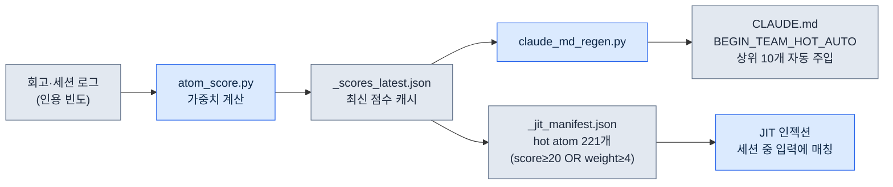
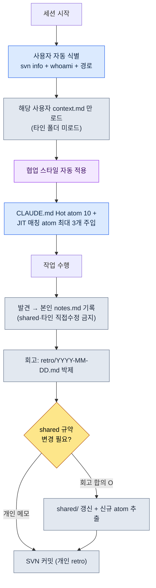

# 20.1 1인 DD(Design Director, 디자인 디렉터)가 5인분 협업 메모리를 운영한다 — team_memory 시스템

> 본 장에서 'DD'는 디자인 디렉터를 가리킨다.

> 1차 독자: 소규모 팀에서 협업 컨텍스트를 혼자 떠안은 디렉터·리드 (중규모(10\~50인) 팀)
> 1인/취미 독자용 축소 버전: §20.1.7 「혼자라면 이만큼만」

월요일 아침, 같은 회의실에서 세 명에게 같은 결정을 세 번 설명한 적이 있다. 한 명에게는 "쿨타임은 xlsm 수정 전에 SVN update부터"라고 말했고, 두 시간 뒤 다른 한 명이 같은 파일을 update 없이 덮어써서 충돌이 났고, 오후에 또 한 명이 똑같이 물었다. 셋 다 좋은 사람들이었다. 문제는 그들이 아니라, 결정이 내 머릿속에만 있었다는 점이다. 중규모 팀의 디렉터 한 명이 네 명분의 협업 맥락 — 누가 어떤 규칙을 알고, 누가 무엇을 자주 틀리고, 어떤 결정이 이미 났는지 — 을 사람 기억으로 일관되게 굴리는 건 불가능하다. 한 달만 지나도 "그거 전에 정하지 않았나?"가 회의 시간의 절반을 먹는다.

이 장은 그 문제를 끝낸 시스템을 다룬다. 핵심 자산은 두 가지다. 첫째, 팀 전체가 공유하는 **결정 카드 304개**(atom). 둘째, 그 위에 얹은 **5인 team_memory** — 본인(leeminsoo)과 팀원 A·B·C(가명), 그리고 shared 폴더로 나뉜 사용자별 컨텍스트 저장소다. Claude가 세션 시작 때 "지금 키보드 앞에 누가 앉았는지"를 스스로 식별하고, 그 사람의 협업 스타일만 골라 입는다. 협업 메모리의 일반론은 다른 책에도 있다. 이 장은 그 메모리를 *AI가 자동으로 분기·주입하는 자리*에만 집중한다.

이 장의 수치는 모두 2026년 5월 인벤토리 시점의 실측값이다.

---

## 20.1.1 결정이 머릿속에 있으면 팀은 같은 실수를 반복한다

협업 메모리를 "공유 위키"로 푸는 책은 많다. 노션에 결정 페이지를 만들고, 다 같이 본다는 이야기다. 맞는 말이지만, 위키는 두 가지를 못 한다. 사람이 입력할 때만 보이고, 사람이 찾을 때만 읽힌다. 회의 한가운데서 누가 "그거 위키에 적어뒀나?"를 물으러 가지 않는다.

그래서 결정을 **검색·인용·자동 주입이 가능한 원자 단위 파일**로 박제한다. 이걸 atom이라고 부른다. atom 1개는 결정 1개다. 파일명이 곧 식별자라서 `rg`로 찾히고, frontmatter가 표준이라서 스크립트가 처리하고, 본문은 짧아서 컨텍스트에 통째로 들어간다. 회사 PC의 `workspace/team_memory/atoms/` 아래에 이런 atom이 304개 쌓여 있다.

| 폴더 | 개수 | 성격 |
|---|---|---|
| `rules/` | 304 | 재발 방지 규칙 (xlsm·SVN·문서·스킬 등) |
| `concepts/` | 19 | 회고에서 반복 등장한 도메인 어휘 |
| `decisions/` | 26 | 날짜·당사자·근거 명시된 결정 |
| `feedback/` | 11 | 협업 교정 루프 (실수 → 교훈) |
| `rnd/` | 4 | 도구 패치 시 무효화 가능한 미확정 관찰 |

합 304개다. 이 다섯 폴더가 팀의 "장기 기억"이다. 핵심은 폴더 이름이 곧 atom의 신뢰 등급이라는 점이다. `rules/`는 다수 재발로 검증된 규칙이고, `rnd/`는 UE 버전이 바뀌면 폐기될 수 있는 임시 관찰이다. 같은 메모리 안에서도 "확정"과 "가설"이 폴더로 갈린다. 그래서 신규 멤버가 `rnd/`의 우회법을 영구 규칙으로 오해하는 사고를 구조적으로 막는다.

> atom의 5속성 정의(1결정 원칙·명시적 명명·frontmatter 표준·관계 명시·추적 가능)는 5부에서 다뤘다. 이 장은 정의가 아니라 *304개를 5인이 함께 운영하는 자리*를 다룬다.

---

## 20.1.2 Hot atom — 자주 쓰이는 결정이 스스로 위로 떠오른다

304개를 매 세션 다 읽힐 수는 없다. 그래서 atom마다 **score**(가중치)를 매기고, 점수 높은 것만 자동으로 노출한다. 점수는 사용 빈도·수동 가중치·최신성으로 `atom_score.py`가 계산한다. 아래는 2026년 5월 실측 기준 상위 10개의 실측 score다.

| score | atom | 무엇을 강제하나 |
|---|---|---|
| 356.53 | `view_html_filename_convention` | View_*.html 명명 규약 (Phase/Status → Domain → Topic) |
| 349.26 | `xlsm_svn_update_before_edit` | xlsm 수정 전 SVN update + 기존 행 보존 |
| 341.03 | `claude_role_transition_phase2` | Claude를 passive trainee → active partner로 격상 (결정) |
| 340.26 | `skill_audit_score` | SVN 로그 기반 스킬 사용 빈도 측정 |
| 329.26 | `docs_is_source_of_truth` | workspace/docs를 정본으로 |
| 326.84 | `claudeskills_naming_separation` | ClaudeSkills vs 게임 내 캐릭터 스킬 명칭 분리 |
| 324.36 | `draft_doc_body_verify_before_skip` | 위치만으로 skip 금지, 본문 grep 후 평가 |
| 309.43 | `json_over_schema_doc_as_source_of_truth` | 실제 JSON 출력이 스키마 문서보다 정본 |
| 294.93 | `integrity_check_clickup_notify` | 정합성 실패 시 ClickUp 즉시 통보 |
| 293.26 | `data_entry_schema_first` | 데이터 입력 순서 ($스키마 → Enum → proto) |

서두에서 세 번 설명했던 그 사고 — "xlsm 수정 전에 SVN update부터" — 가 보이는가. 그게 `xlsm_svn_update_before_edit`이고, score 349.26으로 전체 2위다. 점수가 높다는 건 그만큼 자주 인용되고, 그만큼 자주 틀리던 규칙이라는 뜻이다. 더는 내가 입으로 세 번 말하지 않는다. score 상위 10개는 `CLAUDE.md`의 `<!-- BEGIN_TEAM_HOT_AUTO -->` 영역으로 자동 주입돼, 누가 어느 폴더에서 세션을 열든 첫 화면에 실려 나온다.

여기서 멈추면 그냥 "자주 보는 규칙 핀 고정"이다. 진짜 차별점은 score가 사람 손이 아니라 **시스템이 자기 자신을 측정해서** 매겨진다는 점이다.



루프가 닫혀 있다. atom이 회고에서 자주 인용될수록 score가 오르고, score가 오르면 CLAUDE.md 상단과 JIT 매니페스트로 더 잘 노출되고, 잘 노출되니 또 인용된다. 자주 쓰는 결정이 *스스로* 위로 떠오르는 구조다. 반대로 6개월간 인용 0인 atom은 score가 가라앉아 자연히 시야에서 사라진다. 사람이 "이건 이제 안 쓰니 내리자"를 판단할 필요가 없다.

---

## 20.1.3 JIT 주입 — 입력 한 줄이 관련 결정 3개를 끌어온다

score는 "항상 보이는 것"을 정하고, JIT(Just-In-Time) 주입은 "방금 한 말에 맞는 것"을 끌어온다. 사용자가 프롬프트를 입력하는 순간, hook이 그 텍스트를 atom 매니페스트의 regex와 대조해 관련 atom을 컨텍스트에 끼워 넣는다.

이 hook의 핵심 로직은 회사 PC `inject_atom.py`의 패턴을 그대로 따른다. 아래는 개인 PC용으로 재작성한 동일 패턴의 `inject_memory.py` 실제 핵심부다 — score 내림차순 정렬 → regex 매칭 → 최대 3개 → 6000자 truncate, 그리고 무슨 일이 있어도 exit 0.

```python
# score 내림차순 정렬 후 매칭
atoms_sorted = sorted(atoms, key=lambda a: a.get("score", 0), reverse=True)

matches = []
for atom in atoms_sorted:
    if len(matches) >= max_matches:          # max_matches = 3
        break
    try:
        if re.search(atom["regex"], prompt, re.IGNORECASE):
            matches.append(atom)
    except re.error:
        continue                              # 잘못된 regex는 건너뛰고 계속

if not matches:
    emit_empty()                              # 매칭 없으면 빈 응답 (정상)
    return

chunks = []
for atom in matches:
    body = atom_path.read_text(encoding="utf-8")
    if len(body) > max_body:                  # max_body = 6000
        body = body[:max_body] + "\n\n[...truncated]\n"
    chunks.append(f"\n\n=== [JIT Inject] {name} (score {score}) ===\n\n{body}\n...")
```

설계가 보수적이라는 점이 중요하다. 매칭이 안 되면 빈 응답을 내고 끝낸다(정상). regex가 깨져 있으면 그 atom만 건너뛰고 계속 돈다. 본문이 6000자를 넘으면 자른다. 그리고 hook 전체가 어떤 예외에서도 `exit 0`으로 끝난다 — 메모리 주입이 실패해도 사용자의 작업 흐름은 절대 멈추지 않는다. "있으면 돕고, 없거나 깨지면 조용히 빠진다"가 이 시스템의 1번 원칙이다.

---

## 20.1.4 [워크드 트랜스크립트] 세션을 열면 Claude가 "당신이 누구인지"를 먼저 알아낸다

여기까지가 atom(장기 기억)이라면, 이제 5인 team_memory(사람별 단기·협업 기억)다. 실제 한 세션의 시작을 입력 → 동작 → 결과로 끝까지 따라가 본다. 무대는 회사 PC, 팀원 C(가명, 폴더 `팀원 C/`)가 자기 자리에서 프로젝트 A 작업 폴더를 연 상황이다.

### 1단계 — 입력: 평범한 첫 프롬프트 한 줄

팀원 C는 특별할 것 없이 작업을 시작한다.

```text
어제 정한 타게팅 시스템 초안 이어서 검토하자.
```

자기가 누구인지, 어떤 규칙을 따라야 하는지 한 마디도 적지 않았다. 적을 필요가 없다.

### 2단계 — 동작: Claude가 사용자를 자동 식별한다

`CLAUDE.md`의 "세션 시작 자동 식별" 절차에 따라, Claude는 답을 만들기 전에 먼저 키보드 앞의 사람을 알아낸다. 실행하는 명령은 셋이다.

```bash
svn info --show-item last-changed-author   # SVN 작업 사본의 최근 커밋 author
whoami                                      # OS 로그인 계정
# 그리고 현재 작업 경로(어느 PC의 어느 사용자 폴더인지)
```

세 신호가 `team_memory/users.md`의 매핑과 대조돼 `팀원 C`로 확정된다. 그다음 Claude는 **그 사용자 폴더 하나만** 로드한다.

```text
team_memory/
├── atoms/                       ← 공유 (304개, score 상위는 이미 CLAUDE.md에)
├── leeminsoo/    context.md     ← (로드 안 함 — 내가 아님)
├── teammate_a/   context.md     ← (로드 안 함)
├── teammate_b/   context.md     ← (로드 안 함)
├── teammate_c/   context.md     ← ★ 이것만 로드
│                 notes.md       ← ★ 본인 발견 기록용
│                 retro/
└── shared/       conventions.md  commit_rules.md  ...  ← 규약만 참조, 수정 금지
```

### 3단계 — 결과: 그 사람의 협업 스타일이 자동으로 입혀진다

`팀원 C/context.md`에 담긴 협업 스타일이 이 세션에만 적용된다. 그래서 Claude의 응답이 이렇게 시작한다.

```text
팀원 C 님으로 식별했습니다 (svn author: teammate_c / 경로 확인).
teammate_c/context.md 협업 스타일 로드 완료.

어제 작업분(Draft_Targeting_System_v0.1.md) 이어서 검토하겠습니다.
주입된 관련 결정 카드 (JIT, 3건):
  - docs_is_source_of_truth (329.26)
  - draft_doc_body_verify_before_skip (324.36) — 위치만으로 skip 금지, 본문 grep 후 평가
  - decision_summary_not_clickup_mirror

먼저 본문을 grep으로 확인한 뒤 검토를 시작합니다. 검토 중 발견한 사항은
teammate_c/notes.md 에만 기록하고, shared/ 는 직접 수정하지 않겠습니다.
```

### 4단계 — 사람의 검증과 경계 확인

여기서 내가(디렉터로서, 혹은 팀원 C 본인이) 확인하는 건 두 가지다. 식별이 맞는지, 그리고 경계를 지키는지. Claude의 다음 제안에서 경계 위반을 한 번 잡아낸다.

```text
[Claude 제안]
검토 결과 명명 규칙 충돌을 발견했습니다. shared/conventions.md 의 타게팅
용어 항목을 바로 수정해 둘까요?

[사람의 거부]
아니요. shared/ 는 회고 합의 후에만 수정합니다. 지금은 teammate_c/notes.md 에
"conventions.md 타게팅 용어 충돌 — 회고 안건" 으로만 적어 두세요.

[Claude 재요청 후 결과]
이해했습니다. shared/ 직접 수정 취소.
teammate_c/notes.md 에 회고 안건으로 기록했습니다:
  - 2026-06-06 conventions.md 타게팅 용어 'lock-on' vs 'target-lock' 충돌
    → 다음 팀 회고에서 합의 필요 (shared 수정 보류)
```

이게 5인 운영의 안전장치다. 각 사용자는 **자기 notes.md에만** 쓴다. 타인 폴더와 shared는 직접 못 건드린다. shared는 오직 회고에서 합의된 뒤에만 바뀐다. 그래서 네 사람이 같은 메모리 위에서 일해도 서로의 컨텍스트를 덮어쓰지 않는다. 발견은 개인 노트에 모였다가, 회고라는 게이트를 통과해야만 팀 공유 규약으로 승격된다.

---

## 20.1.5 5인 운영의 전체 흐름 한 장

세션 하나가 도는 전체 경로를 한 장으로 본다. 식별에서 시작해 회고에서 박제로 끝나는 한 사이클이다.



오른쪽 아래 분기점이 이 시스템의 심장이다. 개인이 발견한 건 개인 notes로 흐르고, 팀 전체에 영향을 주는 규약·신규 atom은 회고 게이트를 통과한 뒤에만 shared로 올라간다. 1인이 5인분을 굴려도 충돌이 안 나는 이유가 이 한 번의 게이트에 있다. 그리고 마지막은 반드시 SVN 커밋이다 — 박제되지 않은 발견은 다음 세션에서 다시 머릿속으로 돌아가기 때문이다.

---

## 20.1.6 흔한 실패와 처방

5인 team_memory를 굴리며 실제로 밟은 지뢰들이다.

| 실패 | 증상 | 처방 |
|---|---|---|
| 식별 실패 | svn author가 공용 계정이라 사용자 미특정 | `users.md`에 경로·계정 다중 신호 매핑, 미특정 시 질문 |
| shared 무단 수정 | Claude가 친절하게 공유 규약을 고침 | "shared는 회고 합의 후만" atom + 워크드 거부 패턴 |
| notes 미커밋 | 발견이 로컬에만 남아 다음 세션에 증발 | 회고 마무리에 SVN 커밋 강제 (`feedback-svn-zero-red`) |
| Hot atom 박제 | score가 멈춰 옛 규칙이 상단 고정 | `atom_score.py` 주기 실행 → `_scores_latest.json` 갱신 |
| rnd를 규칙으로 오해 | 신규 멤버가 임시 우회법을 영구 규칙처럼 적용 | `rnd/` 폴더 격리 + frontmatter에 무효화 조건 명시 |

여기서 가장 비싼 실패는 두 번째 줄, "shared 무단 수정"이다. AI는 도우려는 본능이 강해서, 충돌을 발견하면 바로 고치려 든다. §20.1.4의 워크드 거부가 단발 교정이 아니라 atom으로 박제돼 있어야, 다음에 다른 사용자 세션에서도 같은 선을 긋는다.

---

## 20.1.7 혼자라면 이만큼만

팀이 없어도 이 구조의 8할은 1인이 그대로 쓸 수 있습니다. 사용자 5명을 폴더 1개로 줄이면 됩니다.

- **atom 폴더 2개만.** `rules/`(확정)와 `rnd/`(가설)만 나눕니다. 자주 틀리는 규칙 5\~10개를 atom으로 박제하는 것만으로 "전에 정하지 않았나?"가 사라집니다.
- **JIT는 score 없이 시작.** 매니페스트에 regex만 적고 score는 전부 동일하게 둡니다. 매칭 atom 3개 주입만으로도 효과가 납니다.
- **notes는 한 파일.** 사용자 분기 없이 `notes.md` 하나입니다. 회고 게이트만 살리세요 — 즉흥 메모는 notes에, 확정 규칙은 회고를 거쳐 `rules/`로.

핵심은 "결정을 머릿속에서 파일로 옮기는 것"이고, 5인이든 1인이든 그 동작은 같습니다.

---

### 따라하기 — 오늘 할 수 있는 한 단계

자주 틀리는 규칙 하나를 atom으로 박제하고 JIT로 자동 주입되게 만들어 보세요.

1. **setup** — `atoms/rules/` 폴더를 만들고, 가장 자주 반복 설명하는 규칙 1개를 파일로 적습니다. 예: `atoms/rules/xlsm_svn_update_before_edit.md`.
2. **prompt** — 그 atom의 본문에 「언제·무엇을·왜」 세 줄을 적습니다. ("xlsm 수정 전 반드시 SVN update — 안 하면 타인 행 덮어씀.")
3. **verify** — JIT 매니페스트에 `{"name":..., "regex":"xlsm|쿨타임", "score":100, "path":...}`를 추가하고, 프롬프트에 "쿨타임 수정"을 입력해 `_injection_log.txt`에 해당 atom이 hit으로 찍히는지 확인하세요.

찍혔다면, 그 규칙은 이제 당신 머릿속이 아니라 시스템 안에 있습니다.

---

### 이 챕터의 핵심 메시지

- 결정을 머릿속이 아니라 atom 파일로 옮긴다.
- score·JIT가 자주 쓰는 결정을 스스로 띄운다.
- shared는 회고 게이트를 통과해야만 바뀐다.

### 다음 챕터 미리보기

- 20.2 팀원별 메모리 — 사용자 칸과 공유 칸을 도구로 분리해 실험값이 결정으로 둔갑하는 사고를 막는다
