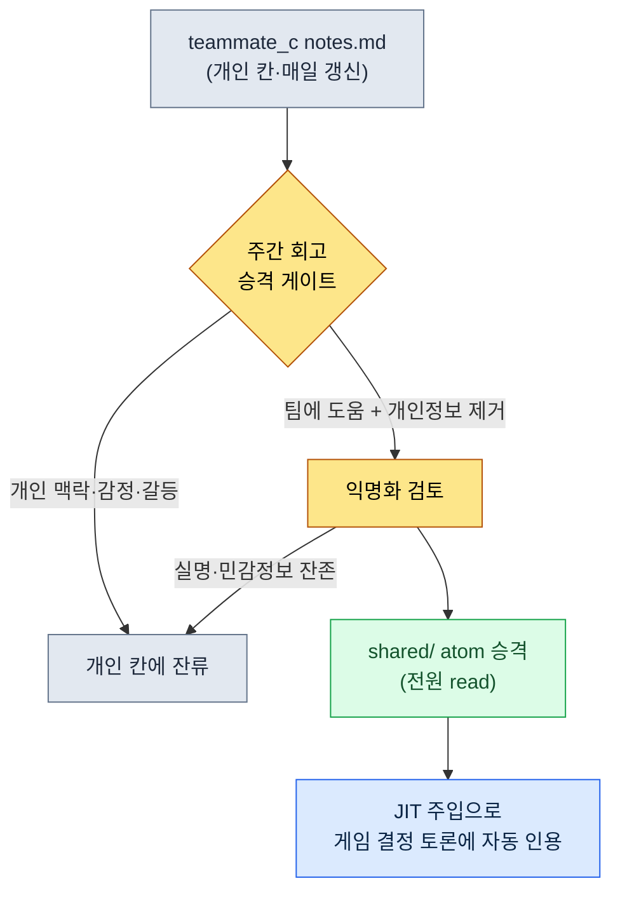

# 20.2 팀원별 메모리 — 사용자 칸과 공유 칸의 분리

수요일 점심 무렵, 팀원 B가 팀 메신저로 메시지를 보냈다. "지난주에 디렉터님이 전투 쿨다운 0.8초로 정한 거, 제 메모에 0.6초로 적혀 있는데 어느 게 맞아요?" 나는 잠깐 멍해졌다. 0.8초는 공유 결정이고, 0.6초는 팀원 B가 자기 테스트 빌드에서 임시로 돌려보던 값이었다. 둘 다 "메모리"에 적혀 있었다. 문제는 그 둘이 같은 칸에 섞여 있었다는 거다. 팀원 B는 자기 실험값을 회사 결정으로 착각했고, 하마터면 잘못된 값으로 데이터시트를 갱신할 뻔했다.

이 사고는 메모리에 데이터가 없어서 난 게 아니다. 오히려 데이터가 너무 잘 쌓여 있는데, 어느 칸이 공유 칸이고 어느 칸이 개인 칸인지 경계가 없어서 났다. §20.1에서 다섯 명이 같은 사실(shared atom)을 본다는 셀링포인트를 깔았다면, 이 챕터는 그 반대편 — **다섯 명이 각자 자기 칸을 따로 가진다**는 이야기다. 같은 캐비닛인데 칸이 두 종류라는 것. 그리고 그 두 종류를 도구로 강제하지 않으면 위의 0.6초 사고가 반드시 난다는 것.

---

## 20.2.1 다섯 칸의 캐비닛

프로젝트 A의 `team_memory/`는 다섯 사람의 칸으로 나뉜다. 본인(leeminsoo)을 포함해 팀원 A, 팀원 B, 팀원 C, 그리고 `shared`. 앞의 넷은 사용자별 개인 칸이고, 마지막 하나는 모두가 여는 공유 칸이다.

<svg viewBox="0 0 720 250" xmlns="http://www.w3.org/2000/svg" font-family="sans-serif" font-size="13">
  <rect x="10" y="10" width="700" height="230" fill="#fafafa" stroke="#ccc" rx="6"/>
  <text x="30" y="38" font-weight="bold" font-size="15">team_memory/  (캐비닛 1개)</text>
  <!-- 개인 칸 4 -->
  <g>
    <rect x="30" y="60" width="150" height="160" fill="#eef4ff" stroke="#5a7fbf" rx="4"/>
    <text x="105" y="84" text-anchor="middle" font-weight="bold">leeminsoo/</text>
    <text x="105" y="106" text-anchor="middle" font-size="11" fill="#555">디렉터 (본인)</text>
    <line x1="42" y1="118" x2="168" y2="118" stroke="#cdd" />
    <text x="105" y="140" text-anchor="middle" font-size="11">context.md</text>
    <text x="105" y="160" text-anchor="middle" font-size="11">notes.md</text>
    <text x="105" y="180" text-anchor="middle" font-size="11">+ 전략/평가</text>
    <text x="105" y="205" text-anchor="middle" font-size="10" fill="#a33">최고 보호등급</text>
  </g>
  <g>
    <rect x="195" y="60" width="120" height="160" fill="#eef4ff" stroke="#5a7fbf" rx="4"/>
    <text x="255" y="84" text-anchor="middle" font-weight="bold">팀원 A/</text>
    <line x1="207" y1="118" x2="303" y2="118" stroke="#cdd" />
    <text x="255" y="140" text-anchor="middle" font-size="11">context.md</text>
    <text x="255" y="160" text-anchor="middle" font-size="11">notes.md</text>
  </g>
  <g>
    <rect x="330" y="60" width="120" height="160" fill="#eef4ff" stroke="#5a7fbf" rx="4"/>
    <text x="390" y="84" text-anchor="middle" font-weight="bold">팀원 B/</text>
    <line x1="342" y1="118" x2="438" y2="118" stroke="#cdd" />
    <text x="390" y="140" text-anchor="middle" font-size="11">context.md</text>
    <text x="390" y="160" text-anchor="middle" font-size="11">notes.md</text>
  </g>
  <g>
    <rect x="465" y="60" width="120" height="160" fill="#eef4ff" stroke="#5a7fbf" rx="4"/>
    <text x="525" y="84" text-anchor="middle" font-weight="bold">팀원 C/</text>
    <line x1="477" y1="118" x2="573" y2="118" stroke="#cdd" />
    <text x="525" y="140" text-anchor="middle" font-size="11">context.md</text>
    <text x="525" y="160" text-anchor="middle" font-size="11">notes.md</text>
  </g>
  <!-- 공유 칸 -->
  <g>
    <rect x="600" y="60" width="90" height="160" fill="#fff2e0" stroke="#c98a3a" rx="4"/>
    <text x="645" y="84" text-anchor="middle" font-weight="bold">shared/</text>
    <line x1="612" y1="118" x2="678" y2="118" stroke="#e3c">  </line>
    <text x="645" y="142" text-anchor="middle" font-size="11">atom</text>
    <text x="645" y="162" text-anchor="middle" font-size="11">(공유)</text>
    <text x="645" y="205" text-anchor="middle" font-size="10" fill="#a33">전원 read</text>
  </g>
</svg>

개인 칸 네 개는 파란색, 공유 칸 하나는 주황색으로 칠해 두었다. 색이 다른 이유는 접근 규칙이 다르기 때문이다. 파란 칸은 본인과 디렉터만 열고, 주황 칸은 전원이 연다. 0.6초 사고는 팀원 B가 자기 파란 칸에 적어야 할 실험값을, 색 구분 없이 그냥 "메모리"라고 부르며 공유 결정처럼 취급한 데서 났다. 칸을 물리적으로 나누면 — 즉 디렉토리를 나누면 — 적어도 어디에 적었는지로 둘을 구별할 단서가 생긴다.

여기서 핵심은 폴더 두 개가 아니라 **칸마다 규칙이 따라붙는다**는 점이다. `shared/`에 들어가는 건 회사 결정이고 누구나 읽는다. `팀원 B/`에 들어가는 건 그 사람의 작업 맥락이고 본인과 나만 읽는다. 같은 0.6초라도 어느 칸에 있느냐에 따라 "실험 중"인지 "결정됨"인지가 갈린다.

---

## 20.2.2 한 사람 칸 안에는 두 파일이 있다

사용자별 칸을 열면 두 개의 파일이 보인다. `context.md`와 `notes.md`. 이름은 단순하지만 역할이 정반대다.

`context.md`는 **그 사람이 지금 누구인가**를 적는다. 역할, 담당 시스템, 진행 중인 작업, 작업 스타일. 비교적 안정적이고, 디렉터인 내가 1:1을 앞두고 5분 전에 펼쳐 보는 파일이다. 팀원 A의 `context.md`를 열면 "전투 시스템 담당, 현재 스킬 쿨다운 밸런싱 진행 중, 데이터 근거를 먼저 요구하는 스타일" 같은 게 적혀 있다. 이걸 안 보고 1:1에 들어가면 첫 10분을 "요즘 뭐 하세요?"로 날린다.

`notes.md`는 **그 사람이 지금 뭘 겪고 있나**를 적는다. 그날그날의 실험값, 막힌 지점, 작은 결정, 실수 기록, 다른 멤버와의 협의 메모. 휘발성이 높고 자주 갱신된다. 팀원 B의 0.6초는 원래 여기 들어가야 했다. "0.6초로 테스트해 봄, 너무 빨라서 입력이 밀림 — 0.8초 공유 결정 따르기로" 이렇게.

이 두 파일을 나누는 이유는 갱신 주기가 다르기 때문이다. `context.md`는 분기에 한 번 손보면 되지만 `notes.md`는 매일 쌓인다. 섞어 두면 안정적인 정보가 매일의 노이즈에 묻힌다. 1인으로 일한다면 이 분리가 과해 보일 수 있다 — 그땐 `notes.md` 하나만 운영하고 `context.md`는 머릿속에 둬도 된다. 하지만 사람이 둘만 넘어가도, 남의 `context.md`를 5분 만에 읽어 1:1을 준비할 수 있다는 건 큰 차이다.

---

## 20.2.3 회고가 shared로 올라가는 게이트

개인 칸과 공유 칸을 나눴다고 끝이 아니다. 가장 까다로운 건 **개인 칸의 어떤 내용은 공유 칸으로 올라가야 한다**는 점이다. 팀원 C가 "데이터시트 import 시 enum 순서가 어긋나면 런타임에서 조용히 깨진다"는 실수를 자기 `notes.md`에 적었다고 하자. 이건 그 사람 개인 기록이지만, 팀 전체가 알면 같은 실수를 막는다. 그렇다고 개인 `notes.md` 전체를 공유하면 안 된다 — 거기엔 작업 스타일, 막혔던 감정, 다른 멤버와의 갈등 같은 게 섞여 있다.

그래서 개인 → 공유 사이에는 **게이트**가 있어야 한다. 회고가 그 게이트다. 회고를 쓸 때 "이번 주 내가 겪은 것 중 팀이 알아야 할 게 뭔가"를 한 번 거르고, 거른 것만 `shared/` atom으로 승격한다. 흐름은 이렇다.

게이트의 판단 기준은 두 개다. **첫째, 팀에 도움이 되는가.** 개인 취향이나 그날의 컨디션은 아니다. 둘째, **개인정보가 제거되는가.** "팀원 C가 또 enum에서 실수했다"가 아니라 "데이터시트 import 시 enum 순서 검증을 추가하자"로 사실만 남긴다. 두 관문을 통과한 것만 `shared/`로 간다. 통과 못 한 건 개인 칸에 그대로 둔다.

이 게이트가 없으면 둘 중 하나로 망한다. 게이트가 너무 헐거우면 개인 정보가 공유 칸으로 새어 0.6초 사고의 반대 — 사적인 메모가 전원에게 노출되는 — 사고가 난다. 게이트가 아예 없으면 팀원 C의 enum 교훈이 그 사람 칸에 갇혀 팀원 A가 같은 실수를 반복한다. 회고를 게이트로 쓰면 "개인 정보 누설"과 "학습 자산화"라는 정반대 두 일을 한 동작으로 분리할 수 있다.

내가 실제로 쓰는 승격 프롬프트는 짧다. 회고 직후 이렇게 던진다.

> "이번 주 내 notes.md에서 팀 전체에 도움 될 항목만 골라라. 각 항목에서 사람 이름·구체적 실패 정황은 빼고, '무엇을 어떻게'만 남긴 atom 후보 문장으로 다시 써라. 개인 감정·스타일·갈등 메모는 후보에서 제외하고, 제외한 이유를 한 줄로 표기하라."

마지막 문장 — 제외 이유를 적게 한 것 — 이 중요하다. AI가 무엇을 안 올렸는지 보여 주면, 게이트가 너무 빡빡해서 진짜 교훈까지 막고 있지 않은지 사람이 검수할 수 있다.

---

## 20.2.4 워크드 트랜스크립트 — 승격 게이트가 거부당하는 순간

게이트가 항상 깔끔하게 작동하는 건 아니다. 실제로는 AI가 한 번에 못 맞히고, 사람이 거부하고, 다시 시키는 왕복이 일어난다. 팀원 B의 한 주 `notes.md`를 shared로 올리려던 실제 왕복을 그대로 옮긴다.

**[프롬프트 — 1차]**

> "아래는 팀원 B의 이번 주 notes.md다. 팀 전체에 도움 될 항목만 shared atom 후보로 뽑아라. 사람 이름과 구체적 실패 정황은 제거하고 '무엇을 어떻게'만 남겨라.
> ---
> - 화/0.6초 쿨다운 테스트, 입력 밀림. 0.8초 공유결정 따름
> - 수/팀원 A가 짠 스킬 enum이 내 import랑 충돌. 팀원 A한테 직접 말하기 좀 그래서 디렉터 통해 전달
> - 목/포탈웹 View_skill_table.html 새로고침하면 필터 초기화됨. 짜증
> - 금/컨디션 안 좋아서 오후 반차"

**[Claude 날것 출력 — 1차]**

> 다음 4개 항목을 shared atom 후보로 추출했습니다.
> 1. 전투 쿨다운은 0.6초에서 입력 밀림이 발생하므로 0.8초를 기준으로 한다.
> 2. 팀원 A가 작성한 스킬 enum과 import가 충돌하므로, enum 변경 시 사전 공유가 필요하다.
> 3. View_skill_table.html은 새로고침 시 필터 상태가 초기화되므로 상태 보존 기능이 필요하다.
> 4. (제외) 금요일 오후 반차 — 개인 일정으로 판단되어 제외했습니다.

여기서 나는 **2번을 거부했다.** "팀원 A가 작성한"이 그대로 남아 있다. 사람 이름은 뺐지만 "누가 짠 enum"인지 특정되고, 게다가 "직접 말하기 그래서 디렉터 통해 전달"이라는 *개인 갈등 맥락*이 사실 항목으로 둔갑했다. 이건 학습 자산이 아니라 1:1에서 따로 다룰 관계 이슈다. 그대로 shared에 올리면 팀원 A가 공유 칸에서 자기 이름이 명시된 충돌 기록을 보게 된다.

**[사람 검증/거부 → 재요청]**

> "2번은 거부한다. enum 충돌은 사실로 남길 가치가 있지만, 특정인이 작성했다는 정보와 전달 경로(누구를 통해 말했는지)는 개인 관계 영역이다. 그 둘을 빼고 '데이터 충돌을 막는 절차'로만 다시 써라. 그리고 3번 포탈웹 버그는 atom이 아니라 포탈 이슈 트래커로 갈 항목이니 후보에서 빼고 그 이유를 적어라."

**[Claude 날것 출력 — 2차]**

> 수정했습니다.
> 2. (개정) 스킬 enum을 변경할 때는 데이터시트를 import하는 다른 작업자와 사전에 공유한다. enum 순서·값 변경은 import 측에서 조용히 깨질 수 있다.
> 3. (제외) View_skill_table.html 필터 초기화 — 도구 버그로, shared atom보다 포탈 이슈 항목이 적절하여 후보에서 제외했습니다.
> 최종 shared 승격 후보: 1번(쿨다운 0.8초), 2번(enum 변경 사전 공유). 2건.

2차는 통과시켰다. 2번에서 사람도 전달 경로도 사라지고 절차만 남았다. 4건으로 시작해 2건이 shared로 올라갔고, 1건은 개인 칸에 남고(반차) 1건은 포탈 이슈로 갈렸다(필터 버그). 이게 게이트가 실제로 작동하는 모습이다 — 한 번에 안 되고, 사람이 한 번 거부하고, 무엇이 왜 빠지는지가 기록으로 남는다. 요약하면 깔끔해 보이지만, 깔끔한 요약만 보면 2번이 처음에 사람 이름을 달고 올라올 뻔했다는 사실이 지워진다. 그 위험이 이 게이트의 존재 이유다.

---

## 20.2.5 JIT 주입 — 어느 칸을 펼칠지가 곧 인터페이스

칸을 나누고 게이트를 세워도, 대화할 때마다 어느 칸을 손으로 펼치면 운영이 무겁다. 그래서 마지막 조각은 **대화 맥락에 맞는 칸이 자동으로 펼쳐지는 것**이다. 본인 PC에서는 이걸 UserPromptSubmit 훅(`inject_memory.py`)이 한다. 입력 문장에 매칭되는 칸만 골라 컨텍스트에 주입한다.

규칙은 단순하다. 게임 결정을 토론하면 `shared/` atom이 펼쳐진다. 특정 팀원과의 1:1을 준비하면 그 사람 `context.md` + `shared`가 함께 펼쳐진다. 분기 회고를 쓰면 프로젝트 메모리 + 디렉터 본인 칸이 펼쳐진다. 외부 보고서를 쓰면 디렉터 칸 + shared 일부가 펼쳐진다. 어느 칸을 펼칠지가 곧 메모리의 인터페이스다.

여기서 칸 분리가 다시 효력을 낸다. 1:1 준비 때 팀원 B의 개인 칸은 펼쳐지지만 팀원 C의 개인 칸은 안 펼쳐진다 — 지금 대화와 무관하니까. 칸이 안 나뉘어 있으면 매번 전부 펼쳐져 노이즈에 묻히고, 더 나쁘게는 1:1 자리에서 무관한 사람의 개인 메모가 끌려 나온다. 분리는 보안인 동시에 주입 정확도다.

---

## 20.2.6 같은 데이터, 여러 PC — 동기화 사고를 막는 자리

칸 구조가 잡혀도 마지막 함정이 하나 남는다. 나는 집 PC와 회사 PC를 오가고, 메모리는 클라우드 폴더로 동기화된다. 여기서 두 PC가 같은 칸을 동시에 고치면 충돌이 난다. 한쪽이 다른 쪽을 통째로 덮어쓰면 그날의 `notes.md`가 사라진다.

처방은 칸 단위로 다르다. 자주 갱신되는 개인 `notes.md`는 git 같은 머지 가능한 저장소에 두고, 충돌 시 양쪽을 합친다. 안정적인 `context.md`나 `shared/` atom은 갱신 빈도가 낮아 잠금이나 일일 백업으로 충분하다. 핵심은 "동기화가 한쪽을 덮어쓰는 동작"을 기본값에서 빼는 것이다. 잘못된 폴더 권한으로 개인 칸이 공유 폴더에 섞여 동기화되는 것 — 그게 가장 조용하고 치명적인 사고다. 칸마다 어느 동기화 영역에 속하는지를 명시해 두면, 0.6초 사고와 같은 계열의 "섞임" 사고를 입구에서 막는다.

---

## 따라하기

**setup**
1. `team_memory/` 아래에 사람별 폴더를 만드세요. 본인 + 팀원 각각, 그리고 `shared/` 하나. 폴더 이름은 가명으로(leeminsoo, 팀원 A …).
2. 각 개인 폴더에 `context.md`(안정적 — 역할·담당·스타일)와 `notes.md`(휘발성 — 매일의 실험·실수·결정) 두 파일을 둡니다.
3. `shared/`는 전원 read 권한, 개인 폴더는 본인 + 디렉터 read 권한으로 폴더 권한을 명시합니다.

**prompt** (주간 회고 직후, 개인 → shared 승격 게이트) — §20.2.3의 승격 프롬프트를 그대로 사용한다(사람 이름·실패 정황 제거 + '무엇을 어떻게'만 + 제외 이유 표기).

**verify**
1. 출력된 후보 문장에 사람 이름·전달 경로·감정 묘사가 남았는지 직접 읽으세요. 하나라도 있으면 거부하고 "그 정보를 빼고 절차만"으로 재요청합니다.
2. 통과한 후보만 `shared/` atom으로 옮기고, 뺀 항목은 개인 칸에 그대로 둡니다.
3. 동기화 폴더 권한을 확인합니다 — 개인 칸이 공유 폴더 경로에 들어가 있지 않은지 봅니다.

**1인 축소판**
혼자라면 폴더 다섯 개는 과합니다. `notes.md` 하나만 매일 쓰고, `context.md`는 머릿속에 두세요. 그래도 게이트는 살립니다 — 주 1회 "이 notes에서 다음에 다시 볼 가치가 있는 한 줄만 뽑아라"로 자기 노트를 거르면, 휘발성 메모와 자산화된 교훈이 갈립니다. 사람이 둘로 늘어나는 순간 그때 칸을 쪼개면 됩니다.

---

### 이 챕터의 핵심 메시지

- 메모리 캐비닛은 사용자별 개인 칸과 모두가 여는 공유 칸으로 나뉘며, 색이 다른 두 칸을 도구로 강제하지 않으면 실험값이 결정으로 둔갑한다.
- 개인 칸의 교훈을 공유로 올리는 길에는 회고라는 게이트가 있어, 학습 자산화와 개인정보 누설을 한 동작으로 갈라낸다.
- JIT 주입은 대화 맥락에 맞는 칸만 펼쳐, 칸 분리를 보안이자 주입 정확도로 동시에 작동시킨다.

### 다음 챕터 미리보기

- 20.3 포탈웹 구축 — 분산된 도구와 칸을 한 화면에서 접근하는 통합 인터페이스
