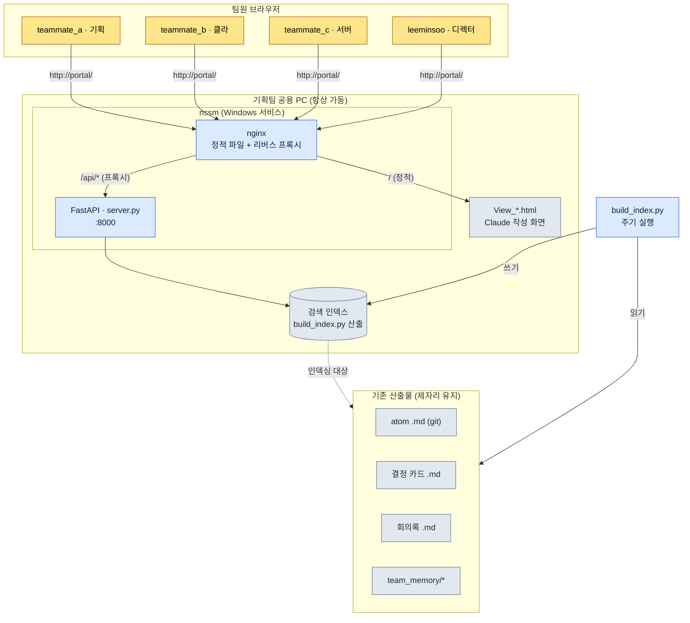

# 20.3 기획 포탈 — 팀이 브라우저로 들어오는 입구

목요일 늦은 오후, 빌드를 올리기 직전, 클라이언트 프로그래머 팀원 B가 사내 채팅에 글을 올린다. "지난주 전투 TF에서 글로벌 쿨다운 상수 0.8초로 합의한 거 맞나요? 어디 문서에 적혀 있죠?" 5분 뒤 기획자 팀원 A가 답한다. "회의록 어딘가에 있을 텐데… 찾는 중." 다시 7분 뒤. "git 어디 폴더더라."

이 12분짜리 왕복은 정보가 없어서 생긴 게 아니다. 정보는 분명히 있다. atom 파일에도, 회의록에도, 결정 카드에도 적혀 있다. 다만 그 셋이 서로 다른 서랍에 들어 있고, 각 서랍을 여는 방법이 다르다. 서랍이 아니라 서랍을 여는 손잡이가 문제다.

이 챕터는 그 손잡이를 하나로 합치는 이야기다. 자체 풀스택 개발이 아니라, 이미 폴더에 쌓여 있는 기획 산출물 위에 얇은 웹 한 겹을 덮어 팀원이 브라우저 주소창에 `portal` 한 단어만 쳐서 들어오게 만드는 구성이다. 핵심 도구는 세 가지뿐이다. Python으로 검색 API를 띄우는 FastAPI, 그 앞에 세우는 nginx, 그리고 사람이 끄지 않아도 PC가 켜져 있는 동안 계속 살아 있게 하는 nssm.

---

## 20.3.1 분산된 산출물, 통일된 입구

기획 산출물은 본래 흩어진다. 의도해서 흩어뜨리는 게 아니라, 각 산출물이 가장 자연스러운 자리에 떨어지기 때문이다. atom은 git 저장소의 마크다운으로, 일정은 태스크 관리 도구로, 실시간 대화는 채팅으로, KPI는 별도 대시보드로 간다. 각자 제자리에 있는 건 옳다. 문제는 그 제자리들을 사람이 머릿속에 지도로 갖고 있어야 한다는 점이다.

신규 입사자에게는 이 지도 자체가 진입 장벽이다. "글로벌 쿨다운 값"을 찾으려면 (1) 그게 결정 카드인지 atom인지 회의록인지 판단하고 (2) 해당 도구를 열고 (3) 그 도구의 검색 문법으로 다시 질의해야 한다. 세 단계 모두 경력에서 나오는 암묵지다.

포탈의 발상은 단순하다. 산출물은 지금 자리에 그대로 둔다. 대신 그 위에 검색용 인덱스 한 겹을 얹고, 인덱스를 브라우저로 노출한다. 책상을 일곱 개 두지 않고, 서랍이 일곱 개 달린 책상 하나를 둔다. 서랍은 그대로지만 사람은 한 번만 앉는다.

다음은 저자가 프로젝트 A에서 실제로 운영하는 포탈의 구성이다. 별도 서버 장비 없이, 기획팀 공용 PC 한 대에서 항상 켜진 상태로 돈다.



그림에서 회색으로 묶인 아래쪽이 이미 존재하던 산출물이고, 포탈이 새로 더한 것은 위쪽의 얇은 세 겹 — 인덱스, FastAPI, nginx — 뿐이다. 산출물에 손대지 않고 입구만 새로 낸 구조다.

---

## 20.3.2 네 개의 부품: build_index.py · server.py · nginx · nssm

포탈의 실체는 다섯 개의 작은 파일로 끝난다. 하나씩 보면 각자 한 가지 일만 한다.

**build_index.py — 산출물을 검색 가능한 형태로 변환한다.** git 저장소를 훑어 atom, 결정 카드, 회의록, `team_memory/` 아래의 마크다운을 모두 읽고, 제목·본문·태그를 추출해 하나의 인덱스 파일로 떨군다. 이 스크립트가 하는 일은 "흩어진 파일을 한 줄짜리 레코드로 평탄화"하는 것뿐이다. 파일 자체는 건드리지 않으므로, 인덱스가 깨져도 원본은 안전하다. 주기적으로(예: 30분마다, 혹은 git 커밋 훅으로) 다시 돌리면 최신 상태가 유지된다.

**server.py — FastAPI로 검색 API를 띄운다.** 인덱스를 메모리에 올려두고, `/api/search?q=...` 요청이 오면 매칭되는 레코드를 JSON으로 돌려준다. 코드는 한 화면을 넘지 않는다.

```python
# server.py (발췌 — 검색 엔드포인트 골격)
from fastapi import FastAPI
import json, pathlib

app = FastAPI()
INDEX = json.loads(pathlib.Path("index.json").read_text(encoding="utf-8"))

@app.get("/api/search")
def search(q: str):
    q = q.strip().lower()
    hits = [r for r in INDEX
            if q in r["title"].lower() or q in r["body"].lower()]
    # 종류별로 묶어서 반환 → atom / 결정 / 회의록 / 메모리
    by_kind = {}
    for r in hits:
        by_kind.setdefault(r["kind"], []).append(
            {"id": r["id"], "title": r["title"], "path": r["path"]})
    return {"query": q, "count": len(hits), "results": by_kind}
```

검색 알고리즘은 일부러 단순한 부분 문자열 매칭으로 시작한다. 팀이 중규모(10\~50인)이고 문서가 수천 건 규모일 때는 이 단순함이 오히려 유지보수 비용을 낮춘다. 형태소 분석이나 벡터 검색은 "검색이 약하다"는 불만이 실제로 나온 다음에 얹어도 늦지 않다.

**nginx — 정적 화면을 서빙하고 API로 프록시한다.** Claude에게 부탁해 만든 `View_*.html` 파일들(검색 화면, 결과 화면, 대시보드 화면)을 정적으로 내려주고, `/api/`로 들어온 요청만 뒤쪽 FastAPI(:8000)로 넘긴다. 팀원 입장에서는 화면도 검색도 전부 같은 `http://portal/` 주소 하나에서 일어난다. 화면을 Claude가 HTML로 직접 그려주기 때문에, 기획자가 새 화면이 필요하면 "결정 카드만 모아 보는 화면 하나 만들어줘"라고 요청해 `View_decisions.html`을 받아 폴더에 떨구는 것으로 끝난다. 프런트엔드 빌드 파이프라인이 없다는 점이 중규모 팀에서는 분명한 장점이다.

**nssm — 사람이 안 켜도 살아 있게 한다.** 포탈의 핵심 요구사항은 "내가 자리에 없어도 팀원이 검색할 수 있어야 한다"는 것이다. server.py를 터미널에서 띄우면 그 터미널을 닫는 순간 죽고, PC를 재부팅하면 사라진다. nssm(Non-Sucking Service Manager)은 이 Python 프로세스를 Windows 서비스로 등록해, PC가 부팅되면 자동으로 살아나고 프로세스가 죽으면 자동으로 되살린다. 등록은 한 번이면 된다.

```powershell
# nssm으로 FastAPI를 Windows 서비스로 등록 (1회)
nssm install Portal "C:\Python\python.exe" "C:\portal\portal_run.py"
nssm set Portal AppDirectory "C:\portal"
nssm start Portal
```

여기서 `portal_run.py`는 다섯 줄짜리 런처다. uvicorn으로 server.py를 띄우는 한 줄과, 서비스가 죽지 않게 잡아두는 최소한의 골격이 전부다. 사람이 외울 명령은 `nssm start` 하나뿐이고, 그마저도 한 번 등록하면 다시 칠 일이 없다.

이 네 부품의 분업을 한눈에 보면 이렇다.

<svg xmlns="http://www.w3.org/2000/svg" viewBox="0 0 720 250" font-family="sans-serif" font-size="13">
  <rect x="0" y="0" width="720" height="250" fill="#fbfbfd"/>
  <!-- columns -->
  <g>
    <rect x="20" y="40" width="150" height="170" rx="8" fill="#eef4ff" stroke="#5b8def"/>
    <text x="95" y="65" text-anchor="middle" font-weight="bold" fill="#244">build_index.py</text>
    <text x="95" y="92" text-anchor="middle" fill="#345">산출물 → 인덱스</text>
    <text x="95" y="112" text-anchor="middle" fill="#345">평탄화·태깅</text>
    <text x="95" y="148" text-anchor="middle" fill="#789" font-size="11">원본 비변경</text>
    <text x="95" y="168" text-anchor="middle" fill="#789" font-size="11">주기 재실행</text>
  </g>
  <g>
    <rect x="200" y="40" width="150" height="170" rx="8" fill="#eafaf0" stroke="#3aa76d"/>
    <text x="275" y="65" text-anchor="middle" font-weight="bold" fill="#244">server.py</text>
    <text x="275" y="92" text-anchor="middle" fill="#345">FastAPI :8000</text>
    <text x="275" y="112" text-anchor="middle" fill="#345">/api/search</text>
    <text x="275" y="148" text-anchor="middle" fill="#789" font-size="11">종류별 그룹화</text>
    <text x="275" y="168" text-anchor="middle" fill="#789" font-size="11">JSON 반환</text>
  </g>
  <g>
    <rect x="380" y="40" width="150" height="170" rx="8" fill="#fff5e9" stroke="#e08a3c"/>
    <text x="455" y="65" text-anchor="middle" font-weight="bold" fill="#244">nginx</text>
    <text x="455" y="92" text-anchor="middle" fill="#345">View_*.html 서빙</text>
    <text x="455" y="112" text-anchor="middle" fill="#345">/api/ 프록시</text>
    <text x="455" y="148" text-anchor="middle" fill="#789" font-size="11">단일 주소</text>
    <text x="455" y="168" text-anchor="middle" fill="#789" font-size="11">빌드 파이프 없음</text>
  </g>
  <g>
    <rect x="560" y="40" width="150" height="170" rx="8" fill="#f6eefe" stroke="#8a5be0"/>
    <text x="635" y="65" text-anchor="middle" font-weight="bold" fill="#244">nssm</text>
    <text x="635" y="92" text-anchor="middle" fill="#345">Windows 서비스</text>
    <text x="635" y="112" text-anchor="middle" fill="#345">부팅 자동 가동</text>
    <text x="635" y="148" text-anchor="middle" fill="#789" font-size="11">죽으면 부활</text>
    <text x="635" y="168" text-anchor="middle" fill="#789" font-size="11">항상 가동 보장</text>
  </g>
  <text x="360" y="232" text-anchor="middle" fill="#456" font-size="12">데이터 흐름: 산출물 → 인덱스 → API → 화면 → 브라우저 (왼쪽에서 오른쪽)</text>
</svg>

---

## 20.3.3 팀이 실제로 검색하는 한 장면

부품 설명만으로는 포탈의 가치가 와닿지 않는다. 앞서 12분을 잡아먹던 그 질문을 포탈 위에서 다시 던져보자. 다음은 저자가 검색 화면을 만들 때 Claude에게 던진 프롬프트와 받은 출력, 그리고 검증 과정을 압축 없이 옮긴 것이다.

저자의 프롬프트:

> `index.json`을 fetch해서 검색하는 단일 HTML 페이지를 만들어줘. 입력창에 키워드를 치면 `/api/search?q=`를 호출하고, 결과를 atom / 결정 카드 / 회의록 / 메모리 네 그룹으로 나눠서 카드 형태로 보여줘. 각 결과를 클릭하면 원본 경로(`path`)로 이동. 외부 CSS·JS 프레임워크 쓰지 말고 한 파일로. 파일명은 `View_search.html`.

Claude의 날것 출력(발췌, 실제로 받은 그대로):

```html
<!-- View_search.html -->
<input id="q" placeholder="atom 또는 키워드">
<div id="out"></div>
<script>
document.getElementById('q').addEventListener('keydown', async e => {
  if (e.key !== 'Enter') return;
  const r = await fetch('/api/search?q=' + encodeURIComponent(e.target.value));
  const d = await r.json();
  const order = ['atom','decision','meeting','memory'];
  const label = {atom:'atom', decision:'결정 카드',
                 meeting:'회의록', memory:'메모리'};
  out.innerHTML = order.filter(k => d.results[k]).map(k =>
    `<h3>${label[k]} (${d.results[k].length})</h3>` +
    d.results[k].map(x =>
      `<a href="${x.path}">${x.title}</a>`).join('<br>')
  ).join('') || '결과 없음';
});
</script>
```

이 출력은 완성품이 아니었다. 저자가 그대로 받지 않고 두 군데를 거부했다.

첫째, `out`을 `getElementById` 없이 전역 변수처럼 쓴 부분은 브라우저 관용에 기대는 위험한 코드다 — 일부 환경에서 동작하지 않는다. 둘째, `path`가 git 내부 경로라서 그대로 `href`에 넣으면 브라우저가 파일을 열지 못한다. 포탈이 그 경로를 다시 자기 화면으로 라우팅하도록 `/view?path=`를 거치게 고쳐야 한다.

저자의 재요청:

> 두 가지 고쳐줘. (1) `out`을 명시적으로 `document.getElementById`로 받아. (2) 결과 링크는 원본 경로로 바로 가지 말고 `/view?path=` 뷰어 엔드포인트를 거치게 해. 뷰어는 server.py에 추가할 테니 프런트는 링크만 바꿔.

이 왕복이 핵심이다. Claude의 첫 출력은 80% 맞았지만, 나머지 20%는 "이 포탈이 git 산출물 위에 얹혀 있다"는 맥락을 사람이 알아야만 잡아낼 수 있는 결함이었다. 검증은 사람의 몫으로 남는다.

검색을 한 번 실행하면 팀원의 화면에는 이렇게 그룹화된 결과가 뜬다.

| 그룹 | 검색어 "글로벌 쿨다운" 결과 |
|---|---|
| atom | `combat_global_cooldown_constant` |
| 결정 카드 | `D2026_Q2_017` (0.8초로 확정) |
| 회의록 | `95_BattleTF` 2회차 |
| 메모리 | 팀원 B 1:1 노트 1건 |

목요일 오후의 12분짜리 왕복이 검색창에 한 단어를 치는 20초로 줄어든다. 그리고 더 중요한 건, 이 20초가 팀원 B 혼자 끝낼 수 있는 일이 되어 팀원 A의 12분을 아예 쓰지 않게 된다는 점이다.

---

## 20.3.4 비용과 효과 — 어디까지 만들 가치가 있나

포탈을 만드는 방법은 크게 셋이다. 자체 풀스택을 처음부터 개발하거나, Notion·Coda 같은 외부 통합 도구를 도입하거나, 지금처럼 기본 도구에 얇은 자동화를 얹는다. 저자는 셋째를 택했고, 그 선택의 근거는 중규모 팀이라는 규모에 있다.

풀스택 자체 개발은 자유도가 가장 높지만, 만든 다음 그 웹을 계속 유지보수해야 하는 부담이 효과보다 먼저 도착한다. 인증·배포·DB 마이그레이션 같은 운영 노동이 기획팀에 떨어진다. 외부 통합 도구는 빠르지만 월 구독이 붙고, 무엇보다 git에 쌓인 마크다운 산출물을 그 도구의 형식으로 다시 옮겨야 하는 이주 비용이 든다. 반면 FastAPI+nginx+nssm 조합은 산출물을 제자리에 두고 인덱스 한 겹만 얹으므로, 며칠이면 가동하고 유지보수는 build_index.py를 가끔 손보는 수준에 그친다.

다음은 저자가 프로젝트 A에서 포탈 도입 전후로 체감한 변화다. 표의 수치는 정밀 계측이 아니라 저자 추정(미검증)이며, 절대값보다 방향과 비율을 읽어야 한다.

| 항목 | 포탈 부재 | 포탈 운영 | 방향 |
|---|---|---|---|
| 정보 검색 1회 소요 | 수 분 | 1분 미만 | 대폭 단축 |
| "이거 어디 있죠" 질의 빈도 | 잦음 | 드묾 | 감소 |
| 신규 멤버 도구 적응 | 2주 안팎 | 며칠 | 단축 |
| 회의록·결정 카드 등록률 | 절반 수준 | 대다수 | 상승 |

마지막 줄이 가장 본질적이다. 정보를 찾기 쉬워지면 검색만 빨라지는 게 아니라, 자료를 남기는 행위 자체의 동기가 올라간다. "어차피 찾지도 못할 회의록을 왜 쓰나"라는 냉소가, "쓰면 검색에 걸리니까 쓴다"로 바뀐다. 포탈은 검색 도구이면서 동시에 기록을 유인하는 장치다. 이 선순환이 도구 한두 개를 합친 것 이상의 가치를 만든다.

다만 이 균형은 팀 규모에 종속된다. 팀이 50인을 넘고 산출물이 수만 건으로 불어나면, 부분 문자열 검색의 한계와 단일 PC 서빙의 한계가 동시에 드러난다. 그 시점에는 풀스택 자체 개발이나 검색 엔진 도입이 정당화된다. 지금 이 구성은 "중규모 팀에 맞는 해"이지, 모든 규모의 정답이 아니다.

---

## 20.3.5 따라 하기

**setup.** 기획팀 공용 PC(혹은 항상 켜두는 PC) 한 대를 정하세요. Python과 nginx, nssm을 설치합니다. 인덱싱할 산출물 폴더(atom·결정 카드·회의록·team_memory)의 위치를 확인합니다.

**prompt.** Claude에게 세 가지를 순서대로 요청한다.

> (1) "이 폴더의 마크다운을 읽어 제목·본문·태그·종류를 뽑아 `index.json`으로 떨구는 build_index.py를 만들어줘. 종류는 경로 규칙으로 판별해."
> (2) "그 index.json을 메모리에 올려 `/api/search?q=`로 검색하는 FastAPI server.py를 만들어줘. 결과는 종류별로 그룹화해서 반환."
> (3) "index.json을 fetch해 검색하는 단일 HTML(View_search.html)을 만들어줘. 외부 프레임워크 없이 한 파일로."

**verify.** 세 가지를 직접 확인하세요. (1) build_index.py를 돌린 뒤 index.json에 산출물 건수가 맞게 들어갔는지 — 누락된 폴더가 없는지 봅니다. (2) server.py를 띄우고 브라우저에서 `/api/search?q=테스트키워드`를 직접 호출해 JSON이 그룹화돼 나오는지 봅니다. (3) Claude가 만든 화면 코드에서 링크 경로가 git 내부 경로를 그대로 노출하지 않는지, 전역 변수에 기대는 코드가 없는지 읽어서 잡아냅니다 — 앞 절에서 본 두 가지 결함이 바로 여기서 걸러집니다. 마지막으로 nssm으로 서비스 등록 후 PC를 재부팅해, 사람이 아무것도 안 켜도 포탈이 살아 있는지 확인합니다.

## 20.3.6 1인 축소판

팀이 없어도 이 구성은 그대로 쓸모가 있습니다. 혼자 작업하는 사람도 자기 산출물은 흩어지기 때문입니다. setup에서 공용 PC 대신 본인 PC를 쓰고, nssm 등록은 생략해도 됩니다(필요할 때만 `python portal_run.py`로 띄웁니다). prompt는 동일하게 build_index.py와 server.py와 View_search.html 셋을 받되, team_memory 부분을 빼고 atom·결정·회의록만 인덱싱하세요. verify는 index.json 건수 확인과 검색 한 번이면 충분합니다. 핵심은 같습니다 — 산출물은 제자리에 두고, 검색 입구 하나만 새로 냅니다.

---

### 이 챕터의 핵심 메시지

- 산출물은 제자리에 두고 인덱스 한 겹만 얹어 검색 입구를 통일한다
- FastAPI·nginx·nssm 세 부품이면 중규모 팀 포탈은 며칠이면 가동한다
- 검색이 쉬워지면 기록을 남기는 동기가 함께 올라간다

### 다음 챕터 미리보기

- 20.4 MCP 프로젝트 관리 — 회사가 이미 쓰는 도구를 LLM·포탈에 연결한다
