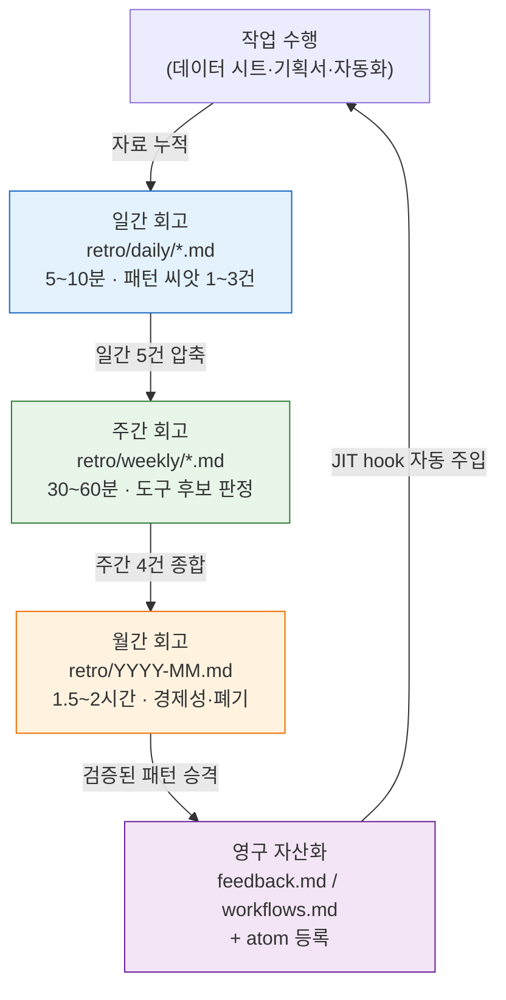

# Part 21 · 1장. 회고가 모든 것의 시작점

금요일 저녁 6시 40분. 퇴근하려고 노트북을 닫으려는데, 그날 했던 작업이 어딘가 익숙했다. 데이터 시트의 enum 참조가 깨진 걸 찾아 고쳤는데, 분명 지난주에도 똑같은 걸 고쳤다. 그 전 주에도. 매번 같은 프롬프트를 다시 타이핑했고, 매번 Claude의 출력에서 같은 항목을 확인했다. 세 번째라는 걸 알아챈 건 노트북을 닫기 직전이었다.

이 "어딘가 익숙했다"는 감각이 이 책 전체에서 가장 중요한 순간이다. 이 감각을 흘려보내면 다음 주에 네 번째로 같은 작업을 반복한다. 이 감각을 붙잡아 한 줄로 적으면, 그 한 줄이 다음 주에 skill이 되고, 그 skill이 한 달 뒤 atom이 되어 자동으로 주입된다. 붙잡는 자리가 바로 회고다.

이 책의 다른 부들은 "이런 도구가 있다", "이런 패턴이 있다"를 다뤘다. 이 챕터는 그 모든 도구와 패턴이 어디서 발화되는지를 다룬다. 새 슬래시 명령은 어디서 만들어지고, 새 atom은 어떻게 박제되며, 한 달에 한 번도 안 쓰는 도구는 누가 솎아내는가. 답은 늘 같은 자리로 모인다. 회고에서.

---

## 1.1 익숙함을 한 줄로 — 워크드 트랜스크립트

회고는 거창한 의식이 아니다. 저자의 일간 회고 파일 하나를 그대로 열어 본다. 실제 경로는 `retro/daily/YYYY-MM-DD.md`이고, 한 달이 지나면 이 파일들이 주간(`retro/weekly/YYYY-Www.md`)으로, 다시 월간(`retro/YYYY-MM.md`)으로 압축된다. 규칙은 `retro/README.md`에 적혀 있다.

저자가 실제로 사용하는 흐름은 회고 파일을 직접 손으로 쓰는 것이 아니라, AI에게 그날의 작업 로그를 던지고 패턴을 뽑게 하는 것이다. 아래는 어느 금요일 저녁의 실제 왕복을 재구성한 것이다. 프롬프트 전문을 먼저 싣고, Claude의 날것 출력을 요약 없이 — 빗나간 부분까지 — 그대로 싣는다.

**[프롬프트 — 사람이 입력]**

> 오늘 한 작업을 회고로 정리해줘. 오늘 한 일: ① 캐릭터 데이터 시트에서 enum 참조 깨진 거 고침(grade 컬럼이 enum 시트랑 안 맞았음) ② NPC 대사 톤 통일 ③ relation-map 다시 돌림.
> 이 중에서 **이번 주에 2번 이상 반복한 작업**이 있으면 표시하고, **도구로 만들 만한 후보**가 있으면 따로 빼줘. 없으면 없다고 해. 억지로 만들지 마.

**[Claude 날것 출력 — 요약·각색 없음]**

> 오늘 작업 회고입니다.
>
> **반복 패턴 감지**
> - ① enum 참조 깨짐 수정 → 이건 이번 주 화요일 회고에도 동일 항목이 있습니다. **2회 이상 반복**으로 표시합니다.
> - ② NPC 대사 톤 통일 → 이번 주 첫 등장. 반복 아님.
> - ③ relation-map 재실행 → relation-map-gen skill을 이미 쓰고 계셔서, 이건 도구화가 끝난 작업입니다. 추가 후보 아님.
>
> **도구 후보**
> - enum 참조 검증을 **skill로 만들 수 있을 것 같습니다.** 데이터 시트의 컬럼값과 enum 시트를 대조해 불일치를 리포트하는 형태로요.
> - 다만 제가 두 시트의 정확한 구조를 모르기 때문에, 이게 정말 반복 가능한 패턴인지는 확신하기 어렵습니다. 화요일에 고친 깨짐과 오늘 깨짐이 **같은 종류의 깨짐인지** 확인이 필요합니다. 같은 컬럼에서 같은 이유로 깨졌다면 강력한 skill 후보이고, 매번 다른 컬럼이 다른 이유로 깨진 거라면 skill로 묶기 어렵습니다.

여기서 마지막 문단이 핵심이다. AI는 "skill을 만들자"고 단정하지 않았다. **같은 종류의 깨짐인지 사람이 확인하라**고 되물었다. 이게 회고가 자동이 아닌 이유다.

**[사람의 검증 — AI 제안을 받되 거름]**

저자는 화요일 회고를 열어 대조했다. 화요일 깨짐은 `grade` 컬럼, 오늘 깨짐도 `grade` 컬럼. **같은 종류**였다. AI의 후보 제안이 검증을 통과했다. 그래서 일간 회고에 한 줄을 남긴다.

> 반복 작업: enum-grade 참조 검증 (화·금 2회) → **skill 후보**. 다음 주간 회고에서 승격 판단.

이 한 줄이 전부다. 5분이 안 걸렸다. 그리고 이 한 줄이 self-improving 루프의 첫 마디다. 만약 AI가 "이미 도구화 끝났다"고 짚어 준 ③번까지 후보로 올렸다면, 한 달 뒤 안 쓰는 중복 도구가 하나 더 떠다녔을 것이다. AI의 거름질과 사람의 거름질이 둘 다 작동한 결과, 진짜 후보 하나만 남았다.

---

## 1.2 회고가 시작점인 이유

어느 작업이 반복되는지, 어느 도구가 자주 쓰이는지, 어느 atom이 부족한지는 한 번의 작업으로는 보이지 않는다. 위 트랜스크립트에서 enum 깨짐이 후보로 떠오른 건 "오늘"이 아니라 "화요일과 오늘"을 겹쳐 봤기 때문이다. 1주·1개월·1분기 누적된 흔적을 겹쳐야 패턴이 떠오른다. 회고는 그 겹침을 의도적으로 만드는 시간이다.

회고에서 발견된 패턴은 두 갈래로 갈린다.

- 반복되는 패턴 + 가치 있는 결과 → 도구로 박제(skill·atom·hook)
- 반복되지만 가치 없는 패턴 → 폐기 또는 단순화

이 갈림의 판단을 작업 중간에는 못 한다. 작업 흐름이 끊기기 때문이다. enum 깨짐을 고치던 그 순간에는 "이게 세 번째인가?"를 따질 여유가 없다. 별도로 떼어 둔 회고 시간이 그 판단의 자리다.

도구가 만들어진 뒤 정말 가치를 내는지도 같은 자리에서 측정한다. 한 달에 한 번 쓰이는 도구와 한 시간을 줄여 주는 도구의 가치는 다르다. 측정도, 폐기 결정도 회고에서 한다. 회고가 없으면 도구는 누적만 되고 정리는 되지 않는다. 몇 년이 지나면 안 쓰는 도구 수십 개가 검색과 운영을 방해한다.

서랍에 비유하면, 회고는 책상 서랍을 주기적으로 비우는 시간이다. 매일 쓰는 펜과 1년에 한 번도 안 꺼낸 메모지가 한 칸에 섞여 있으면, 매번 펜을 찾는 데 몇 초가 더 든다. 도구도 똑같다.

---

## 1.3 일·주·월 회고의 압축 흐름

저자의 회고는 세 층위로 굴러간다. 일간이 패턴의 씨앗을 모으고, 주간이 씨앗을 묶어 도구 후보로 압축하며, 월간이 도구의 경제성을 평가해 자산으로 박제하거나 폐기한다. 각 층위는 아래 층위의 출력을 입력으로 받는다.

마지막 화살표가 루프를 닫는다. 영구 자산화된 패턴은 JIT(Just-In-Time) hook을 통해 다음 작업에 자동으로 주입된다. 저자의 환경에서는 `inject_memory.py`라는 hook이 사용자 입력을 받을 때마다 관련 atom을 골라 넣는다. enum-grade 검증이 atom으로 박제되면, 다음에 "데이터 시트 검증"류의 입력을 했을 때 그 atom이 알아서 따라온다. 사람이 매번 "참, 그 검증 규칙이 있었지"를 기억할 필요가 없어진다.

회고가 빠지면 위에서 아래로 가는 화살표만 남고, 자산이 작업으로 되돌아오는 마지막 화살표가 끊긴다. 루프가 닫히지 않는다. 자가개선(self-improving)이라는 말의 의미가 바로 이 루프가 돌고 있다는 것이다. 도구가 도구 자신을 개선하고, atom이 atom을 늘린다. 그 동력은 사람이 떼어 둔 회고 한 시간이다.

---

## 1.4 회고에서 발화되는 다섯 가지

저자가 운영하는 어느 MMORPG 프로젝트의 회고를 약 반년 굴린 인상으로는, 회고 한 번에서 다음 다섯 종류의 산출이 발화된다. 아래 빈도는 정밀 통계가 아니라 저자의 운영 체감이며(저자 추정·미검증), 매 회고가 다섯을 모두 만드는 것은 아니다. 분기 단위로 보면 다섯이 모두 한 번씩은 나온다.

다섯 종류를 풀어 쓰면 이렇다. 이번 주에 같은 결정을 두 번 이상 반복했다면 **새 atom 후보**다. 같은 프롬프트 패턴을 일주일에 여러 번 다시 입력했다면 **새 skill 후보**다(앞 절의 enum-grade 검증이 이 경우였다). 이번 주에 쓴 skill 중 결과가 시원찮았던 것이 있으면 **기존 skill 개선** — 프롬프트 조정·검증 추가·입력 표준화. 지난 분기에 만든 atom 중 한 달간 매칭이 0회였던 것은 **폐기 후보**다. 안 쓰면 토큰만 차지한다. 마지막으로 **경제성 평가**는 도구별로 사용 빈도와 절약되는 손품을 견줘 유지·개선·폐기를 정하는 일이다.

이 다섯이 한 화면에 어떻게 배치되는지를 매트릭스로 보면 이렇다. 가로축은 "반복되는가", 세로축은 "가치 있는가"다.

<svg viewBox="0 0 520 320" xmlns="http://www.w3.org/2000/svg" font-family="sans-serif" font-size="13">
  <rect x="0" y="0" width="520" height="320" fill="#ffffff"/>
  <!-- axes -->
  <line x1="90" y1="40" x2="90" y2="280" stroke="#333" stroke-width="1.5"/>
  <line x1="90" y1="280" x2="500" y2="280" stroke="#333" stroke-width="1.5"/>
  <text x="295" y="305" text-anchor="middle" fill="#333">반복 빈도  →  높음</text>
  <text x="30" y="160" text-anchor="middle" fill="#333" transform="rotate(-90 30 160)">결과 가치  →  높음</text>
  <!-- quadrants -->
  <rect x="92" y="42" width="200" height="118" fill="#fdecea"/>
  <rect x="294" y="42" width="204" height="118" fill="#e8f5e9"/>
  <rect x="92" y="162" width="200" height="116" fill="#f5f5f5"/>
  <rect x="294" y="162" width="204" height="116" fill="#fff8e1"/>
  <!-- labels -->
  <text x="192" y="95" text-anchor="middle" fill="#b71c1c" font-weight="bold">가치 높음·반복 낮음</text>
  <text x="192" y="118" text-anchor="middle" fill="#444">→ 그대로 둠 (도구화 보류)</text>
  <text x="396" y="80" text-anchor="middle" fill="#1b5e20" font-weight="bold">가치 높음·반복 높음</text>
  <text x="396" y="103" text-anchor="middle" fill="#444">→ 새 skill / 새 atom 후보</text>
  <text x="396" y="126" text-anchor="middle" fill="#444">(enum-grade 검증이 여기)</text>
  <text x="192" y="215" text-anchor="middle" fill="#666" font-weight="bold">가치 낮음·반복 낮음</text>
  <text x="192" y="238" text-anchor="middle" fill="#444">→ 무시</text>
  <text x="396" y="215" text-anchor="middle" fill="#e65100" font-weight="bold">가치 낮음·반복 높음</text>
  <text x="396" y="238" text-anchor="middle" fill="#444">→ 폐기 / 단순화 후보</text>
</svg>

회고가 하는 일은 결국 이 사분면에 그 주의 작업들을 흩뿌리는 것이다. 오른쪽 위에 떨어진 것은 도구가 되고, 오른쪽 아래에 떨어진 것은 솎인다. 이 분류가 self-improving의 실제 작동 방식이다.

---

## 1.5 atom으로 박제되는 자리

앞 절의 enum-grade 검증 후보가 skill로 승격되고, 거기서 다시 atom으로 박제되는 과정을 마저 따라가 본다. atom은 회고에서 거칠게 발견된 패턴이 검증을 거쳐 영구 자산이 된 형태다.

저자의 메모리에는 이미 그렇게 박제된 atom들이 있다. 그중 하나가 `retro_atom_natural_invitation`이다. 이름 그대로 "회고에서 atom은 명령이 아니라 자연스러운 초대로 등장한다"는 원칙을 담은 atom이다. 이 atom 자체가 회고를 여러 번 굴리며 발견된 메타 패턴이다 — 회고 도중 "이건 atom으로 남겨야 해"라고 강박적으로 박제를 강요하면 오히려 회고가 형식이 되어 버린다는 걸 여러 번 겪고 나서야 한 줄로 굳어졌다.

박제가 진짜 효과를 내는지는 점수로도 관리된다. 저자 환경에는 `atom_score.py`라는 스크립트가 있어, 각 atom이 실제로 얼마나 매칭되고 쓰이는지를 채점한다. 결과는 `_scores_latest.json`에 저장되고, 점수가 일정 수준을 넘는 atom은 `CLAUDE.md`에 자동으로 주입된다. 즉 잘 쓰이는 atom일수록 더 자주 눈앞에 떠오르고, 안 쓰이는 atom은 점수가 깎여 폐기 후보로 흘러간다. 이 채점-주입 사이클이 §1.4의 사분면을 자동화한 부분이다.

여기서 한 가지 정직하게 짚어야 할 것이 있다. 이 점수가 "한 달에 30시간을 아꼈다" 같은 정량 지표로 곧장 환산되지는 않는다. atom이 절약하는 시간은 측정하기 까다롭다. 그러니 ROI(Return on Investment, 투자 대비 효과)를 숫자로 단정하기보다, "잘 쓰이는 atom은 점수가 높고, 점수 높은 atom은 더 자주 주입되어 손품을 줄인다"는 방향과 비율로만 말하는 편이 정직하다 — 배수가 아니라 방향.

---

## 1.6 회고가 없는 자리에서 일어나는 일

회고를 떼어 두지 않은 팀의 흔한 풍경은 이렇다.

- 같은 회의를 분기마다 반복한다 ("이거 예전에도 결론 냈었는데…").
- atom·skill이 한 사람의 머릿속에만 있다. 그 사람이 떠나면 함께 사라진다.
- 도구가 누적만 된다. 안 쓰는 도구가 검색과 운영을 방해한다.
- 새 기획자가 들어와도 학습 자료가 흩어져 있어 같은 시행착오를 처음부터 다시 겪는다.

이 풍경은 회고 한 시간이면 거의 사라진다. §1.1의 금요일 저녁을 떠올려 보면, "어딘가 익숙했다"를 한 줄로 적느냐 흘려보내느냐의 차이일 뿐이다. 적는 데 5분, 안 적어서 잃는 시간은 네 번째·다섯 번째 반복으로 누적된다. 시간을 안 들여 더 큰 시간을 잃는 전형이다.

물론 처음부터 거창한 회고 시스템을 세울 필요는 없다. 큰 팀에서 일간 5분 회고부터 시작하는 게 답답하게 느껴질 수도 있다. 그렇다고 처음부터 일·주·월 3층 시스템을 한 번에 깔면 형식만 따라가고 본질을 놓치기 쉽다. 가장 작은 단계에서 회고의 가치를 직접 체감한 사람이 다음 단계로 끌어올리는 순서가 안전하다.

이 책에서 만나는 모든 도구·atom·패턴은 결국 누군가의 회고에서 발화된 것이다. 이 책 자체가 저자가 반년간 쌓은 회고 누적의 산물이라고 해도 과언이 아니다. 회고가 시작점이라는 말은 비유가 아니라, 이 책의 목차 그 자체가 회고에서 나왔다는 사실을 가리킨다.

---

> **게임 밖 적용.** "어딘가 익숙했다 — 이거 지난주에도 했는데"라는 감각을 한 줄로 붙잡는 회고는, 게임 개발이 아니라 반복 업무가 있는 어느 직장에서나 자가개선의 입구입니다. 하루를 닫을 때 "오늘 같은 일을 두 번 손으로 한 게 무엇인가" 한 줄만 적고 금요일에 그 주의 다섯 줄을 겹쳐 보면, 매일은 숨기던 패턴이 한 주 단위에서 드러납니다. 예를 들어 총무 담당자가 "같은 양식의 메일을 매주 다시 타이핑한다"를 회고에서 잡으면, 그 한 줄이 다음 주 메일 템플릿이 되고 한 달 뒤 자동 발송 규칙이 됩니다. 핵심은 도구의 정교함이 아니라 흔적을 겹쳐 보는 행위 자체, 그리고 AI에게 후보를 뽑게 하되 "억지로 만들지 말고 이미 자동화된 건 빼라"는 거름망을 거는 것입니다.

## 1.7 따라하기

회고 루프를 처음 도입하는 가장 작은 버전입니다. 도구를 거의 깔지 않고 시작할 수 있습니다.

**setup**

1. 작업 폴더 안에 `retro/daily/` 폴더 하나를 만듭니다.
2. 오늘 날짜로 빈 파일 `retro/daily/2026-06-06.md`를 엽니다. 그 이상의 준비물은 없습니다.

**prompt**

매일 작업을 마칠 때, 그날의 작업 로그를 AI에게 주고 아래처럼 묻습니다.

> 오늘 한 일은 [작업 1·2·3]입니다. 이 중 **이번 주에 2번 이상 반복한 작업**이 있으면 표시하고, **도구(skill)로 만들 만한 반복 패턴**이 있으면 따로 빼 주세요. 이미 도구화가 끝난 작업은 후보에서 빼 주세요. 없으면 없다고 해 주세요. 억지로 만들지 마세요.

마지막 두 문장("이미 도구화된 것은 빼라", "억지로 만들지 마라")이 거름망입니다. 이게 없으면 AI가 매번 그럴듯한 후보를 과잉 생성해, 한 달 뒤 안 쓰는 도구가 쌓입니다.

**verify**

1. AI가 짚어 준 반복 항목이 정말 같은 종류의 반복인지 **직접 한 건 대조**합니다(앞의 화·금 `grade` 컬럼 대조처럼). 같은 종류면 후보 확정, 다르면 폐기.
2. 확정된 후보를 일간 회고에 한 줄로 남깁니다: `반복: [작업] (N회) → skill 후보, 주간 회고에서 판단`.
3. 한 주 뒤, 일간 회고 다섯 건을 다시 AI에게 주고 "skill로 승격할 후보를 추려 달라"고 합니다. 이때 두 번 이상 살아남은 후보만 도구로 만듭니다.

**1인 축소판**

팀도, 별도 도구도 없이 혼자 시작한다면 이렇게 줄입니다.

- 폴더도 만들지 않고, 메모 앱에 날짜별 한 줄만 적습니다.
- 매일 단 한 문장: "오늘 어딘가 익숙했던 작업 하나"를 적습니다. 없으면 비웁니다.
- 금요일에 그 주의 다섯 줄을 한눈에 봅니다. 같은 문장이 두 번 이상 나타나면, 그것 하나만 다음 주에 도구로 만듭니다.

핵심은 도구의 정교함이 아니라 **겹쳐 보는 행위**입니다. 하루는 패턴을 숨기고, 한 주는 패턴을 드러냅니다. 그 드러남을 붙잡는 5분이 자가개선 루프의 입구입니다.

---

### 이 챕터의 핵심 메시지
- 회고는 반복을 한 줄로 붙잡아 도구로 박제하는 자가개선 루프의 입구다.
- 일간이 씨앗을, 주간이 후보를, 월간이 경제성을 거르며 자산을 만든다.
- 효과는 배수가 아니라 방향으로 말한다 — 잘 쓰이는 atom이 더 자주 주입된다.
