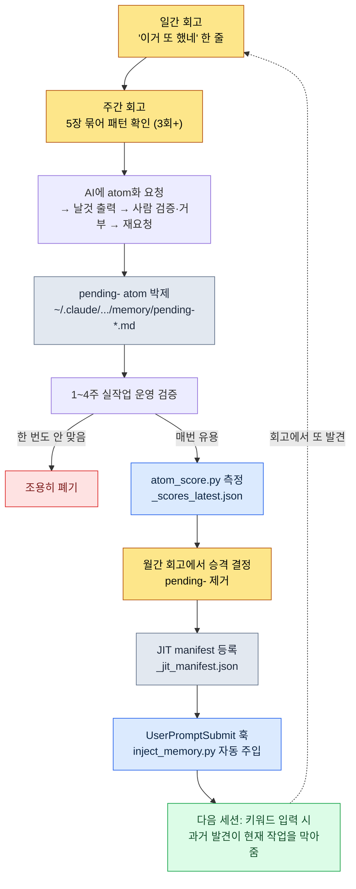

# Part 21 · 2장. 회고 시스템과 atom 승격 — 발견을 영구 자산으로

월요일 아침, 지난주 일간 회고 다섯 개를 한 화면에 띄워 놓고 한 주를 시작하려던 참이었다. 화요일 회고에 "데이터 시트 export 하기 전에 정합성 검사를 깜빡함"이라고 적혀 있었다. 목요일 회고에도 거의 같은 문장이 있었다. 그리고 바로 그 월요일 오전, 나는 또 같은 일을 하고 있었다. FK가 깨진 시트를 그대로 클라/서버 빌드에 올렸다가 다시 빼냈다. 세 번째였다.

이 순간이 회고 시스템의 핵심이다. 같은 일을 세 번째 하고 있다는 사실은, 그 일을 하는 동안에는 절대 보이지 않는다. 손은 익숙하게 움직이고 머리는 "이거 원래 내가 하던 일"이라고 속삭이기 때문이다. 반복은 오직 흔적을 모아 놓고 뒤에서 봐야 보인다. 회고는 그 흔적을 모으는 장치이고, atom 승격은 거기서 발견한 반복을 다시는 손으로 안 하도록 박제하는 장치다.

이 장은 그 두 장치가 어떻게 맞물려 돌아가는지, 실제 일간 회고 파일 한 장이 어떻게 JIT manifest의 atom 한 줄로 바뀌는지를 끝까지 따라간다.

---

## 21.2.1 발견은 흔적 더미에서만 나온다

먼저 짚어야 할 전제가 있다. 반복은 실시간으로 인지되지 않는다.

게임 기획자의 하루는 결정의 연속이다. 데이터 시트 컬럼 하나를 어떤 enum으로 둘지, 스킬 쿨다운을 초 단위로 둘지 프레임 단위로 둘지, 회의에서 나온 애매한 합의를 문서 어디에 적을지. 이런 결정 하나하나는 너무 작아서 기억에 남지 않는다. 그런데 같은 결정을 한 주에 세 번 내리고 있으면, 그건 더 이상 결정이 아니라 규칙이다. 규칙인데 매번 새로 내리고 있다면 그건 낭비다.

문제는 이 낭비가 보이지 않는다는 것이다. 그래서 흔적을 남긴다. 매일 5분, 오늘 한 일과 오늘 두 번 이상 반복한 것을 한 줄씩 적는다. 일주일이 지나면 다섯 장의 흔적이 쌓이고, 그제야 "어, 이거 세 번 적혀 있네"가 보인다.

이것이 회고를 단순한 일기와 가르는 지점이다. 일기는 감상을 적고, 회고는 패턴을 추출하기 위해 흔적을 적는다. 그래서 회고는 형식이 고정되어야 한다. 형식이 매번 다르면 다섯 장을 나란히 놓고 비교할 수 없고, 비교할 수 없으면 패턴이 안 보인다.

---

## 21.2.2 세 주기는 시간 단위가 아니라 역할 단위다

회고를 일·주·월 세 주기로 나누는 이유는 시간이 흘러서가 아니다. 각 주기가 하는 일이 근본적으로 다르기 때문이다.

<svg viewBox="0 0 720 300" xmlns="http://www.w3.org/2000/svg" font-family="sans-serif">
  <rect x="0" y="0" width="720" height="300" fill="#fbfbfd"/>
  <!-- Daily -->
  <rect x="30" y="40" width="190" height="220" rx="10" fill="#eaf2fb" stroke="#3b6fb0" stroke-width="1.5"/>
  <text x="125" y="70" text-anchor="middle" font-size="17" font-weight="bold" fill="#1f3d63">일간 · 5~10분</text>
  <text x="125" y="100" text-anchor="middle" font-size="13" fill="#33475b">역할: 흔적 박제</text>
  <line x1="50" y1="115" x2="200" y2="115" stroke="#c2d4e8" stroke-width="1"/>
  <text x="125" y="142" text-anchor="middle" font-size="12" fill="#4a5b6b">오늘 한 일</text>
  <text x="125" y="166" text-anchor="middle" font-size="12" fill="#4a5b6b">두 번 한 결정</text>
  <text x="125" y="190" text-anchor="middle" font-size="12" fill="#4a5b6b">안 쓴 도구</text>
  <text x="125" y="214" text-anchor="middle" font-size="12" fill="#4a5b6b">다음 세션 인계</text>
  <text x="125" y="244" text-anchor="middle" font-size="11" font-style="italic" fill="#7a8a99">산출물: 5장/주</text>
  <!-- arrow 1 -->
  <polygon points="225,150 255,135 255,165" fill="#9bb3cc"/>
  <!-- Weekly -->
  <rect x="265" y="40" width="190" height="220" rx="10" fill="#eef6ee" stroke="#3f8a4f" stroke-width="1.5"/>
  <text x="360" y="70" text-anchor="middle" font-size="17" font-weight="bold" fill="#1f4a2a">주간 · 30~60분</text>
  <text x="360" y="100" text-anchor="middle" font-size="13" fill="#33475b">역할: 패턴 추출</text>
  <line x1="285" y1="115" x2="435" y2="115" stroke="#c8e0c8" stroke-width="1"/>
  <text x="360" y="142" text-anchor="middle" font-size="12" fill="#4a5b6b">일간 5장 묶어 보기</text>
  <text x="360" y="166" text-anchor="middle" font-size="12" fill="#4a5b6b">3회+ 반복 → 후보</text>
  <text x="360" y="190" text-anchor="middle" font-size="12" fill="#4a5b6b">pending- atom 박제</text>
  <text x="360" y="244" text-anchor="middle" font-size="11" font-style="italic" fill="#7a8a99">산출물: 후보 1~3개</text>
  <!-- arrow 2 -->
  <polygon points="460,150 490,135 490,165" fill="#9bb3cc"/>
  <!-- Monthly -->
  <rect x="500" y="40" width="190" height="220" rx="10" fill="#fbf2ea" stroke="#b07b3b" stroke-width="1.5"/>
  <text x="595" y="70" text-anchor="middle" font-size="17" font-weight="bold" fill="#634021">월간 · 1.5~2h</text>
  <text x="595" y="100" text-anchor="middle" font-size="13" fill="#33475b">역할: 경제성·승격</text>
  <line x1="520" y1="115" x2="670" y2="115" stroke="#e8d4c2" stroke-width="1"/>
  <text x="595" y="142" text-anchor="middle" font-size="12" fill="#4a5b6b">도구 경제성 평가</text>
  <text x="595" y="166" text-anchor="middle" font-size="12" fill="#4a5b6b">승격 / 폐기 결정</text>
  <text x="595" y="190" text-anchor="middle" font-size="12" fill="#4a5b6b">분기 계획</text>
  <text x="595" y="244" text-anchor="middle" font-size="11" font-style="italic" fill="#7a8a99">산출물: 정식 atom</text>
</svg>

일간은 흔적을 박제한다. 판단하지 않고 그냥 적는다. 주간은 흔적 다섯 장을 묶어 패턴을 본다. 여기서 처음으로 "이건 반복이다"라는 판단이 들어간다. 월간은 누적된 도구 전체를 보고 경제성을 평가한다. 무엇을 살리고 무엇을 버릴지 결정한다.

한 주기가 빠지면 나머지가 무너진다. 일간 없이 주간만 하면 일주일 전 일이 기억나지 않아 흔적이 텅 빈다. 주간 없이 월간만 하면 한 달치 일간을 한 번에 보게 되는데, 22장을 한 자리에서 비교하는 건 불가능에 가깝다. 패턴은 안 보이고 피로만 쌓인다.

작업장 비유가 잘 들어맞는다. 일간은 매일 저녁 책상을 정리하는 5분이다. 주간은 주말에 서랍 한 칸을 다시 짜는 30분이다. 월간은 분기마다 작업장 전체 동선을 살피는 두 시간이다. 매일 책상을 안 치우면 주말에 서랍을 짤 수가 없고, 서랍이 엉망이면 동선을 봐도 답이 안 나온다.

---

## 21.2.3 일간 회고 — 5분으로 끝나는 박제

실제로 내가 쓰는 일간 회고 파일은 `retro/daily/2026-05-30.md` 같은 경로에 날짜별로 쌓인다. 템플릿은 `/retro` 슬래시 명령이 자동으로 깔아 준다.

```markdown
# 일간 회고 2026-05-30

## 오늘 한 일 (3~5줄)
- 신규 스킬 데이터 시트에 enum 12종 추가 + 쿨다운 컬럼 재정렬
- 밸런스 시뮬 1차 패스 (드랍 테이블 가중치 조정)
- 데이터 export 빌드 클라/서버 동시 갱신

## 반복 발견 (있으면)
- 데이터 export 빌드 전에 정합성 검사를 또 깜빡함 → FK 깨진 채 빌드 → 3회째
- 밸런스 시뮬을 시드 고정 없이 돌려 재현이 안 됨 (두 번째)

## 폐기 후보
- 오늘 한 번도 안 쓴 도구: (월 누적 측정용으로만 기록)

## 다음 세션 인계
- 깨진 FK 두 건 (스킬→이펙트 참조) 먼저 메우고 재빌드
- 후보: 시뮬 시드 고정 옵션 기본값화 검토
```

5분이면 채워진다. 형식이 고정돼 있어서 매번 "뭘 적지"를 새로 고민하지 않는다. 칸이 정해져 있으니 칸을 채우기만 하면 된다.

여기서 결정적인 건 "반복 발견" 칸이다. 이 칸은 비어 있어도 된다. 대부분의 날은 비어 있다. 그런데 오늘 같은 일을 두 번 했다는 자각이 들면 한 줄 적는다. 위 예시의 "데이터 export 빌드 전에 정합성 검사를 또 깜빡함 → 3회째"가 바로 그것이다. 이 한 줄이 며칠 뒤 주간 회고에서 패턴으로 묶이고, 다시 몇 주 뒤 atom이나 skill로 박제된다.

자동 캡처가 사람 손을 줄여 준다. git 커밋 로그, atom 변경 이력, skill 사용 로그가 일간 회고에 자동으로 합쳐지면 "오늘 한 일" 칸의 절반은 이미 채워져 있다. 사람은 git 로그가 못 보는 것 — "이거 또 했네"라는 자각 — 만 추가하면 된다.

마지막 "다음 세션 인계" 칸은 내일의 나에게 보내는 쪽지다. 이 칸이 있으면 새 세션 시작 시 컨텍스트 로딩이 1\~2분 안에 끝난다. 없으면 "어제 내가 뭘 하다 말았더라"를 더듬느라 시간이 더 든다. 실제로 내 MEMORY.md에는 "다음 세션 우선 확인" 항목이 별도로 유지되는데, 이게 바로 일간 인계가 누적된 상위 버전이다.

---

## 21.2.4 주간 회고 — 패턴이 처음으로 모습을 드러내는 자리

주간 회고는 일간 다섯 장을 한 화면에 올려 놓고 시작한다. 파일은 `retro/weekly/2026-W21.md` 같은 경로에 쌓인다.

```markdown
# 주간 회고 2026-W22 (5/25~5/31)

## 이번 주 한 일 요약
- 스킬/밸런스 데이터 시트 갱신, 드랍 테이블 시뮬 2회
- 데이터 export 빌드 4회 (그중 2회 FK·enum 깨진 채 빌드)

## 패턴 발견
- 일간 3건에서 "export 전 정합성 검사 깜빡" 반복 → atom 후보
- 일간 2건에서 "밸런스 시뮬 시드 미고정" 반복 → 시뮬 기본값 검토

## atom 후보
- pending-data-check-before-export (export 빌드 전 정합성 검증을 강제하는 규칙)

## skill 후보
- (없음 — 이번 주는 atom으로 충분)

## 기존 도구 점검
- 미사용: relation-map-gen (이번 주 0회)
- 최다 사용: check(정합성 cascade), excel-reader, /retro

## 다음 주 계획
- pending-data-check-before-export 1주 더 운영 후 승격 판단
```

여기서 처음으로 판단이 들어간다. "일간 3건에서 export 전 검사 깜빡 반복"은 산술적 사실이지만, "이건 atom으로 박제할 가치가 있다"는 판단이다. 3회 반복을 기준선으로 삼는 이유는 단순하다. 한 번은 우연, 두 번은 우연일 수도, 세 번은 패턴이다.

판단이 서면 곧바로 박제한다. 단, 정식 atom이 아니라 `pending-` 접두어를 붙인 임시 atom으로. 내 프로젝트 메모리 폴더에 이렇게 떨어진다.

```
~/.claude/projects/<project>/memory/
  pending-data-check-before-export.md
```

`pending-` 접두어는 "이건 아직 검증 중"이라는 표식이다. 이 표식이 중요한 이유는, 검증을 안 거친 직감을 곧바로 팀 전체 규칙으로 만들면 두 가지가 망가지기 때문이다. 하나는 신뢰 — 검증 안 된 규칙이 자꾸 틀리면 사람들이 규칙 자체를 안 믿게 된다. 다른 하나는 누적 — 검증 게이트가 없으면 직감이 그대로 쌓여 메모리가 쓰레기통이 된다.

그래서 `pending-`은 일주일에서 길게는 한 달, 실제 작업 속에서 운영해 본다. 진짜로 매번 유용하면 살아남고, 한 번도 안 맞으면 조용히 지워진다.

---

## 21.2.5 월간 회고 — 도구의 건강을 재고 살릴 것을 고른다

월간 회고는 한 달치 누적을 펼쳐 놓고 도구 전체의 건강 상태를 점검하는 자리다. 파일은 `retro/2026-05.md`처럼 월 단위로 쌓인다.

```markdown
# 월간 회고 2026-05

## 이번 달 누적
- 일간 회고: 22건, 주간 회고: 4건
- 새 atom: 4개 (data-check-before-export, sim-seed-pinning 외)
- 새 skill: 1개 (relation-map-gen 옵션 보강)
- 폐기 atom: 1개

## 도구 경제성 평가
- skill별 월 사용 횟수 + 절약 체감 (정성)
- 월 1회 미만 사용 skill → 폐기 후보
- 가장 가치 큰 도구: check(정합성 cascade), excel-reader, /retro

## atom 분포
- prefix별 누적 (data: X, sim: Y, meeting: Z ...)
- 폐기 후보: 한 달 매칭 0회인 atom

## 분기 계획
- 다음 달 도입: impact(영향도 추적), schema-doc 자동 갱신

## 책 집필 자료 (해당 시)
- 이번 달 사례 중 책에 인용할 만한 것: atom 승격 워크드 1건
```

월간의 핵심은 경제성 평가다. 도구는 만들 때는 다 가치 있어 보이지만, 한 달 지나면 절반은 손이 안 간다. 그걸 가려내는 다섯 가지 잣대를 쓴다.

평가 기준은 사용 빈도, 시간 절약, 인지 부담, 유지 비용, 대체 가능성 다섯이다. 사용 빈도는 월 1회 이상이면 일단 살리고 미만이면 폐기 후보로 넘긴다. 시간 절약은 회당 절약 체감에 빈도를 곱해 본다 — 여기서 분 단위 숫자를 단정하지는 않는다. "한 번에 몇 분 아끼는 느낌이고 한 달에 열 번 쓰니 누적이 크다"는 정도의 정성 판단이 정직하다. 인지 부담은 외워야 할 슬래시 명령이 열두 개를 넘으면 정리 신호로 본다. 사람이 머리에 이고 다닐 수 있는 명령 수에는 한계가 있다. 유지 비용은 데이터 시트가 바뀔 때 같이 손봐야 하는 도구인지를 본다. 대체 가능성은 더 간단한 방법이 새로 생겼는지를 본다.

다섯 잣대를 합쳐 살릴지, 버릴지, 고칠지를 정한다. 한 시간이면 서른에서 쉰 개 도구를 훑을 수 있다. 다만 시작한 지 한두 달은 도구가 적어 평가에 한 시간이 안 든다. 그 시기엔 평가보다 새 도구를 발화하는 데 시간을 더 쓰는 게 맞다. 경제성 평가는 도구가 쌓인 다음에야 본격적으로 일하는 안전장치다.

---

## 21.2.6 워크드 트랜스크립트: 일간 한 줄이 JIT manifest의 atom 한 줄이 되기까지

여기서부터가 이 장의 척추다. 위에서 흩어져 나온 조각들이 실제로 한 줄에서 시작해 전 세션 자동 주입까지 가는 과정을, 회고 시점부터 끝까지 따라간다. 중간에 내가 거부한 순간과 AI가 애매하게 답한 순간을 그대로 둔다.

**1단계 — 일간에서 자각.** 5월 30일 일간 회고를 쓰다가 "반복 발견" 칸에 한 줄을 적었다.

```
- 데이터 export 빌드 전에 정합성 검사를 또 깜빡함 → FK 깨진 채 빌드 → 3회째
```

이때는 아무 도구도 만들지 않았다. 그냥 흔적만 남겼다.

**2단계 — 주간에서 패턴 확인하고 AI에게 atom화를 요청.** 며칠 뒤 주간 회고에서 일간 다섯 장을 펼쳤더니 같은 줄이 세 군데 있었다. 그래서 Claude에게 던진 프롬프트 전문은 이랬다.

> 이번 주 일간 회고 3건에서 "데이터 export 빌드 전에 정합성 검사를 손으로 깜빡한다"가 반복됐어. 이걸 pending atom으로 만들려고 해. atom 본문 초안을 써 줘. 형식은 우리 메모리의 다른 atom들처럼 frontmatter(name, status, trigger)와 한 문단 규칙으로.

Claude의 날것 출력은 이랬다(요약 없이 그대로).

> ```markdown
> ---
> name: data-check-before-export
> status: pending
> trigger: ["데이터", "export", "빌드 전", "정합성"]
> ---
> 게임 데이터 시트를 클라/서버 export 빌드하기 전에는 항상 정합성 검사
> (check cascade)를 먼저 돌려 FK·enum·참조 위반 0건을 확인한 뒤에만 export
> 한다. 위반이 발견되면 export를 중단하고, 실패 내역을 ClickUp 알림으로
> 담당자에게 통지한다.
> ```
>
> 이 atom을 `pending-data-check-before-export.md`로 저장하면 됩니다. 다만 trigger 키워드 중 "데이터"는 너무 광범위해서 export와 무관한 상황(데이터 시트 열람, 데이터 회의 등)에도 매칭될 수 있습니다. 빼는 걸 권합니다.

**3단계 — 사람의 검증과 부분 거부.** AI가 스스로 trigger 하나를 의심한 건 맞는 지적이었다. 하지만 나는 한 걸음 더 갔다. 규칙 본문에 "정합성 검증"과 "실패 시 ClickUp 알림"을 둘 다 묶어 놓은 게 마음에 안 들었다. 실패 알림은 이미 `integrity_check_clickup_notify`가 담당하는 별개 atom이다. 한 atom에 두 책임을 묶으면 나중에 알림 규칙만 바꾸고 싶을 때 검증 규칙까지 건드리게 된다. 그래서 거부하고 다시 요청했다.

> 좋아, "데이터" trigger는 빼자. 그리고 실패 시 ClickUp 알림은 이미 integrity_check_clickup_notify가 하니까 이 atom에서 빼. 이 atom은 export 전 정합성 검증만 책임지게 좁혀 줘.

재요청 후 Claude가 좁힌 본문은 이랬다.

> ```markdown
> ---
> name: data-check-before-export
> status: pending
> trigger: ["데이터 빌드", "export", "빌드 전 검증"]
> ---
> 게임 데이터 시트를 클라/서버 export 빌드하기 전에는 정합성 검사
> (check cascade)를 먼저 돌린다. 검사 대상: FK 참조 무결성, enum 값 유효성,
> 테이블 간 참조 정합성. 위반 0건을 확인한 뒤에만 export 한다. 실패 시 알림은
> integrity_check_clickup_notify의 책임이며 이 규칙은 관여하지 않는다.
> ```

이게 내가 받아들인 버전이다. 한 책임만 지고, trigger도 export 맥락에만 좁혀졌다. 이 파일을 `pending-data-check-before-export.md`로 저장했다. 여기서 핵심은 AI의 첫 출력을 그대로 쓰지 않았다는 점이다. AI는 형식을 갖춰 주고 trigger 하나를 의심해 줬지만, "책임을 하나로 좁힌다"는 설계 판단은 사람이 했다.

**4단계 — 1주 운영 검증.** 다음 한 주 동안 데이터 export 빌드를 할 때마다 이 pending atom이 떠올랐고, 실제로 두 번 빌드 직전에 enum 깨짐을 잡아냈다. 안 맞은 적은 없었다. 살아남을 자격이 생겼다.

**5단계 — 월간에서 승격 결정과 score 측정.** 월간 회고에서 이 pending atom을 승격 후보에 올렸다. 승격 여부는 직감이 아니라 측정으로 판단한다. 내 환경에는 atom의 매칭 빈도와 유용성을 점수화하는 스크립트가 있다.

```bash
python ~/.claude/scripts/atom_score.py
# → ~/.claude/projects/<project>/memory/_scores_latest.json 갱신
```

이 스크립트는 각 atom이 지난 기간 동안 몇 번 trigger에 매칭됐고 그때 실제로 작업에 인용됐는지를 집계해 `_scores_latest.json`에 떨어뜨린다. 그 점수가 일정 기준을 넘는 atom은 CLAUDE.md에 자동 주입되도록 연결돼 있다. `pending-data-check-before-export`는 2026년 5월 실측 기준으로 한 주 동안 export 빌드마다 매칭됐으니 점수가 충분했다. 승격 확정.

**6단계 — `pending-` 제거, JIT manifest 등록.** 접두어를 떼고 정식 atom으로 바꾼 뒤 JIT manifest에 한 줄을 추가했다.

```
~/.claude/projects/<project>/memory/_jit_manifest.json
```

이 manifest는 UserPromptSubmit 훅(`~/.claude/hooks/inject_memory.py`)이 매 입력마다 읽는다. 입력에 "데이터 빌드"나 "export"가 들어 있으면 이 atom 본문이 컨텍스트에 자동으로 끼어든다.

**7단계 — 루프가 닫힌다.** 그다음 빌드를 하려고 "데이터 export 빌드 돌려줘"라고 입력한 순간, 내가 아무것도 시키지 않았는데 Claude가 먼저 말했다.

> export 전에 정합성 검사(check cascade)부터 돌릴까요? FK 참조·enum 값·테이블 참조 정합성을 검사해 위반 0건을 확인한 뒤 export 하겠습니다.

3주 전 일간 회고에 적은 "이거 또 했네" 한 줄이, 지금의 작업을 알아서 막아 주는 규칙이 되어 돌아온 것이다. 손으로 했던 검증을 다시는 손으로 안 하게 됐다. 루프가 닫혔다는 건 바로 이 장면을 말한다.

---

## 21.2.7 발견에서 자동 주입까지, 승격 루프의 전체 그림

위 워크드 트랜스크립트를 한 장의 흐름도로 압축하면 이렇다. 발견은 일간에서 일어나고, 검증은 운영 기간이 하고, 승격은 측정이 정하고, 자산화는 manifest가 마무리한다.



마지막 점선이 이 그림의 전부다. 자동 주입된 atom이 또 새로운 반복을 드러내고, 그게 다시 회고로 들어가 다음 atom을 낳는다. 한 바퀴 돌 때마다 손으로 할 일이 하나씩 줄어든다. 이 루프가 반년에서 1년 누적되면, 회고는 더 이상 일기가 아니라 작업 시스템의 두뇌가 된다.

---

## 21.2.8 회고가 자연스럽게 atom을 부르게 하라

승격 루프에서 가장 깨지기 쉬운 고리는 1단계, "이거 또 했네"를 적는 그 순간이다. 바쁠 때 사람은 회고 칸을 비워 두고 넘긴다. 그러면 흔적이 안 남고, 흔적이 없으면 주간에서 패턴이 안 보이고, 패턴이 없으면 atom이 안 태어난다. 루프의 입구가 막히는 것이다.

그래서 내 환경에는 `retro_atom_natural_invitation`이라는 atom이 하나 있다. 회고를 쓸 때 atom 발화를 의무로 강제하지 말고 자연스러운 초대로 두라는 규칙이다. 즉 "오늘 반드시 atom 후보 하나를 뽑아라"가 아니라, 회고 템플릿의 "반복 발견" 칸을 비워도 되는 칸으로 두되 거기 한 줄 적을 만한 게 있으면 가볍게 적도록 유도한다. 의무로 만들면 억지로 가짜 패턴을 짜내게 되고, 초대로 두면 진짜 반복만 자연스럽게 걸린다.

이 한 끗 차이가 루프의 지속 가능성을 가른다. 의무화된 회고는 두 주를 못 넘기고 형식적인 거짓말로 채워진다. 초대형 회고는 적을 게 없는 날엔 빈칸으로 두니 부담이 없고, 그래서 오래간다. 오래가야 흔적이 쌓이고, 흔적이 쌓여야 패턴이 보인다.

이 atom 자체도 회고에서 태어났다. 회고를 의무로 운영하다 며칠 만에 칸이 가짜로 채워지는 걸 일간에서 발견했고, 그 발견이 주간을 거쳐 이 규칙으로 승격됐다. 회고를 개선하는 규칙이 회고에서 나온 셈이다.

---

## 21.2.9 흔히 깨지는 자리들

루프를 굴려 보면 같은 자리에서 자꾸 무너진다.

회고를 거르는 게 가장 흔하다. 바쁘다고 사흘 거르면 그 사흘의 흔적이 영영 사라진다. 막는 법은 단순하다 — 다른 칸은 다 비워도 좋으니 "오늘 한 일" 한 줄만은 적는다. 5분이 아니라 1분이어도 흔적은 남는다.

형식을 매번 새로 짜는 것도 위험하다. 자유 형식으로 적으면 다섯 장을 나란히 놓고 비교할 수가 없다. 비교가 안 되면 패턴 추출이라는 주간의 일 자체가 불가능해진다. 그래서 `/retro`가 템플릿을 강제로 깔아 준다.

폐기를 안 하는 것도 함정이다. atom과 skill을 늘리기만 하고 버리지 않으면 인지 부담이 누적된다. 슬래시 명령이 열두 개를 넘는 순간부터 머리가 도구를 다 못 외운다. 월간의 경제성 평가가 이 누적을 막는 유일한 장치다.

승격 게이트를 건너뛰는 것도 위험하다. 직감을 곧바로 정식 atom으로 만들면 검증 안 된 규칙이 쌓인다. `pending-`을 거치고 측정으로 승격하는 게이트가 발견과 자산화 사이에 반드시 있어야 한다.

마지막으로, 1인 작업이라 팀 공유가 없다고 회고를 안 하는 건 오해다. 위 워크드 트랜스크립트 전체가 1인 환경에서 돌아간 사례다. 팀 공유 머지 단계만 빠질 뿐, 발견→pending→측정→승격→JIT 주입 루프는 혼자서도 그대로 돈다. 오히려 1인 환경에서는 이 루프가 유일한 외부 검토자 역할을 한다.

---

> **게임 밖 적용.** 일간 한 줄이 검증을 거쳐 영구 규칙이 되는 승격 루프는, 직군과 무관하게 "한 번 배운 교훈을 다시는 손으로 안 하게" 만드는 절차입니다. 발견을 곧바로 팀 규칙으로 고정하지 않고 `pending`으로 일주일 운영해 본 뒤 실제로 매번 유용했을 때만 정식화하는 게이트가 핵심입니다 — 검증 안 된 직감을 바로 규칙으로 만들면 사람들이 규칙 자체를 안 믿게 되기 때문입니다. 예를 들어 운영팀이 "보고서 제출 전에 숫자 합계가 맞는지 한 번 더 본다"를 잠정 체크리스트로 두고 한 주 굴려 본 뒤, 실제로 두어 번 오류를 잡았을 때 정식 표준 절차로 올리면, 한 책임만 지게 좁히는 설계 판단(여러 점검을 한 줄에 묶지 않기)까지 자연히 따라옵니다.

## 따라하기

**setup.** 회고 폴더와 템플릿을 깝니다.

```bash
mkdir -p ~/.claude/projects/<your-project>/memory/retro/daily
mkdir -p ~/.claude/projects/<your-project>/memory/retro/weekly
# 일간 템플릿 파일 하나를 retro/_template_daily.md 로 저장
```

**prompt.** 일주일치 일간 회고를 쌓은 뒤, 주간 회고 자리에서 Claude에게 이렇게 던집니다.

> 이번 주 일간 회고 5장을 붙여줄게. 3회 이상 반복된 작업·결정을 찾아서 atom 후보로 정리해 줘. 각 후보는 frontmatter(name, status: pending, trigger 키워드 배열)와 한 문단 규칙으로. trigger가 너무 광범위하면 좁혀서 제안하고, 한 atom이 두 가지 책임을 지면 분리해서 제안해.

**verify.** 받은 후보를 그대로 쓰지 말고 세 가지를 검증합니다. (1) 한 atom이 한 책임만 지는가 — 두 책임이면 거부하고 분리 요청. (2) trigger 키워드가 그 작업 맥락에만 매칭되는가 — 너무 넓으면 거부. (3) 진짜 3회 반복했는가, 아니면 우연 2회인가 — 우연이면 pending조차 만들지 않는다. 세 검증을 통과한 것만 `pending-`을 붙여 저장하고, 한 주 운영 뒤 매번 유용했을 때만 정식 승격합니다.

---

## 21.2.10 1인 축소판

팀도 없고 JIT 훅도 score 스크립트도 아직 없다면, 다음 한 장의 파일로 루프 전체를 흉내 낼 수 있습니다.

`retro.md` 한 파일을 만들고 세 칸만 둡니다.

```markdown
## 오늘 (1줄)
- 

## 또 했네 (있으면 1줄)
- 

## 박제 후보 (또 했네가 3번 쌓이면 이리로)
- [ ] (규칙 한 문장) — 검증: ___회 유용
```

매일 위 두 칸만 채웁니다. "또 했네"에 같은 줄이 세 번 쌓이면 세 번째 칸으로 옮겨 규칙 한 문장으로 적습니다. 그 규칙이 다음 한 주 동안 실제로 유용했던 횟수를 세어 칸에 적고, 세 번 이상이면 그 문장을 프로젝트 메모리(CLAUDE.md)에 정식으로 옮깁니다. JIT 훅이 없어도 CLAUDE.md에 올린 규칙은 다음 세션에 항상 따라오니, 그것만으로도 "과거 발견이 현재 작업을 돕는" 루프의 최소 형태가 완성됩니다.

핵심은 도구의 화려함이 아니라 게이트의 존재입니다. "또 했네 3번 → 박제 → 유용 3번 → 영구화"라는 게이트만 있으면, 파일 한 장으로도 self-improving 루프는 돕니다.

---

### 이 챕터의 핵심 메시지
- 반복은 작업 중엔 안 보이고 흔적을 모아 뒤에서 볼 때만 보인다
- pending 게이트와 측정이 없으면 회고는 발화로만 끝나고 자산이 안 된다
- 일간 한 줄이 JIT manifest 한 줄로 닫히면 과거가 현재를 돕는다

### 다음 챕터 미리보기
- 3장. self-improving 루프 닫기 — 회고·atom·JIT이 한 시스템으로 합쳐지는 순간
