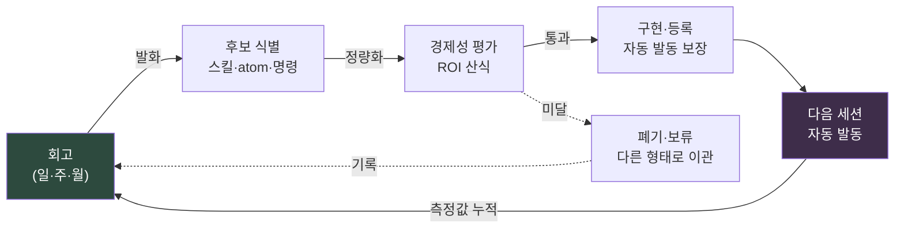

# Part 21 · 3장. self-improving 루프 닫기

> 회고에서 시작된 사이클이 다시 회고로 돌아오는가. 닫히지 않으면 그것은 메모일 뿐 시스템이 아니다.

---

6개월 전 회고를 펼친다. "용어 통일이 안 된다", "문서를 찾기 어렵다", "같은 질문을 또 받는다." 오늘 아침에 적은 회고를 펼친다. "용어 통일이 안 된다", "문서를 찾기 어렵다", "같은 질문을 또 받는다."

토씨까지 같다. 회고를 안 한 게 아니다. 6개월 내내 성실하게 했다. 노션 페이지가 차곡차곡 쌓였고, 분기 워크숍에서는 포스트잇이 화이트보드를 덮었다. 그런데 적힌 내용은 제자리를 돈다. 회고가 작동하지 않은 게 아니다. 루프가 닫히지 않은 것이다.

이 장은 책의 마지막 장이다. 그래서 다루는 것도 마지막 질문이다. 앞에서 만든 모든 도구 — Part 6의 도시 생성기, Part 14의 모바일 검수 atom, Part 22의 비용 표준 — 이것들이 한 번 만들고 끝나는 일회용이 아니라, 스스로 자라는 시스템이 되려면 무엇이 더 필요한가. 답은 하나다. 회고에서 나온 발화가 다음 세션부터 자동으로 작동하고, 그 작동이 다시 회고로 측정되어 돌아오는 닫힌 고리. 이 고리를 닫는 메커니즘이 self-improving 루프다.

---

## 21.3.1 닫히지 않은 루프의 정체

회고에서 발화가 나온다. "회의가 너무 많다." 좋은 발화다. 그런데 그 발화는 노션 페이지의 한 줄로 남는다. 다음 주에 회의는 여전히 많고, 다음 회고에서 같은 줄이 다시 적힌다. 발화와 개선 사이에 사람의 기억이 끼어 있기 때문이다. 사람은 잊는다. 그래서 끊긴다.

self-improving이라고 부를 수 있으려면 회고의 발화가 사람의 기억을 거치지 않고 다음 세션의 자동 행동으로 이어져야 한다. 이걸 만족하는 조건은 네 개다.

첫째, 회고 발화가 즉시 실행 가능한 형태로 전환되어야 한다. 추상적 다짐이 아니라 스킬·atom·manifest 항목·슬래시 명령 중 하나로 떨어진다. 둘째, 다음 세션부터 사람이 기억하지 않아도 자동 발동되어야 한다. 셋째, 다음 회고에서 그것이 실제로 무엇을 바꿨는지 실측되어야 한다. 넷째, 그 측정 결과가 다시 다음 개선의 입력으로 순환해야 한다.

이 네 가지가 모두 자동으로 이어질 때 루프가 닫힌다. 한 단계라도 "다음 주에 내가 기억해서 적용해야지"로 메우면, 바로 그 자리에서 루프가 다시 열린다. 그리고 다음 회고에서 같은 발화가 또 적힌다.

서랍 비유로 보면 이렇다. 회고가 "이 펜은 안 쓰니까 빼자"는 메모로 끝나면, 다음 주에도 그 펜은 그 자리에 있다. 메모가 아니라 손이 가서 빼야 닫힌다. 그리고 다음 분기에 다시 점검해야, 그 자리에 안 쓰는 펜이 또 쌓이지 않는다. 메모는 발화고, 손이 가는 것이 자동 발동이며, 다음 분기 점검이 측정이다. 셋 중 하나라도 빠지면 서랍은 다시 어질러진다.

---

## 21.3.2 루프의 닫힌 형태

전체 흐름을 그리면 닫힌 순환이 된다. 시작점도 끝점도 회고다.



화살표가 한 바퀴를 돌아 다시 회고로 들어온다. 이 닫힘이 핵심이다. 각 단계의 산출물이 다음 단계의 입력이 되고, 마지막 측정값은 다시 첫 회고의 입력이 된다. 사이에 사람의 기억이 끼면 그 화살표가 끊기고, 순환은 깨진다.

ROI 미달 후보가 폐기·보류로 빠지는 점선 화살표도 결국 회고로 돌아온다는 점을 보자. "이건 만들 가치가 없었다"는 판단 자체가 다음 회고의 기록이 되고, 같은 후보가 또 올라왔을 때 빠르게 거를 근거가 된다. 버리는 것도 루프 안에 있다.

회고에서 self-improving으로 이어지는 발화에는 정해진 다섯 패턴이 있다(§21.1.4에서 다뤘다). 만들 스킬, 개선할 스킬, 만들 atom, 개선할 atom, 경제성 재평가. 회고 템플릿 자체에 이 다섯을 슬롯으로 넣어 두면 발화가 빠지지 않는다.

```markdown
## 회고 (일간) — 2026-06-06

### 1. 오늘 작업
- (작업 요약)

### 2. self-improving 발화 (5 슬롯)
- 만들 스킬: <비우면 "없음">
- 개선할 스킬: <>
- 만들 atom: <>
- 개선할 atom: <>
- 경제성 재평가: <>

### 3. 다음 회고에서 측정할 것
- <>
```

슬롯이 비어 있어도 된다. 비었다는 사실 자체가 "오늘은 새 개선이 없다"는 기록이다. 다만 며칠 연속으로 다섯 슬롯이 전부 비면, 그건 개선거리가 없는 게 아니라 회고가 형식으로 굳어 가고 있다는 신호다. 그럴 때는 트리거 질문을 던진다. "이번 주에 같은 일을 두 번 손으로 한 게 무엇인가."

발화는 모호한 채로 나온다. "회의록이 너무 길어." 후보로 키우려면 산출물 한 개로 정량화한다. "회의록이 너무 길어"는 `meeting_summary` 스킬, 즉 회의록을 받아 의사결정과 액션 아이템만 추출하는 도구 한 개로 환산된다. "용어가 헷갈려"는 도메인 어휘 30개를 담은 `glossary_lookup` atom으로, "같은 질문을 매번 받아"는 신규 입사자 첫날 안내를 자동화하는 `/onboarding` 슬래시 명령으로 환산된다. "동기화 누락이 잦아"는 manifest 갱신과 JIT atom 추가로 떨어진다.

후보가 "어떤 산출물 한 개"로 정의되어야 다음 단계로 간다. "전반적으로 개선하자"는 후보가 아니다. 산출물 한 개로 환산되지 못하는 발화는 ROI 평가대에 올릴 수가 없고, 올리지 못하면 거기서 멈춘다.

---

## 21.3.3 ROI는 자릿수의 문제다

후보가 생겼다고 다 만들지는 않는다. 만들기 전에 투자 대비 효과를 잰다. 산식은 단순하다.

<svg viewBox="0 0 720 150" xmlns="http://www.w3.org/2000/svg" font-family="sans-serif">
  <rect x="0" y="0" width="720" height="150" fill="#1e1e28"/>
  <text x="360" y="38" fill="#9fe0b0" font-size="17" text-anchor="middle" font-weight="bold">ROI 산식</text>
  <line x1="180" y1="85" x2="540" y2="85" stroke="#666" stroke-width="2"/>
  <text x="360" y="72" fill="#e6e6e6" font-size="16" text-anchor="middle">절약 시간 × 발동 빈도 × 운영 기간</text>
  <text x="360" y="115" fill="#e6e6e6" font-size="16" text-anchor="middle">제작 시간 + 유지보수 부담</text>
  <text x="150" y="92" fill="#c89bf0" font-size="22" text-anchor="middle">ROI =</text>
</svg>

각 항목의 단위와 통과선이 있다. 절약 시간은 한 번 발동당 줄어드는 사람 시간으로, 분 단위로 잡는다. 발동 빈도는 주당 추정 횟수로, 주 1회 이상이면 산다. 운영 기간은 폐기까지의 예상 주 수로, 4주를 못 버틸 도구는 만들 이유가 약하다. 제작 시간은 첫 구현과 검증에 드는 시간, 유지보수는 월간 점검·수정에 드는 시간이다.

분자가 누적 절약, 분모가 누적 비용이다. 나온 값으로 결정한다.

| ROI 값 | 결정 |
|---|---|
| 10 이상 | 즉시 제작 |
| 3\~10 | 일주일 안에 제작 |
| 1\~3 | pending 보류, 한 달 후 재평가 |
| 1 미만 | 이 형태로는 폐기. 다른 방식 고려 |

ROI가 1 미만이라는 건 "이 아이디어가 쓸모없다"가 아니라 "이 형태로 만들면 안 된다"는 뜻이다. 더 가벼운 atom 한 줄로 대체할 수 있는지, 기존 도구의 진입점만 바꾸는 Wrapper로 풀 수 있는지를 먼저 점검한다. 무거운 스킬로 만들 일을 atom 한 줄로 내리면 분모가 10분의 1로 줄어 ROI가 살아나는 경우가 흔하다.

실제 숫자를 하나 넣어 본다. 2026년 5월 23일에 개인 PC에 구축한 JIT atom 주입 시스템 — UserPromptSubmit 훅이 사용자 입력을 보고 관련 메모리 조각(atom)을 자동 주입하는 인프라 — 의 ROI를 따져 보자.

```
절약 시간:  한 세션당 약 3~5분 (관련 atom을 손으로 찾아 호출하던 시간 제거)
발동 빈도:  주당 15~25 세션 (개인 PC 기준)
운영 기간:  1년+ 예상 (인프라 성격이라 폐기 가능성 낮음)
제작 시간:  4시간 (hook + manifest + atom 검증)
유지보수:   월 0.5시간 (atom 추가·수정)

ROI = (4분 × 20회/주 × 52주) / (4시간 × 60분 + 0.5시간 × 12개월 × 60분)
    = 4,160분 / (240분 + 360분)
    = 4,160분 / 600분
    ≈ 6.9  →  "즉시 제작" 구간. 결정이 산식으로 뒷받침됨
```

여기서 솔직해질 부분이 있다. 위 숫자들 — 세션당 3\~5분, 주당 15\~25 세션 — 은 정밀 계측이 아니라 저자의 운영 경험에 근거한 추정이다. 스톱워치로 잰 값이 아니다. 그래서 ROI 6.9도 소수점까지 믿을 값은 아니다.

그러나 그래도 된다. ROI 산식은 정밀도가 아니라 자릿수를 보는 도구이기 때문이다. 결과가 7 언저리면 만든다. 0.3 언저리면 다시 생각한다. 그 사이를 가르는 데 소수점은 필요 없다. 중요한 건 만들지 않기로 결정할 때조차 그 근거가 머릿속 직감이 아니라 산식에서 나와야 한다는 점이다. 자릿수가 안 맞아서 안 만든다 — 이 한 줄이 회고에 남으면, 같은 후보가 다시 올라왔을 때 또 고민하지 않는다.

---

## 21.3.4 만들었다고 끝이 아니다 — 등록과 발동 검증

후보가 통과되면 만든다. 그런데 만드는 것은 절반이다. 나머지 절반은 다음 세션부터 자동으로 발동되게 등록하는 일이다. 이 등록이 빠지면 도구는 만들어졌으되 아무의 손에도 닿지 않는 자리에 남고, 루프는 거기서 끊긴다.

산출물 종류마다 등록할 곳이 다르다. 글로벌 스킬은 `~/.claude/skills/`에 넣고 사용법을 담은 가이드 atom을 같이 만든다. 프로젝트 스킬은 해당 프로젝트의 `.claude/skills/`에 둔다. 신규 atom은 적절한 폴더에 두고, MEMORY.md 인덱스에 한 줄을 추가하고, JIT manifest에 트리거를 등록한다 — 이 셋을 다 해야 자동 주입이 산다. 슬래시 명령은 `~/.claude/commands/`에, Wrapper는 기존 도구의 진입점을 바꾸고 가이드 atom을 붙인다.

등록을 빠뜨리면 다음 회고에서 "이거 만들었는데 왜 안 쓰지"라는 발화가 또 나온다. 그건 새 개선 발화가 아니라 버그 리포트다. 자기가 누락한 등록을 회고에서 다시 발견하는 셈이다.

등록까지 마쳤어도 한 단계가 남는다. 새 세션을 열어 의도한 트리거로 진짜 발동하는지 확인하는 일이다.

```
1. 새 세션 시작
2. 트리거 입력 (예: "가족 건강은 어때")
3. JIT 로그 확인 → 의도한 atom이 실제로 주입됐는가
   (~/.claude/hooks/_injection_log.txt)
4. 안 떴으면 → manifest의 트리거 regex 확장
   또는 매뉴얼 호출 경로 추가
```

이 검증이 빠지면 "있는 줄 알았는데 정작 필요할 때 안 떴어"라는 사고가 반복된다. 등록과 발동은 다른 일이다. 등록은 파일을 둔 것이고, 발동은 트리거가 실제로 걸리는 것이다. 트리거 regex가 한 글자 어긋나면 등록은 됐어도 영영 안 뜬다.

---

## 21.3.5 측정 — 회고로 돌아가는 화살표

만든 도구를 1주에서 1개월쯤 굴린 뒤 측정한다. 이 측정이 루프의 마지막 화살표, 즉 다시 회고로 들어가는 그 화살표다.

실제 발동 횟수는 JIT 로그나 명령 호출 로그에서 센다. 실제 절약 시간은 "예전이라면 N분 걸렸을 작업이 M분에 끝났다"는 식으로 회고에 기록한다. 부작용 — 잘못된 발동, 불필요한 컨텍스트 오염 — 도 같이 본다. 그리고 처음 추정한 ROI와 실측 ROI를 나란히 놓는다.

추정 ROI가 6이었는데 실측 ROI가 0.8이면 가차없이 폐기한다. 만든 사람의 자존심보다 시스템의 청결이 우선이기 때문이다. 쓰지 않는 도구가 manifest에 쌓이면, 그 노이즈가 다음 회고의 정확도를 갉아먹는다.

다만 폐기 버튼을 누르기 전에 한 번은 점검한다. 트리거 regex가 너무 좁아서 발동 자체가 안 됐을 수도 있고, 매뉴얼 호출 경로가 없어서 그냥 잊힌 것일 수도 있다. 진짜로 가치가 없는 도구인지, 발동 경로가 막혀 있던 좋은 도구인지부터 가른다. 전자면 버리고, 후자면 경로를 뚫는다.

폐기 역시 회고에서 결정된다. "이 도구를 폐기한다"는 결정 자체가 self-improving의 산출물이다. 만들기만 하고 비우지 않는 사이클은 단조 증가만 하는 사이클이고, 단조 증가하는 시스템은 결국 자기 무게에 깔린다.

---

## 21.3.6 닫힌 루프의 표식

루프가 닫혔는지는 네 가지 신호로 안다.

첫째, 같은 발화가 반복되지 않는다. 회고에서 한 번 적힌 항목이 두 번 적히면, 1차에서 후보 식별이나 구현 어딘가가 실패했다는 뜻이다. 이 장 첫머리의 "용어 통일이 안 된다"가 6개월째 반복되던 것 — 그게 열린 루프의 가장 선명한 증거였다.

둘째, manifest와 atom의 수가 단조 증가만 하지 않는다. 폐기가 일어난다. 분기당 10\~20% 정도는 정리되는 게 건강한 사이클이다. 한 번도 줄어든 적이 없는 시스템은, 한 번도 청소한 적이 없는 서랍과 같다.

셋째, 회고 시간이 줄어든다. 시스템이 잘 돌면 "어제 뭐 했더라"를 더듬는 시간이 사라지고, 다섯 발화 슬롯을 채우는 데 5분이면 충분해진다.

넷째, 신규 입사자가 1주 안에 회고에 참여할 수 있다. 회고 양식이 표준화되어 있고 atom·스킬이 가시화되어 있으면 가능하다.

루프가 끊기는 자리는 매번 정해져 있다. 실패 모드를 모아 두면, 다음에 같은 증상이 보일 때 처방을 바로 집을 수 있다.

| 끊긴 지점 | 증상 | 처방 |
|---|---|---|
| 발화가 없다 | 5 슬롯이 매번 빔 | 트리거 질문 추가: "같은 일을 두 번 손으로 한 게 무엇인가" |
| 후보로 안 떨어진다 | "전반적으로 개선" 식 모호 | 산출물 한 개로 정량화 강제 |
| ROI 평가를 건너뛴다 | 일단 만들고 본다 | ROI 산식 5분 템플릿화 |
| 만들었는데 안 뜬다 | 등록 누락 | 등록 체크리스트 강제 |
| 떴는데 안 쓴다 | 트리거 부재·오설정 | regex 확장 + 매뉴얼 경로 동시 제공 |
| 측정을 안 한다 | 회고에 측정 슬롯 없음 | "다음 회고에서 측정할 것" 슬롯 추가 |

각 실패 모드는 회고에서 발화되고, 그 발화가 다시 self-improving의 입력이 된다. 루프를 고치는 일조차 루프 안에서 일어난다. 메타 루프다.

---

## 21.3.7 책의 마지막 문장

이 책은 길었다. 정보 아키텍처에서 시작해, 도시를 생성하는 도구를 만들고, 전투 시스템을 설계하고, 모바일 검수를 자동화하고, 비용을 표준화하고, 회고에서 atom을 길어 올렸다. 그 모든 장의 도구들이 한자리에 모여 답하는 질문이 이 마지막 장이다. 만든 것이 스스로 자라는가.

self-improving은 결국 한 문장으로 줄어든다.

> 회고에서 결정한 것이 다음 세션부터 자동으로 작동하고, 그 작동이 다시 회고로 측정되어 돌아온다.

자동으로 작동하지 않으면 회고는 일기다. 잘 쓴 일기는 위로가 되지만 시스템을 바꾸지는 못한다. 자동으로 작동하면 회고는 시스템의 두뇌가 된다. 매일의 발화가 매일의 행동을 바꾸고, 그 행동의 결과가 다음 발화를 더 정확하게 만든다.

이 책에서 다룬 모든 분야 — 정보 설계, 시스템, 전투, 모바일, 비용, 그리고 Layer 분해라는 절차적 생성·자동화의 전제 — 는 전부 이 self-improving 루프 위에서 진화한다. 도구는 낡고, 모델은 바뀌고, 프로젝트는 끝난다. 그러나 루프가 닫혀 있는 한, 시스템은 어제보다 오늘 조금 더 나아져 있다. 그것이 이 책이 마지막으로 남기는 한 가지다. 도구를 만드는 법이 아니라, 도구가 스스로 자라게 만드는 법.

당신의 다음 회고가, 그 루프의 첫 바퀴이기를.

---

### 이 챕터의 핵심 메시지
- 루프는 발화→후보→ROI→구현→자동 발동→측정의 어느 한 칸이라도 사람 기억에 맡기면 그 자리에서 다시 열린다
- ROI는 정밀도가 아니라 자릿수를 보는 도구이며, 안 만드는 결정의 근거도 산식에서 나와야 한다
- 폐기도 self-improving의 산출물이다 — 비우지 않는 사이클은 자기 무게에 깔린다

---

> **게임 밖 적용.** "용어 통일이 안 된다 / 문서를 찾기 어렵다"가 6개월째 토씨까지 똑같이 회고에 적힌다면, 회고를 안 한 게 아니라 루프가 닫히지 않은 것입니다 — 발화와 개선 사이에 사람의 기억이 끼어 있어서입니다. 어느 부서든 닫힌 루프의 조건은 같습니다. 발화가 즉시 실행 가능한 한 개의 산출물(템플릿·체크리스트·자동화 규칙)로 떨어지고, 다음부터 사람이 기억하지 않아도 작동하고, 그 효과가 다시 측정되어 돌아와야 합니다. 예를 들어 "회의가 너무 길다"는 발화는 "회의록을 받아 결정·할 일만 추출하는 도구 한 개"로 환산되고, 만들기 전에 (절약 시간 × 발동 빈도 × 운영 기간) ÷ (제작·유지 시간)으로 자릿수만 따져 즉시 만들지 보류할지 정합니다. 만들지 않기로 한 결정조차 그 근거가 직감이 아니라 산식에서 나와야, 같은 후보가 다시 올라왔을 때 또 고민하지 않습니다.

## 따라하기

### setup
1. 회고 템플릿에 self-improving 5 슬롯과 "다음 회고에서 측정할 것" 슬롯을 넣습니다.
2. ROI 산식 한 줄과 결정 구간표(10↑ 즉시 / 3\~10 일주일 / 1\~3 보류 / 1↓ 폐기)를 회고 파일 상단에 고정합니다.
3. 등록 체크리스트(스킬·atom·명령·Wrapper별 등록 위치)를 만들어 둡니다.

### prompt
```
오늘 회고의 self-improving 5 슬롯을 채워 줘.
각 발화는 "산출물 한 개"로 정량화하고, 후보마다 ROI를
(절약 분 × 주당 발동 × 운영 주) / (제작 분 + 유지보수 분)으로
추정해서 결정 구간(즉시/일주일/보류/폐기)을 붙여 줘.
추정 숫자는 근거를 한 줄로 명시하고, 정밀 계측이 아니면 "추정"이라고 표시해.
```

### verify
1. 통과 후보를 구현한 뒤, 새 세션을 열어 의도한 트리거로 입력합니다.
2. 발동 로그를 확인합니다 — 의도한 atom·명령이 실제로 떴는가.
3. 1주\~1개월 뒤 회고에서 실측 ROI를 추정 ROI와 비교하고, 0.8 미만이면 경로 막힘 여부를 가른 뒤 폐기를 결정합니다.

### 1인 축소판
팀이 없어도 됩니다. 혼자라면 이렇게 줄입니다. 하루 끝에 메모 한 줄 — "오늘 같은 일을 두 번 손으로 한 게 무엇인가." 그것 하나를 다음 날 자동화 한 줄(atom·별칭·스니펫)로 바꿉니다. 일주일 뒤 그 한 줄이 실제로 쓰였는지만 봅니다. 쓰였으면 남기고, 안 쓰였으면 지웁니다. 발화 한 줄 → 자동화 한 줄 → 측정 한 줄. 루프의 최소 단위는 이 세 줄입니다.
