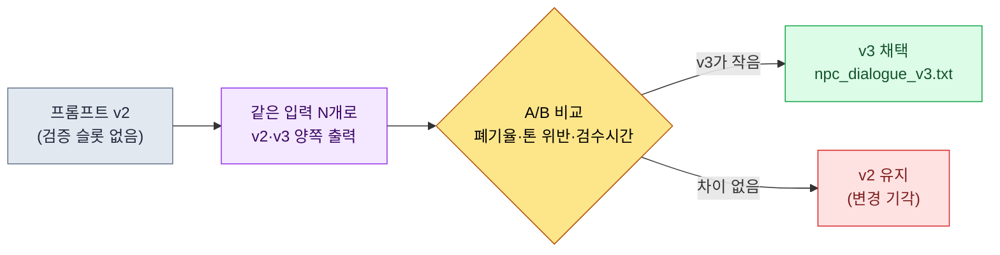

# 22.1 프롬프트 엔지니어링 — 게임 기획자의 작업지시서 한 장

> 1차 독자: LLM을 실무에 끌어 쓰는 게임 기획자 (중규모(10\~50인) 팀)
> 1인/취미 독자용 축소 버전: §22.1.7 「혼자라면 이만큼만」

NPC 대사 세 줄을 받으려고 "이 NPC 대사 5개 만들어 줘"라고 친 적이 있다. 돌아온 건 어느 판타지 게임에 갖다 붙여도 어색하지 않은, 그래서 우리 게임 어디에도 안 맞는 대사 다섯 줄이었다. 톤이 비어 있었고, 이 NPC가 누구인지 몰랐으며, 옆 대사와 이어지지 않았다. 한 줄 한 줄은 문법적으로 멀쩡했다. 문제는 그 다섯 줄을 받아서 검수하는 데, 처음부터 내가 쓰는 것보다 더 오래 걸렸다는 점이다.

이 장은 그 한 줄짜리 지시를 **한 페이지짜리 작업지시서**로 바꾸는 방법을 다룬다. 프롬프트 일반론은 다른 책에 충분히 있다. 여기서는 게임 기획자가 LLM 앞에 앉았을 때 손에 쥐고 있어야 하는 네 가지 — 컨텍스트, 출력 형식, 환각 차단, 검증 요청 — 를 추상 토막이 아니라 **실제로 돌아간 npc_dialogue 프롬프트 한 장**으로 보여준다. 그 프롬프트에 무엇을 넣었고, 무엇이 나왔고, 무엇을 거부했는지를 한 사이클 끝까지 따라간다.

---

## 22.1.1 프롬프트는 작업지시서다 — 4원칙이 한 장에 다 들어간다

좋은 작업지시서는 짧지 않다. 신입에게 일을 맡길 때 "잘 좀 해 봐"라고 하면 매번 다른 결과가 오듯, LLM에게 "대사 만들어 줘"라고 하면 매번 일반 RPG 평균이 온다. 같은 모델이라도 지시서가 다르면 결과가 갈린다 — 출력 품질이 몇 배 달라진다는 건 업계 통념이고, 이 책은 그 배수를 숫자로 약속하지는 않는다. 다만 방향은 분명하다. 컨텍스트와 제약을 넣은 프롬프트가, 맨몸 한 줄보다 검수 부담이 작은 출력을 낸다.

게임 기획자의 프롬프트가 동시에 만족해야 하는 네 가지는 이렇다.

| 원칙 | 한 줄 정의 | 안 지키면 |
|---|---|---|
| ① 컨텍스트 | 무엇을 보고 답할지를 준다 (비전·voice·인접 대사) | 일반 판타지 평균이 나옴 |
| ② 출력 형식 | 개수·길이·라벨·금지 항목을 못 박는다 | 검수가 자유 서술 해석으로 번짐 |
| ③ 환각 차단 | "주어진 자료 밖은 만들지 말 것"을 명시한다 | 없는 설정을 지어냄 |
| ④ 검증 요청 | 출력이 어떤 기준에 부합하는지 스스로 표시하게 한다 | 게이트를 통과시킬 근거가 없음 |

이 네 줄을 따로 외우면 자꾸 한둘이 빠진다. 그래서 이 장의 방식은 네 원칙을 **한 장의 프롬프트 안에 슬롯으로 넣어 두는 것**이다. 슬롯이 비어 있으면 그 원칙을 빠뜨린 게 눈에 보인다. 다음 절에서 그 한 장을 통째로 본다.

---

## 22.1.2 [워크드 트랜스크립트] npc_dialogue 프롬프트 한 장

저자 프로젝트(모바일 우선 MMORPG, 이하 "프로젝트 A")에서 실제로 운영하는 `prompts/narrative/npc_dialogue_v3.txt`를 익명화해 그대로 옮긴다. 도시·NPC 이름과 회사 고유 명칭은 책용으로 치환했고, 출력은 실제 세션을 재구성했다. 입력 프롬프트는 복사해 바로 쓸 수 있는 형태다.

### 1단계 — 컨텍스트 입력: 이 NPC가 누구인지부터 준다

먼저 프롬프트가 참조할 자료를 슬롯에 채운다. 셋 다 새로 쓰는 게 아니라 기존 자산에서 꺼내 오는 것이다.

```yaml
# 슬롯 입력 (프롬프트 본문 위에 붙는다)
L0_비전:        # 캐싱 — 매 호출 재전송하지 않음
  world_premise:  "마력 봉인이 식어 가는 학자들의 도시국가 연합"
  tone_manifesto: "감상 억제. 인물은 감정을 설명하지 않고 행동·사물로 드러낸다."
voice_profile:    # 이 NPC의 정체성 (5개 항목)
  id: npc_doren_vale
  나이대: "50대"
  말버릇: "숫자로만 말한다. 형용사를 거의 쓰지 않는다."
  세계관_지식: "봉인 맥의 미세 진동을 30년 기록. 학자 길드 외부 정세는 모름."
  금기:  "예언·운명·신 같은 신비주의 어휘 금지 (도시 톤이 scholarly_strict)"
  관계:  "플레이어를 '관측 대상 외부 변수'로 취급, 경계도 호의도 약함"
인접_대사:        # 직전 컨텍스트 — 같은 씬에서 이미 나온 줄
  - (플레이어) "종탑의 불이 밤새 켜져 있던데, 무슨 일입니까?"
```

여기서 `voice_profile` 5개 항목이 원칙 ①의 핵심이다. 나이·말버릇·지식 범위·금기·관계 — 이 다섯이 "도렌 베일"을 다른 NPC와 구별되게 만든다. 특히 **세계관_지식의 범위**(길드 외부 정세는 모름)가 원칙 ③ 환각 차단의 사전 작업이다. 모르는 걸 명시해 둬야 AI가 그 밖으로 안 나간다.

### 2단계 — 프롬프트 본문: 형식·환각·검증을 한 장에 못 박는다

```
[L0 컨텍스트] world_premise + tone_manifesto                    (캐싱됨)
[voice_profile] npc_doren_vale 5개 항목 (위 yaml)
[인접 대사] 플레이어 직전 질문 1줄

위 자료를 보고 doren_vale가 플레이어 질문에 답하는 대사를 써 줘.

[출력 형식 — 원칙 ②] 정확히 3개, 한 줄에 하나, 각 40자 이하. 줄 끝에 (무심|경계|냉소) 중 하나로 감정 라벨. 다른 설명·따옴표는 빼고.

[환각 차단 — 원칙 ③] 위 자료에 있는 것만 쓰고, 봉인·종탑 관련 사실을 새로 지어내지 마. 자료에 없는 게 필요하면 그 줄은 '[자료없음: 뭐가 필요한지]'로. 예언·운명·신 같은 어휘 금지.

[검증 요청 — 원칙 ④] 대사 아래에 voice_profile 5항목 각각 부합/위반을 한 줄씩 적고, 확신 안 서는 줄엔 ★ 달고 이유 한 줄.
```

이 한 장에 네 원칙이 전부 들어 있다는 점에 주목한다. 위쪽 슬롯이 ①, `[출력 형식]` 블록이 ②, `[환각 차단]` 블록이 ③, `[검증 요청]` 블록이 ④다. 프롬프트의 절반 이상이 "무엇을 쓰라"가 아니라 "어떻게 쓰고, 무엇은 쓰지 말고, 어떻게 자기 검증하라"는 제약이다. 자유를 주면 평균이 나오므로, 자유를 깎는 게 일이다.

### 3단계 — Claude의 출력 (실제 세션 재구성, 날것)

```
맥은 식고 있소. 12.4. 어제는 12.1. (무심)
좋은 일은 아니지. 하지만 내 일은 기록뿐이오. (냉소)
당신이 왜 묻는지는 내 관측 대상이 아니오. (경계)

[검증 — voice_profile 5개 항목]
- 나이대(50대): 부합. 노년 학자의 절제된 어투.
- 말버릇(숫자로만): 부합. 1번 줄에 수치 2개. 단 2·3번 줄엔 수치 없음 ★
- 세계관_지식(길드 외부 모름): 부합. 외부 정세 언급 없음.
- 금기(신비주의 금지): 부합. 예언·운명·신 어휘 0건.
- 관계(외부 변수 취급): 부합. 3번 줄에서 플레이어를 관측 대상 밖으로 밀어냄.

★ 주의: 말버릇 항목을 '숫자로만 말한다'로 엄격 해석하면
   2·3번 줄이 위반일 수 있음. 매 줄 수치를 강제할지 사람 판단 필요.
```

이 출력에서 가장 값진 부분은 대사 세 줄이 아니라 **맨 아래 ★ 한 줄**이다. AI가 자기 출력 중 애매한 지점을 스스로 신고하고 사람에게 넘겼다. 좋은 프롬프트는 AI가 "이 부분은 제가 확신 못 합니다"라고 말할 수 있게 만든다 — 원칙 ④를 넣은 직접적 효과다.

### 4단계 — 검증과 거부 (사람의 자리)

출력을 그대로 받지 않는다. AI가 올린 ★를 사람이 판정한다. 실제로 이 세션에서 한 줄이 걸렸다.

2번 줄 "좋은 일은 아니지"의 *"좋은"*이 voice_profile의 말버릇("형용사를 거의 쓰지 않는다")과 충돌한다. AI가 ★로 신고한 그 지점이다. 도렌 베일은 가치판단 형용사 대신 수치로 말하는 인물인데, "좋은 일은 아니지"는 흔한 노인 NPC의 어투로 미끄러졌다. 톤이 흐려지는 한 줄이다.

그래서 재요청한다.

```
2번 줄 "좋은 일은 아니지"는 형용사('좋은')를 써서 voice_profile 말버릇 위반이다.
이 줄만 수치 또는 관측 어휘로 다시 써라. 1·3번 줄은 유지.
형식·환각·검증 규칙은 그대로 적용.
```

AI는 2번 줄을 **"3년 전엔 9.0이었소. 이게 답이오. (무심)"**로 다시 답했다. 형용사 없이 수치 변화로 위기를 드러냈고, voice_profile 5개 항목을 다시 통과했다. 한 번의 왕복으로 닫혔다. 처음부터 손으로 톤 잡힌 대사 세 줄을 쓰는 것과, 슬롯 채운 프롬프트 한 장 + ★ 검수 + 1회 왕복 — 후자가 검수 부담이 더 작다는 게 이 세션의 결론이다(저자 경험 기반, 절대 시간은 NPC 톤 난이도에 따라 달라지므로 방향으로 읽는 게 맞다).

---

## 22.1.3 4층 구조 — 프롬프트 한 장을 어떻게 쌓는가

위 프롬프트가 왜 그 순서로 쌓였는지 한 장으로 기록해 두면, 다음 프롬프트부터 슬롯을 빈칸 채우듯 만들 수 있다. 컨텍스트는 아래에서 위로 무거운 것(거의 안 바뀜)부터 가벼운 것(매번 바뀜) 순으로 쌓는다. 안 바뀌는 층은 캐싱해 비용을 아낀다(§22.1.5).

<svg viewBox="0 0 560 360" xmlns="http://www.w3.org/2000/svg" role="img" aria-label="게임 기획자 프롬프트 4층 구조도">
  <rect x="0" y="0" width="560" height="360" fill="#0f1117"/>
  <!-- L0 -->
  <rect x="40" y="40" width="480" height="56" rx="6" fill="#1e3a5f" stroke="#3b82f6" stroke-width="1.5"/>
  <text x="56" y="64" fill="#bfdbfe" font-family="sans-serif" font-size="14" font-weight="bold">L0  비전 · 톤 (world_premise · tone_manifesto)</text>
  <text x="56" y="84" fill="#93c5fd" font-family="sans-serif" font-size="11">거의 안 바뀜 → 캐싱. 원칙 ① 컨텍스트의 토대.</text>
  <!-- L1 -->
  <rect x="40" y="106" width="480" height="56" rx="6" fill="#14532d" stroke="#22c55e" stroke-width="1.5"/>
  <text x="56" y="130" fill="#bbf7d0" font-family="sans-serif" font-size="14" font-weight="bold">L1  voice_profile · 명명규칙 · 지역 lore</text>
  <text x="56" y="150" fill="#86efac" font-family="sans-serif" font-size="11">이 NPC를 구별 짓는 5항목 + 모르는 범위 명시 → 원칙 ③ 사전작업.</text>
  <!-- L2 -->
  <rect x="40" y="172" width="480" height="56" rx="6" fill="#854d0e" stroke="#f59e0b" stroke-width="1.5"/>
  <text x="56" y="196" fill="#fde68a" font-family="sans-serif" font-size="14" font-weight="bold">L2  인접 대사 · forbidden_names</text>
  <text x="56" y="216" fill="#fcd34d" font-family="sans-serif" font-size="11">씬 직전 줄·중복 금지 이름 → 옆 대사와 이어지게.</text>
  <!-- L3 -->
  <rect x="40" y="238" width="480" height="82" rx="6" fill="#7f1d1d" stroke="#ef4444" stroke-width="1.5"/>
  <text x="56" y="262" fill="#fecaca" font-family="sans-serif" font-size="14" font-weight="bold">L3  작업 지시 (매번 바뀜)</text>
  <text x="56" y="282" fill="#fca5a5" font-family="sans-serif" font-size="11">[출력 형식]②  ·  [환각 차단]③  ·  [검증 요청]④</text>
  <text x="56" y="302" fill="#fca5a5" font-family="sans-serif" font-size="11">"정확히 3개 · 40자 · (감정) 라벨 · 자료 밖 금지 · 5항목 자기검증"</text>
  <!-- 화살표 라벨 -->
  <text x="280" y="350" fill="#9ca3af" font-family="sans-serif" font-size="11" text-anchor="middle">아래(무거움·캐싱) → 위(가벼움·매번 교체)로 쌓는다</text>
</svg>

§22.1.2의 한 장이 이 그림 그대로다. L0·L1은 자료에서 꺼내 슬롯에 붙이고(원칙 ①·③의 토대), L3에 형식·환각·검증 세 블록을 넣는다(원칙 ②·③·④). 다음 NPC 대사를 받을 때 바뀌는 건 L1의 voice_profile과 L2의 인접 대사뿐이다. L0와 L3 골격은 재사용한다 — 그래서 프롬프트가 "라이브러리"가 된다.

---

## 22.1.4 프롬프트를 자산으로 — 라이브러리와 버전 관리

위 npc_dialogue 프롬프트는 한 번 쓰고 버리는 게 아니다. 분야별·작업별로 파일에 넣어 두고, 매번 새로 쓰는 대신 호출한다. 프로젝트 A의 프롬프트 폴더는 이렇게 생겼다.

```
prompts/
├── narrative/
│   ├── npc_dialogue_v3.txt        # ← §22.1.2가 이 파일
│   ├── quest_synopsis_v2.txt
│   └── consistency_check_v1.txt
├── balance/
│   ├── change_proposal_v2.txt
│   └── outlier_analysis_v1.txt
├── content/
│   ├── city_npc_batch_v2.txt
│   └── side_quest_v3.txt
└── meta/
    ├── meeting_summary_v2.txt
    └── decision_card_v1.txt
```

파일명 끝의 `_v3`가 핵심이다. 프롬프트는 한 번 만들면 끝이 아니라 **결정에 가까운 자산**이라, 바꿀 때마다 결과 변화를 측정하고 버전을 올린다. npc_dialogue가 v3까지 온 경로가 그렇다.



v2에서 v3로 올린 실제 변경이 §22.1.2의 `[검증 요청]` 블록이다. v2에는 AI가 자기 출력을 항목별로 자기검증하고 ★를 다는 슬롯이 없었다. 그 한 블록을 넣자 §22.1.2 4단계처럼 애매한 줄을 AI가 먼저 신고하기 시작했고, 사람이 처음부터 전부 읽어 잡던 부담이 줄었다. 측정 없이 "느낌상 좋아졌다"로 올리지 않는다. 같은 입력 묶음으로 v2·v3 출력을 나란히 놓고, 톤 위반 건수와 검수 시간이 실제로 줄었는지 확인한 뒤 채택한다.

라이브러리가 주는 가장 큰 효과는 신규 멤버다. 입사 첫날 npc_dialogue_v3.txt를 호출하면, 시니어가 수십 번 왕복하며 다듬은 4층 슬롯 구조를 처음부터 쓴다. "프롬프트 잘 쓰는 법"을 몸으로 익히기 전에, 이미 잘 쓰인 한 장을 손에 쥔다.

---

## 22.1.5 비용을 정직하게 다루는 법 — 캐싱과 cap

프롬프트가 길어지면 토큰 비용이 붙는다. 이 장은 "표준화로 비용 ×2가 사라졌다" 같은 검증 안 된 배수를 적지 않는다. 대신 실제로 측정 가능한 것만 말한다.

비용을 잡는 구조적 장치는 두 개다. 첫째, **§22.1.3에서 L0·L1을 아래에 둔 이유가 캐싱**이다. 거의 안 바뀌는 비전·톤 층을 캐싱하면, 매 호출에서 그 층을 다시 전송·과금하지 않는다. NPC 대사를 100번 뽑을 때 L0를 100번 재전송하는 것과 한 번만 캐싱하는 것의 차이는 호출이 쌓일수록 벌어진다. 둘째, **호출당 토큰 cap**을 둬서 한 번에 너무 많은 작업을 한 프롬프트에 욱여넣지 않는다.

여기서 중요한 건 비용이 측정되는 자리가 실재한다는 점이다. 프로젝트 A의 atom 시스템에는 `_economy_log/`(토큰·시간 경제성 로그)와 `_roi_report.md`(ROI(Return on Investment, 투자 대비 효과) 보고)가 운영 메타로 존재한다. 프롬프트 표준화의 효과는 이 로그에서 실측으로 추적하는 것이지, 본문 표에 그럴듯한 숫자를 적어 주장하는 게 아니다. 이 책의 원칙은 셋 중 하나다.

- **공개 표준은 그대로 인용한다.** (이 장엔 해당 항목이 적다 — 프롬프트 형식엔 공인 수치가 드물다.)
- **저자 추정은 추정이라 쓴다.** "검수 부담이 줄었다"는 방향은 경험 기반 추정이며, 절대 배수는 약속하지 않는다.
- **측정 가능한 것만 KPI로 약속한다.** 프롬프트 운영에서 실제로 측정되는 건 톤 위반 건수, 폐기율, 호출당 토큰(캐싱 적용 전후), 검수 시간이다. 이 넷은 `_economy_log`로 숫자가 나온다.

---

## 22.1.6 흔한 실패

| 패턴 | 왜 실패하나 | 처방 |
|---|---|---|
| "대사 5개 만들어 줘" 한 줄 지시 | 컨텍스트 0 → 일반 RPG 평균 | §22.1.2의 4층 슬롯 프롬프트 |
| voice_profile에 '모르는 범위'를 안 적음 | AI가 자료 밖 설정을 지어냄 | 세계관_지식 슬롯에 한계 명시(원칙 ③) |
| 검증 슬롯 없이 출력만 받음 | 사람이 처음부터 전부 읽어야 함 | `[검증 요청]` 블록으로 자기검증 + ★(원칙 ④) |
| 프롬프트를 매번 새로 씀 | 같은 노하우를 0에서 다시 빚음 | `prompts/` 라이브러리 + 버전 |
| 프롬프트 변경을 느낌으로 채택 | 더 나아졌는지 확인 불가 | 같은 입력 A/B 측정 후 버전 업 |
| 긴 컨텍스트를 매 호출 재전송 | 토큰 비용이 호출 수만큼 누적 | L0·L1 캐싱 + 호출당 cap |

여섯 번째가 가장 늦게 발견된다. 비용은 한 번 호출로는 안 아프고, 양산이 쌓인 뒤 `_economy_log`에서 드러난다.

---

> **게임 밖 적용.** 한 줄짜리 지시가 "어디에 갖다 붙여도 어색하지 않은, 그래서 내 일엔 안 맞는" 평균치 결과를 부르는 건 게임 대사만의 문제가 아닙니다. 프롬프트는 신입에게 일을 맡기는 작업지시서라, 네 가지 — 무엇을 보고 답할지(컨텍스트), 개수·길이·금지 항목(출력 형식), "자료 밖은 지어내지 말 것"(환각 차단), "어떤 기준에 맞는지 스스로 표시하라"(검증 요청) — 를 한 장에 넣어 두면 검수 부담이 작은 출력이 나옵니다. 예를 들어 인사 담당자가 채용 공고 초안을 받을 때 "직무 요건 자료에 있는 항목만 쓰고, 자료에 없는 복지·연봉은 지어내지 말고 [확인 필요]로 표시하라"를 명시하면, 그럴듯하게 날조된 조건이 공고에 새어 드는 사고를 막습니다. 자주 쓰는 작업의 지시서 한 장을 파일로 남겨 두면 그게 곧 동료의 출발선이 됩니다.

## 22.1.7 따라하기 — 오늘 할 수 있는 한 단계

> **혼자라면 이만큼만**: 라이브러리도 캐싱도 필요 없습니다. 본인 게임(또는 좋아하는 게임)의 NPC 한 명을 골라 §22.1.2 1단계의 voice_profile 5항목(나이·말버릇·아는 범위·금기·관계)을 손으로 적고, 2단계 프롬프트 본문을 그대로 붙여 한 번 돌려 보세요. 나온 세 줄 중 voice_profile과 어긋나는 한 줄을 직접 골라 "이 줄은 말버릇 항목 위반이다, 그 줄만 다시"라고 반박해 보면, 프롬프트의 네 슬롯이 각각 무슨 일을 하는지 몸으로 들어옵니다.

팀이라면 다음 한 단계로 시작하세요. 자주 쓰는 작업 하나(예: NPC 대사)를 골라 §22.1.2 형식의 프롬프트 한 장을 `prompts/narrative/`에 파일로 넣습니다. 네 블록(슬롯·형식·환각·검증)이 다 들어갔는지부터 확인하면, 그 한 파일이 곧 팀 신규 멤버의 출발선이 됩니다. 버전 관리와 캐싱은 그 다음입니다.

**웹 챗봇 최소 경로 (터미널 없이)** — 이 챕터의 네 원칙은 파일·라이브러리·캐싱 없이 웹 챗봇(ChatGPT 또는 Claude 웹) 입력창 하나만으로 그대로 작동합니다. 프롬프트 엔지니어링은 도구가 아니라 "한 장에 무엇을 넣느냐"의 문제이기 때문입니다. 아래 두 단계가 본류입니다.
1. 본인 작업 한 건을 고르고, §22.1.2 1단계의 다섯 항목(나이·말버릇·아는 범위·금기·관계, 게임 밖이라면 '대상·말투·근거 범위·금지·관계'로 바꿔 읽으세요)을 손으로 적습니다. YAML도 파일도 필요 없고, 챗봇 입력창에 글로 적으면 됩니다.
2. 그 아래에 §22.1.2 2단계의 프롬프트 본문을 그대로 붙이되, 네 블록이 다 들어갔는지만 확인합니다 — `[출력 형식]`(개수·길이·라벨·금지), `[환각 차단]`("자료 밖은 지어내지 말 것, 필요하면 [자료없음]"), `[검증 요청]`("항목별 부합/위반을 적고 확신 안 서면 ★"). 돌린 뒤 ★가 달린 줄만 사람이 판정해 한 번 반박하면 한 사이클이 닫힙니다. 라이브러리·버전·캐싱은 같은 프롬프트를 반복해 쓰게 될 때 비로소 도입하면 됩니다.

---

## 22.1.8 다음 장 예고

22.2에서는 환각과 안전성을 다룬다. 이 장의 원칙 ③(환각 차단 슬롯)이 프롬프트 한 장 안에서의 1차 방어라면, 22.2는 그 방어를 뚫고 나온 환각을 운영 단에서 잡는 다층 방어를 본다.

---

### 이 챕터의 핵심 메시지
- 프롬프트는 작업지시서다 — 4원칙을 한 장 슬롯에 넣는다.
- npc_dialogue 한 장: 컨텍스트·형식·환각차단·검증을 4층으로.
- 비용·효과는 `_economy_log` 실측으로, 가공 배수는 쓰지 않는다.

### 다음 챕터 미리보기
- 22.2 AI 안전성·할루시네이션 — 프롬프트를 뚫고 나온 환각의 다층 방어
