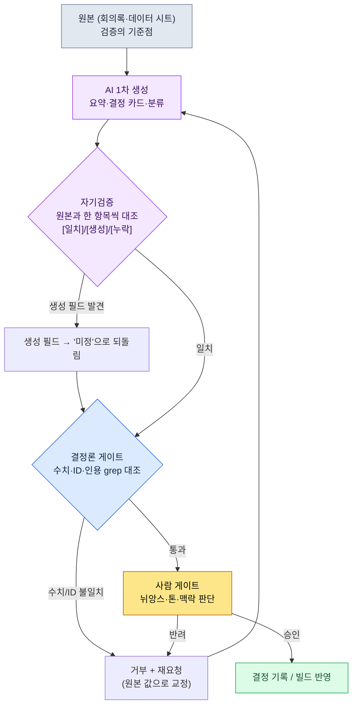

# 22.2 자신 있게 거짓을 말하는 동료 — 환각을 검증 게이트로 막는다

> 1차 독자: AI로 문서·데이터·결정 기록을 양산하는 게임 기획자 (중규모(10\~50인) 팀)
> 1인/취미 독자용 축소 버전: §22.2.7 「혼자라면 이만큼만」

회의록 17건을 AI에게 요약시켜 결정 카드로 정리하던 날의 일이다. 출력은 깔끔했다. 결정 ID, 인용된 회의 날짜, 근거 한 줄까지 양식이 완벽했다. 그중 한 카드에 "2026-04-18 전투 TF 회의에서 쿨타임 정책 확정"이라고 적혀 있었다. 문제는 그날 전투 TF 회의가 없었다는 것이다. AI는 다른 회의의 안건과 날짜를 섞어 그럴듯한 카드 한 장을 지어냈고, 양식이 완벽했기 때문에 하마터면 그대로 팀 결정 기록에 들어갈 뻔했다.

이게 환각(hallucination)이다. LLM은 잘 모를수록 더 자신 있게 답한다. 사람으로 치면 회의에서 "아 그건 그렇게 결정 났어요" 하고 단호하게 말하는데 알고 보면 그런 결정이 없었던 동료와 같다. 그 한 마디가 데이터 시트로, CS 답변으로, atom 자산으로 흘러 들어가면 사고가 된다. 이 장은 그 동료의 입을 막는 방법이 아니라 — 그건 불가능하다 — **그의 말을 통과시키기 전에 반드시 거치는 검증 게이트**를 세우는 방법을 다룬다. 환각 일반론은 다른 책에 많으니, 이 장은 그것을 *AI 워크플로로 막는 자리*에만 집중한다.

---

## 22.2.1 환각은 0이 안 된다 — 그래서 '게이트'를 건다

환각을 0으로 만드는 프롬프트는 없다. 더 큰 모델, 더 좋은 프롬프트가 빈도를 낮추지만 0은 아니다. 그래서 운영의 출발점은 "환각을 없앤다"가 아니라 "환각이 결정·데이터에 닿기 전에 잡는 게이트를 둔다"여야 한다.

게이트의 핵심 원리는 하나다. **LLM이 지어낼 수 있는 것(인용·수치·ID)은 LLM이 아닌 곳에서 검증한다.** 검증의 출처는 셋 중 하나다. 코드(결정론), 원본 문서(grep), 또는 사람의 눈. LLM에게 "맞는지 확인해 줘"라고 다시 묻는 것도 게이트의 한 단계가 되지만, 그건 보조일 뿐 최종 판정자가 아니다.

여기서 게임 기획자가 가장 자주 헷갈리는 지점을 먼저 정리한다. 환각이 일어나기 쉬운 영역과 어려운 영역은 분명히 다르다.

| 작업 | 환각 위험 | 왜 | 게이트 |
|---|---|---|---|
| 수치 계산 (보상·확률) | 매우 높음 | LLM은 산수를 추정한다 | 계산은 코드로, LLM에 금지 |
| 인용 (회의·결정 ID) | 높음 | 없는 출처를 그럴듯하게 만든다 | 원본 grep 대조 |
| 분류 (태그·카테고리) | 보통 | 라벨을 헷갈린다 | 결정론 비교 가능 |
| 요약·추론 | 보통 | 없는 항목을 더하거나 뺀다 | 자기검증 + 사람 게이트 |
| 창작 (플레이버 텍스트) | 낮음 | 정답이 없어 '환각' 개념이 약함 | 톤 검수 게이트 |

첫 줄이 가장 단순한 처방이다. **수치는 LLM에 안 시킨다.** 계산기에게 곱셈을 맡기듯 결정론 도구에 넘긴다. 둘째 줄(인용)이 이 장의 척추다. 회의록 요약·결정 카드처럼 *원본이 존재하는데 LLM이 그걸 재서술하는* 작업에서 환각이 가장 위험하고, 가장 잘 잡힌다. 원본이 있으니 대조할 수 있기 때문이다.

---

## 22.2.2 [워크드 트랜스크립트] 회의록 요약의 환각을 자기검증으로 잡는다

추상적으로 "검증한다"고만 적으면 무엇을 어떻게 하는지 알 수 없다. 회의록 한 건을 요약하고, 그 요약의 환각을 잡아내는 한 사이클을 입력에서 재요청까지 끝까지 본다. 아래 프롬프트는 그대로 복사해 쓸 수 있고, 출력은 실제 세션을 재구성한 것이다.

### 1단계 — 입력: 원본 회의록을 그대로 던진다

먼저 요약할 원본이 있다. 이게 검증의 기준점이 된다. 원본 없이 LLM이 "기억"으로 요약하게 두면 대조할 게 없어진다.

```markdown
# 회의록 — 2026-04-15 전투 밸런스 검토

참석: 이민수, 팀원 A, 팀원 B
안건:
1. 광역 스킬 쿨타임 — 현재 8초가 너무 짧다는 의견. 12초로 상향 검토.
   결론: 12초로 잠정 결정, 다음 빌드에서 텔레메트리 확인 후 확정.
2. 보스 페이즈 전환 HP — 50%에서 30%로 내리는 안.
   결론: 보류. 아트 연출 일정과 충돌, 다음 주 재논의.
3. 신규 상태이상 '빙결' 지속시간 — 논의했으나 수치 미정.
```

### 2단계 — 1차 요약 프롬프트

```
첨부한 회의록을 결정 카드로 요약하라.

규칙:
1) 각 안건을 카드 1장으로. 양식: [안건 | 결론 | 상태(확정/잠정/보류) | 근거]
2) 회의록에 없는 정보는 생성 금지. 수치·날짜·참석자를 추측하지 말 것.
3) 결론이 안 난 안건은 상태를 '미정'으로 두고 임의 결론을 만들지 말 것.

출력 형식: 표만. 해설 금지.
```

### 3단계 — Claude의 1차 출력 (재구성, 발췌)

```
| 안건            | 결론                  | 상태 | 근거                          |
|----------------|----------------------|------|------------------------------|
| 광역 스킬 쿨타임 | 8초 → 12초            | 잠정 | 텔레메트리 확인 후 확정         |
| 보스 페이즈 전환 | 50% → 30% 보류        | 보류 | 아트 연출 일정 충돌            |
| 빙결 지속시간    | 3초로 결정            | 확정 | 표준 상태이상 지속시간 기준 적용 |
```

세 번째 카드를 보자. 원본에는 "빙결 지속시간은 논의했으나 수치 미정"이라고만 적혀 있다. 그런데 출력은 **"3초로 결정 / 확정 / 표준 기준 적용"**이라고 적었다. 세 항목 전부 회의록에 없는 정보다. LLM이 "상태이상이면 보통 몇 초쯤 하겠지"라는 일반 지식으로 빈칸을 메운 것이다. 양식이 완벽해서 그냥 보면 안 걸린다.

### 4단계 — 자기검증 재요청 (게이트의 핵심)

여기서 출력을 그대로 받지 않고, **원본과 한 줄씩 대조하는 자기검증을 강제**한다. 이게 이 장의 핵심 한 수다.

```
방금 만든 결정 카드 3장을, 첨부한 원본 회의록과 한 항목씩 대조하라.

각 카드의 모든 필드(결론·상태·근거·수치)에 대해:
- 원본에 직접 적힌 내용인가? → [일치]
- 원본에 없는데 네가 추가한 내용인가? → [생성]으로 표시하고 출처가 없음을 명시
- 원본에 있는데 카드에서 빠진 항목이 있는가? → [누락]으로 보고

원본에 근거가 없는 [생성] 필드는 전부 '미정'으로 되돌려라.
```

### 5단계 — Claude의 자기검증 출력 (재구성, 날것 그대로)

```
대조 결과:

카드 1 (광역 스킬 쿨타임)
- 결론 "8초→12초": [일치] 안건 1 "12초로 상향"
- 상태 "잠정": [일치] "잠정 결정"
- 근거 "텔레메트리 확인 후 확정": [일치]

카드 2 (보스 페이즈 전환)
- 결론 "50%→30% 보류": [일치]
- 상태 "보류": [일치] "보류. 다음 주 재논의"
- 근거 "아트 연출 일정 충돌": [일치]
- [누락] 원본의 "다음 주 재논의" 조건이 카드에서 빠짐. 근거에 추가 필요.

카드 3 (빙결 지속시간)
- 결론 "3초로 결정": [생성] — 원본은 "수치 미정". 3초는 제가 추가한 값입니다.
- 상태 "확정": [생성] — 원본은 결론을 내지 않음.
- 근거 "표준 상태이상 지속시간 기준 적용": [생성] — 원본에 그런 기준 언급 없음.
  → 규칙에 따라 카드 3을 다음과 같이 되돌립니다:
  | 빙결 지속시간 | (수치 미정) | 미정 | 회의에서 논의했으나 결론 없음 |
```

이 출력이 이 장에서 가장 가치 있는 부분이다. AI가 자기 출력을 원본과 대조해 **"3초는 제가 추가한 값입니다"라고 자백**하고, 규칙대로 카드 3을 '미정'으로 되돌렸다. 동시에 카드 2에서 사람도 놓쳤던 누락("다음 주 재논의" 조건)까지 잡아냈다. 환각(없는 것을 더함)과 누락(있는 것을 뺌)은 동전의 양면이라, 같은 대조로 둘 다 걸린다.

주의할 점도 분명하다. 이 자기검증은 **만능이 아니다.** LLM이 원본을 잘못 읽으면 잘못된 대조 결과를 자신 있게 낼 수도 있다. 그래서 자기검증은 게이트의 *첫 단계*이고, 원본이 짧으면 사람이 grep으로 한 번 더 받친다. 카드 3 같은 명백한 생성은 자기검증이 거의 잡아내지만, 미묘한 의역·뉘앙스 왜곡은 결국 사람 게이트가 마지막을 본다.

---

## 22.2.3 검증 게이트 — 한 장의 흐름도

위 사이클을 일반화하면, AI 출력이 결정·데이터에 닿기까지 거치는 게이트는 아래와 같다. 사람의 손이 닿는 곳은 두 군데뿐이다. 원본을 깨끗이 넣는 맨 앞과, 자동 게이트가 못 잡는 판단을 내리는 맨 뒤.



게이트가 3중인 이유는 각 단이 잡는 게 다르기 때문이다. 자기검증은 *없는 것을 더했는지*를 LLM 스스로 대조해 잡고, 결정론 게이트는 *수치·ID가 원본과 글자 단위로 같은지*를 코드로 잡고, 사람 게이트는 *맞긴 한데 맥락이 어긋났는지*를 잡는다. 어느 한 단만 켜면 나머지 둘이 막던 자리에서 사고가 샌다. §22.2.2에서 카드 3의 "3초"는 첫 단(자기검증)에서, 카드 2의 누락은 첫 단에서, 만약 자기검증이 "12초"를 "21초"로 잘못 읽었다면 둘째 단(grep)에서 걸린다.

---

## 22.2.4 게이트는 실패해도 흐름을 막지 않는다 — hook 안전 설계

검증 게이트를 자동화 파이프라인에 넣을 때, 초보가 가장 자주 만드는 사고가 하나 있다. **게이트 자체가 터지면 전체 작업이 멈추게** 만드는 것이다. grep이 인코딩 오류로 죽거나 매니페스트 파일이 깨지면, 검증을 도우려던 코드가 오히려 사용자의 작업을 통째로 막아 버린다. 그러면 팀은 한두 주 안에 "그 검증 끄자"고 한다.

이 책에서 실제 운영 중인 JIT atom 주입 hook(`inject_memory.py`)이 이 문제를 다루는 방식을 그대로 인용한다. 이 hook은 사용자가 프롬프트를 칠 때마다 끼어들어 관련 메모리를 주입하는, 말하자면 *상시 켜져 있는 게이트*다. 설계 원칙 주석에 한 줄이 명시되어 있다.

```python
설계 원칙:
- 항상 exit 0 (실패해도 사용자 흐름 방해 금지)
- 매칭 안 되면 빈 응답 (정상)
```

그리고 이 원칙이 코드 전체에 일관되게 구현돼 있다. stdin 파싱이 실패해도, 매니페스트 JSON이 깨져도, atom 본문 읽기가 실패해도 — 전부 `emit_empty()`로 빠지고 `exit 0`이다.

```python
def emit_empty() -> None:
    sys.exit(0)

def main() -> None:
    try:
        ...
        payload = json.loads(raw)
    except Exception:
        emit_empty()        # 입력이 깨져도 조용히 통과
        return
    ...
    try:
        manifest = json.loads(MANIFEST_PATH.read_text(encoding="utf-8"))
    except Exception:
        emit_empty()        # 매니페스트가 깨져도 작업은 안 막음
        return

if __name__ == "__main__":
    try:
        main()
    except Exception:
        emit_empty()        # 어떤 예외든 마지막 그물
```

설계의 핵심은 **게이트의 실패와 콘텐츠의 실패를 분리**한 것이다. hook이 메모리 주입에 실패하는 건 사용자 입장에서 "메모리가 안 붙은 평범한 세션"일 뿐, 작업이 막히는 사고가 아니다. 검증 게이트도 똑같아야 한다. grep 게이트가 인코딩 문제로 못 돌면, 그 카드를 *통과시키는 게 아니라* "자동 검증 실패 — 사람 게이트로"라고 표시해 사람 단으로 넘긴다. 게이트가 죽었다고 미검증 출력이 자동 승인되어선 안 되고, 동시에 게이트가 죽었다고 전체 파이프라인이 멈춰서도 안 된다. 둘 다 만족하는 안전한 기본값은 "조용히 사람에게 넘김"이다. `inject_memory.py`의 `except: emit_empty()`가 바로 그 패턴의 최소 구현이다.

---

## 22.2.5 환각률을 정직하게 다루는 법

이 장에 "환각률을 89%에서 3%로 줄였다" 같은 표를 넣고 싶은 유혹이 크다. 그런 숫자는 측정 방법을 밝히지 않으면 책의 신뢰를 깎는다. 이 책의 원칙은 셋 중 하나다.

첫째, **측정 가능한 것만 숫자로 말한다.** 환각률을 약속하려면 분모와 분자를 정의해야 한다. 분모는 "검수한 결정 카드 수", 분자는 "원본 대조에서 [생성]/[누락]이 1건 이상 잡힌 카드 수"다. 이 정의 없이 "환각률 5%"는 공허하다. 저자가 도입 초기 회의록 요약을 검수하며 실제로 카운트한 방식이 이것이고, 그 표본은 작아서 정밀한 모수가 아니라 *방향값*이다.

둘째, **모델 간 비교는 방향만 말한다.** "큰 모델이 작은 모델보다 환각이 적다"는 방향은 안정적으로 관찰된다. 하지만 "Opus 3%, 오픈 7B 20%" 같은 절대 수치는 작업·프롬프트·도메인에 따라 크게 흔들리므로 이 책은 절대값을 주장하지 않는다. 방향(큰 모델일수록 적다, 단 비용과 상충)만 가져간다.

셋째, **공개 표준은 그대로 인용한다.** 이 장에는 지어낼 표준 수치가 거의 없지만, temperature 같은 설정값은 모델 API 문서의 공개 사실이다. 검증·분석 작업은 temperature를 낮게(결정론에 가깝게) 두고, 창작 작업은 높게 둔다 — 이건 추정이 아니라 API 동작의 정의다.

그래서 이 장이 실제로 약속하는 측정 가능한 지표는 세 가지다 — [생성] 검출 건수(자기검증이 잡은 환각 수), grep 게이트 거부 건수(수치·ID 불일치 수), 사람 게이트 반려 건수. 이 셋은 분기마다 로그로 셀 수 있고, 회의에서 "느낌"이 아니라 숫자로 말할 수 있다.

---

## 22.2.6 흔한 실패

| 패턴 | 왜 실패하나 | 처방 |
|---|---|---|
| AI 요약을 양식만 보고 수용 | 환각은 양식이 완벽할 때 가장 안 걸림 | 원본 대조 자기검증(§22.2.2 4단계) |
| 원본 없이 LLM 기억으로 요약 | 대조할 기준점이 없어 검증 불가 | 원본을 입력에 먼저 넣기 |
| 수치 계산을 LLM에 맡김 | 산수는 추정되어 매번 다름 | 계산은 결정론 도구로(§22.2.1) |
| 검증 게이트가 터지면 작업 전체 정지 | 팀이 게이트를 꺼 버림 | exit 0 + 사람 단으로 넘김(§22.2.4) |
| 게이트가 죽으면 미검증 출력 자동 승인 | 환각이 그대로 통과 | 게이트 실패 = '미검증' 표시 |
| 자기검증을 최종 판정으로 믿음 | LLM이 원본을 오독하면 오판도 자신 있게 | 짧은 원본은 사람 grep 병행 |

---

> **게임 밖 적용.** "자신 있게 거짓을 말하는 동료" — 없는 회의 날짜나 결정을 양식 완벽하게 지어내는 AI — 는 게임 결정 카드만이 아니라 모든 문서 요약에서 똑같이 위험합니다. 환각은 양식이 완벽할 때 가장 안 걸리므로, 원본이 있는 작업(회의록 요약·계약서 발췌·보고서 정리)에서는 출력을 그대로 받지 말고 "원본과 한 항목씩 대조해서, 네가 추가한 내용은 [생성]으로 표시하라"는 자기검증을 강제하는 게 핵심입니다. 예를 들어 법무 보조가 계약서를 요약하게 한 뒤 금액·날짜·조항 번호를 원본과 글자 단위로 대조시키면, AI가 "이 위약금 수치는 제가 추가한 값입니다"라고 자백하며 빈칸을 '미정'으로 되돌립니다. 수치 계산은 아예 AI에 맡기지 말고 계산기·수식에 넘기고, 자동 검증 도구는 실패해도 작업을 막지 않고 "미검증 — 사람 확인"으로 넘기게 설계합니다.

## 22.2.7 따라하기 — 오늘 할 수 있는 한 단계

> **혼자라면 이만큼만**: 코드도 hook도 필요 없습니다. 본인이 가진 짧은 문서(회의 메모·패치노트·기획 한 페이지) 하나를 AI에게 요약시킨 뒤, §22.2.2의 4단계 자기검증 프롬프트를 그대로 붙여 넣어 보세요. "원본과 한 항목씩 대조해서, 네가 추가한 내용은 [생성]으로 표시하라"는 한 줄이면 AI가 자기 환각을 스스로 신고하기 시작합니다. 한 번이라도 [생성] 자백을 받아 보면, AI 요약을 그냥 믿으면 안 되는 이유가 몸으로 들어옵니다.

팀이라면 다음 한 단계로 시작하세요. AI가 만드는 결정 카드·요약에 자기검증 단계를 *기본 프롬프트*로 고정합니다(§22.2.2). 그다음, 수치·결정 ID·날짜처럼 원본과 글자 단위로 같아야 하는 필드만 골라 grep 대조를 코드로 만듭니다. 이때 그 검증 코드는 반드시 `inject_memory.py`처럼 **실패해도 작업을 막지 않게**(exit 0 + '미검증' 표시) 설계합니다(§22.2.4). 자기검증과 grep 두 단만 있어도, 양식이 완벽한 환각이 결정 기록으로 새어 드는 가장 흔한 사고를 먼저 막을 수 있습니다.

---

### 이 챕터의 핵심 메시지
- 환각은 0이 안 되니, 결정에 닿기 전 검증 게이트로 막는다.
- 원본과 한 항목씩 대조하면 AI가 자기 환각을 스스로 신고한다.
- 검증 코드는 실패해도 흐름을 막지 않게(exit 0) 설계한다.

### 다음 챕터 미리보기
- 22.3 AI 비용 관리 — 모델별 토큰·캐싱·cap을 실제 로그로 운영하기
