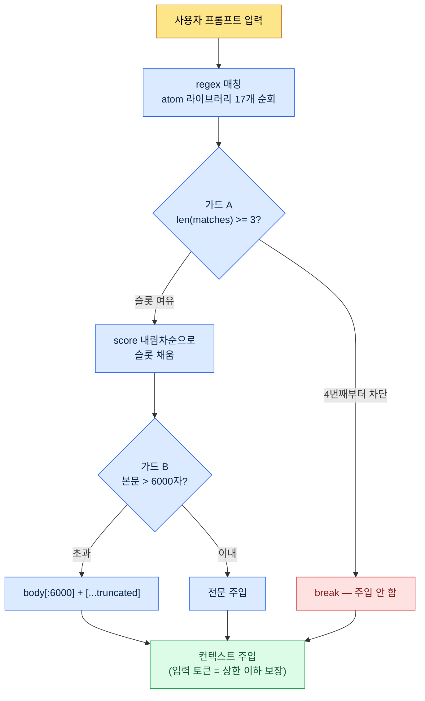

# 22.3 AI 비용 관리 — 토큰 예산을 코드로 지킨다

> 1차 독자: AI 도구를 팀에 도입하고 비용을 책임지는 기획 리드 (중규모(10\~50인) 팀)
> 1인/취미 독자용 축소 버전: §22.3.9 「혼자라면 이만큼만」

비용 챕터가 가짜 비용을 들면 그 자체로 자기모순이다. 그래서 이 장은 "우리 팀이 월 얼마를 아꼈다"는 매끈한 표를 만들지 않는다. 대신 두 종류의 숫자만 쓴다. 하나는 누구나 확인할 수 있는 **공개 토큰 단가**(모델별 1M 토큰 요금), 다른 하나는 저자가 직접 운영하는 hook 코드에 **고정되어 있는 상수**(`max_atom_body = 6000`, `max_matches = 3`)다. 둘 다 지어낸 게 아니라 인용한 것이다.

AI 비용이 무서운 건 금액이 커서가 아니다. **안 보여서**다. 도입 첫 달은 호출이 적어 청구서가 작다. 그러다 컨텍스트가 길어지고 호출이 잦아지면, 어느 분기 청구서가 자릿수를 바꾼다. 이 장의 결론을 먼저 말하면 이렇다 — 비용은 "아껴 쓰자"는 다짐이 아니라, **매 호출에서 토큰을 강제로 깎는 코드**로 통제한다. 사람의 의지가 아니라 wrapper와 truncate가 막는다.

---

## 22.3.1 LLM 비용은 사실상 '입력 토큰' 한 항목이다

비용 항목은 입력·출력·캐시 적중·캐시 쓰기 네 가지지만, 실무에서 청구서를 지배하는 건 **입력 토큰**이다. 이유는 단순하다. 게임 기획에서 AI를 쓰는 거의 모든 작업이 "긴 컨텍스트를 넣고 짧은 답을 받는" 형태이기 때문이다. L0 비전 문서, atom 라이브러리, 인접 도시 본문, 데이터 시트 발췌를 다 욱여넣으면 입력이 수만 토큰인데, 출력은 표 한 장이라 수백 토큰이다.

그래서 비용 통제의 1순위는 "출력을 줄이자"가 아니라 **"입력 토큰을 어디서 깎느냐"**가 된다. 이 한 줄이 이 장 나머지를 끌고 간다.

공개된 모델별 단가부터 못 박아 둔다. 아래는 Anthropic이 공개한 1M(100만) 토큰당 요금으로, **이 책 집필 시점 세대(Opus·Sonnet·Haiku의 당시 최신 등급)의 공개 단가를 그대로 인용한 스냅숏**이다(공식 공개 단가 인용 — 모델 세대·시점에 따라 변동하므로 적용 전 현재 가격표 확인 필수). 부록 K가 정리한 원칙대로, 여기서 변하지 않는 것은 **단가의 절대값이 아니라 세 등급 사이의 단가 비율**이다. 따라서 아래 표는 "오늘의 청구서"가 아니라 "등급을 내릴수록 단가가 자릿수로 떨어진다"는 구조를 읽는 용도로 본다.

| 모델 | 입력 1M 토큰 | 출력 1M 토큰 | 비고 |
|---|---|---|---|
| Claude Opus | $15 | $75 | 최상위 추론 (공개 단가) |
| Claude Sonnet | $3 | $15 | 중간 — 입력가 Opus의 1/5 |
| Claude Haiku | $0.80 | $4 | 경량 — 입력가 Opus의 약 1/19 |
| 캐시 적중(read) | 표준 입력가의 약 1/10 | — | 캐시된 입력 재사용 시 (공개 캐싱 정책) |

핵심은 마지막 두 줄이다. **같은 작업을 Opus 대신 Haiku로 돌리면 입력 토큰 단가가 약 1/19**이고, **같은 컨텍스트를 캐시에 태우면 그 부분 입력가가 약 1/10**이다. 비용 절감의 두 큰 축이 여기서 나온다 — 모델 적정화와 캐싱. 둘 다 "덜 쓰자"가 아니라 "같은 일을 더 싼 단가로 처리하자"는 구조다.

> 절약은 의지가 아니라 단가 차이에서 온다. Opus를 Haiku로 내리면 약 19배, 캐시를 태우면 약 10배가 자동으로 줄어든다.

---

## 22.3.2 가장 큰 입력 비용은 '매 호출 주입되는 컨텍스트'다

개별 작업 단가보다 더 조용히 누적되는 비용이 있다. **매 호출마다 자동으로 붙는 컨텍스트**다. 저자의 개인 PC에는 사용자가 프롬프트를 칠 때마다 관련 메모리(atom)를 자동으로 끼워 넣는 hook이 돈다(UserPromptSubmit hook, `inject_memory.py`). 이건 편의 기능이지만, 동시에 **비용 누수의 1순위 후보**이기도 하다. 매 입력마다 긴 atom 본문이 컨텍스트에 들어가니, 통제 없이 두면 입력 토큰이 호출마다 불어난다.

그래서 이 hook에는 비용을 깎는 안전장치가 세 겹으로 고정되어 있다. 추상론이 아니라 실제 코드의 상수다.

```python
# inject_memory.py — UserPromptSubmit hook (실제 운영 코드, 발췌)
# 설계 원칙 (docstring 원문):
#   - 항상 exit 0 (실패해도 사용자 흐름 방해 금지)
#   - score 내림차순으로 최대 3개 atom 주입
#   - atom 본문 6000자 초과 시 truncate

# (1) manifest config에서 예산 상수를 읽는다
max_matches = cfg.get("max_matches", 3)      # 한 호출 최대 atom 수
max_body    = cfg.get("max_atom_body", 6000) # atom 1개당 본문 상한(자)

# (2) score 내림차순 정렬 — 비싼 슬롯을 가치순으로 채운다
atoms_sorted = sorted(atoms, key=lambda a: a.get("score", 0), reverse=True)

matches = []
for atom in atoms_sorted:
    if len(matches) >= max_matches:   # (가드 A) 최대 3개에서 끊는다
        break
    if re.search(atom["regex"], prompt, re.IGNORECASE):
        matches.append(atom)

# (3) 본문 주입 시 6000자에서 잘라낸다
for atom in matches:
    body = atom_path.read_text(encoding="utf-8")
    if len(body) > max_body:          # (가드 B) truncate
        body = body[:max_body] + "\n\n[...truncated]\n"
```

여기에 세 겹의 비용 가드가 다 들어 있다.

- **가드 A — 개수 상한(`max_matches = 3`)**: 입력과 매칭되는 atom이 10개여도 최대 3개만 붙는다. atom 17개짜리 라이브러리 전체가 매 호출에 들어가는 사고를 코드가 막는다.
- **가드 B — 길이 상한(`max_atom_body = 6000`)**: atom 본문이 12,000자여도 6,000자에서 자른다. 긴 회고 atom 하나가 호출 비용을 두 배로 부풀리는 일이 구조적으로 불가능하다.
- **가드 C — score 우선순위**: 슬롯 3개를 score 높은 순으로 채운다. 즉 비싼 입력 토큰을 "가치 낮은 atom"이 차지하지 못한다.

이 세 상수가 곧 **호출당 입력 토큰의 상한**이다. 거칠게 어림하면, atom 한 개 6,000자는 한국어에서 대략 수천 토큰 규모다(정확한 토큰 수는 토크나이저·언어에 따라 달라지므로 절대값이 아니라 "상한이 걸려 있다"는 구조로 읽는 게 맞다). 3개 × 6,000자가 한 호출 주입 예산이고, 그 위로는 코드가 잘라 낸다. 사람이 "atom 너무 많이 붙었네"를 눈으로 발견할 필요가 없다.

---

## 22.3.3 [워크드 트랜스크립트] 6000자 truncate 한 줄이 비용을 어떻게 막는가

말로 "truncate가 비용을 막는다"고 하면 공허하다. 실제로 이 상수를 만들 때 AI와 한 사이클을 끝까지 돌렸다. 아래는 그 세션을 충실히 재현한 것이다. 입력 프롬프트는 그대로 복사해 쓸 수 있고, 출력은 실제 세션을 재구성했다.

### 1단계 — 입력: 문제 상황을 그대로 던진다

hook을 처음 가동한 직후, `_injection_log.txt`에 한 호출에서 atom 본문이 통째로 주입된 기록이 남았다. 긴 atom(회고·건강 컨텍스트 등)이 매 호출 풀 사이즈로 들어가면, 자주 쓰는 작업일수록 입력 토큰이 누적된다. 이걸 어디서 끊을지를 AI에게 물었다.

### 2단계 — 프롬프트: 한계와 형식을 강제한다

```
매 호출마다 atom을 컨텍스트에 자동 주입하는 hook(inject_memory.py)이 있어.
입력 토큰 비용을 막을 truncate 상한을 정하고 싶은데, atom 1개당 본문 글자 수
상한이랑 한 호출에 주입할 atom 개수 상한을 제안해 줘. 너무 짧으면 핵심이 잘리고
너무 길면 토큰이 새니까 그 트레이드오프도 같이 짚어 주고, 확신 안 서는 건
사람한테 넘기게 따로 표시해. (의도: 상한값은 config로 외부화 전제) 표로:
항목 | 제안값 | 근거 | 확신도.
```

프롬프트의 절반이 "한계와 형식 강제"인 점에 주목한다. 비용 관련 질문에 AI를 자유롭게 풀면 "상황에 따라 다릅니다" 같은 무책임한 답이 나온다. **구체 수치를 강제하고, 트레이드오프를 명시하게 하고, 확신 못 하면 신고하라는 탈출구**를 넣는 게 이 프롬프트의 핵심이다.

### 3단계 — Claude의 출력 (재구성, 발췌)

```
| 항목            | 제안값  | 근거                                          | 확신도 |
|----------------|--------|-----------------------------------------------|-------|
| max_atom_body  | 6000자 | 한국어 atom 1개의 '핵심+근거'가 대체로 4~6천자 | 중    |
|                |        | 안에 들어감. 6000자면 본문 머리(요지·규칙)는    |       |
|                |        | 거의 보존되고 꼬리(예시 나열)만 잘림.          |       |
| max_matches    | 3      | 입력 한 건이 동시에 강하게 매칭되는 주제는      | 높음  |
|                |        | 보통 1~3개. 4개 이상은 regex가 너무 넓다는 신호 |       |
| 외부화 위치     | _jit_manifest.json > config | 코드 재배포 없이 운영 중 조정 | 높음  |
| truncate 표식   | [...truncated] 꼬리 부착     | 잘렸음을 모델·사람이 인지     | 중    |
| 확신 못 하는 점  | 6000이 정확값인지            | 토크나이저별 토큰 환산이 언어· | ★낮음 |
|                | (자→토큰 환산 불확실)        | 모델마다 달라 자 단위는 근사치  |       |
```

출력에서 가장 가치 있는 건 표가 아니라 **맨 아래 ★ 줄**이다. AI가 "6000이 정확한 최적값인지는 모른다, 자→토큰 환산이 불확실하다"고 스스로 신고했다. 좋은 프롬프트는 AI가 모른다고 말하게 만든다.

### 4단계 — 검증과 거부 (사람의 자리)

이 출력을 그대로 받지 않았다. AI는 6000자를 "핵심이 보존되는 선"으로 제시했지만, 실제로 6000자에서 자르면 무엇이 잘리는지 직접 확인해야 한다. 가장 긴 atom(건강 컨텍스트, 회고 누적본)을 골라 6000자 지점을 눈으로 봤다.

확인 결과 한 건이 걸렸다. **6000자 지점이 본문 한가운데 표 행을 끊어** `| 마운자로 | 5mg |` 같은 줄이 절반에서 잘렸다. 의미는 보존됐지만, 잘린 표 행이 모델에게 깨진 마크다운으로 들어가는 게 찜찜했다. 그래서 재요청했다.

### 5단계 — 재요청

```
6000자에서 자를 때 마크다운 표 행 중간이 끊기는 경우가 있어. 절단 위치를
직전 줄바꿈 경계로 스냅하는 보정이 나을까? 구현이 truncate 효과보다 복잡해지면
안 되니까, 비용 대비 가치 따져서 할지 말지까지 결론 내 줘.
```

AI는 이렇게 답했다 — "줄 경계 스냅은 `body[:max_body].rsplit('\n', 1)[0]` 한 줄로 가능하나, **truncate의 목적이 토큰 상한이지 표 무결성이 아니므로** 깨진 표 행 한 줄은 비용·동작에 영향이 미미하다. 현재 `[...truncated]` 표식만으로 모델이 '여기서 잘렸다'를 인지하므로, 줄 스냅은 **하지 않기를 권장**한다. 굳이 한다면 한 줄짜리 보정으로 충분하다."

이 답이 옳았다. 비용 통제 코드에 표 무결성까지 욕심내면, 가드 코드 자체가 비대해진다. **현재 운영 코드는 `body[:max_body] + "[...truncated]"`의 단순 절단을 유지한다.** AI의 첫 제안(6000자)을 사람이 검증하고, 과잉 보정 욕심을 AI가 다시 눌러 준, 한 번의 왕복으로 닫힌 사이클이다.

---

## 22.3.4 비용 가드의 구조 — 한눈에

위 세션에서 정한 상수들이 실제 호출에서 어떻게 입력 토큰을 깎는지, 전체 흐름을 도식으로 기록해 둔다.



이 그림의 요점은 **사용자가 무엇을 입력하든 호출당 주입 토큰에 천장이 있다**는 것이다. 천장은 `3 × 6000자`(+표식)이고, 그 위로는 코드가 무조건 잘라 낸다. 비용이 사용자의 절제력에 기대지 않는다. 가드 A·B가 매 호출에서 기계적으로 작동한다.

같은 철학이 도구 레벨에서도 반복된다. 저자의 회사 시스템에는 글로벌 슬롯에 노출되는 wrapper 스킬을 **정확히 12개로 고정**하는 정책이 있다(atom `skill_listing_budget_wrapper_only_policy`). 세션 시작 시 글로벌 `*` wrapper 개수가 12가 아니면 정리 스크립트가 자동으로 돈다. 명목은 "슬롯 정돈"이지만 본질은 **세션 시작 토큰 예산 보호**다 — 스킬 목록이 컨텍스트에 실리는 비용을 12개 분량으로 묶어 둔 것이다. atom 주입 3개 상한과 스킬 노출 12개 상한은 같은 사상의 다른 적용이다.

---

## 22.3.5 작업별 모델 배분 — 80%는 더 싼 단가로

가드가 호출당 토큰을 막는다면, 모델 선택은 그 토큰의 단가를 결정한다. §22.3.1 표에서 입력가가 Opus:Sonnet:Haiku ≈ 19:4:1이었다. 그러므로 모든 작업을 Opus로 돌리는 건, 분류·치환 같은 단순 작업에까지 19배 단가를 무는 셈이다.

작업 복잡도에 따라 단가를 배분한다.

| 작업 유형 | 권장 모델 | 이유 |
|---|---|---|
| 검증·법무 직결, 결정 분석 | Opus | 틀리면 사고가 큰 작업 — 단가를 아끼지 않는다 |
| 보고서·요약·자연어 가공 | Sonnet | 품질 필요하나 최상위 추론까지는 불필요 |
| 분류·태깅·키워드 추출 | Haiku | 단순 패턴 — Opus의 약 1/19 단가로 충분 |
| 단순 매핑·치환 | Haiku 또는 결정론 | LLM조차 불필요한 경우가 많음 |

경험상 작업의 대부분은 Sonnet·Haiku로 충분하다. **비싼 모델은 "틀리면 비싼 작업"에만 쓴다.** 다만 한 가지 함정이 있다 — 너무 싼 모델로 내리면 환각이 늘어 검증 비용이 절감액을 잡아먹는다(앞 장 §22.2 환각·안전성과 직결). 그래서 모델 배분은 "무조건 싸게"가 아니라 "틀려도 싼 작업은 싸게, 틀리면 비싼 작업은 비싸게"의 분리다.

마지막 줄 "단순 매핑·치환 → 결정론"이 가장 큰 절감일 때가 많다. 이름 치환, 정해진 규칙 매핑처럼 답이 하나로 정해진 일은 LLM을 부를 필요가 없다. **호출 자체를 0으로 만드는 게 가장 싼 호출**이다.

---

## 22.3.6 캐싱 — 같은 입력은 1/10 단가로

호출당 토큰을 막고(가드), 단가를 낮춰도(모델 배분), **같은 컨텍스트를 매 호출 새로 전송하면** 비용이 샌다. L0 비전 문서, atom 라이브러리, 분야 스타일 가이드처럼 거의 변하지 않는 긴 입력은 캐싱한다. 캐시 적중 시 그 입력 부분이 표준가의 약 1/10로 청구된다(§22.3.1 표).

```python
# 변하지 않는 컨텍스트는 cache_control로 표시 — 캐시 적중 시 약 1/10가
messages = [
    {"role": "system", "content": SYSTEM_PROMPT},
    {"role": "user", "content": [
        {"type": "text", "text": L0_VISION,    "cache_control": {"type": "ephemeral"}},
        {"type": "text", "text": ATOM_LIBRARY, "cache_control": {"type": "ephemeral"}},
        {"type": "text", "text": SPECIFIC_TASK},  # 매번 바뀌는 부분만 캐시 밖
    ]},
]
```

핵심은 **변하는 부분과 안 변하는 부분을 분리**하는 것이다. 캐시는 입력 앞쪽이 동일해야 적중하므로, 고정 컨텍스트(L0·atom)를 앞에, 매번 바뀌는 작업 지시를 뒤에 둔다.

무엇을 캐시에 태울지는 변경 빈도로 가른다.

| 컨텍스트 | 캐싱 | 이유 |
|---|---|---|
| L0 비전 (거의 불변) | 적합 | 며칠\~몇 주 단위로만 바뀜 |
| atom 라이브러리 | 적합 | 회고 때만 갱신 |
| 분야 스타일 가이드 | 적합 | 분기 단위 변경 |
| 최근 회의록 | 부적합 | 매일 바뀜 — 캐시 적중률 낮음 |
| 사용자 입력 | 부적합 | 매 호출 고유 |

캐시 TTL은 짧으면 수 분 단위라, **연속으로 같은 컨텍스트를 두드리는 작업**(도시 30개 양산처럼 같은 L0를 30번 재사용)에서 효과가 가장 크다. 단발성 질문에는 캐시 쓰기 비용만 들고 적중이 안 나 오히려 손해일 수 있다 — 그래서 "자주·연속으로 같은 컨텍스트를 쓰는 작업"에만 선별 적용한다.

---

## 22.3.7 수치를 정직하게 다루는 법

비용 챕터는 "월 $5,000을 $1,000으로 줄였다" 같은 표를 넣고 싶은 유혹이 가장 큰 자리다. 그런 절대 절감액은 팀 규모·작업량에 따라 천차만별이라, 지어내는 순간 비용 챕터가 비용에 대해 거짓말을 하는 자기모순이 된다. 이 장은 세 종류의 숫자만 썼다.

첫째, **공개 단가는 그대로 인용한다.** §22.3.1의 Opus $15 / Sonnet $3 / Haiku $0.80(입력 1M 토큰), 캐시 적중 약 1/10은 Anthropic이 공개한 요금이다. 입력가 비율 19:4:1, 캐싱 약 10배 절감은 이 공개 단가에서 산술로 나온 값이다 — 추정이 아니라 계산이다.

둘째, **코드 상수는 코드를 인용한다.** `max_atom_body = 6000`, `max_matches = 3`은 실제 `inject_memory.py`와 `_jit_manifest.json`에 기록된 값이다. 비유가 아니라 실파일이다.

셋째, **모르는 건 모른다고 쓴다.** "6000자가 몇 토큰이냐"는 토크나이저·언어·모델에 따라 달라 자 단위는 근사치다. §22.3.3에서 AI도 이 점을 ★로 신고했다. 그래서 이 장 어디에도 "6000자 = N토큰 = $X 절감" 같은 환산 표는 없다. 절대 절감액 대신 **방향과 비율**(19배·10배)로만 말한다.

> 이 장의 비용 수치는 공개 단가(Anthropic 요금표)이거나, 코드에 고정된 상수(`inject_memory.py`·`_jit_manifest.json`)이거나, "모른다"고 명시한 근사치다.

---

## 22.3.8 흔한 실패

| 패턴 | 왜 실패하나 | 처방 |
|---|---|---|
| 모든 작업에 최상위 모델 | 분류·치환에까지 약 19배 단가 | 작업별 모델 배분 (§22.3.5) |
| 매 호출 같은 컨텍스트 재전송 | 캐시 적중 1/10를 버림 | 고정 컨텍스트 캐싱 (§22.3.6) |
| 자동 주입에 상한 없음 | atom 라이브러리 통째로 매 호출 주입 | 개수·길이 가드 (§22.3.2) |
| 비용을 "아껴 쓰자"는 다짐으로 관리 | 사람 절제력은 폭증을 못 막음 | 코드에 상한을 고정함 |
| 결정론으로 될 일까지 LLM 호출 | 가장 싼 호출은 '호출 안 함' | 매핑·치환은 코드로 분리 |

네 번째가 핵심이다. 비용 통제를 사람의 의지에 맡기면 반드시 샌다. 의지는 바쁠 때 가장 먼저 무너지는데, 비용은 바쁠 때 가장 빨리 는다. 그래서 통제는 `max_matches = 3` 같은 **코드 상수**여야 한다.

---

> **게임 밖 적용.** AI 비용이 무서운 건 금액이 커서가 아니라 안 보여서이고, 이건 게임팀이든 마케팅팀이든 똑같습니다. 비용은 "아껴 쓰자"는 다짐이 아니라 구조로 잡습니다. 첫째, 작업 난이도에 맞춰 모델 단가를 배분합니다 — 단순 분류·태깅까지 최상위 모델로 돌리면 같은 일에 몇 배 단가를 무는 셈이고, 단순 매핑·치환은 아예 호출하지 않는 게(규칙·수식으로 처리) 가장 싼 호출입니다. 둘째, 거의 안 바뀌는 긴 입력(회사 소개·정책 문서·용어집)은 캐싱해 재전송 비용을 줄입니다. 예를 들어 고객 문의를 분류하는 일은 경량 모델로 충분하고 복잡한 계약 검토만 상위 모델에 맡기면, 품질을 지키면서 단가를 가릅니다. 자동으로 긴 컨텍스트가 붙는 지점이 있다면 "한 번에 붙는 개수·길이 상한"을 정해 두는 것이, 어느 날 청구서가 자릿수를 바꾸는 사고를 구조적으로 막습니다.

## 22.3.9 따라하기 — 오늘 할 수 있는 한 단계

> **혼자라면 이만큼만**: hook도 manifest도 없어도 됩니다. 본인이 자주 쓰는 AI 도구에서, 다음 작업 한 건의 모델을 한 단계 내려 보세요(Opus로 하던 요약을 Sonnet으로, Sonnet 분류를 Haiku로). 출력 품질이 충분하면 그 작업은 영구히 더 싼 단가로 고정됩니다. "이 작업이 정말 최상위 모델이 필요한가"를 작업당 한 번씩만 물어도, 절감의 절반은 거기서 나옵니다.

팀이라면 다음 한 단계로 시작하세요. 자동으로 컨텍스트를 주입하는 지점(hook·시스템 프롬프트·RAG)을 하나 찾아, 거기에 §22.3.2의 두 가드(주입 개수 상한 1개, 본문 길이 상한 1개)를 코드로 넣습니다. `inject_memory.py`처럼 상한을 config로 외부화하면, 운영 중에 코드 재배포 없이 숫자만 조정할 수 있습니다. 가드 두 줄이 "어느 날 청구서가 자릿수를 바꾸는" 사고를 구조적으로 막습니다.

setup → prompt → verify로 요약하면 — **setup**: 자동 주입 지점에 개수·길이 상한 상수를 넣고 config로 뺍니다. **prompt**: §22.3.3 형식으로 상한값을 AI에게 제안받되 트레이드오프와 확신도를 강제합니다. **verify**: 가장 긴 입력을 골라 상한 지점에서 무엇이 잘리는지 직접 눈으로 확인합니다.

---

### 이 챕터의 핵심 메시지
- 입력 토큰이 비용의 대부분 — 통제 1순위는 "입력을 어디서 깎느냐"다.
- 절감은 의지가 아니라 코드 상수(`max_matches=3`·`6000자 truncate`)로 한다.
- 단가 차이를 쓴다 — 모델 배분 약 19배, 캐싱 약 10배.

### 다음 챕터 미리보기
- 22.4 저작권·라이선스와 윤리 — AI 도구 사용의 법무·합의 안전 운영
