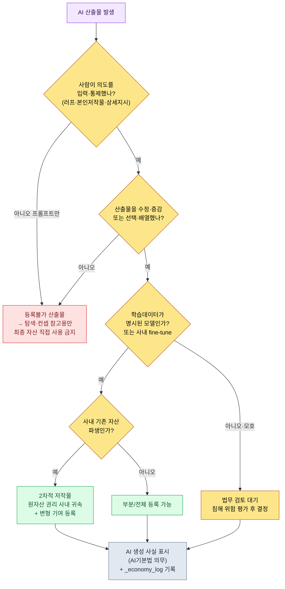

# 22.4 저작권과 윤리 — 산출물의 권리·표시·합의를 한 절차로 닫는다

> 1차 독자: AI 도입을 책임지는 게임 디렉터·리드 (중규모(10~50인) 팀)
> 1인/취미 독자용 축소 버전: §22.4.9 「혼자라면 이만큼만」

출시 두 달 전, 컨셉 아티스트가 만든 도시 일러스트 한 장을 두고 회의가 멈춘 적이 있다. 누군가 물었다. "이거 AI로 뽑은 거 맞죠? 그럼 저작권은 우리 건가요, 아니면 등록도 안 되나요?" 아무도 답하지 못했다. 그 자리에서 나온 의견은 세 갈래였다. "AI가 만들었으니 우리 게 아니다", "우리가 돈 내고 돌렸으니 우리 거다", "법이 아직 없으니 그냥 쓰자". 셋 다 틀렸다. 그리고 이 질문은 단순한 법무 이슈가 아니었다. 그 일러스트를 만든 아티스트의 역할이 무엇인지, 팀이 AI 사용을 어떻게 합의했는지가 그 자리에서 한꺼번에 걸려 있었다.

이 장은 저작권과 윤리를 따로 다루지 않는다. 실무에서 둘은 같은 질문의 앞뒤이기 때문이다. "이 산출물의 권리가 누구 것이냐"(저작권)는 "이 산출물에 사람이 얼마나 개입했느냐"(윤리·역할)로 곧장 환원된다. 한국저작권위원회가 2025년에 못 박은 등록 요건이 정확히 그 지점이다. 그래서 이 장의 척추는 하나의 워크드 트랜스크립트가다 — AI 컨셉 아트 한 장의 저작권 등록 가능성을 실제로 판정하고, 그 판정이 팀 역할 합의로 어떻게 이어지는지를 입력에서 결정까지 끝까지 따라간다.

> **저자 실제 운영 메모**
> 이 장에서 인용하는 `design_intent_vs_automation_boundary` atom과 `_economy_log`·`_roi_report.md`는 저자가 회사에서 실제로 운영하는 거버넌스 자산을 익명화한 것이다. atom 이름·로그 파일명은 실제 운영명을 그대로 옮겼다(IP 보호를 위해 회사·프로젝트 고유명만 치환). 워크드 트랜스크립트의 출력은 실제 판정 세션을 재구성한 것이다.

---

## 22.4.1 권위는 '느낌'이 아니라 공개 가이드라인에서 온다

AI 저작권을 "법이 아직 없으니 흐릿하다"고만 적는 책이 많다. 절반만 맞다. 2025년 6월, 문화체육관광부와 한국저작권위원회가 「생성형 AI 활용 저작물의 저작권 등록 안내서」를 발표하면서, 적어도 한국에서 등록 가능 여부의 선은 분명해졌다. 지어낼 필요가 없다.

안내서의 핵심은 한 문장으로 줄어든다. **저작권 등록의 요건은 '인간의 창작적 기여'다.** 여기서 두 종류가 갈린다.

| 구분 | 정의 | 등록 |
|---|---|---|
| GAI 산출물 | 인간의 창작적 기여 없이 AI가 낸 결과물 | 불가 |
| GAI 활용 저작물 | 인간이 AI를 도구로 써서 만든 결과물 중 창작적 기여가 인정되는 부분 | 가능 |

그리고 안내서는 '활용 저작물'로 인정받는 세 경로를 제시한다. ① 이용자의 저작물을 프롬프트로 넣어 그 창작성이 산출물에 나타난 경우, ② 산출물을 수정·증감한 추가 작업에 창작성이 있는 경우, ③ 산출물을 선택·배열·구성한 데 창작성이 있는 경우다. 판단의 두 축은 **'통제 가능성'과 '예측 가능성'**이다. 창작자가 표현하려는 바를 명확히 결정하고 그 의도대로 결과물을 끌어낼 수 있어야 창작성이 인정된다.

이 대목이 결정적이다. 안내서가 법적 언어로 말하는 "통제 가능성·예측 가능성"은, 이 책이 §1.1부터 반복한 **"기획자는 의도를 제공한다"**(`planner_provides_intent_not_recommendation` atom)와 같은 말이다. AI에게 통째로 맡긴 산출물은 통제·예측이 없으니 저작권도 없고, 사람이 의도를 입력하고 검수·재구성한 산출물은 권리가 따라온다. 저작권 등록 가능성과 좋은 AI 워크플로의 조건이 같은 선 위에 있다.

또 하나의 공개 기준이 있다. 2026년 시행되는 AI 기본법은 생성형 AI 산출물에 **투명성 확보 의무(AI 생성 사실 표시)**를 부과한다. 등록(권리를 주장하는 쪽)과 표시(사용 사실을 밝히는 쪽)는 별개의 의무다. 권리가 생기든 안 생기든, AI를 썼다는 사실 자체는 밝혀야 한다. 이 두 공개 기준이 이 장에서 AI에게 줄 **룰북의 1차 입력**이 된다.

---

## 22.4.2 [워크드 트랜스크립트] AI 컨셉 아트 한 장의 등록 가능성을 판정한다

서두의 그 일러스트로 돌아간다. 이걸 "느낌"으로 판단하지 않고, §22.4.1의 안내서 기준을 룰북으로 입력해 AI에게 1차 분류를 시킨다. 사람은 마지막 판정만 한다. 아래 입력 프롬프트는 그대로 복사해 쓸 수 있고, 출력은 실제 판정 세션을 재구성한 것이다.

### 1단계 — 입력: 산출물의 생성 이력을 그대로 던진다

판정의 입력은 일러스트가 아니라 그 일러스트가 어떻게 만들어졌는지의 로그다. 이건 이미 자산 메타데이터에 있으니 추출만 하면 된다.

```yaml
# asset_concept_city021_v4.meta.yaml — 판정 대상 산출물의 생성 이력
asset_id: concept_city021_v4
asset_type: concept_illustration
created_by: 팀원 A (컨셉 아티스트)
generation_log:
  - step: 1
    actor: 팀원 A
    action: "직접 그린 도시 레이아웃 러프 스케치를 입력 이미지로 첨부"
  - step: 2
    actor: AI (image_model)
    action: "러프 + 프롬프트로 4종 변형 생성"
    prompt: "stone observatory tower over sealed magic core, cold arid, scholar guild, muted palette"
  - step: 3
    actor: 팀원 A
    action: "4종 중 1종 선택, 종탑 실루엣·채도·구도 직접 리터칭 (약 40% 영역 재작업)"
  - step: 4
    actor: 팀원 A
    action: "배경 봉인진 문양을 직접 디자인해 합성"
ai_generated_disclosure: true   # AI 기본법 표시 의무 충족
```

### 2단계 — 프롬프트: 안내서 기준으로 분류하되, 근거를 강제한다

```
첨부한 meta.yaml은 컨셉 일러스트 한 장의 생성 이력이야. 한국저작권위원회
「생성형 AI 활용 저작물의 저작권 등록 안내서」(2025) 기준으로 등록 가능성을
등록가능/부분등록/등록불가 중 하나로 분류해 줘. 근거는 안내서의 두 축(통제
가능성·예측 가능성)으로 각각 한 줄씩 대고, generation_log에서 어느 step이
'창작적 기여'인지 번호로 짚어 줘. 법적으로 단정 못 하는 건 '법무 확인 필요'로
표시해서 사람한테 넘겨. 표로: 분류 | 근거(통제) | 근거(예측) | 기여 step | 법무확인.
```

프롬프트의 절반이 "근거 강제"와 "법무 탈출구"라는 점에 주목한다. AI에게 법적 판단을 통째로 맡기면 그럴듯한 단정을 토해낸다. 분류 기준(안내서 3구분), 근거 의무(두 축), 기여 step 지목, 그리고 "단정 못 하면 법무에 넘겨라"는 탈출구를 넣는 게 이 프롬프트의 핵심이다.

### 3단계 — Claude의 출력 (실제 세션 재구성)

> ```
> | 분류     | 근거(통제 가능성)              | 근거(예측 가능성)            | 기여 step | 법무확인 |
> |---------|------------------------------|----------------------------|----------|---------|
> | 부분등록 | 러프 스케치(step1)와 40% 리터칭 | 4종 중 선택은 예측 가능,      | 1,3,4    | ★       |
> |         | (step3)으로 표현 의도 직접 통제   | AI 4종 변형 자체는 예측 불가  |          |         |
>
> 분석:
> - step1(직접 러프 입력): 안내서 ① '본인 저작물 입력으로 창작성 반영' 해당.
> - step3(40% 리터칭): 안내서 ② '수정·증감 추가 작업' 해당. 가장 강한 기여.
> - step4(봉인진 문양 직접 디자인): 독립 저작물 합성, 명백한 인간 창작.
> - step2(AI 4종 변형): 인간의 창작적 기여 없는 순수 산출물 → 이 부분 단독으로는 등록 대상 아님.
>
> ★ 법무확인 필요: "40% 리터칭"이 '실질적 개변'에 이르는지는 정량 기준이 없음.
>   리터칭 비율이 등록 가능 경계선을 넘는지는 변호사 검토 권장.
>   (AI는 비율의 법적 충분성을 단정할 수 없음.)
> ```

출력에서 가장 값진 부분은 표가 아니라 맨 아래 **★ 법무확인**이다. AI가 "40% 리터칭이 법적으로 충분한지 나는 단정 못 한다"고 자기 한계를 신고하고 사람에게 넘겼다. 좋은 프롬프트는 AI가 모른다고 말할 수 있게 만든다. 자동 거부형이 아니라 자동 신고형이다.

### 4단계 — 검증과 거부 (사람의 자리)

이 출력을 그대로 받으면 안 된다. 디렉터가 룰북으로 한 번 친다. AI는 step4(봉인진 문양)를 "독립 저작물"이라 분류했는데, 생성 이력을 다시 보니 그 문양은 §6.2의 `city_hunting_generator`가 만든 도시 lore에서 파생된 것이었다. 즉 step4는 순수 창작이 아니라 **회사 내부 자산 위에 얹은 2차 작업**일 수 있다. 회사 자산이므로 권리 귀속은 명확하지만, "독립 저작물"이라는 AI의 표현은 등록 신청서에 그대로 쓰면 오해를 부른다.

그래서 재요청한다.

```
step4의 봉인진 문양은 사내 도시 lore 자산에서 파생된 2차 작업이다(독립 신규 창작 아님).
이 사실을 반영해 step4의 기여 성격을 재분류하라.
등록 신청 시 '기존 사내 자산 기반'임을 어떻게 기재해야 하는지도 한 줄로 제안하라.
```

이 한 번의 왕복으로 닫힌다. AI는 step4를 "독립 저작물"에서 "사내 lore 자산의 2차적 저작물 — 원자산 권리 사내 귀속, 변형 기여는 등록 대상"으로 다시 답했고, 그 판정은 법무 검토로 넘어갔다. 결론은 **부분등록 + AI 생성 사실 표시**로 확정됐다. 통째로 손으로 하면 법무가 자산마다 생성 이력을 캐물어야 하지만, AI 초안 + 룰북 검수 + 1회 왕복이면 법무는 ★ 표시된 경계 사례에만 시간을 쓴다.

이 한 바퀴가 이 장의 Show 기준이다. "AI 저작권은 흐릿하다"는 문장은, 한 산출물의 생성 이력을 안내서 기준으로 끝까지 분류해 보기 전까지는 공허하다.

---

## 22.4.3 의사결정 트리 — 이 산출물, 쓸 수 있나

위 세션의 판단을 매번 처음부터 하지 않으려면, 안내서 기준을 흐름도로 기록해 둔다. 자산 하나가 들어오면 이 트리를 따라 내려가면 된다. 분기점은 전부 §22.4.1의 공개 기준이다.



트리의 끝(J)이 모든 경로에서 같다는 점이 핵심이다. 등록이 되든 안 되든, 회사 자산이든 2차 저작물이든, **AI를 썼다는 사실 표시와 생성 이력 로그는 예외 없이 남긴다.** 표시는 권리와 별개의 의무이고, 로그는 사고가 났을 때 책임을 추적하는 유일한 근거다. 서두의 회의가 멈춘 이유는 이 로그가 없어서 step별로 누가 무엇을 했는지 아무도 재구성할 수 없었기 때문이다.

빨간 경로(C, 등록불가)도 그냥 버리는 게 아니다. "프롬프트만 넣은 순수 AI 산출물"은 탐색·컨셉 단계의 참고용으로는 충분히 쓴다. 다만 그걸 최종 자산으로 게임에 넣지 않을 뿐이다. AI 출력을 그대로 출시에 올리는 것이 사후 저작권 사고의 가장 큰 빌미다.

---

## 22.4.4 저작권 룰북을 운영 로그로 — `design_intent_vs_automation_boundary`

트리(§22.4.3)는 판단의 흐름이고, 그 흐름을 매번 같은 선으로 긋게 만드는 것은 atom 하나다. 회사 거버넌스 자산 중 `design_intent_vs_automation_boundary`가 이 장 전체의 척추다.

이 atom의 한 줄 정의는 "설계 의도는 사람이, 자동화는 도구가 — 그 경계를 자산마다 명시한다"이다. 추상적 구호가 아니다. 이 atom은 JIT hook(`inject_memory.py`)에 등록돼 있어서, 프롬프트에 "저작권"·"AI 생성"·"자산 등록" 같은 키워드가 들어오면 세션에 자동 주입된다. hook의 설계 원칙이 이 atom의 운영을 그대로 받쳐 준다.

```python
# inject_memory.py — 항상 exit 0, 실패해도 사용자 흐름을 막지 않는다 (발췌)
def main() -> None:
    ...
    # score 내림차순 정렬 후 매칭 — 최대 3개 atom만 주입
    atoms_sorted = sorted(atoms, key=lambda a: a.get("score", 0), reverse=True)
    matches = []
    for atom in atoms_sorted:
        if len(matches) >= max_matches:   # 과주입 방지
            break
        try:
            if re.search(atom["regex"], prompt, re.IGNORECASE):
                matches.append(atom)
        except re.error:
            continue
    if not matches:
        emit_empty()   # 매칭 없으면 빈 응답 (정상)
        return
```

여기서 거버넌스적으로 중요한 설계가 두 가지다. 첫째, hook은 **항상 `exit 0`**이다(스크립트 docstring 명시). 저작권 룰을 주입하다 실패해도 사용자 작업을 절대 막지 않는다. 안전장치가 작업을 인질로 잡으면, 팀은 한두 분기 안에 그 장치를 꺼 버린다. 둘째, **최대 3개만 주입**한다. 모든 거버넌스 룰을 매 세션 다 들이밀면 컨텍스트가 터지고 아무도 안 읽는다. score 높은 룰만 떠오른다.

이게 §6.2의 lint가 위반을 자동 폐기하지 않고 작가 게이트로 alert만 올린 것과 같은 철학이다. **의심 후보는 기계가 뽑되, 죽일지 살릴지는 사람이 정한다.** 저작권에서도 같다. atom은 "이 자산 저작권 확인했나"를 자동으로 띄우되, 등록 가능 여부의 최종 판정은 사람과 법무가 한다.

---

## 22.4.5 권리 다음은 사람 — 역할 진화를 합의로 닫는다

서두의 일러스트 판정은 저작권에서 끝나지 않았다. 그 자산을 만든 팀원 A의 일이 "그리는 것"에서 "AI 4종을 선택하고 40%를 리터칭하는 것"으로 옮겨 갔다는 뜻이기 때문이다. 저작권이 "사람의 창작적 기여"를 요구하는 순간, 그 기여를 하는 사람의 역할 정의가 따라 바뀐다. 둘은 같은 사건의 앞뒤다.

여기서 가장 흔한 사고는 이 변화를 통보로 처리하는 것이다. 도구가 좋아도 6개월 뒤 아무도 안 쓰면, 도구가 나빴던 게 아니라 합의가 없었던 경우가 대부분이다. 역할이 양산에서 선택·검수·재구성으로 옮겨 가는 게 도입의 본질인데, 이걸 명시하고 교육으로 받쳐 주지 않으면 팀원은 "내 자리가 사라진다"로 받아들인다.

| 직군 | AI 이전 | AI 이후 (역할 진화) | 저작권상 의미 |
|---|---|---|---|
| 컨셉 아티스트 | 전량 직접 작화 | 의도 입력·선택·리터칭 | 리터칭이 곧 '창작적 기여' |
| 밸런서 | 수동 시뮬 | 시뮬 해석·결정 | 결정 로그가 책임 근거 |
| 기획자 | 명세 전량 집필 | 의도 제공·검수 | 의도 입력이 통제 가능성 |

표가 말하는 한 줄은 이렇다. **저작권 등록을 가능하게 하는 '사람의 기여'가, 곧 역할 진화 후 사람이 하는 일이다.** 안내서가 요구하는 통제·예측이 사라지면 저작권도 사라지고 사람의 자리도 사라진다. 그래서 역할 진화는 일자리를 빼앗는 변화가 아니라, 권리와 책임을 사람 손에 남기는 변화로 설명돼야 합의가 된다.

합의는 끝없는 회의가 아니다. 절차로 닫는다. 도입 제안(디렉터) → 전 팀 사전 공유(목적·영향 역할·측정 지표·위험) → 합의 회의(자유 발언·우려 수집) → 필요한 멤버 1:1 → 조정안 발표 → 합의 또는 보류. 모든 멤버의 동의를 받아야 시작하는 건 아니지만, 우려를 절차로 듣고 조정한 뒤 디렉터가 결정한다. 절차가 없으면 합의가 매번 0부터 다시 시작되고, 그 비용이 도입을 지연시킨다.

---

## 22.4.6 비용·ROI도 윤리의 일부 — `_roi_report.md`로 정직하게

윤리를 일자리·합의로만 좁히면 한 축을 놓친다. AI 운영의 비용과 효과를 정직하게 측정해 공개하는 것 자체가 거버넌스다. 측정 없이 "AI로 효율이 올랐다"고만 말하면, 팀원은 그 말을 자기 자리를 줄이는 명분으로 의심한다.

회사 거버넌스 인프라에는 이를 위한 실제 자산이 둘 있다. atom 시스템의 `_economy_log/`(토큰·시간 경제성 로그)와 `_roi_report.md`(ROI 보고)다. 전자는 매 세션의 토큰·시간을 기계가 적고, 후자는 그걸 주기로 합산해 사람이 읽는다. 핵심은 이 로그가 "AI가 사람을 얼마나 대체했나"가 아니라 "사람 시간을 어디로 풀어 줬나"를 추적한다는 점이다.

이 책의 수치 원칙은 세 가지 중 하나다. 첫째, 공개 표준은 그대로 인용한다(안내서 등록 요건, AI기본법 표시 의무). 둘째, 저자 추정은 추정이라고 쓴다. 셋째, 측정 가능한 것만 KPI로 약속한다. 저작권·윤리 영역에서 측정 가능한 것은 결과 지표가 아니라 절차 지표다.

| 측정 항목 | 측정 방법 | 약속 가능 여부 |
|---|---|---|
| AI 생성 사실 표시 누락 건수 | 자산 메타 `ai_generated_disclosure` grep | 측정 가능 (목표 0) |
| 생성 이력 로그 보유율 | `generation_log` 있는 자산 비율 | 측정 가능 |
| 법무 미검토 채 출시된 AI 자산 | 출시 빌드 vs 법무 통과 목록 대조 | 측정 가능 (목표 0) |
| "AI 때문에 매출이 올랐다" | — | 측정 불가, 약속 안 함 |

마지막 줄이 정직성의 핵심이다. AI 도입의 매출 효과는 단일 변수로 분리되지 않으니 인과를 단정하지 않는다. 대신 "AI 생성 자산 중 표시·로그·법무 검토를 통과한 비율"은 `_economy_log`와 자산 메타로 실제로 셀 수 있다. 거버넌스가 약속하는 건 결과가 아니라 절차의 무결성이다.

---

## 22.4.7 사용자 생성 콘텐츠(UGC)와 데이터 보호

자산 권리·역할·비용을 정리하면 한 영역이 남는다. 사용자가 AI로 만든 콘텐츠를 게임에 올리는 경로다. 회사가 만든 자산은 사내 절차로 닫지만, UGC는 통제 밖의 산출물이 쏟아져 들어온다.

여기서도 §22.4.3 트리의 끝(표시·로그)이 그대로 적용된다. 사용자 업로드 코스튬·길드 엠블럼은 AI 생성 표시를 요구하고, 자동 검수 + 사람 게이트의 결합으로 모더레이션한다. 어느 한 축만 운영하면 다음 분기의 사고가 누적된다. 그리고 사용자 데이터는 LLM에 함부로 보내지 않는다. 개인정보·결제정보는 전송 금지, 행동 로그는 익명화 후 전송이 원칙이다(GDPR·국내 개인정보보호법 준수).

관할은 한국 한 곳으로 끝나지 않는다. 해외 이용자를 받는 순간 그 이용자가 속한 지역의 데이터 규제가 함께 걸린다. EU 이용자에게는 GDPR이 개인정보의 역외 이전·동의·삭제권에 별도 요건을 두고, 다른 서비스 국가도 각자의 개인정보·데이터 현지화 규정을 둔다. 그래서 표 셋째 줄의 '개인정보·결제정보 LLM 전송 금지'는 어느 관할에서나 가장 안전한 기본값이고, 행동 로그를 외부 모델에 보낼 때의 익명화·가명처리 강도는 서비스하는 지역에 맞춰 별도로 점검해야 한다. 다만 이 절은 절차 설계의 안내일 뿐 법률 자문이 아니다. 글로벌 출시·역외 이전이 걸리면 해당 관할의 법무 검토를 반드시 따로 받는다.

| UGC/데이터 | 정책 | 근거 |
|---|---|---|
| 사용자 업로드 코스튬·엠블럼 | AI 표시 + 자동검수 + 사람 게이트 | AI기본법 표시 의무 |
| 캐릭터 닉네임·게시글 | 일반 약관 + 사용자 책임 | — |
| 개인정보·결제정보 | LLM 전송 금지 | 개인정보보호법 |
| 게임 행동 로그 | 익명화 후 전송 | 익명화 가명처리 |

UGC가 늘수록 모더레이션 부담이 커진다. 자동 검수가 1차로 거르고, 경계 사례만 사람이 본다. 이게 §22.4.4의 atom 철학(기계가 후보를 뽑고 사람이 정한다)을 사용자 콘텐츠 차원으로 옮긴 것이다.

---

## 22.4.8 흔한 실패

| 패턴 | 왜 실패하나 | 처방 |
|---|---|---|
| AI 산출물을 그대로 최종 자산으로 사용 | 인간 기여 0 → 등록불가 + 침해 위험 | §22.4.3 트리, 탐색·컨셉만 |
| 생성 이력 로그 없음 | 사고 시 step별 책임 재구성 불가 | `generation_log` 자산 메타 의무화 |
| AI 생성 사실 미표시 | AI기본법 투명성 의무 위반 | 트리 끝 표시 단계 예외 없음 |
| 역할 진화를 통보로 처리 | 도구 도입 6개월 뒤 거부 | 합의 절차(§22.4.5) |
| "AI로 효율 올랐다"만 외침 | 팀원이 자리 위협으로 의심 | `_economy_log`·`_roi_report`로 측정 공개 |
| 학습데이터 모호 모델 무비판 사용 | 침해 위험 평가 누락 | 명시 모델·사내 fine-tune 우선(트리 E분기) |

다섯 번째가 가장 자주 놓친다. 서두의 일러스트 판정에서 본 것처럼, 저작권 등록을 가능하게 하는 "사람의 기여"는 곧 그 사람의 새 역할이다. 효율만 측정하고 그 사람의 시간이 어디로 풀려났는지를 측정하지 않으면, 거버넌스는 KPI상 성공하고 사람은 떠난다.

---

> **게임 밖 적용.** "이거 AI로 만든 건데 저작권이 우리 건가요"라는 질문에 회의가 멈추는 일은 게임 일러스트만이 아니라 AI로 만든 보고서·광고 카피·제안서 어디서나 생깁니다. 한국저작권위원회 2025 안내서가 못 박은 기준은 단순합니다 — 등록 가능 여부는 "사람의 창작적 기여(통제 가능성·예측 가능성)"에 달려 있고, 프롬프트만 넣은 순수 AI 산출물은 권리가 없습니다. 그래서 어느 부서든 AI 산출물 하나에 "어느 단계가 사람, 어느 단계가 AI였나"를 step으로 적은 생성 이력 한 장을 남기는 습관이 안전망이 됩니다. 예를 들어 마케터가 AI 카피 초안을 받아 직접 수정·재구성했다면 그 기여를 기록해 두면 권리 주장의 근거가 되고, 등록이 되든 안 되든 "AI를 썼다"는 사실 표시(2026 AI 기본법 의무)는 예외 없이 남깁니다. 권리 다음은 사람이라, 그 기여를 하는 직원의 역할 변화는 통보가 아니라 합의로 닫아야 합니다.

## 22.4.9 따라하기 — 오늘 할 수 있는 한 단계

> **혼자라면 이만큼만**: 법무팀이 없어도 됩니다. 본인이 AI로 만든 이미지나 텍스트 산출물 1개를 골라, §22.4.2 형식의 `generation_log`를 손으로 적어 보세요(어느 단계가 사람, 어느 단계가 AI인지 step으로 나눕니다). 그다음 §22.4.3 트리를 따라 "이건 등록 가능한가"를 직접 판정해 보면, 한국저작권위원회 안내서의 "통제·예측" 기준이 어떤 판단의 묶음인지 몸으로 들어옵니다. 개인·취미 프로젝트라도 AI 생성 사실 표시 한 줄(`ai_generated: true`)은 남겨 두는 게 좋습니다.

팀이라면 다음 한 단계로 시작하세요. 모든 AI 자산 메타에 `generation_log`와 `ai_generated_disclosure` 두 슬롯을 의무화하고(코드 한 줄 grep으로 누락을 잡을 수 있습니다), §22.4.3의 의사결정 트리를 위키 한 장으로 붙여 둡니다. 등록 요건 판정 자동화나 `_economy_log` 운영은 그다음입니다. 생성 이력 로그와 트리 한 장만 있어도, 서두처럼 회의가 멈추는 일은 막을 수 있습니다.

---

## 22.4.10 22부 마무리

22부는 거버넌스의 네 축이었다.

| 장 | 핵심 |
|---|---|
| 22.1 | 프롬프트 엔지니어링 — 형식·근거·탈출구 강제 |
| 22.2 | 환각·안전성 — 검수 게이트·신고형 검증 |
| 22.3 | 비용 관리 — 캐싱·cap·`_economy_log` |
| 22.4 | 저작권·윤리 — 등록 요건·표시·역할 합의 |

네 장을 관통하는 한 문장은 이렇다. **거버넌스는 AI를 막는 장치가 아니라, 사람의 의도와 책임을 산출물에 남기는 절차다.** `design_intent_vs_automation_boundary` atom이 그 절차의 이름이다. 저작권 등록이 요구하는 "통제·예측", 윤리가 요구하는 "역할·합의", 비용이 요구하는 "정직한 측정"은 모두 한 곳을 가리킨다 — AI가 무엇을 하든, 결정과 책임의 마지막 자리는 사람이다.

---

### 이 챕터의 핵심 메시지
- 저작권 등록 요건은 '사람의 창작적 기여'다(한국저작권위 2025 안내서).
- 등록되든 안 되든 AI 생성 표시·생성 이력 로그는 예외 없이 남긴다.
- 저작권이 요구하는 '사람의 기여'가 곧 역할 진화 후 사람의 일이다.

### 다음 챕터 미리보기
- 23부 확장 — 1인·취미 개발로 같은 워크플로를 축소 적용하기

---


---

> **출처**
> - 한국저작권위원회·문화체육관광부, 「생성형 AI 활용 저작물의 저작권 등록 안내서」(2025) — https://www.copyright.or.kr/information-materials/publication/research-report/view.do?brdctsno=54253
> - 한국저작권위원회·문화체육관광부, 「생성형 AI 저작권 안내서」(2023.12) — https://www.copyright.or.kr/information-materials/publication/research-report/view.do?brdctsno=52591
> - 인공지능 기본법(AI 기본법) 생성형 AI 산출물 투명성·표시 의무 (2026 시행) — https://www.shinkim.com/kor/media/newsletter/3142
