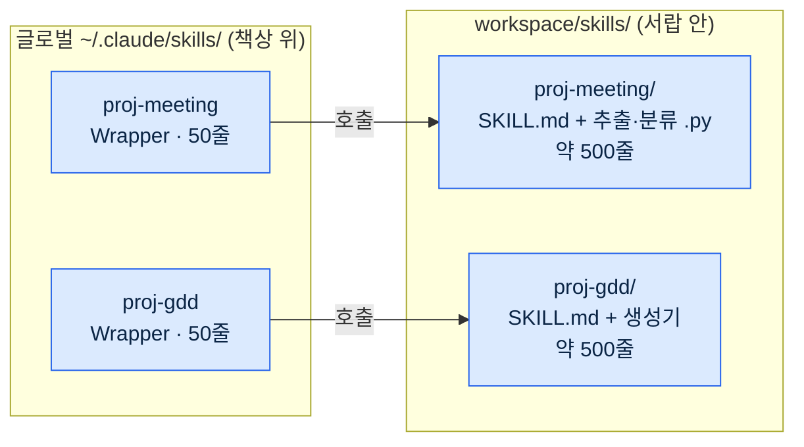
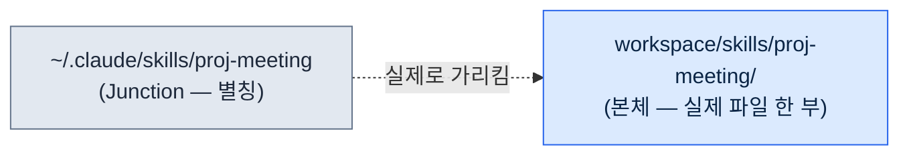
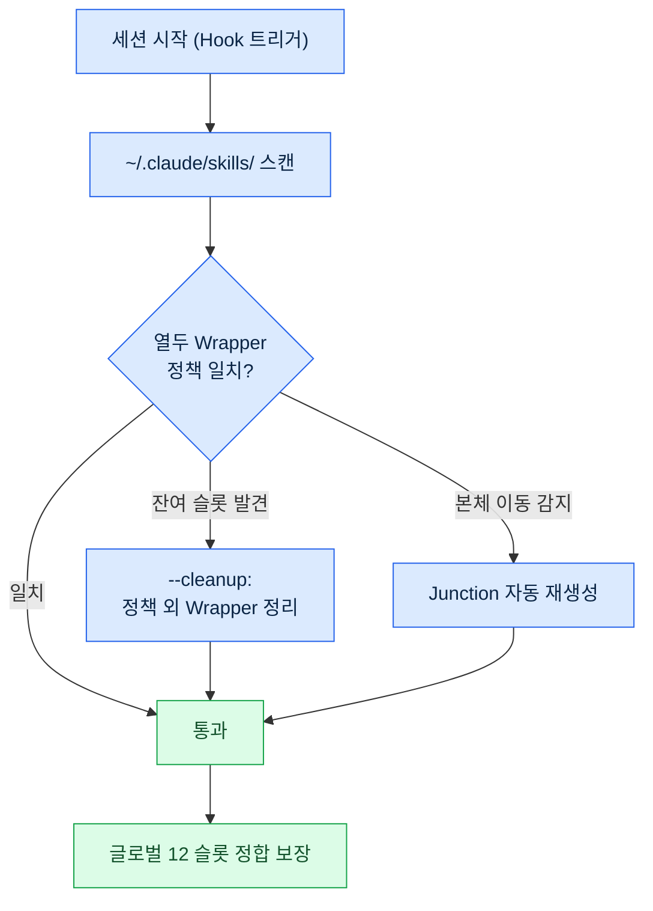
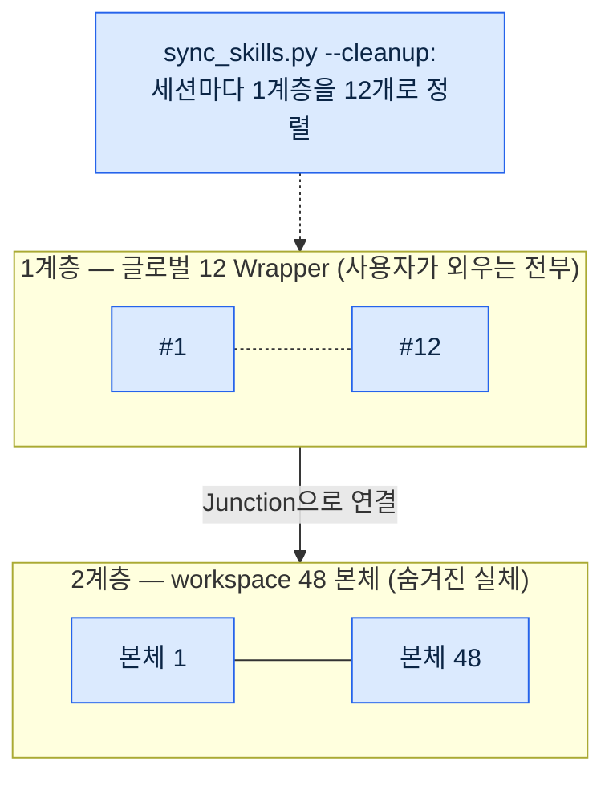
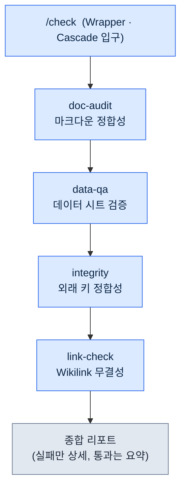
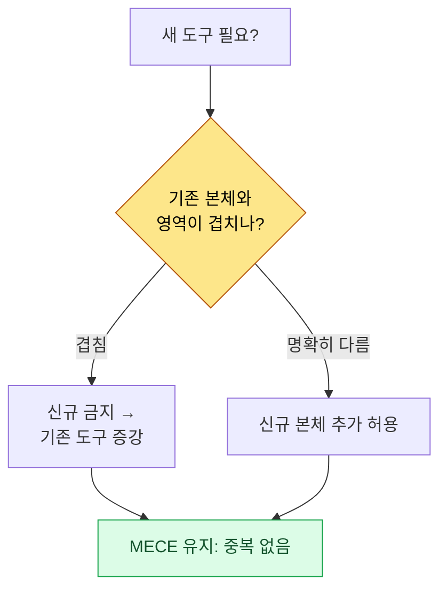

# Part 23 · 1장. Wrapper·Cascade·Junction 패턴

> 도구를 늘리지 말고, 도구의 도구를 만들라. 글로벌 12개 진입점 뒤에 본체 48개를 숨기는 2계층 구조와, 그 정합을 사람 손 없이 유지하는 자동화 이야기다.

---

월간 회고를 돌리던 어느 저녁, 슬래시 명령 목록을 세어 보다가 손이 멈췄다. 마흔 개였다. 분명 반년 전엔 일고여덟 개로 시작했는데, 회의록 도구 하나 만들고, 데이터 검증 도구 하나 붙이고, GDD(Game Design Document, 상세 사양서) 생성기 하나 추가하는 식으로 한 주에 한두 개씩 늘다 보니 어느새 마흔 개가 되어 있었다. 그리고 그중 절반 가까이는 지난 한 달 동안 단 한 번도 호출하지 않았다.

문제는 안 쓰는 도구가 그냥 조용히 거기 있는 게 아니라는 데 있었다. 세션을 시작할 때마다 마흔 개의 슬래시 명령 명세가 전부 로드됐다. 토큰 예산을 잠식했고, 이름이 비슷한 명령들(`skill-design`·`skill-design-new`·`skill-design-template`)이 헷갈렸으며, 정작 필요한 도구를 떠올리는 데 시간이 걸렸다. 도구가 일을 돕는 게 아니라 도구를 관리하는 게 일이 되어 가고 있었다.

이 챕터는 그 마흔 개를 글로벌 열두 개로 줄이면서도 나머지 본체를 단 하나도 버리지 않은 과정을 다룬다. 핵심은 세 패턴이다. 가벼운 진입점을 만드는 **Wrapper**, 여러 도구를 한 입구로 묶는 **Cascade**, 진입점과 본체를 물리적으로 연결하는 **Junction**. 그리고 이 셋의 정합을 사람 대신 지키는 `sync_skills.py`다.

---

## 23.1.1 회고에서 발견된 정량 신호

도구가 많다는 인상은 누구나 갖는다. 하지만 인상만으로는 무엇을 줄여야 할지 결정할 수 없다. 결정을 가능하게 한 건 월간 회고의 도구 경제성 측정이었다.

이 프로젝트는 회고를 자가개선 메커니즘으로 운영한다. 일간 회고가 쌓여 주간으로, 주간이 월간으로 합쳐지는 동안, 월간 회고는 "지난 한 달 어떤 도구를 몇 번 썼나"를 SVN 커밋 로그에서 역산한다. 이 측정에 쓰는 점수가 `skill_audit_score`다. 각 슬래시 명령이 실제 작업 산출물에 얼마나 등장했는지를 커밋 이력으로 추적해 사용 빈도를 매긴다.

그 달 측정에서 드러난 분포는 다음과 같았다. (사용량 비율은 SVN 커밋 로그 기반 실측이며, 절대 호출 횟수가 아니라 도구별 등장 비중이다.)

<svg viewBox="0 0 640 220" xmlns="http://www.w3.org/2000/svg" font-family="sans-serif" font-size="13">
  <rect x="0" y="0" width="640" height="220" fill="#fafafa" stroke="#ddd"/>
  <text x="20" y="30" font-weight="bold" font-size="15">슬래시 명령 40개 — 사용 빈도 분포</text>

  <!-- TOP 12 bar -->
  <rect x="20" y="55" width="500" height="40" fill="#2c7be5"/>
  <text x="30" y="80" fill="#fff" font-weight="bold">TOP 12 명령</text>
  <text x="530" y="80" fill="#2c7be5" font-weight="bold">사용량의 92%</text>

  <!-- middle group -->
  <rect x="20" y="105" width="55" height="40" fill="#a6c8f0"/>
  <text x="85" y="130" fill="#555">중간 사용 10개 — 약 8%</text>

  <!-- tail group -->
  <rect x="20" y="155" width="18" height="40" fill="#e0e0e0" stroke="#bbb"/>
  <text x="85" y="180" fill="#999">월 1회 미만 18개 (전체의 45%) — 거의 0%</text>

  <text x="20" y="212" fill="#888" font-size="11">출처: 월간 회고 skill_audit_score, SVN 커밋 로그 역산 / 비율은 등장 비중 실측</text>
</svg>

상위 열두 개가 전체 사용량의 92%를 차지했고, 월 1회도 안 쓰는 명령이 열여덟 개로 전체의 45%였다. 답은 절반쯤 정해진 셈이었다. 자주 쓰는 열두 개만 글로벌에 노출하고 나머지를 정리한다.

문제는 "정리"가 "삭제"는 아니라는 점이었다. 안 쓰는 스물여덟 개도 분기에 한두 번은 필요했다. 반기 보고서를 쓸 때나, 새 데이터 스키마를 만들 때나, 특정 검증을 돌릴 때. 그때 도구가 없으면 작업이 그 자리에서 멈춘다. 그러니까 진짜 질문은 이거였다. **어떻게 열두 개만 보이게 하면서, 스물여덟 개를 살려 둘 것인가.**

책상 비유가 이 챕터 전체를 관통한다. 책상 위에 펜 마흔 자루를 늘어놓고 매일 쓰는 사람은 없다. 자주 쓰는 열두 자루만 책상 위에 두고, 나머지는 서랍에 넣는다. 서랍 안에서도 같은 종류는 한 통에 모은다. Wrapper는 책상 위에 둘 가벼운 진입점, Junction은 서랍과 책상을 잇는 통로, Cascade는 한 통에 묶어 둔 펜 다발이다.

---

## 23.1.2 Wrapper 패턴 — 가벼운 진입점, 무거운 본체

Wrapper는 슬래시 명령의 얇은 껍데기다. 글로벌에는 진입점만 두고, 실제 로직은 workspace의 본체에 둔다. 글로벌 디렉터리에는 50줄짜리 안내문이, 본체에는 500줄짜리 구현이 산다.



이 분리가 만드는 이득은 다섯 가지다. 세션 시작 시 글로벌엔 50줄만 로드되니 토큰을 절약하고, 본체는 매일 수정해도 글로벌 슬롯에 영향이 없으며, 본체를 SVN이든 Git이든 어디든 둘 수 있고, 본체는 팀 공유 폴더에 두고 Wrapper만 개인 글로벌에 두어 공유가 쉽고, Wrapper 형식을 통일하면 사용자 경험이 일관된다.

Wrapper의 표준 형식은 다음과 같다. 모든 Wrapper가 이 골격을 공유한다.

```markdown
---
name: proj-meeting
description: 회의록 분석·결정 추출 (본체: workspace/skills/proj-meeting/)
---

# /proj-meeting — Wrapper

본체 위치: workspace/skills/proj-meeting/SKILL.md

## 동작
이 Wrapper는 본체의 진입 스크립트를 호출한다. 상세 로직은 본체에 정의됨.
본체가 변경되면 이 Wrapper의 description만 갱신하면 된다(자동 동기화 권장).
```

핵심은 description 한 줄과 본체 포인터뿐이라는 점이다. 로직이 들어가는 순간 Wrapper가 무거워지고, 본체와의 동기화가 깨지기 시작한다. 그래서 Wrapper는 100줄 이내 유지를 룰로 강제한다.

이 프로젝트의 글로벌 슬래시 명령 슬롯은 열두 개로 묶여 있다. 열두 개 안에 자주 쓰는 도구가 전부 들어가야 하고, 선택 기준은 월간 회고가 본다. 월 5회 이상 사용, 분야 균형(한 분야 도구가 여섯 개를 넘지 않을 것), 진입 일관성(이름 규칙 통일). 열두 개를 넘기면 가장 덜 쓰는 하나를 폐기하거나 다른 명령에 합병한다.

열두라는 숫자가 절대적인 건 아니다. 핵심은 숫자가 정해져 있다는 사실 자체다. 소규모(\~10인) 팀이라면 열 개가 적당할 수 있고, 분야가 많은 팀이라면 열다섯 개가 맞을 수도 있다. 정해진 상한이 있어야 인지 부담이 일정 수준에 머문다.

---

## 23.1.3 Junction 패턴 — 본체와 진입점의 물리적 연결

Wrapper가 "글로벌엔 가벼운 진입점만 둔다"는 규칙이라면, Junction은 그 규칙을 운영체제 수준에서 구현하는 수단이다. Junction은 디렉터리 심볼릭 링크, 즉 OS가 제공하는 별칭이다.



사용자가 글로벌 위치를 들여다보면 본체가 그 자리에 있는 것처럼 보인다. 하지만 실제 파일은 본체 위치에 단 한 부만 존재한다. 글로벌 쪽은 그저 그곳을 가리키는 표지판일 뿐이다.

이 구조가 주는 이득은 명확하다. 본체를 수정하면 글로벌에 즉시 반영된다(복사 단계가 없다). 파일이 한 부만 존재하니 디스크를 아끼고, 글로벌에는 Junction만 있으니 Git 충돌이 없다(본체는 SVN/Git에서 따로 관리). 본체를 옮겨도 Junction만 다시 걸면 사용자에게는 아무 변화가 없다.

OS마다 거는 방식이 다르다. Windows에서는 `mklink /J <link> <target>`로 디렉터리 정션을 만들며 관리자 권한이 필요 없다. Linux와 macOS는 `ln -s <target> <link>`, WSL은 Linux 명령을 그대로 쓴다. 이 플랫폼 차이는 뒤에서 다룰 `sync_skills.py`가 자동으로 처리하므로, 운영자는 OS별 명령을 직접 외울 필요가 없다.

Junction을 쓰지 않고 복사로 운영하면, 본체와 글로벌 사본이 갈라지는 순간 동기화 사고가 난다. 본체에서 버그를 고쳤는데 글로벌 사본은 옛 버전이라 옛 동작을 하는 식이다. Junction은 이 사고의 가능성 자체를 제거한다. 표지판은 두 개일 수 없고, 실체는 언제나 하나다.

---

## 23.1.4 sync_skills.py — 정합을 사람 대신 지키는 도구

Wrapper와 Junction을 손으로 관리하면 결국 마흔 개로 돌아간다. 사람은 정리를 미루고, 정책을 잊고, 예외를 만든다. 그래서 정합 유지를 자동화한다. 그 도구가 `sync_skills.py`다.

세션이 시작될 때마다 Hook이 이 스크립트를 트리거한다. 스크립트가 하는 일은 다음 흐름이다.



핵심 기능은 세 가지다. 첫째, 글로벌 디렉터리를 스캔해 열두 Wrapper 정책에 맞는지 검사한다. 둘째, `--cleanup` 플래그로 정책에 없는 잔여 Wrapper를 정리한다. 누군가 임시로 추가한 도구가 슬롯에 남아 있으면 다음 세션 시작 때 정리되어 슬롯이 다시 폭증하지 않는다. 셋째, 본체 위치가 바뀌었으면 Junction을 자동으로 다시 건다. OS를 감지해 Windows면 `mklink /J`, 그 외면 `ln -s`를 골라 호출한다.
세 기능 모두 **멱등(idempotent)** 하게 설계한다는 점이 중요하다. 세션이 시작될 때마다 자동으로 도는 도구이므로, 같은 상태에 몇 번을 다시 돌려도 결과가 한 번 돌린 것과 같아야 한다. 이미 정책에 맞는 Wrapper는 건드리지 않고, 이미 올바로 걸린 Junction은 다시 걸지 않으며, 정리할 잔여 슬롯이 없으면 아무것도 지우지 않는다. 멱등하지 않으면 세션마다 같은 정리가 덧쌓여 멀쩡한 Junction을 재생성하거나 본체를 잘못 건드리는 사고가 나는데, 매 세션 무인으로 도는 도구에서 이는 곧 동기화 사고로 직결된다. 그래서 `sync_skills.py`는 "바뀐 것만 손대고, 바뀐 게 없으면 손대지 않는다"를 불변식으로 둔다.

`--cleanup`의 효과는 토큰 예산 보호로 직결된다. 세션마다 글로벌에 로드되는 슬래시 명세를 열두 개로 묶어 두면, 본체가 마흔여덟 개로 늘어도 세션 시작 비용은 일정하게 유지된다. 사람이 손으로 관리하지 않으니 정책이 흐트러지지 않는다.

이 자동 정합이 2계층 구조의 안전핀이다. Wrapper와 Junction이 구조를 만들고, `sync_skills.py`가 그 구조를 시간이 지나도 유지한다.

---

## 23.1.5 2계층 구조 — 글로벌 12 wrapper → workspace 48 본체

세 패턴과 자동 정합이 합쳐지면 다음 2계층이 완성된다. 위층에는 사용자가 외우는 열두 개의 진입점이, 아래층에는 마흔여덟 개의 본체가 있다.



사용자는 글로벌 열두 개만 기억한다. 그 뒤에 본체 마흔여덟 개가 숨어 있어도 인지 부담은 열두 개에 머문다. Wrapper가 진입점을 가볍게 만들고, Junction이 진입점과 본체를 잇고, `sync_skills.py`가 그 열두 개 정합을 세션마다 지킨다.

비율로 보면 진입점 대 본체가 1대 4다(12 대 48). 도구를 늘려도 사용자가 외울 것은 늘지 않는다. 본체가 예순 개, 여든 개로 늘어도 1계층은 여전히 열두 개다. 이것이 "도구를 늘리지 말고 도구의 도구를 만들라"는 문장의 실제 구현이다. 늘어나는 건 2계층(본체)이고, 사용자가 마주하는 1계층(진입점)은 일정하다.

---

## 23.1.6 Cascade 패턴 — 한 입구로 묶는 연쇄 호출

2계층 구조가 "많은 도구를 적은 진입점으로 줄이는" 패턴이라면, Cascade는 "자주 함께 쓰는 도구들을 한 번의 호출로 묶는" 패턴이다. 한 슬래시 명령이 여러 하위 도구를 순차로 호출하고, 결과를 종합 리포트 하나로 낸다.

이 프로젝트의 대표 Cascade는 `check`다. 매일 아침 기획 데이터의 무결성을 검사하던 네 도구를 하나로 통합했다.



예전에는 매일 아침 네 도구를 따로따로 호출했다. 문서 검사 한 번, 데이터 검사 한 번, 외래 키 검사 한 번, 링크 검사 한 번. 작업 한 사이클당 서너 번의 수동 호출이 들었다. `check`는 이 넷을 한 명령으로 묶어, 한 번 호출하면 네 단계가 순서대로 실행되고 결과가 하나로 합쳐진다.

Cascade 설계에는 원칙이 있다. 각 단계는 단독으로도 호출 가능해야 한다(`data-qa`만 따로 부를 수 있어야 한다). 실패 시 중단할지 계속할지는 단계마다 설정한다. 검증 작업은 한 단계가 실패해도 나머지를 계속 돌려 전체 그림을 보고, 변경 작업은 한 단계가 실패하면 즉시 멈춘다. 결과는 누적되어 다음 단계 입력이 되고, 종합 리포트는 Cascade마다 같은 형식을 쓴다.

`check`의 실제 정의는 다음과 같다. (4종 검증을 하나로 통합한 구성이다.)

```yaml
cascade:
  - step: doc-audit
    purpose: 마크다운 정합성 (YAML frontmatter·링크·atom 참조)
    fail_action: continue
  - step: data-qa
    purpose: 엑셀 데이터 시트 검증 (스키마·범위·필수 컬럼)
    fail_action: continue
  - step: integrity
    purpose: 외래 키 정합성 (시트 간 참조)
    fail_action: continue
  - step: link-check
    purpose: Wikilink·외부 링크 무결성
    fail_action: continue

report:
  format: markdown
  include_pass: false   # 통과 항목은 요약만, 실패만 상세
  group_by: severity
```

`fail_action: continue`가 네 단계 모두에 걸려 있는 건 이것이 검증 Cascade이기 때문이다. 한 검사가 실패해도 나머지 셋을 마저 돌려 그날의 전체 결함 목록을 한 번에 본다. 리포트는 통과 항목을 요약으로만 접고 실패만 펼쳐, 아침에 봐야 할 것에 시선을 모은다.

Cascade에도 함정이 있다. 단계를 무한히 늘리면 복잡도가 폭발한다. 그래서 12 슬롯 정책처럼 Cascade도 단계 상한을 둔다. 대략 다섯에서 일곱 단계를 넘기면 둘로 쪼개거나 일부를 별도 Cascade로 분리한다.

---

## 23.1.7 도구 큐레이션 — MECE Wrapper 정책

2계층 구조와 Cascade가 자리 잡으면, 본체를 늘리는 일이 쉬워진다. 글로벌 슬롯을 건드리지 않고 workspace에 본체만 추가하면 되니까. 그런데 바로 여기서 새로운 함정이 생긴다. 추가가 쉬워지면 비슷한 도구가 중복으로 쌓인다.

그래서 본체를 늘릴 때 한 가지 정책을 강제한다. **MECE Wrapper 정책**이다. 새 도구를 추가하려 할 때 두 갈래로 판단한다. 기존 도구와 영역이 겹치면 신규를 만들지 말고 기존 도구를 증강한다. 영역이 명확히 다를 때만 신규로 만든다. 중복 없이(Mutually Exclusive), 빠짐없이(Collectively Exhaustive) 본체 목록을 유지한다는 뜻이다.



이 판단을 회고가 뒷받침한다. `skill_audit_score`가 SVN 로그에서 도구별 사용 빈도를 측정하므로, "이 도구는 사실 저 도구와 거의 같은 일을 하는데 둘 다 거의 안 쓰인다" 같은 신호가 잡힌다. 그러면 둘을 하나로 합치거나 덜 쓰는 쪽을 본체에서 내린다. 큐레이션은 추가만큼이나 정리가 중요하다.

MECE 정책이 없으면, 2계층 구조가 만든 "본체 추가의 자유"가 오히려 독이 된다. 본체가 1계층 슬롯을 잠식하지 않더라도, 본체 자체가 중복으로 비대해지면 어떤 본체를 써야 할지 다시 헷갈리기 시작한다. 정책이 그 비대화를 막는다.

---

## 23.1.8 회고가 이 모든 것을 발화시킨 이유

이쯤에서 처음으로 돌아가 보자. Wrapper도, Junction도, Cascade도, MECE 정책도, 어느 하나 책상머리에서 미리 설계한 게 아니다. 전부 회고에서 발견된 문제에 대한 답으로 생겨났다.

월간 회고의 `skill_audit_score`가 슬롯 마흔 개와 사용량 92%의 쏠림을 정량으로 드러냈을 때 "열두 개로 제한하자"가 결정됐다. 그 결정 뒤에 "그러면서 스물여덟 개를 어떻게 살릴까"라는 질문이 따라왔고, 그 답이 Wrapper와 Junction이었다. 다음 회고에서 "비슷한 검증 도구 넷을 매일 아침 따로 부르는 게 번거롭다"는 발견이 나왔고, 그 답이 `check` Cascade였다. 또 다른 회고에서 "본체 추가가 쉬워지니 중복이 쌓인다"는 신호가 잡혔고, 그 답이 MECE 정책이었다.

회고가 없었다면 이 패턴들은 만들어지지 않았다. 만들었더라도 실제 문제와 무관한 오버 엔지니어링이 됐을 것이다. 문제를 측정으로 발견한 뒤 패턴을 도입하는 순서, 그 순서가 도구가 실제로 쓰이게 만든다. 회고가 자가개선의 시작점이라는 21부의 메시지가, 도구 차원에서 이렇게 구체화된다.

---

## 23.1.9 운영 사례 — 6개월 누적

여섯 달의 측정값을 도입 전후로 비교한다. 절대 호출 횟수가 아니라 운영 부담의 변화에 주목한다.

| 항목 | 도입 전 | 도입 후 (Wrapper+Cascade+Junction) |
|---|---|---|
| 글로벌 슬롯 개수 | 40개 (폭증) | 12개 (정책 강제) |
| 본체 개수 | 흩어짐·중복 다수 | 48개 (MECE 정리) |
| 세션 시작 글로벌 슬롯 비중 | 큼(40개 명세 로드) | 작음(12개 명세만 로드) |
| 본체 수정 후 글로벌 반영 | 수동 복사 단계 필요 | 즉시(Junction, 복사 없음) |
| 비슷한 검증 도구 호출 | 작업당 3\~4회 수동 | 1회(check Cascade) |

도입 첫 달의 측정값은 들쭉날쭉했다. Wrapper 형식이 자리 잡기 전까지 동기화 사고가 두어 번 났고, 열두 개 정책이 강제되기 전까지 슬롯이 열다섯에서 열여덟을 오갔다. 안정화는 두 달째부터였다. `sync_skills.py --cleanup`이 세션마다 슬롯을 정렬하기 시작한 뒤로 슬롯 폭증은 다시 일어나지 않았다.

표의 "비중"·"필요"·"즉시" 같은 방향 표현은 의도적이다. 환경마다 토큰 비용과 시간이 다르므로 변화의 방향만 적었다. 분명한 건 1계층이 마흔에서 열둘로 고정됐고, 본체 반영에서 수동 복사 단계가 사라졌다는 사실이다.

---

## 23.1.10 흔한 실수와 회피법

앞 절들에서 짚은 함정을 한자리에 모은다. 다섯 가지 모두, 구조를 만드는 것보다 시간이 지나도 유지하는 게 더 어렵다는 같은 교훈을 가리킨다.

- **Wrapper에 로직이 스며든다.** 가벼운 진입점이 본체 일부를 흡수하는 순간 동기화가 깨진다 → 100줄 이내 유지를 룰로 강제(§23.1.2).
- **Junction 대신 복사로 운영한다.** 본체와 사본이 갈라지면 옛 버전이 옛 동작을 한다 → Junction은 선택이 아닌 필수(§23.1.3).
- **Cascade 단계를 무한히 붙인다.** 다섯\~일곱을 넘기면 복잡도가 폭발한다 → 단계 상한을 둔다(§23.1.6).
- **12 슬롯을 손으로 관리한다.** 강제장치가 없으면 반드시 다시 폭증한다 → `sync_skills.py --cleanup`이 세션마다 정렬(§23.1.4).
- **회고 없이 패턴부터 도입한다.** 측정 전에 구조를 만들면 안 쓰이는 골격이 남는다 → 측정 → 발견 → 패턴 순서(§23.1.8).

---

## 따라하기 (setup → prompt → verify)

**setup.** workspace에 본체 디렉터리를 하나 만드세요(예: `workspace/skills/proj-meeting/`). 그 안에 `SKILL.md`와 실제 스크립트를 둡니다. 글로벌 `~/.claude/skills/`에는 50줄짜리 Wrapper만 둡니다.

**prompt.** 다음을 Claude에 요청합니다.

```
~/.claude/skills/ 의 슬래시 명령 목록을 스캔해줘.
각 명령이 (a) 본체 포인터만 있는 가벼운 Wrapper인지
(b) 로직이 들어간 무거운 명령인지 분류하고,
(b)에 해당하는 것은 본체를 workspace로 분리하고
글로벌엔 50줄 Wrapper만 남기는 변경안을 제시해줘.
그리고 본체를 가리키는 Junction을 OS에 맞게 거는 명령
(Windows면 mklink /J, 그 외면 ln -s)을 출력해줘.
```

**verify.** 세 가지를 확인하세요. 첫째, 글로벌 디렉터리의 각 항목이 100줄 이내인가. 둘째, 글로벌 항목을 열면 본체 위치 한 줄과 description만 보이는가. 셋째, 본체를 한 줄 수정하고 글로벌에서 호출했을 때 수정이 즉시 반영되는가(Junction이 제대로 걸렸으면 복사 없이 반영됩니다).

## 1인 축소판

팀도 SVN도 없는 1인 운영이라면 이렇게 줄이세요. workspace를 둘 필요 없이 개인 Git 저장소 하나면 됩니다. 본체는 그 저장소에 두고, 글로벌엔 Wrapper만 둡니다. `skill_audit_score` 같은 측정 도구가 없어도, 월말에 "이번 달 실제로 호출한 명령"을 직접 손으로 적어 보는 것만으로 쏠림이 드러납니다. 상위 다섯에서 일곱 개만 글로벌에 남기고 나머지는 본체로 내리세요. Cascade는 자주 함께 부르는 도구가 둘 이상 생겼을 때 한 명령으로 묶으면 충분합니다. 자동 정합 스크립트가 부담스러우면, 새 세션을 시작할 때 글로벌 디렉터리를 한 번 눈으로 훑는 습관으로 대체할 수 있습니다. 규모가 줄면 자동화 대신 습관이 같은 일을 합니다.

---

### 이 챕터의 핵심 메시지
- 도구를 늘리지 말고 도구의 도구를 만들라 — 글로벌 12 진입점, 본체 48 실체.
- Wrapper·Junction·sync_skills가 2계층 정합을 사람 손 없이 지킨다.
- 모든 패턴은 회고의 정량 측정에서 발화한다 — 측정 먼저, 구조는 그 다음.

### 다음 챕터 미리보기
- Part 23 · 2장. Hermes Agent 도입기
