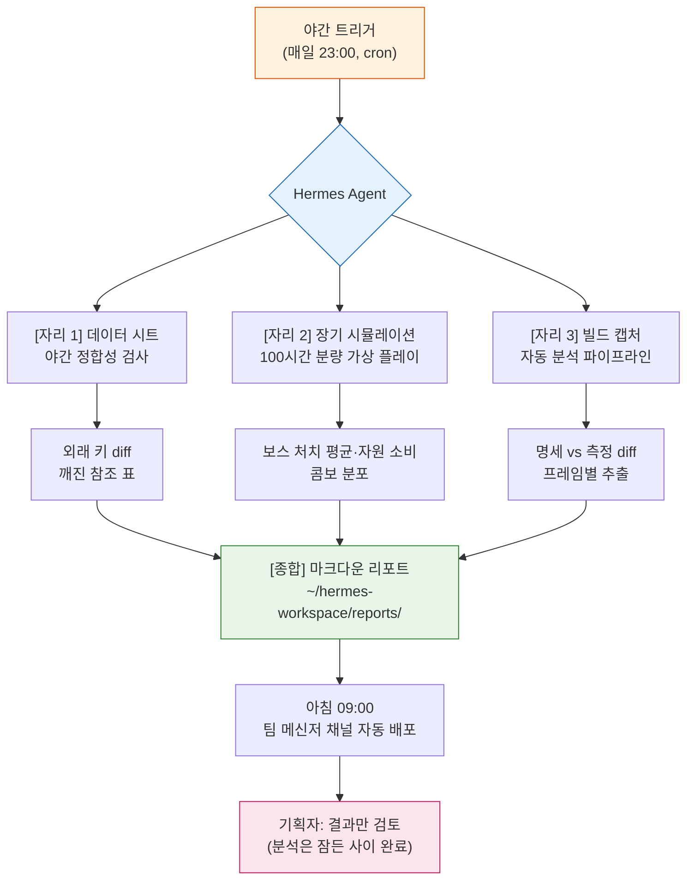

# Part 23 · 2장. Hermes Agent 도입기

밤 11시 47분. 데이터 시트를 마지막으로 저장하고 노트북을 덮었다. 다음 날 아침 9시 10분, 커피를 내리는 동안 사내 메신저를 열었더니 채널 상단에 리포트 한 장이 올라와 있었다. 간밤에 갱신된 밸런스 시트 세 장을 외래 키 기준으로 교차 검증하고, 깨진 참조 두 건을 빨간색으로 표시한 마크다운. 내가 작성하지 않았다. 잠든 사이에 만들어졌다.

이 챕터는 그 리포트를 만든 도구 — Hermes Agent를 개인 PC에 올리고, §23.1에서 다룬 Wrapper·Cascade·Junction 운영 위에 얹은 과정의 기록이다. 처음 도입할 때만 해도 Hermes는 Linux 기반이라 Windows에서 쓰려면 WSL2를 거쳐야 했는데, 2026년에 네이티브 Windows 빌드가 나오면서 그 우회가 사라졌다. 결론을 먼저 말하면, 에이전트는 Claude Code를 밀어내지 않았다. 옆자리에 앉았다.

---

## 23.2.1 같은 책상에 앉은 두 도구

§23.1까지의 운영은 전부 Claude Code 중심이었다. 내가 한 문장 입력하면 도구가 한 번 응답하고, 나는 그 응답을 검토한 뒤 다음 문장을 입력했다. 이 짧은 사이클이 정밀 작업에는 더없이 좋다. 밸런스 수치 하나를 고칠 때 매 단계 확인이 필요한 작업이라면, 사람이 매번 끼어드는 게 맞다.

문제는 길이가 긴 작업이었다. "지난 한 달치 회의록 30건을 다 읽고 결정 사항만 atom 후보로 추출해 달라"는 요청은, 대화 흐름 안에서 처리하면 30번의 왕복이 필요하다. 그 30번 동안 나는 다른 일을 못 한다. 이런 작업은 입력과 출력이 짧게 붙는 도구의 강점이 오히려 약점이 된다.

에이전트는 그 반대 자리를 채운다. 목표만 던지면 — "회의록 30건에서 결정 사항을 atom 후보로 뽑아 리포트로" — 도구를 스스로 골라 쓰고, 중간 단계를 알아서 밟고, 끝나면 결과만 가져온다. 사이클이 길고 자율적이다. 대신 매 단계 사람이 못 본다는 약점이 따라온다.

<svg viewBox="0 0 640 280" xmlns="http://www.w3.org/2000/svg" font-family="sans-serif" font-size="13">
  <rect x="0" y="0" width="640" height="280" fill="#fafafa" stroke="#ddd"/>
  <text x="320" y="28" text-anchor="middle" font-size="15" font-weight="bold">두 도구의 작업 사이클 비교</text>

  <!-- Claude Code lane -->
  <text x="20" y="70" font-weight="bold" fill="#1565c0">Claude Code</text>
  <text x="20" y="88" font-size="11" fill="#666">정밀 · 단발 · 매 단계 검증</text>
  <g fill="#bbdefb" stroke="#1565c0">
    <rect x="160" y="58" width="60" height="26"/>
    <rect x="260" y="58" width="60" height="26"/>
    <rect x="360" y="58" width="60" height="26"/>
    <rect x="460" y="58" width="60" height="26"/>
  </g>
  <g fill="#1565c0" font-size="10" text-anchor="middle">
    <text x="190" y="75">입력→출력</text>
    <text x="290" y="75">입력→출력</text>
    <text x="390" y="75">입력→출력</text>
    <text x="490" y="75">입력→출력</text>
  </g>
  <g stroke="#90caf9" stroke-width="2">
    <line x1="220" y1="71" x2="260" y2="71"/>
    <line x1="320" y1="71" x2="360" y2="71"/>
    <line x1="420" y1="71" x2="460" y2="71"/>
  </g>
  <text x="160" y="112" font-size="10" fill="#1565c0">↑ 매 화살표마다 사람이 검토</text>

  <!-- divider -->
  <line x1="20" y1="140" x2="620" y2="140" stroke="#ddd" stroke-dasharray="4"/>

  <!-- Agent lane -->
  <text x="20" y="180" font-weight="bold" fill="#c62828">Hermes Agent</text>
  <text x="20" y="206" font-size="11" fill="#666">장시간 · 자율 · 체크포인트만</text>
  <rect x="160" y="168" width="360" height="26" fill="#ffcdd2" stroke="#c62828"/>
  <text x="340" y="185" text-anchor="middle" font-size="10" fill="#c62828">목표 1개 입력 → (자율 실행: 도구 선택·반복·검증) → 결과 1개 출력</text>
  <g fill="#c62828">
    <circle cx="250" cy="168" r="4"/>
    <circle cx="340" cy="168" r="4"/>
    <circle cx="430" cy="168" r="4"/>
  </g>
  <text x="160" y="222" font-size="10" fill="#c62828">● 체크포인트(사람 검토 가능 지점) — 매 단계는 아님</text>

  <text x="320" y="262" text-anchor="middle" font-size="12" fill="#555">정밀 결정은 위 레인, 반복·장시간은 아래 레인. 같은 책상.</text>
</svg>

옆자리 동료에 빗대 보면 이해가 쉽다. Claude Code는 내 문장마다 같이 들여다보는 짝꿍이고, 에이전트는 야간 근무를 자청해 내가 출근하기 전 책상 위에 보고서를 올려 두는 보조 인력이다. 한쪽이 다른 쪽을 해고하는 관계가 아니다. 둘이 같은 책상을 나눠 쓴다.

---

## 23.2.2 왜 굳이 또 하나의 도구를

§23.1에서 글로벌 슬래시 명령 슬롯을 12개로 묶고, 그 뒤에 본체 48개를 Junction으로 숨기는 운영을 만들었다. 도구를 늘리지 않고 도구의 도구를 만든 게 그 결론이었다. 그런데 여기서 또 새 도구를 들이겠다는 건 그 결론과 모순처럼 들린다.

모순이 아니다. §23.1의 12 슬롯 정책은 "사람이 직접 호출하는 도구"의 인지 부담을 다룬 것이다. Hermes가 채우려는 자리는 사람이 호출하지 않는 시간 — 잠든 시간, 회의 중인 시간, 다른 일에 손이 묶인 시간이다. 12 슬롯과 경쟁하는 게 아니라 12 슬롯이 닿지 못하는 시간대를 채운다.

도입 결정의 근거는 한 회고 측정값이었다. 글로벌 도구의 사용 빈도를 SVN 커밋 로그에서 역산하는 `skill_audit_score`로 한 달치를 돌려 보니, 상위 도구 대부분이 "사람이 깨어 있는 시간에, 짧게, 자주" 쓰는 종류였다. 반면 사용 빈도는 낮지만 한 번 돌면 오래 걸리는 작업 — 회의록 일괄 분류, 데이터 시트 야간 정합성, 빌드 캡처 분석 — 은 매번 "내일 아침에 하지" 하고 미뤄지고 있었다. 미뤄지는 이유가 명확했다. 깨어 있는 시간을 길게 잡아먹기 때문이다.

이 미뤄지는 작업군이 에이전트의 정확한 표적이다.

---

## 23.2.3 설치 — 네이티브 Windows 빌드

처음 Hermes를 올릴 때는 Linux 기반이라, Windows 개인 PC에서 쓰려면 WSL2(Windows Subsystem for Linux 2)를 먼저 깔고 그 안에 Hermes를 앉혀야 했다. 지금은 네이티브 Windows 빌드가 있어 그 우회가 필요 없다. 설치는 일반 Windows 애플리케이션과 같다 — 인스톨러를 받아 실행하고, 첫 실행에서 작업 공간 경로와 권한 화이트리스트의 초기값을 잡으면 된다.

이미 WSL2를 쓰고 있거나 Linux 환경을 선호한다면 그쪽 빌드도 그대로 지원된다. 다만 새로 시작한다면 네이티브 쪽이 단순하다. 정확한 인스톨러·버전은 도구가 빠르게 바뀌므로 공식 문서를 따른다.

설치 위치와 무관하게 남는 함정이 하나 있다. Hermes 작업 공간은 **빠른 로컬 디스크**에 둬야 한다. 네트워크 드라이브나 SVN 작업 폴더를 작업 공간으로 직접 물리면, 야간 정합성 검사 한 번이 몇 분짜리가 될 작업을 수십 분으로 늘려 놓는다. 데이터 시트는 작업 공간 밖에 두고 작업 시작 시점에만 복사해 들이는 게 정석이다. WSL2를 쓴다면 같은 이유로 작업 공간을 리눅스 파일시스템 안에 두고 `/mnt/c` 같은 윈도우 경로를 건너다니지 않는다.

---

## 23.2.4 Hermes 설치와 첫 연결 — 워크드 트랜스크립트

여기서부터는 실제로 손이 가는 부분이다. 설치 자체보다 "설치 후 무엇을 시키느냐"가 챕터의 핵심이라, 첫 작업 하나를 끝까지 — 프롬프트 전문, 날것 출력, 사람 검증, 재요청까지 — 따라가 본다. 이 작업은 §23.2.2에서 미뤄지던 작업군 중 가장 단순한 것, 야간 데이터 시트 정합성 검사를 골랐다.

> 주의: 아래 명령 일부는 Hermes의 표면 형태를 보이기 위한 예시 형태다. 인스톨러 URL·하위 명령은 버전마다 바뀌므로 공식 문서를 확인할 것. 워크플로의 구조(목표 → 자율 실행 → 검증 → 재요청)는 도구가 바뀌어도 유지된다.

네이티브 Windows라면 PowerShell에서 공식 `install.ps1`을 받아 돌린다. 다만 한 줄짜리 `iex (irm ...)` 원라이너를 그대로 실행하기 전에, 스크립트(약 2,800줄)를 한 번 받아 위험 패턴을 눈으로 훑고 — 그게 출처를 신뢰하는 최소한의 절차다 — 키 설정은 분리해 `-SkipSetup`으로 본체만 먼저 깐 뒤 `hermes setup`을 따로 돌리는 쪽이 안전하다. WSL2·Linux를 쓴다면 공식 문서의 해당 설치 절을 따른다.

```powershell
# 네이티브 Windows — 공식 install.ps1 (먼저 내려받아 검토 후 실행)
irm https://hermes-agent.nousresearch.com/install.ps1 -OutFile install.ps1
# (install.ps1 내용을 확인한 뒤)
.\install.ps1 -SkipSetup
# Python 3.11 · Node · Git · Playwright · 번들 스킬을 함께 확보
# 설치 위치: %LOCALAPPDATA%\hermes\  (hermes 명령을 PATH에 등록 — 새 터미널부터 인식)
# 끝나면: hermes setup
```

인스톨러는 의존성(Python 3.11·Node 22·Git)을 함께 깔고 본체를 `%LOCALAPPDATA%\hermes\`에 설치한 뒤 `hermes` 명령을 PATH에 등록한다(새 터미널부터 인식). 설정·로그·예약(cron)·체크포인트 같은 운영 데이터도 같은 `%LOCALAPPDATA%\hermes\` 아래에 남아 재설치해도 보존된다(여기가 함정이다 — `~/.hermes\`에는 보조 스크립트만 들어가 있어 헷갈리기 쉽다. 실제 `config.yaml`·`logs\`는 전부 `%LOCALAPPDATA%\hermes\` 쪽이다). 첫 실행으로 `hermes setup`을 돌리면 모델 API 키를 묻고, 작업 공간 경로와 권한 화이트리스트의 초기값을 잡는다.

```powershell
hermes --version
hermes setup
```

이제 첫 작업을 맡긴다. 에이전트에게 던지는 목표는 Claude Code 프롬프트보다 한 단계 추상적이다. "이걸 이렇게 해 줘"가 아니라 "이 결과를 만들어 둬"에 가깝다. 내가 실제로 넣은 목표 전문은 다음과 같았다.

**[프롬프트 전문]**

```
목표: 야간 데이터 시트 정합성 검사.

~/hermes-workspace/sheets/ 의 item_master·drop_table·npc_shop 세 xlsx를 읽고,
drop_table·npc_shop이 참조하는 item_id가 item_master에 실제 있는지 외래 키를
검사해 줘. 깨진 참조(없는 item_id를 가리키는 행)를 다 찾아서, reports/ 에
날짜 파일명 마크다운으로 저장하고. (의도: 통과는 건수만, 실패는 시트명·행번호·item_id 표로)

제약:
- sheets/ 는 읽기만, 절대 수정하지 마.
- 시트를 못 읽거나 컬럼명이 예상과 다르면 멈추고 뭐가 달랐는지 보고해. 추측 금지.
```

마지막 두 줄이 중요하다. 에이전트는 자율적이라, 막히면 "알아서" 메우려 드는 경향이 있다. 컬럼명이 다르면 비슷한 이름을 골라 진행해 버리는 식이다. 그래서 "막히면 멈추고 보고하라, 추측하지 말라"를 명시적으로 입력해 둔다. 이건 §23.1에서 데이터 시트 검증 Cascade를 짤 때 배운 교훈과 같은 결이다.

**[Hermes 날것 출력 — 1차]**

요약하지 않고 그대로 옮긴다. 첫 시도는 매끈하게 끝나지 않았다.

```
[hermes] goal accepted: 야간 데이터 시트 정합성 검사
[hermes] step 1/4  reading sheets...
         item_master.xlsx   loaded (4,210 rows)
         drop_table.xlsx    loaded (1,880 rows)
         npc_shop.xlsx      ERROR

[hermes] npc_shop.xlsx: expected column 'item_id', found columns:
         ['shop_id', 'sell_item', 'price', 'stock']
[hermes] this conflicts with the constraint: "컬럼명이 예상과 다르면 멈추고 보고".
[hermes] HALTING. reporting instead of guessing.

[hermes] partial result:
  - item_master ↔ drop_table 검사는 가능 (item_id 컬럼 양쪽 존재)
  - npc_shop는 item_id 컬럼명이 'sell_item'으로 추정되나, 확정 불가하여 미실행
[hermes] awaiting clarification on npc_shop column mapping.
```

여기가 에이전트를 처음 써 본 사람이 가장 놀라는 지점이다. 도구가 멈췄다. 그리고 멈춘 이유를 정확히 말했다. `npc_shop.xlsx`의 아이템 참조 컬럼은 내 예상인 `item_id`가 아니라 `sell_item`이었다. 제약을 입력해 두지 않았다면 에이전트는 `sell_item`을 알아서 `item_id`로 간주하고 진행했을 테고, 나는 아침에 "정상"이라는 리포트만 받았을 것이다. 멈춤이 곧 안전이다.

**[사람 검증·거부]**

나는 출력을 보고 두 가지를 판단했다.

첫째, item_master ↔ drop_table 검사를 이미 할 수 있다고 보고한 부분은 신뢰할 만하다. 둘째, npc_shop의 `sell_item` 추정은 맞다 — 실제로 그 시트의 판매 아이템 컬럼명이다. 다만 "추정"으로 진행하지 않은 판단은 옳았다. 그래서 1차 출력을 그대로 받아들이지 않고(거부), 컬럼 매핑을 명시한 재요청을 넣었다.

**[재요청 프롬프트]**

```
확인했다. 컬럼 매핑을 명시한다:
- npc_shop.xlsx 의 아이템 참조 컬럼은 'sell_item' 이다. 이것을 item_id 로 간주해 검사하라.
- 나머지 제약은 동일. 'sell_item' 외의 컬럼을 추가로 추측하지는 말 것.
다시 실행하라.
```

**[Hermes 날것 출력 — 2차]**

```
[hermes] resuming with column map: npc_shop.sell_item -> item_id
[hermes] step 2/4  foreign-key check...
         drop_table → item_master   : 1,880 refs, 2 broken
         npc_shop   → item_master   : 642 refs, 0 broken
[hermes] step 3/4  collecting broken refs...
[hermes] step 4/4  writing report...
         ~/hermes-workspace/reports/2026-05-25_sheet_integrity.md  written
[hermes] done. 2 broken references found. summary:
  | sheet      | row  | bad item_id |
  |------------|------|-------------|
  | drop_table | 417  | ITM_90412   |
  | drop_table | 1356 | ITM_90727   |
```

두 건의 깨진 참조가 잡혔다. `drop_table`의 417행과 1356행이 `item_master`에 없는 `item_id`를 가리키고 있었다. 아침에 본 빨간색 표가 바로 이것이었다.

이 한 번의 왕복에서 챕터의 메시지가 거의 다 드러난다. 에이전트는 자율적이되 제약 앞에서 멈췄고, 멈춘 자리를 사람이 메우자 끝까지 갔다. 자율과 통제가 충돌하는 게 아니라 맞물린다. 그리고 이 전체 사이클이, 내가 잠든 시간에 한 번 더 돌도록 예약해 두면, 그게 바로 §23.2.5의 야간 자동화가 된다.

---

## 23.2.5 게임 기획 워크플로에 얹은 세 자리

첫 작업이 손에 익으면, 미뤄지던 작업군을 하나씩 야간으로 넘긴다. 내가 실제로 얹은 건 세 자리다. 셋의 공통점은 분명하다 — 전부 사람이 깨어 있을 필요가 없는 시간을 일하는 시간으로 바꾼다.



**자리 1 — 데이터 시트 야간 정합성.** 2.4에서 끝까지 따라간 그 작업을 매일 밤 23시로 예약한다. 간밤에 누가 어떤 시트를 건드렸든, 아침이면 외래 키가 깨진 곳이 표로 떠 있다. 이건 §23.1의 `/check` Cascade(doc-audit → data-qa → integrity → link-check 4종 통합)가 하던 일과 표면상 닮았지만, 결정적 차이가 하나 있다. `/check`는 내가 깨어서 호출해야 돈다. 야간 에이전트는 내가 없어도 돈다. 둘은 경쟁하지 않는다 — 낮의 Cascade는 즉시 검증, 밤의 에이전트는 무인 검증으로 역할이 갈린다.

**자리 2 — 장기 시뮬레이션.** §4.4에서 다룬 전투 시뮬레이션을 시간 축으로 깊게 늘린다. 100시간 분량의 가상 플레이를 돌려 보스 처치 평균 시간, 자원 소비 곡선, 콤보 분포를 측정하는 작업이다. 이건 본질적으로 Claude Code 대화 흐름에 안 맞는다 — 한 번 돌면 몇 시간이 걸리는데, 그 시간 동안 대화창을 붙잡고 있을 수는 없다. 에이전트가 백그라운드에서 돌리고, 끝나면 곡선 그래프와 요약 수치만 가져온다.

**자리 3 — 빌드 캡처 자동 분석.** QA가 캡처한 빌드 영상이 폴더에 떨어지면, 에이전트가 프레임별로 데이터를 추출해 명세 수치와 실측 수치의 diff를 만든다. 기획자는 영상을 처음부터 끝까지 돌려 볼 필요 없이, "명세는 데미지 120인데 빌드는 108로 측정됨" 같은 diff 줄만 본다. 분석의 지루한 부분 전체가 에이전트 몫이다.

세 자리 모두, 결과를 보는 사람의 시간은 줄지 않는다. 줄어드는 건 분석에 들어가는 사람의 시간이다. 판단은 여전히 사람이 한다.

---

## 23.2.6 자율의 대가 — 다섯 안전 장치

에이전트의 자율성은 그대로 위험이기도 하다. 사람의 매 단계 확인 없이 파일을 읽고 명령을 돌리는 도구라면, 잘못 풀렸을 때 사람이 그 자리에 없다. §23.2.4에서 "추측 금지"를 명시해 둔 게 우연이 아니다. 다섯 가지 안전 장치는 선택이 아니라 도입 첫날 함께 켜야 하는 묶음이다.

| 장치 | 하는 일 (실제 Hermes 설정 키) | 빠지면 생기는 일 |
|---|---|---|
| 권한 화이트리스트 | 파괴적 명령은 사람 승인을 거치게(`approvals.mode: manual`), 허용 명령만 화이트리스트(`command_allowlist`), 비밀값은 로그에서 가림(`security.redact_secrets`) | 원본 데이터 시트를 자율 수정해 버림 |
| 체크포인트 | 파일 작업 전 스냅샷을 떠 되돌릴 수 있게(`checkpoints.enabled`, 복원은 `/rollback`) | 잘못된 가정이 끝까지 굴러가 결과 전체가 오염 |
| 로그 자동 기록 | 게이트웨이·에이전트·에러 로그를 `%LOCALAPPDATA%\hermes\logs\`에 남김 | 사고 후 "왜 이렇게 됐는지" 추적 불가 |
| 비용 한도 | 한 작업의 턴 상한(`agent.max_turns`)·터미널 타임아웃(`terminal.timeout`)·무한 루프 자동 감지(`tool_loop_guardrails`)·컨텍스트 자동 압축(`compression`) | 무한 루프에 빠진 작업이 API 청구서를 키움 |
| 폐기 가능 | 언제든 중단(`/stop`)·예약 일시정지/삭제(cron pause)·서브 작업 타임아웃(`delegation.child_timeout_seconds`)·안 쓰는 스킬 자동 아카이브(`curator`) | 잘못 돌기 시작한 야간 작업을 못 멈춤 |

이 다섯은 따로 노는 장치가 아니라 한 묶음으로 작동한다. 권한만 잠그고 비용 한도를 안 걸면, 권한 안에서 무한 루프가 돌며 청구서가 커진다. 로그만 켜고 폐기 수단이 없으면, 사고가 난 걸 보면서도 못 멈춘다. 어느 하나만 빠져도 야간 무인 운영의 사고 확률이 확 올라간다.

실제로 도구를 켜 보면, 이 다섯 개념을 도구가 책에서 그린 것보다 한 단계 더 촘촘하게 구현해 놓은 자리가 몇 군데 있었다. 권한 쪽엔 별도의 정책 엔진(`security.tirith_enabled`)이 한 겹 더 있어 명령을 규칙으로 거른다. 비용 쪽 무한 루프 감지는 단일 상한이 아니라 "같은 실패 반복"·"진전 없는 반복" 같은 신호를 따로 임계로 잡는다. 그리고 야간 무인 예약(cron)에는 별도 스위치(`approvals.cron_mode: deny`)가 있어, 사람이 없는 시간대에 파괴적 명령이 잡히면 승인을 기다리지 않고 곧장 거부한다 — 책의 "권한 + 체크포인트"를 한 설정으로 묶은 셈이다. 폐기 쪽 `curator`는 §21의 "안 쓰는 도구는 폐기한다"가 실제 기능으로 실려 있는 자리다. 다섯 묶음의 골격은 그대로 유지하되, 도구가 더 정교한 자리는 그 키를 켜 두면 된다.

`config.yaml`에 이 묶음을 입력해 두는 모습은 대략 다음과 같다.

```yaml
# %LOCALAPPDATA%\hermes\config.yaml (발췌)
approvals:
  mode: manual              # ① 권한 — 파괴적 명령은 사람 승인을 거침
  command_allowlist:        #    승인 없이 허용할 명령만 명시
    - "python *"
    - "rg *"
  cron_mode: deny           #    야간 무인 cron이 파괴적 명령 만나면 자동 거부
security:
  redact_secrets: true      #    로그에서 비밀값 가림
  tirith_enabled: true      #    정책 엔진(규칙 기반 명령 필터) 한 겹 더
checkpoints:
  enabled: true             # ② 체크포인트 — 파일 작업 전 스냅샷(/rollback 복원)
  max_snapshots: 20
  retention: 7d
logs:
  path: "%LOCALAPPDATA%\\hermes\\logs"   # ③ 로그 — gateway/agent/errors
agent:
  max_turns: 60             # ④ 비용 — 한 작업 턴 상한
terminal:
  timeout: 180              #    터미널 명령 타임아웃(초)
tool_loop_guardrails:       #    무한 루프 자동 감지(같은 실패·진전 없음)
  enabled: true
compression:
  enabled: true             #    컨텍스트 자동 압축(토큰 절감)
delegation:
  child_timeout_seconds: 600  # ⑤ 폐기 — 서브 작업 타임아웃(/stop·cron pause와 함께)
curator:
  enabled: true             #    안 쓰는 스킬 자동 아카이브
```

위임도 한 번에 다 넘기지 않는다. 처음엔 가장 좁고 되돌리기 쉬운 작업(정합성 검사처럼 읽기만 하는 일)만 맡기고, 결과를 며칠 지켜본 뒤 다음 자리로 넓힌다. §23.2.4에서 첫 작업으로 야간 정합성 검사를 고른 것도 같은 이유다 — 읽기만 하니 최악이라도 잘못된 리포트 한 장이 끝이고, 원본은 다치지 않는다.

---

## 23.2.7 도입 진척과 점진 단계 (2026-06 시점)

이 챕터를 갱신하는 시점에 도입은 정착기에 들어섰다. 네이티브 Windows 빌드(v0.16.0) 설치를 마쳤고, `hermes setup`으로 모델 API 키 등록까지 끝냈다. 첫 자리를 가동해 안전 장치 5종을 실제 설정 키로 하나씩 점검했고, 지금은 실제 자율 작업을 돌리며 손에 익히는 중이다. 솔직히 적자면, 회사 PC가 아니라 개인 PC에서 먼저 검증 중이고 — 회사 도입은 개인 PC에서 안전 장치가 충분히 익은 뒤로 미뤄 두었다. 이건 신중함이라기보다 PC 분리 원칙에 가깝다. 검증 안 된 자율 도구를 팀 데이터에 바로 풀지 않는다.

| 기간 | 활동 | 게이트 |
|---|---|---|
| 1개월 | Hermes 설치(네이티브 Windows v0.16.0) + `hermes setup` + 첫 작업 | 안전 장치 5종 전부 켜졌는가 |
| 2\~3개월 | 자리 2\~3개로 확장(회의록 분류·빌드 캡처 분석) | 위임 범위마다 로그 점검 |
| 3\~6개월 | 회사 검토 — 개인 PC 검증 결과로 의사결정 | 무인 운영 사고 0건 확인 |
| 6\~12개월 | 팀 단위 도입 | 안전 장치가 팀 규약으로 정착 |

단계를 건너뛰는 유혹이 가장 위험하다. 1개월에서 곧장 6개월(팀 도입)로 점프하면, 안전 장치가 개인 한 사람의 습관일 뿐 팀 규약으로 익지 않은 채로 풀린다. 각 단계 끝에서 한 번씩 멈춰 다섯 장치를 점검하는 게 답이다. 빨리 가는 것보다 되돌릴 수 있는 채로 가는 게 중요하다.

---

## 23.2.8 흔한 오해 다섯

"에이전트가 사람을 대체한다"가 가장 흔한 오해다. §23.2.4의 워크드 트랜스크립트가 그 반대를 보여 준다 — 에이전트는 컬럼 매핑 하나에서 멈췄고, 그 판단을 사람이 메웠다. 게임 기획의 핵심 결정은 여전히 사람 몫이고, 에이전트가 가져가는 건 반복과 분석의 지루한 부분이다.

"한 번 설치하면 다 자동"이라는 기대도 위험하다. 첫 한두 달은 오히려 손이 더 간다. 컬럼명 매핑, 권한 범위, 비용 한도를 작업마다 조율해야 하고, 그 조율이 익기 전까지는 매 출력을 사람이 검토한다.

"Claude Code는 이제 구식"이라는 단정은 틀렸다. 둘은 시간대가 다르다. 낮의 정밀 결정은 Claude Code, 밤의 무인 반복은 에이전트. §23.1의 `/check` Cascade가 사라진 게 아니라, 그 옆에 야간 레인이 하나 더 생긴 것이다.

"오픈소스니까 공짜"라는 인식은 절반만 맞다. 본체는 무료라도 모델 API 호출 비용은 그대로 든다. 그래서 `config.yaml`의 `agent.max_turns`·`compression` 같은 비용 한도가 안전 장치이자 가계부다.

마지막으로 "복잡하고 위험한 작업까지 에이전트가 한다"는 기대가 가장 위험하다. 위험이 큰 작업일수록 사람 통제 아래 둔다. 에이전트에 넘기는 건 단순하고 되돌리기 쉬운 작업부터다. 위임은 신뢰가 쌓인 만큼만 넓힌다.

---

## 23.2.9 다음 챕터로 연결

§23.1의 Wrapper·Cascade·Junction이 Claude Code 운영의 정점이라면, 이 장의 Hermes는 그 운영 위에 야간 레인을 한 줄 더 깐 것이다. 낮의 도구와 밤의 도구가 같은 책상을 나눠 쓰는 그림 — 이게 2026년 시점의 현재이자 가까운 미래의 골격이다.

다음 챕터는 게임 기획자를 위한 도구 큐레이션이다. 12 슬롯 안에 무엇을 넣을지, `skill_audit_score`로 무엇을 솎아 낼지 — 이 챕터에서 잠깐 스친 큐레이션 기준을 구체 도구 추천으로 풀어낸다.

---

### 이 챕터의 핵심 메시지
- 에이전트는 Claude Code를 대체하지 않고 닿지 못하던 시간대를 채운다
- 다섯 안전 장치(권한·체크포인트·로그·비용·폐기)는 한 묶음으로 켜야 한다
- 위임은 읽기만 하는 좁은 작업부터, 신뢰가 쌓인 만큼만 넓힌다

### 다음 챕터 미리보기
- Part 23 · 3장. 게임 기획자를 위한 도구 큐레이션

---

## 따라하기

**setup**
1. Hermes 네이티브 Windows 인스톨러를 받아 설치하세요(Linux를 선호하면 `wsl --install` 후 그 안에 설치하는 길도 그대로 있습니다).
2. 빠른 로컬 디스크에 작업 폴더를 만들고, 검사할 데이터 시트를 그쪽으로 복사하세요(네트워크 드라이브·SVN 작업 폴더를 작업 공간으로 직접 물기 금지).
3. `hermes setup` → 모델 API 키 입력 → 작업 공간 경로·권한 초기값 확인.
4. `%LOCALAPPDATA%\hermes\config.yaml`에 안전 장치 5종을 켜세요: 권한 승인(`approvals.mode: manual`·`command_allowlist`·`cron_mode: deny`), 비용 한도(`agent.max_turns`·`terminal.timeout`·`tool_loop_guardrails`), 체크포인트(`checkpoints.enabled`), 로그 경로(`logs.path`), 그리고 중단 절차(`/stop`·`/rollback`) 숙지.

**prompt**
- 목표를 한 단계 추상적으로 던지세요: "이걸 해 줘"가 아니라 "이 결과를 만들어 둬".
- 대상·할 일·저장 위치를 번호로 명시하고, 마지막에 반드시 한 줄을 입력하세요: "막히거나 컬럼/형식이 예상과 다르면 멈추고 보고하라, 추측 금지."
- 첫 작업은 읽기만 하는 정합성 검사처럼 되돌리기 쉬운 것으로 고르세요.

**verify**
- 1차 출력을 그대로 믿지 말고, 에이전트가 멈춘 자리(컬럼 매핑·형식 불일치)를 사람이 확인하세요.
- 멈춤이 옳았으면 매핑을 명시해 재요청하고, 틀렸으면 제약을 다시 입력하세요.
- 생성된 리포트의 실패 항목 한두 건을 원본 시트에서 직접 대조해 에이전트 판단이 맞는지 검증한 뒤에야 야간 예약(cron 23:00)으로 넘기세요.

## 1인 축소판

Hermes 설치 없이 에이전트의 감각만 먼저 잡고 싶다면, Claude Code 안에서 백그라운드 실행으로 축소판을 돌려 볼 수 있습니다.

- 검사할 데이터 시트 한 장과, "외래 키가 깨진 행을 표로 뽑아 줘 / 컬럼명이 다르면 멈추고 보고해 / 결과는 reports 폴더에 저장" 한 문단을 준비하세요.
- 이걸 백그라운드 작업으로 한 번 돌려 놓고, 그동안 다른 일을 하세요. 끝나면 결과만 확인합니다.
- 핵심은 도구가 아니라 사이클입니다 — 목표를 던지고, 멈춤을 신뢰하고, 멈춘 자리를 메우고, 결과만 검토하는 이 네 박자가 손에 익으면, 나중에 Hermes 본체로 옮겨도 같은 박자로 움직입니다.
