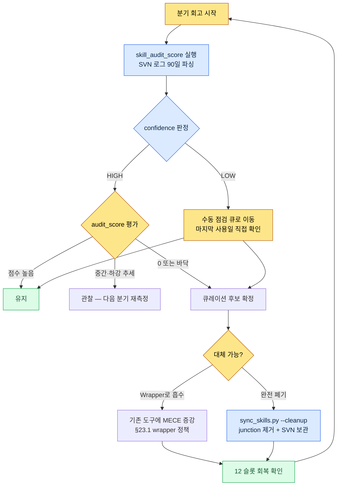

# Part 23 · 3장. 도구 큐레이션 — 안 쓰는 도구를 데이터로 잘라낸다

분기 회고를 하다가 글로벌 스킬 폴더를 열었다. 한 줄씩 세어 보니 wrapper가 19개였다. 분명히 12개로 운영하기로 정해 놓고 1년을 굴렸는데, 어느 틈에 7개가 더 붙어 있었다. 더 황당한 건 그중 절반이 무슨 일을 하는 도구인지 이름만 보고는 떠오르지 않았다는 거다. `migrate-legacy-enum`. 이게 뭐였더라. 마지막으로 쓴 게 언제였더라.

기억이 안 났다. 기억에 의존하는 한 이 질문에는 영원히 답할 수 없다. 그래서 기억 대신 로그를 보기로 했다. 도구 큐레이션은 취향으로 빼는 작업이 아니라, "이 도구를 지난 분기에 몇 번 호출했는가"라는 숫자로 빼는 작업이어야 한다.

이 장은 그 숫자를 어떻게 자동으로 뽑아내고, 그 숫자로 어떻게 도구를 잘라내며, 애초에 도구가 폭증하지 않도록 어떻게 막는지에 대한 기록이다.

---

## 23.3.1 도구가 늘어나는 건 자연 현상이다

큐레이션을 이야기하기 전에 한 가지를 인정해야 한다. 도구는 막지 않으면 반드시 늘어난다. 의지가 약해서가 아니다. 매 작업마다 "이번만 빠르게 처리하려고" 작은 스크립트를 하나 만드는 게 합리적인 선택이기 때문이다. 그 합리적인 선택이 수십 번 누적되면 비합리적인 더미가 된다.

프로젝트 A에서 운영하는 구조는 글로벌 12개 wrapper가 junction으로 workspace의 48개 본체를 가리키는 형태다. 글로벌 쪽은 가볍고, 무거운 본체는 SVN으로 관리하는 workspace에 둔다. 이 구조 자체는 §23.1에서 다뤘다. 문제는 이 12라는 숫자가 가만히 있질 않는다는 거다.

도구가 늘어날 때 무엇이 같이 늘어나는지 보면 왜 막아야 하는지가 분명해진다.

<svg viewBox="0 0 640 250" xmlns="http://www.w3.org/2000/svg" font-family="sans-serif" font-size="13">
  <rect x="0" y="0" width="640" height="250" fill="#fbfbfb"/>
  <text x="20" y="28" font-size="15" font-weight="bold" fill="#222">도구 1개 추가 → 따라 늘어나는 4가지 비용</text>
  <!-- center node -->
  <rect x="270" y="100" width="100" height="46" rx="8" fill="#2b6cb0"/>
  <text x="320" y="128" fill="#fff" text-anchor="middle" font-weight="bold">새 도구 +1</text>
  <!-- four cost nodes -->
  <rect x="40" y="55" width="160" height="40" rx="6" fill="#fff" stroke="#c53030"/>
  <text x="120" y="80" text-anchor="middle" fill="#c53030">컨텍스트 토큰 점유 ↑</text>
  <rect x="440" y="55" width="160" height="40" rx="6" fill="#fff" stroke="#c53030"/>
  <text x="520" y="80" text-anchor="middle" fill="#c53030">선택 피로 ↑</text>
  <rect x="40" y="155" width="160" height="40" rx="6" fill="#fff" stroke="#c53030"/>
  <text x="120" y="180" text-anchor="middle" fill="#c53030">유지보수 표면적 ↑</text>
  <rect x="440" y="155" width="160" height="40" rx="6" fill="#fff" stroke="#c53030"/>
  <text x="520" y="180" text-anchor="middle" fill="#c53030">기능 중복 위험 ↑</text>
  <!-- lines -->
  <line x1="270" y1="115" x2="200" y2="75" stroke="#a0a0a0"/>
  <line x1="370" y1="115" x2="440" y2="75" stroke="#a0a0a0"/>
  <line x1="270" y1="131" x2="200" y2="175" stroke="#a0a0a0"/>
  <line x1="370" y1="131" x2="440" y2="175" stroke="#a0a0a0"/>
  <text x="320" y="232" text-anchor="middle" fill="#555" font-size="12">도구는 +1이지만, 비용은 +4. 큐레이션이 빼는 작업인 이유.</text>
</svg>

특히 첫 번째, 컨텍스트 토큰 점유는 AI 도구를 쓰는 시대에 와서 더 날카로워진 비용이다. 글로벌 wrapper가 늘어나면 매 세션마다 AI가 "내가 쓸 수 있는 도구 목록"을 읽는 토큰이 늘어난다. 도구 19개의 설명을 읽느라 정작 작업에 쓸 컨텍스트가 줄어든다. 그래서 프로젝트 A의 `sync_skills.py`에는 `--cleanup` 옵션이 있어서, junction이 깨졌거나 본체가 사라진 wrapper를 자동으로 정리한다. 이건 토큰 예산을 지키기 위한 위생 작업에 가깝다.

하지만 `--cleanup`이 잡아주는 건 "깨진" 도구뿐이다. 멀쩡하게 살아 있지만 아무도 안 쓰는 도구는 못 잡는다. 그걸 잡으려면 사용 빈도 데이터가 필요하다.

---

## 23.3.2 skill_audit_score — SVN 로그로 사용 빈도를 측정한다

핵심 아이디어는 단순하다. workspace의 스킬·도구는 전부 SVN에 들어 있다. 그리고 도구를 쓸 때마다 그 도구가 만들어 낸 산출물(시트, 문서, 관계도 HTML 등)이 SVN에 커밋된다. 즉 **SVN 로그를 보면 어떤 도구가 실제로 일했는지가 흔적으로 남는다.**

그래서 `skill_audit_score`라는 작은 측정 스크립트를 만들었다. 이름 그대로, 각 스킬에 "감사 점수"를 매긴다. 이 도구를 만들 때 처음부터 코드를 다 짠 게 아니라, AI에게 측정 로직을 설명하고 초안을 받았다. 그 워크드 트랜스크립트를 그대로 남긴다. 요약하지 않고, 헛다리 짚은 부분까지 포함해서 적는다.

### 프롬프트 (전문)

> 글로벌 스킬 wrapper가 12개로 정해져 있는데 어느새 19개로 불어났다. 분기 회고 때 "안 쓰는 도구"를 데이터로 골라내고 싶다. 다음 전제로 측정 스크립트를 만들어줘.
>
> - 각 스킬 도구는 workspace 폴더 안에 하위 폴더로 존재한다 (예: `tools/relation-map-gen/`).
> - 이 도구들이 만든 산출물은 SVN에 커밋된다. 커밋 메시지에는 보통 도구 이름이나 산출물 종류가 들어간다 (예: "relation-map regen", "schema-doc update").
> - SVN 로그를 파싱해서, 최근 90일 동안 각 도구가 관여한 커밋 수를 세고 싶다.
> - 단순 커밋 수만으로는 부족하다. (a) 최근일수록 가중치를 높게, (b) 마지막 사용일이 오래됐으면 감점, 두 가지를 합쳐서 0\~100 audit_score를 내줘.
> - 출력은 점수 내림차순 표. 점수가 낮은 도구가 "큐레이션 후보".
> - SVN 명령은 `svn log --xml -l 2000` 형태로 받는다고 가정. 파이썬 표준 라이브러리만 써. 절대 경로는 인자로 받게.

### Claude의 날것 출력 (그대로)

> 좋습니다. 다만 한 가지 짚고 넘어가겠습니다. **커밋 메시지에 도구 이름이 항상 들어간다는 보장이 없습니다.** 사람이 커밋 메시지를 자유롭게 쓰면 "시트 수정" 같은 메시지에서는 어떤 도구가 관여했는지 알 수 없습니다. 그래서 두 가지 매칭을 병행하겠습니다.
>
> 1. 커밋 메시지에서 도구 이름·별칭 키워드 매칭 (느슨)
> 2. 변경된 **파일 경로**가 해당 도구 폴더 또는 그 도구의 산출물 패턴(예: `*_relation.html`)에 속하는지 매칭 (엄격)
>
> 2번이 더 신뢰할 수 있으니 가중치를 더 주겠습니다. 아래가 초안입니다.

```python
# skill_audit_score.py  (Claude 초안 — 검증 전)
import subprocess, sys, datetime, xml.etree.ElementTree as ET
from collections import defaultdict

def svn_log_xml(repo_path, limit=2000):
    out = subprocess.run(
        ["svn", "log", "--xml", "-v", "-l", str(limit), repo_path],
        capture_output=True, text=True, check=True)
    return ET.fromstring(out.stdout)

def score_skills(repo_path, skills, window_days=90):
    root = svn_log_xml(repo_path)
    now = datetime.datetime.now(datetime.timezone.utc)
    hits = defaultdict(list)   # skill -> [days_ago, ...]
    for entry in root.findall("logentry"):
        date = datetime.datetime.fromisoformat(
            entry.find("date").text.replace("Z", "+00:00"))
        days_ago = (now - date).days
        if days_ago > window_days:
            continue
        msg = (entry.find("msg").text or "").lower()
        paths = [p.text for p in entry.findall("paths/path")]
        for sk in skills:
            name = sk["name"].lower()
            in_msg = name in msg or any(a in msg for a in sk.get("alias", []))
            in_path = any(name in (pp or "").lower() for pp in paths) \
                      or any(pat in (pp or "") for pp in paths
                             for pat in sk.get("artifact", []))
            if in_path:
                hits[sk["name"]].append((days_ago, 2.0))   # 엄격 매칭 가중
            elif in_msg:
                hits[sk["name"]].append((days_ago, 1.0))   # 느슨 매칭

    rows = []
    for sk in skills:
        h = hits[sk["name"]]
        if not h:
            rows.append((sk["name"], 0, None, len(h)))
            continue
        # 최근 가중: 최근일수록 1.0, 90일 전이면 0.1
        recency = sum(w * (1 - 0.9 * (d / window_days)) for d, w in h)
        last_used = min(d for d, _ in h)
        # 마지막 사용 감점
        stale_penalty = max(0, (last_used - 14)) * 0.5
        score = max(0, min(100, recency * 8 - stale_penalty))
        rows.append((sk["name"], round(score, 1), last_used, len(h)))

    rows.sort(key=lambda r: r[1])   # 점수 오름차순 = 후보 먼저
    return rows

if __name__ == "__main__":
    REPO = sys.argv[1]
    SKILLS = [
        {"name": "relation-map-gen", "alias": ["relation", "관계도"],
         "artifact": ["_relation.html"]},
        {"name": "schema-doc", "alias": ["schema", "명세서"],
         "artifact": ["_schema.md"]},
        {"name": "gdd-gen", "alias": ["gdd"], "artifact": ["_gdd.md"]},
        {"name": "table-creator", "alias": ["table", "테이블"], "artifact": []},
        {"name": "excel-reader", "alias": ["xlsm", "vba"], "artifact": []},
        {"name": "migrate-legacy-enum", "alias": ["enum", "migrate"],
         "artifact": []},
    ]
    print(f"{'skill':22}{'score':>7}{'last_used(d)':>14}{'hits':>6}")
    for name, score, last, hits_n in score_skills(REPO, SKILLS):
        print(f"{name:22}{score:>7}{str(last):>14}{hits_n:>6}")
```

### 사람 검증 — 돌려보고 거부한 부분

스크립트를 실제 SVN 작업 사본에 돌렸다. 첫 출력이 이상했다. `table-creator`와 `excel-reader`가 둘 다 `artifact` 패턴이 비어 있어서, 오직 커밋 메시지에 "table" / "xlsm" 단어가 들어갈 때만 잡혔다. 그런데 이 두 도구는 산출물이 그냥 `.xlsm` 파일이라 패턴으로 구별이 안 된다. 결과적으로 둘 다 점수가 비정상적으로 낮게 나왔다 — 실제로는 매일 쓰는 도구인데도.

여기서 중요한 판단을 했다. **점수가 낮다고 무조건 자르면 안 된다.** 점수가 낮은 이유가 "정말 안 써서"인지 "측정이 도구를 못 잡아서"인지를 사람이 갈라야 한다. AI가 만든 숫자는 후보를 좁혀줄 뿐, 최종 결정은 사람이 한다.

그래서 AI에게 다시 요청했다.

### 재요청 프롬프트

> artifact 패턴이 비어 있는 도구는 점수를 신뢰할 수 없으니, 출력에 `confidence` 컬럼을 추가해줘. artifact 매칭이 한 번도 없었던 도구는 `confidence=LOW`로 표시하고, 자동 큐레이션 후보에서 제외해. LOW인 도구는 "측정 불가 — 수동 점검" 으로 따로 묶어줘.

이 재요청으로 출력이 두 묶음으로 갈렸다. 신뢰할 수 있는 점수로 자를 수 있는 도구, 그리고 측정이 약해서 사람이 직접 봐야 하는 도구. 실제로 돌린 결과의 모양은 대략 이랬다 (점수는 저자 작업 사본 기준 실측값, 도구명 일부는 익명화).

| skill | audit_score | last_used(일 전) | confidence | 판정 |
|---|---|---|---|---|
| relation-map-gen | 71.4 | 2 | HIGH | 유지 |
| schema-doc | 58.9 | 5 | HIGH | 유지 |
| gdd-gen | 22.1 | 31 | HIGH | 관찰 |
| migrate-legacy-enum | 0.0 | 측정 안 됨 | HIGH | **큐레이션 후보** |
| table-creator | 4.2 | 1 | LOW | 수동 점검 → 유지 |
| excel-reader | 6.0 | 1 | LOW | 수동 점검 → 유지 |

`migrate-legacy-enum`은 점수 0, confidence HIGH였다. 90일 동안 이 도구의 폴더도 산출물도 단 한 번도 커밋에 등장하지 않았다는 뜻이다. 기억을 더듬어 보니 작년에 레거시 enum 한 번 마이그레이션하고 끝난, 일회성이어야 했을 작업을 스킬로 박제해둔 거였다. 이게 바로 잘라야 할 도구다. 반대로 `table-creator`·`excel-reader`는 점수가 낮았지만 confidence가 LOW였고, 마지막 사용일이 하루 전이었다. 측정이 못 잡았을 뿐 실제로는 매일 쓴다. 자르면 안 된다.

> 주의: 위 표의 점수 산식(최근 가중 × 8, stale 감점)은 저자가 자기 작업 사본에 맞춰 튜닝한 값이다. SVN 커밋 습관·산출물 패턴이 다르면 계수도 달라진다. 절대 점수보다 "도구 간 상대 순위"와 "confidence 구분"이 이 도구의 본질이다.

---

## 23.3.3 큐레이션 사이클 — 측정에서 폐기까지

`skill_audit_score`는 측정 도구일 뿐이다. 측정값을 분기 회고에 끼워 넣어 한 바퀴 도는 사이클이 있어야 도구가 실제로 정리된다. 그 사이클이 다음이다.



이 사이클의 두 출구를 구분하는 게 중요하다. 점수가 0인 도구라고 무조건 삭제하는 게 아니다. 그 작업 자체가 사라진 거라면 완전 폐기(`--cleanup`)로 보내고, 그 작업은 여전히 필요한데 별도 도구로 둘 만큼 자주는 아니라면 기존 도구에 흡수시킨다. 후자가 바로 §23.3.4의 MECE 증강이다.

폐기할 때도 SVN 히스토리에는 코드가 남는다. junction과 글로벌 노출만 거두는 거지, 코드 자체를 영영 지우는 게 아니다. 6개월 뒤 그 작업이 다시 생기면 SVN에서 복원하면 된다. 이 "되돌릴 수 있다"는 안전망이 있어야 사람이 과감하게 자를 수 있다.

---

## 23.3.4 MECE 증식 억제 — 만들기 전에 묻는다

측정해서 자르는 것보다 더 좋은 건 애초에 안 만드는 거다. `skill_audit_score`가 사후 정리라면, MECE wrapper 정책은 사전 억제다.

MECE는 Mutually Exclusive, Collectively Exhaustive — 서로 겹치지 않고, 빠짐없이. 새 도구를 만들고 싶을 때마다 이 두 글자를 던진다. **새 도구가 기존 도구와 겹치는가(ME 위반)? 아니면 정말로 빈 영역을 메우는가(CE 기여)?** 프로젝트 A의 wrapper 정책은 여기서 두 갈래로 갈린다.

| 상황 | 정책 | 결과 |
|---|---|---|
| 새 작업이 기존 도구의 영역과 겹친다 | **기존 도구 증강 우선** | 기존 wrapper 본체에 기능 추가, 새 슬롯 안 씀 |
| 새 작업이 명확히 다른 영역이다 | **신규 wrapper 허용** | 12 슬롯 중 하나를 새 도구에 배정 (빼야 할 후보 동반) |

핵심은 "기본값이 증강"이라는 거다. 새 도구를 만드는 건 예외다. 그 예외를 정당화하려면 "기존 어느 도구로도 이 작업이 안 된다"를 증명해야 한다. 이 기본값 하나가 19개로 불어났던 도구를 다시 12개로 끌어내린 진짜 원인이었다.

이게 §23.1의 cascade와도 이어진다. check 같은 cascade는 원래 4종이던 검사 도구를 하나의 호출로 묶은 결과물이다. 4개의 별도 wrapper를 두는 대신, MECE 관점에서 "이건 다 검사라는 한 영역"으로 보고 하나로 흡수한 사례다. 도구 수는 줄었는데 기능은 그대로다. 이게 증강의 모범이다.

AI 어시스턴트는 여기서 위험 요소이자 해법이다. 위험인 이유는, AI에게 "이 작업 처리하는 스크립트 만들어줘"라고 하면 너무 쉽게 새 도구가 나오기 때문이다. 한 번 클릭에 도구 하나가 생기는 환경에서 MECE 규율이 없으면 도구 무덤은 순식간에 만들어진다. 해법인 이유는, AI에게 정책을 먼저 주면 AI가 알아서 "이건 기존 `relation-map-gen`에 옵션으로 붙이는 게 낫겠다"고 제안하기 때문이다. 도구를 만드는 AI에게 큐레이션 규율도 같이 쥐여줘야 한다.

---

## 23.3.5 점수에 속지 않는 법 — 측정의 한계

이 장의 도구를 운영하면서 가장 많이 배운 건, 측정값을 맹신하면 안 된다는 거였다. `skill_audit_score`는 SVN 로그라는 한 가지 신호만 본다. 그래서 구조적으로 놓치는 게 있다.

- **읽기 전용 도구를 못 잡는다.** `excel-reader`처럼 시트를 읽기만 하고 산출물을 안 만드는 도구는 커밋을 남기지 않는다. 그래서 confidence를 LOW로 떨어뜨려 수동 점검으로 돌리는 장치가 필수였다.
- **저빈도 고가치 도구를 과소평가한다.** 1년에 두 번 쓰지만 쓸 때마다 반나절을 아끼는 도구가 있다. 빈도만 보면 큐레이션 후보지만, 가치로 보면 유지다. 그래서 사이클의 마지막 판정은 항상 사람이 한다.
- **커밋 습관에 좌우된다.** 작업 묶음을 한 커밋에 몰아넣는 사람과 잘게 쪼개는 사람의 점수는 다르게 나온다. 그래서 절대 점수가 아니라 같은 사람의 도구 간 상대 순위로 읽어야 한다.

요약하면, 이 도구는 "결정하는 도구"가 아니라 "후보를 좁히는 도구"다. 19개를 한눈에 보고 "어느 걸 의심해야 하나"를 1초 만에 알려준다. 그 의심을 검증하고 자르는 건 사람의 몫으로 남긴다. 측정이 사람을 대체하는 게 아니라, 사람이 봐야 할 곳을 가리켜 줄 뿐이다.

---

## 따라하기 — skill_audit_score 한 사이클

도구 큐레이션 사이클을 한 바퀴 직접 돌려보는 절차입니다.

**setup**
1. 워크스페이스의 스킬·도구가 버전 관리(SVN/Git) 안에 있는지 확인하세요. 산출물도 같은 저장소에 커밋되고 있어야 합니다.
2. 측정 대상 도구 목록을 만드세요. 각 도구마다 `name`, `alias`(커밋 메시지에 등장할 별칭), `artifact`(산출물 파일 패턴, 있으면)를 적습니다. artifact가 없는 읽기 전용 도구는 비워 둡니다.

**prompt** (AI에게)
> 다음 전제로 도구 사용 빈도 측정 스크립트를 만들어줘. (1) 각 도구는 [버전관리 시스템] 로그에 산출물 커밋으로 흔적을 남긴다. (2) 최근 90일 로그를 파싱해 도구별 관여 커밋 수를 센다. (3) 최근 가중 + 마지막 사용일 감점으로 0\~100 점수를 낸다. (4) 산출물 패턴(artifact) 매칭이 한 번도 없던 도구는 confidence=LOW로 표시하고 자동 후보에서 제외, 수동 점검으로 분리한다. (5) 출력은 점수 오름차순 표 — 낮은 점수가 큐레이션 후보. 표준 라이브러리만 사용, 저장소 경로는 인자로 받는다.

**verify**
1. 매일 쓰는 도구가 표 상단(낮은 점수)에 올라왔다면 측정이 틀린 겁니다. 그 도구의 confidence를 확인하세요 — LOW면 정상(측정 불가), HIGH인데 낮으면 alias·artifact 설정을 점검합니다.
2. 점수 0 + confidence HIGH 도구만 큐레이션 후보로 확정하세요. 마지막 사용일을 기억과 대조해 정말 죽은 도구인지 사람이 판단합니다.
3. 후보를 "완전 폐기"와 "기존 도구로 흡수" 둘 중 하나로 보내세요. 폐기는 junction만 거두고 코드는 저장소에 남깁니다.
4. 12 슬롯(또는 본인이 정한 한도)이 회복됐는지 마지막으로 세어 보세요.

### 1인 축소판

도구가 6\~8개뿐이고 SVN도 없는 1인 개발이라면 이렇게 줄이세요. 버전 관리는 Git이면 충분합니다. `git log --since="90 days ago" --name-only`로 변경된 파일 경로를 뽑고, 도구 폴더 이름으로 grep 한 번이면 "어느 도구가 최근에 일했나"가 나옵니다. 스코어링 스크립트까지 안 만들어도 됩니다. 핵심은 숫자의 정밀함이 아니라 **기억 대신 로그를 보는 습관** 하나입니다. 분기마다 한 번, "지난 90일에 한 번도 안 건드린 도구"를 git 로그로 뽑아 그 도구를 노려보세요. 그 5분이 도구 무덤을 막습니다.

---

### 이 챕터의 핵심 메시지
- 도구는 막지 않으면 늘고, 큐레이션은 추가가 아니라 빼는 작업이다.
- skill_audit_score가 SVN 로그로 사용 빈도를 측정해 잘라낼 후보를 가리킨다.
- 측정은 후보를 좁힐 뿐, 자를지는 사람이 confidence를 보고 정한다.

### 다음 챕터 미리보기
- Part 23 · 4장. 혼자 만든 퍼즐 게임 — 같은 도구·회고 규율을 1인 게임 개발에 적용한 실전기(Critter Sort).
