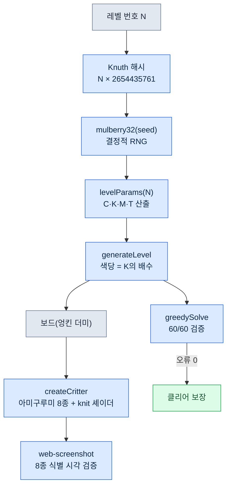

# Part 23 · 4장. 혼자 만든 퍼즐 게임 — Critter Sort 실전기

토요일 오후, 와이프가 휴대폰으로 색깔 맞추기 퍼즐을 하고 있었다. 엉킨 실타래를 같은 색 바구니로 분류하는 *Yarn Fever*라는 게임이었다. 한 판이 끝나면 "또 같은 거네" 하고 닫았다. 갱신이 없으니 금세 질린 것이다.

그 순간 든 생각은 단순했다. 저 루프는 검증된 중독성을 가졌고, 메커니즘 자체는 저작권 대상이 아니다. 동물 테마로 바꾸고, 레벨을 절차적으로 무한히 찍어내면 "또 같은 거" 문제가 사라진다. 혼자, 브라우저에서 바로 도는 HTML 3D로 만들면 와이프 휴대폰에 설치도 필요 없다.

문제는 내가 그래픽 엔지니어가 아니라는 것이다. 24년 차 기획자지만 Three.js로 셰이더를 짜본 적은 없다. 그래서 이 챕터는 "AI와 함께 혼자 게임 한 개를 며칠 만에 굴러가게 만든" 실제 기록이다. 회사 MMORPG(이하 프로젝트 A) 작업과 같은 도구를 쓰되, 도메인 콘텐츠는 단 한 줄도 섞지 않은 분리의 기록이기도 하다.

실제 게임은 `critter-sort/` 저장소에 있고, git 태그 v0.1\~v0.3으로 사흘간의 결정이 남아 있다. 가공한 사례가 아니라 그 저장소를 그대로 인용한다.

---

## 23.4.1 역설계를 프롬프트로 — 그리고 시그니처를 잃다

가장 먼저 한 일은 원작을 말로 분해해 AI에게 던지는 것이었다. 첫 프롬프트는 이랬다.

> **프롬프트 (v0.1 착수):**
> "Yarn Fever라는 캐주얼 퍼즐의 핵심 루프를 동물 테마로 각색해 Three.js + Vite로 만들고 싶어. 루프는 이래: 엉킨 색-덩어리를 같은 색 통으로 분류하고, 임시 슬롯을 초과하면 게임오버. 동물을 분류 대상으로 삼아서, 엉킨 동물 더미를 탭하면 같은 색 둥지(nest)로 보내는 식으로 가자. 로직은 Three.js와 무관한 순수 JS 상태머신으로 짜서 headless 테스트가 되게 해줘. 절차적 무한 레벨(시드 기반)도 넣어줘."

AI는 충실히 따라왔다. 폴더 구조를 `game/`(순수 로직)과 `render/`(Three.js)로 갈랐고, `state.js`·`rules.js`·`generator.js`를 먼저 짠 뒤 색칠한 박스 placeholder로 보드를 띄웠다. 며칠이 아니라 한 세션 만에 v0.1이 굴러갔다.

그런데 와이프에게 보여주려고 직접 플레이한 순간 위화감이 왔다. 동물이 화면 위에서 바구니로 깡총 뛰어 들어가는, 흔한 매치 퍼즐이 되어 있었다. 원작의 손맛이 빠져 있었다. *Yarn Fever*의 정체성은 "분류"가 아니라 **엉킨 실타래를 손으로 풀어내는 촉감**과 **화면을 돌려가며 가려진 색을 확인하는 행위**였다. 나는 프롬프트에서 그걸 "동물을 탭하면 둥지로"라는 일반 sort로 납작하게 눌러버렸고, AI는 내가 준 정의에 충실했을 뿐이다.

이게 역설계의 첫 함정이다. 원작을 요약하면 시그니처가 증발한다. 요약은 본질이 아니라 표면을 남기기 때문이다.

여기서 한 가지를 분명히 해둔다. AI는 틀린 답을 준 게 아니다. 내 프롬프트가 틀렸다. 그래서 다음 사이클은 코드 수정이 아니라 **정의의 교정**이었다.

---

## 23.4.2 척추 — 회전과 실 풀기를 되살린 교정 사이클

v0.1을 본 직후, 두 번에 걸쳐 핵심을 다시 명시했다. 첫 교정은 행위를, 둘째 교정은 촉감을 겨냥했다.

> **프롬프트 (1차 교정 — 행위):**
> "이거 그냥 매치 퍼즐이 됐어. Yarn Fever의 정체성은 '3D 화면을 돌려가며 가려진 색을 확인하고, 풀 순서를 정하는' 거야. 보드를 평면에 흩뿌리지 말고 가운데 높은 둔덕으로 쌓아서, 돌려야 뒤에 가려진 색이 보이게 해줘. OrbitControls로 회전 넣고. 근데 회전이랑 탭이 충돌하잖아 — 어떻게 분리할 거야?"

> **Claude의 출력 (날것, 요약 없이):**
> "맞습니다. 회전 제스처와 탭이 같은 포인터 이벤트라서 충돌합니다. 거리·시간 임계로 가르는 방식을 제안합니다. `pointerdown`에서 좌표·시각을 기록하고, `pointerup`에서 이동 거리가 9px를 넘거나 누른 시간이 400ms를 넘으면 회전 제스처로 간주해 탭을 무시합니다. 그 이하만 raycaster로 동물을 집어 `state.tap()`을 호출합니다. OrbitControls의 azimuth는 ±54° 정도로 제한해 더미가 화면 밖으로 안 나가게 하겠습니다. 다만 모바일에서 9px이 너무 민감할 수 있으니 실기에서 확인이 필요합니다."

그 9px/400ms 임계는 지금도 `src/main.js`에 그대로 살아 있다. 군더더기 없는, 직접 검증 가능한 코드다.

```javascript
// src/main.js — 드래그=회전(OrbitControls) / 짧은 탭=실 풀기
canvas.addEventListener('pointerup', (ev) => {
  if (!down || state.status !== 'playing') { down = null; return }
  const dist = Math.hypot(ev.clientX - down.x, ev.clientY - down.y)
  const dt = performance.now() - down.t
  down = null
  if (dist > 9 || dt > 400) return // 회전 제스처로 간주
  const rect = canvas.getBoundingClientRect()
  const x = ((ev.clientX - rect.left) / rect.width) * 2 - 1
  const y = -((ev.clientY - rect.top) / rect.height) * 2 + 1
  const id = view.pick(x, y, camera)
  if (id !== null) state.tap(id)
})
```

행위는 돌아왔다. 그런데 둘째로 플레이해 보니 여전히 "실타래를 푼다"는 느낌이 없었다. 동물이 그냥 둥지로 이동할 뿐, 풀리는 손맛이 없었다. 둘째 교정.

> **프롬프트 (2차 교정 — 촉감):**
> "회전은 좋아졌어. 근데 아직 '실을 푸는' 느낌이 없어. 탭하면 동물 몸에 감긴 엉킨 실 가닥이 풀려서 사라지고, 그 실이 바구니로 감겨 들어가는 연출을 넣어줘. 동물 룩도 매끈한 GLB 새 말고, 통통한 니트 봉제인형(아미구루미)으로. 졸린 눈, 볼터치 같은 코지한 디테일. 외부 에셋 안 맞으면 빼고 절차적으로 만들어도 돼."

> **Claude의 출력 (날것):**
> "두 가지를 분리해 구현하겠습니다. (1) 엉킨 실: 각 동물 몸통에 살짝 어두운 같은 색 `TorusGeometry` 2가닥을 감아 두고, 탭 시 scale을 0.01로 줄여 풀려 사라지게 합니다. (2) 실 감김: `TubeGeometry`로 동물→바구니 경로의 실을 그려 바구니 쪽으로 감겨 들어가는 트윈. 봉제인형 룩은 절차적으로 갑니다 — `MeshStandardMaterial`에 knit bump 텍스처를 절차 생성해 niit 질감을 주고, 졸린 눈은 납작한 box, 볼터치는 반투명 핑크 sphere로. 기존 GLB 스타터(새 3종)는 니트 톤과 안 맞으니 제거하되, 동물팩 로드 파이프라인은 폴백으로 살려두겠습니다. 한 가지 짚자면, 절차 생성 동물은 종 다양성이 GLB만 못합니다 — 일단 한 종으로 검증하고 종을 늘리는 게 안전합니다."

마지막 그 경고("종 다양성이 GLB만 못하다" — GLB는 glTF Binary, 외부에서 받아 쓰는 기성 3D 모델 파일 포맷이다)가 바로 v0.3으로 이어진 씨앗이다. AI가 다음 한계를 먼저 말했고, 나는 그걸 다음 마일스톤으로 받았다.

검증은 매번 두 단계였다. headless로 로직이 안 깨졌는지(오류 0), 그다음 브라우저에서 직접 회전·탭으로 손맛을 본다. v0.2 커밋 메시지에 그 검증이 박제돼 있다. "headless 검증: 회전·실풀림·자동클리어 정상, 오류 0."

엉킨 실 2가닥은 지금 `src/render/pieces.js`에 이렇게 남아 있다.

```javascript
// src/render/pieces.js — 몸통을 감은 느슨한 실 2가닥(살짝 어두운 같은 색)
const strandMat = new THREE.MeshStandardMaterial({ color: darken(hex, 0.7), roughness: 1 })
const strands = []
const orient = [[0.5, 0.2, 0.0], [1.25, 0.0, 0.6]]
for (let i = 0; i < 2; i++) {
  const s = addMesh(g, G.torus, strandMat, [0, byo + 0.02, 0], Math.max(bx, bz) + 0.02, orient[i])
  strands.push(s)
}
g.userData.strands = strands  // 탭 시 view.js가 이 가닥들을 풀어 사라지게 함
```

여기서 얻은 교훈을 한 줄로 남긴다.

- 역설계는 요약하면 시그니처가 죽는다.
- 정의가 틀리면 코드가 아니라 정의를 고친다.
- AI가 말한 다음 한계가 다음 마일스톤이다.

---

## 23.4.3 사흘의 결정 이력 — git 태그로 읽는 교정

말로만 보면 "두 번 고쳤다"지만, git 이력은 그 교정이 언제 어떤 형태로 들어갔는지 정확한 시각과 함께 남겼다. 이게 1인 개발에서 회고를 대신한다. 동료가 없어도 커밋이 "왜 이렇게 됐는가"를 증언한다.

| 커밋 | 시각 (2026-05-30) | 무엇이 바뀌었나 | 시그니처 상태 |
|---|---|---|---|
| `2b2e3bc` v0.1 | 14:43 | Yarn Fever 역설계, 순수 로직 + placeholder, 60/60 솔버 통과 | 누락 (일반 sort로 납작해짐) |
| `70a0117` v0.2 | 15:11 | 회전(OrbitControls ±54°) + 탭/드래그 분리 + 실 풀림 + 아미구루미 | 복원 (핵심 재정의) |
| `160663c` 스냅샷 | 15:31 | v0.2 갤러리 스냅샷 5컷 + README 갤러리 | — |
| `59b0baf` v0.3 | 15:55 | 절차적 아미구루미 8종 + 비비드 캔디 팔레트 | 강화 (종 다양성 확보) |
| `c5b9a1b` 인계 | 16:20 | NEXT_SESSION 세션 인계 포인터 | — |

v0.2 커밋 메시지 본문이 결정 그 자체를 박제했다. "게임 정체성을 '동물 깡총'에서 '화면 돌려가며 귀여운 실타래(니트 봉제인형)를 풀어 같은 색 바구니로'로 바로잡음." 한 시간 반 사이에 게임의 정체성이 한 번 죽었다가 살아난 기록이다.

주목할 디테일 하나. v0.2의 `git show --stat`을 보면 스타터 GLB 새 3종(Flamingo·Parrot·Stork)이 통째로 삭제됐다. "아트가 니트 톤과 안 맞아서"였다. 외부 무료 에셋이 공짜라고 다 쓰는 게 아니라, 톤이 안 맞으면 지우는 결정. 이건 AI가 아니라 사람이 내린 미감의 게이트다.

```
public/assets/animals/pack_starter/Flamingo.glb  | Bin 77428 -> 0 bytes
public/assets/animals/pack_starter/Parrot.glb    | Bin 97024 -> 0 bytes
public/assets/animals/pack_starter/Stork.glb     | Bin 76852 -> 0 bytes
```

---

## 23.4.4 절차적 생성 실증 — 아미구루미 8종과 무한 레벨

v0.2가 남긴 숙제는 "절차 동물은 종 다양성이 GLB만 못하다"였다. v0.3에서 그걸 풀었다. 외부 에셋을 한 개도 추가하지 않고, 코드로 동물 8종을 찍어냈다.

핵심은 `src/render/pieces.js`의 `SPECIES` 테이블이다. 종마다 몸통 비율·머리·귀 타입·주둥이·눈 모양을 파라미터로 정의하고, 한 함수가 그 파라미터를 읽어 메시를 조립한다.

```javascript
// src/render/pieces.js — 종별 실루엣 파라미터
const SPECIES = {
  cat:      { body: [0.5,0.46,0.48,0.04], ears: 'cat',   snout: 0.13, tail: 'cat',  eyes: 'sleepy' },
  bear:     { body: [0.52,0.5,0.5,0.03],  ears: 'bear',  snout: 0.16, tail: 'none', eyes: 'round' },
  bunny:    { body: [0.46,0.5,0.46,0.02], ears: 'bunny', snout: 0.12, tail: 'puff', eyes: 'round' },
  fox:      { body: [0.5,0.44,0.48,0.04], ears: 'fox',   snout: 0.2,  tail: 'fox',  eyes: 'sleepy' },
  capybara: { body: [0.58,0.5,0.56,0.02], ears: 'tiny',  snout: 0.22, tail: 'none', eyes: 'sleepy' },
  pig:      { body: [0.54,0.5,0.52,0.03], ears: 'pig',   snout: 0.1,  nose: true,   eyes: 'round' },
  frog:     { body: [0.56,0.4,0.54,0.05], ears: 'none',  snout: 0.1,  topEyes: true, eyes: 'none' },
  chick:    { body: [0.42,0.44,0.42,0.05], ears: 'none', beak: true,  tail: 'none', eyes: 'round' },
}
export const SPECIES_IDS = Object.keys(SPECIES)  // 8종
```

귀 모양 하나로 실루엣이 갈린다. 고양이·여우는 뾰족 cone, 곰은 둥근 sphere, 토끼는 길쭉한 sphere, 돼지는 앞으로 꺾인 cone. 개구리는 머리 위로 튀어나온 눈(`topEyes`), 병아리는 부리(`beak`). 이 작은 분기들이 8종의 식별성을 만든다. 외부 에셋 0, 코드 한 파일이다.

그런데 절차 생성에는 함정이 있다. "그럴듯해 보이는" 코드가 실제로 식별 가능한 8종을 만드는지는 코드만 봐서 모른다. 그래서 검증은 다시 두 단계였다. headless로 8종이 오류 없이 생성되는지, 그다음 web-screenshot 스킬(headless Chrome)로 실제 렌더를 캡처해 눈으로 8종이 구분되는지. DEVLOG v0.3에 그 결과가 있다. "귀/주둥이/코/부리/꼬리/눈으로 실루엣 구분. 외부 에셋 0, 니트 톤 완전 통일."

### 시드 하나가 보드 전체를 결정한다

레벨의 무한성은 시드 RNG가 책임진다. `generator.js`는 레벨 번호를 Knuth 곱셈 해시로 시드화하고, `mulberry32`로 결정적 난수를 뽑는다. 같은 레벨 번호는 항상 같은 보드다.

```javascript
// src/game/generator.js
export function generateLevel(level, animalPool = null) {
  const seed = (level * 2654435761) >>> 0  // Knuth multiplicative hash
  const rng = makeRng(seed)
  const { C, K, groupsPerColor, M, T } = levelParams(level)
  const colors = rng.shuffle(COLORS).slice(0, C)
  // ...
  for (const color of colors) {
    const count = K * groupsPerColor  // 항상 K의 배수 → 둥지로 정확히 분해(해결 보장)
    // ...
  }
}
```

여기 한 줄이 게임의 공정성을 보장한다. 색당 동물 수를 **항상 K(둥지 완성 마리수, 3)의 배수**로 강제했기 때문에, 어떤 보드든 둥지로 정확히 나누어떨어진다. 풀 수 없는 레벨이 원천적으로 안 나온다.

### 60개 레벨이 전부 풀리는가 — greedySolve

설계상 풀린다는 건 증명이 아니다. `rules.js`에 검증용 그리디 솔버를 넣고, `test-logic.mjs`로 60개 레벨을 자동 플레이시켜 실제로 전부 클리어되는지 매번 확인한다. 방금 이 챕터를 쓰면서 다시 돌린 실측 출력이다.

```
$ node scripts/test-logic.mjs
[솔버] 60/60 레벨 클리어

[난이도 커브] (C=색, K=완성, groups, M=둥지, T=트레이, 총마리)
  Lv 1: C=3 K=3 grp=2 M=3 T=7 총=18
  Lv 8: C=4 K=3 grp=3 M=4 T=6 총=36
  Lv12: C=5 K=3 grp=3 M=4 T=5 총=45
  Lv20: C=5 K=3 grp=3 M=4 T=4 총=45

[막무가내 플레이] 무작위 탭 시 패배율 (난이도 존재 확인)
  Lv 1: 무작위 패배율 0%
  Lv12: 무작위 패배율 1%
  Lv20: 무작위 패배율 3%
```

이 테스트는 두 가지를 동시에 증명한다. 그리디 솔버가 60/60을 깬다는 건 **모든 레벨이 풀린다는 것**(난이도가 불가능하지 않다)이고, 무작위 탭의 패배율이 레벨이 오를수록 0%→3%로 올라간다는 건 **난이도가 실재한다는 것**(아무렇게나 눌러도 다 깨지면 게임이 아니다)이다. 트레이가 7칸에서 4칸으로 좁아지는 난이도 커버가 패배율로 측정된다.

여기서 정직하게 짚는다. 무작위 패배율 3%는 "막 누르는 봇"의 패배율이지 사람의 난이도 체감이 아니다. 사람은 회전으로 색을 미리 확인하므로 패배율은 더 낮다. 이 수치는 "난이도가 0이 아니다"라는 방향 증명이지, 와이프가 3% 확률로 진다는 뜻이 아니다. 사람 체감 난이도는 v0.3 시점에 아직 측정 전이었고, NEXT_SESSION에 "와이프분 플레이 피드백 수집 (최우선)"으로 남겨 두었다.

### 절차적 생성 파이프라인



시드에서 출발해 파라미터·보드·메시·검증으로 갈라지는 이 흐름이 "갱신이 없어 질린다"는 최초 문제를 구조적으로 푼 답이다.

---

## 23.4.5 GLB가 들어오면? — 자동 스케일과 폴백

절차 동물 8종은 GLB가 없을 때의 폴백이다. 나중에 진짜 아미구루미 GLB를 구하면 그걸 우선 쓰도록, 동물팩 파이프라인을 살려뒀다. 폴더에 GLB를 드롭하고 `npm run scan`만 돌리면 끝이다.

문제는 GLB마다 크기가 제각각이라는 점이다. 어떤 모델은 0.5유닛, 어떤 건 200유닛. 손으로 scale을 맞추면 동물팩 추가가 노동이 된다. 그래서 `scan-packs.mjs`가 GLB의 바운딩박스를 읽어 목표 높이(0.95유닛)에 맞는 scale을 자동 계산한다.

```javascript
// scripts/scan-packs.mjs — GLB 바운딩박스에서 scale/yOffset 자동 산출
const maxDim = Math.max(max[0]-min[0], max[1]-min[1], max[2]-min[2])
const scale = +(TARGET_H / maxDim).toPrecision(3)        // TARGET_H = 0.95
const yOffset = +(-((min[1] + max[1]) / 2) * scale).toPrecision(3)
```

그리고 `assets.js`는 packs.json이 없거나 로드 실패하면 조용히 절차 동물로 폴백한다.

```javascript
// src/render/assets.js
createAnimal(species, hex) {
  const entry = this.models.get(species)
  if (!entry) return createCritter(hex, species)  // 절차적 아미구루미 폴백
  // ... GLB 클론 + 색 틴팅
}
```

이 두 줄이 "GLB가 있으면 GLB, 없으면 코드 동물"을 무중단으로 보장한다. 와이프가 노는 동안 내가 새 GLB 팩을 떨어뜨려도 게임이 멈추지 않는다.

---

## 23.4.6 혼자인데 팀처럼 — AI를 어떻게 썼나

이 프로젝트에서 나는 기획자 한 명이었지만, 작업은 여러 역할로 굴러갔다. AI가 그 역할들을 메웠다. 핵심은 "코드를 대신 짜준다"가 아니라 **내가 약한 자리를 메운다**였다.

| 내가 약한 자리 | AI가 한 일 | 사람(나)이 지킨 게이트 |
|---|---|---|
| Three.js 셰이더 | knit bump 절차 텍스처, TubeGeometry 실 연출 | 톤이 맞는가 (GLB 새 3종 삭제 결정) |
| 입력 충돌 해결 | 9px/400ms 임계 제안 | 모바일 실기 체감 확인 |
| 회귀 안전성 | greedySolve로 60/60 자동 검증 | "난이도 실재"는 사람이 정의 |
| 다음 한계 예측 | "절차 동물은 종 다양성이 약하다" 경고 | 그걸 v0.3 마일스톤으로 채택 |

특히 시각 검증이 1인 개발의 약한 고리였다. 코드가 도는 것과 "8종이 눈에 구분되는 것"은 다른 문제다. 그래서 web-screenshot 스킬(headless Chrome로 dev 서버를 띄워 스크린샷 + 콘솔 오류 보고)을 회사 작업에서 그대로 차용했다. claude-in-chrome 확장 없이도 모바일 뷰포트(iPhone 15 Pro 세로, 393×852) 렌더를 눈으로 확인할 수 있었다.

여기서 가장 중요한 원칙이 작동한다. **도구는 회사에서 차용하되, 도메인 콘텐츠는 0건 차용한다.**

- 차용한 것: web-screenshot 검증 패턴, git 커밋 메시지 규율, headless 로직 테스트 습관, JIT atom 주입 hook.
- 차용 안 한 것: 프로젝트 A의 전투·스킬·세계관·데이터 시트 — 단 한 줄도.

이 분리는 grep으로 검증된다. 메모리 기록에 "회사 프로젝트 도메인 콘텐츠 차용 0건(검증 grep PASS)"이 남아 있다. Critter Sort의 색은 분홍·민트·노랑이고, 동물은 고양이·곰·토끼다. 프로젝트 A(회사 MMORPG)의 도메인 어휘는 이 저장소 어디에도 없다.

왜 이렇게까지 분리하나. 두 가지 사고를 동시에 막기 위해서다. 회사 IP가 개인 취미에 새는 법적 사고, 그리고 MMORPG 도메인 atom이 퍼즐 작업에 잘못 주입되어 노이즈가 되는 컨텍스트 오염. 도구만 흐르고 콘텐츠는 막는 것 — 그 사이가 건강한 분리다.

---

## 23.4.7 정리 — 혼자서도 시스템은 작동한다

Critter Sort는 작은 게임이다. 사흘, 커밋 5개, 동물 8종, 레벨 60개. 그런데 회사에서 쓰던 방식이 1/1000 규모에서도 그대로 작동했다.

- 역설계는 시그니처를 보존해야 한다.
- 정의가 틀리면 정의를 고친다.
- 검증은 headless + 눈, 두 단계로.

가장 큰 배움은 첫 절의 실패였다. v0.1에서 게임의 정체성을 한 번 죽였다가, 두 번의 교정으로 살려냈다. 동료가 없는 1인 개발에서 그 죽음과 부활을 증언한 건 git 커밋이었다. 회고가 없었다면 "왜 v0.2에서 다 갈아엎었지?"를 한 달 뒤 잊었을 것이다.

다음 Part 24에서는 이런 결정 이력을 큰 팀·장기 운영에서 어떻게 거버넌스로 굳히는지 다룬다.

이 챕터는 와이프가 질려서 닫은 퍼즐에서 출발해, 혼자 만든 게임이 다시 그 손에 들어가기까지의 기록이었다. 시스템은 규모가 아니라 규율의 문제임을 확인했다.

---

## 따라하기 — 오늘 할 수 있는 한 단계

좋아하는 캐주얼 게임 하나의 핵심 루프를 AI와 함께 굴려보는 단계입니다. 단, 시그니처를 잃지 않게.

**setup** — Node가 깔린 환경에서 빈 폴더를 하나 만드세요. `mkdir my-puzzle && cd my-puzzle`.

**prompt** — AI에게 이렇게 던지세요. 핵심은 "요약하지 말고 시그니처를 명시"하는 것입니다.

> "[게임명]의 핵심 루프를 [테마]로 각색하고 싶어. 이 게임의 시그니처는 [한 줄로 손맛을 적기 — 예: '화면을 돌려 가려진 것을 확인하고 푸는 촉감']야. 이걸 절대 일반 매치 퍼즐로 납작하게 만들지 마. 로직은 렌더와 분리해 headless로 테스트되게 짜줘."

**verify** — 첫 결과를 직접 플레이해 보세요. "내가 적은 시그니처가 살아 있나?"를 물어봅니다. 없으면 코드가 아니라 **정의를 다시 적어** 재요청하세요. 그게 v0.1→v0.2에서 제가 한 일입니다.

### 1인·취미 독자용 축소 버전

엔진도, 절차 생성도 필요 없습니다. 종이 한 장에 "이 게임의 시그니처 한 줄"을 적고, AI에게 프로토타입을 시킨 뒤 직접 플레이로 그 한 줄이 살았는지만 보세요. 죽었으면 한 줄을 더 구체적으로 다시 적습니다. 시그니처 한 줄을 지키는 습관, 그것 하나면 역설계의 첫 함정은 피합니다.
