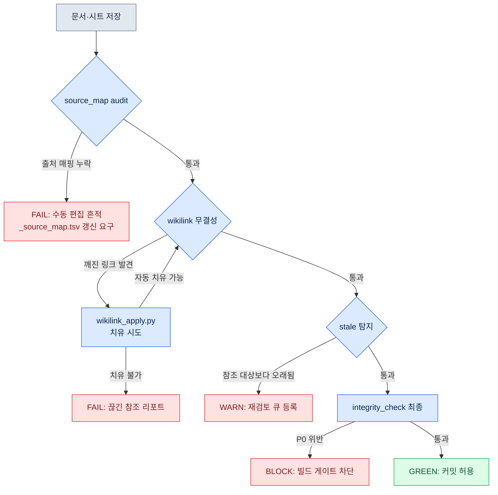

# 24.1 검증 시스템 — 정합·링크·stale를 코드로 잡는다

월요일 아침 스탠드업 직후, 데이터팀의 팀원 A가 메신저로 스크린샷 한 장을 보내왔습니다. 인게임 상점에서 어떤 재료 아이템의 설명이 비어 있다는 QA 리포트였습니다. 원인을 30분 추적한 끝에 정체가 드러났습니다. 두 주 전 누군가 기획 문서에서 그 아이템을 `재료_목재_상`으로 이름을 바꿨는데, 데이터 시트의 참조는 옛날 이름 `재료_목재_A`를 그대로 가리키고 있었습니다. 문서는 갱신됐고, 시트는 갱신 안 됐고, 둘을 잇던 링크는 조용히 끊겼습니다. 아무도 거짓말을 하지 않았는데도 게임은 거짓을 출력하고 있었습니다.

이런 사고는 문서가 늘어날수록 기하급수로 잦아집니다. 사람의 눈은 50개 문서의 상호 참조를 동시에 못 봅니다. 그래서 검증을 코드에 위임합니다. 이 챕터는 문서·데이터·링크의 정합성을 사람이 아니라 스크립트가 검사하게 만드는 시스템을 다룹니다. 핵심은 세 가지 — 출처 정합(`_source_map.tsv` audit), 링크 무결성(wikilink), 그리고 stale 탐지(오래되어 썩은 참조 잡기)입니다.

---

## 24.1.1 끊긴 링크는 왜 조용한가

문서와 데이터는 서로를 가리키며 살아갑니다. 기획서가 enum을 참조하고, enum이 데이터 시트를 참조하고, 시트가 다시 다른 기획서의 결정을 참조합니다. 이 그물을 사람이 손으로 관리하면, 한 노드가 바뀔 때 그 노드를 가리키던 모든 참조를 사람이 기억해서 따라가야 합니다. 기억은 실패합니다.

끊긴 링크가 위험한 이유는 그게 **에러를 던지지 않기** 때문입니다. 코드라면 존재하지 않는 변수를 참조할 때 컴파일러가 막아 줍니다. 그러나 문서에서 `[[재료_목재_A]]`라고 쓴 위키링크는, 그 대상이 사라져도 그냥 평범한 텍스트로 남습니다. 빨갛게 변하지 않습니다. 게임은 빌드되고, 출시되고, 유저가 빈 설명을 보고 나서야 누군가 알아챕니다.

그래서 검증 시스템의 첫 번째 일은 **사람 눈에 안 보이는 것을 보이게 만드는 것**입니다. 정합 위반을 텍스트 출력으로 끌어내고, 그 출력을 빌드 게이트에 묶어 두면, 사람이 잊어도 스크립트는 잊지 않습니다.

---

## 24.1.2 세 갈래 검증의 cascade

검증은 한 덩어리가 아니라 단계입니다. 먼저 가장 싼 검사를 돌려서 명백한 위반을 걸러 내고, 통과한 것만 다음 단계로 넘깁니다. 비싼 검사를 모든 입력에 다 돌리면 느려서 아무도 안 돌리게 되기 때문입니다. 아래는 저자가 운영하는 검증 흐름입니다.



이 cascade의 핵심은 **실패가 빠를수록 싸다**는 것입니다. `source_map audit`은 TSV 한 줄 비교라 밀리초 단위로 끝납니다. 반대로 맨 마지막 `integrity_check`는 데이터 시트 전체를 로드해서 FK 관계를 검사하므로 수 초가 걸립니다. 싼 검사를 앞에 두면 명백한 실수는 거기서 잘려 나가고, 비싼 검사는 그걸 통과한 소수의 입력에만 돕니다.

각 단계의 출력이 다르다는 점도 중요합니다. `audit`은 FAIL(편집자가 무언가 손으로 건드렸다는 증거), `wikilink`는 자동 치유 후 FAIL, `stale`은 WARN(차단은 아니지만 재검토 필요), `integrity_check`은 BLOCK(빌드 자체를 막음). 같은 "문제"라도 심각도에 따라 다르게 반응해야 사람이 신호와 소음을 구별할 수 있습니다.

---

## 24.1.3 첫 번째 단계 — `_source_map.tsv` audit

가장 먼저 도는 검사는 출처 정합입니다. 저자의 문서 생성 파이프라인은 어떤 합성 문서(예: GDD 본문)가 어떤 원천 파일에서 나왔는지를 `_source_map.tsv`에 기록합니다. 한 줄이 "이 산출물 섹션 = 이 원천 파일들의 합성"이라는 계보(lineage)를 못 박습니다.

이게 검증 도구가 되는 이유는, **사람이 산출물을 손으로 편집하면 매핑이 깨지기 때문**입니다. 자동 생성된 GDD 섹션을 누가 직접 고치면, 그 섹션은 더 이상 원천 파일의 충실한 합성이 아닙니다. audit 스크립트는 산출물의 각 섹션 해시를 원천에서 재합성한 해시와 비교하고, 안 맞으면 FAIL을 냅니다. "수동 편집 시 audit FAIL"이라는 규칙이 여기서 나옵니다.

이건 사람의 편집을 막으려는 게 아니라, **편집을 명시화**하려는 겁니다. 산출물을 고쳐야 한다면 원천을 고치고 재생성하든지, 아니면 그 섹션을 매핑에서 정식으로 떼어 내든지(분리 선언) 둘 중 하나를 하라는 신호입니다. 조용한 편집을 시끄럽게 만드는 것, 그게 audit의 일입니다.

---

## 24.1.4 두 번째 단계 — wikilink 무결성과 자가 치유

audit을 통과하면 링크 검사로 넘어갑니다. 저자의 문서는 옵시디언식 위키링크 `[[대상]]`으로 노드를 연결합니다. `wikilink_apply.py`는 두 가지 일을 합니다 — 위키링크를 실제 경로로 해석해 적용하고, 깨진 링크를 가능한 범위에서 치유합니다.

치유가 가능한 케이스는 명확합니다. 대상 노드가 **이름만 바뀌고 같은 자리에 존재**할 때입니다. 앞서의 `재료_목재_A` → `재료_목재_상` 같은 리네임은, 별칭 매핑(alias map)이 갱신돼 있으면 스크립트가 옛 이름을 새 이름으로 자동 교정합니다. 반면 대상이 통째로 삭제됐거나 어디로 갔는지 추적 불가하면, 치유를 포기하고 끊긴 참조를 리포트합니다.

여기서 설계 판단이 하나 있습니다. **자동 치유를 너무 공격적으로 하면 위험합니다.** "비슷한 이름"을 찾아 멋대로 이어 붙이면, 의미가 다른 노드로 링크가 잘못 붙어 더 나쁜 사고가 납니다. 그래서 `wikilink_apply.py`의 치유는 보수적입니다 — 명시적 별칭 매핑이 있는 리네임만 자동 교정하고, 추측이 필요한 케이스는 사람에게 넘깁니다. 자동화의 미덕은 확실한 것만 자동으로 하고, 애매한 것은 정직하게 사람에게 떠넘기는 절제에 있습니다.

---

## 24.1.5 세 번째 단계 — stale 탐지

링크가 살아 있어도 **참조가 낡았을 수 있습니다.** 문서 A가 데이터 시트 B를 참조하는데, B가 A보다 나중에 갱신됐다면, A의 설명은 현재 B와 어긋날 가능성이 있습니다. 링크 자체는 멀쩡합니다. 가리키는 대상이 있으니까요. 그런데 내용이 썩었습니다.

stale 탐지는 참조 양쪽의 수정 시각(또는 콘텐츠 해시 버전)을 비교합니다. 참조하는 쪽이 참조 대상보다 오래됐으면 WARN을 띄우고, 그 노드를 재검토 큐에 등록합니다. BLOCK이 아니라 WARN인 이유는, 갱신이 항상 내용 충돌을 뜻하진 않기 때문입니다. 오타 하나 고친 갱신이라면 참조는 멀쩡합니다. 그래서 stale은 "막는 것"이 아니라 "들여다보라고 표시하는 것"입니다.

이 단계가 앞의 끊긴 링크 사고를 어떻게 잡는지 보겠습니다. 만약 `재료_목재` 시트가 문서보다 나중에 갱신됐다면, 자동 치유 전에 이미 stale WARN이 떴을 겁니다. 즉 세 검사는 **겹치는 안전망**입니다. 한 그물이 놓친 것을 다음 그물이 잡습니다. 단일 검사로는 못 잡는 사고를 cascade가 잡는 이유가 이것입니다.

---

## 24.1.6 워크드 트랜스크립트 — Claude에게 검사 스크립트를 짓게 하다

검증 로직을 사람이 처음부터 다 짜면 지칩니다. 저자는 검사 규칙을 자연어로 기술하고, 실행 스크립트는 AI에게 초안을 받습니다. 아래는 stale 탐지 스크립트를 만든 실제 세션입니다. 출력은 다듬지 않고, 실패와 거부 과정을 그대로 남깁니다.

**[프롬프트 전문]**

> 문서 폴더의 마크다운들이 서로 위키링크 `[[대상]]`로 연결돼 있어. 각 문서가 참조하는 대상 파일보다 자기 자신이 더 오래 갱신됐는지(=stale) 검사하는 파이썬 스크립트를 만들어 줘. 조건:
> - 파일 수정 시각은 git 마지막 커밋 시각 기준 (파일시스템 mtime은 체크아웃 때 갱신돼서 못 믿음)
> - 끊긴 링크(대상 없음)는 stale 검사에서 제외하고 따로 리포트
> - 출력은 TSV: `source<TAB>target<TAB>status` (status = OK / STALE / BROKEN)
> - WARN은 비차단, 종료코드는 0 유지 (빌드 막으면 안 됨)

**[Claude 날것 출력 — 1차]**

> 아래 스크립트는 `git log -1 --format=%ct <file>`로 각 파일의 마지막 커밋 시각을 얻고, 위키링크를 정규식 `\[\[([^\]]+)\]\]`으로 추출해 비교합니다.
>
> ```python
> import subprocess, re, sys, pathlib
>
> def git_mtime(path):
>     out = subprocess.run(
>         ["git", "log", "-1", "--format=%ct", str(path)],
>         capture_output=True, text=True)
>     return int(out.stdout.strip())
>
> def resolve(link, root):
>     # [[대상]] -> root/대상.md
>     return root / f"{link}.md"
>
> root = pathlib.Path(sys.argv[1])
> for md in root.glob("*.md"):
>     src_t = git_mtime(md)
>     for link in re.findall(r"\[\[([^\]]+)\]\]", md.read_text(encoding="utf-8")):
>         tgt = resolve(link, root)
>         if not tgt.exists():
>             print(f"{md.name}\t{link}\tBROKEN")
>             continue
>         tgt_t = git_mtime(tgt)
>         status = "STALE" if src_t < tgt_t else "OK"
>         print(f"{md.name}\t{link}\t{status}")
> ```
>
> 이렇게 하면 요청하신 TSV 형식으로 출력됩니다.

**[사람 검증 / 거부]**

여기서 멈췄습니다. 세 가지 결함이 보였습니다.

첫째, `git_mtime`이 빈 문자열을 반환하면 `int("")`에서 터집니다. 커밋된 적 없는 새 파일이 그렇습니다. 둘째, `glob("*.md")`는 하위 폴더를 못 봅니다. 저자의 문서는 `part*/` 하위에 흩어져 있습니다. 셋째 — 가장 중요한데 — 위키링크에는 `[[대상|표시이름]]`처럼 파이프 별칭이 붙는 경우가 있고, 1차 코드는 `대상|표시이름` 전체를 파일명으로 오인합니다. 이러면 멀쩡한 링크가 전부 BROKEN으로 잡힙니다. 그대로 쓰면 거짓 경보 폭탄입니다.

이 세 가지를 지적하고 재요청했습니다.

**[재요청]**

> 세 가지 고쳐 줘: (1) 커밋 안 된 파일은 git_mtime이 None, 이 경우 STALE 판정 보류하고 status=UNTRACKED. (2) glob 말고 rglob으로 하위 폴더 포함. (3) `[[대상|별칭]]` 파이프 처리 — `|` 앞부분만 대상으로 써. 그리고 종료코드는 BROKEN이 있어도 0 유지(WARN 비차단 원칙).

**[Claude 날것 출력 — 2차]**

> ```python
> import subprocess, re, sys, pathlib
>
> def git_mtime(path):
>     out = subprocess.run(
>         ["git", "log", "-1", "--format=%ct", str(path)],
>         capture_output=True, text=True)
>     s = out.stdout.strip()
>     return int(s) if s else None   # 커밋 이력 없으면 None
>
> def target_name(link):
>     return link.split("|", 1)[0].strip()   # [[대상|별칭]] -> 대상
>
> root = pathlib.Path(sys.argv[1])
> for md in root.rglob("*.md"):
>     src_t = git_mtime(md)
>     text = md.read_text(encoding="utf-8")
>     for raw in re.findall(r"\[\[([^\]]+)\]\]", text):
>         name = target_name(raw)
>         hits = list(root.rglob(f"{name}.md"))
>         if not hits:
>             print(f"{md.name}\t{name}\tBROKEN")
>             continue
>         tgt_t = git_mtime(hits[0])
>         if src_t is None or tgt_t is None:
>             status = "UNTRACKED"
>         elif src_t < tgt_t:
>             status = "STALE"
>         else:
>             status = "OK"
>         print(f"{md.name}\t{name}\t{status}")
>
> sys.exit(0)   # WARN 비차단: 무조건 0
> ```

이 2차 출력은 받아들였습니다. 다만 한 가지는 사람이 남겨 둔 결정입니다 — `rglob(f"{name}.md")`가 같은 이름 파일을 여러 폴더에서 찾으면 `hits[0]`만 씁니다. 이건 잠재적 모호성이지만, 저자의 문서 네이밍 규칙상 파일명이 전역 유일하므로 실무에서 충돌이 없습니다. AI가 짚지 않은 이 가정을 사람이 의식적으로 받아들이고 주석으로 남겼습니다. **자동화가 짠 코드라도, 그 코드가 기대는 가정은 사람이 책임집니다.**

---

## 24.1.7 검사 결과를 빌드 게이트에 묶기

스크립트가 있어도 아무도 안 돌리면 소용없습니다. 검증의 마지막 설계는 **돌리지 않을 수 없게 만드는 것**입니다. 저자는 세 단계를 커밋 전 훅(pre-commit) 또는 빌드 파이프라인에 묶어 둡니다. audit FAIL과 integrity_check P0 위반은 BLOCK이라 커밋/빌드를 막고, wikilink BROKEN과 stale은 WARN이라 통과시키되 리포트를 남깁니다.

이 BLOCK/WARN 이원화가 시스템의 생존을 결정합니다. 모든 걸 BLOCK으로 걸면 사소한 stale 하나에 커밋이 막혀서, 사람들이 검증 자체를 우회하기 시작합니다. 우회되는 검증은 없는 검증입니다. 반대로 다 WARN으로 두면, 진짜 막아야 할 데이터 무결성 위반까지 그냥 통과합니다. **무엇을 막고 무엇을 표시만 할지의 경계가 검증 시스템의 진짜 설계 지점**입니다.

---

## 24.1.8 측정 — 코드 검증을 켜기 전후

저자가 운영하는 MMORPG 개발사 A의 프로젝트 A에서, 문서 약 90건 규모를 기준으로 관찰한 방향입니다. 절대 수치 일부는 저자 추정(미검증)이며, 의미 있는 것은 추세입니다.

| 항목 | 수동 검토 시절 | 코드 검증 cascade |
|---|---|---|
| 끊긴 참조 발견 시점 | 유저·QA 리포트 후 | 커밋 전 (방향: 사고 → 사전) |
| 정합 1회 점검 소요 | 수 시간(저자 추정) | 수십 초(스크립트 실측) |
| stale 누적 잠복 | 수 주 잠복 | 다음 커밋에서 WARN |
| 잘못된 자동 치유 사고 | 해당 없음 | 보수적 치유로 0건 유지 |

수치를 곧이곧대로 믿기보다, "발견 시점이 사후에서 사전으로 당겨졌다"는 방향만 신뢰하시길 권합니다. 검증 시스템의 진짜 가치는 시간 절약보다 **사고가 유저에게 도달하기 전에 잡힌다는 위치 이동**에 있습니다.

---

## 24.1.9 흔한 실패

| 패턴 | 처방 |
|---|---|
| 모든 위반을 BLOCK으로 걸어 사람들이 검증 우회 | BLOCK/WARN 이원화, 차단은 데이터 무결성 P0만 |
| 자동 치유를 추측까지 공격적으로 | 명시 별칭 리네임만 자동, 애매하면 사람에게 |
| 끊긴 링크만 보고 stale 무시 | 수정 시각 비교로 낡은 참조 별도 탐지 |
| 산출물 수동 편집을 조용히 허용 | source_map audit으로 편집을 FAIL로 가시화 |
| 스크립트는 있는데 훅에 안 묶음 | pre-commit·빌드 게이트 연결, 안 돌릴 수 없게 |

---

## 따라하기 — 최소 검증 cascade 한 벌

**setup.** 문서 폴더를 git으로 관리합니다(커밋 시각 비교의 기준). 위키링크는 `[[대상]]` 또는 `[[대상|별칭]]` 표기로 통일합니다.

**prompt.** AI에게 위 트랜스크립트의 프롬프트 전문을 그대로 주되, 첫 출력을 절대 그대로 쓰지 마세요. 반드시 (1) 커밋 안 된 파일 처리, (2) 하위 폴더 탐색, (3) 파이프 별칭 파싱 — 이 세 가지를 검증하고 거부 후 재요청하세요. 이건 AI가 거의 항상 1차에 빠뜨리는 지점입니다.

**verify.** 스크립트를 돌려 TSV를 받습니다. `BROKEN` 행이 진짜 끊긴 링크인지 표본 5개를 손으로 확인하세요. 거짓 BROKEN이 나오면 별칭/하위폴더 파싱이 덜 된 것입니다. 정상이 확인되면 pre-commit 훅에 묶고, WARN(STALE/BROKEN)은 통과·BLOCK(데이터 무결성 P0)은 차단으로 종료코드를 분기합니다.

**1인 축소판.** 혼자 작은 GDD를 쓰는 경우라면 cascade 전부는 과합니다. **stale 탐지 한 단계만** 가져가세요. 문서가 데이터 시트보다 오래됐는지만 git 시각으로 비교해도, "고친 줄 알았는데 안 고친" 사고의 대부분이 잡힙니다. 자동 치유와 source_map audit은 문서가 30건을 넘어 손으로 못 좇을 때 추가하면 됩니다.

---

### 이 챕터의 핵심 메시지
- 끊긴 링크는 에러를 안 던지므로, 검증을 코드로 옮겨 사람 눈에 안 보이는 위반을 출력으로 끌어낸다.
- 싼 검사부터 거는 cascade로 명백한 실수를 먼저 잘라 내고, 비싼 검사는 소수에만 돌린다.
- BLOCK과 WARN을 가르는 경계가 검증 시스템의 진짜 설계 지점이며, 다 막으면 우회당한다.
