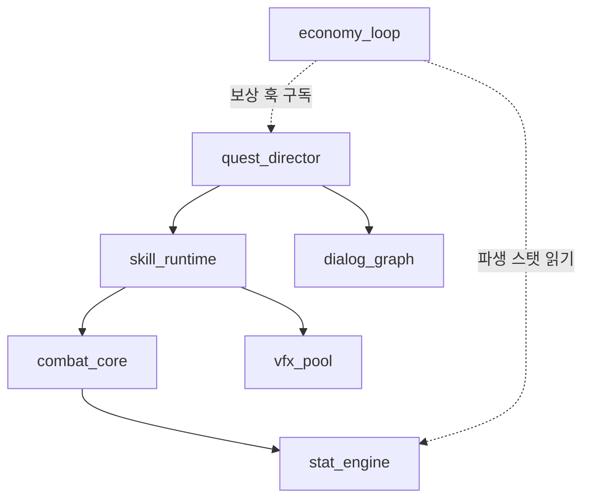
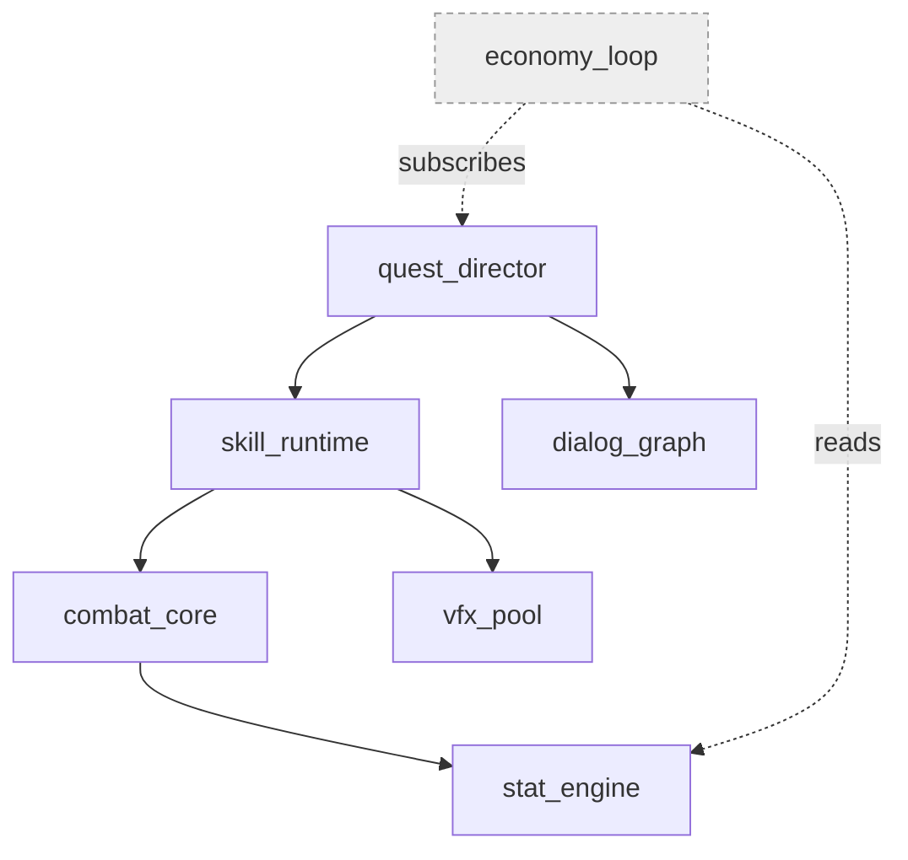
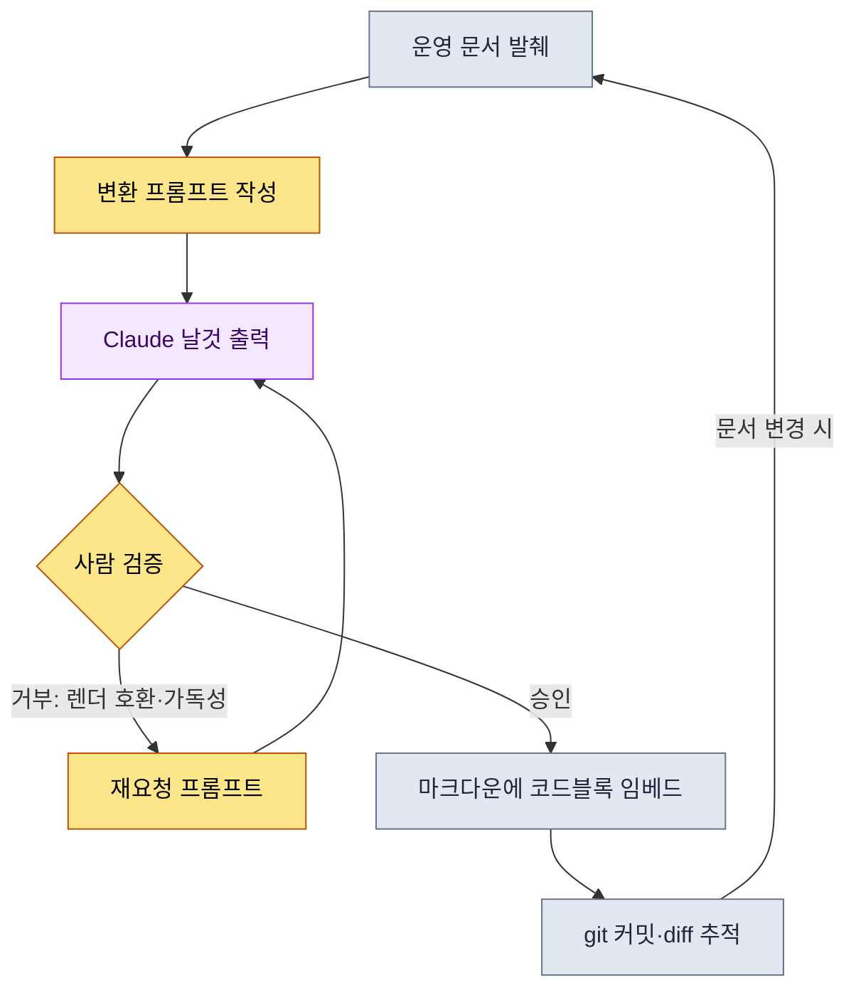
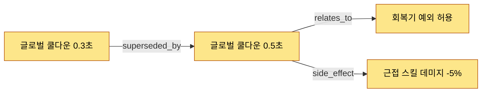

# 24.2 Mermaid 다이어그램 자동화 — 문서가 자기 그림을 그리게 하기

신입 기획자가 입사 사흘째에 물었다. "선배님, 이 시스템들이 서로 어떤 순서로 영향을 주는지 그림으로 정리된 게 어디 있나요?" 나는 머뭇거렸다. 그림은 있었다. 반년 전 누군가 화이트보드에 그린 사진이 위키 어딘가에 실려 있었다. 그런데 그 그림에는 지금은 사라진 시스템이 두 개 살아 있고, 그 뒤 추가된 핵심 루프 세 개가 빠져 있었다. 결국 나는 "그림은 믿지 말고 문서를 읽어라"라고 답했다. 부끄러운 답이었다. 그림이 문서와 어긋난 순간, 그림은 정보가 아니라 오정보가 된다.

이 챕터의 결론을 먼저 말하면 이렇다. 사람이 그린 다이어그램은 한두 달 안에 반드시 썩는다. 그러니 다이어그램을 그리는 일을 사람 손에서 떼어내, 문서 구조 자체가 자기 그림을 토해내게 만들어야 한다. 이 글은 그 과정을 한 번의 실제 작업 기록으로 보여준다. 문서를 입력으로 받아 Mermaid 코드를 생성하는 워크드 트랜스크립트를 통째로 싣고, 그렇게 뽑힌 다이어그램을 이 페이지에서 실제로 렌더한다. 기법을 설명하는 글이 그 기법의 산출물로 자기 자신을 증명하는 셈이다.

---

## 24.2.1 왜 하필 Mermaid인가

다이어그램 도구는 많다. draw.io, Figma, Visio, 화이트보드 사진까지. 이 도구들에는 공통된 함정이 하나 있다. 결과물이 그림 파일(이미지)이라는 점이다. 이미지는 git에서 한 줄 한 줄 변경을 추적할 수 없고, 텍스트를 다루는 LLM이 직접 생성하거나 수정할 수 없으며, 마크다운 문서 안에 코드로 실리지 않는다. 운영 관점에서 가장 치명적인 건 첫 번째다. 누가 언제 왜 바꿨는지 추적이 안 되는 그림은, 시간이 지나면 아무도 책임지지 않는 유물이 된다.

Mermaid는 이 세 가지를 한 번에 푼다. 다이어그램을 텍스트로 적고, 렌더는 뷰어가 알아서 한다. 텍스트이므로 `git diff`가 노드 하나 추가된 것까지 잡아낸다. 텍스트이므로 LLM이 읽고 쓴다. 텍스트이므로 마크다운 코드블록에 그대로 들어간다. 바로 이 챕터의 본문이 그 증거다. 지금 당신이 읽는 이 문장 아래에 곧 나올 다이어그램들은 전부 마크다운 안의 텍스트 블록이고, 책 빌드 과정에서 그림으로 렌더된다.

다만 오해는 막아야 한다. 모든 운영 자료를 다이어그램으로 만들 필요는 전혀 없다. 항목을 나열하는 일은 글머리표가 빠르고, 수치를 비교하는 일은 표가 빠르다. Mermaid가 이기는 자리는 딱 세 가지다. 관계(무엇이 무엇과 이어지는가), 흐름(무엇이 무엇 다음에 오는가), 시퀀스(누가 누구에게 언제 무엇을 보내는가). 이 세 가지가 아닌 자리에 억지로 다이어그램을 끼우면 오히려 인지 부담이 늘어난다.

---

## 24.2.2 척추: 문서 구조에서 다이어그램을 뽑아낸 한 번의 작업

여기서부터가 이 챕터의 등뼈다. 추상적인 설명 대신, 실제 문서 한 덩어리를 Mermaid로 바꾸는 과정을 처음부터 끝까지 보여준다. 입력은 프로젝트 A의 운영 문서 가운데 시스템 의존 구조를 적어둔 마크다운 조각이다(아래는 익명화한 실제 발췌).

````text
# 시스템 의존 메모 (운영 문서 발췌, 익명화)

- combat_core 는 stat_engine 에 의존한다
- skill_runtime 은 combat_core 에 의존한다
- skill_runtime 은 vfx_pool 에 의존한다
- quest_director 는 skill_runtime 에 의존한다
- quest_director 는 dialog_graph 에 의존한다
- economy_loop 은 quest_director 의 보상 훅을 구독한다
- economy_loop 은 stat_engine 의 파생 스탯을 읽는다
````

이걸 손으로 다이어그램으로 옮기면 노드 일곱 개에 화살표 일곱 개. 한 번은 그릴 수 있다. 문제는 다음 주에 `mail_box` 시스템이 추가되고 `dialog_graph`가 둘로 쪼개질 때다. 손그림은 그 순간부터 거짓말을 시작한다. 그래서 사람이 아니라 LLM에게 이 변환을 시킨다.

### 1단계 — 프롬프트 전문

아래는 내가 실제로 던진 프롬프트다. 한 글자도 다듬지 않고 그대로 싣는다.

````text
아래 시스템 의존 메모를 Mermaid graph(위→아래, graph TB)로 바꿔 줘. 규칙은:
1. 메모에 나온 시스템만 노드로, 새 시스템 추가 금지.
2. "A는 B에 의존"은 A --> B.
3. "구독"·"읽는다" 같은 약한 결합은 점선 -.->에 관계 이름 붙여서.
4. 노드 id는 메모의 영문 이름 그대로, 한글 라벨 붙이지 마.
코드 블록만, 설명·주석 빼고.

[메모]
- combat_core 는 stat_engine 에 의존한다
- skill_runtime 은 combat_core 에 의존한다
- skill_runtime 은 vfx_pool 에 의존한다
- quest_director 는 skill_runtime 에 의존한다
- quest_director 는 dialog_graph 에 의존한다
- economy_loop 은 quest_director 의 보상 훅을 구독한다
- economy_loop 은 stat_engine 의 파생 스탯을 읽는다
````

규칙 1과 4가 핵심이다. LLM에게 다이어그램을 맡길 때 가장 흔한 사고는 "친절한 환각"이다. 시키지도 않은 노드를 추가하고("로그인 시스템도 보통 있으니 넣었습니다"), 멋대로 한글 라벨을 붙여 ID와 본문 검색이 어긋나게 만든다. 규칙으로 그 친절을 차단한다.

### 2단계 — Claude의 날것 출력 (요약 없음)

다음은 모델이 처음 돌려준 응답이다. 정제하지 않고 그대로 옮긴다. 거기에는 작은 문제가 하나 섞여 있었고, 그 문제까지 포함해서 싣는다.

````text

````

문법은 멀쩡하고 노드도 정확히 일곱 개다. 새 시스템을 지어내지도 않았다. 규칙 1·4는 지켜졌다. 그런데 한 가지가 걸렸다. 점선 라벨에 한글이 들어가 있다(`보상 훅 구독`, `파생 스탯 읽기`). 이건 규칙 위반은 아니다. 규칙 3이 "관계 이름을 붙이라"고 했으니 모델은 충실히 따랐다. 다만 Mermaid에서 한글 라벨에 공백이 들어가면 일부 구버전 렌더러가 깨진다는 걸 나는 경험으로 알고 있었다. 모델은 그걸 알 도리가 없다.

### 3단계 — 사람의 검증과 거부

여기가 자동화에서 가장 자주 생략되지만 가장 중요한 단계다. 나는 출력을 그대로 받지 않고 거부했다. 거부 이유는 두 가지.

첫째, 점선 라벨의 한글 공백을 영문 토큰으로 바꿔 렌더 호환성을 확보해야 한다. 둘째, 약한 결합(점선)과 강한 결합(실선)이 한 그림에 섞여 있는데 색이나 스타일 구분이 없어 한눈에 안 들어온다. 이 두 가지를 들고 다시 요청했다.

### 4단계 — 재요청 프롬프트

````text
거의 좋다. 두 가지만 고쳐라.

1. 점선 화살표 라벨을 영문 단어 하나로 바꿔라(공백 없이). 
   "보상 훅 구독" -> subscribes, "파생 스탯 읽기" -> reads
   이유: 일부 렌더러가 한글+공백 엣지 라벨에서 깨진다.
2. 점선(약한 결합) 노드와 실선(강한 결합) 노드를 시각적으로 구분하기 위해,
   economy_loop 처럼 약한 결합만 가진 노드에 classDef 로 옅은 회색 스타일을 줘라.
3. 나머지는 그대로 둔다.
````

### 5단계 — 재요청에 대한 날것 출력

````text

````

이번엔 받아들였다. 라벨이 영문 단일 토큰으로 바뀌었고, `economy_loop`만 회색으로 떨어져 "이 시스템은 직접 의존이 아니라 구독·읽기로만 엮인 가장자리 시스템"이라는 정보가 색으로 전달된다. 프롬프트 한 줄도 안 건드리고 손으로 그렸다면, 나는 이 classDef를 떠올리지도 못했을 가능성이 높다.

### 척추의 산출물 — 이 자리에서 실제로 렌더된다

위 트랜스크립트의 최종 출력을, 손으로 베끼지 않고 코드 블록 그대로 이 책의 페이지에 싣는다. 책 빌드가 이걸 그림으로 그린다. 이것이 "자기 기법으로 자기를 증명한다"의 실물이다.


문서 발췌 한 덩어리가, 다섯 번의 주고받음을 거쳐, git에 들어가고 LLM이 갱신할 수 있고 이 페이지에 렌더되는 운영 자산이 됐다. 다음 주 `mail_box`가 추가되면 메모에 한 줄 적고 같은 프롬프트를 다시 던지면 된다. 사람이 펜을 들 일은 없다.

---

## 24.2.3 두 번째 도식: 이 자동화 파이프라인 자체를 그린다

앞의 다이어그램이 "변환의 결과"라면, 이번 것은 "변환의 과정"이다. 방금 다섯 단계로 진행한 워크드 절차를 흐름도로 만들었다. 이 다이어그램 역시 같은 방식으로 LLM에게 시켜 뽑았고, 같은 검증을 거쳤다. 그 결과를 그대로 싣는다.



이 흐름도가 말하는 한 가지가 있다. 점선이 아니라 굵은 화살표로 강조하고 싶은 건 가운데의 마름모, 곧 `사람 검증`이다. 자동화라는 단어에 취해 이 노드를 빼버리면, 1단계의 친절한 환각이 그대로 운영 문서에 실린다. 자동화는 사람을 그림 그리기에서 해방시키되, 판단에서 해방시키지는 않는다. 루프의 마지막 화살표(`문서 변경 시` → `운영 문서 발췌`)가 핵심이다. 이 되먹임 고리가 있어야 다이어그램이 일회성 자료가 아니라 문서와 함께 늙지 않고 같이 자라는 자산이 된다.

---

## 24.2.4 변환 스크립트: LLM 없이도 도는 결정론적 경로

LLM 변환은 유연하지만, 관계가 이미 정형 데이터로 존재하는 경우엔 굳이 모델을 부를 필요가 없다. 프로젝트 A의 결정 카드처럼 필드가 고정된 데이터는 작은 파이썬 스크립트가 더 빠르고 더 정직하다(환각이 원천적으로 불가능하다). 아래는 결정 카드 목록을 결정 그래프 Mermaid로 바꾸는 실제 스크립트의 핵심부다.

````python
# decision_graph_to_mermaid.py
# 결정 카드(정형 데이터) -> Mermaid graph 변환. LLM 불필요, 결정론적.

def to_mermaid(decisions):
    lines = ["graph LR"]
    # 1) 노드 선언: id와 제목을 그대로. 지어내지 않는다.
    for d in decisions:
        safe_title = d.title.replace('"', "'")   # 따옴표만 escape
        lines.append(f'    {d.id}["{safe_title}"]')
    # 2) 엣지: 관계 타입을 화살표 라벨로.
    for d in decisions:
        for rel in d.relations:
            lines.append(f'    {d.id} -->|{rel.type}| {rel.target}')
    return "\n".join(lines)
````

핵심은 두 단계로만 끝난다는 점이다. 노드를 선언하고, 엣지를 잇는다. 입력에 없는 노드는 출력에 절대 등장하지 않는다. 이 스크립트가 결정 카드 세 장을 받으면 아래 같은 그래프가 나온다.



결정 하나가 다른 결정으로 대체되고(superseded_by), 거기서 파생된 부작용(side_effect)까지 한 화살표로 보인다. 텍스트로 적힌 결정 로그 수십 줄을 다 읽지 않아도, 이 그래프 한 장이면 "왜 지금 쿨다운이 0.5초인가"의 역사가 5분 안에 잡힌다.

언제 LLM을 쓰고 언제 스크립트를 쓰는가. 기준은 단순하다. 입력이 정형 데이터(필드가 고정된 카드·시트)면 스크립트, 입력이 자유 텍스트(회의록·메모·대화)면 LLM. 정형 데이터에 LLM을 쓰면 불필요한 환각 위험만 떠안고, 자유 텍스트에 스크립트를 쓰면 파싱 규칙이 끝없이 늘어난다.

---

## 24.2.5 함정 네 가지와 처방

다이어그램 자동화를 운영하며 실제로 밟은 지뢰들이다.

첫째, 너무 복잡해지는 함정. 노드가 쉰 개를 넘으면 그림은 더 이상 인지를 돕지 않고 인지를 방해한다. 처방은 한 화면에 스무 개에서 서른 개 사이로 제한하고, 그보다 커지면 subgraph로 영역을 묶거나 아예 다이어그램을 둘로 쪼개는 것이다.

둘째, 갱신이 끊기는 함정. 이건 손그림에서만 생긴다고 생각하기 쉽지만, 자동화를 해놓고도 입력 문서를 안 고치면 똑같이 썩는다. 처방은 앞의 흐름도에 있던 되먹임 고리다. 입력 문서가 단일 진실의 원천(single source of truth)이 되도록 만들고, 다이어그램은 거기서 항상 다시 생성한다.

셋째, 너무 추상적인 함정. "시스템들이 대충 이렇게 엮여 있다" 수준의 그림은 예쁘지만 쓸모가 없다. 처방은 노드에 추상명사 대신 실제 ID(`skill_runtime`, `D_B`)를 입력하는 것이다. 본문 검색과 다이어그램이 같은 식별자를 공유해야 그림에서 코드로 곧장 점프할 수 있다.

넷째, 검수 없이 LLM 출력을 그대로 쓰는 함정. 척추의 3단계에서 보았듯, 모델은 규칙을 지키면서도 렌더가 깨지는 라벨을 만들 수 있다. 처방은 사람 검증 노드를 파이프라인에서 절대 빼지 않는 것이다.

---

## 24.2.6 효과 — 정직하게 말하는 변화

수치를 들고 싶은 유혹이 있지만, 여기서는 방향만 말한다. 아래 비교는 저자가 운영한 팀에서 체감한 변화이며, 정밀 측정값이 아니라 저자 추정(미검증)이다.

가장 또렷하게 달라진 건 신입의 시스템 이해 속도다. 입사 초기 며칠이 걸리던 "이 시스템들이 어떻게 엮였는가"의 파악이, 자동 생성된 의존 그래프 한 장 앞에서 한 시간 안팎으로 줄었다. 회의 자료 준비도 가벼워졌다. 예전에는 회의 전날 누군가 손으로 그림을 다시 그렸지만, 이제는 문서를 한 번 변환하면 끝난다. 무엇보다 다이어그램이 실제와 어긋났을 때 생기던 "이 그림 믿어도 되나요"라는 질문 자체가 거의 사라졌다. 입력 문서가 곧 그림이니, 문서가 맞으면 그림도 맞다.

반대로 솔직히 적자면, 자동화가 만능은 아니다. 정형화가 덜 된 초기 단계의 아이디어 스케치는 여전히 화이트보드가 빠르다. 자동화는 구조가 어느 정도 굳은 다음에 빛난다.

---

## 이 챕터의 핵심 메시지

- 사람이 그린 다이어그램은 반드시 썩으니, 그리는 일을 문서 구조에 떠넘긴다.
- 자유 텍스트는 LLM으로, 정형 데이터는 스크립트로 변환하되 검증은 사람이 한다.
- 다이어그램과 본문이 같은 ID를 공유해야 그림에서 코드로 점프한다.

---

## 따라하기

**setup.** 문서를 보관하는 마크다운 저장소 하나와, Mermaid를 렌더하는 뷰어(대부분의 마크다운 뷰어·git 호스팅에 내장)면 충분합니다. 변환 대상 문서에서 "관계·흐름·시퀀스"에 해당하는 조각을 하나 고르세요(예: 시스템 의존 메모).

**prompt.** 그 조각을 본문 척추의 1단계 프롬프트 틀에 끼워 LLM에 던지세요. 반드시 "메모에 없는 노드를 추가하지 마라" "ID는 원문 영문 이름 그대로 써라" 두 규칙을 넣습니다. 정형 데이터라면 LLM 대신 `decision_graph_to_mermaid.py` 같은 결정론적 스크립트로 변환하세요.

**verify.** 출력 코드블록을 마크다운에 붙여 실제로 렌더해 보세요. 세 가지를 확인합니다. (1) 입력에 없는 노드가 생기지 않았는가, (2) 엣지 라벨이 깨지지 않고 그려지는가, (3) 본문에서 쓰는 ID와 다이어그램 ID가 일치하는가. 하나라도 어긋나면 재요청 프롬프트로 거부하고 다시 받으세요. 통과하면 git에 커밋합니다 — 이제 변경은 diff로 추적됩니다.

### 1인 축소판

팀도 스크립트도 없는 1인 작업자라면 이렇게 줄이세요. 노트 앱에 시스템·할 일·아이디어 사이의 관계를 "A는 B에 의존한다" 형식의 글머리표로 적어 둡니다. 일주일에 한 번, 그 목록을 통째로 복사해 "이걸 Mermaid graph TB로 바꿔줘, 목록에 없는 노드는 추가하지 마"라고 한 줄 던지세요. 돌려받은 코드블록을 노트 맨 위에 붙입니다. 끝입니다. 손으로 그리지 않으니 갱신 부담이 없고, 입력 목록만 살아 있으면 그림은 언제나 최신입니다.
