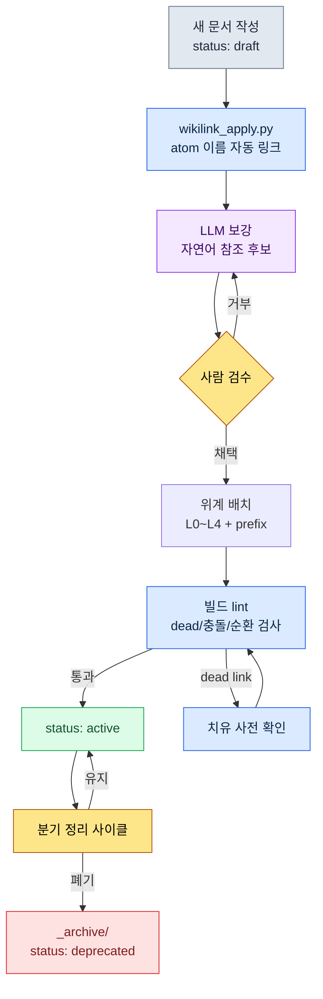

# 24.3 Wikilink와 문서 위계 — 연결과 분류, 검색의 두 입구

> 연결(wikilink)과 분류(위계)는 같은 문제의 두 입구다. 한쪽이 "이 결정이 어디로 이어지나"를 답하고, 다른 쪽이 "이 문서가 어디에 사는가"를 답한다.

신규 합류한 기획자가 둘째 날 아침에 물었다. "전투 글로벌 쿨다운 값이 0.5초인 게 맞나요? 어느 문서에 근거가 있죠?" 나는 답하지 못했다. 분명 어딘가에 결정 기록이 있는데, 그게 전투 룰북인지 회의록인지 분기 보고서인지 기억나지 않았다. 셋이 달라붙어 전체 폴더를 grep으로 뒤졌다. 같은 숫자가 여섯 군데서 나왔고, 그중 어느 것이 "원본 결정"이고 어느 것이 "참조 복사"인지 구분이 안 됐다. 40분을 썼다. 결국 찾아낸 건 회의록 안에 묻혀 있던 한 줄이었다.

그날 저녁 나는 두 가지가 없었다는 걸 깨달았다. 첫째, 문서들 사이의 **명시적 연결**이 없었다. 같은 숫자가 여섯 군데 있어도 "이건 저기서 인용한 것"이라는 끈이 어디에도 적혀 있지 않았다. 둘째, 문서가 사는 **위계**가 없었다. 결정 기록이 룰북·회의록·보고서에 흩어진 채 "결정은 여기 산다"는 약속이 없었다.

이 두 가지가 이 챕터의 주제다. wikilink는 연결을 텍스트로 적고, 위계는 분류를 폴더로 약속한다. 둘은 분리된 기법처럼 보이지만 실은 검색이라는 한 문제의 양면이다.

---

## 24.3.1 연결이 없을 때 무엇이 무너지는가

문서가 30건일 때는 머리로 다 기억한다. 100건을 넘으면 사람의 기억이 인덱스 역할을 못 한다. 그때 의존할 수 있는 건 둘 중 하나다. 전체를 grep으로 훑거나(느리고 부정확), 문서 안에 적힌 명시적 연결을 따라가거나(빠르고 정확).

grep이 부정확한 이유는 단순하다. `combat_global_cooldown_constant`라는 문자열을 검색하면, 그 값을 **결정한** 문서와 그 값을 **언급만 한** 문서가 똑같이 잡힌다. 어느 게 원본인지 grep은 모른다. 반면 문서 안에 `[[combat_global_cooldown_constant]]`라는 이중 대괄호 표기를 약속해 두면, "이건 그 atom을 의도적으로 참조한다"는 신호가 문자열 자체에 남는다. `\[\[combat_global_cooldown` 패턴으로 좁히면 우연한 언급은 빠지고 의도된 참조만 남는다.

이 한 줄짜리 표기 약속이 그래프의 한 변(edge)이 된다. 문서 A가 `[[atom_X]]`를 적으면 A→X 방향의 간선이 생긴다. 문서 200건이 각자 몇 개씩 적으면, 누가 그리지 않아도 그래프가 텍스트 안에 누적된다.

아래는 우리 프로젝트의 atom·결정·문서가 wikilink로 묶인 모습의 한 조각이다. 노드 색은 종류를, 화살표는 참조 방향을 나타낸다.

<svg viewBox="0 0 720 360" xmlns="http://www.w3.org/2000/svg" font-family="sans-serif" font-size="12">
  <defs>
    <marker id="arrow" markerWidth="9" markerHeight="9" refX="8" refY="3" orient="auto" markerUnits="strokeWidth">
      <path d="M0,0 L8,3 L0,6 Z" fill="#555"/>
    </marker>
  </defs>
  <!-- edges -->
  <g stroke="#888" stroke-width="1.4" marker-end="url(#arrow)" fill="none">
    <line x1="180" y1="80" x2="350" y2="150"/>
    <line x1="180" y1="240" x2="350" y2="160"/>
    <line x1="430" y1="150" x2="560" y2="90"/>
    <line x1="430" y1="170" x2="560" y2="240"/>
    <line x1="180" y1="80" x2="180" y2="220"/>
  </g>
  <!-- doc nodes (blue) -->
  <g>
    <rect x="90" y="58" width="180" height="44" rx="6" fill="#dbeafe" stroke="#2563eb"/>
    <text x="180" y="84" text-anchor="middle" fill="#1e3a8a">[[CombatFormula_v3]]</text>
    <rect x="90" y="218" width="180" height="44" rx="6" fill="#dbeafe" stroke="#2563eb"/>
    <text x="180" y="244" text-anchor="middle" fill="#1e3a8a">[[Meeting_W21]]</text>
  </g>
  <!-- atom node (green) -->
  <g>
    <rect x="350" y="134" width="180" height="48" rx="6" fill="#dcfce7" stroke="#16a34a"/>
    <text x="440" y="155" text-anchor="middle" fill="#14532d">[[combat_global_</text>
    <text x="440" y="171" text-anchor="middle" fill="#14532d">cooldown_constant]]</text>
  </g>
  <!-- decision nodes (amber) -->
  <g>
    <rect x="560" y="68" width="150" height="44" rx="6" fill="#fef3c7" stroke="#d97706"/>
    <text x="635" y="94" text-anchor="middle" fill="#92400e">[[D2026_Q2_017]]</text>
    <rect x="560" y="218" width="150" height="44" rx="6" fill="#fef3c7" stroke="#d97706"/>
    <text x="635" y="244" text-anchor="middle" fill="#92400e">[[D2026_Q2_018]]</text>
  </g>
  <!-- legend -->
  <g font-size="11">
    <rect x="90" y="312" width="14" height="14" fill="#dbeafe" stroke="#2563eb"/>
    <text x="110" y="324" fill="#333">문서</text>
    <rect x="170" y="312" width="14" height="14" fill="#dcfce7" stroke="#16a34a"/>
    <text x="190" y="324" fill="#333">atom</text>
    <rect x="250" y="312" width="14" height="14" fill="#fef3c7" stroke="#d97706"/>
    <text x="270" y="324" fill="#333">결정</text>
  </g>
</svg>

이 작은 조각이 보여주는 건, 신규 기획자의 질문에 대한 답이 그래프 안에 이미 있었다는 사실이다. `combat_global_cooldown_constant` atom으로 들어오는 화살표를 거꾸로 따라가면 결정 `D2026_Q2_017`이 나온다. 40분이 아니라 한 번의 역참조였다.

---

## 24.3.2 표기 약속 — 네 종류, 한 양식

우리는 wikilink로 묶을 대상을 네 종류로만 정했다. 종류를 늘리면 양식이 흔들리고, 양식이 흔들리면 grep이 다시 부정확해진다.

- **atom 참조** — `[[combat_global_cooldown_constant]]`. 1문서 1결정 단위인 atom을 가리킨다.
- **결정 참조** — `[[D2026_Q2_017]]`. 분기·번호로 식별되는 의사결정 기록.
- **문서 참조** — `[[CombatFormula_v3]]`. 룰북·명세 등 큰 문서.
- **사람 참조** — `[[팀원 A]]`. 담당자·결정자.

네 종류 모두 `[[name]]` 한 양식이다. name은 글로벌하게 유일해야 한다. atom 이름이 두 곳에서 충돌하면 그래프의 같은 노드로 합쳐져 버려, "전투의 cooldown"과 "UI의 cooldown"이 한 노드가 되는 사고가 난다. 그래서 atom 명명 규칙에서 분야 prefix(`combat_`, `ui_`)를 강제한다.

---

## 24.3.3 wikilink_apply.py — 적용과 치유

표기 약속만으로는 부족하다. 200건 문서에 사람이 일일이 대괄호를 다는 건 비현실적이고, 한 번 달아도 atom 이름이 바뀌면 전부 깨진다. 그래서 두 가지 일을 하는 스크립트를 운영한다. 첫째는 **적용**(apply) — 본문에 등장하는 알려진 atom 이름을 wikilink로 자동 변환. 둘째는 **치유**(heal) — 이름이 바뀌었거나 깨진 링크를 찾아 갱신·보고.

`wikilink_apply.py`의 핵심부는 이렇게 생겼다.

```python
# wikilink_apply.py — 본문 atom 이름을 [[wikilink]]로 적용하고, 깨진 링크를 치유한다
import re
from pathlib import Path

WIKILINK = re.compile(r"\[\[([A-Za-z0-9_]+)\]\]")
# 이미 링크가 아닌, 맨몸으로 등장하는 atom 이름만 잡는다 (앞에 [[ 가 없는 경우)
BARE_NAME = lambda name: re.compile(rf"(?<!\[\[)(?<![A-Za-z0-9_])({re.escape(name)})(?![A-Za-z0-9_])(?!\]\])")

def load_known_atoms(registry: Path) -> set[str]:
    # _atom_registry.tsv: 첫 칼럼이 현재 유효한 atom name
    return {ln.split("\t")[0].strip()
            for ln in registry.read_text(encoding="utf-8").splitlines()
            if ln.strip() and not ln.startswith("#")}

def apply_links(text: str, known: set[str]) -> tuple[str, int]:
    applied = 0
    for name in sorted(known, key=len, reverse=True):  # 긴 이름 우선: 부분일치 오염 방지
        text, n = BARE_NAME(name).subn(rf"[[{name}]]", text)
        applied += n
    return text, applied

def heal_links(text: str, known: set[str], aliases: dict[str, str]) -> tuple[str, list[str]]:
    dead = []
    def repl(m):
        ref = m.group(1)
        if ref in known:
            return m.group(0)              # 살아있음 → 그대로
        if ref in aliases:                  # 개명된 atom → 새 이름으로 치유
            return f"[[{aliases[ref]}]]"
        dead.append(ref)                    # 진짜 dead link → 보고
        return m.group(0)
    return WIKILINK.sub(repl, text), dead
```

여기서 두 가지 설계 선택이 본문의 척추다.

첫째, `apply_links`는 **긴 이름을 먼저** 치환한다. `combat_cooldown`과 `combat_cooldown_global` 두 atom이 있을 때, 짧은 쪽을 먼저 치환하면 긴 쪽의 앞부분이 오염된다. 길이 내림차순 정렬 한 줄이 이 사고를 막는다. 이건 처음 짤 때 내가 빠뜨렸던 부분이고, 실제로 `[[combat_cooldown]]_global`이라는 깨진 결과가 나오고서야 추가했다.

둘째, `heal_links`는 **개명 사전**(aliases)을 거쳐 치유한다. atom 이름이 `combat_gcd` → `combat_global_cooldown_constant`로 바뀌면, 옛 이름을 새 이름으로 자동 교체하고, 사전에도 없으면 그제야 dead link로 보고한다. 이름이 바뀔 때마다 200건을 손으로 고치는 대신, alias 한 줄을 추가한다.

---

## 24.3.4 워크드 트랜스크립트 — Claude에게 wikilink 보강을 맡기다

자동 apply는 "이미 알려진 atom 이름"만 링크한다. 하지만 본문에 atom 이름을 안 쓰고 풀어 쓴 문장("전투의 글로벌 쿨다운은 0.5초다")은 잡지 못한다. 이런 자연어 참조를 wikilink 후보로 바꾸는 건 LLM이 사람보다 빠르다. 아래는 실제로 주고받은 전문이다. 출력은 요약하지 않았고, 내가 거부한 부분도 그대로 남긴다.

**내 프롬프트 (전문):**

```
전투 룰북 한 단락이랑 등록된 atom 목록을 줄게. 본문에서 이 atom들을 가리키는
자연어 표현을 찾아 [[wikilink]] 후보를 표로 제안해 줘. 확실할 때만, 애매하면
"애매"로 표시만 하고. 본문은 다시 쓰지 말고 어느 구절을 어떤 링크로 바꿀지만.
등록 안 된 개념은 "신규 atom 후보"로 따로 빼 줘.

[등록된 atom]
combat_global_cooldown_constant
combat_skill_cast_interrupt_rule
combat_resource_regen_rate

[본문]
전투의 글로벌 쿨다운은 0.5초이며, 모든 액티브 스킬에 공통 적용된다.
시전 중 피격되면 시전이 끊긴다. 단, 회복 계열 스킬은 예외다.
자원 재생은 비전투 상태에서만 정상 속도로 돌아간다.
```

**Claude 출력 (날것 그대로):**

```
제안 wikilink:

| 본문 구절                         | 후보 링크                               | 확신 |
|----------------------------------|----------------------------------------|------|
| "전투의 글로벌 쿨다운은 0.5초"     | [[combat_global_cooldown_constant]]    | 높음 |
| "시전 중 피격되면 시전이 끊긴다"   | [[combat_skill_cast_interrupt_rule]]   | 높음 |
| "자원 재생은 비전투 상태에서만"    | [[combat_resource_regen_rate]]         | 중간 |

신규 atom 후보:
- "회복 계열 스킬은 예외다" → 이 예외 규칙은 등록된 atom 중 어디에도
  명시돼 있지 않습니다. combat_skill_cast_interrupt_heal_exception 같은
  별도 atom이 필요해 보입니다. (애매: interrupt_rule의 하위 조항일 수도
  있어 단독 atom인지 판단 못 함)

주의: "자원 재생" 줄은 combat_resource_regen_rate가 '재생 속도'를
가리키는지 '비전투 조건'을 가리키는지 atom 정의를 못 봐서 확신 중간입니다.
```

**내 검증과 거부:**

세 줄 중 두 줄은 받아들였다. 글로벌 쿨다운과 시전 중단은 atom 정의와 정확히 일치했다. 세 번째 "자원 재생" 줄은 Claude가 스스로 확신을 "중간"으로 낮춘 게 옳았다 — `combat_resource_regen_rate` atom은 **속도 값**만 정의하고, "비전투 상태에서만"이라는 **조건**은 다른 atom 소관이었다. 그대로 링크를 걸면 "조건"을 "속도" atom에 잘못 연결하는 사고가 난다. **거부했다.**

신규 atom 후보 지적은 정확했다. "회복 계열 예외"는 정말로 어디에도 atom이 없었다. 다만 Claude가 애매하다고 한 부분("interrupt_rule의 하위 조항인가 단독 atom인가")은 사람이 판단할 영역이었고, 나는 단독 atom으로 분리하기로 했다.

**재요청:**

```
"자원 재생" 줄은 링크하지 마세요. 대신 [[combat_resource_regen_rate]]는
'속도'만, '비전투 조건'은 신규 atom으로 분리합니다. 두 atom의 1줄 정의를
각각 써 주세요. 회복 예외도 단독 atom으로 1줄 정의해 주세요.
```

이 왕복에서 LLM이 한 일은 "0에서 후보 만들기"가 아니라 "후보를 골라 주기"였다. 핵심은, **사람이 거부할 자리가 분명히 있었다**는 것이다. 자동 발행이었다면 잘못된 링크 한 개가 그래프에 영구히 남았을 것이다.

---

## 24.3.5 lint — 깨진 연결을 빌드에서 막는다

링크는 시간이 지나면 깨진다. atom이 폐기되고, 이름이 바뀌고, 오타가 들어간다. 그래서 빌드마다 wikilink lint를 돌린다. 검사 항목과 처리는 이렇다.

- **dead link** — `[[name]]`의 name이 레지스트리에 없음 → 빌드 경고, 치유 사전 확인
- **양식 위반** — snake_case·prefix 규칙 위반 → 차단
- **이름 충돌** — 같은 name이 두 atom에 → 차단 (글로벌 유일성 깨짐)
- **순환 참조** — A→B→A → 경고 (의도된 경우 허용 목록)
- **과참조** — 한 문서가 같은 atom을 10회 이상 → 경고 (노이즈 의심)

dead link만 차단이 아니라 경고로 둔 건 의도다. atom을 개명하는 중간 상태에서는 잠깐 dead가 생기는데, 이걸 빌드 실패로 막으면 작업이 멈춘다. 대신 치유 사전을 먼저 확인하게 한다. 양식 위반과 이름 충돌은 즉시 차단한다 — 이 둘은 그래프 전체를 오염시키기 때문이다.

> 이 lint는 자기 증명적이다. wikilink_apply.py가 만든 링크를 같은 시스템의 lint가 검사하고, 그 결과를 또 다른 atom 결정으로 남긴다. 도구가 자기 산출물을 자기 기준으로 검증하는 고리가 운영의 기본 골격이다.

---

## 24.3.6 분류 — 문서가 사는 위계

여기까지가 연결이다. 이제 분류다. wikilink가 "이 결정이 어디로 이어지나"를 답한다면, 위계는 "이 문서가 어디에 사는가"를 답한다. 둘 다 없으면 신규 기획자의 40분 검색이 반복된다.

우리 문서 폴더는 네 계층이다. 이 계층은 정보 아키텍처의 Layer 통합과 같은 골격을 공유한다 — 비전·시스템·콘텐츠·메타가 각각 한 층이다.

```
docs/
├── L0_vision/              비전 (5건 이하, 거의 안 바뀜)
├── L1_systems/             분야별 룰북
│   ├── combat/
│   ├── narrative/
│   └── ui/
├── L2_content/             개별 콘텐츠
│   ├── characters/
│   └── quests/
└── L4_meta/                운영·결정·회의·원자
    ├── decisions/
    ├── meetings/
    ├── reports/
    └── atoms/
```

L3가 비어 있는 건 데이터 시트·DB가 그 자리를 차지하기 때문이다(문서가 아니라 테이블). 신규 기획자가 찾던 결정은 `L4_meta/decisions/`에 산다 — 이 약속 하나만 있어도, 40분 검색은 "결정은 거기 있다"는 한 문장으로 끝났을 것이다.

위계가 검색 입구로 작동하려면 다섯 가지가 같이 지켜져야 한다. 어느 하나만 빠져도 분류가 무너진다.

1. **의미순 분류, 시간순 금지.** `combat/`·`narrative/`는 검색되지만 `2026-Q1/`·`2026-Q2/`는 6개월 뒤 아무도 안 연다. 시간은 git이 기록하니 폴더로 또 나눌 이유가 없다.
2. **깊이 4 이하.** `L1_systems/combat/skills/active/single_target/attack.md`는 5단계다. 경로가 한 화면을 넘으면 사람이 위치를 머리에 못 담는다.
3. **파일명 prefix.** `spec_`·`report_`·`decision_`·`char_`로 종류를 파일명에 넣는다. 폴더를 안 봐도 종류가 보인다.
4. **폴더마다 README.** 각 폴더의 정의·내용·명명 규칙을 README가 적는다. 신규 합류자의 첫 입구다.
5. **`_` prefix 메타 폴더.** `_archive/`·`_TEMPLATES/`·`_NAMING/`은 자동 정렬에서 위로 올라오고, 본 콘텐츠와 섞이지 않는다.

문서는 한 자리에 머물지 않는다. 작성 중에는 본 폴더에 `status: draft`로 살고, 활성화되면 `status: active`가 되며, 폐기되면 **삭제가 아니라** `_archive/`로 옮겨 `status: deprecated`를 단다. 폐기 자료를 삭제하지 않는 건 철칙이다. 6개월 뒤 누군가 "그 결정 왜 뒤집었지?"를 물을 때, 답은 폐기 자료 안에만 있다. 삭제했다면 결정의 근거를 사후에 다시 잡을 방법이 없다.

큰 변경은 git에만 맡기지 않고 frontmatter에 change_log로 남긴다.

```yaml
---
title: combat_global_cooldown_rule
version: v3
last_modifier: teammate_a
change_log:
  - v1 (2025): 초안
  - v2 (2025): cooldown 0.3 → 0.5  ([[D2026_Q2_017]])
  - v3 (2026): 회복 예외 추가      ([[D2026_Q2_018]])
---
```

change_log의 결정 ID가 wikilink로 적혀 있다는 점을 보라. 여기서 연결과 분류가 만난다. 문서는 위계 안 한 자리에 살지만(분류), 그 변경 이력은 결정 그래프로 이어진다(연결). 한 frontmatter가 두 입구를 동시에 연다.

---

## 24.3.7 분기마다 한 번, 정리 사이클

위계는 가만두면 썩는다. 빈 폴더가 생기고, 6개월 묵은 draft가 쌓이고, 깊이가 슬금슬금 늘어난다. 그래서 분기에 한 번 정리한다. 빈 폴더는 삭제하고, 6개월 넘은 draft는 활성/폐기를 결정하고, 깊이 5 이상은 평탄화하고, README 없는 폴더는 작성하거나 폐기하고, `_archive`가 절반을 넘으면 압축 보존한다. 이 사이클이 없으면 위계가 노이즈로 차서 신호와 잡음의 구분이 사라진다.

전체 흐름을 한 그림으로 보면 이렇다. 문서가 들어와서 연결되고, 분류되고, 검증되고, 폐기되기까지가 하나의 고리다.



이 고리에서 연결(B·C·D·F)과 분류(E·I·J)가 번갈아 작동한다. 둘은 따로 도는 게 아니라 한 문서의 생애 안에서 맞물린다.

---

## 24.3.8 효과 — 무엇이 어떻게 바뀌었나

수치는 저자의 프로젝트에서 도입 전후를 비교한 **방향성**이다. 정밀 측정값이 아니라, 같은 작업을 두 환경에서 했을 때 체감한 차이의 크기다(저자 관찰, 미정밀계측).

연결·위계가 자리 잡기 전, 신규 기획자의 결정 추적 질문은 도입부의 40분 사례처럼 길게는 한두 시간이 걸렸다. 도입 후엔 atom 역참조 한 번 — 분 단위다. 문서 검색은 5\~10분에서 30초 안팎으로 줄었는데, 이건 위계의 의미순 분류와 prefix가 같이 작동한 결과다. 잘못된 인용으로 인한 사고(이미 폐기된 값을 현행으로 착각하는 류)는 분기당 여러 건에서 한두 건으로 줄었다 — wikilink가 "이건 그 atom을 참조한다"를 명시하니, 복사된 값과 원본 값이 더는 헷갈리지 않았다.

가장 컸던 변화는 **신규 합류자의 적응**이다. 위계 없이는 어느 폴더에 뭐가 있는지 익히는 데 며칠이 걸렸고, 연결 없이는 시스템이 서로 어떻게 얽히는지 파악할 길이 없었다. 둘이 갖춰진 뒤로는 폴더 README로 위치를 익히고, wikilink 그래프를 따라 시스템 간 관계를 스스로 탐색했다. "물어봐야만 알 수 있는 것"이 "따라가면 보이는 것"으로 바뀌었다.

이 효과는 두 입구가 **함께** 있을 때만 나온다. 연결만 있고 분류가 없으면 그래프는 있는데 문서가 어디 사는지 모르고, 분류만 있고 연결이 없으면 폴더는 깔끔한데 결정이 어디로 이어지는지 모른다.

---

## 24.3.9 흔한 실패와 처방

연결 쪽에서 가장 흔한 실패는 **노이즈 링크**다. wikilink가 좋다고 모든 명사에 대괄호를 달면, 그래프가 의미 없는 간선으로 가득 차 시각화 도구가 무력해진다. "이 문서가 저 문서와 어떤 관계인가"를 묻고 답할 수 있는 링크만 남기는 게 원칙이다. 그다음은 **자동 발행** — LLM이 만든 링크를 검수 없이 커밋하면, 워크드 트랜스크립트의 "자원 재생" 줄 같은 잘못된 연결이 영구히 남는다. apply는 자동, 발행은 사람이다.

분류 쪽의 실패는 대부분 다섯 원칙의 위반이다. 시간순 폴더, 깊이 5 이상, 파일명 무규칙, README 부재. 그리고 가장 돌이키기 어려운 것 — **폐기 자료 삭제**. 삭제된 결정의 근거는 다시 만들 수 없다. `_archive`로 보내는 한 줄이 6개월 뒤의 학습 자료를 지킨다.

---

### 이 챕터의 핵심 메시지

- 연결과 분류는 검색의 두 입구이고, 한쪽만으로는 신규 합류자의 40분 검색이 반복된다.
- wikilink는 atom 이름을 자동 적용하되 LLM 후보는 사람이 거부할 자리를 남겨야 안전하다.
- 폐기 자료는 삭제가 아니라 `_archive`로 보존해야 결정의 근거가 사후에 살아남는다.

---

## 따라하기 — wikilink + 위계 최소 도입

**setup.** 문서 폴더에 `L0_vision/` `L1_systems/` `L2_content/` `L4_meta/` 네 폴더를 만들고, 각 폴더에 한 줄짜리 README를 두세요. atom 이름 목록을 `_atom_registry.tsv` 한 파일에 모읍니다(첫 칼럼 = atom name).

**prompt.** 본문 한 단락과 등록된 atom 목록을 LLM에 주고 이렇게 요청하세요 — "본문에서 이 atom들을 가리키는 자연어 표현을 찾아 `[[wikilink]]` 후보를 표로 제안하라. 확실할 때만 제안하고, 애매하면 '애매'로 표시만 하라. 본문은 다시 쓰지 말 것. 등록 안 된 개념은 '신규 atom 후보'로 분리하라."

**verify.** 제안된 링크마다 atom 정의와 대조하세요. atom이 가리키는 대상과 본문이 가리키는 대상이 **정확히** 같을 때만 채택하고, 조건/속성/예외가 어긋나면 거부합니다. 채택 후 `grep "\[\[name\]\]"`로 링크가 실제 입력됐는지, dead link가 없는지 확인하세요.

**1인 축소판.** 스크립트도 lint도 없이 시작하려면, 규칙 두 줄이면 됩니다. (1) 결정은 무조건 `decisions/` 한 폴더에 `decision_*.md`로 둡니다. (2) 다른 문서가 그 결정을 언급할 때는 `[[decision_id]]`라 적습니다. 이 두 줄만 지켜도, "그 결정 어디 있죠?"라는 질문에 `grep "\[\[decision_"` 한 번으로 답할 수 있습니다. 도구는 문서가 100건을 넘은 뒤에 들여도 늦지 않습니다.
