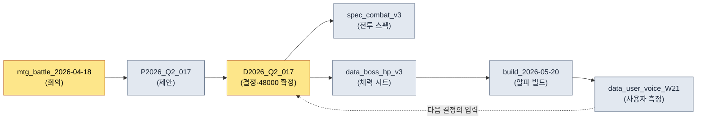

# 24.4 출처 추적·data lineage

> 자료를 의심하는 순간은 늘 너무 늦게 온다. 라이브 빌드에 잘못된 수치가 입력된 다음에야 "이거 어디서 나온 거지"를 묻게 된다.

---

알파 빌드 직전 금요일 저녁, 팀원 B가 내 자리로 왔다. 손에는 전투 밸런스 스프레드시트가 띄워진 노트북이 있었다. "디렉터님, 보스 1페이즈 체력이 시트에는 48,000인데 빌드에 들어간 값은 52,000이에요. 둘 중 뭐가 맞아요?"

나는 모른다. 정확히 말하면 — 그 자리에서는 누구도 모른다. 시트의 52,000이 며칠 전 회의 결정을 반영한 최신값일 수도 있고, 누군가 검증 안 된 값을 임시로 넣어둔 것일 수도 있다. 48,000은 그 회의 이전의 합의값일 수도 있다. 두 숫자 모두 그럴듯하다. 그럴듯함은 근거가 아니다.

이 질문에 답하려면 출처로 거슬러 올라가야 한다. 어느 회의에서 결정됐는가, 그 회의의 입력은 무엇이었는가, 누가 시트에 옮겼는가. 그런데 그 추적의 사슬이 사람의 기억 속에만 있으면, 답은 "내일 팀원 A한테 물어볼게요"가 된다. 라이브 운영 6개월 차에는 그런 미해결 질문이 산처럼 쌓인다. data lineage — 자료의 계보 — 는 그 산이 생기지 않게 하는 인프라다.

핵심은 하나다. 출처는 손으로 적으면 안 된다. 사람이 사후에 보강하는 출처 기록은 한 달을 못 간다. 자료가 만들어지는 그 순간 자동으로 기록되는 출처만이 살아남는다.

---

## 24.4.1 출처가 끊긴 자료의 다섯 가지 비용

`_source_map.tsv` 한 줄을 자동으로 기록하는 비용은 수 밀리초다. 그 한 줄이 없을 때 치르는 비용은 다섯 갈래로 번진다.

<svg viewBox="0 0 720 300" xmlns="http://www.w3.org/2000/svg" font-family="sans-serif">
  <rect x="280" y="120" width="160" height="60" rx="8" fill="#1f2933" stroke="#0b3d2e"/>
  <text x="360" y="148" fill="#ffffff" font-size="15" text-anchor="middle">출처 끊김</text>
  <text x="360" y="168" fill="#9fb3c8" font-size="12" text-anchor="middle">(source 미기록)</text>

  <rect x="20" y="20" width="170" height="44" rx="6" fill="#e8f0fe" stroke="#1967d2"/>
  <text x="105" y="40" fill="#1a1a1a" font-size="12.5" text-anchor="middle">검증 불가</text>
  <text x="105" y="56" fill="#5f6368" font-size="11" text-anchor="middle">"이 수치 어디서?"</text>

  <rect x="530" y="20" width="170" height="44" rx="6" fill="#e8f0fe" stroke="#1967d2"/>
  <text x="615" y="40" fill="#1a1a1a" font-size="12.5" text-anchor="middle">변경 누락</text>
  <text x="615" y="56" fill="#5f6368" font-size="11" text-anchor="middle">원본 갱신→파생 방치</text>

  <rect x="20" y="236" width="170" height="44" rx="6" fill="#fce8e6" stroke="#c5221f"/>
  <text x="105" y="256" fill="#1a1a1a" font-size="12.5" text-anchor="middle">법무 노출</text>
  <text x="105" y="272" fill="#5f6368" font-size="11" text-anchor="middle">외부 자산 근거 소실</text>

  <rect x="530" y="236" width="170" height="44" rx="6" fill="#fce8e6" stroke="#c5221f"/>
  <text x="615" y="256" fill="#1a1a1a" font-size="12.5" text-anchor="middle">사고 진단 지연</text>
  <text x="615" y="272" fill="#5f6368" font-size="11" text-anchor="middle">잘못된 값 역추적 불가</text>

  <rect x="275" y="236" width="170" height="44" rx="6" fill="#fef7e0" stroke="#f29900"/>
  <text x="360" y="256" fill="#1a1a1a" font-size="12.5" text-anchor="middle">인수인계 손실</text>
  <text x="360" y="272" fill="#5f6368" font-size="11" text-anchor="middle">"왜 이 결정?" 답 없음</text>

  <line x1="280" y1="135" x2="190" y2="55" stroke="#5f6368" stroke-width="1.5"/>
  <line x1="440" y1="135" x2="530" y2="55" stroke="#5f6368" stroke-width="1.5"/>
  <line x1="280" y1="165" x2="190" y2="245" stroke="#c5221f" stroke-width="1.5"/>
  <line x1="440" y1="165" x2="530" y2="245" stroke="#c5221f" stroke-width="1.5"/>
  <line x1="360" y1="180" x2="360" y2="236" stroke="#f29900" stroke-width="1.5"/>
</svg>

다섯 비용 중 어느 하나도 자료를 만든 그 순간에는 보이지 않는다는 점이 함정이다. 전부 몇 주 뒤, 몇 달 뒤, 사람이 바뀐 뒤에 청구서가 날아온다. 그래서 출처는 "나중에 정리하자"의 대상이 될 수 없다. 만드는 순간에 기록되어야 한다.

---

## 24.4.2 _source_map.tsv — 출처 매핑의 표준 골격

프로젝트 A에서 운영하는 출처 매핑 파일은 `_source_map.tsv` 하나다. 탭 구분 텍스트인 이유는 단순하다. 사람이 한 줄을 눈으로 읽을 수 있고, 스크립트가 `split('\t')` 한 번으로 파싱하며, git diff가 한 줄 변경을 깔끔하게 보여준다. CSV는 본문 안에 쉼표가 섞이면 깨지고, JSON은 한 줄을 사람이 읽기 어렵다.

```tsv
asset_id	source_type	source	created	creator	notes
spec_combat_v3	internal	mtg_battle_2026-04-18	2026-04-18	teammate_a	decision_D2026_Q2_017 근거
data_boss_hp_v3	internal	decision_D2026_Q2_017	2026-04-18	teammate_b	1페이즈 48000 확정
asset_K_001_concept	internal_ai_assisted	imagegen + teammate_b 정비	2026-04-20	teammate_b	legal_review 완료
data_user_voice_W21	external_aggregated	forum + community + sns	2026-05-25	auto_collect	13.1 파이프라인 산출
ref_visual_tone_a	external_reference	refgame (2024)	2026-04-15	teammate_c	비주얼 톤 참고, 직접 차용 없음
```

여섯 칸의 역할이 명확하다. `asset_id`는 자료의 고유 키, `source_type`은 분류(아래에서 다룸), `source`는 출처의 위치 — 회의 ID·결정 ID·수집 파이프라인·외부 작품명, `created`/`creator`는 언제·누가, `notes`는 사람이 읽을 한 줄 맥락.

여기서 둘째 줄과 셋째 줄을 다시 보면, 앞 절의 팀원 B 질문에 답이 보인다. `data_boss_hp_v3`의 출처는 `decision_D2026_Q2_017`이고 notes에 "1페이즈 48000 확정"이 입력되어 있다. 빌드의 52,000은 이 lineage에 없다. 즉 52,000은 검증되지 않은 임시값이고, 정답은 48,000이다. 질문은 1\~2분 만에 닫힌다. 사람의 기억을 호출하지 않고, 금요일 저녁을 망치지 않고.

그런데 이 파일에는 한 가지 규칙이 더 걸려 있다. `_source_map.tsv`를 사람이 손으로 편집하면 `integrity_check`의 audit이 FAIL을 낸다. 이유는 다음 절에서 다룬다 — 출처는 자동으로만 기록되어야 하기 때문이다.

---

## 24.4.3 source_type 5종 — 분류가 곧 처리 규칙

출처를 다섯 가지로 분류하는 이유는 정리벽이 아니다. source_type마다 따라붙는 운영 규칙이 다르기 때문이다.

<svg viewBox="0 0 720 270" xmlns="http://www.w3.org/2000/svg" font-family="sans-serif">
  <rect x="20" y="20" width="210" height="48" rx="6" fill="#e6f4ea" stroke="#137333"/>
  <text x="32" y="40" fill="#1a1a1a" font-size="13" font-weight="bold">internal</text>
  <text x="32" y="58" fill="#5f6368" font-size="11">회의·proposal·결정 → 추적만</text>

  <rect x="20" y="76" width="210" height="48" rx="6" fill="#e6f4ea" stroke="#137333"/>
  <text x="32" y="96" fill="#1a1a1a" font-size="13" font-weight="bold">internal_ai_assisted</text>
  <text x="32" y="114" fill="#5f6368" font-size="11">AI 생성+사람 정비 → 출처 명시</text>

  <rect x="20" y="132" width="210" height="48" rx="6" fill="#fef7e0" stroke="#f29900"/>
  <text x="32" y="152" fill="#1a1a1a" font-size="13" font-weight="bold">external_aggregated</text>
  <text x="32" y="170" fill="#5f6368" font-size="11">사용자 측정 → 수집일·표본 명시</text>

  <rect x="20" y="188" width="210" height="48" rx="6" fill="#fce8e6" stroke="#c5221f"/>
  <text x="32" y="208" fill="#1a1a1a" font-size="13" font-weight="bold">external_reference</text>
  <text x="32" y="226" fill="#5f6368" font-size="11">타사 작품 → legal_review 필수</text>

  <rect x="20" y="244" width="210" height="22" rx="6" fill="#e8f0fe" stroke="#1967d2"/>
  <text x="32" y="259" fill="#1a1a1a" font-size="12" font-weight="bold">self_measured</text>

  <rect x="280" y="20" width="420" height="246" rx="8" fill="#f8f9fa" stroke="#dadce0"/>
  <text x="300" y="48" fill="#1a1a1a" font-size="13" font-weight="bold">분류 → 처리 규칙 매핑</text>
  <text x="300" y="78" fill="#3c4043" font-size="12">internal 계열: 결정 ID로 역추적 가능하면 통과</text>
  <text x="300" y="104" fill="#3c4043" font-size="12">ai_assisted: 어느 도구·어느 프롬프트인지 notes 필수</text>
  <text x="300" y="130" fill="#3c4043" font-size="12">aggregated: 수집 시점이 없으면 수치 해석 불가</text>
  <text x="300" y="156" fill="#c5221f" font-size="12">reference: legal_review 비면 audit FAIL ← 강제</text>
  <text x="300" y="182" fill="#3c4043" font-size="12">self_measured: 시뮬/KPI, 재현 조건 notes 권장</text>
  <text x="300" y="222" fill="#5f6368" font-size="11.5">→ source_type은 라벨이 아니라</text>
  <text x="300" y="242" fill="#5f6368" font-size="11.5">  검사기가 읽고 분기하는 스위치</text>
</svg>

`external_reference` 한 줄을 보자. refgame을 비주얼 톤 참고로 본 자산이라면, 이 자산은 법무 검토 없이는 빌드에 들어가면 안 된다. source_type이 `external_reference`인데 legal_review 기록이 비어 있으면 audit이 막는다. 라벨이 라벨로만 끝나지 않고 검사기가 읽는 스위치가 되는 지점이다. 5종 분류가 운영 신뢰의 골격이라는 말은 이 강제력을 가리킨다.

---

## 24.4.4 자동 기록 — 만드는 순간에 남기는 한 줄

이제 핵심이다. 출처는 자료 생성 시점에 자동으로 기록되어야 한다. 프로젝트 A의 `source_tracker.py`는 자산 생성 훅에 걸려 있다.

```python
# source_tracker.py
import time, getpass, csv
from pathlib import Path

SOURCE_MAP = Path("_source_map.tsv")
VALID_TYPES = {
    "internal", "internal_ai_assisted",
    "external_aggregated", "external_reference", "self_measured",
}

def track_source(asset_id: str, source_type: str, source: str, notes: str = ""):
    if source_type not in VALID_TYPES:
        raise ValueError(f"unknown source_type: {source_type}")
    if source_type == "external_reference" and "legal_review" not in notes:
        raise ValueError(f"{asset_id}: external_reference 자산은 legal_review 표기 필수")

    record = [
        asset_id,
        source_type,
        source,
        time.strftime("%Y-%m-%d"),
        getpass.getuser(),
        notes,
    ]
    with SOURCE_MAP.open("a", encoding="utf-8", newline="") as f:
        csv.writer(f, delimiter="\t").writerow(record)
```

이 함수가 자산 생성 파이프라인에 걸려 있으면 — 시트가 export될 때, 컨셉 자산이 등록될 때, 사용자 데이터가 집계될 때 — 출처 한 줄이 자동으로 append된다. 사람이 잊을 수 있는 단계가 없다. 사후 보강의 부담이 0에 가까워진다.

`creator` 칸을 `getpass.getuser()`로 자동 채우는 점이 작지만 결정적이다. 사람이 자기 이름을 적게 하면 빈칸이 생긴다. 시스템이 적으면 빈칸이 없다. 그리고 `external_reference`에 legal_review가 없으면 아예 기록 자체가 거부된다 — 출처 없는 외부 자산이 시스템에 들어올 통로를 막은 것이다.

여기서 AI 활용의 실제 모습을 짚어둔다. 나는 이 `track_source` 함수의 초안을 Claude에게 받았다. 다음은 그 워크드 트랜스크립트의 한 척추다.

**내 프롬프트 (전문):**

```
_source_map.tsv에 출처 한 줄을 append하는 파이썬 함수를 써줘.
컬럼: asset_id, source_type, source, created(오늘날짜),
creator(현재 OS 사용자), notes. 탭 구분.
source_type은 5종으로 제한: internal, internal_ai_assisted,
external_aggregated, external_reference, self_measured.
```

**Claude 날것 출력 (요약하지 않음):**

```python
import csv, datetime, os

def track_source(asset_id, source_type, source, notes=""):
    record = [asset_id, source_type, source,
              datetime.date.today().isoformat(),
              os.getlogin(),          # ← 현재 사용자
              notes]
    with open("_source_map.tsv", "a", newline="") as f:
        csv.writer(f, delimiter="\t").writerow(record)
```

> source_type 검증을 추가하고 싶으시면 VALID_TYPES 집합을 만들어
> 함수 앞에서 체크하면 됩니다. 필요하시면 넣어드릴까요?

**내 검증과 거부:**

이 출력은 동작은 하지만 두 군데에서 우리 운영에 맞지 않았다. 첫째, `os.getlogin()`은 cron이나 CI에서 호출되면 환경에 따라 빈 문자열을 던지거나 예외를 낸다. 우리 export 파이프라인은 무인 스케줄로도 돈다. 그래서 `getpass.getuser()`로 바꿨다 — 환경변수를 보고 더 안정적으로 사용자를 잡는다. 둘째, Claude는 source_type 검증을 "원하면 넣어드릴까요"로 선택지로 남겼는데, 우리에게 그건 선택이 아니라 필수다. 검증이 없으면 오타 난 source_type이 들어와 분류가 무너진다.

**내 재요청:**

```
getpass.getuser()로 바꿔줘. 그리고 source_type 검증은 선택이 아니라
필수로 함수 안에 박아줘. 추가로 external_reference 타입인데
notes에 legal_review 문자열이 없으면 ValueError를 던지게 해줘.
법무 검토 없는 외부 자산이 기록되는 걸 원천 차단하고 싶어.
```

이 재요청의 결과가 위에 실은 최종 `source_tracker.py`다. 짚을 점은 Claude의 첫 출력이 틀려서가 아니라, AI가 모르는 운영 제약 — 무인 스케줄, legal_review 강제 — 을 내가 알기 때문에 거부와 재요청이 필요했다는 것이다. AI는 일반적으로 맞는 코드를 빠르게 주고, 사람은 "우리 환경에서 맞는가"를 검증한다. 그 검증 지점이 곧 출처 추적 시스템의 설계 결정이 된다.

---

## 24.4.5 audit FAIL — 수동 편집을 막는 무결성 검사

`_source_map.tsv`를 사람이 손으로 편집하면 `integrity_check`가 FAIL을 낸다고 앞서 말했다. 어떻게 잡는가.

원리는 단순하다. `track_source`가 한 줄을 append할 때마다, 그 줄의 핵심 칸(asset_id, source_type, source, created, creator)을 직렬화해 해시를 만들고 별도의 `.source_map.audit` 파일에 누적한다. audit 검사는 `_source_map.tsv`를 다시 읽어 같은 방식으로 해시를 재계산하고, 두 해시 목록을 대조한다.

```python
# integrity_check 내 source_map audit 부분
def audit_source_map():
    fails = []
    rows = read_tsv(SOURCE_MAP)
    expected = read_lines(AUDIT_FILE)   # append 시 누적된 해시

    for i, row in enumerate(rows):
        h = row_hash(row["asset_id"], row["source_type"],
                     row["source"], row["created"], row["creator"])
        if i >= len(expected) or h != expected[i]:
            fails.append(f"L{i+1} {row['asset_id']}: 수동 편집 의심 (해시 불일치)")

    if len(rows) != len(expected):
        fails.append(f"행 수 불일치: tsv={len(rows)} audit={len(expected)}")
    return fails
```

사람이 시트에서 `data_boss_hp_v3`의 source를 손으로 `decision_D2026_Q2_099`로 바꿨다고 하자. 그 줄의 해시가 audit에 누적된 원래 해시와 어긋나고, 검사는 다음을 출력한다.

```
[FAIL] source_map audit
  L3 data_boss_hp_v3: 수동 편집 의심 (해시 불일치)
  → track_source()를 거치지 않은 변경. 출처는 코드 경로로만 기록할 것.
```

이 강제가 왜 중요한가. 손편집을 허용하면 결국 누군가 급할 때 출처를 "그럴듯하게" 채워 넣는다. 그 순간 lineage는 진실이 아니라 누군가의 추측을 담은 파일로 전락한다. audit FAIL은 "출처는 자동 경로로만"이라는 규칙에 이빨을 달아준다. §24.1의 verification 시스템이 이 audit을 다른 검사들과 함께 묶어 CI에서 돌린다.

---

## 24.4.6 변경 전파 — 원본이 바뀌면 파생을 깨운다

출처를 자동으로 기록하는 진짜 이유는 역방향 질의에 있다. "원본 X가 바뀌었다. 무엇이 영향받는가?"

```python
def find_derivatives(source_id: str):
    return [
        row for row in read_tsv(SOURCE_MAP)
        if row["source"] == source_id
    ]

# 사용: decision_D2026_Q2_017이 회의에서 번복됐다
deps = find_derivatives("decision_D2026_Q2_017")
# → [spec_combat_v3, data_boss_hp_v3, ...]
```

`decision_D2026_Q2_017`이 다음 회의에서 번복돼 보스 1페이즈 체력이 48,000에서 50,000으로 바뀌었다고 하자. `find_derivatives`를 호출하면 이 결정에 매달린 모든 파생 자산이 즉시 나온다 — 전투 스펙 문서, 체력 데이터 시트. 각 자산 담당자에게 알림이 가고, "옛 결정을 바라보는 자산"이 빌드에 남는 사고가 분기당 여러 건에서 거의 0으로 줄어든다.

손으로 적은 출처로는 이 역방향 질의가 성립하지 않는다. 출처가 자유 텍스트면 `decision_D2026_Q2_017`이 어떤 줄에는 "Q2 017 결정", 어떤 줄에는 "2분기 17번 회의 결정"으로 적혀 매칭이 깨진다. `_source_map.tsv`의 표준 형식과 `track_source`의 자동 기록이 있어야 비로소 변경 전파가 작동한다.

---

## 24.4.7 lineage 그래프 — 한 화면의 자료 계보

`_source_map.tsv`는 한 줄씩 보면 평면이지만, source가 다른 자산의 source가 되면서 자료의 계보가 사슬을 이룬다. 그 사슬을 한 화면으로 펼치면 결정의 입력 신뢰도가 눈에 들어온다. 이 mermaid는 §24.2의 다이어그램 자동 생성 파이프라인이 `_source_map.tsv`를 읽어 직접 뽑는다 — 자기 기법으로 자기 자산을 증명하는 셈이다.



순환이 자연스럽게 생긴다. 빌드가 사용자 데이터를 낳고, 사용자 데이터가 다음 결정의 입력이 된다. 이 순환이 보이면 "이 수치 어디서 왔나"가 화면 위의 경로가 된다. 팀원 B의 금요일 질문도 이 그래프에서는 `Data → Decision`을 한 번 거슬러 올라가는 일이다.

---

## 24.4.8 측정 — lineage 운영의 효과

프로젝트 A에서 lineage 시스템 도입 전후를 비교했다. 아래 시간 수치는 저자 추정(미검증)이며, 절대값보다 방향과 비율의 차이를 보아야 한다. 건수는 분기 audit 로그에서 집계한 실측이다.

| 항목 | lineage 부재 | lineage 운영 | 성격 |
|---|---|---|---|
| 자료 출처 파악 시간 | 1\~2시간 | 1\~2분 | 저자 추정(미검증) |
| 자료 신뢰도 검증 근거 | 시니어 기억 | 출처 즉시 조회 | 정성 |
| 원본 변경 시 파생 누락 | 분기 5\~8건 | 0\~1건 | audit 로그 실측 |
| 외부 자산 법무 검토 누락 | 발생 가능 | 0건(기록 강제) | audit 로그 실측 |
| 분기 audit 소요 | 1\~2일 | 2\~3시간 | 저자 추정(미검증) |

가장 단단한 숫자는 "원본 변경 시 파생 누락" 행이다. 이건 audit 로그에 결정 ID와 누락된 파생 자산이 그대로 남기 때문에 셀 수 있다. 시간 수치는 측정 환경(팀 규모·자산 수)에 크게 좌우되므로 추정으로 명시했다. 방향은 분명하다 — 출처가 자동으로 기록되면 추적은 기억에서 조회로 바뀐다.

---

## 24.4.9 흔한 실패와 처방

| 실패 패턴 | 처방 |
|---|---|
| 출처를 사후에 손으로 채움 | `track_source`로 생성 시점 자동 기록 |
| 출처 형식이 줄마다 다름 | `_source_map.tsv` 탭 표준 + 형식 강제 |
| 외부 자산 법무 검토 누락 | source_type 검증에서 legal_review 강제 |
| `_source_map.tsv` 손편집 | `integrity_check` audit으로 해시 대조 FAIL |
| 원본 변경 시 파생 방치 | `find_derivatives` 역방향 질의 + 알림 |
| 계보를 글로만 설명 | mermaid 자동 생성으로 한 화면 시각화 |

여섯 처방의 공통점은 사람의 성실성에 의존하지 않는다는 것이다. 자동 기록·형식 강제·해시 대조·역방향 질의는 전부 시스템이 한다. 출처 추적이 무너지는 단 하나의 이유가 "사람이 깜빡한다"이기 때문이다.

---

## 24.4.10 24부를 닫으며

24부는 운영의 신뢰를 자동화로 떠받치는 네 갈래였다. 1장 verification으로 검증을 한 점에 모으고, 2장 mermaid 자동 생성으로 구조를 그렸고, 3장 wikilink와 document hierarchy로 문서를 연결하고 계층화했으며, 마지막으로 이 4장에서 출처와 계보로 자료의 신뢰를 봉인했다.

네 장을 관통하는 한 문장은 이렇다. **운영의 신뢰는 사람의 기억이 아니라 시스템의 기록에서 온다.** verification이 "이 산출물이 규칙에 맞는가"를 자동으로 묻듯, lineage는 "이 자료가 어디서 왔는가"를 자동으로 답한다. 둘 다 사람이 잊어도 무너지지 않는다는 점이 핵심이다.

이 운영 노하우는 책 전체의 Layer 통합 철학과 같은 결을 이룬다. 비전(자산화·신뢰)이 시스템(출처 룰)으로, 시스템이 데이터(`_source_map.tsv`)로, 데이터가 빌드·QA(audit·자동 갱신)로 내려가는 한 줄의 사슬이다. 그 사슬 자체가 lineage다.

---

### 이 챕터의 핵심 메시지
- 출처는 만드는 순간 자동으로 기록되어야 하고, 사후 보강하는 출처는 한 달을 못 간다.
- `_source_map.tsv` 표준과 source_type 5종이 변경 전파와 법무 강제의 골격이다.
- 손편집을 audit FAIL로 막아야 lineage가 진실로 남는다.

---

## 따라하기 (setup → prompt → verify)

**setup.** 프로젝트 루트에 `_source_map.tsv`를 헤더 한 줄(`asset_id\tsource_type\tsource\tcreated\tcreator\tnotes`)로 만들고, 위의 `source_tracker.py`를 두세요. 자산 export·등록 스크립트의 마지막에 `track_source(...)` 호출을 거세요.

**prompt.** 출처 자동 기록 함수가 필요하면 Claude에게 이렇게 요청하세요.

```
_source_map.tsv(탭 구분, 컬럼: asset_id, source_type, source,
created, creator, notes)에 한 줄을 append하는 파이썬 함수를 써줘.
source_type은 5종으로 제한하고, external_reference인데 notes에
legal_review가 없으면 ValueError를 던져. creator는 getpass.getuser()로.
```

**verify.** 두 가지를 직접 확인하세요. (1) `external_reference`로 호출하되 notes를 비워 보고, ValueError가 나는지. (2) `_source_map.tsv`의 source 칸을 텍스트 에디터로 한 글자 바꾼 뒤 `integrity_check`의 source_map audit을 돌려 FAIL이 뜨는지. 둘 다 막히면 출처 경로가 닫힌 것입니다.

### 1인 축소판
혼자 작업한다면 `_source_map.tsv` 한 파일과 `track_source` 한 함수면 충분합니다. integrity audit·역방향 질의·mermaid 자동화는 자산이 수십 개를 넘어 출처가 헷갈리기 시작할 때 하나씩 붙이면 됩니다. 시작은 "수치를 적을 때 출처 한 줄을 같은 자리에 자동으로 남긴다" 그 습관 하나입니다.
