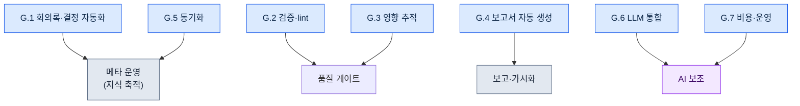

# 부록 G. 운영 스크립트 사례집

이 부록은 본문에서 언급한 운영 자동화 스크립트들을 한자리에 모은 사례집이다. 본문은 각 스크립트가 "왜 필요한가"를 흐름 속에서 설명했지만, 막상 비슷한 도구를 만들려면 "어떤 스크립트들이 어떤 역할로 묶여 있는가"를 한눈에 보는 지도가 필요하다. 이 부록이 그 지도다.

스크립트 이름과 한 줄 설명, 그리고 본문 어느 절에서 다뤘는지를 함께 적었습니다. 일반화가 깔끔하게 되는 핵심 스크립트(G.1.1 양식 검사·G.2.1 정합성 검사·G.3.1 관계도·G.7.1 비용 트래커)와 G.8의 테스트·hook 예시는 회사 자료와 무관한 일반 골격으로 새로 작성해 그대로 실행되도록 검증한 실코드를 실었습니다. 입력 예시와 출력, 종료 코드까지 실제로 돌려 확인한 값입니다. 나머지 항목은 이름·역할·연결 본문 절만 적었는데, 그 이유는 부록 G.9에서 정직하게 밝힙니다. 독자는 실코드 항목을 본보기 삼아 자신의 환경에 맞는 구현을 직접 만들면 됩니다.

쓰는 방법은 이렇다. 자동화하고 싶은 작업의 성격(검증인지, 보고서 생성인지, 동기화인지)을 먼저 정하고, 해당하는 절(G.1\~G.7)을 펼친다. 거기서 가장 가까운 스크립트를 고른 뒤, 괄호 안의 본문 절 번호로 가서 맥락과 설계 의도를 확인한다. 마지막으로 G.8의 운영 원칙에 비춰 자신의 스크립트가 그 원칙을 지키는지 점검한다.

전체 스크립트를 역할별로 묶으면 다음과 같다.



---

## G.1 회의록·결정 자동화

회의에서 나온 결정이 흩어지지 않고 지식 자산으로 쌓이게 하는 스크립트 묶음이다. 회의록 검증부터 atom 추출, 정식 승격까지 한 줄기로 이어진다.

### G.1.1 meeting_lint.py

회의록이 정해진 양식(필수 머리말·필수 섹션)을 갖췄는지 검사하는 스크립트. 양식이 흐트러진 회의록은 이후 자동 추출이 깨지므로 입구에서 막는다 (17.2.2).

아래는 회사 자료와 무관한 일반 골격이다. 표준 라이브러리(sys만)로 쓰며 그대로 실행된다. 마크다운 회의록의 머리말(`---`로 감싼 블록) 키와 본문 섹션 머리(`## ...`)가 모두 있는지 본다. 빠진 게 있으면 violation을 내고 exit 1, 모두 있으면 exit 0이다.

```python
#!/usr/bin/env python3
"""meeting_lint.py

마크다운 회의록이 정해진 양식을 갖췄는지 검사한다.
- 머리말(--- 블록) 안에 필수 키가 모두 있는지.
- 본문에 필수 섹션 머리(## ...)가 모두 있는지.
빠진 항목이 있으면 violation을 출력하고 exit 1, 없으면 exit 0.
표준 라이브러리만 사용한다.

사용:
    python meeting_lint.py meeting.md
"""
import sys

REQUIRED_FRONTMATTER = ["type", "date", "category", "attendees"]
REQUIRED_SECTIONS = ["## 안건", "## 결정", "## 액션 아이템", "## 다음 회의"]


def lint(text):
    """회의록 본문 문자열을 받아 빠진 항목 목록(violation)을 돌려준다."""
    violations = []

    # 머리말: 첫 줄이 ---이면 다음 ---까지를 머리말로 본다.
    lines = text.splitlines()
    front = []
    if lines and lines[0].strip() == "---":
        for line in lines[1:]:
            if line.strip() == "---":
                break
            front.append(line)
    front_keys = [ln.split(":", 1)[0].strip() for ln in front if ":" in ln]
    for key in REQUIRED_FRONTMATTER:
        if key not in front_keys:
            violations.append({"kind": "frontmatter", "missing": key})

    # 섹션: 본문에 해당 머리 줄이 그대로 있는지.
    body_lines = [ln.strip() for ln in lines]
    for section in REQUIRED_SECTIONS:
        if section not in body_lines:
            violations.append({"kind": "section", "missing": section})

    return violations


def main(argv=None):
    argv = sys.argv[1:] if argv is None else argv
    if len(argv) != 1:
        sys.stderr.write("사용: python meeting_lint.py meeting.md\n")
        return 2
    with open(argv[0], encoding="utf-8") as f:
        violations = lint(f.read())

    for v in violations:
        print(f"[VIOLATION] {v['kind']}: {v['missing']}")
    if violations:
        sys.stderr.write(f"[FAIL] 양식 위반 {len(violations)}건\n")
        return 1
    sys.stderr.write("[PASS] 양식 충족\n")
    return 0


if __name__ == "__main__":
    sys.exit(main())
```

상수 두 개가 검사 기준이다. 예를 들어 머리말에 `attendees`가 빠지고 본문에 `## 다음 회의`가 없는 회의록을 넣으면 다음처럼 두 건이 잡히고 종료 코드는 1이다.

```text
[VIOLATION] frontmatter: attendees
[VIOLATION] section: ## 다음 회의
```

### G.1.2 decision_parser.py

회의록의 "결정" 섹션을 읽어 지식 atom 후보를 자동으로 뽑아내는 스크립트. 사람이 일일이 옮겨 적던 작업을 대신한다 (17.2.3).

### G.1.3 promote.py

검토 대기(pending) 상태의 atom을 정식 atom 폴더로 승격하는 스크립트. 자동 추출과 정식 자산 사이에 사람 검수 게이트를 둔다 (17.2.6).

---

## G.2 검증·lint

데이터와 콘텐츠가 규칙을 어기지 않았는지 자동으로 잡아내는 품질 게이트다. 사람의 눈으로 놓치기 쉬운 일관성 오류를 기계가 먼저 거른다.

### G.2.1 integrity_check_id_uniqueness.py

데이터 항목의 ID가 중복 없이 유일한지 검증하는 스크립트. ID 충돌은 런타임에 가서야 터지는 사고이므로 데이터 단계에서 막는다 (10.1.2).

아래는 회사 자료와 무관한 일반 골격이다. 표준 라이브러리(csv·json·sys·argparse)만 쓰며, 그대로 저장해 바로 실행된다. 입력은 어떤 게임 데이터든 가질 법한 단순한 형식, 즉 `id` 열을 가진 CSV다.

```python
#!/usr/bin/env python3
"""integrity_check_id_uniqueness.py

CSV 데이터의 id 열이 유일한지 검사한다.
- 중복 id가 있으면 violation 목록을 출력하고 exit 1.
- 모두 유일하면 exit 0.
표준 라이브러리만 사용한다.

사용:
    python integrity_check_id_uniqueness.py data.csv
    python integrity_check_id_uniqueness.py data.csv --id-column quest_id
"""
import argparse
import csv
import json
import sys


def find_duplicate_ids(rows, id_column):
    """rows(딕셔너리 리스트)에서 id_column 값의 중복을 찾는다.

    반환: violation 리스트. 각 항목은
    {"id": 값, "row_numbers": [1-based 행 번호, ...]} 형태.
    헤더를 1행으로 보고 데이터 첫 행을 2로 센다.
    """
    seen = {}  # id 값 -> 등장한 행 번호 리스트
    for index, row in enumerate(rows):
        row_number = index + 2  # 헤더(1행) 다음부터
        key = row.get(id_column, "")
        seen.setdefault(key, []).append(row_number)

    violations = []
    for key, row_numbers in seen.items():
        if len(row_numbers) > 1:
            violations.append({"id": key, "row_numbers": row_numbers})
    violations.sort(key=lambda v: v["row_numbers"][0])
    return violations


def load_rows(csv_path):
    with open(csv_path, newline="", encoding="utf-8") as f:
        return list(csv.DictReader(f))


def main(argv=None):
    parser = argparse.ArgumentParser(description="CSV id 유일성 검사")
    parser.add_argument("csv_path", help="검사할 CSV 파일 경로")
    parser.add_argument("--id-column", default="id", help="id로 쓸 열 이름 (기본: id)")
    args = parser.parse_args(argv)

    rows = load_rows(args.csv_path)
    violations = find_duplicate_ids(rows, args.id_column)

    # G.8 출력 표준: violation_list를 JSON으로 표준출력에 낸다.
    print(json.dumps({"violation_list": violations}, ensure_ascii=False, indent=2))

    if violations:
        sys.stderr.write(f"[FAIL] 중복 id {len(violations)}건 발견\n")
        return 1
    sys.stderr.write("[PASS] 중복 id 없음\n")
    return 0


if __name__ == "__main__":
    sys.exit(main())
```

입력 예시(`data.csv`):

```text
id,name
Q001,첫 의뢰
Q002,잃어버린 노리개
Q001,첫 의뢰(중복)
```

실행 결과는 다음과 같다. `Q001`이 2행과 4행에 두 번 나왔으므로 violation 한 건이 잡히고 종료 코드는 1이다.

```json
{
  "violation_list": [
    {
      "id": "Q001",
      "row_numbers": [2, 4]
    }
  ]
}
```

### G.2.2 voice_lint.py

NPC 대사의 보이스(말투·성격) 일관성을 검사하는 스크립트. 같은 캐릭터가 챕터마다 다른 말투를 쓰는 어긋남을 잡는다 (5.2·5.4).

### G.2.3 visual_regression.py

자원(아트·UI 등)이 바뀌었을 때 의도치 않은 시각적 변화가 생겼는지 비교하는 회귀 검사 스크립트 (12.1.5).

---

## G.3 영향 추적

하나를 바꾸면 무엇이 따라 흔들리는지 추적하는 스크립트 묶음이다. 문서·결정·자원 사이의 연결을 따라가며 변경의 파급 범위를 보여 준다.

### G.3.1 wikilink_graph.py

문서 간 Wikilink(`[[대상]]`)를 긁어 연결 그래프를 자동으로 구축하는 스크립트. 어떤 문서가 어떤 문서를 참조하는지 한눈에 보게 한다 (24.3.4).

아래는 회사 자료와 무관한 일반 골격이다. 표준 라이브러리(os·re·json·argparse)만 쓴다. 한 폴더 안의 `.md` 파일들을 읽어 파일 이름(확장자 제외)을 노드로, `[[...]]` 링크를 엣지로 본다. 결과로 인접 리스트와 Mermaid 도식 코드를 함께 낸다.

```python
#!/usr/bin/env python3
"""wikilink_graph.py

폴더 안 .md 문서들의 [[Wikilink]] 연결을 그래프로 만든다.
- 노드: 확장자를 뺀 파일 이름.
- 엣지: 문서 본문의 [[대상]] 표기. [[대상|표시]] 형태면 대상만 본다.
표준 라이브러리만 사용한다.

사용:
    python wikilink_graph.py ./docs
    python wikilink_graph.py ./docs --format mermaid
"""
import argparse
import json
import os
import re
import sys

WIKILINK = re.compile(r"\[\[([^\]|#]+)")  # [[대상]] / [[대상|표시]] / [[대상#앵커]]


def extract_links(text):
    """본문에서 링크 대상 이름들을 등장 순서대로, 중복 없이 뽑는다."""
    result = []
    for match in WIKILINK.findall(text):
        target = match.strip()
        if target and target not in result:
            result.append(target)
    return result


def build_graph(doc_dir):
    """폴더 안 .md를 훑어 {문서이름: [링크 대상, ...]} 인접 리스트를 만든다."""
    graph = {}
    for name in sorted(os.listdir(doc_dir)):
        if not name.endswith(".md"):
            continue
        node = name[:-3]
        path = os.path.join(doc_dir, name)
        with open(path, encoding="utf-8") as f:
            graph[node] = extract_links(f.read())
    return graph


def to_mermaid(graph):
    """인접 리스트를 Mermaid flowchart 코드 문자열로 바꾼다."""
    lines = ["flowchart LR"]
    for node, targets in graph.items():
        if not targets:
            lines.append(f'    {_id(node)}["{node}"]')
        for target in targets:
            lines.append(f'    {_id(node)}["{node}"] --> {_id(target)}["{target}"]')
    return "\n".join(lines)


_ID_CACHE = {}


def _id(name):
    """Mermaid 노드 id는 ASCII여야 한다. 한글 이름은 처음 본 순서대로
    n1, n2, ... 짧은 ASCII id를 붙이고, 라벨[...]에 원래 이름을 보존한다."""
    if name not in _ID_CACHE:
        _ID_CACHE[name] = "n%d" % (len(_ID_CACHE) + 1)
    return _ID_CACHE[name]


def main(argv=None):
    parser = argparse.ArgumentParser(description="Wikilink 연결 그래프 빌더")
    parser.add_argument("doc_dir", help="문서(.md)가 들어 있는 폴더")
    parser.add_argument("--format", choices=["json", "mermaid"], default="json")
    args = parser.parse_args(argv)

    graph = build_graph(args.doc_dir)
    if args.format == "mermaid":
        print(to_mermaid(graph))
    else:
        print(json.dumps(graph, ensure_ascii=False, indent=2))
    return 0


if __name__ == "__main__":
    sys.exit(main())
```

입력 예시(폴더 `docs/` 안 세 파일):

```text
docs/세계관.md     본문에 [[지역_한양]] 과 [[세력_의금부]] 링크
docs/지역_한양.md  본문에 [[세력_의금부]] 링크
docs/세력_의금부.md  링크 없음
```

`--format mermaid`로 실행하면 다음 도식 코드가 나온다. 노드는 파일 이름 순서(세계관 → 세력_의금부 → 지역_한양)로 처리되고, 라벨 안에 원래 한글 이름이 그대로 남는다. 어느 문서가 어디로 뻗는지, 끝점(`세력_의금부`)이 무엇인지 한눈에 보인다.

```text
flowchart LR
    n1["세계관"] --> n2["지역_한양"]
    n1["세계관"] --> n3["세력_의금부"]
    n3["세력_의금부"]
    n2["지역_한양"] --> n3["세력_의금부"]
```

### G.3.2 decision_impact.sh

특정 결정 카드가 어떤 문서·자원에 영향을 미치는지 분석하는 스크립트. 결정을 뒤집기 전에 파급 범위를 먼저 확인한다 (18.4.3).

### G.3.3 find_skills_using.py

특정 자원을 사용하는 스킬들을 역으로 찾아내는 스크립트. 자원을 수정·삭제하기 전에 의존하는 곳을 파악한다 (11.2.4).

---

## G.4 보고서 자동 생성

흩어진 데이터를 사람이 읽을 수 있는 보고서·도식으로 묶어 내는 스크립트다. 반복되는 정기 보고를 자동화해 손이 가는 일을 줄인다.

### G.4.1 alpha_gap_report_generator.py

알파 단계의 목표 대비 부족분(gap)을 집계해 주간 보고서로 자동 생성하는 스크립트 (10.3.3).

### G.4.2 decision_graph_to_mermaid.py

결정 카드들의 연결 관계를 Mermaid 도식 코드로 변환하는 스크립트. 결정 흐름을 그림으로 본다 (24.2.3).

### G.4.3 weekly_kpi_summary.py

주요 지표(KPI)를 주간 단위로 요약하는 스크립트 (13.2).

---

## G.5 동기화

여러 위치에 흩어진 자료를 효율적으로 맞추는 스크립트다. 전체를 매번 복사하지 않고 바뀐 부분만 골라 동기화한다.

### G.5.1 incremental_sync.py

회의록을 전부가 아니라 변경분만 골라 동기화하는 스크립트. 자료가 쌓일수록 전체 복사는 느려지므로 증분 방식을 쓴다 (17.5.4).

### G.5.2 git diff 기반 변경 감지

git의 diff를 활용해 무엇이 바뀌었는지 효율적으로 감지하는 방식. 별도 추적 장치 없이 git 자체를 변경 감지기로 쓴다 (17.5.4.1).

---

## G.6 LLM 통합

분류·호출처럼 판단이 필요한 작업을 LLM에 맡기는 스크립트다. 규칙으로 딱 떨어지지 않는 일을 LLM 보조로 처리한다.

### G.6.1 faq_classifier.py

들어온 FAQ를 카테고리별로 자동 분류하는 스크립트 (13.1.3).

### G.6.2 meeting_classifier.py

회의를 성격별 카테고리로 자동 분류하는 스크립트. 회의록 머리말의 category를 채우는 데 쓴다 (17.3.6).

### G.6.3 prompt_library_loader.py

미리 정리해 둔 프롬프트 라이브러리에서 필요한 프롬프트를 불러오는 스크립트. 같은 프롬프트를 매번 다시 쓰지 않게 한다 (22.1.2).

---

## G.7 비용·운영

자동화 자체가 비용과 자료 추적의 사각지대를 만들지 않도록 관리하는 스크립트다.

### G.7.1 llm_cost_tracker.py

LLM 호출 비용을 추적하고 상한(cap)을 적용하는 스크립트. 비용 폭증을 사후가 아니라 사전에 막는다 (22.3.5).

아래는 회사 자료와 무관한 일반 골격이다. 표준 라이브러리(json·os·argparse)만 쓴다. 호출마다 토큰 수를 기록하고 누적 비용을 계산하며, 상한을 넘으면 거부 신호(exit 2)를 낸다. 단가는 코드 안 상수이며 실제 값은 각자 쓰는 모델 단가표로 바꾸면 된다(아래 값은 설명용 자리표시).

```python
#!/usr/bin/env python3
"""llm_cost_tracker.py

LLM 호출 토큰을 누적 기록하고 일일 비용 상한을 검사한다.
- record: 한 번의 호출(입력/출력 토큰)을 ledger 파일에 더한다.
- 누적 비용이 cap을 넘으면 exit 2로 호출을 막는다(사전 차단).
표준 라이브러리만 사용한다.

사용:
    python llm_cost_tracker.py --ledger ledger.json --in 1200 --out 800
    python llm_cost_tracker.py --ledger ledger.json --in 1200 --out 800 --cap-usd 5.0
"""
import argparse
import json
import os
import sys

# 단가: 1,000 토큰당 USD. 설명용 자리표시 값 — 실제 모델 단가표로 교체할 것.
PRICE_PER_1K_INPUT = 0.003
PRICE_PER_1K_OUTPUT = 0.015


def cost_of(in_tokens, out_tokens):
    """입력/출력 토큰으로 한 호출의 비용(USD)을 계산한다."""
    return (in_tokens / 1000) * PRICE_PER_1K_INPUT + (out_tokens / 1000) * PRICE_PER_1K_OUTPUT


def load_ledger(path):
    if os.path.exists(path):
        with open(path, encoding="utf-8") as f:
            return json.load(f)
    return {"calls": 0, "in_tokens": 0, "out_tokens": 0, "total_usd": 0.0}


def save_ledger(path, ledger):
    with open(path, "w", encoding="utf-8") as f:
        json.dump(ledger, f, ensure_ascii=False, indent=2)


def main(argv=None):
    parser = argparse.ArgumentParser(description="LLM 비용 추적·상한")
    parser.add_argument("--ledger", required=True, help="누적 기록 JSON 파일 경로")
    parser.add_argument("--in", dest="in_tokens", type=int, required=True, help="이번 호출 입력 토큰")
    parser.add_argument("--out", dest="out_tokens", type=int, required=True, help="이번 호출 출력 토큰")
    parser.add_argument("--cap-usd", type=float, default=None, help="누적 비용 상한(USD). 넘으면 차단")
    args = parser.parse_args(argv)

    ledger = load_ledger(args.ledger)
    this_cost = cost_of(args.in_tokens, args.out_tokens)

    ledger["calls"] += 1
    ledger["in_tokens"] += args.in_tokens
    ledger["out_tokens"] += args.out_tokens
    ledger["total_usd"] = round(ledger["total_usd"] + this_cost, 6)
    save_ledger(args.ledger, ledger)

    print(json.dumps({"this_call_usd": round(this_cost, 6), "ledger": ledger}, ensure_ascii=False, indent=2))

    if args.cap_usd is not None and ledger["total_usd"] > args.cap_usd:
        sys.stderr.write(f"[CAP] 누적 {ledger['total_usd']} USD > 상한 {args.cap_usd} USD — 차단\n")
        return 2
    return 0


if __name__ == "__main__":
    sys.exit(main())
```

입력 예시와 결과. 빈 상태에서 입력 1,200·출력 800 토큰을 기록하면 이번 호출 비용은 `1200/1000*0.003 + 800/1000*0.015 = 0.0036 + 0.012 = 0.0156` USD다.

```json
{
  "this_call_usd": 0.0156,
  "ledger": {
    "calls": 1,
    "in_tokens": 1200,
    "out_tokens": 800,
    "total_usd": 0.0156
  }
}
```

`--cap-usd 0.01`을 함께 주면 누적 0.0156이 상한 0.01을 넘으므로 종료 코드 2로 다음 호출을 막는다. 이것이 "사후가 아니라 사전에 막는다"의 실제 동작이다.

### G.7.2 source_tracker.py

인용·참고한 자료의 출처를 자동으로 기록하는 스크립트. 나중에 출처를 되짚을 수 있게 남긴다 (24.5.4).

---

## G.8 스크립트 운영 원칙

스크립트를 많이 만드는 것보다, 만든 스크립트가 신뢰할 수 있게 도는 것이 더 중요하다. 아래 다섯 원칙은 위의 모든 스크립트에 공통으로 적용된다.

| 원칙 | 설명 |
|---|---|
| 단순함 | 복잡한 라이브러리 회피 |
| 테스트 | 모든 스크립트 단위 테스트 |
| 출력 표준 | violation_list 등 표준 (10.1.7) |
| 버전 관리 | git |
| 사용자 검수 게이트 | 자동화도 사람 검수 |

특히 마지막 원칙이 중요합니다. 자동화는 사람을 대체하는 것이 아니라 사람의 판단 앞 단계를 줄이는 것입니다. 검증·추출·생성 어느 것이든 최종 적용 전에 사람이 한 번 보는 게이트를 반드시 둡니다.

### G.8.1 단위 테스트 예시

"테스트" 원칙을 말로만 두지 않고, G.2.1의 핵심 함수 `find_duplicate_ids`를 표준 라이브러리 `unittest`로 검증하는 실제 테스트를 둔다. 외부 의존성이 없으므로 그대로 저장해 `python -m unittest test_integrity_check -v`로 돌린다. 검증할 함수가 파일 입출력에서 분리되어 있어야 이렇게 쉽게 테스트된다는 점이 핵심이다(그래서 G.2.1에서 검사 로직과 `load_rows`를 나눠 두었다).

```python
# test_integrity_check.py
import unittest

from integrity_check_id_uniqueness import find_duplicate_ids


class TestFindDuplicateIds(unittest.TestCase):
    def test_no_duplicates_returns_empty(self):
        rows = [{"id": "Q001"}, {"id": "Q002"}]
        self.assertEqual(find_duplicate_ids(rows, "id"), [])

    def test_one_duplicate_reports_row_numbers(self):
        rows = [{"id": "Q001"}, {"id": "Q002"}, {"id": "Q001"}]
        self.assertEqual(
            find_duplicate_ids(rows, "id"),
            [{"id": "Q001", "row_numbers": [2, 4]}],
        )

    def test_missing_column_treated_as_empty_string(self):
        rows = [{"name": "a"}, {"name": "b"}]
        result = find_duplicate_ids(rows, "id")
        self.assertEqual(result, [{"id": "", "row_numbers": [2, 3]}])


if __name__ == "__main__":
    unittest.main()
```

실행하면 세 테스트가 모두 통과한다.

```text
test_missing_column_treated_as_empty_string ... ok
test_no_duplicates_returns_empty ... ok
test_one_duplicate_reports_row_numbers ... ok

----------------------------------------------------------------------
Ran 3 tests in 0.000s

OK
```

### G.8.2 hook의 조용한 실패(exit 0)

위 원칙 중 빠지기 쉬운 것이 hook의 실패 처리다. 커밋 전이나 저장 시 자동으로 도는 hook은 본래 작업(커밋·저장)의 곁가지여야 한다. 그런데 hook이 내부 오류로 0이 아닌 종료 코드를 내면, 그 hook을 묶어 둔 본 작업까지 통째로 막혀 버린다. 보조 장치가 본체를 인질로 잡는 셈이다. 그래서 보조 성격의 hook은 내부에서 무슨 일이 생기든 경고만 표준오류(stderr)로 남기고 종료 코드는 0으로 돌려 본 작업을 막지 않게 만든다. 다음이 그 최소 형태이며, 내부에서 예외가 나도 종료 코드는 0이다.

```python
import sys

def run_hook():
    raise RuntimeError("내부 오류 발생")

def main():
    try:
        run_hook()
    except Exception as exc:
        sys.stderr.write(f"[hook] 경고: {exc} — 본 작업은 막지 않음\n")
    return 0  # 보조 hook은 무슨 일이 있어도 본 작업을 막지 않는다

if __name__ == "__main__":
    sys.exit(main())
```

실행하면 경고는 보이되 종료 코드는 0이다. 즉 사람은 무엇이 어긋났는지 알 수 있고, 작업 흐름은 끊기지 않는다.

```text
[hook] 경고: 내부 오류 발생 — 본 작업은 막지 않음
(종료 코드 0)
```

다만 이 "조용한 실패"는 보조 hook에만 쓴다. G.2의 품질 게이트처럼 통과 여부 자체가 목적인 검증은 반대로 실패 시 0이 아닌 코드(앞서 본 exit 1)를 내어 파이프라인을 멈춰야 한다. 같은 hook 자리라도 "보조"냐 "게이트"냐에 따라 종료 코드 정책이 정반대라는 점을 구분한다.

### G.8.3 조용한 실패를 어떻게 알아채고 되살리는가

앞 절의 exit 0 정책에는 대가가 하나 있다. 보조 hook이 무슨 일이 있어도 본 작업을 막지 않는다는 건, 뒤집으면 **hook이 조용히 죽어도 본 작업은 멀쩡히 굴러간다**는 뜻이다. 컨텍스트 자동 주입처럼 곁가지에서 도는 hook은 며칠을 안 돌아도 작업 흐름에 빨간불이 안 켜진다. 그래서 보조 hook에는 "실패해도 안 막는다"와 함께 "실패를 사람이 뒤늦게라도 본다"는 짝꿍 장치가 반드시 따라야 한다. 짝이 빠지면 어느 날 회고에서 "이 atom이 요즘 한 번도 안 떴네"를 발견하고 나서야 hook이 일주일째 죽어 있었음을 알게 된다.

그 짝꿍이 로그다. 앞 절의 최소 형태(`sys.stderr.write(...)`)가 남기는 경고를 휘발시키지 말고 파일로 떨어뜨려, 정상 호출은 한 줄, 실패 호출은 사유와 함께 한 줄을 남긴다. 저자 환경에서는 이 흔적이 `~/.claude/hooks/_injection_log.txt`에 쌓인다(같은 로그를 §21.3.4의 발동 검증에서도 읽는다). 운영 루프는 거창하지 않다. 세 단계의 점검·복구 절차 한 바퀴면 된다.

| 단계 | 무엇을 보나 | 무엇을 하나 |
|---|---|---|
| 감지 | 로그에 최근 정상 주입 줄이 끊겼거나 같은 사유의 실패 줄이 반복되는가 | 주간 회고에서 로그 꼬리 한 번 훑기(자동 캡처 한 줄로 충분) |
| 격리 | 실패 사유가 hook 자체 버그인가, 입력 데이터(깨진 manifest·없는 atom 파일)인가 | stderr 사유 문자열로 둘을 가른다 — 코드 문제면 코드, 데이터 문제면 manifest |
| 복구 | 트리거로 다시 정상 주입이 뜨는가 | 고친 뒤 새 세션에서 의도한 트리거를 한 번 입력해 로그에 정상 줄이 다시 남는지 확인(§21.3.4의 발동 검증과 동일) |

핵심은 "감지"를 사람의 주의력이 아니라 **로그 한 파일과 회고 한 줄**에 맡긴다는 점이다. exit 0이 막아 준 건 본 작업의 중단이지 실패의 은폐가 아니다. 실패는 stderr→로그로 드러내고, 회고가 그 로그를 주기적으로 들여다보며, 복구는 평소 쓰는 발동 검증을 그대로 재사용한다. 이렇게 "안 막는다 + 드러낸다 + 주기적으로 본다 + 같은 방식으로 되살린다"가 한 묶음일 때만, 조용한 실패가 조용한 방치로 굳지 않는다.

---

## G.9 독자 참고

이 사례집의 코드는 두 종류다. 하나는 G.1.1·G.2.1·G.3.1·G.7.1·G.8처럼 회사 자료와 무관한 일반 골격으로 새로 작성해 그대로 실행되도록 검증한 코드다. 표준 라이브러리만 쓰며, 위에 적은 입력 예시·출력·종료 코드는 모두 실제로 돌려 확인한 결과다. 복붙해서 바로 쓰고, 단가표나 열 이름 같은 자리표시 값만 자기 환경에 맞게 바꾸면 된다.

다른 하나는 나머지 절처럼 이름·역할·연결 본문 절만 적은 항목이다. 이쪽을 전체 코드로 싣지 않은 이유는 정직하게 말해 둘이다. 첫째, 회사 운영 스크립트 원본은 회사 IP라 그대로 옮길 수 없다. 둘째, 그 로직 상당수는 회사 고유의 데이터 스키마·폴더 구조·결정 카드 양식에 묶여 있어, 그 전제를 들어내고 나면 일반 독자에게 그대로 쓸모 있는 코드가 남지 않는다. 그래서 일반화가 깔끔하게 되는 네 개(양식 검사·정합성 검사·관계도·비용 트래커)만 실코드로 승격하고, 나머지는 골격으로 남겼다. 독자는 이 네 개를 본보기 삼아 같은 방식 — 검사 로직과 입출력을 분리하고, 표준 출력으로 violation 목록을 내고, 단위 테스트를 붙이는 방식 — 으로 자신의 환경에 맞는 구현을 직접 만들면 된다.

기존 도구를 가져다 변주하는 절차는 부록 B를 참고한다.
