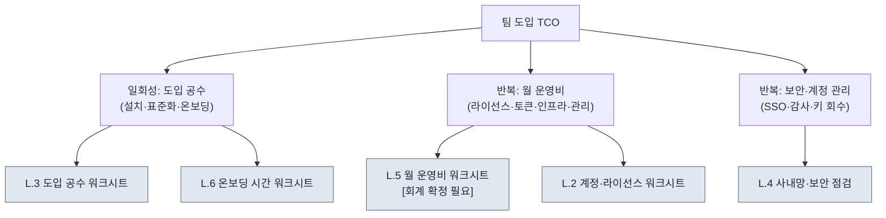

# 부록 L. 팀 도입 TCO·온보딩 워크시트

> 이 부록은 "1인 6개월 시스템을 중규모 팀으로 확장할 때, 도입 공수·운영비·계정·사내망 보안을 무엇으로 어떻게 추정하는가"라는 스튜디오 PD·대표의 질문에 답하기 위한 빈칸 채우기형 워크시트입니다. 본문 19.3(AI 도입 전략과 경영진 설득)이 "ROI를 가공하지 말라"고 했다면, 이 부록은 그 원칙을 도입 비용 쪽에도 그대로 적용합니다. 즉 **이 부록은 숫자를 제공하지 않습니다.** 모든 칸은 빈칸이고, 그 칸을 채우는 것은 당신 팀의 측정·추정이며, `[회계 확정 필요]`로 표시된 칸은 회계가 채우기 전까지 누구도 추정으로 메우지 않습니다.

이 부록을 쓰는 법은 이렇습니다. 먼저 L.1에서 TCO(Total Cost of Ownership, 총소유비용)가 어떤 항목으로 쪼개지는지 그림으로 잡으십시오. 그다음 L.2\~L.6의 다섯 워크시트를 자신의 팀 규모 행에 맞춰 빈칸인 채로 출력해, 직접 측정하거나 회계·정보보안 담당에게 한 줄 질문으로 넘기십시오. 마지막 L.7의 자가 점검표로 빠진 칸이 없는지 확인하면 됩니다. 이 부록의 가치는 채워진 숫자가 아니라 **빠뜨리기 쉬운 비용 항목을 미리 칸으로 만들어 두는 것**에 있습니다.

---

## L.1 TCO는 라이선스 요금이 아니다

PD가 가장 자주 빠뜨리는 함정은 도입 비용을 "구독료 × 인원"으로만 보는 것입니다. 실제 총소유비용은 그보다 넓습니다. 한 번 내고 끝나는 **도입 공수**(설치·표준화·온보딩)와, 매달 반복되는 **운영비**(라이선스·토큰·인프라·관리 인건)로 갈라지고, 그 위에 눈에 안 보이는 **보안·계정 관리** 비용이 얹힙니다.

세 줄기 가운데 PD가 과소평가하기 쉬운 쪽은 왼쪽(도입 공수)과 오른쪽(보안·계정)입니다. 라이선스 요금은 견적서에 적혀 오지만, "1인이 6개월간 손으로 쌓은 표준·스킬을 팀이 공유 가능한 형태로 정리하는 공수"와 "사내망에 외부 LLM 호출을 어디까지 허용할지 정하는 보안 검토"는 견적서에 없고, 그래서 항상 일정과 예산을 초과시킵니다. 이 부록의 워크시트는 그 안 보이는 비용을 빈칸으로라도 먼저 드러내는 데 목적이 있습니다.

> 본문 19.3.6은 "비용은 절대값을 책에 싣지 않는다 — 회계에서 받아 채울 빈칸이다"라고 했습니다. 이 부록은 그 빈칸을 어디에 두어야 하는지를 항목별로 펼친 것입니다.

---

## L.2 계정·라이선스 워크시트

가장 먼저 채우는 표입니다. 누가 어떤 도구를 쓰고, 그 권한이 어떻게 발급·회수되는지를 인원수와 함께 적습니다. 인원 칸은 당신 팀의 실제 머릿수로 채우고, 단가 칸은 견적서나 공개 요금표에서 가져와 채웁니다. 이 책은 단가를 적지 않습니다.

| 항목 | 무엇을 적나 | 누가 채우나 | 본인 팀 값 |
|---|---|---|---|
| 도구별 시트 수 | 도구마다 필요한 계정(좌석) 수 | 리드 | ______ 좌석 |
| 권한 등급 분포 | full / 작업별 cap / 외주 1회 인원 (부록 C.1.2) | 리드 | full __명 / 일반 __명 / 외주 __명 |
| 좌석 단가 | 도구별 월 좌석 요금 | 회계·구매 | ______ /좌석·월 |
| 공용 키 여부 | 팀 공용 API 키 vs 개인별 키 | 정보보안 | □ 공용 □ 개인별 |
| 발급 절차 | 신규 입사자 계정 발급 경로·소요 | 리드 | ______ |
| 회수 절차 | 퇴사·외주 종료 시 키/좌석 회수 경로 | 정보보안 | ______ |

규칙은 두 가지입니다. 첫째, **외주·단기 인원은 좌석을 상시 발급하지 말고 작업 단위로 열고 회수**합니다(부록 C.1.2). 둘째, **회수 절차 칸이 비어 있으면 발급을 시작하지 않습니다.** 가장 흔한 사고가 퇴사자 계정이 회수되지 않아 비용과 키 노출이 함께 새는 것이므로, 발급보다 회수를 먼저 설계합니다.

---

## L.3 팀 규모별 도입 공수 워크시트

"1인 6개월"이 팀으로 확장될 때 늘어나는 일회성 공수를 규모별로 추정하는 표입니다. 공수 칸은 **인일(人日, 한 사람이 하루 일한 양)** 단위로, 당신 팀이 실제로 측정하거나 추정해 채웁니다. 이 책은 인일 수를 제공하지 않습니다 — 팀의 숙련도·기존 표준 정리 수준에 따라 크게 달라지기 때문입니다.

| 도입 공수 항목 | 1\~3인 | 4\~10인 | 11\~30인 | 31\~50인 | 측정/추정 주체 |
|---|---|---|---|---|---|
| 환경 설치·세팅 (도구·hook·권한) | ___인일 | ___인일 | ___인일 | ___인일 | 리드/인프라 |
| 1인 자산의 팀 공유화 (스킬·표준·atom 정리) | ___인일 | ___인일 | ___인일 | ___인일 | 리드 |
| 팀 표준 수립 (네이밍·프런트매터·룰북, 부록 D) | ___인일 | ___인일 | ___인일 | ___인일 | 리드 |
| 검증 게이트 구축 (lint·룰북 자동화) | ___인일 | ___인일 | ___인일 | ___인일 | QA/리드 |
| 온보딩 자료 제작 (L.6과 연동) | ___인일 | ___인일 | ___인일 | ___인일 | 리드 |
| 합계 (도입 1회성 공수) | ___인일 | ___인일 | ___인일 | ___인일 | — |

이 표를 채울 때 빠지기 쉬운 칸이 둘째 줄입니다. 1인이 6개월간 머릿속과 개인 폴더에 쌓아 둔 자산은, 팀이 공유하려면 누군가 꺼내 정리하고 문서로 만드는 별도 공수가 듭니다. 이 공수를 "0"으로 잡으면 도입 일정이 반드시 밀립니다. 또한 규모가 커질수록 설치 공수보다 **표준 수립·검증 게이트** 공수가 더 가파르게 늘어난다는 점을 칸의 모양으로 미리 보여 줍니다 — 사람이 늘면 합의해야 할 표준의 수가 늘기 때문입니다.

> 본문 19.3.1의 단계적 도입(보수적→진보적)을 따르면, 이 공수를 한 분기에 다 쓰지 않고 1단계(컨텍스트 주입) 파일럿부터 분산해 들일 수 있습니다. 표의 합계를 한 번에 결재받으려 하지 말고, 1단계 공수만 먼저 떼어 결재받는 것이 현실적입니다.

---

## L.4 사내망·보안 점검 워크시트

PD·대표가 가장 직접적으로 두려워하는 영역입니다. 외부 LLM에 무엇이 나가는지, 사내망에서 외부 호출을 어디까지 허용하는지를 항목별로 점검합니다. 이 표는 합격/보류를 가리는 체크리스트이며(부록 C.6 보안과 연동), 한 항목이라도 미정이면 그 범위의 도입을 보류합니다.

| 점검 항목 | 통과 기준 | 담당 | 상태 |
|---|---|---|---|
| 외부 LLM 전송 데이터 범위 | 민감 데이터는 placeholder/자체 호스팅 (C.6) | 정보보안 | □ 통과 □ 보류 |
| 결제·개인정보 전송 | 예외 없이 전송 금지 명문화 | 정보보안 | □ 통과 □ 보류 |
| 사내망 외부 호출 정책 | 허용 도메인·프록시·로그 보존 기간 정의 | 인프라 | □ 통과 □ 보류 |
| 자체 호스팅 필요 여부 | 핵심 IP는 자체 호스팅 모델로 처리할지 결정 | 대표/정보보안 | □ 결정 □ 미정 |
| 키 노출 사고 대응 | 즉시 교체 + 사용 이력 검토 경로 (C.7) | 정보보안 | □ 통과 □ 보류 |
| 감사 로그 | 누가·언제·무엇을 호출했는지 기록·보존 | 인프라 | □ 통과 □ 보류 |
| 회사 IP 외부 유출 검사 | grep watchlist 등 사전 검사 절차 (부록 B.6) | 리드 | □ 통과 □ 보류 |
| 외주 접근 격리 | 외주 계정은 핵심 자산 접근 차단·작업별 격리 | 정보보안 | □ 통과 □ 보류 |

이 표에서 비용이 가장 크게 갈리는 칸은 넷째 줄(자체 호스팅 필요 여부)입니다. 핵심 IP를 외부 LLM에 절대 보낼 수 없다고 결정하면, 자체 호스팅 인프라 비용이 L.5의 운영비에 통째로 얹힙니다. 그래서 이 결정은 리드가 아니라 **대표·정보보안이 함께** 내려야 하고, 결정 전까지는 L.5의 인프라 칸을 확정할 수 없습니다. 두 워크시트가 이 한 칸으로 연결됩니다.

---

## L.5 월 운영비 워크시트 [회계 확정 필요]

매달 반복되는 비용을 항목별로 분해한 표입니다. **이 표의 금액 칸은 전부 빈칸이며, `[회계 확정 필요]`로 표시된 칸은 회계가 채우기 전까지 누구도 추정으로 메우지 않습니다.** 토큰 단가·구독료·인프라 요금은 모델·호출량·계약에 따라 매달 달라지므로, 이 책은 절대값을 적지 않습니다.

| 운영비 항목 | 산정 방식 | 누가 채우나 | 월 금액 |
|---|---|---|---|
| 라이선스·구독 | 좌석 수 × 좌석 단가 (L.2) | 회계 | [회계 확정 필요] |
| LLM 토큰 비용 | 호출량 × 토큰 단가, 도구별 상한(cap) 합 | 회계 | [회계 확정 필요] |
| 인프라 (자체 호스팅 시) | L.4 결정에 따른 서버·GPU·스토리지 | 회계·인프라 | [회계 확정 필요] |
| 백업·동기화 | 저장소·백업 스토리지 (부록 C.5) | 회계 | [회계 확정 필요] |
| 운영 관리 인건 | 도구·키·로그 관리 담당 시간 환산 | 리드·회계 | [회계 확정 필요] |
| 월 합계 | 위 항목 합 | 회계 | [회계 확정 필요] |

이 표의 규칙은 단 하나, **빈칸을 빈칸으로 둔다**입니다. 본문 19.3.2에서 AI가 운영 비용 칸을 그럴듯하게 `$4,500`으로 날조했던 실패를 떠올리십시오 — 사람이든 AI든 이 칸을 추정으로 메우는 순간, 그 보고는 첫 질문에 무너집니다. 대신 비용을 통제하는 진짜 장치는 금액이 아니라 **도구별 월 상한(cap)이 걸려 있고 초과가 자동 보고되는 구조**입니다(19.3.6). 결재 시 경영진에게 보여 줄 것은 메운 금액이 아니라, "상한이 걸려 있고 초과가 보고된다"는 구조와 회계가 채울 빈칸 목록입니다.

> 다섯째 줄(운영 관리 인건)이 가장 자주 누락됩니다. 도구는 깔아 두면 끝이 아니라, 키를 회수하고 로그를 보고 상한을 조정하는 사람의 시간을 매달 먹습니다. 이 칸을 0으로 두면 그 일이 리드의 보이지 않는 야근으로 숨습니다.

---

## L.6 온보딩 시간 워크시트

신규 멤버 한 명이 시스템 위에서 제 몫을 하기까지 걸리는 시간을 단계별로 추정하는 표입니다. 시간 칸은 당신 팀에서 실제 온보딩을 한 번 시켜 보고 측정하는 것이 가장 정확합니다(본문 19.3.7 베이스라인 측정 레시피와 같은 방식). 측정 전에는 빈칸으로 둡니다.

| 온보딩 단계 | 무엇을 하나 | 측정 시간 | 비고 |
|---|---|---|---|
| 환경 설치 | 도구·hook·계정 세팅까지 | ___시간 | L.2 발급 절차와 연동 |
| 표준 학습 | 네이밍·프런트매터·룰북 숙지 (부록 D) | ___시간 | 자료 있으면 단축 |
| 첫 작업 (보수적) | 컨텍스트 주입으로 첫 산출물·검수 통과 | ___시간 | 19.3.1의 1단계 |
| 검증 게이트 적응 | lint·룰북 게이트에 맞춰 작업 | ___시간 | — |
| 독립 작업 도달 | 감독 없이 작업·채택 판정 가능 | ___일 | 온보딩 완료 기준 |

이 표를 채우면 도입 공수(L.3)의 "온보딩 자료 제작" 칸이 왜 중요한지 드러납니다. 온보딩 자료가 잘 정리돼 있을수록 둘째·셋째 줄의 시간이 짧아지고, 신규 멤버가 늘수록 그 절감이 누적됩니다. 즉 온보딩 자료 제작은 일회성 공수이지만, 회수는 멤버 수만큼 반복됩니다. 본문 19.3.3이 "JIT 자동 주입 221건 — 신규 멤버도 같은 규칙 위에서 작업"이라고 한 것이 이 표에서는 셋째 줄의 시간 단축으로 나타납니다.

> 마지막 줄(독립 작업 도달)이 온보딩의 진짜 완료 기준입니다. 환경 설치가 끝난 것을 온보딩 완료로 착각하면, 감독 비용이 리드에게 계속 쌓입니다. "감독 없이 채택 판정까지 한다"가 기준이어야 합니다.

---

## L.7 도입 전 자가 점검표

마지막으로, 이 워크시트들을 경영진에게 가져가기 전에 스스로 통과시켜야 할 항목입니다. 부록 B.6(차용 전 점검)과 같은 정신으로, 한 항목이라도 비어 있으면 결재를 미루고 그 칸부터 채웁니다.

| 점검 항목 | 통과 기준 |
|---|---|
| 계정 회수 절차가 정의됐는가 | L.2의 회수 절차 칸이 비어 있지 않음 |
| 보안 점검이 모두 통과/결정됐는가 | L.4에 □보류·□미정이 0건 |
| 운영비 빈칸이 회계로 넘어갔는가 | L.5의 [회계 확정 필요]가 질문으로 발송됨 |
| 도입 공수를 단계로 쪼갰는가 | L.3 합계가 아니라 1단계 공수부터 결재 |
| 온보딩 완료 기준이 "독립 작업"인가 | L.6 마지막 줄로 완료를 판정 |
| 추정값을 단언으로 적지 않았는가 | 모든 추정 칸에 "추정·표본 수" 표기 |

이 표를 다섯 칸의 합격으로 읽지 마시고, 여섯 개의 잠금장치로 읽어 주시기 바랍니다. 1인 시스템을 팀으로 확장하는 일은 분명 가능하지만, 그 확장의 비용은 라이선스 요금이 아니라 이 여섯 칸의 빈칸을 정직하게 채웠을 때 비로소 전체 그림이 드러납니다. 그리고 어느 칸도 AI에게 채우라고 시키지 마십시오 — AI는 본문 19.3.2처럼 빈칸을 그럴듯한 숫자로 메웁니다. AI의 자리는 당신이 측정한 값을 받아 결재 슬라이드 문장으로 정리하는 것까지입니다.
